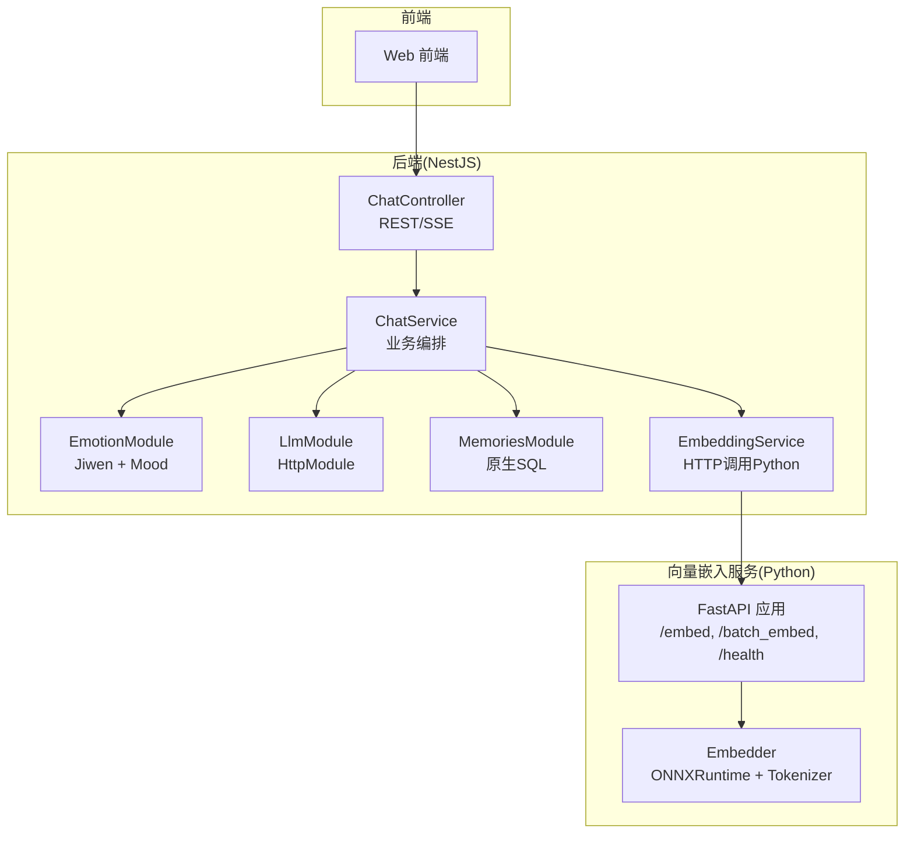
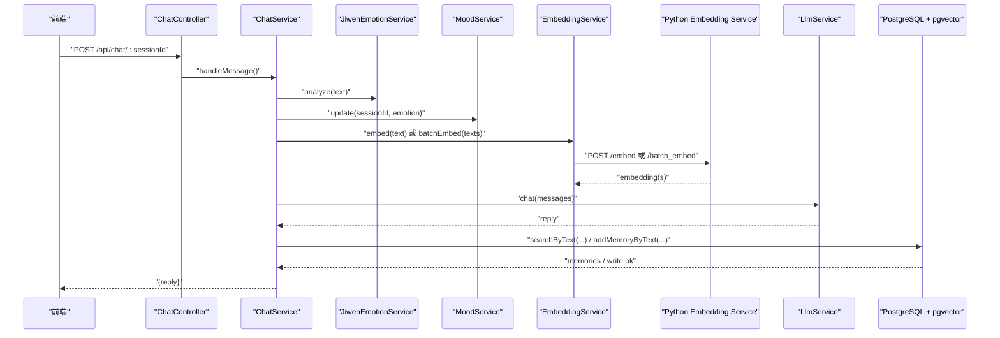
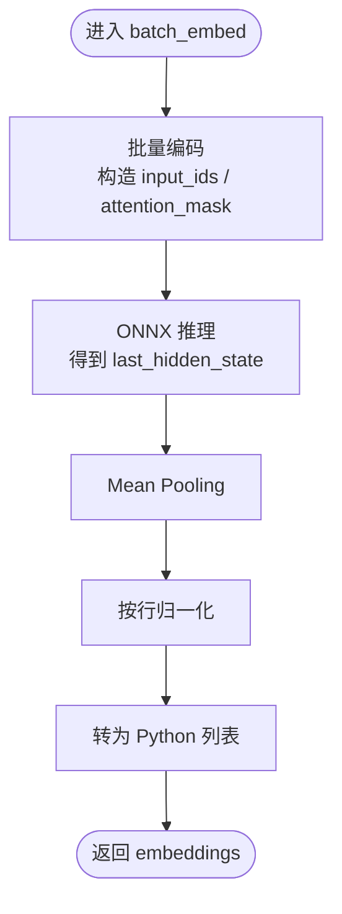
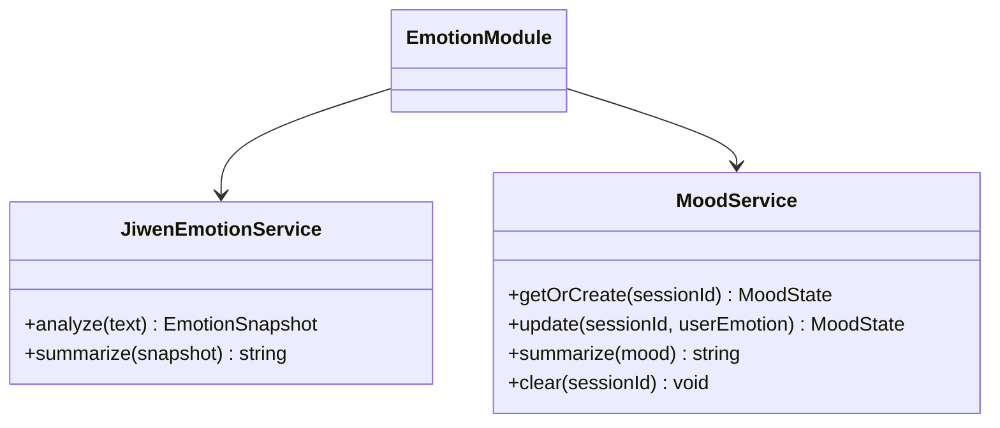
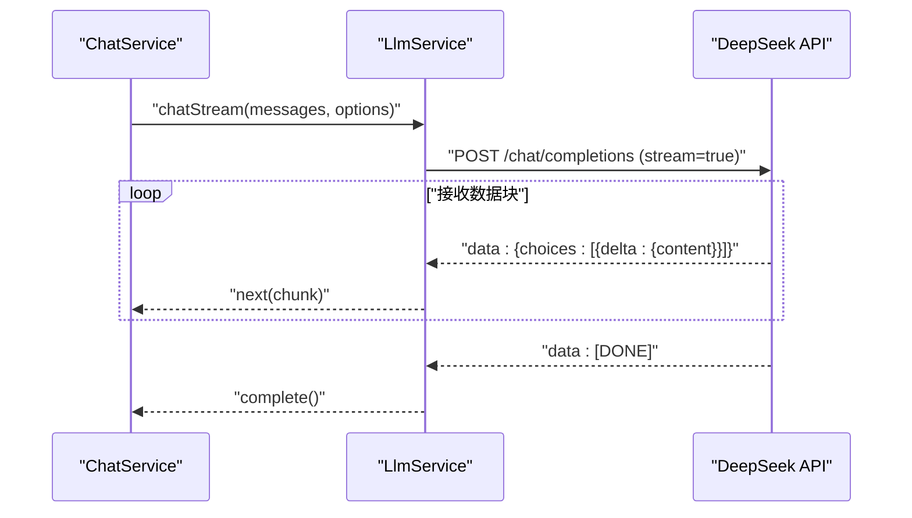
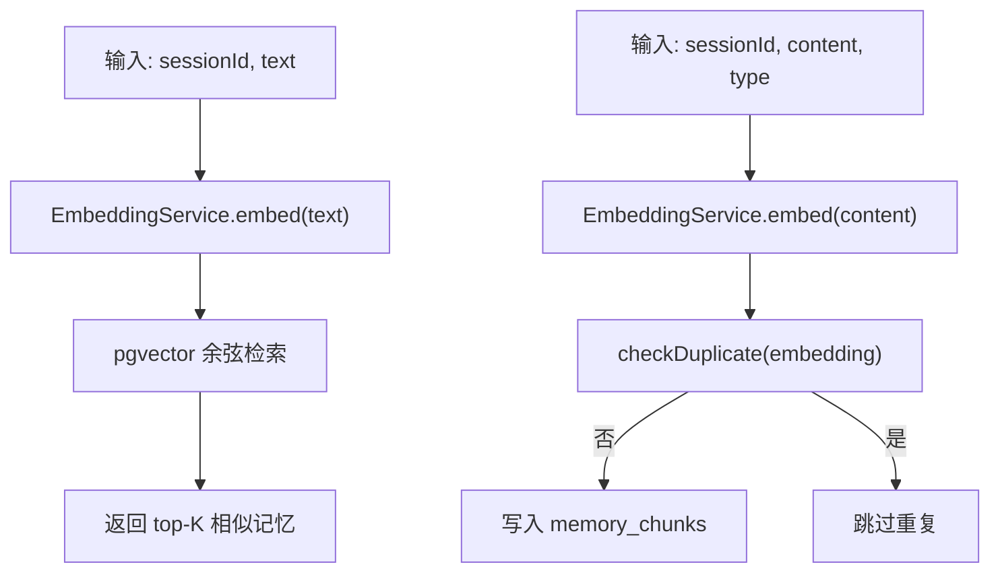
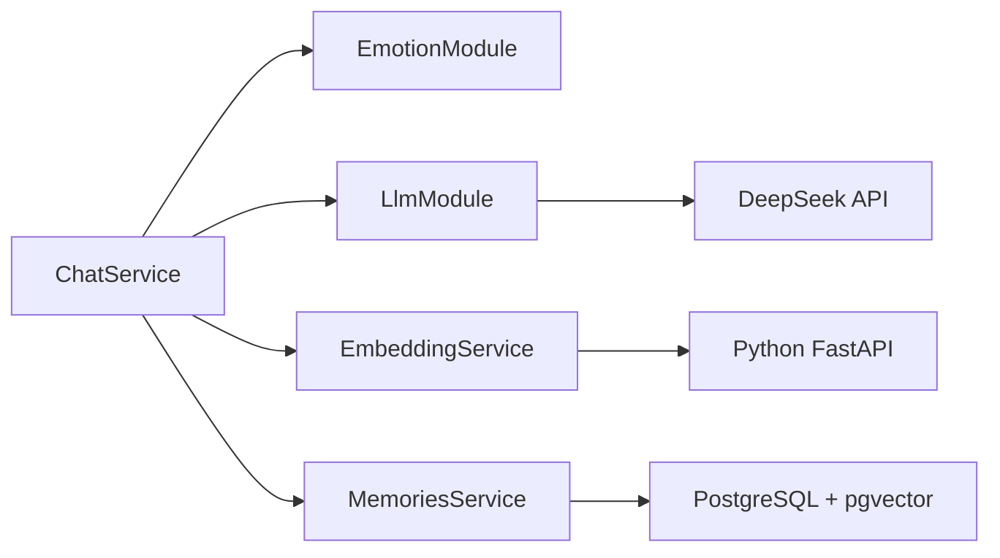

# AI服务集成

<cite>
**本文引用的文件**
- [python/main.py](file://python/main.py)
- [python/embedder.py](file://python/embedder.py)
- [python/scripts/download_model.py](file://python/scripts/download_model.py)
- [python/pyproject.toml](file://python/pyproject.toml)
- [src/embedding/embedding.service.ts](file://src/embedding/embedding.service.ts)
- [src/emotion/jiwen-emotion.service.ts](file://src/emotion/jiwen-emotion.service.ts)
- [src/emotion/mood.service.ts](file://src/emotion/mood.service.ts)
- [src/emotion/emotion.module.ts](file://src/emotion/emotion.module.ts)
- [src/llm/llm.service.ts](file://src/llm/llm.service.ts)
- [src/llm/llm.module.ts](file://src/llm/llm.module.ts)
- [src/memories/memories.service.ts](file://src/memories/memories.service.ts)
- [src/memories/memories.module.ts](file://src/memories/memories.module.ts)
- [src/chat/chat.controller.ts](file://src/chat/chat.controller.ts)
- [src/chat/chat.service.ts](file://src/chat/chat.service.ts)
- [src/app.module.ts](file://src/app.module.ts)
</cite>

## 目录
1. [简介](#简介)
2. [项目结构](#项目结构)
3. [核心组件](#核心组件)
4. [架构总览](#架构总览)
5. [详细组件分析](#详细组件分析)
6. [依赖关系分析](#依赖关系分析)
7. [性能考虑](#性能考虑)
8. [故障排查指南](#故障排查指南)
9. [结论](#结论)
10. [附录](#附录)

## 简介
本技术文档面向“AI Companion”的AI服务集成，系统性阐述以下方面：
- Python FastAPI向量嵌入服务的实现与优化：模型加载机制、批量处理与性能调优。
- 情感分析服务：Jiwen情感分析与Mood情绪调节的工作原理与交互。
- LLM推理服务：DeepSeek API封装、流式响应处理与错误处理。
- 部署架构：服务发现、负载均衡与容错策略。
- 配置管理：模型参数、API密钥与资源限制。
- 监控与日志：性能指标与异常处理。
- 扩展性设计：如何接入新模型与新服务。

## 项目结构
AI服务由三层组成：
- 前端（Web）：用户界面与交互。
- 后端（NestJS）：业务编排、情感分析、记忆检索、LLM调用与流式响应。
- 向量嵌入服务（FastAPI + ONNX Runtime）：纯文本向量化服务，输出768维向量。

图表来源
- [src/chat/chat.controller.ts:1-77](file://src/chat/chat.controller.ts#L1-L77)
- [src/chat/chat.service.ts:1-547](file://src/chat/chat.service.ts#L1-L547)
- [src/emotion/emotion.module.ts:1-10](file://src/emotion/emotion.module.ts#L1-L10)
- [src/llm/llm.module.ts:1-16](file://src/llm/llm.module.ts#L1-L16)
- [src/memories/memories.module.ts:1-18](file://src/memories/memories.module.ts#L1-L18)
- [src/embedding/embedding.service.ts:1-84](file://src/embedding/embedding.service.ts#L1-L84)
- [python/main.py:1-123](file://python/main.py#L1-L123)
- [python/embedder.py:1-116](file://python/embedder.py#L1-L116)

章节来源
- [src/app.module.ts:1-64](file://src/app.module.ts#L1-L64)
- [src/chat/chat.controller.ts:1-77](file://src/chat/chat.controller.ts#L1-L77)
- [src/chat/chat.service.ts:1-547](file://src/chat/chat.service.ts#L1-L547)
- [src/emotion/emotion.module.ts:1-10](file://src/emotion/emotion.module.ts#L1-L10)
- [src/llm/llm.module.ts:1-16](file://src/llm/llm.module.ts#L1-L16)
- [src/memories/memories.module.ts:1-18](file://src/memories/memories.module.ts#L1-L18)
- [src/embedding/embedding.service.ts:1-84](file://src/embedding/embedding.service.ts#L1-L84)
- [python/main.py:1-123](file://python/main.py#L1-L123)
- [python/embedder.py:1-116](file://python/embedder.py#L1-L116)

## 核心组件
- 向量嵌入服务（Python FastAPI）
  - 提供单条与批量向量化接口，支持Mock模式与真实模型。
  - 使用ONNX Runtime推理，Mean Pooling后归一化，输出768维向量。
- 情感分析服务（NestJS）
  - Jiwen情感分析：基于中文词典加权统计，输出主导情绪、愉悦度、唤醒度。
  - Mood情绪调节：基于用户情绪的AI情绪模拟与衰减，输出情绪标签与语气建议。
- LLM推理服务（NestJS）
  - DeepSeek API封装，支持同步与流式两种模式，SSE逐字推送。
- 记忆服务（NestJS + PostgreSQL + pgvector）
  - 原生SQL操作含VECTOR列的表，支持向量相似度检索、去重与写入。
- 聊天服务（NestJS）
  - 完整对话链路：保存消息、读取上下文、向量检索、组装system prompt、调LLM、保存回复、异步记忆提取与滚动摘要。

章节来源
- [python/main.py:1-123](file://python/main.py#L1-L123)
- [python/embedder.py:1-116](file://python/embedder.py#L1-L116)
- [src/emotion/jiwen-emotion.service.ts:1-134](file://src/emotion/jiwen-emotion.service.ts#L1-L134)
- [src/emotion/mood.service.ts:1-111](file://src/emotion/mood.service.ts#L1-L111)
- [src/llm/llm.service.ts:1-147](file://src/llm/llm.service.ts#L1-L147)
- [src/memories/memories.service.ts:1-138](file://src/memories/memories.service.ts#L1-L138)
- [src/chat/chat.service.ts:1-547](file://src/chat/chat.service.ts#L1-L547)

## 架构总览
整体采用“微服务化”思想：
- 嵌入服务独立部署，通过HTTP提供向量化能力。
- 嵌入服务与LLM服务均作为下游依赖，由NestJS服务统一编排。
- 记忆检索在数据库侧完成，避免在应用层进行复杂向量计算。

图表来源
- [src/chat/chat.controller.ts:1-77](file://src/chat/chat.controller.ts#L1-L77)
- [src/chat/chat.service.ts:1-547](file://src/chat/chat.service.ts#L1-L547)
- [src/emotion/jiwen-emotion.service.ts:1-134](file://src/emotion/jiwen-emotion.service.ts#L1-L134)
- [src/emotion/mood.service.ts:1-111](file://src/emotion/mood.service.ts#L1-L111)
- [src/embedding/embedding.service.ts:1-84](file://src/embedding/embedding.service.ts#L1-L84)
- [python/main.py:1-123](file://python/main.py#L1-L123)
- [src/llm/llm.service.ts:1-147](file://src/llm/llm.service.ts#L1-L147)
- [src/memories/memories.service.ts:1-138](file://src/memories/memories.service.ts#L1-L138)

## 详细组件分析

### Python FastAPI向量嵌入服务
- 模型加载机制
  - 默认从本地模型目录加载ONNX模型与Tokenizer，支持通过环境变量覆盖路径。
  - 初始化时打印输入节点名，便于验证模型结构。
- 批量处理优化
  - 批量编码时统一截断长度，构造input_ids与attention_mask，一次性推理，减少多次往返。
  - Mean Pooling后按行归一化，确保向量单位化，提升检索稳定性。
- Mock模式
  - 通过命令行参数或环境变量启用，使用固定种子的随机向量，便于端到端流程验证。
- 性能调优策略
  - 截断长度可配置，控制最大序列长度。
  - 批量推理优于逐条推理，建议在上层聚合多条文本后调用批量接口。
  - 健康检查端点便于部署时快速探测服务状态。

图表来源
- [python/embedder.py:71-116](file://python/embedder.py#L71-L116)

章节来源
- [python/main.py:1-123](file://python/main.py#L1-L123)
- [python/embedder.py:1-116](file://python/embedder.py#L1-L116)
- [python/scripts/download_model.py:1-42](file://python/scripts/download_model.py#L1-L42)
- [python/pyproject.toml:1-22](file://python/pyproject.toml#L1-L22)

### 情感分析服务
- Jiwen情感分析
  - 基于中文情感词典加权统计，计算七类基础情绪得分，综合得到主导情绪与阈值判定。
  - 对标点、语气词等进行增强规则，提升中文语境下的识别鲁棒性。
  - 输出情绪快照与摘要，指导AI回应策略。
- Mood情绪调节
  - 维护会话级情绪状态（valence/arousal），根据用户情绪产生共情波动与自然衰减。
  - 将连续数值映射为情绪标签与语气建议，辅助生成自然的回复语调与表情使用。

图表来源
- [src/emotion/jiwen-emotion.service.ts:1-134](file://src/emotion/jiwen-emotion.service.ts#L1-L134)
- [src/emotion/mood.service.ts:1-111](file://src/emotion/mood.service.ts#L1-L111)
- [src/emotion/emotion.module.ts:1-10](file://src/emotion/emotion.module.ts#L1-L10)

章节来源
- [src/emotion/jiwen-emotion.service.ts:1-134](file://src/emotion/jiwen-emotion.service.ts#L1-L134)
- [src/emotion/mood.service.ts:1-111](file://src/emotion/mood.service.ts#L1-L111)
- [src/emotion/emotion.module.ts:1-10](file://src/emotion/emotion.module.ts#L1-L10)

### LLM推理服务（DeepSeek）
- 同步模式
  - 发送JSON请求至DeepSeek API，等待完整回复后返回。
  - 支持模型、温度、最大token等参数配置。
- 流式模式（SSE）
  - 使用原生HTTPS客户端发起流式请求，按行解析SSE数据块，逐个推送delta内容。
  - 前端可逐字显示，无需等待完整生成。
- 错误处理
  - 请求错误直接上报；流式过程中解析异常会被忽略并继续处理后续数据块。
  - 超时时间与重试策略需结合上游调用方实现。

图表来源
- [src/llm/llm.service.ts:69-145](file://src/llm/llm.service.ts#L69-L145)

章节来源
- [src/llm/llm.service.ts:1-147](file://src/llm/llm.service.ts#L1-L147)
- [src/llm/llm.module.ts:1-16](file://src/llm/llm.module.ts#L1-L16)

### 记忆服务（向量检索与写入）
- 向量检索
  - 使用pgvector的余弦距离运算符，返回相似度排序的记忆片段。
- 写入与去重
  - 将文本经嵌入服务向量化后写入，按阈值判断是否重复。
- 模块设计
  - 不依赖TypeORM实体，直接使用DataSource进行原生SQL，避免删除VECTOR列。

图表来源
- [src/memories/memories.service.ts:42-137](file://src/memories/memories.service.ts#L42-L137)
- [src/embedding/embedding.service.ts:33-65](file://src/embedding/embedding.service.ts#L33-L65)

章节来源
- [src/memories/memories.service.ts:1-138](file://src/memories/memories.service.ts#L1-L138)
- [src/memories/memories.module.ts:1-18](file://src/memories/memories.module.ts#L1-L18)
- [src/embedding/embedding.service.ts:1-84](file://src/embedding/embedding.service.ts#L1-L84)

### 聊天服务（业务编排）
- 同步与流式两条路径
  - 同步：等待LLM完整回复后保存消息并触发异步任务。
  - 流式：边接收边推送，完成后保存消息并触发异步任务。
- 异步任务
  - 记忆提取：从对话中抽取事实/偏好/情绪，向量化后写入。
  - 滚动摘要：达到阈值后生成摘要并更新会话状态。
- Prompt组装
  - 多层叠加：固定人格、说话风格、滚动摘要、长期画像、动态记忆、用户与AI情绪、核心规则。

章节来源
- [src/chat/chat.service.ts:1-547](file://src/chat/chat.service.ts#L1-L547)

## 依赖关系分析
- 模块耦合
  - ChatService依赖Emotion、Mood、LLM、Embedding、Memories等服务。
  - EmbeddingService依赖HttpService调用Python服务。
  - LlmModule注册HttpModule并导出LlmService。
  - EmotionModule导出Jiwen与Mood服务。
  - MemoriesModule导入EmbeddingModule，直接使用DataSource。
- 外部依赖
  - Python侧：FastAPI、Uvicorn、ONNX Runtime、Tokenizers、HuggingFace Hub。
  - NestJS侧：Axios、RxJS、TypeORM（仅用于非向量表）。

图表来源
- [src/chat/chat.service.ts:1-547](file://src/chat/chat.service.ts#L1-L547)
- [src/embedding/embedding.service.ts:1-84](file://src/embedding/embedding.service.ts#L1-L84)
- [src/llm/llm.module.ts:1-16](file://src/llm/llm.module.ts#L1-L16)
- [src/memories/memories.module.ts:1-18](file://src/memories/memories.module.ts#L1-L18)
- [python/main.py:1-123](file://python/main.py#L1-L123)

章节来源
- [src/app.module.ts:1-64](file://src/app.module.ts#L1-L64)
- [src/chat/chat.service.ts:1-547](file://src/chat/chat.service.ts#L1-L547)
- [src/embedding/embedding.service.ts:1-84](file://src/embedding/embedding.service.ts#L1-L84)
- [src/llm/llm.module.ts:1-16](file://src/llm/llm.module.ts#L1-L16)
- [src/memories/memories.module.ts:1-18](file://src/memories/memories.module.ts#L1-L18)
- [python/main.py:1-123](file://python/main.py#L1-L123)

## 性能考虑
- 向量嵌入
  - 批量推理优于逐条推理，建议在上层聚合文本后调用批量接口。
  - 控制最大序列长度以平衡精度与延迟。
  - Mock模式仅用于开发验证，生产需下载真实模型。
- LLM推理
  - 同步模式适合简单场景；流式模式提升用户体验。
  - 适当降低temperature与max_tokens可减少生成时延。
- 记忆检索
  - 使用pgvector HNSW索引与余弦距离，合理设置limit。
  - 去重阈值过高会导致遗漏，过低会重复写入，需结合业务调参。
- 网络与超时
  - 嵌入服务单条/批量请求分别设置合理超时，避免阻塞。
  - LLM流式请求需关注网络中断与重连策略。

## 故障排查指南
- 嵌入服务不可用
  - 检查健康检查端点与Python服务进程状态。
  - 若未下载模型，启用Mock模式验证端到端流程。
- 模型文件缺失
  - 确认模型与Tokenizer路径存在，或通过环境变量指定。
  - 使用下载脚本从Hugging Face拉取模型。
- LLM流式异常
  - 检查API密钥与网络连通性。
  - 关注SSE解析异常与请求取消逻辑。
- 记忆写入失败
  - 确认pgvector扩展与表结构迁移已完成。
  - 检查VECTOR列写入权限与SQL语法。

章节来源
- [python/main.py:115-123](file://python/main.py#L115-L123)
- [python/embedder.py:40-52](file://python/embedder.py#L40-L52)
- [python/scripts/download_model.py:1-42](file://python/scripts/download_model.py#L1-L42)
- [src/embedding/embedding.service.ts:70-82](file://src/embedding/embedding.service.ts#L70-L82)
- [src/llm/llm.service.ts:133-135](file://src/llm/llm.service.ts#L133-L135)
- [src/memories/memories.service.ts:14-28](file://src/memories/memories.service.ts#L14-L28)

## 结论
本方案通过清晰的服务边界与模块化设计，实现了从情感分析、向量检索到LLM推理的完整闭环。Python嵌入服务专注于高吞吐的向量化，NestJS服务负责业务编排与用户体验，数据库侧提供高效的向量检索。建议在生产环境中：
- 部署嵌入服务与LLM服务的副本，配合负载均衡与健康检查。
- 为嵌入服务与LLM服务增加重试与熔断策略。
- 建立完善的日志与指标体系，持续优化模型参数与检索阈值。

## 附录

### API定义（向量嵌入服务）
- POST /embed
  - 请求体：{ "text": "..." }
  - 响应体：{ "embedding": [768个浮点数] }
- POST /batch_embed
  - 请求体：["文本1", "文本2", ...]
  - 响应体：{ "embeddings": [[...], [...], ...] }
- GET /health
  - 响应体：{ "status": "ok", "mock_mode": true/false, "dimensions": 768 }

章节来源
- [python/main.py:91-123](file://python/main.py#L91-L123)

### SSE流式响应（聊天服务）
- 端点：POST /api/chat/:sessionId/stream
- 响应格式：text/event-stream，每块形如"data: <JSON>\n\n"，结束块为"data: [DONE]\n\n"

章节来源
- [src/chat/chat.controller.ts:46-77](file://src/chat/chat.controller.ts#L46-L77)
- [src/llm/llm.service.ts:69-145](file://src/llm/llm.service.ts#L69-L145)

### 配置清单
- 环境变量
  - DEEPSEEK_API_KEY：LLM服务认证密钥
  - PYTHON_EMBED_URL：嵌入服务地址，默认 http://localhost:8000
  - MOCK_EMBEDDING：启用嵌入服务Mock模式
  - EMBEDDING_MODEL_PATH / EMBEDDING_TOKENIZER_PATH：覆盖模型与Tokenizer路径
  - EMBEDDING_MAX_LENGTH：最大序列长度
  - DB_*：数据库连接参数（由AppModule读取）
- Python依赖
  - FastAPI、Uvicorn、ONNX Runtime、Tokenizers、HuggingFace Hub、NumPy

章节来源
- [src/embedding/embedding.service.ts:18-21](file://src/embedding/embedding.service.ts#L18-L21)
- [python/main.py:35-35](file://python/main.py#L35-L35)
- [python/embedder.py:26-28](file://python/embedder.py#L26-L28)
- [python/pyproject.toml:1-22](file://python/pyproject.toml#L1-L22)
- [src/app.module.ts:38-50](file://src/app.module.ts#L38-L50)