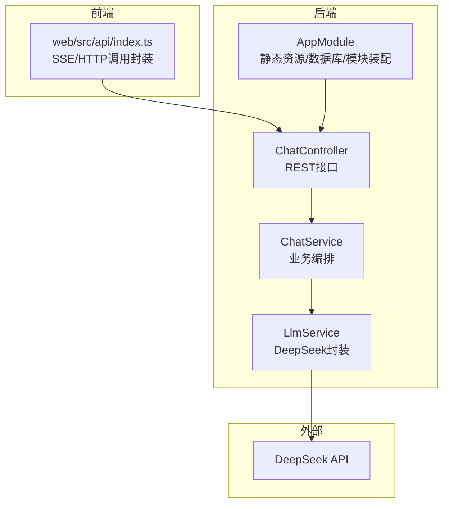
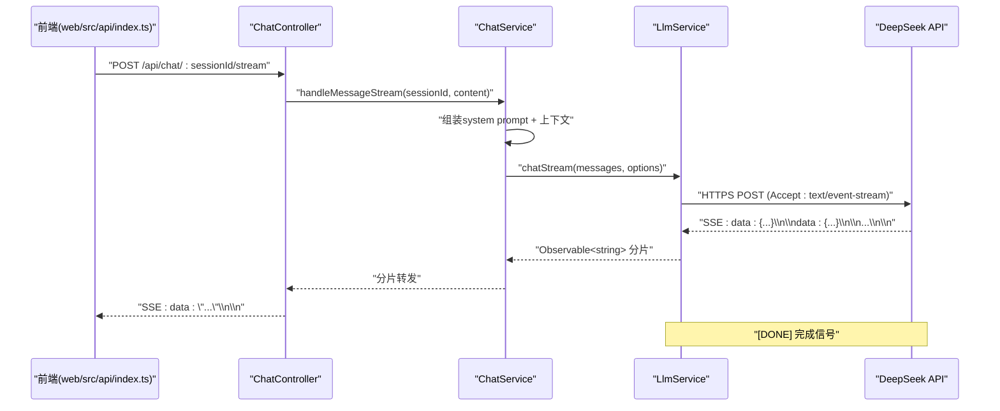
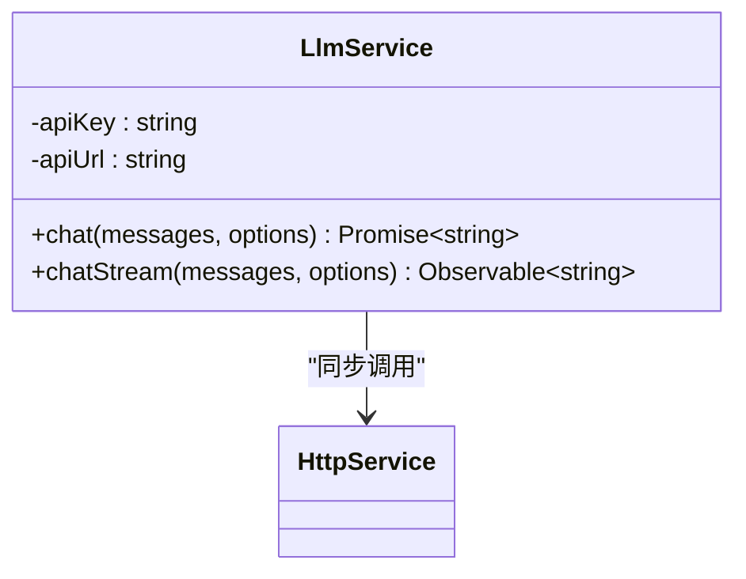
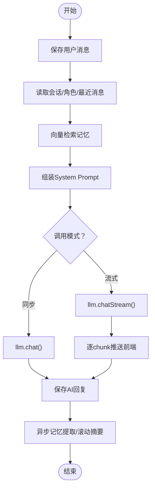
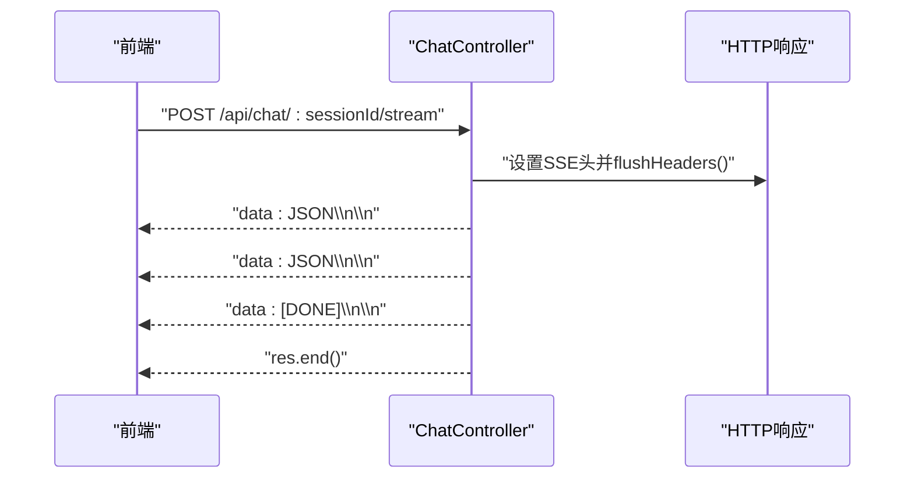
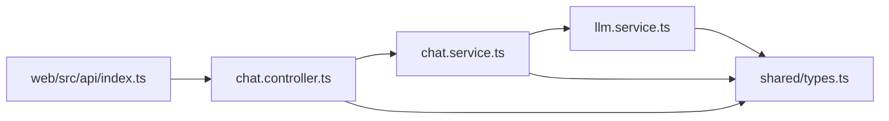

# LLM推理服务

<cite>
**本文引用的文件**
- [llm.service.ts](file://src/llm/llm.service.ts)
- [llm.module.ts](file://src/llm/llm.module.ts)
- [chat.service.ts](file://src/chat/chat.service.ts)
- [chat.controller.ts](file://src/chat/chat.controller.ts)
- [types.ts](file://shared/types.ts)
- [index.ts](file://web/src/api/index.ts)
- [app.module.ts](file://src/app.module.ts)
</cite>

## 目录
1. [简介](#简介)
2. [项目结构](#项目结构)
3. [核心组件](#核心组件)
4. [架构总览](#架构总览)
5. [详细组件分析](#详细组件分析)
6. [依赖分析](#依赖分析)
7. [性能考虑](#性能考虑)
8. [故障排查指南](#故障排查指南)
9. [结论](#结论)
10. [附录](#附录)

## 简介
本文件面向“LLM推理服务”的技术文档，聚焦于DeepSeek API的集成与使用，涵盖以下主题：
- API密钥管理与请求封装
- 同步与流式（SSE）两种调用模式
- 流式响应处理机制（Server-Sent Events、数据流分割与实时渲染）
- LLM服务参数配置（模型、温度、最大生成长度等）
- 错误重试与超时处理（网络异常恢复、API限流应对、降级策略）
- 性能优化（请求合并、缓存策略、并发控制）
- 监控与日志（请求统计、响应时间分析、错误追踪）
- 实战问题解决（调用失败、响应延迟、成本控制）

## 项目结构
后端采用NestJS，前端为React单页应用，共享类型定义位于shared目录。LLM服务位于src/llm，聊天编排位于src/chat，HTTP客户端通过NestJS的HttpModule注入。

图表来源
- [app.module.ts:18-62](file://src/app.module.ts#L18-L62)
- [chat.controller.ts:16-76](file://src/chat/chat.controller.ts#L16-L76)
- [chat.service.ts:29-40](file://src/chat/chat.service.ts#L29-L40)
- [llm.service.ts:26-33](file://src/llm/llm.service.ts#L26-L33)
- [index.ts:145-201](file://web/src/api/index.ts#L145-L201)

章节来源
- [app.module.ts:18-62](file://src/app.module.ts#L18-L62)
- [chat.controller.ts:16-76](file://src/chat/chat.controller.ts#L16-L76)
- [chat.service.ts:29-40](file://src/chat/chat.service.ts#L29-L40)
- [llm.service.ts:26-33](file://src/llm/llm.service.ts#L26-L33)
- [index.ts:145-201](file://web/src/api/index.ts#L145-L201)

## 核心组件
- LlmService：封装DeepSeek API调用，提供同步chat()与流式chatStream()两种模式，负责请求头、超时、SSE解析与取消订阅。
- ChatService：业务编排，组装system prompt、调用LLM、保存消息、异步记忆提取与滚动摘要。
- ChatController：REST接口，提供同步与SSE两条路由，设置SSE响应头并转发流。
- Web API层：前端通过index.ts发起HTTP与SSE请求，解析SSE数据流并回调UI。

章节来源
- [llm.service.ts:26-57](file://src/llm/llm.service.ts#L26-L57)
- [llm.service.ts:70-145](file://src/llm/llm.service.ts#L70-L145)
- [chat.service.ts:42-113](file://src/chat/chat.service.ts#L42-L113)
- [chat.controller.ts:20-75](file://src/chat/chat.controller.ts#L20-L75)
- [index.ts:137-201](file://web/src/api/index.ts#L137-L201)

## 架构总览
下图展示从Web前端到后端控制器、服务与LLM服务的调用链路，以及SSE流式返回路径。

图表来源
- [chat.controller.ts:46-75](file://src/chat/chat.controller.ts#L46-L75)
- [chat.service.ts:130-231](file://src/chat/chat.service.ts#L130-L231)
- [llm.service.ts:70-145](file://src/llm/llm.service.ts#L70-L145)
- [index.ts:145-201](file://web/src/api/index.ts#L145-L201)

## 详细组件分析

### LlmService：DeepSeek API封装
- API密钥管理：从环境变量读取DEEPSEEK_API_KEY，构造Authorization头。
- 同步模式chat()：使用HttpService.post，设置timeout、stream=false，解析choices[0].message.content。
- 流式模式chatStream()：使用原生https.request，设置Accept: text/event-stream，按行解析SSE，遇到[DONE]完成，异常时触发error。
- 参数映射：model、temperature、max_tokens对应DeepSeek参数；默认值在服务内设定。
- 取消订阅：返回函数销毁请求，避免内存泄漏。

图表来源
- [llm.service.ts:26-33](file://src/llm/llm.service.ts#L26-L33)
- [llm.service.ts:35-57](file://src/llm/llm.service.ts#L35-L57)
- [llm.service.ts:70-145](file://src/llm/llm.service.ts#L70-L145)

章节来源
- [llm.service.ts:26-33](file://src/llm/llm.service.ts#L26-L33)
- [llm.service.ts:35-57](file://src/llm/llm.service.ts#L35-L57)
- [llm.service.ts:70-145](file://src/llm/llm.service.ts#L70-L145)

### ChatService：业务编排与流式处理
- 同步对话：保存用户消息→读取上下文→向量检索记忆→组装system prompt→调LLM→保存AI回复→异步记忆提取与滚动摘要。
- 流式对话：与同步类似，但在LLM调用处改为chatStream，逐chunk推送前端，完成后清理括号动作描述、保存回复并触发异步任务。
- System Prompt组装：多层次叠加（固定人格、说话风格、滚动摘要、长期画像、动态记忆、情绪状态、核心规则）。
- 清理回复：将括号动作描述替换为emoji/颜文字，提升微信式体验。

图表来源
- [chat.service.ts:42-113](file://src/chat/chat.service.ts#L42-L113)
- [chat.service.ts:130-231](file://src/chat/chat.service.ts#L130-L231)
- [chat.service.ts:424-497](file://src/chat/chat.service.ts#L424-L497)
- [chat.service.ts:507-544](file://src/chat/chat.service.ts#L507-L544)

章节来源
- [chat.service.ts:42-113](file://src/chat/chat.service.ts#L42-L113)
- [chat.service.ts:130-231](file://src/chat/chat.service.ts#L130-L231)
- [chat.service.ts:424-497](file://src/chat/chat.service.ts#L424-L497)
- [chat.service.ts:507-544](file://src/chat/chat.service.ts#L507-L544)

### ChatController：REST接口与SSE
- 同步端点：POST /api/chat/:sessionId，返回完整回复。
- 流式端点：POST /api/chat/:sessionId/stream，设置SSE响应头，逐chunk写入data: JSON字符串，遇到[DONE]写入终止标记并结束连接。
- 前端示例：提供fetch + ReadableStream + SSE解析的参考实现。

图表来源
- [chat.controller.ts:46-75](file://src/chat/chat.controller.ts#L46-L75)
- [index.ts:145-201](file://web/src/api/index.ts#L145-L201)

章节来源
- [chat.controller.ts:20-27](file://src/chat/chat.controller.ts#L20-L27)
- [chat.controller.ts:46-75](file://src/chat/chat.controller.ts#L46-L75)
- [index.ts:129-201](file://web/src/api/index.ts#L129-L201)

### Web API层：SSE与HTTP调用
- HTTP通用请求：统一处理响应码与错误，抛出ApiError。
- SSE流式发送：fetch开启SSE，使用ReadableStream Reader逐块读取，按行解析SSE，拼接缓冲区，遇到[DONE]触发完成回调。
- 取消控制：返回AbortController，前端可中断请求。

章节来源
- [index.ts:37-52](file://web/src/api/index.ts#L37-L52)
- [index.ts:137-201](file://web/src/api/index.ts#L137-L201)

### 类型与配置
- 共享类型：ChatMessage、LlmOptions、SSECallbacks、ApiError等，确保前后端一致。
- LlmOptions字段：model、temperature、maxTokens，用于控制模型选择与生成行为。

章节来源
- [types.ts:19-28](file://shared/types.ts#L19-L28)
- [types.ts:104-108](file://shared/types.ts#L104-L108)

## 依赖分析
- LlmService依赖NestJS的HttpService（同步）与原生https（流式）。
- ChatService依赖LlmService、消息/会话/记忆服务、情绪与心情服务。
- ChatController依赖ChatService，暴露REST接口。
- Web API层依赖共享类型与浏览器fetch。

图表来源
- [types.ts:19-28](file://shared/types.ts#L19-L28)
- [chat.controller.ts:16-76](file://src/chat/chat.controller.ts#L16-L76)
- [chat.service.ts:29-40](file://src/chat/chat.service.ts#L29-L40)
- [llm.service.ts:26-33](file://src/llm/llm.service.ts#L26-L33)
- [index.ts:145-201](file://web/src/api/index.ts#L145-L201)

章节来源
- [types.ts:19-28](file://shared/types.ts#L19-L28)
- [chat.controller.ts:16-76](file://src/chat/chat.controller.ts#L16-L76)
- [chat.service.ts:29-40](file://src/chat/chat.service.ts#L29-L40)
- [llm.service.ts:26-33](file://src/llm/llm.service.ts#L26-L33)
- [index.ts:145-201](file://web/src/api/index.ts#L145-L201)

## 性能考虑
- 请求合并与批处理：当前实现逐条消息调用LLM。可在前端或服务侧聚合多轮对话，减少API调用次数与成本。
- 缓存策略：
  - Prompt缓存：对固定人格/风格/摘要等静态内容进行缓存，命中则复用。
  - 嵌入缓存：向量检索前对关键词/短语做本地缓存，降低pgvector查询压力。
- 并发控制：限制同一会话的并发流式请求，避免资源争用；对全局请求速率进行节流。
- 流式渲染优化：前端按字符/单词粒度渲染，结合节流/防抖减少DOM更新频率。
- 超时与重试：为同步与流式请求分别设置合理超时；对临时性错误（如网络抖动）进行指数退避重试。
- 降级策略：当API不可用或限流严重时，启用“快速回复模板”或“历史相似回答”，保证用户体验。

## 故障排查指南
- 调用失败
  - 检查DEEPSEEK_API_KEY是否正确设置与加载。
  - 查看LlmService的error回调与ChatController的错误SSE回传。
  - 关注网络异常与证书问题，必要时增加代理或调整超时。
- 响应延迟
  - 优先启用流式SSE，前端边到边渲染。
  - 优化system prompt长度与上下文截断策略。
  - 对高频请求引入本地缓存与预热。
- 成本控制
  - 控制max_tokens与temperature，避免过度生成。
  - 合理使用滚动摘要，减少上下文长度。
  - 对非关键场景使用更小模型或更低temperature。

章节来源
- [llm.service.ts:133-135](file://src/llm/llm.service.ts#L133-L135)
- [chat.controller.ts:66-74](file://src/chat/chat.controller.ts#L66-L74)
- [chat.service.ts:26-28](file://src/chat/chat.service.ts#L26-L28)

## 结论
本项目以清晰的模块划分实现了DeepSeek API的深度集成，提供了同步与流式两种调用模式，并通过SSE实现近实时的回复渲染。通过System Prompt的多层叠加与异步记忆/摘要机制，系统具备良好的个性化与长期记忆能力。建议在生产环境中进一步完善重试与限流、缓存与合并策略，以提升稳定性与成本效率。

## 附录
- 环境变量
  - DEEPSEEK_API_KEY：DeepSeek API密钥
- 默认参数
  - 模型：deepseek-chat
  - 温度：0.8（同步），0.3/0.5（特定任务）
  - 最大生成长度：2000
- SSE协议
  - 前端逐行解析data: JSON，遇到[DONE]结束
  - 后端设置Content-Type: text/event-stream，禁用缓存

章节来源
- [llm.service.ts:28-33](file://src/llm/llm.service.ts#L28-L33)
- [llm.service.ts:41-46](file://src/llm/llm.service.ts#L41-L46)
- [chat.service.ts:271-277](file://src/chat/chat.service.ts#L271-L277)
- [chat.service.ts:360-366](file://src/chat/chat.service.ts#L360-L366)
- [chat.controller.ts:52-57](file://src/chat/chat.controller.ts#L52-L57)
- [index.ts:168-190](file://web/src/api/index.ts#L168-L190)