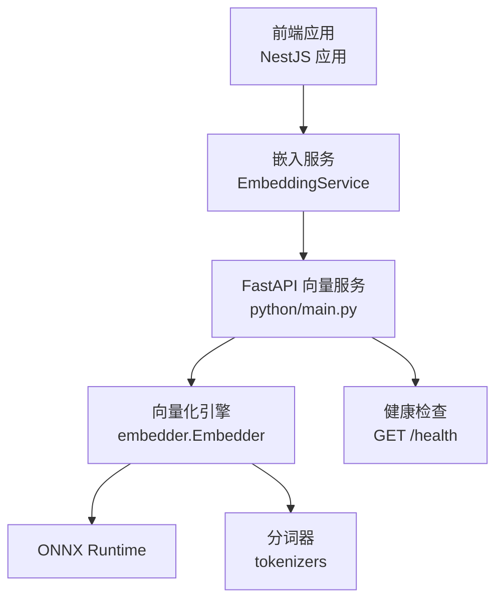
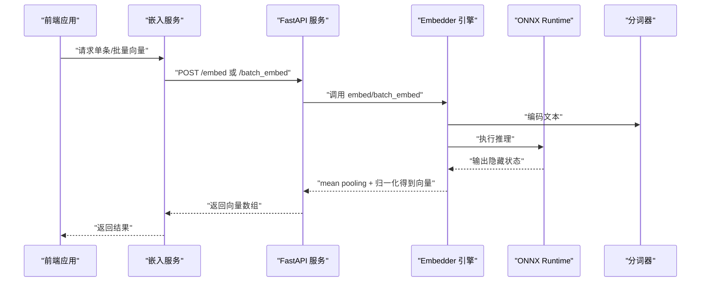
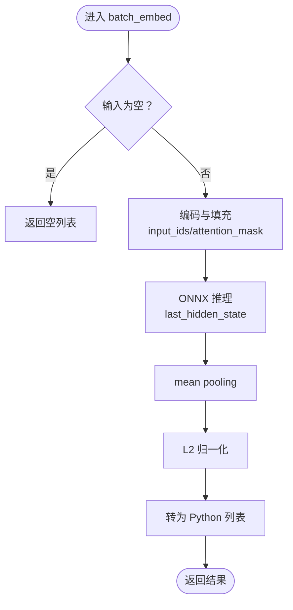
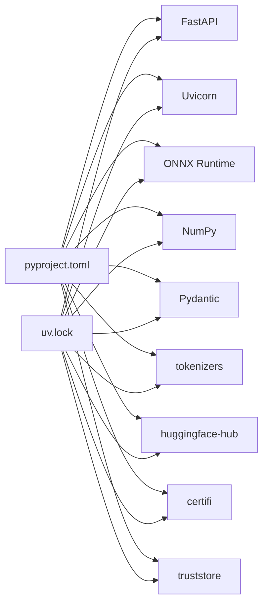

# 向量嵌入服务

<cite>
**本文引用的文件**
- [main.py](file://python/main.py)
- [embedder.py](file://python/embedder.py)
- [download_model.py](file://python/scripts/download_model.py)
- [pyproject.toml](file://python/pyproject.toml)
- [embedding.service.ts](file://src/embedding/embedding.service.ts)
- [memories.service.ts](file://src/memories/memories.service.ts)
- [AI_Companion_最终方案.md](file://docs/AI_Companion_最终方案.md)
- [uv.lock](file://python/uv.lock)
</cite>

## 目录
1. [简介](#简介)
2. [项目结构](#项目结构)
3. [核心组件](#核心组件)
4. [架构总览](#架构总览)
5. [详细组件分析](#详细组件分析)
6. [依赖关系分析](#依赖关系分析)
7. [性能考量](#性能考量)
8. [故障排查指南](#故障排查指南)
9. [结论](#结论)
10. [附录](#附录)

## 简介
本技术文档面向向量嵌入服务，聚焦于基于 Python FastAPI 的文本向量化实现，涵盖以下要点：
- 模型加载机制与 ONNX Runtime 集成
- 向量维度配置与标准化流程
- 单条与批量文本向量化 API 的设计与数据格式规范
- 假向量模式的实现原理与使用场景（含环境变量与随机种子机制）
- 性能优化策略（批处理、内存管理、并发处理）
- 部署与配置指南（依赖安装、模型下载、运行参数）
- 健康检查接口与监控指标建议
- 常见问题排查（模型加载失败、内存不足、性能瓶颈）

## 项目结构
该服务采用“前后端分离”的最小化设计：前端（NestJS）通过 HTTP 调用 Python FastAPI 提供的向量化接口；Python 侧负责加载 ONNX 模型并执行推理，输出固定维度的向量。

图表来源
- [embedding.service.ts:14-83](file://src/embedding/embedding.service.ts#L14-L83)
- [main.py:26-123](file://python/main.py#L26-L123)
- [embedder.py:31-116](file://python/embedder.py#L31-L116)

章节来源
- [main.py:1-123](file://python/main.py#L1-L123)
- [embedder.py:1-116](file://python/embedder.py#L1-L116)
- [embedding.service.ts:1-84](file://src/embedding/embedding.service.ts#L1-L84)

## 核心组件
- FastAPI 应用与路由
  - 提供单条向量化 /embed 与批量向量化 /batch_embed 两个端点，以及 /health 健康检查。
  - 使用 Pydantic 定义请求/响应模型，确保输入输出格式一致。
- 向量化引擎 Embedder
  - 负责加载 ONNX 模型与分词器，执行编码、推理与向量归一化。
  - 支持通过环境变量覆盖模型与分词器路径，支持最大长度配置。
- 假向量模式
  - 在未准备真实模型时，使用固定随机种子生成伪向量，便于端到端联调。
- 下载脚本
  - 从 Hugging Face Hub 下载 Jina 中文嵌入模型与分词器至本地目录。
- 前端嵌入服务
  - 通过 HTTP 调用 Python 服务，封装单条与批量向量化，并提供健康检查能力。

章节来源
- [main.py:76-123](file://python/main.py#L76-L123)
- [embedder.py:31-116](file://python/embedder.py#L31-L116)
- [download_model.py:1-42](file://python/scripts/download_model.py#L1-L42)
- [embedding.service.ts:14-83](file://src/embedding/embedding.service.ts#L14-L83)

## 架构总览
整体架构遵循“纯推理服务”原则：Python FastAPI 仅负责将文本转换为向量；检索与存储由 PostgreSQL（配合 pgvector）完成。前端通过嵌入服务统一调用 Python 服务，再由 Python 服务完成 ONNX 推理。

图表来源
- [embedding.service.ts:33-65](file://src/embedding/embedding.service.ts#L33-L65)
- [main.py:91-112](file://python/main.py#L91-L112)
- [embedder.py:103-116](file://python/embedder.py#L103-L116)

## 详细组件分析

### FastAPI 应用与路由
- 应用初始化与标题版本信息
- 健康检查端点 /health 返回服务状态、是否启用假向量模式及向量维度
- 单条向量化 /embed
  - 请求体：{ "text": "..." }
  - 响应体：{ "embedding": [float; 768] }
- 批量向量化 /batch_embed
  - 请求体：["text1", "text2", ...]
  - 响应体：{ "embeddings": [[float; 768], ...] }

章节来源
- [main.py:26-123](file://python/main.py#L26-L123)

### 假向量模式
- 触发条件
  - 命令行参数 --mock 或环境变量 MOCK_EMBEDDING=1
- 实现原理
  - 使用固定随机种子（基于文本哈希取模）保证同一文本在相同种子下生成相同向量
  - 输出固定维度（768）的浮点数组
- 使用场景
  - 无模型时快速验证端到端流程
  - 单元测试与集成测试中的稳定向量生成

章节来源
- [main.py:33-50](file://python/main.py#L33-L50)

### 向量化引擎 Embedder
- 模型与分词器加载
  - 默认路径：python/models/jina-embeddings-v2-base-zh.onnx 与 tokenizer.json
  - 可通过环境变量 EMBEDDING_MODEL_PATH 与 EMBEDDING_TOKENIZER_PATH 覆盖
  - 最大序列长度通过 EMBEDDING_MAX_LENGTH 控制，默认 512
- 编码与填充
  - 使用分词器批量编码，按最大长度截断与填充，生成 input_ids 与 attention_mask
- 推理与向量生成
  - ONNX Runtime 执行推理，得到 last_hidden_state
  - 对隐藏状态进行 mean pooling，并对每条样本进行 L2 归一化
- 输出
  - 返回二维列表，形状为 [N, 768]，每个元素为 float

图表来源
- [embedder.py:107-116](file://python/embedder.py#L107-L116)
- [embedder.py:71-92](file://python/embedder.py#L71-L92)
- [embedder.py:94-102](file://python/embedder.py#L94-L102)

章节来源
- [embedder.py:31-116](file://python/embedder.py#L31-L116)

### 模型下载脚本
- 功能：从 Hugging Face Hub 下载 Jina 中文嵌入模型与分词器到本地目录
- 使用：python scripts/download_model.py
- 输出：模型文件与分词器文件位于 python/models/

章节来源
- [download_model.py:1-42](file://python/scripts/download_model.py#L1-L42)

### 前端嵌入服务（NestJS）
- 单条向量化
  - POST {pythonUrl}/embed
  - 请求体：{ "text": "..." }
  - 返回：768 维浮点数组
- 批量向量化
  - POST {pythonUrl}/batch_embed
  - 请求体：["text1", "text2", ...]
  - 返回：二维数组，每行 768 维
- 健康检查
  - GET {pythonUrl}/health
  - 返回：{ status: "ok", mock_mode: boolean, dimensions: 768 }

章节来源
- [embedding.service.ts:14-83](file://src/embedding/embedding.service.ts#L14-L83)

### 向量检索与存储（PostgreSQL + pgvector）
- 向量检索
  - 使用 pgvector 的向量距离运算符进行相似度排序
  - 通过 SQL 查询返回相似度分数与内容
- 写入记忆
  - 将向量以字符串形式传入，转换为 vector 类型写入
- 索引建议
  - 使用 HNSW 近似最近邻索引，结合向量距离函数优化查询性能

章节来源
- [memories.service.ts:42-88](file://src/memories/memories.service.ts#L42-L88)
- [AI_Companion_最终方案.md:1116-1129](file://docs/AI_Companion_最终方案.md#L1116-L1129)

## 依赖关系分析
- Python 依赖
  - FastAPI、Uvicorn：Web 服务器与框架
  - ONNX Runtime：推理引擎
  - NumPy：数值计算
  - Pydantic：数据校验与序列化
  - tokenizers：分词器
  - huggingface-hub：模型下载
  - certifi、truststore：证书与信任链
- 锁定文件
  - uv.lock 显示各包版本与兼容性约束

图表来源
- [pyproject.toml:6-16](file://python/pyproject.toml#L6-L16)
- [uv.lock:71-105](file://python/uv.lock#L71-L105)

章节来源
- [pyproject.toml:1-22](file://python/pyproject.toml#L1-L22)
- [uv.lock:71-105](file://python/uv.lock#L71-L105)

## 性能考量
- 批处理优化
  - 批量接口优于逐条调用，可减少推理开销与网络往返
  - 前端嵌入服务已提供批量调用封装
- 内存管理
  - ONNX Runtime 使用 CPU 执行提供稳定内存占用
  - 通过 EMBEDDING_MAX_LENGTH 控制最大序列长度，避免过长文本导致显存/内存压力
- 并发处理
  - Uvicorn 支持异步并发，适合高 QPS 的批量请求
  - 建议根据硬件资源调整并发与队列长度
- 向量检索性能
  - 使用 HNSW 索引与向量距离函数，提升大规模检索效率
  - 合理设置索引参数（如 m、ef_construction）平衡精度与性能

章节来源
- [embedding.service.ts:56-65](file://src/embedding/embedding.service.ts#L56-L65)
- [embedder.py:28-28](file://python/embedder.py#L28-L28)
- [AI_Companion_最终方案.md:1116-1129](file://docs/AI_Companion_最终方案.md#L1116-L1129)

## 故障排查指南
- 模型加载失败
  - 现象：启动时报文件不存在错误
  - 排查步骤：
    - 确认模型与分词器文件存在（默认路径 python/models/）
    - 如需自定义路径，请设置环境变量 EMBEDDING_MODEL_PATH 与 EMBEDDING_TOKENIZER_PATH
    - 使用下载脚本自动拉取模型
  - 参考
    - [embedder.py:40-52](file://python/embedder.py#L40-L52)
    - [download_model.py:32-37](file://python/scripts/download_model.py#L32-L37)
- 内存不足
  - 现象：推理过程中出现 OOM 或性能骤降
  - 排查步骤：
    - 降低 EMBEDDING_MAX_LENGTH，减少序列长度
    - 减少批量大小，避免一次性处理过多文本
    - 检查系统内存与 CPU 资源占用
- 性能瓶颈
  - 现象：延迟较高或吞吐不足
  - 排查步骤：
    - 优先使用批量接口
    - 检查网络延迟与 Python 服务并发配置
    - 对 PostgreSQL 向量检索建立 HNSW 索引
- 健康检查失败
  - 现象：前端健康检查返回失败
  - 排查步骤：
    - 确认 Python 服务已启动且端口开放
    - 检查 PYTHON_EMBED_URL 配置
    - 使用 /health 接口确认 mock_mode 与维度信息

章节来源
- [embedder.py:40-52](file://python/embedder.py#L40-L52)
- [download_model.py:32-37](file://python/scripts/download_model.py#L32-L37)
- [main.py:115-122](file://python/main.py#L115-L122)
- [embedding.service.ts:70-82](file://src/embedding/embedding.service.ts#L70-L82)

## 结论
本向量嵌入服务以最小化原则实现：Python FastAPI 专注文本到向量的转换，NestJS 负责业务编排与数据库交互。通过 ONNX Runtime 与 Hugging Face 模型，服务具备稳定的推理能力与良好的可扩展性。假向量模式为开发与测试提供了便捷通道；批量接口与 HNSW 索引则保障了生产环境下的性能表现。

## 附录

### 部署与配置指南
- 依赖安装
  - 使用 uv 或 pip 安装依赖（参考 pyproject.toml 与 uv.lock）
- 模型下载
  - 运行 python scripts/download_model.py 获取模型与分词器
- 启动参数
  - 启动 FastAPI 服务：uv run uvicorn main:app --port 8000
  - 假向量模式：uv run uvicorn main:app --port 8000 -- --mock 或设置环境变量 MOCK_EMBEDDING=1
- 环境变量
  - EMBEDDING_MODEL_PATH：自定义模型路径
  - EMBEDDING_TOKENIZER_PATH：自定义分词器路径
  - EMBEDDING_MAX_LENGTH：最大序列长度（默认 512）
  - MOCK_EMBEDDING：启用假向量模式（1）
  - PYTHON_EMBED_URL：Python 向量服务地址（默认 http://localhost:8000）

章节来源
- [pyproject.toml:6-16](file://python/pyproject.toml#L6-L16)
- [uv.lock:71-105](file://python/uv.lock#L71-L105)
- [download_model.py:32-37](file://python/scripts/download_model.py#L32-L37)
- [main.py:7-18](file://python/main.py#L7-L18)
- [embedder.py:26-28](file://python/embedder.py#L26-L28)
- [AI_Companion_最终方案.md:328-346](file://docs/AI_Companion_最终方案.md#L328-L346)