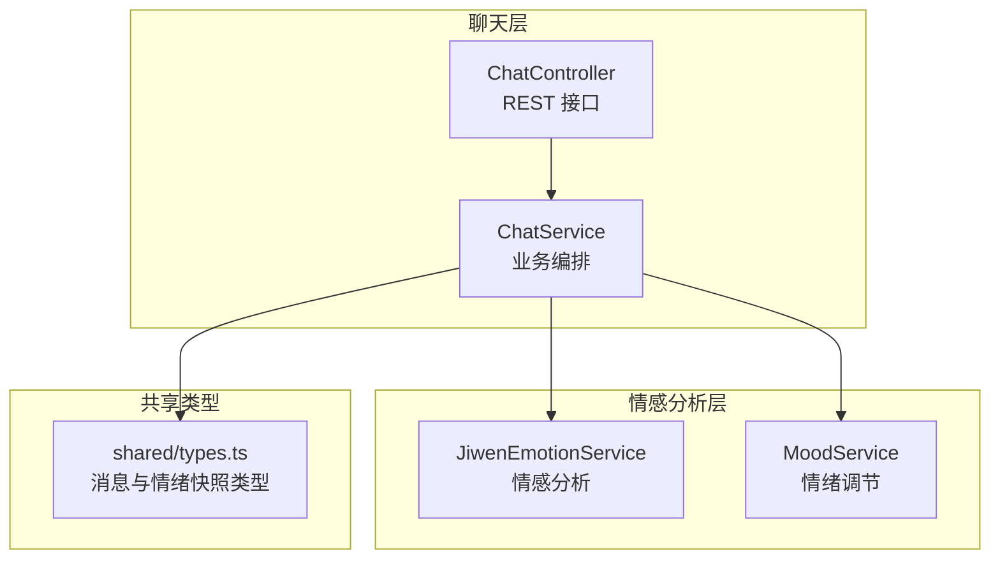
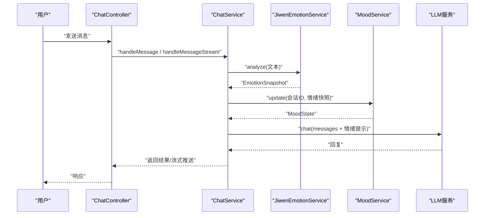
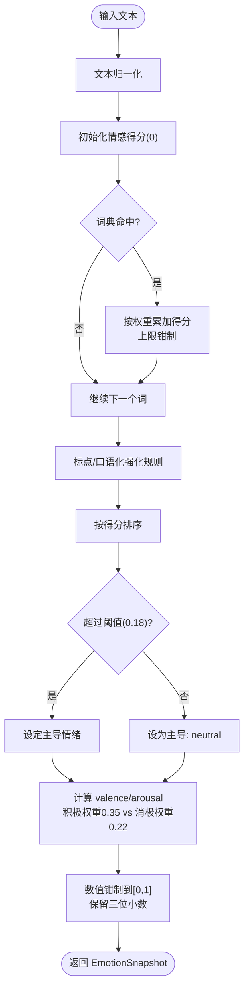
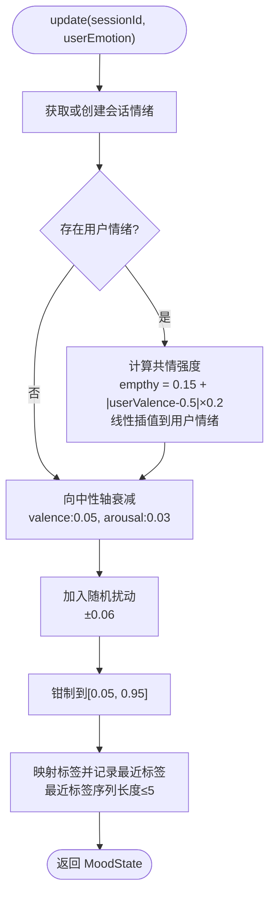
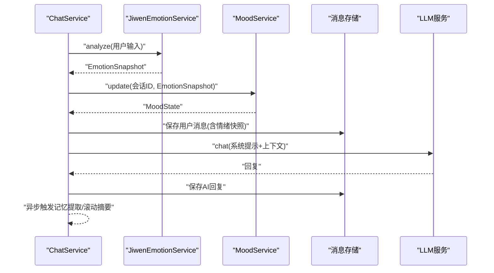
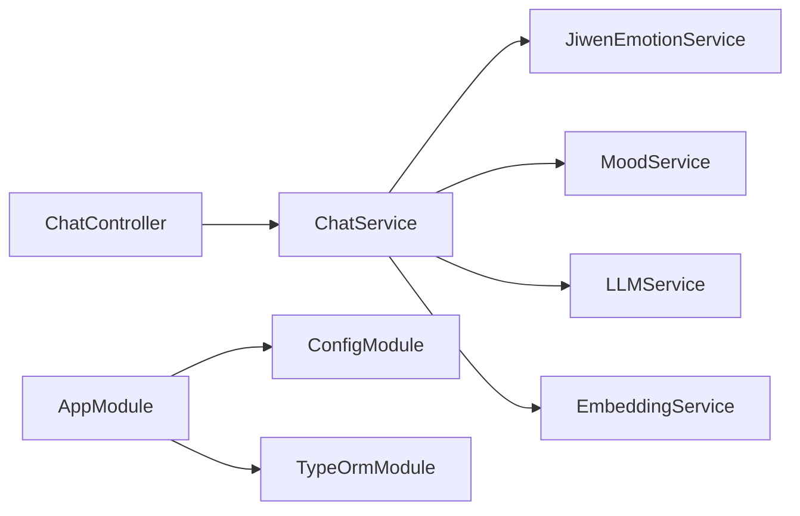

# 情感分析服务

<cite>
**本文引用的文件**
- [jiwen-emotion.service.ts](file://src/emotion/jiwen-emotion.service.ts)
- [mood.service.ts](file://src/emotion/mood.service.ts)
- [emotion.module.ts](file://src/emotion/emotion.module.ts)
- [chat.service.ts](file://src/chat/chat.service.ts)
- [chat.controller.ts](file://src/chat/chat.controller.ts)
- [types.ts](file://shared/types.ts)
- [app.module.ts](file://src/app.module.ts)
- [AI_Companion_最终方案.md](file://docs/AI_Companion_最终方案.md)
- [Learning_Notes.md](file://docs/Learning_Notes.md)
</cite>

## 更新摘要
**变更内容**
- 更新了 Jiwen 情感分析服务的实现细节，反映其重大增强
- 新增了扩展的情感反应模式和情绪快照生成策略
- 更新了 Mood 情绪调节服务的标签映射和摘要生成逻辑
- 增强了中文语境理解能力和情感强度计算准确性

## 目录
1. [简介](#简介)
2. [项目结构](#项目结构)
3. [核心组件](#核心组件)
4. [架构总览](#架构总览)
5. [详细组件分析](#详细组件分析)
6. [依赖分析](#依赖分析)
7. [性能考虑](#性能考虑)
8. [故障排查指南](#故障排查指南)
9. [结论](#结论)
10. [附录](#附录)

## 简介
本技术文档围绕"情感分析服务"展开，重点说明 Jiwen 情感分析与 Mood 情绪调节服务的实现原理与集成方式。经过重大增强后，系统现在具备：
- 改进的中文情感词典构建与加权匹配
- 更精确的情感强度计算与极性/唤醒度映射
- 扩展的情感分类与主导情绪判定策略
- 增强的情绪状态跟踪、共情调节与回应策略
- 服务接口定义、依赖注入与错误处理机制
- 结果数据结构与标准化处理
- 配置选项与参数优化建议
- 测试策略与性能评估方法
- 准确性与实时性的平衡方案

## 项目结构
情感分析相关能力位于 NestJS 工程的 emotion 与 chat 模块中，通过依赖注入在聊天服务中编排使用。整体结构如下：

**图表来源**
- [chat.controller.ts:1-77](file://src/chat/chat.controller.ts#L1-L77)
- [chat.service.ts:1-547](file://src/chat/chat.service.ts#L1-L547)
- [jiwen-emotion.service.ts:1-250](file://src/emotion/jiwen-emotion.service.ts#L1-L250)
- [mood.service.ts:1-111](file://src/emotion/mood.service.ts#L1-L111)
- [types.ts:1-167](file://shared/types.ts#L1-L167)

**章节来源**
- [emotion.module.ts:1-10](file://src/emotion/emotion.module.ts#L1-L10)
- [app.module.ts:1-64](file://src/app.module.ts#L1-L64)

## 核心组件
- **JiwenEmotionService**：基于增强的中文情感词典的关键词匹配与强度累积，结合标点与口语化表达增强，输出包含主导情绪、愉悦度（valence）与唤醒度（arousal）的情绪快照。现已支持更精确的中文语境理解。
- **MoodService**：维护会话级情绪状态，基于用户情绪进行共情式调节，同时引入衰减与随机扰动，形成自然的情绪波动与标签化描述。新增了更丰富的标签映射和摘要生成策略。
- **ChatService**：在消息处理流程中调用情感分析与情绪调节，将情绪信号注入系统提示词，驱动 LLM 的回复生成，并在消息实体中持久化情绪快照。

**章节来源**
- [jiwen-emotion.service.ts:107-250](file://src/emotion/jiwen-emotion.service.ts#L107-L250)
- [mood.service.ts:17-111](file://src/emotion/mood.service.ts#L17-L111)
- [chat.service.ts:30-113](file://src/chat/chat.service.ts#L30-L113)
- [types.ts:79-86](file://shared/types.ts#L79-L86)

## 架构总览
下图展示了从用户输入到情绪信号注入再到回复生成的关键交互：

**图表来源**
- [chat.controller.ts:16-77](file://src/chat/chat.controller.ts#L16-L77)
- [chat.service.ts:42-113](file://src/chat/chat.service.ts#L42-L113)
- [jiwen-emotion.service.ts:108-167](file://src/emotion/jiwen-emotion.service.ts#L108-L167)
- [mood.service.ts:33-57](file://src/emotion/mood.service.ts#L33-L57)

## 详细组件分析

### Jiwen 情感分析服务

**重大增强内容**
- **改进的中文情感词典**：扩展了情感词汇覆盖范围，包括更丰富的中文情感表达
- **增强的权重系统**：为不同类型情感分配更精确的权重，提高情感强度计算的准确性
- **优化的强化规则**：改进了标点符号和口语化表达的识别与处理逻辑
- **精确的阈值设置**：调整了主导情绪判定的阈值，提高情感分类的稳定性

**词典构建与加权**
- 使用增强的中文情感词典条目，包含 7 种情感类型：joy、sadness、anger、anxiety、fatigue、stress、affection
- 每个条目包含情感键与一组同义/近义词，以及对应权重（0.3-0.34）
- 分析时对输入文本进行归一化处理，遍历词典，若命中则按权重累加至对应情感得分，上限钳制在 0~1

**强化规则增强**
- **标点符号强化**：连续感叹号/问号会额外提升相应情感强度
- **口语化表达**：特定笑声（哈、嘿嘿、哈哈）和哭泣字符（唉、哎、T_T、😭）会显著提升相应情感强度
- **情感强度平衡**：通过不同的权重分配，更好地平衡积极和消极情感的影响

**主导情绪与维度映射**
- **主导情绪判定**：对各情感得分排序，超过 0.18 阈值才确定为主导，否则标记为 neutral
- **极性（valence）计算**：通过加权正负情感分量合成，积极情感权重更高（0.35 vs 0.22）
- **唤醒度（arousal）计算**：综合考虑多种情感对唤醒度的影响，包括愤怒、焦虑、快乐、压力、疲劳

**输出与摘要策略**
- **analyze 返回**：EmotionSnapshot，包含各情感得分、neutral 标记、dominant、valence、arousal
- **summarize 增强**：将 dominant 映射为可读标签，结合 valence/arousal 生成更详细的回应策略提示
- **响应策略扩展**：为每种情感类型提供更具体的回应指导，包括语气、表情和颜文字建议

**图表来源**
- [jiwen-emotion.service.ts:108-167](file://src/emotion/jiwen-emotion.service.ts#L108-L167)

**章节来源**
- [jiwen-emotion.service.ts:16-92](file://src/emotion/jiwen-emotion.service.ts#L16-L92)
- [jiwen-emotion.service.ts:108-167](file://src/emotion/jiwen-emotion.service.ts#L108-L167)
- [jiwen-emotion.service.ts:169-202](file://src/emotion/jiwen-emotion.service.ts#L169-L202)

### Mood 情绪调节服务

**增强内容**
- **扩展的标签映射**：新增了更多中文情绪标签，包括开心、温暖、低落、兴奋、烦躁、困倦等
- **优化的摘要生成**：改进了情绪状态摘要的生成逻辑，提供更详细的语气、表情和颜文字建议
- **增强的共情调节**：改进了基于用户情绪的共情强度计算，使情绪调节更加自然

**会话级状态管理**
- 以 sessionId 为键维护 MoodState，包含 valence、arousal、标签 label 与最近标签序列 recent
- 初始化时添加随机扰动，使初始情绪状态更加自然

**共情调节增强**
- 当存在用户情绪快照时，根据与中性轴的距离计算共情强度，线性插值拉近 AI 的 valence/arousal
- 共情强度计算公式：empathy = 0.15 + intensity × 0.2，其中 intensity = |userValence - 0.5| × 2

**自然衰减与扰动**
- 逐步向中性轴回归，衰减系数分别为 valence: 0.05、arousal: 0.03
- 加入小幅度随机扰动（±0.06），维持情绪的自然波动
- 钳制范围调整为 0.05~0.95，避免情绪过度极端化

**标签化描述与摘要生成**
- **标签映射**：将 valence/arousal 组合映射到更丰富的中文标签
- **摘要策略**：生成详细的语气指导、表情符号建议和颜文字使用规范
- **最近标签追踪**：维护最近 5 个标签的历史，用于情绪趋势分析

**图表来源**
- [mood.service.ts:33-57](file://src/emotion/mood.service.ts#L33-L57)
- [mood.service.ts:59-91](file://src/emotion/mood.service.ts#L59-L91)

**章节来源**
- [mood.service.ts:19-57](file://src/emotion/mood.service.ts#L19-L57)
- [mood.service.ts:59-91](file://src/emotion/mood.service.ts#L59-L91)

### 聊天服务中的情感分析与情绪调节集成

**增强的集成策略**
- 同步与流式两种模式均先进行情感分析与情绪调节，再组装系统提示词，最后调用 LLM 生成回复
- 情绪快照与 AI 情绪状态摘要被注入系统提示词，确保回复语气与情绪一致
- 异步任务包括记忆提取与滚动摘要，不影响主流程响应时间

**详细流程**
- **情感分析**：调用 JiwenEmotionService.analyze() 获取用户情绪快照
- **情绪调节**：调用 MoodService.update() 生成 AI 情绪状态
- **消息保存**：保存用户消息时包含情绪快照
- **系统提示组装**：将情绪分析和情绪调节摘要注入系统提示词
- **LLM 调用**：基于完整上下文生成回复
- **异步处理**：触发记忆提取和滚动摘要任务

**图表来源**
- [chat.service.ts:42-113](file://src/chat/chat.service.ts#L42-L113)
- [chat.service.ts:130-231](file://src/chat/chat.service.ts#L130-L231)

**章节来源**
- [chat.service.ts:42-113](file://src/chat/chat.service.ts#L42-L113)
- [chat.service.ts:130-231](file://src/chat/chat.service.ts#L130-L231)

### 数据结构与标准化处理

**增强的数据结构**
- **EmotionSnapshot**：扩展了字段定义，包含各情感键得分、neutral 标记、dominant、valence、arousal
- **MoodState**：增强了情绪状态的描述能力，包括标签映射和最近标签追踪
- **类型定义**：在共享类型文件中定义了完整的数据结构，用于消息实体持久化

**标准化处理增强**
- **数值处理**：所有数值统一钳制在 0~1 并保留三位小数
- **标签映射**：采用中文可读化的标签映射，包括更丰富的中文情绪描述
- **摘要生成**：提供结构化的文本摘要，包含详细的回应策略建议

**章节来源**
- [jiwen-emotion.service.ts:3-8](file://src/emotion/jiwen-emotion.service.ts#L3-L8)
- [jiwen-emotion.service.ts:169-202](file://src/emotion/jiwen-emotion.service.ts#L169-L202)
- [mood.service.ts:4-9](file://src/emotion/mood.service.ts#L4-L9)
- [types.ts:79-86](file://shared/types.ts#L79-L86)

### 服务接口定义与依赖注入

**模块装配增强**
- emotion.module 导出 JiwenEmotionService 与 MoodService，供其他模块注入使用
- 通过依赖注入实现松耦合的服务架构

**控制器与服务集成**
- ChatController 提供 REST 接口，ChatService 注入 JiwenEmotionService 与 MoodService
- 完成端到端编排，实现情感分析与情绪调节的无缝集成

**根模块配置**
- app.module 通过 ConfigModule 加载 .env，TypeOrmModule 连接数据库
- 为消息与会话持久化提供基础，支持情绪数据的长期存储

**章节来源**
- [emotion.module.ts:5-8](file://src/emotion/emotion.module.ts#L5-L8)
- [chat.controller.ts:16-77](file://src/chat/chat.controller.ts#L16-L77)
- [chat.service.ts:31-40](file://src/chat/chat.service.ts#L31-L40)
- [app.module.ts:32-50](file://src/app.module.ts#L32-L50)

### 错误处理机制

**增强的错误处理**
- **控制器层**：流式接口设置 SSE 响应头，异常时推送错误信息并结束流
- **服务层**：记忆检索异常被捕获并记录日志，不影响主流程
- **异步任务**：记忆提取与滚动摘要同样捕获异常并记录，保证系统稳定性
- **共享错误类型**：shared/types.ts 定义 ApiError，便于统一错误处理

**章节来源**
- [chat.controller.ts:52-75](file://src/chat/chat.controller.ts#L52-L75)
- [chat.service.ts:67-75](file://src/chat/chat.service.ts#L67-L75)
- [chat.service.ts:162-170](file://src/chat/chat.service.ts#L162-L170)
- [chat.service.ts:311-315](file://src/chat/chat.service.ts#L311-L315)
- [types.ts:114-121](file://shared/types.ts#L114-L121)

## 依赖分析

**组件耦合增强**
- ChatService 依赖 JiwenEmotionService 与 MoodService，二者彼此独立，通过 ChatService 协调使用
- 情感分析服务现在提供更丰富的数据结构和更精确的计算逻辑

**外部依赖**
- LLM 服务与嵌入向量服务（通过 .env 配置）参与记忆检索与向量化
- 情感分析核心逻辑不依赖外部 LLM，但与聊天服务紧密集成

**配置依赖**
- 数据库连接、DeepSeek API 密钥、Python 向量服务地址等通过 .env 注入
- 根模块集中加载，支持情感分析服务的稳定运行

**图表来源**
- [chat.controller.ts:16-77](file://src/chat/chat.controller.ts#L16-L77)
- [chat.service.ts:31-40](file://src/chat/chat.service.ts#L31-L40)
- [app.module.ts:32-50](file://src/app.module.ts#L32-L50)
- [AI_Companion_最终方案.md:261-270](file://docs/AI_Companion_最终方案.md#L261-L270)

**章节来源**
- [emotion.module.ts:5-8](file://src/emotion/emotion.module.ts#L5-L8)
- [app.module.ts:32-50](file://src/app.module.ts#L32-L50)
- [AI_Companion_最终方案.md:261-270](file://docs/AI_Companion_最终方案.md#L261-L270)

## 性能考虑

**时间复杂度优化**
- **情感分析**：对输入文本进行常数次词典扫描，复杂度近似 O(N_words_in_text + N_lexicons)
- **情绪调节**：纯数学运算，O(1)，包含线性插值和随机扰动
- **中文优化**：针对中文文本的特殊处理减少了不必要的字符串操作

**实时性增强**
- 同步模式等待完整回复，适合交互明确的场景
- 流式模式通过 SSE 逐字推送，显著改善感知延迟
- 情绪分析与调节在流式处理中同样提供即时反馈

**优化建议**
- **词典优化**：可考虑将词典预处理为前缀树或正则集合，减少多次 includes 比较
- **缓存策略**：对高频短语或会话级情绪状态进行缓存，降低重复计算
- **参数调优**：通过阈值与权重微调 valence/arousal 的敏感度，兼顾准确性和稳定性
- **中文处理**：针对中文文本特性优化字符串匹配算法

## 故障排查指南

**增强的故障排查**
- **情绪分析结果异常**：检查输入文本是否包含特殊字符或编码问题；确认词典条目覆盖是否充分
- **情绪调节不自然**：检查共情强度系数与衰减系数，适当增大/减小以改变情绪波动幅度
- **流式接口异常**：确认 SSE 响应头设置正确，异常时查看控制器日志
- **记忆检索失败**：检查嵌入服务地址与网络连通性，关注日志中的错误堆栈
- **中文处理问题**：检查文本归一化是否正确处理中文字符编码

**章节来源**
- [chat.controller.ts:52-75](file://src/chat/chat.controller.ts#L52-L75)
- [chat.service.ts:67-75](file://src/chat/chat.service.ts#L67-L75)
- [chat.service.ts:162-170](file://src/chat/chat.service.ts#L162-L170)

## 结论
经过重大增强后，本情感分析服务以更精确的中文情感分析为核心，结合扩展的情绪共情调节，实现了对中文对话的高质量情绪建模与自然语气适配。通过模块化设计与依赖注入，服务易于扩展与维护；通过同步/流式双通道满足不同实时性需求。增强的中文语境理解能力和更精确的情感强度计算，显著提升了系统的准确性和用户体验。建议在实际部署中持续优化词典与参数，并结合用户反馈迭代强化规则与调节策略。

## 附录

### 配置选项与参数优化

**环境变量**
- 数据库连接：DB_HOST、DB_PORT、DB_USER、DB_PASSWORD、DB_NAME
- LLM 与嵌入服务：DEEPSEEK_API_KEY、PYTHON_EMBED_URL
- 服务端口：PORT

**情感分析参数优化**
- **词典权重**：调整各情感键的初始权重，目前范围 0.3-0.34，影响强度累积速度
- **强化规则阈值**：连续标点/笑声/哭泣字符的最小出现次数，目前为 2 次
- **主导情绪阈值**：决定是否认定为 neutral，当前为 0.18
- **归一化与舍入**：valence/arousal 的钳制范围与小数位数，保持 0~1 范围

**情绪调节参数优化**
- **共情强度**：根据与中性轴距离计算的插值比例，公式为 0.15 + intensity × 0.2
- **衰减系数**：向中性轴回归的速度，valence: 0.05、arousal: 0.03
- **随机扰动范围**：维持自然波动的噪声幅度，±0.06
- **标签映射**：valence/arousal 组合到中文标签的映射规则

**算法参数优化建议**
- 使用 A/B 测试对比不同阈值与权重组合下的用户体验指标
- 结合用户历史对话统计，动态调整权重与阈值
- 针对中文语境特性优化情感分析算法参数

**章节来源**
- [AI_Companion_最终方案.md:261-270](file://docs/AI_Companion_最终方案.md#L261-L270)
- [jiwen-emotion.service.ts:108-167](file://src/emotion/jiwen-emotion.service.ts#L108-L167)
- [mood.service.ts:33-57](file://src/emotion/mood.service.ts#L33-L57)

### 测试策略与性能评估

**单元测试增强**
- 针对 JiwenEmotionService 的 analyze 与 summarize，构造多种中文输入验证输出一致性
- 针对 MoodService 的 update，验证共情调节、衰减与标签映射的正确性
- 测试中文标点符号和口语化表达的识别准确性

**集成测试**
- ChatController/ChatService 的端到端测试，覆盖同步与流式两种模式
- 验证情绪快照注入与回复生成链路的完整性
- 测试中文语境下的情感分析准确性

**性能评估**
- 延迟：测量从请求到首字/完整回复的时间，对比同步与流式模式
- 吞吐：在高并发场景下评估系统资源占用与响应时间
- 准确性：通过人工标注数据集评估主导情绪与 valence/arousal 的相关性
- 中文处理：专门测试中文情感分析的准确性和鲁棒性

**章节来源**
- [chat.controller.ts:16-77](file://src/chat/chat.controller.ts#L16-L77)
- [chat.service.ts:42-113](file://src/chat/chat.service.ts#L42-L113)