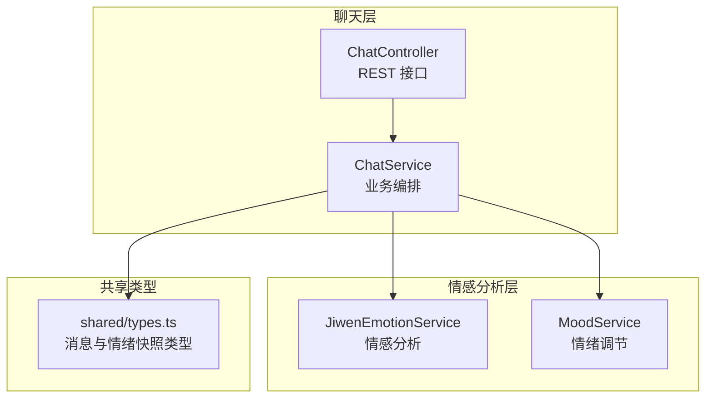
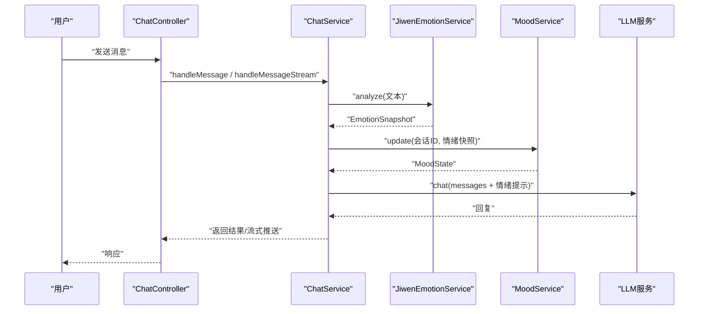
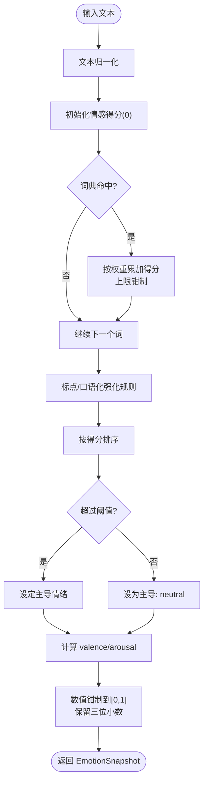
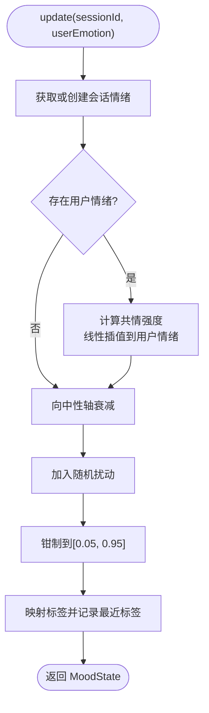
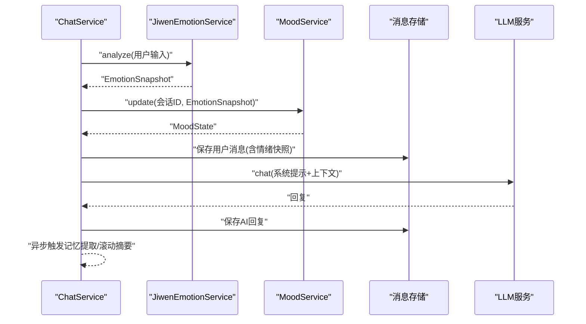
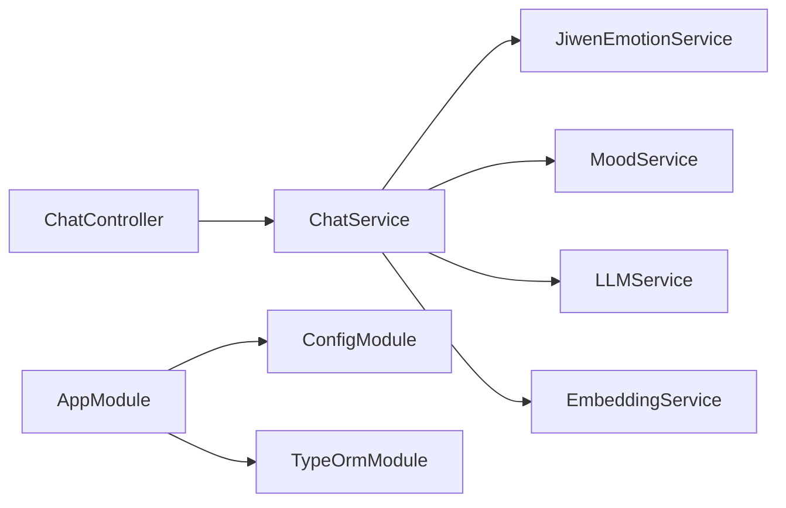

# 情感分析服务

<cite>
**本文引用的文件**
- [jiwen-emotion.service.ts](file://src/emotion/jiwen-emotion.service.ts)
- [mood.service.ts](file://src/emotion/mood.service.ts)
- [emotion.module.ts](file://src/emotion/emotion.module.ts)
- [chat.service.ts](file://src/chat/chat.service.ts)
- [chat.controller.ts](file://src/chat/chat.controller.ts)
- [types.ts](file://shared/types.ts)
- [app.module.ts](file://src/app.module.ts)
- [Learning_Notes.md](file://docs/Learning_Notes.md)
</cite>

## 目录
1. [简介](#简介)
2. [项目结构](#项目结构)
3. [核心组件](#核心组件)
4. [架构总览](#架构总览)
5. [详细组件分析](#详细组件分析)
6. [依赖分析](#依赖分析)
7. [性能考虑](#性能考虑)
8. [故障排查指南](#故障排查指南)
9. [结论](#结论)
10. [附录](#附录)

## 简介
本技术文档围绕“情感分析服务”展开，重点说明 Jiwen 情感分析与 Mood 情绪调节服务的实现原理与集成方式。内容涵盖：
- 情感词典构建与加权匹配
- 情感强度计算与极性/唤醒度映射
- 情感分类与主导情绪判定
- 情绪状态跟踪、共情调节与回应策略
- 服务接口定义、依赖注入与错误处理
- 结果数据结构与标准化处理
- 配置选项与参数优化建议
- 测试策略与性能评估方法
- 准确性与实时性的平衡方案

## 项目结构
情感分析相关能力位于 NestJS 工程的 emotion 与 chat 模块中，通过依赖注入在聊天服务中编排使用。整体结构如下：

图示来源
- [chat.controller.ts:1-77](file://src/chat/chat.controller.ts#L1-L77)
- [chat.service.ts:1-547](file://src/chat/chat.service.ts#L1-L547)
- [jiwen-emotion.service.ts:1-134](file://src/emotion/jiwen-emotion.service.ts#L1-L134)
- [mood.service.ts:1-111](file://src/emotion/mood.service.ts#L1-L111)
- [types.ts:1-166](file://shared/types.ts#L1-L166)

章节来源
- [emotion.module.ts:1-10](file://src/emotion/emotion.module.ts#L1-L10)
- [app.module.ts:1-64](file://src/app.module.ts#L1-L64)

## 核心组件
- JiwenEmotionService：基于中文情感词典的关键词匹配与强度累积，结合标点与口语化表达增强，输出包含主导情绪、愉悦度（valence）与唤醒度（arousal）的情绪快照。
- MoodService：维护会话级情绪状态，基于用户情绪进行共情式调节，同时引入衰减与随机扰动，形成自然的情绪波动与标签化描述。
- ChatService：在消息处理流程中调用情感分析与情绪调节，将情绪信号注入系统提示词，驱动 LLM 的回复生成，并在消息实体中持久化情绪快照。

章节来源
- [jiwen-emotion.service.ts:30-134](file://src/emotion/jiwen-emotion.service.ts#L30-L134)
- [mood.service.ts:17-111](file://src/emotion/mood.service.ts#L17-L111)
- [chat.service.ts:30-113](file://src/chat/chat.service.ts#L30-L113)
- [types.ts:79-86](file://shared/types.ts#L79-L86)

## 架构总览
下图展示了从用户输入到情绪信号注入再到回复生成的关键交互：

图示来源
- [chat.controller.ts:16-77](file://src/chat/chat.controller.ts#L16-L77)
- [chat.service.ts:42-113](file://src/chat/chat.service.ts#L42-L113)
- [jiwen-emotion.service.ts:32-76](file://src/emotion/jiwen-emotion.service.ts#L32-L76)
- [mood.service.ts:33-57](file://src/emotion/mood.service.ts#L33-L57)

## 详细组件分析

### Jiwen 情感分析服务
- 词典构建与加权
  - 使用中文情感词典条目，每个条目包含情感键（joy/sadness/anger/anxiety/fatigue/stress/affection）与一组同义/近义词，以及对应权重。
  - 分析时对输入文本进行归一化处理，遍历词典，若命中则按权重累加至对应情感得分，上限钳制在 0~1。
- 强化规则
  - 标点与口语化：连续感叹号/问号、特定笑声/哭泣字符会额外提升相应情感强度。
- 主导情绪与维度映射
  - 主导情绪：对各情感得分排序，超过阈值才确定为主导，否则标记为 neutral。
  - 极性（valence）与唤醒度（arousal）：通过加权正负情感分量合成，再经归一化得到 0~1 区间。
- 输出与摘要
  - analyze 返回 EmotionSnapshot，包含各情感得分、neutral 标记、dominant、valence、arousal。
  - summarize 将 dominant 映射为可读标签，结合 valence/arousal 生成回应策略提示。

图示来源
- [jiwen-emotion.service.ts:32-76](file://src/emotion/jiwen-emotion.service.ts#L32-L76)

章节来源
- [jiwen-emotion.service.ts:16-24](file://src/emotion/jiwen-emotion.service.ts#L16-L24)
- [jiwen-emotion.service.ts:32-76](file://src/emotion/jiwen-emotion.service.ts#L32-L76)
- [jiwen-emotion.service.ts:78-97](file://src/emotion/jiwen-emotion.service.ts#L78-L97)

### Mood 情绪调节服务
- 会话级状态管理
  - 以 sessionId 为键维护 MoodState，包含 valence、arousal、标签 label 与最近标签序列 recent。
- 共情调节
  - 当存在用户情绪快照时，根据与中性轴的距离计算共情强度，线性插值拉近 AI 的 valence/arousal。
- 自然衰减与扰动
  - 逐步向中性轴回归，加入小幅度随机扰动，维持情绪的自然波动。
- 标签化描述
  - 将 valence/arousal 映射到中文标签（如“开心”“平静”等），并生成适合的语气、表情与颜文字提示。

图示来源
- [mood.service.ts:33-57](file://src/emotion/mood.service.ts#L33-L57)
- [mood.service.ts:101-109](file://src/emotion/mood.service.ts#L101-L109)

章节来源
- [mood.service.ts:19-57](file://src/emotion/mood.service.ts#L19-L57)
- [mood.service.ts:59-91](file://src/emotion/mood.service.ts#L59-L91)

### 聊天服务中的情感分析与情绪调节集成
- 同步与流式两种模式均先进行情感分析与情绪调节，再组装系统提示词，最后调用 LLM 生成回复。
- 情绪快照与 AI 情绪状态摘要被注入系统提示词，确保回复语气与情绪一致。
- 异步任务包括记忆提取与滚动摘要，不影响主流程响应时间。

图示来源
- [chat.service.ts:42-113](file://src/chat/chat.service.ts#L42-L113)
- [chat.service.ts:130-231](file://src/chat/chat.service.ts#L130-L231)

章节来源
- [chat.service.ts:42-113](file://src/chat/chat.service.ts#L42-L113)
- [chat.service.ts:130-231](file://src/chat/chat.service.ts#L130-L231)

### 数据结构与标准化处理
- EmotionSnapshot
  - 字段：各情感键得分、neutral 标记、dominant、valence、arousal。
  - 类型定义见共享类型文件，用于消息实体持久化。
- 情绪摘要
  - summarize 输出结构化文本，包含用户情绪、倾向与强度，以及针对该情绪的回应策略建议。
- 标准化处理
  - 数值统一钳制在 0~1 并保留三位小数，标签映射采用中文可读化。

章节来源
- [jiwen-emotion.service.ts:3-8](file://src/emotion/jiwen-emotion.service.ts#L3-L8)
- [jiwen-emotion.service.ts:78-97](file://src/emotion/jiwen-emotion.service.ts#L78-L97)
- [types.ts:79-86](file://shared/types.ts#L79-L86)

### 服务接口定义与依赖注入
- 模块装配
  - emotion.module 导出 JiwenEmotionService 与 MoodService，供其他模块注入使用。
- 控制器与服务
  - ChatController 提供 REST 接口，ChatService 注入 JiwenEmotionService 与 MoodService，完成端到端编排。
- 根模块配置
  - app.module 通过 ConfigModule 加载 .env，TypeOrmModule 连接数据库，为消息与会话持久化提供基础。

章节来源
- [emotion.module.ts:5-8](file://src/emotion/emotion.module.ts#L5-L8)
- [chat.controller.ts:16-77](file://src/chat/chat.controller.ts#L16-L77)
- [chat.service.ts:31-40](file://src/chat/chat.service.ts#L31-L40)
- [app.module.ts:32-50](file://src/app.module.ts#L32-L50)

### 错误处理机制
- 控制器层
  - 流式接口设置 SSE 响应头，异常时推送错误信息并结束流。
- 服务层
  - 记忆检索异常被捕获并记录日志，不影响主流程。
  - 异步记忆提取与滚动摘要同样捕获异常并记录，保证稳定性。
- 共享错误类型
  - shared/types.ts 定义 ApiError，便于统一错误处理。

章节来源
- [chat.controller.ts:52-75](file://src/chat/chat.controller.ts#L52-L75)
- [chat.service.ts:67-75](file://src/chat/chat.service.ts#L67-L75)
- [chat.service.ts:162-170](file://src/chat/chat.service.ts#L162-L170)
- [chat.service.ts:311-315](file://src/chat/chat.service.ts#L311-L315)
- [types.ts:114-121](file://shared/types.ts#L114-L121)

## 依赖分析
- 组件耦合
  - ChatService 依赖 JiwenEmotionService 与 MoodService，二者彼此独立，通过 ChatService 协调使用。
- 外部依赖
  - LLM 服务与嵌入向量服务（通过 .env 配置）参与记忆检索与向量化，但情感分析核心逻辑不依赖外部 LLM。
- 配置依赖
  - 数据库连接、DeepSeek API 密钥、Python 向量服务地址等通过 .env 注入，根模块集中加载。

图示来源
- [chat.controller.ts:16-77](file://src/chat/chat.controller.ts#L16-L77)
- [chat.service.ts:31-40](file://src/chat/chat.service.ts#L31-L40)
- [app.module.ts:32-50](file://src/app.module.ts#L32-L50)
- [Learning_Notes.md:261-270](file://docs/Learning_Notes.md#L261-L270)

章节来源
- [emotion.module.ts:5-8](file://src/emotion/emotion.module.ts#L5-L8)
- [app.module.ts:32-50](file://src/app.module.ts#L32-L50)
- [Learning_Notes.md:261-270](file://docs/Learning_Notes.md#L261-L270)

## 性能考虑
- 时间复杂度
  - 情感分析：对输入文本进行常数次词典扫描，复杂度近似 O(N_words_in_text + N_lexicons)，在中文短文本场景下可忽略。
  - 情绪调节：纯数学运算，O(1)。
- 实时性
  - 同步模式等待完整回复，适合交互明确的场景；流式模式通过 SSE 逐字推送，显著改善感知延迟。
- 优化建议
  - 词典命中优化：可考虑将词典预处理为前缀树或正则集合，减少多次 includes 比较。
  - 缓存策略：对高频短语或会话级情绪状态进行缓存，降低重复计算。
  - 参数调优：通过阈值与权重微调 valence/arousal 的敏感度，兼顾准确性和稳定性。

## 故障排查指南
- 情绪分析结果异常
  - 检查输入文本是否包含特殊字符或编码问题；确认词典条目覆盖是否充分。
  - 调整强化规则阈值与权重，观察 dominant 与 valence/arousal 的分布。
- 情绪调节不自然
  - 检查共情强度系数与衰减系数，适当增大/减小以改变情绪波动幅度。
  - 关注随机扰动范围，避免过大导致情绪跳跃。
- 流式接口异常
  - 确认 SSE 响应头设置正确，异常时查看控制器日志。
- 记忆检索失败
  - 检查嵌入服务地址与网络连通性，关注日志中的错误堆栈。

章节来源
- [chat.controller.ts:52-75](file://src/chat/chat.controller.ts#L52-L75)
- [chat.service.ts:67-75](file://src/chat/chat.service.ts#L67-L75)
- [chat.service.ts:162-170](file://src/chat/chat.service.ts#L162-L170)

## 结论
本情感分析服务以轻量规则为核心，结合情绪共情调节，实现了对中文对话的快速情绪建模与自然语气适配。通过模块化设计与依赖注入，服务易于扩展与维护；通过同步/流式双通道满足不同实时性需求。建议在实际部署中持续优化词典与参数，并结合用户反馈迭代强化规则与调节策略。

## 附录

### 配置选项与参数优化
- 环境变量（参考 .env 示例）
  - 数据库连接：DB_HOST、DB_PORT、DB_USER、DB_PASSWORD、DB_NAME
  - LLM 与嵌入服务：DEEPSEEK_API_KEY、PYTHON_EMBED_URL
  - 服务端口：PORT
- 情感分析参数（可调）
  - 词典权重：调整各情感键的初始权重，影响强度累积速度。
  - 强化规则阈值：如连续标点/笑声/哭泣字符的最小出现次数。
  - 主导情绪阈值：决定是否认定为 neutral。
  - 归一化与舍入：valence/arousal 的钳制范围与小数位数。
- 情绪调节参数（可调）
  - 共情强度：根据与中性轴距离计算的插值比例。
  - 衰减系数：向中性轴回归的速度。
  - 随机扰动范围：维持自然波动的噪声幅度。
- 算法参数优化建议
  - 使用 A/B 测试对比不同阈值与权重组合下的用户体验指标（如满意度、互动时长）。
  - 结合用户历史对话统计，动态调整权重与阈值。

章节来源
- [Learning_Notes.md:261-270](file://docs/Learning_Notes.md#L261-L270)
- [jiwen-emotion.service.ts:32-76](file://src/emotion/jiwen-emotion.service.ts#L32-L76)
- [mood.service.ts:33-57](file://src/emotion/mood.service.ts#L33-L57)

### 测试策略与性能评估
- 单元测试
  - 针对 JiwenEmotionService 的 analyze 与 summarize，构造多种输入（含标点、语气词、长短句）验证输出一致性。
  - 针对 MoodService 的 update，验证共情调节、衰减与标签映射的正确性。
- 集成测试
  - ChatController/ChatService 的端到端测试，覆盖同步与流式两种模式，验证情绪快照注入与回复生成链路。
- 性能评估
  - 延迟：测量从请求到首字/完整回复的时间，对比同步与流式模式。
  - 吞吐：在高并发场景下评估系统资源占用与响应时间。
  - 准确性：通过人工标注数据集评估主导情绪与 valence/arousal 的相关性。

章节来源
- [chat.controller.ts:16-77](file://src/chat/chat.controller.ts#L16-L77)
- [chat.service.ts:42-113](file://src/chat/chat.service.ts#L42-L113)