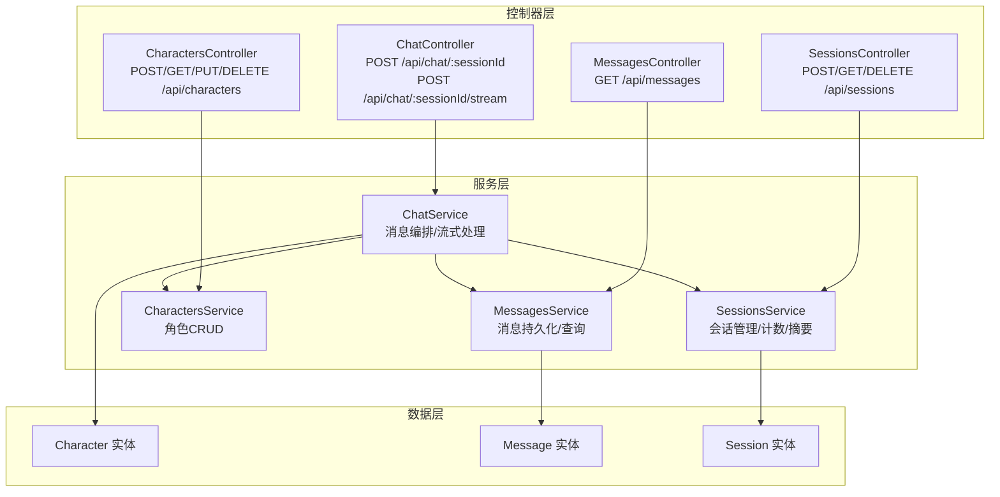
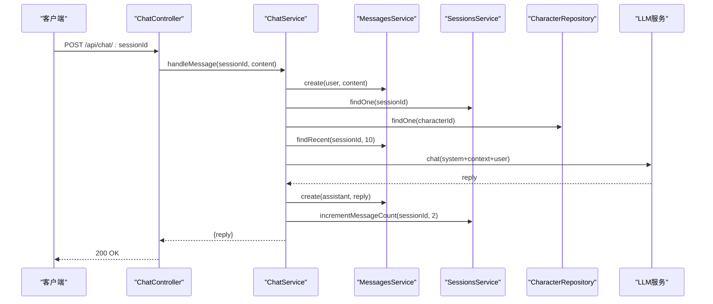
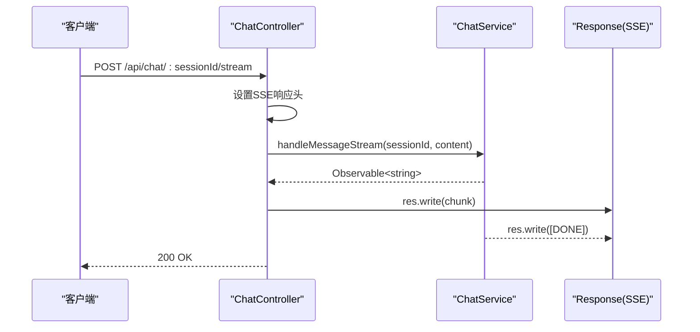
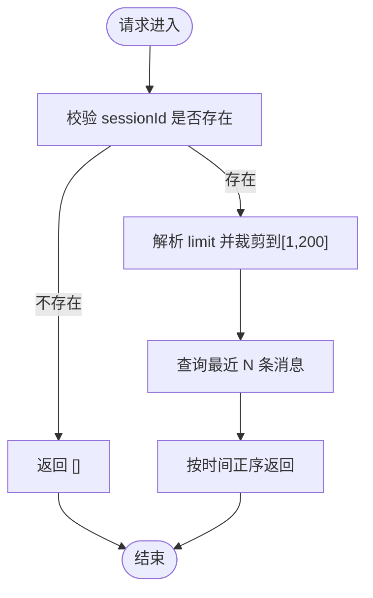
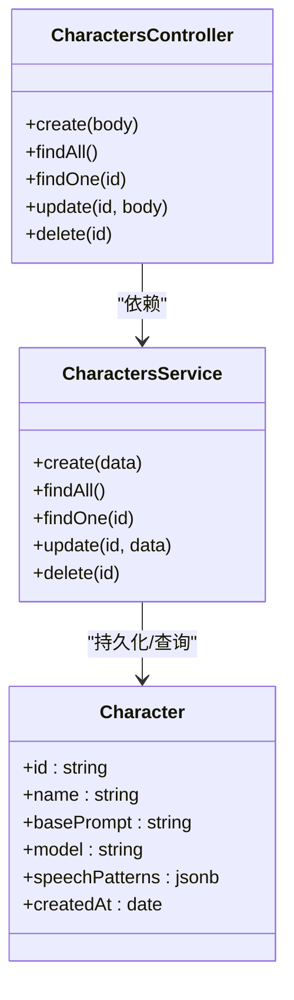
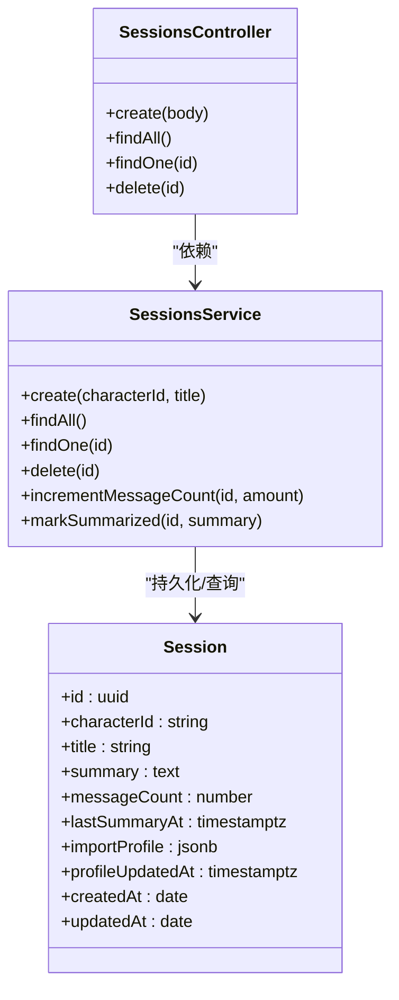
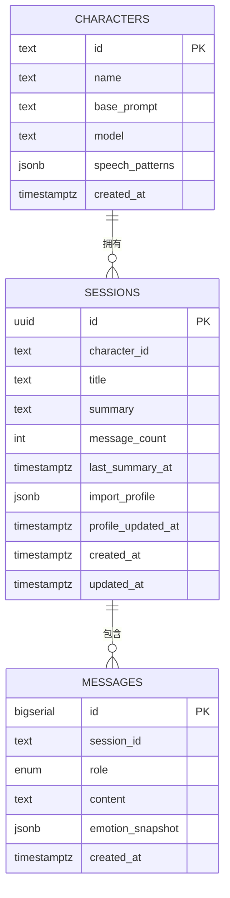
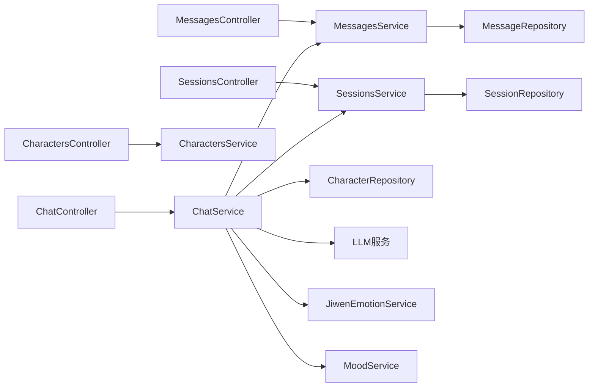

# API接口文档

<cite>
**本文档引用的文件**
- [src/main.ts](file://src/main.ts)
- [src/chat/chat.controller.ts](file://src/chat/chat.controller.ts)
- [src/chat/chat.service.ts](file://src/chat/chat.service.ts)
- [src/messages/messages.controller.ts](file://src/messages/messages.controller.ts)
- [src/messages/messages.service.ts](file://src/messages/messages.service.ts)
- [src/characters/characters.controller.ts](file://src/characters/characters.controller.ts)
- [src/characters/characters.service.ts](file://src/characters/characters.service.ts)
- [src/sessions/sessions.controller.ts](file://src/sessions/sessions.controller.ts)
- [src/sessions/sessions.service.ts](file://src/sessions/sessions.service.ts)
- [src/characters/entities/character.entity.ts](file://src/characters/entities/character.entity.ts)
- [src/messages/entities/message.entity.ts](file://src/messages/entities/message.entity.ts)
- [src/sessions/entities/session.entity.ts](file://src/sessions/entities/session.entity.ts)
- [shared/types.ts](file://shared/types.ts)
</cite>

## 目录
1. [简介](#简介)
2. [项目结构](#项目结构)
3. [核心组件](#核心组件)
4. [架构概览](#架构概览)
5. [详细组件分析](#详细组件分析)
6. [依赖分析](#依赖分析)
7. [性能考虑](#性能考虑)
8. [故障排除指南](#故障排除指南)
9. [结论](#结论)
10. [附录](#附录)

## 简介
本文件为 AI Companion 的完整 API 接口文档，覆盖 RESTful 设计规范、聊天接口（同步与流式）、消息管理、角色管理、会话管理、认证授权、错误处理与响应格式等。所有接口均基于 NestJS 控制器与 TypeORM 实体实现，采用统一的请求/响应格式与错误模型。

## 项目结构
后端采用模块化分层架构：
- 控制器层：暴露 RESTful 接口（chat、messages、characters、sessions）
- 服务层：封装业务逻辑（消息持久化、会话管理、角色 CRUD、聊天编排）
- 数据层：TypeORM 实体映射数据库表（characters、messages、sessions）
- 类型定义：共享 TypeScript 类型与错误模型

**图表来源**
- [src/chat/chat.controller.ts:16-77](file://src/chat/chat.controller.ts#L16-L77)
- [src/messages/messages.controller.ts:10-27](file://src/messages/messages.controller.ts#L10-L27)
- [src/characters/characters.controller.ts:17-56](file://src/characters/characters.controller.ts#L17-L56)
- [src/sessions/sessions.controller.ts:4-28](file://src/sessions/sessions.controller.ts#L4-L28)
- [src/chat/chat.service.ts:29-547](file://src/chat/chat.service.ts#L29-L547)
- [src/messages/messages.service.ts:22-93](file://src/messages/messages.service.ts#L22-L93)
- [src/characters/characters.service.ts:6-41](file://src/characters/characters.service.ts#L6-L41)
- [src/sessions/sessions.service.ts:6-62](file://src/sessions/sessions.service.ts#L6-L62)
- [src/characters/entities/character.entity.ts:3-23](file://src/characters/entities/character.entity.ts#L3-L23)
- [src/messages/entities/message.entity.ts:5-25](file://src/messages/entities/message.entity.ts#L5-L25)
- [src/sessions/entities/session.entity.ts:32-64](file://src/sessions/entities/session.entity.ts#L32-L64)

**章节来源**
- [src/main.ts:4-22](file://src/main.ts#L4-L22)
- [src/chat/chat.controller.ts:16-77](file://src/chat/chat.controller.ts#L16-L77)
- [src/messages/messages.controller.ts:10-27](file://src/messages/messages.controller.ts#L10-L27)
- [src/characters/characters.controller.ts:17-56](file://src/characters/characters.controller.ts#L17-L56)
- [src/sessions/sessions.controller.ts:4-28](file://src/sessions/sessions.controller.ts#L4-L28)

## 核心组件
- 聊天控制器：提供同步与流式两种聊天接口，负责参数校验与响应格式化
- 消息控制器：提供按会话查询历史消息的接口
- 角色控制器：提供角色的创建、查询、更新、删除接口
- 会话控制器：提供会话的创建、查询、删除接口
- 共享类型：统一定义请求/响应结构、错误模型与 SSE 回调接口

**章节来源**
- [shared/types.ts:11-166](file://shared/types.ts#L11-L166)
- [src/chat/chat.controller.ts:16-77](file://src/chat/chat.controller.ts#L16-L77)
- [src/messages/messages.controller.ts:10-27](file://src/messages/messages.controller.ts#L10-L27)
- [src/characters/characters.controller.ts:17-56](file://src/characters/characters.controller.ts#L17-L56)
- [src/sessions/sessions.controller.ts:4-28](file://src/sessions/sessions.controller.ts#L4-L28)

## 架构概览
系统通过控制器接收请求，调用对应服务完成业务处理，服务层与数据库实体交互，最终返回标准化响应。聊天接口在服务层进行消息编排、上下文组装、LLM 调用与异步记忆处理。

**图表来源**
- [src/chat/chat.controller.ts:21-27](file://src/chat/chat.controller.ts#L21-L27)
- [src/chat/chat.service.ts:42-113](file://src/chat/chat.service.ts#L42-L113)
- [src/messages/messages.service.ts:36-49](file://src/messages/messages.service.ts#L36-L49)
- [src/sessions/sessions.service.ts:22-28](file://src/sessions/sessions.service.ts#L22-L28)
- [src/characters/entities/character.entity.ts:3-23](file://src/characters/entities/character.entity.ts#L3-L23)

## 详细组件分析

### 聊天接口
- 同步聊天：POST /api/chat/:sessionId
  - 请求体：包含 content 字段
  - 响应体：包含 reply 字符串
  - 行为：保存用户消息 → 读取上下文 → 向量检索记忆 → 组装 system prompt → 调 LLM → 保存 AI 回复 → 更新消息计数 → 返回完整回复
- 流式聊天：POST /api/chat/:sessionId/stream
  - 请求体：同上
  - 响应：SSE 文本流，逐字推送 chunk，结束时发送 [DONE]
  - 行为：与同步流程一致，但将 LLM 调用改为流式订阅，前端实时接收

**图表来源**
- [src/chat/chat.controller.ts:46-75](file://src/chat/chat.controller.ts#L46-L75)
- [src/chat/chat.service.ts:130-231](file://src/chat/chat.service.ts#L130-L231)

**章节来源**
- [src/chat/chat.controller.ts:21-27](file://src/chat/chat.controller.ts#L21-L27)
- [src/chat/chat.controller.ts:46-75](file://src/chat/chat.controller.ts#L46-L75)
- [src/chat/chat.service.ts:42-113](file://src/chat/chat.service.ts#L42-L113)
- [src/chat/chat.service.ts:130-231](file://src/chat/chat.service.ts#L130-L231)
- [shared/types.ts:92-108](file://shared/types.ts#L92-L108)

### 消息管理接口
- 查询会话历史：GET /api/messages?sessionId=<uuid>&limit=<N>
  - 参数：
    - sessionId：必填，会话 ID
    - limit：可选，默认 50，最大 200
  - 响应：按时间正序排列的消息数组
  - 行为：若 sessionId 缺失则返回空数组；否则查询最近 N 条消息

**图表来源**
- [src/messages/messages.controller.ts:15-25](file://src/messages/messages.controller.ts#L15-L25)
- [src/messages/messages.service.ts:67-74](file://src/messages/messages.service.ts#L67-L74)

**章节来源**
- [src/messages/messages.controller.ts:15-25](file://src/messages/messages.controller.ts#L15-L25)
- [src/messages/messages.service.ts:67-74](file://src/messages/messages.service.ts#L67-L74)

### 角色管理接口
- 创建角色：POST /api/characters
  - 请求体：id、name、base_prompt、model（可选）
  - 响应：创建的角色对象
- 获取角色列表：GET /api/characters
  - 响应：按创建时间倒序的角色数组
- 获取单个角色：GET /api/characters/:id
  - 响应：角色对象（不存在时抛 404）
- 更新角色：PUT /api/characters/:id
  - 请求体：name（可选）、base_prompt（可选）、model（可选）
  - 响应：更新后的角色对象
- 删除角色：DELETE /api/characters/:id
  - 响应：被删除的角色对象

**图表来源**
- [src/characters/characters.controller.ts:17-56](file://src/characters/characters.controller.ts#L17-L56)
- [src/characters/characters.service.ts:6-41](file://src/characters/characters.service.ts#L6-L41)
- [src/characters/entities/character.entity.ts:3-23](file://src/characters/entities/character.entity.ts#L3-L23)

**章节来源**
- [src/characters/characters.controller.ts:21-54](file://src/characters/characters.controller.ts#L21-L54)
- [src/characters/characters.service.ts:13-39](file://src/characters/characters.service.ts#L13-L39)
- [src/characters/entities/character.entity.ts:3-23](file://src/characters/entities/character.entity.ts#L3-L23)
- [shared/types.ts:34-54](file://shared/types.ts#L34-L54)

### 会话管理接口
- 创建会话：POST /api/sessions
  - 请求体：characterId（角色 ID）、title（可选）
  - 响应：新建会话对象
- 获取会话列表：GET /api/sessions
  - 响应：按更新时间倒序的会话数组
- 获取单个会话：GET /api/sessions/:id
  - 响应：会话对象（不存在时抛 404）
- 删除会话：DELETE /api/sessions/:id
  - 响应：被删除的会话对象

**图表来源**
- [src/sessions/sessions.controller.ts:4-28](file://src/sessions/sessions.controller.ts#L4-L28)
- [src/sessions/sessions.service.ts:6-62](file://src/sessions/sessions.service.ts#L6-L62)
- [src/sessions/entities/session.entity.ts:32-64](file://src/sessions/entities/session.entity.ts#L32-L64)

**章节来源**
- [src/sessions/sessions.controller.ts:8-26](file://src/sessions/sessions.controller.ts#L8-L26)
- [src/sessions/sessions.service.ts:13-60](file://src/sessions/sessions.service.ts#L13-L60)
- [src/sessions/entities/session.entity.ts:32-64](file://src/sessions/entities/session.entity.ts#L32-L64)
- [shared/types.ts:60-74](file://shared/types.ts#L60-L74)

### 数据模型
- 角色（characters）
  - 字段：id（主键）、name、base_prompt、model、speech_patterns、created_at
- 消息（messages）
  - 字段：id（自增主键）、session_id、role（枚举 user/assistant）、content、emotion_snapshot、created_at
- 会话（sessions）
  - 字段：id（UUID 主键）、character_id、title、summary、message_count、last_summary_at、import_profile、profile_updated_at、created_at、updated_at

**图表来源**
- [src/characters/entities/character.entity.ts:3-23](file://src/characters/entities/character.entity.ts#L3-L23)
- [src/messages/entities/message.entity.ts:5-25](file://src/messages/entities/message.entity.ts#L5-L25)
- [src/sessions/entities/session.entity.ts:32-64](file://src/sessions/entities/session.entity.ts#L32-L64)

**章节来源**
- [src/characters/entities/character.entity.ts:3-23](file://src/characters/entities/character.entity.ts#L3-L23)
- [src/messages/entities/message.entity.ts:5-25](file://src/messages/entities/message.entity.ts#L5-L25)
- [src/sessions/entities/session.entity.ts:32-64](file://src/sessions/entities/session.entity.ts#L32-L64)

## 依赖分析
- 控制器依赖对应服务，服务依赖 TypeORM Repository 与实体
- 聊天服务依赖消息、会话、角色、记忆、LLM、情绪/心情服务
- 共享类型在前后端复用，确保请求/响应一致性

**图表来源**
- [src/chat/chat.controller.ts:16-18](file://src/chat/chat.controller.ts#L16-L18)
- [src/messages/messages.controller.ts:11-12](file://src/messages/messages.controller.ts#L11-L12)
- [src/characters/characters.controller.ts:18-19](file://src/characters/characters.controller.ts#L18-L19)
- [src/sessions/sessions.controller.ts:5-6](file://src/sessions/sessions.controller.ts#L5-L6)
- [src/chat/chat.service.ts:31-40](file://src/chat/chat.service.ts#L31-L40)

**章节来源**
- [src/chat/chat.service.ts:31-40](file://src/chat/chat.service.ts#L31-L40)

## 性能考虑
- 流式聊天使用 SSE，前端可逐字渲染，提升感知速度
- 消息查询默认限制 50 条，最大 200 条，避免一次性传输过多数据
- 滚动摘要：当消息数达到阈值且超过设定时间间隔才生成摘要，降低 LLM 调用频率
- 异步记忆提取与摘要生成使用 setImmediate，不阻塞主线程

[本节为通用性能建议，无需特定文件引用]

## 故障排除指南
- 常见错误与状态码
  - 404：请求资源不存在（角色、会话）
  - 500：服务器内部错误（LLM 调用失败、数据库异常）
- 错误模型
  - 使用统一的 ApiError 类，包含 status 与 message 字段
- 参数校验
  - sessionId 必填；limit 为数字且不超过 200
  - 角色更新仅对传入字段生效
- 建议排查步骤
  - 确认 sessionId 是否正确
  - 检查角色是否存在
  - 查看服务端日志中的 LLM 调用与内存检索错误

**章节来源**
- [src/characters/characters.service.ts:24-26](file://src/characters/characters.service.ts#L24-L26)
- [src/sessions/sessions.service.ts:24-26](file://src/sessions/sessions.service.ts#L24-L26)
- [shared/types.ts:114-121](file://shared/types.ts#L114-L121)
- [src/messages/messages.controller.ts:20-24](file://src/messages/messages.controller.ts#L20-L24)

## 结论
本 API 文档系统性地描述了 AI Companion 的 RESTful 接口设计与实现细节，涵盖聊天（同步/流式）、消息管理、角色与会话管理等核心功能。通过统一的类型定义与错误模型，保证了前后端的一致性与可维护性。生产部署时建议完善 CORS 策略、接入鉴权机制与参数校验中间件。

[本节为总结性内容，无需特定文件引用]

## 附录

### API 规范与示例

- 聊天接口
  - 同步聊天
    - 方法：POST
    - 路径：/api/chat/{sessionId}
    - 请求体：{"content":"..."}
    - 响应体：{"reply":"..."}
  - 流式聊天
    - 方法：POST
    - 路径：/api/chat/{sessionId}/stream
    - 请求体：{"content":"..."}
    - 响应：SSE 文本流，逐字推送，结束标记 [DONE]
- 消息管理
  - 查询历史
    - 方法：GET
    - 路径：/api/messages?sessionId={uuid}&limit={N}
    - 响应体：消息数组（按时间正序）
- 角色管理
  - 创建角色
    - 方法：POST
    - 路径：/api/characters
    - 请求体：{"id":"...","name":"...","base_prompt":"...","model":"..."}
    - 响应体：角色对象
  - 获取列表
    - 方法：GET
    - 路径：/api/characters
    - 响应体：角色数组
  - 获取单个
    - 方法：GET
    - 路径：/api/characters/{id}
    - 响应体：角色对象
  - 更新角色
    - 方法：PUT
    - 路径：/api/characters/{id}
    - 请求体：{"name":"...","base_prompt":"...","model":"..."}
    - 响应体：角色对象
  - 删除角色
    - 方法：DELETE
    - 路径：/api/characters/{id}
    - 响应体：被删除角色对象
- 会话管理
  - 创建会话
    - 方法：POST
    - 路径：/api/sessions
    - 请求体：{"characterId":"...","title":"..."}
    - 响应体：会话对象
  - 获取列表
    - 方法：GET
    - 路径：/api/sessions
    - 响应体：会话数组
  - 获取单个
    - 方法：GET
    - 路径：/api/sessions/{id}
    - 响应体：会话对象
  - 删除会话
    - 方法：DELETE
    - 路径：/api/sessions/{id}
    - 响应体：被删除会话对象

**章节来源**
- [src/chat/chat.controller.ts:21-27](file://src/chat/chat.controller.ts#L21-L27)
- [src/chat/chat.controller.ts:46-75](file://src/chat/chat.controller.ts#L46-L75)
- [src/messages/messages.controller.ts:15-25](file://src/messages/messages.controller.ts#L15-L25)
- [src/characters/characters.controller.ts:21-54](file://src/characters/characters.controller.ts#L21-L54)
- [src/sessions/sessions.controller.ts:8-26](file://src/sessions/sessions.controller.ts#L8-L26)

### 认证与授权
- 当前实现
  - 开发环境启用 CORS（允许任意来源），未内置鉴权中间件
- 建议
  - 生产环境限制 CORS 来源
  - 引入 API Key 管理与访问控制中间件
  - 为敏感接口增加权限校验（如基于用户/会话的访问控制）

**章节来源**
- [src/main.ts:9-13](file://src/main.ts#L9-L13)

### 错误处理与响应格式
- 统一错误模型：ApiError（包含 status 与 message）
- 参数校验：limit 裁剪至 [1,200]，sessionId 缺失时返回空数组
- 响应格式：JSON；日期字段使用 ISO 8601 字符串

**章节来源**
- [shared/types.ts:114-121](file://shared/types.ts#L114-L121)
- [src/messages/messages.controller.ts:20-24](file://src/messages/messages.controller.ts#L20-L24)