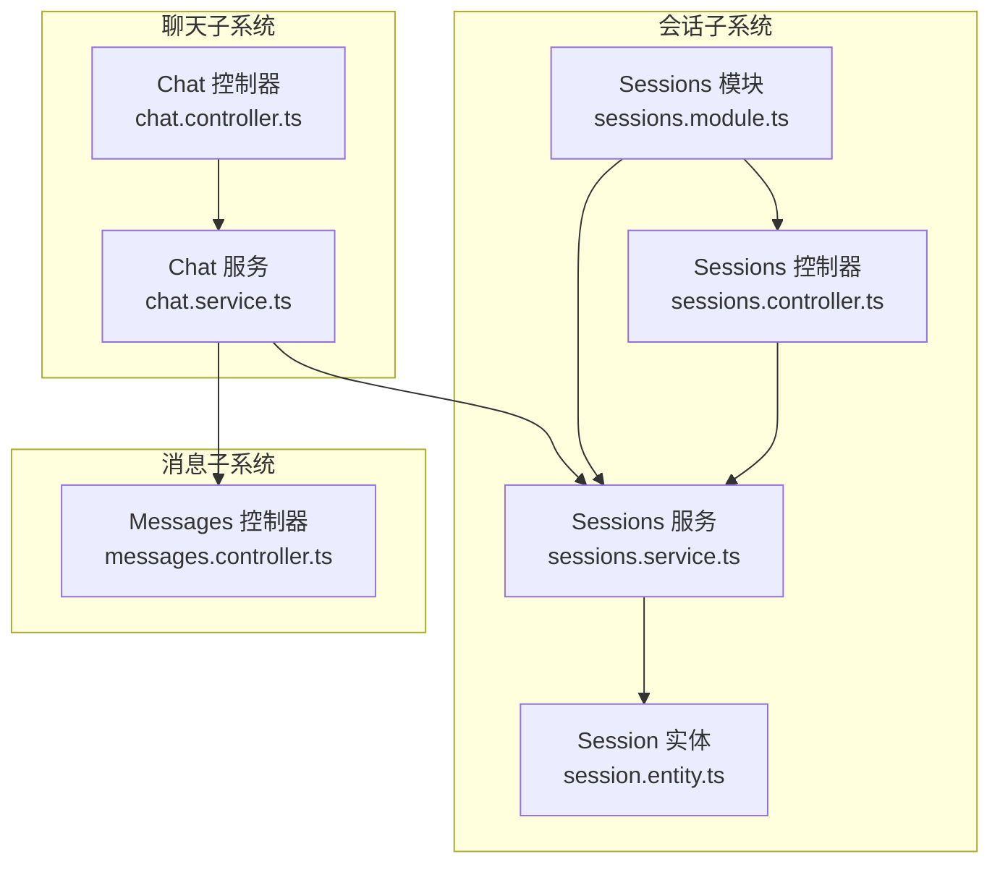
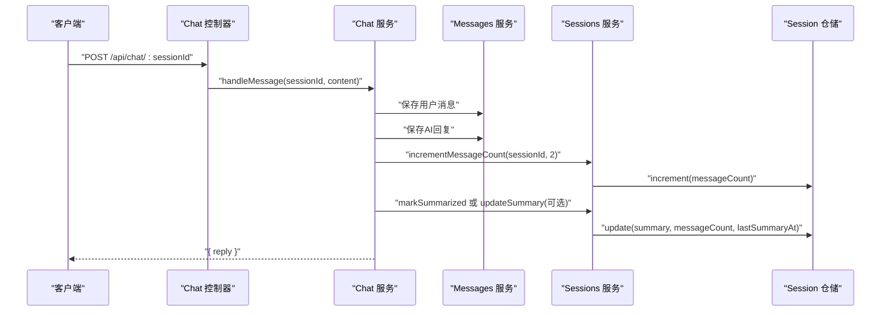
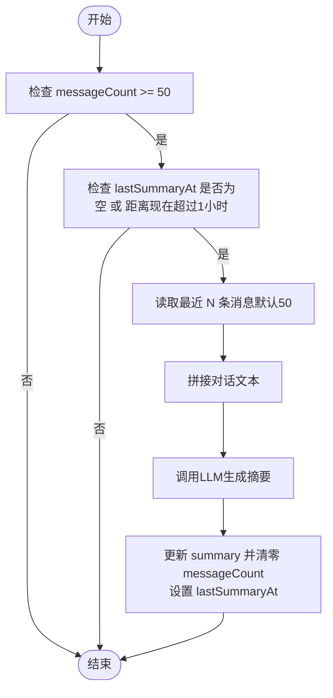
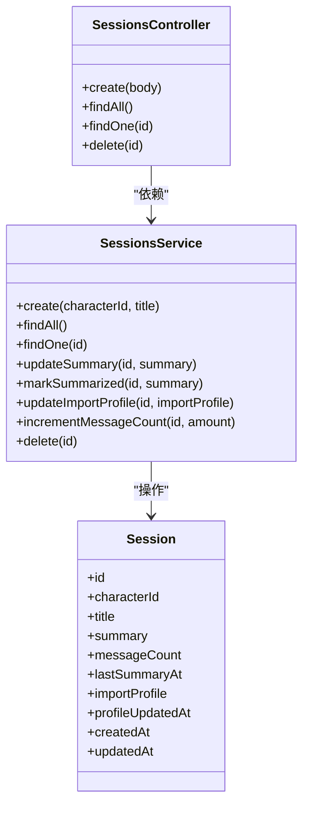

# 会话管理接口

<cite>
**本文引用的文件**
- [session.entity.ts](file://src/sessions/entities/session.entity.ts)
- [sessions.controller.ts](file://src/sessions/sessions.controller.ts)
- [sessions.service.ts](file://src/sessions/sessions.service.ts)
- [sessions.module.ts](file://src/sessions/sessions.module.ts)
- [chat.controller.ts](file://src/chat/chat.controller.ts)
- [chat.service.ts](file://src/chat/chat.service.ts)
- [messages.controller.ts](file://src/messages/messages.controller.ts)
</cite>

## 目录
1. [简介](#简介)
2. [项目结构](#项目结构)
3. [核心组件](#核心组件)
4. [架构总览](#架构总览)
5. [详细组件分析](#详细组件分析)
6. [依赖分析](#依赖分析)
7. [性能考虑](#性能考虑)
8. [故障排查指南](#故障排查指南)
9. [结论](#结论)
10. [附录](#附录)

## 简介
本文件为“会话管理接口”的完整API文档，覆盖会话实体的数据结构、CRUD接口设计、状态与清理策略、导入导出与迁移建议，以及与消息查询、聊天交互的关联关系。文档同时提供请求/响应示例与最佳实践，帮助开发者快速集成与扩展。

## 项目结构
会话管理位于后端 NestJS 应用的 sessions 子系统，核心由实体、控制器、服务与模块组成，并通过聊天与消息模块进行业务联动。

图表来源
- [sessions.controller.ts:1-28](file://src/sessions/sessions.controller.ts#L1-L28)
- [sessions.service.ts:1-62](file://src/sessions/sessions.service.ts#L1-L62)
- [session.entity.ts:1-64](file://src/sessions/entities/session.entity.ts#L1-L64)
- [sessions.module.ts:1-14](file://src/sessions/sessions.module.ts#L1-L14)
- [chat.controller.ts:1-77](file://src/chat/chat.controller.ts#L1-L77)
- [chat.service.ts:1-547](file://src/chat/chat.service.ts#L1-L547)
- [messages.controller.ts:1-27](file://src/messages/messages.controller.ts#L1-L27)

章节来源
- [sessions.controller.ts:1-28](file://src/sessions/sessions.controller.ts#L1-L28)
- [sessions.service.ts:1-62](file://src/sessions/sessions.service.ts#L1-L62)
- [session.entity.ts:1-64](file://src/sessions/entities/session.entity.ts#L1-L64)
- [sessions.module.ts:1-14](file://src/sessions/sessions.module.ts#L1-L14)

## 核心组件
- 会话实体（Session）：定义会话在数据库中的字段、类型与约束，包含角色关联、标题、摘要、消息计数、导入画像、时间戳等。
- 会话控制器（SessionsController）：暴露会话的创建、查询、删除等REST接口。
- 会话服务（SessionsService）：封装会话的持久化、更新（摘要、导入画像、消息计数）、删除等业务逻辑。
- 会话模块（SessionsModule）：注册实体、控制器与服务，供应用其他模块依赖。

章节来源
- [session.entity.ts:32-63](file://src/sessions/entities/session.entity.ts#L32-L63)
- [sessions.controller.ts:4-27](file://src/sessions/sessions.controller.ts#L4-L27)
- [sessions.service.ts:7-61](file://src/sessions/sessions.service.ts#L7-L61)
- [sessions.module.ts:7-13](file://src/sessions/sessions.module.ts#L7-L13)

## 架构总览
会话管理与聊天、消息模块存在紧密耦合：聊天服务在每次对话后会更新会话的消息计数与摘要；消息控制器提供按会话查询历史的能力；会话控制器提供基础的CRUD接口。

图表来源
- [chat.controller.ts:20-27](file://src/chat/chat.controller.ts#L20-L27)
- [chat.service.ts:42-113](file://src/chat/chat.service.ts#L42-L113)
- [chat.service.ts:52-55](file://src/chat/chat.service.ts#L52-L55)
- [sessions.service.ts:52-55](file://src/sessions/sessions.service.ts#L52-L55)
- [sessions.service.ts:35-42](file://src/sessions/sessions.service.ts#L35-L42)

## 详细组件分析

### 会话实体数据结构
会话实体定义如下字段与约束（字段名、类型、是否可空、默认值、注释）：

- id
  - 类型：UUID
  - 约束：主键，自增列（TypeORM注解）
  - 说明：会话唯一标识
- characterId
  - 类型：字符串
  - 约束：非空
  - 说明：关联的角色ID
- title
  - 类型：字符串
  - 约束：可空
  - 说明：会话标题（可为空）
- summary
  - 类型：文本
  - 约束：可空
  - 说明：滚动摘要（用于系统提示拼接）
- messageCount
  - 类型：整数
  - 默认值：0
  - 说明：自上次摘要以来的消息数量
- lastSummaryAt
  - 类型：带时区的时间戳
  - 约束：可空
  - 说明：上次生成摘要的时间
- importProfile
  - 类型：JSONB
  - 约束：可空
  - 说明：导入画像（包含用户画像、关系画像、证据元信息）
- profileUpdatedAt
  - 类型：带时区的时间戳
  - 约束：可空
  - 说明：导入画像更新时间
- createdAt
  - 类型：带时区的时间戳
  - 约束：不可空
  - 说明：创建时间（TypeORM自动维护）
- updatedAt
  - 类型：带时区的时间戳
  - 约束：不可空
  - 说明：更新时间（TypeORM自动维护）

导入画像（ImportProfile）结构要点：
- userPersona：稳定事实、偏好、表达风格、情绪模式、边界等数组字段
- relationshipProfile：关系语气、亲密度、信任信号、反复话题、支持需求、AI角色等
- evidence：来源、消息计数、生成时间等

章节来源
- [session.entity.ts:32-63](file://src/sessions/entities/session.entity.ts#L32-L63)
- [session.entity.ts:9-30](file://src/sessions/entities/session.entity.ts#L9-L30)

### 会话CRUD接口设计
- 创建会话
  - 方法与路径：POST /api/sessions
  - 请求体参数：
    - characterId：字符串，必填，关联角色ID
    - title：字符串，可选，会话标题
  - 成功响应：返回完整会话对象（包含自动生成的id、时间戳等）
  - 参数校验：当前控制器未做显式校验，建议在服务层或拦截器中增加校验（如characterId非空、合法UUID）
- 查询所有会话
  - 方法与路径：GET /api/sessions
  - 响应：按updatedAt降序排列的会话列表
- 查询单一会话
  - 方法与路径：GET /api/sessions/:id
  - 响应：单个会话对象
  - 异常：当会话不存在时返回“未找到”错误
- 删除会话
  - 方法与路径：DELETE /api/sessions/:id
  - 行为：先查找再删除；未发现会话时抛出“未找到”异常
  - 级联：当前服务未声明数据库级级联；若需级联删除消息/记忆，请在数据库或TypeORM配置中补充

请求/响应示例（基于现有实现）
- 创建会话
  - 请求
    - 方法：POST
    - 路径：/api/sessions
    - 请求体：{"characterId":"角色ID","title":"标题"}
  - 响应
    - 状态码：201 或 200
    - 示例响应体：包含id、characterId、title、summary、messageCount、lastSummaryAt、importProfile、profileUpdatedAt、createdAt、updatedAt
- 查询所有会话
  - 请求
    - 方法：GET
    - 路径：/api/sessions
  - 响应
    - 状态码：200
    - 示例响应体：数组，元素为会话对象（按updatedAt降序）
- 查询单一会话
  - 请求
    - 方法：GET
    - 路径：/api/sessions/:id
  - 响应
    - 状态码：200
    - 示例响应体：单个会话对象
  - 异常
    - 状态码：404
    - 示例响应体：{"message":"会话 \"<id>\" 不存在"}
- 删除会话
  - 请求
    - 方法：DELETE
    - 路径：/api/sessions/:id
  - 响应
    - 状态码：200
    - 示例响应体：被删除的会话对象

章节来源
- [sessions.controller.ts:8-26](file://src/sessions/sessions.controller.ts#L8-L26)
- [sessions.service.ts:13-19](file://src/sessions/sessions.service.ts#L13-L19)
- [sessions.service.ts:22-28](file://src/sessions/sessions.service.ts#L22-L28)
- [sessions.service.ts:57-60](file://src/sessions/sessions.service.ts#L57-L60)

### 会话状态管理与清理策略
- 激活状态与最后活跃时间
  - 当前实现未提供独立的“激活/非激活”布尔字段；活跃度可通过updatedAt体现
- 滚动摘要与清理
  - 触发条件：
    - 消息数达到阈值（默认50条）
    - 距离上次摘要至少1小时（lastSummaryAt判断）
  - 执行流程：
    - 读取最近N条消息（默认50条）
    - 生成摘要并写回summary
    - 重置messageCount为0
    - 更新lastSummaryAt为当前时间
  - 该流程由聊天服务在异步阶段触发，会话服务提供对应方法

图表来源
- [chat.service.ts:334-374](file://src/chat/chat.service.ts#L334-L374)
- [sessions.service.ts:35-42](file://src/sessions/sessions.service.ts#L35-L42)

章节来源
- [chat.service.ts:334-374](file://src/chat/chat.service.ts#L334-L374)
- [sessions.service.ts:35-42](file://src/sessions/sessions.service.ts#L35-L42)

### 会话导入与导出API设计
- 导入画像（ImportProfile）
  - 更新接口：会话服务提供更新导入画像的方法，内部会同时更新profileUpdatedAt
  - 结构：包含userPersona与relationshipProfile两大块，以及证据元信息
  - 使用场景：将外部聊天记录的长期画像注入到会话，增强系统提示质量
- 导出能力
  - 当前控制器未提供导出端点；可在控制器新增GET /api/sessions/:id/export，返回会话及其摘要、导入画像、消息统计等
  - 建议返回结构：会话基本信息 + 摘要 + 导入画像 + 近期消息片段（可选）

章节来源
- [sessions.service.ts:44-50](file://src/sessions/sessions.service.ts#L44-L50)
- [session.entity.ts:9-30](file://src/sessions/entities/session.entity.ts#L9-L30)

### 会话迁移最佳实践
- 数据一致性
  - 迁移前备份数据库；迁移后验证关键字段（characterId、messageCount、lastSummaryAt、importProfile）完整性
- 级联删除
  - 若需删除会话时级联删除消息/记忆，请在数据库或TypeORM配置中添加外键级联策略
- 摘要与计数
  - 迁移后若存在历史消息，建议重新计算messageCount并按需生成摘要，确保prompt质量

## 依赖分析
- 控制器依赖服务：SessionsController 仅依赖 SessionsService
- 服务依赖仓储：SessionsService 依赖 TypeORM 仓储访问 Session 实体
- 聊天服务依赖：ChatService 依赖 SessionsService 以更新消息计数与摘要
- 消息查询依赖：MessagesController 依赖 MessagesService 以按会话查询历史

图表来源
- [sessions.controller.ts:1-28](file://src/sessions/sessions.controller.ts#L1-L28)
- [sessions.service.ts:1-62](file://src/sessions/sessions.service.ts#L1-L62)
- [session.entity.ts:32-63](file://src/sessions/entities/session.entity.ts#L32-L63)

章节来源
- [sessions.controller.ts:1-28](file://src/sessions/sessions.controller.ts#L1-L28)
- [sessions.service.ts:1-62](file://src/sessions/sessions.service.ts#L1-L62)
- [session.entity.ts:32-63](file://src/sessions/entities/session.entity.ts#L32-L63)

## 性能考虑
- 查询排序：查询所有会话按updatedAt降序，适合“最近活跃”展示；建议在数据库为updatedAt建立索引
- 摘要生成：滚动摘要仅在满足阈值与时间间隔时触发，避免频繁LLM调用
- 消息计数：通过increment原子操作减少并发冲突下的竞态
- 导入画像：JSONB存储便于灵活扩展，但需注意查询与索引策略

## 故障排查指南
- 会话不存在
  - 现象：查询单一会话返回“未找到”
  - 处理：确认传入的id有效且存在；检查characterId是否正确
- 参数校验缺失
  - 现象：请求体缺少必要字段导致异常
  - 建议：在控制器或管道中增加校验（如characterId非空、合法UUID）
- 级联删除
  - 现象：删除会话后消息/记忆未同步删除
  - 建议：在数据库或TypeORM配置中启用外键级联删除

章节来源
- [sessions.service.ts:22-28](file://src/sessions/sessions.service.ts#L22-L28)
- [sessions.controller.ts:8-11](file://src/sessions/sessions.controller.ts#L8-L11)

## 结论
会话管理接口围绕Session实体提供了基础的CRUD能力，并与聊天、消息模块形成清晰的职责分工。通过消息计数与滚动摘要机制，系统能在保证性能的同时维持高质量的上下文。建议后续补充参数校验、导出端点与数据库级级联策略，以进一步提升可用性与可靠性。

## 附录

### 会话列表查询接口规范
- 方法与路径：GET /api/sessions
- 响应：按updatedAt降序排列的会话数组
- 说明：当前实现未提供按角色过滤、时间范围筛选与分页参数；如需扩展，可在控制器与服务层增加相应查询条件与分页逻辑

章节来源
- [sessions.controller.ts:13-16](file://src/sessions/sessions.controller.ts#L13-L16)
- [sessions.service.ts:18-20](file://src/sessions/sessions.service.ts#L18-L20)

### 会话历史数据格式与统计信息
- 会话历史查询
  - 方法与路径：GET /api/messages?sessionId=<uuid>&limit=<n>
  - 响应：按时间升序排列的消息数组（默认limit=50，最大200）
- 统计信息
  - messageCount：自上次摘要以来的消息数量
  - summary：滚动摘要
  - lastSummaryAt：上次摘要时间
  - profileUpdatedAt：导入画像更新时间

章节来源
- [messages.controller.ts:14-25](file://src/messages/messages.controller.ts#L14-L25)
- [session.entity.ts:46-56](file://src/sessions/entities/session.entity.ts#L46-L56)