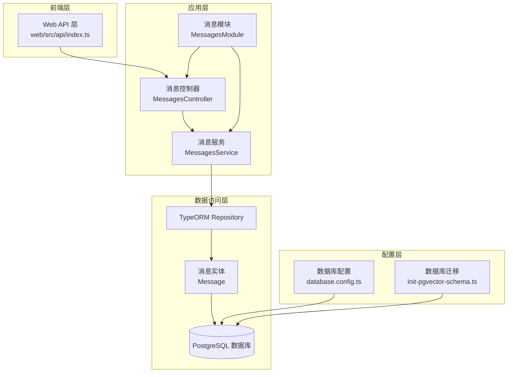
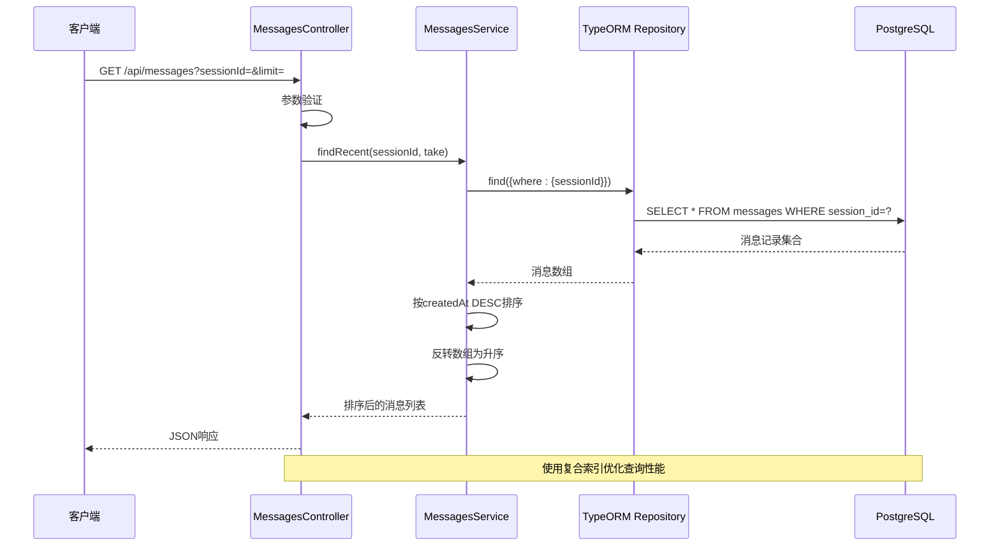
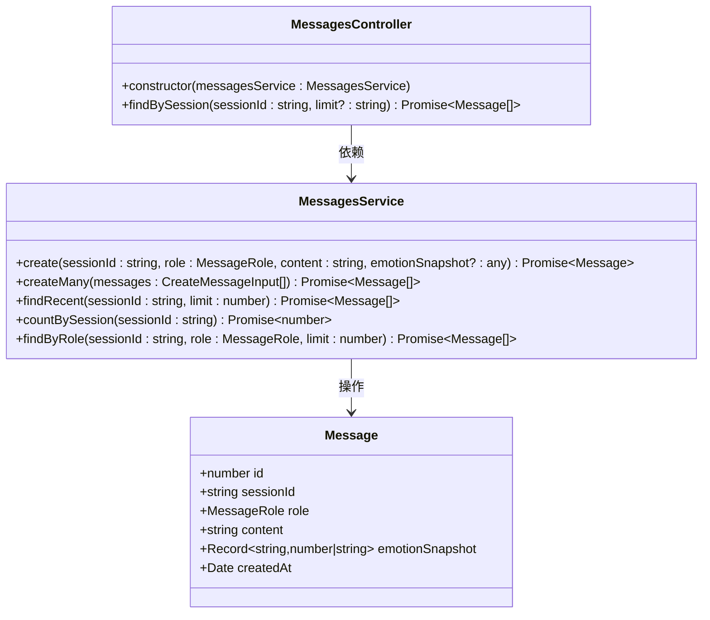
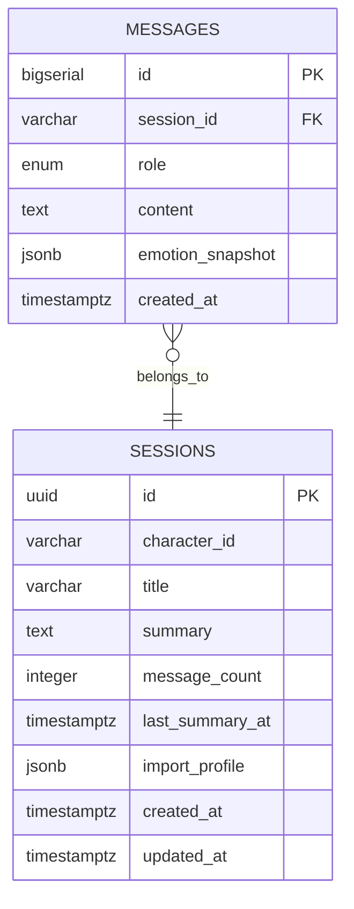
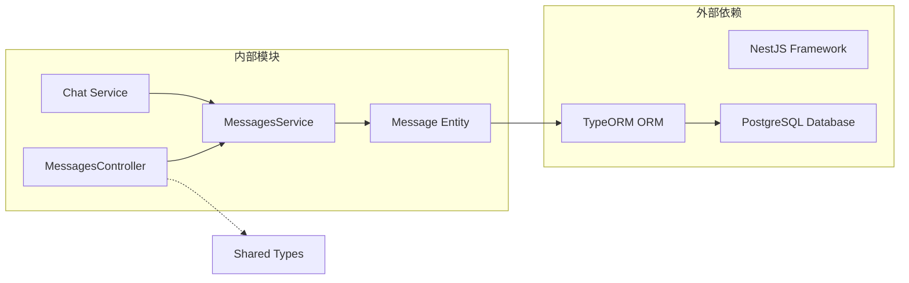
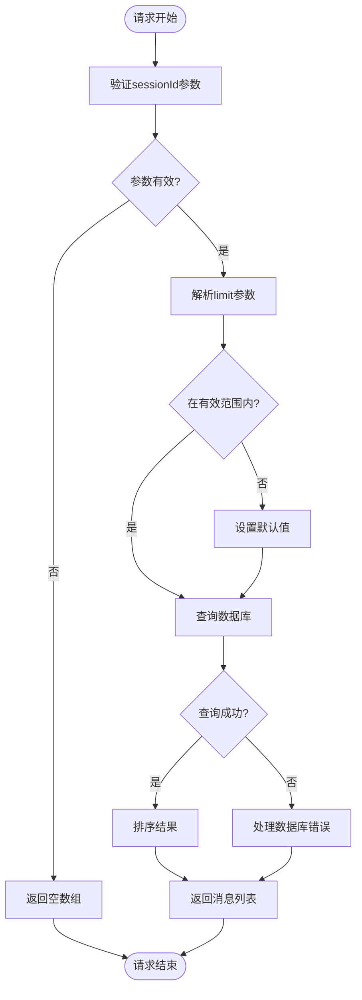

# 消息管理接口

<cite>
**本文档引用的文件**
- [messages.controller.ts](file://src/messages/messages.controller.ts)
- [messages.service.ts](file://src/messages/messages.service.ts)
- [message.entity.ts](file://src/messages/entities/message.entity.ts)
- [messages.module.ts](file://src/messages/messages.module.ts)
- [chat.service.ts](file://src/chat/chat.service.ts)
- [database.config.ts](file://src/config/database.config.ts)
- [1710000000000-init-pgvector-schema.ts](file://src/migrations/1710000000000-init-pgvector-schema.ts)
- [types.ts](file://shared/types.ts)
- [index.ts](file://web/src/api/index.ts)
</cite>

## 目录
1. [简介](#简介)
2. [项目结构](#项目结构)
3. [核心组件](#核心组件)
4. [架构概览](#架构概览)
5. [详细组件分析](#详细组件分析)
6. [依赖分析](#依赖分析)
7. [性能考虑](#性能考虑)
8. [故障排除指南](#故障排除指南)
9. [结论](#结论)

## 简介
本文档详细说明了消息管理接口的完整API规范，重点涵盖GET /api/messages接口的实现细节。该接口用于获取特定会话的历史消息，支持基于会话ID的消息过滤、可配置的分页机制和排序规则。文档还提供了消息实体的数据结构定义、SQL查询示例、性能优化建议，以及消息CRUD操作的完整设计规范。

## 项目结构
消息管理功能在项目中采用标准的NestJS三层架构设计：



**图表来源**
- [messages.controller.ts:1-27](file://src/messages/messages.controller.ts#L1-L27)
- [messages.service.ts:1-93](file://src/messages/messages.service.ts#L1-L93)
- [messages.module.ts:1-14](file://src/messages/messages.module.ts#L1-L14)

**章节来源**
- [messages.controller.ts:1-27](file://src/messages/messages.controller.ts#L1-L27)
- [messages.service.ts:1-93](file://src/messages/messages.service.ts#L1-L93)
- [messages.module.ts:1-14](file://src/messages/messages.module.ts#L1-L14)

## 核心组件

### 消息实体定义
消息实体采用TypeORM注解映射到PostgreSQL数据库表，具有以下关键属性：

| 字段名 | 类型 | 约束 | 描述 |
|--------|------|------|------|
| id | BIGSERIAL | 主键 | 自增整数主键，用于唯一标识消息记录 |
| sessionId | VARCHAR | NOT NULL | 所属会话UUID，关联到会话表 |
| role | ENUM | NOT NULL | 消息角色，仅允许'user'或'assistant' |
| content | TEXT | NOT NULL | 消息正文内容，支持任意长度文本 |
| emotionSnapshot | JSONB | NULLABLE | 情绪快照数据，存储jiwen引擎分析结果 |
| createdAt | TIMESTAMPTZ | 默认值 | 创建时间戳，默认当前时间 |

### 查询参数过滤条件
GET /api/messages接口支持以下查询参数：

- **sessionId** (必需): 会话ID，用于筛选特定会话的所有消息
- **limit** (可选): 返回消息数量限制，默认50，最大200

### 分页机制
系统采用简单的分页策略：
- 默认返回最近50条消息
- 最大限制为200条消息
- 实际分页通过take参数控制，无需offset

### 排序规则
消息按创建时间降序排列（最新消息在前），然后在服务层反转为升序（旧→新）以符合LLM API要求。

**章节来源**
- [message.entity.ts:1-25](file://src/messages/entities/message.entity.ts#L1-L25)
- [messages.controller.ts:14-26](file://src/messages/messages.controller.ts#L14-L26)
- [messages.service.ts:67-74](file://src/messages/messages.service.ts#L67-L74)

## 架构概览



**图表来源**
- [messages.controller.ts:15-25](file://src/messages/messages.controller.ts#L15-L25)
- [messages.service.ts:67-74](file://src/messages/messages.service.ts#L67-L74)
- [1710000000000-init-pgvector-schema.ts:84-86](file://src/migrations/1710000000000-init-pgvector-schema.ts#L84-L86)

## 详细组件分析

### 消息控制器 (MessagesController)
负责HTTP请求处理和参数验证：



**图表来源**
- [messages.controller.ts:10-26](file://src/messages/messages.controller.ts#L10-L26)
- [messages.service.ts:23-92](file://src/messages/messages.service.ts#L23-L92)
- [message.entity.ts:5-24](file://src/messages/entities/message.entity.ts#L5-L24)

### 消息服务 (MessagesService)
提供核心业务逻辑实现：

#### 核心方法说明

1. **create()** - 创建单条消息
   - 参数：sessionId, role, content, emotionSnapshot
   - 返回：保存后的消息对象
   - 用途：聊天流程中保存用户消息和AI回复

2. **createMany()** - 批量创建消息
   - 参数：消息对象数组
   - 返回：批量保存的结果
   - 用途：历史记录导入功能

3. **findRecent()** - 获取最近消息
   - 参数：sessionId, limit
   - 返回：按时间排序的消息数组
   - 用途：LLM上下文构建

4. **countBySession()** - 统计消息数量
   - 参数：sessionId
   - 返回：消息总数
   - 用途：滚动摘要触发条件

5. **findByRole()** - 按角色过滤
   - 参数：sessionId, role, limit
   - 返回：指定角色的消息列表
   - 用途：说话风格分析

### 数据库设计与索引



**图表来源**
- [1710000000000-init-pgvector-schema.ts:60-68](file://src/migrations/1710000000000-init-pgvector-schema.ts#L60-L68)
- [1710000000000-init-pgvector-schema.ts:35-47](file://src/migrations/1710000000000-init-pgvector-schema.ts#L35-L47)

**章节来源**
- [messages.controller.ts:14-26](file://src/messages/messages.controller.ts#L14-L26)
- [messages.service.ts:29-91](file://src/messages/messages.service.ts#L29-L91)
- [1710000000000-init-pgvector-schema.ts:84-86](file://src/migrations/1710000000000-init-pgvector-schema.ts#L84-L86)

## 依赖分析



**图表来源**
- [messages.module.ts:7-11](file://src/messages/messages.module.ts#L7-L11)
- [chat.service.ts:30-40](file://src/chat/chat.service.ts#L30-L40)

**章节来源**
- [messages.module.ts:1-14](file://src/messages/messages.module.ts#L1-L14)
- [chat.service.ts:1-547](file://src/chat/chat.service.ts#L1-L547)

## 性能考虑

### 数据库索引优化
系统已建立关键索引以优化查询性能：

1. **messages_session_created_at复合索引**
   - 作用：加速按会话ID和时间的查询
   - 查询模式：WHERE session_id=? ORDER BY created_at DESC LIMIT n

2. **memory_chunks索引**
   - 作用：支持向量相似度搜索
   - 类型：HNSW向量索引，使用余弦相似度

### 查询性能优化建议

#### SQL查询示例
```sql
-- 基础查询（推荐）
SELECT id, session_id, role, content, emotion_snapshot, created_at
FROM messages 
WHERE session_id = $1 
ORDER BY created_at DESC 
LIMIT 50;

-- 按角色过滤
SELECT id, session_id, role, content, emotion_snapshot, created_at
FROM messages 
WHERE session_id = $1 AND role = $2
ORDER BY created_at DESC 
LIMIT 200;
```

#### 性能优化策略
1. **索引利用**
   - 确保session_id查询使用复合索引
   - 避免在session_id列上使用函数包装

2. **查询限制**
   - 限制返回数量，避免全表扫描
   - 使用LIMIT控制内存使用

3. **连接池配置**
   - 配置合适的连接池大小
   - 启用连接复用减少开销

4. **缓存策略**
   - 对热门会话消息进行缓存
   - 实现LRU缓存管理

**章节来源**
- [1710000000000-init-pgvector-schema.ts:84-92](file://src/migrations/1710000000000-init-pgvector-schema.ts#L84-L92)
- [messages.service.ts:67-91](file://src/messages/messages.service.ts#L67-L91)

## 故障排除指南

### 常见错误及解决方案

#### 1. 会话ID无效
**问题**：sessionId参数缺失或格式不正确
**解决方案**：确保提供有效的UUID格式会话ID

#### 2. 查询超时
**问题**：大量消息导致查询缓慢
**解决方案**：
- 使用limit参数限制返回数量
- 检查数据库索引是否正常
- 考虑消息归档策略

#### 3. 内存溢出
**问题**：一次性加载过多消息
**解决方案**：
- 实现分页加载
- 使用流式处理
- 优化前端渲染

### 错误处理机制
系统采用统一的错误处理模式：



**图表来源**
- [messages.controller.ts:19-25](file://src/messages/messages.controller.ts#L19-L25)

**章节来源**
- [messages.controller.ts:19-25](file://src/messages/messages.controller.ts#L19-L25)

## 结论

消息管理接口实现了简洁高效的会话消息查询功能。通过合理的数据库设计、索引优化和分页策略，系统能够处理大规模消息数据的高效查询。接口设计遵循RESTful原则，参数简单明确，易于集成和扩展。

未来可以考虑的功能增强：
- 支持更丰富的过滤条件（时间范围、消息类型）
- 实现消息搜索功能
- 添加消息编辑和删除接口
- 优化流式消息传输性能

该接口为整个AI Companion系统的聊天功能提供了坚实的数据基础，支持实时对话和历史消息管理等核心场景。