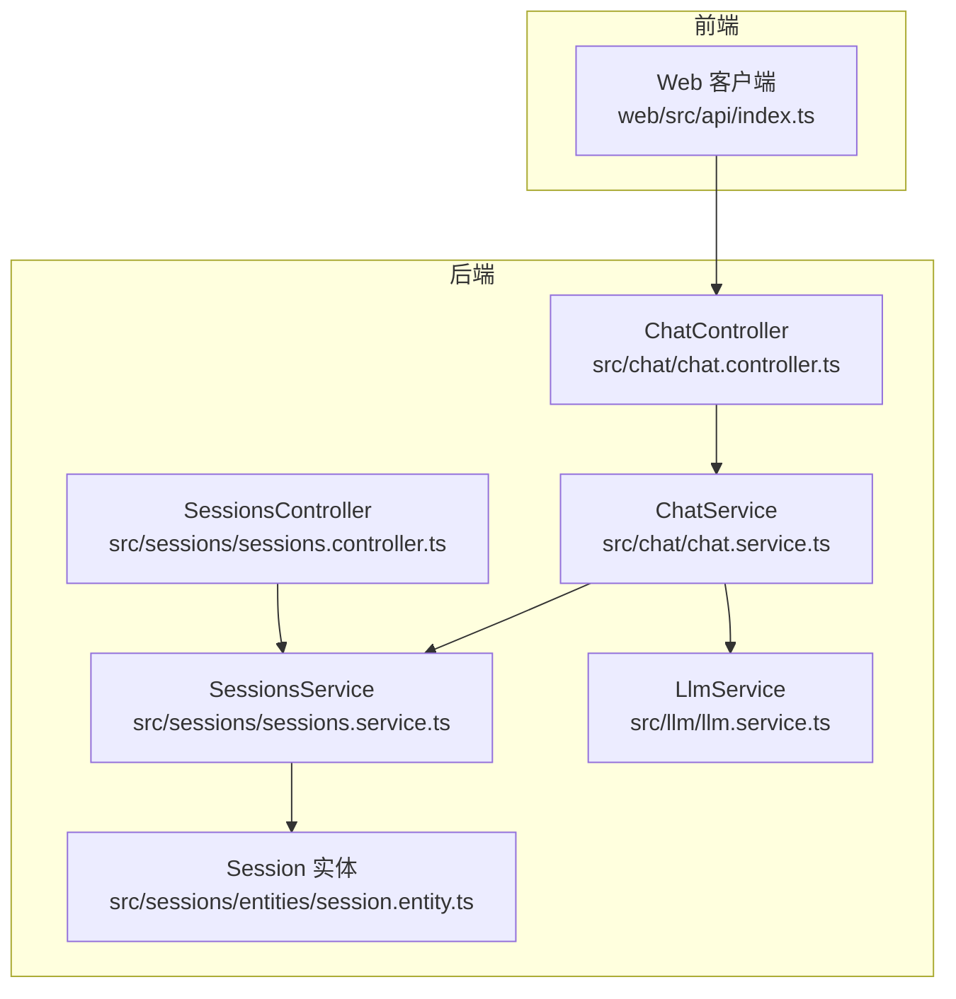
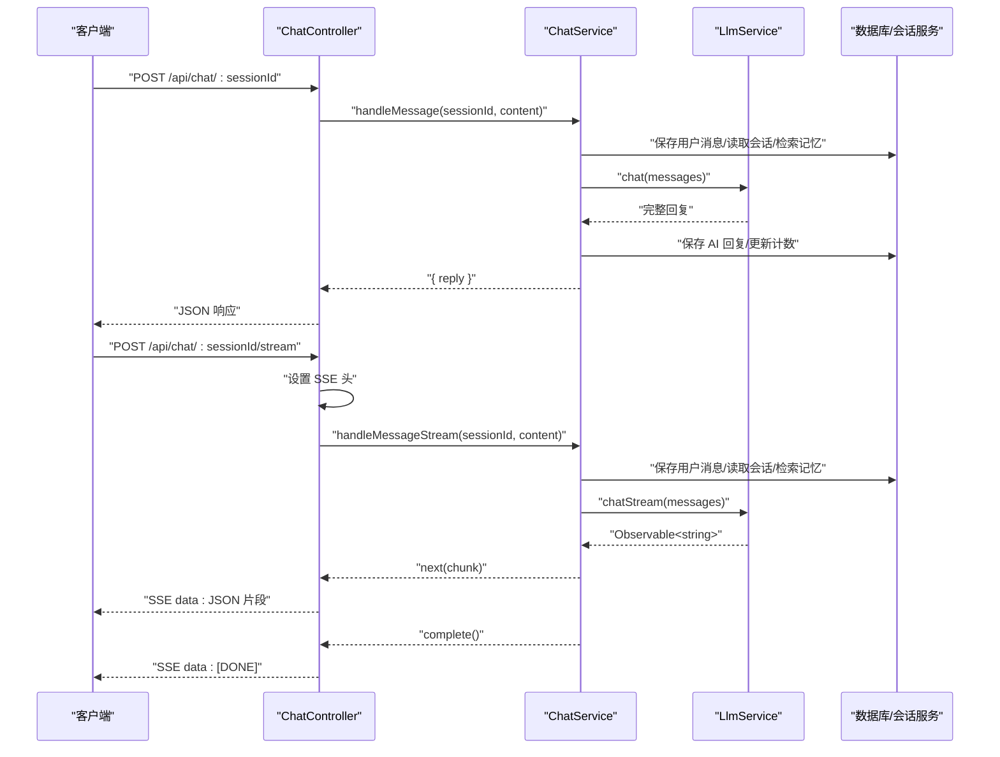
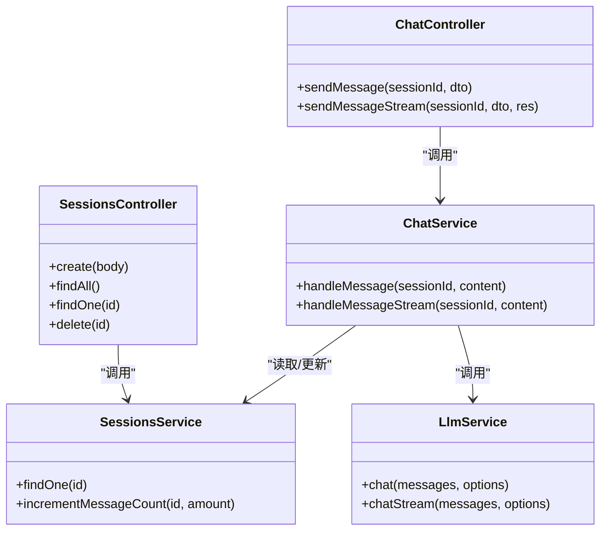

# 聊天接口

<cite>
**本文引用的文件列表**
- [chat.controller.ts](file://src/chat/chat.controller.ts)
- [chat.service.ts](file://src/chat/chat.service.ts)
- [llm.service.ts](file://src/llm/llm.service.ts)
- [sessions.service.ts](file://src/sessions/sessions.service.ts)
- [sessions.controller.ts](file://src/sessions/sessions.controller.ts)
- [session.entity.ts](file://src/sessions/entities/session.entity.ts)
- [types.ts](file://shared/types.ts)
- [index.ts](file://web/src/api/index.ts)
- [test_chat.js](file://test_chat.js)
</cite>

## 目录
1. [简介](#简介)
2. [项目结构](#项目结构)
3. [核心组件](#核心组件)
4. [架构总览](#架构总览)
5. [详细组件分析](#详细组件分析)
6. [依赖分析](#依赖分析)
7. [性能考量](#性能考量)
8. [故障排查指南](#故障排查指南)
9. [结论](#结论)
10. [附录](#附录)

## 简介
本文档面向聊天接口的使用者与开发者，系统性说明以下两个端点：
- 同步聊天：POST /api/chat/:sessionId
- 流式聊天（SSE）：POST /api/chat/:sessionId/stream

重点覆盖：
- 请求参数 content 的验证规则
- 响应格式与错误处理
- SSE 协议实现细节（数据格式、连接保持、[DONE] 标记）
- 会话 ID 参数的验证与安全考虑
- 前端 JavaScript 实现示例（含流式处理与错误处理）
- 性能优化与连接超时策略

## 项目结构
聊天接口位于后端模块化结构中，核心由控制器、服务与底层 LLM 服务组成，并通过会话服务进行会话校验与持久化。

图表来源
- [chat.controller.ts:16-76](file://src/chat/chat.controller.ts#L16-L76)
- [chat.service.ts:30-40](file://src/chat/chat.service.ts#L30-L40)
- [llm.service.ts:26-33](file://src/llm/llm.service.ts#L26-L33)
- [sessions.service.ts:7-11](file://src/sessions/sessions.service.ts#L7-L11)
- [sessions.controller.ts:4-27](file://src/sessions/sessions.controller.ts#L4-L27)
- [session.entity.ts:32-63](file://src/sessions/entities/session.entity.ts#L32-L63)

章节来源
- [chat.controller.ts:16-76](file://src/chat/chat.controller.ts#L16-L76)
- [chat.service.ts:30-40](file://src/chat/chat.service.ts#L30-L40)
- [llm.service.ts:26-33](file://src/llm/llm.service.ts#L26-L33)
- [sessions.service.ts:7-11](file://src/sessions/sessions.service.ts#L7-L11)
- [sessions.controller.ts:4-27](file://src/sessions/sessions.controller.ts#L4-L27)
- [session.entity.ts:32-63](file://src/sessions/entities/session.entity.ts#L32-L63)

## 核心组件
- ChatController：暴露 /api/chat/:sessionId 与 /api/chat/:sessionId/stream 两个端点，负责设置 SSE 响应头、转发请求至 ChatService，并处理流式推送与错误收尾。
- ChatService：核心业务编排，负责保存消息、读取上下文、检索记忆、组装 system prompt、调用 LLM、清理回复、异步记忆提取与滚动摘要。
- LlmService：封装 DeepSeek API，提供同步 chat() 与流式 chatStream()，后者返回 Observable<string>，供 SSE 使用。
- SessionsService：提供会话查询、更新、删除与消息计数递增等能力；当会话不存在时抛出异常。
- 类型定义：共享类型 SendPayload/SendResponse/SSECallbacks 等，保证前后端契约一致。

章节来源
- [chat.controller.ts:16-76](file://src/chat/chat.controller.ts#L16-L76)
- [chat.service.ts:30-40](file://src/chat/chat.service.ts#L30-L40)
- [llm.service.ts:26-33](file://src/llm/llm.service.ts#L26-L33)
- [sessions.service.ts:7-11](file://src/sessions/sessions.service.ts#L7-L11)
- [types.ts:92-108](file://shared/types.ts#L92-L108)

## 架构总览
下图展示了同步与流式两种模式的端到端调用链路。

图表来源
- [chat.controller.ts:21-75](file://src/chat/chat.controller.ts#L21-L75)
- [chat.service.ts:42-113](file://src/chat/chat.service.ts#L42-L113)
- [llm.service.ts:36-57](file://src/llm/llm.service.ts#L36-L57)
- [llm.service.ts:70-145](file://src/llm/llm.service.ts#L70-L145)

## 详细组件分析

### 同步聊天：POST /api/chat/:sessionId
- 请求路径：/api/chat/:sessionId
- 方法：POST
- 路径参数：
  - sessionId：字符串，必须存在且对应数据库中的有效会话；否则会触发会话不存在异常。
- 请求体：
  - content：字符串，必填；用于构建用户消息与后续 prompt。
- 响应体：
  - reply：字符串，AI 完整回复。
- 错误处理：
  - 当会话不存在时，SessionsService 抛出异常；ChatService 捕获并向上抛出；最终由 NestJS 框架转换为 HTTP 错误响应。
  - 当 LLM 调用失败或内部异常时，同样向上抛出，由框架捕获并返回错误。
- 处理流程要点：
  - 保存用户消息
  - 读取会话与角色
  - 检索相关记忆
  - 组装 system prompt
  - 调用 LLM 获取完整回复
  - 保存 AI 回复并更新消息计数
  - 异步触发记忆提取与滚动摘要

章节来源
- [chat.controller.ts:21-27](file://src/chat/chat.controller.ts#L21-L27)
- [chat.service.ts:42-113](file://src/chat/chat.service.ts#L42-L113)
- [sessions.service.ts:22-28](file://src/sessions/sessions.service.ts#L22-L28)
- [types.ts:92-98](file://shared/types.ts#L92-L98)

### 流式聊天（SSE）：POST /api/chat/:sessionId/stream
- 请求路径：/api/chat/:sessionId/stream
- 方法：POST
- 路径参数：
  - sessionId：字符串，必须存在且对应数据库中的有效会话；否则触发异常。
- 请求体：
  - content：字符串，必填。
- 响应格式（SSE）：
  - Content-Type：text/event-stream; charset=utf-8
  - Cache-Control：no-cache
  - Connection：keep-alive
  - X-Accel-Buffering：no（禁用 Nginx 缓冲）
  - 每个数据帧格式：data: "<JSON 字符串>\n\n"
  - 结束标记：data: [DONE]\n\n
- 连接保持机制：
  - 通过 keep-alive 与 flushHeaders 保持连接活跃。
  - 流式过程中持续写入 data: JSON 片段，直到 complete 或 error。
- 错误处理：
  - 当上游发生错误时，写入 data: { "error": "<message>" } 并结束连接。
- 处理流程要点：
  - 与同步模式相同，先保存用户消息、读取上下文、检索记忆。
  - 调用 LlmService.chatStream(messages)，逐 chunk 推送。
  - 流结束后清理回复、保存 AI 回复、更新计数，并触发异步记忆提取与滚动摘要。

章节来源
- [chat.controller.ts:46-75](file://src/chat/chat.controller.ts#L46-L75)
- [chat.service.ts:130-231](file://src/chat/chat.service.ts#L130-L231)
- [llm.service.ts:70-145](file://src/llm/llm.service.ts#L70-L145)

### SSE 数据格式规范
- 每个片段以 data: 开头，后跟 JSON 字符串，最后以 \n\n 结束。
- JSON 字符串表示单个文本片段（例如："你好"）。
- 结束时发送 data: [DONE]，前端据此停止接收并触发完成回调。
- 前端解析示例（来自 web/src/api/index.ts）：
  - 使用 fetch + ReadableStream Reader
  - 逐行解析，过滤 data: 行，解析 JSON 字符串
  - 遇到 [DONE] 时触发 onDone

章节来源
- [chat.controller.ts:52-74](file://src/chat/chat.controller.ts#L52-L74)
- [llm.service.ts:100-124](file://src/llm/llm.service.ts#L100-L124)
- [index.ts:145-201](file://web/src/api/index.ts#L145-L201)

### 会话 ID 参数验证与安全考虑
- 会话存在性校验：
  - ChatService 在处理消息前读取会话与角色，若角色不存在则抛错。
  - SessionsService.findOne(id) 若不存在会抛出异常（NestJS NotFoundException）。
- 安全建议：
  - 会话 ID 应为服务端生成的唯一标识（UUID），避免暴露内部序号。
  - 前端仅持有当前会话 ID，不应允许用户构造任意 ID。
  - 后端应确保会话归属校验（例如基于用户上下文），防止越权访问。
  - SSE 端点应配合鉴权中间件，避免未授权访问。

章节来源
- [chat.service.ts:55-61](file://src/chat/chat.service.ts#L55-L61)
- [sessions.service.ts:22-28](file://src/sessions/sessions.service.ts#L22-L28)
- [session.entity.ts:34-35](file://src/sessions/entities/session.entity.ts#L34-L35)

### 前端 JavaScript 实现示例
- 同步接口调用：参考 web/src/api/index.ts 中的 sendMessage。
- 流式接口调用：参考 web/src/api/index.ts 中的 sendMessageStream。
- 关键点：
  - 使用 AbortController 控制请求生命周期
  - 使用 ReadableStream Reader 逐块读取
  - 解析 data: 行，拼接 fullReply
  - 遇到 [DONE] 触发完成回调
  - 捕获非 AbortError 的异常并调用 onError

章节来源
- [index.ts:118-123](file://web/src/api/index.ts#L118-L123)
- [index.ts:137-201](file://web/src/api/index.ts#L137-L201)

### 请求与响应示例
- 同步请求
  - 方法：POST
  - 路径：/api/chat/:sessionId
  - 请求体：{"content": "你好"}
  - 成功响应：{"reply": "你好，有什么我可以帮助你的吗？"}
  - 错误响应（会话不存在）：{"message": "会话 \"<id>\" 不存在"}
- 流式请求
  - 方法：POST
  - 路径：/api/chat/:sessionId/stream
  - 请求体：{"content": "你好"}
  - 成功响应（SSE）：多条 data: "片段"，最后一条 data: [DONE]
  - 错误响应（SSE）：data: {"error": "错误信息"}

章节来源
- [chat.controller.ts:21-27](file://src/chat/chat.controller.ts#L21-L27)
- [chat.controller.ts:46-75](file://src/chat/chat.controller.ts#L46-L75)
- [sessions.service.ts:24-26](file://src/sessions/sessions.service.ts#L24-L26)

## 依赖分析
- ChatController 依赖 ChatService
- ChatService 依赖 SessionsService、MessagesService、MemoriesService、LlmService、JiwenEmotionService、MoodService
- LlmService 依赖 HttpService 与外部 DeepSeek API
- SessionsController 依赖 SessionsService
- 类型定义来自 shared/types.ts

图表来源
- [chat.controller.ts:16-18](file://src/chat/chat.controller.ts#L16-L18)
- [chat.service.ts:31-40](file://src/chat/chat.service.ts#L31-L40)
- [llm.service.ts:26-33](file://src/llm/llm.service.ts#L26-L33)
- [sessions.controller.ts:4-6](file://src/sessions/sessions.controller.ts#L4-L6)

章节来源
- [chat.controller.ts:16-18](file://src/chat/chat.controller.ts#L16-L18)
- [chat.service.ts:31-40](file://src/chat/chat.service.ts#L31-L40)
- [llm.service.ts:26-33](file://src/llm/llm.service.ts#L26-L33)
- [sessions.controller.ts:4-6](file://src/sessions/sessions.controller.ts#L4-L6)

## 性能考量
- SSE 连接保持
  - 使用 keep-alive 与 flushHeaders 保持连接活跃
  - 设置 X-Accel-Buffering: no 以避免代理层缓冲
- 流式传输
  - LlmService.chatStream 返回 Observable，逐 chunk 推送，降低首字延迟
  - ChatService 在流结束后再保存 AI 回复，避免阻塞前端
- 异步任务
  - 记忆提取与滚动摘要通过 setImmediate 异步执行，不阻塞主流程
- 超时与取消
  - LlmService 调用设置超时（默认 60 秒）
  - 前端可使用 AbortController 主动取消请求
- 前端缓冲与解析
  - 使用 ReadableStream + TextDecoder 流式解码
  - 前端按行解析 SSE，避免一次性解析大块数据

章节来源
- [chat.controller.ts:52-57](file://src/chat/chat.controller.ts#L52-L57)
- [llm.service.ts:52-56](file://src/llm/llm.service.ts#L52-L56)
- [llm.service.ts:141-143](file://src/llm/llm.service.ts#L141-L143)
- [index.ts:142-143](file://web/src/api/index.ts#L142-L143)
- [chat.service.ts:103-110](file://src/chat/chat.service.ts#L103-L110)

## 故障排查指南
- 会话不存在
  - 现象：返回 404 或 404-like 错误
  - 原因：sessionId 无效或已被删除
  - 处理：重新创建会话或使用正确的 sessionId
- LLM 调用失败
  - 现象：SSE 流中出现 data: {"error": "..."} 并结束
  - 原因：网络、鉴权或上游服务异常
  - 处理：检查 DEEPSEEK_API_KEY、网络连通性与超时配置
- 前端无法接收流
  - 现象：页面无响应或长时间无输出
  - 原因：代理层缓冲、未正确设置 SSE 头、前端解析错误
  - 处理：确认 X-Accel-Buffering: no、Content-Type 与连接保持
- 前端取消请求
  - 现象：请求被中断，控制台出现 AbortError
  - 处理：使用 AbortController 管理生命周期，避免悬挂请求

章节来源
- [sessions.service.ts:24-26](file://src/sessions/sessions.service.ts#L24-L26)
- [chat.controller.ts:66-68](file://src/chat/chat.controller.ts#L66-L68)
- [llm.service.ts:133-135](file://src/llm/llm.service.ts#L133-L135)
- [index.ts:194-198](file://web/src/api/index.ts#L194-L198)

## 结论
- 同步接口适合简单场景，等待完整回复后再返回。
- 流式接口通过 SSE 提供更好的交互体验，适合需要即时反馈的聊天场景。
- 会话 ID 的存在性与权限控制至关重要，需结合鉴权中间件与会话归属校验。
- 前端应正确处理 SSE 的 data: 行、[DONE] 标记与错误情况，同时支持请求取消与超时处理。

## 附录

### API 定义概览
- 同步聊天
  - 方法：POST
  - 路径：/api/chat/:sessionId
  - 请求体：{"content": "字符串"}
  - 响应体：{"reply": "字符串"}
- 流式聊天（SSE）
  - 方法：POST
  - 路径：/api/chat/:sessionId/stream
  - 请求体：{"content": "字符串"}
  - 响应：SSE 文本流，每行 data: "<JSON 片段>\n\n"，最后 data: [DONE]\n\n

章节来源
- [chat.controller.ts:21-27](file://src/chat/chat.controller.ts#L21-L27)
- [chat.controller.ts:46-75](file://src/chat/chat.controller.ts#L46-L75)
- [types.ts:92-98](file://shared/types.ts#L92-L98)

### 端到端测试参考
- 使用 test_chat.js 创建角色、创建会话并发起多轮同步对话，验证流程与异步记忆提取。

章节来源
- [test_chat.js:65-122](file://test_chat.js#L65-L122)