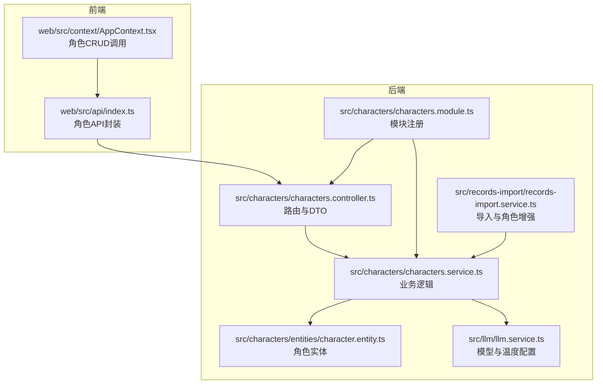
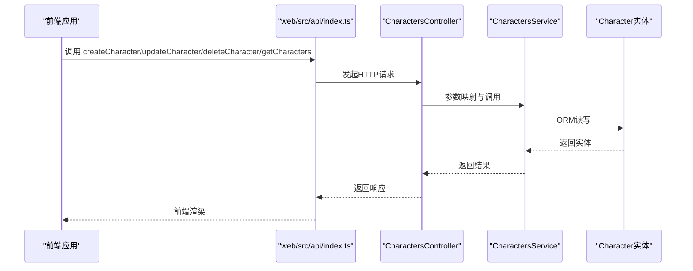
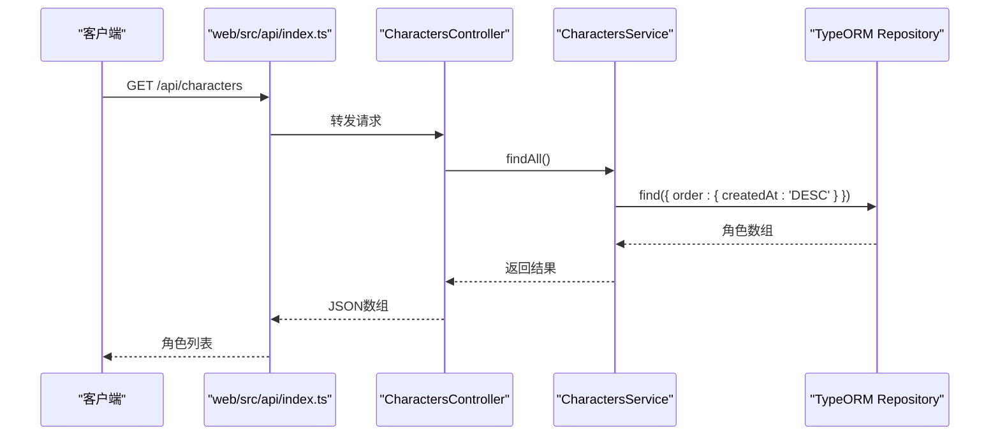
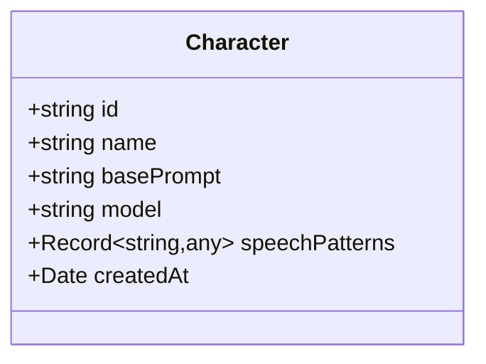
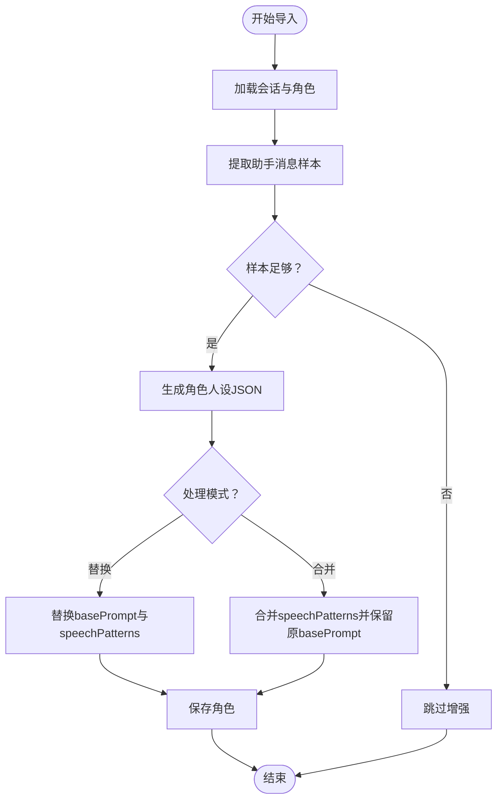
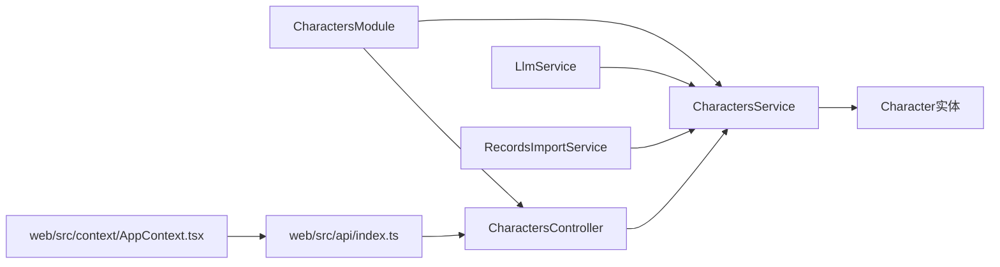

# 角色管理接口

<cite>
**本文档引用的文件**
- [characters.controller.ts](file://src/characters/characters.controller.ts)
- [characters.service.ts](file://src/characters/characters.service.ts)
- [character.entity.ts](file://src/characters/entities/character.entity.ts)
- [characters.module.ts](file://src/characters/characters.module.ts)
- [types.ts](file://shared/types.ts)
- [index.ts](file://web/src/api/index.ts)
- [AppContext.tsx](file://web/src/context/AppContext.tsx)
- [llm.service.ts](file://src/llm/llm.service.ts)
- [records-import.service.ts](file://src/records-import/records-import.service.ts)
</cite>

## 目录
1. [简介](#简介)
2. [项目结构](#项目结构)
3. [核心组件](#核心组件)
4. [架构总览](#架构总览)
5. [详细组件分析](#详细组件分析)
6. [依赖分析](#依赖分析)
7. [性能考虑](#性能考虑)
8. [故障排除指南](#故障排除指南)
9. [结论](#结论)
10. [附录](#附录)

## 简介
本文件为“角色管理接口”的完整API文档，覆盖角色的CRUD与查询能力，并结合前端调用与后端实现，给出清晰的请求/响应规范、数据结构定义、参数说明与最佳实践。特别地，针对GET /api/characters接口，本文明确其返回顺序与扩展方向；对于角色实体，给出字段定义、默认值与约束；对温度参数temperature与模型选择model进行说明；并补充角色导入导出相关的API设计思路与批量操作建议。

## 项目结构
角色管理相关代码主要分布在以下位置：
- 后端控制器与服务：src/characters/*
- 角色实体：src/characters/entities/character.entity.ts
- 类型定义：shared/types.ts
- 前端API封装与调用：web/src/api/index.ts、web/src/context/AppContext.tsx
- LLM配置与模型选择：src/llm/llm.service.ts
- 导入导出与角色增强：src/records-import/records-import.service.ts

**图表来源**
- [characters.controller.ts:17-55](file://src/characters/characters.controller.ts#L17-L55)
- [characters.service.ts:1-41](file://src/characters/characters.service.ts#L1-L41)
- [character.entity.ts:1-23](file://src/characters/entities/character.entity.ts#L1-L23)
- [characters.module.ts:1-14](file://src/characters/characters.module.ts#L1-L14)
- [index.ts:58-81](file://web/src/api/index.ts#L58-L81)
- [AppContext.tsx:258-280](file://web/src/context/AppContext.tsx#L258-L280)
- [llm.service.ts:27-57](file://src/llm/llm.service.ts#L27-L57)
- [records-import.service.ts:479-524](file://src/records-import/records-import.service.ts#L479-L524)

**章节来源**
- [characters.controller.ts:1-56](file://src/characters/characters.controller.ts#L1-L56)
- [characters.service.ts:1-41](file://src/characters/characters.service.ts#L1-L41)
- [character.entity.ts:1-23](file://src/characters/entities/character.entity.ts#L1-L23)
- [characters.module.ts:1-14](file://src/characters/characters.module.ts#L1-L14)
- [types.ts:34-54](file://shared/types.ts#L34-L54)
- [index.ts:58-81](file://web/src/api/index.ts#L58-L81)
- [AppContext.tsx:258-280](file://web/src/context/AppContext.tsx#L258-L280)
- [llm.service.ts:27-57](file://src/llm/llm.service.ts#L27-L57)
- [records-import.service.ts:479-524](file://src/records-import/records-import.service.ts#L479-L524)

## 核心组件
- 角色控制器：提供角色的创建、查询、更新、删除接口，负责参数校验与DTO映射。
- 角色服务：封装数据库访问与业务逻辑，包含分页、排序、异常处理。
- 角色实体：定义持久化字段及默认值，包括基础人设、模型、说话模式与创建时间。
- 类型定义：前后端共享的接口契约，确保请求/响应一致。
- 前端API封装：统一的HTTP请求封装与角色API方法，供上下文调用。
- LLM服务：提供模型与温度参数的默认值与行为说明。
- 导入服务：基于导入记录生成角色人设与说话模式，支撑角色增强。

**章节来源**
- [characters.controller.ts:17-55](file://src/characters/characters.controller.ts#L17-L55)
- [characters.service.ts:13-40](file://src/characters/characters.service.ts#L13-L40)
- [character.entity.ts:5-22](file://src/characters/entities/character.entity.ts#L5-L22)
- [types.ts:34-54](file://shared/types.ts#L34-L54)
- [index.ts:58-81](file://web/src/api/index.ts#L58-L81)
- [llm.service.ts:41-46](file://src/llm/llm.service.ts#L41-L46)

## 架构总览
角色管理采用经典的三层架构：前端通过API封装调用后端REST接口；控制器接收请求并进行DTO转换；服务层执行业务逻辑并访问仓储；实体层映射数据库表结构。

**图表来源**
- [index.ts:58-81](file://web/src/api/index.ts#L58-L81)
- [characters.controller.ts:21-54](file://src/characters/characters.controller.ts#L21-L54)
- [characters.service.ts:13-39](file://src/characters/characters.service.ts#L13-L39)
- [character.entity.ts:5-22](file://src/characters/entities/character.entity.ts#L5-L22)

## 详细组件分析

### GET /api/characters 角色列表查询
- 功能：返回所有角色，按创建时间倒序排列。
- 当前实现：无分页与排序参数，服务层固定按createdAt降序返回。
- 扩展建议：若需分页与排序，可在控制器新增查询参数并传递至服务层；服务层使用TypeORM的分页与排序能力实现。

**图表来源**
- [index.ts:62-64](file://web/src/api/index.ts#L62-L64)
- [characters.controller.ts:31-34](file://src/characters/characters.controller.ts#L31-L34)
- [characters.service.ts:18-20](file://src/characters/characters.service.ts#L18-L20)

**章节来源**
- [characters.controller.ts:31-34](file://src/characters/characters.controller.ts#L31-L34)
- [characters.service.ts:18-20](file://src/characters/characters.service.ts#L18-L20)

### 角色实体数据结构
角色实体包含以下字段（对应数据库列与类型）：
- id：主键，字符串类型，唯一标识角色。
- name：显示名称。
- basePrompt：固定的人格设定提示词，文本类型。
- model：模型名称，默认值为“deepseek-chat”。
- speechPatterns：说话模式JSON，默认空对象。
- createdAt：创建时间，自动写入。

**图表来源**
- [character.entity.ts:5-22](file://src/characters/entities/character.entity.ts#L5-L22)

**章节来源**
- [character.entity.ts:5-22](file://src/characters/entities/character.entity.ts#L5-L22)

### 角色CRUD API规范

#### 创建角色 POST /api/characters
- 请求体字段
  - id：字符串，角色唯一标识。
  - name：字符串，显示名称。
  - base_prompt：字符串，基础人设提示词。
  - model：可选，模型名称，默认“deepseek-chat”。

- 成功响应：返回完整角色对象（包含createdAt）。

- 前端调用路径
  - web/src/api/index.ts 中的 createCharacter 方法。
  - web/src/context/AppContext.tsx 中的 createCharacterFn。

**章节来源**
- [characters.controller.ts:4-9](file://src/characters/characters.controller.ts#L4-L9)
- [characters.service.ts:13-16](file://src/characters/characters.service.ts#L13-L16)
- [types.ts:43-48](file://shared/types.ts#L43-L48)
- [index.ts:58-60](file://web/src/api/index.ts#L58-L60)
- [AppContext.tsx:258-262](file://web/src/context/AppContext.tsx#L258-L262)

#### 查询单个角色 GET /api/characters/:id
- 路径参数：id（角色ID）。
- 成功响应：返回角色对象。
- 异常：当角色不存在时抛出“未找到”异常。

**章节来源**
- [characters.controller.ts:36-39](file://src/characters/characters.controller.ts#L36-L39)
- [characters.service.ts:22-28](file://src/characters/characters.service.ts#L22-L28)

#### 更新角色 PUT /api/characters/:id
- 路径参数：id（角色ID）。
- 请求体字段（均可选）
  - name：新名称。
  - base_prompt：新基础人设提示词。
  - model：新模型名称。

- 前端调用路径
  - web/src/api/index.ts 中的 updateCharacter 方法。
  - web/src/context/AppContext.tsx 中的 updateCharacterFn。

- 注意：PATCH接口未在后端实现，推荐使用PUT进行部分更新。

**章节来源**
- [characters.controller.ts:41-49](file://src/characters/characters.controller.ts#L41-L49)
- [characters.service.ts:30-34](file://src/characters/characters.service.ts#L30-L34)
- [types.ts:50-54](file://shared/types.ts#L50-L54)
- [index.ts:70-77](file://web/src/api/index.ts#L70-L77)
- [AppContext.tsx:266-270](file://web/src/context/AppContext.tsx#L266-L270)

#### 删除角色 DELETE /api/characters/:id
- 路径参数：id（角色ID）。
- 成功响应：无内容。
- 异常：当角色不存在时抛出“未找到”异常。

**章节来源**
- [characters.controller.ts:51-54](file://src/characters/characters.controller.ts#L51-L54)
- [characters.service.ts:36-39](file://src/characters/characters.service.ts#L36-L39)
- [index.ts:79-81](file://web/src/api/index.ts#L79-L81)
- [AppContext.tsx:274-278](file://web/src/context/AppContext.tsx#L274-L278)

### 角色配置参数说明

#### temperature（温度）对AI回复的影响
- 温度越高，回复越随机、多样化；温度越低，回复越稳定、保守。
- 在LLM服务中，temperature默认值为0.8；在导入与提取任务中，通常使用更低温度以提升准确性。
- 实际影响取决于所选模型与具体部署。

**章节来源**
- [llm.service.ts:41-46](file://src/llm/llm.service.ts#L41-L46)
- [records-import.service.ts:265-355](file://src/records-import/records-import.service.ts#L265-L355)

#### model（模型）选择
- 角色实体默认模型为“deepseek-chat”，可在创建或更新时指定。
- LLM服务默认使用该模型，也可在调用时覆盖。
- 可用值取决于后端集成的外部模型服务与环境变量配置。

**章节来源**
- [character.entity.ts:14-15](file://src/characters/entities/character.entity.ts#L14-L15)
- [llm.service.ts:41-42](file://src/llm/llm.service.ts#L41-L42)

### 角色导入导出与批量操作

#### 导入聊天记录对角色的影响
- 导入服务可从聊天记录中提取角色的人设与说话风格，生成新的basePrompt与speechPatterns。
- 支持“替换模式”和“合并模式”，前者完全重写角色人设，后者在保留手动设定基础上追加说话风格。
- 该流程可作为角色增强的自动化手段，提升角色一致性与个性化。

**图表来源**
- [records-import.service.ts:479-524](file://src/records-import/records-import.service.ts#L479-L524)

#### 批量操作最佳实践
- 批量创建/更新：建议在前端进行去重与必填校验，后端保持幂等与事务一致性。
- 批量删除：建议先检查关联会话与消息，避免破坏数据完整性。
- 导入增强：建议在导入完成后刷新角色列表与会话消息，确保前端展示最新数据。

**章节来源**
- [records-import.service.ts:479-524](file://src/records-import/records-import.service.ts#L479-L524)
- [AppContext.tsx:258-280](file://web/src/context/AppContext.tsx#L258-L280)

## 依赖分析
- 控制器依赖服务；服务依赖TypeORM仓库；模块负责注册实体与导出服务。
- 前端API封装依赖共享类型；上下文调用API方法。
- LLM服务为聊天模块提供模型与温度配置；导入服务依赖会话与消息模块。

**图表来源**
- [characters.controller.ts:1-56](file://src/characters/characters.controller.ts#L1-L56)
- [characters.service.ts:1-41](file://src/characters/characters.service.ts#L1-L41)
- [characters.module.ts:1-14](file://src/characters/characters.module.ts#L1-L14)
- [index.ts:58-81](file://web/src/api/index.ts#L58-L81)
- [AppContext.tsx:258-280](file://web/src/context/AppContext.tsx#L258-L280)
- [llm.service.ts:27-57](file://src/llm/llm.service.ts#L27-L57)
- [records-import.service.ts:479-524](file://src/records-import/records-import.service.ts#L479-L524)

**章节来源**
- [characters.controller.ts:1-56](file://src/characters/characters.controller.ts#L1-L56)
- [characters.service.ts:1-41](file://src/characters/characters.service.ts#L1-L41)
- [characters.module.ts:1-14](file://src/characters/characters.module.ts#L1-L14)
- [index.ts:58-81](file://web/src/api/index.ts#L58-L81)
- [AppContext.tsx:258-280](file://web/src/context/AppContext.tsx#L258-L280)
- [llm.service.ts:27-57](file://src/llm/llm.service.ts#L27-L57)
- [records-import.service.ts:479-524](file://src/records-import/records-import.service.ts#L479-L524)

## 性能考虑
- 查询排序：当前按创建时间倒序，索引可考虑在createdAt上建立索引以优化大列表场景。
- 分页扩展：建议在控制器新增limit/offset或cursor分页参数，减少单次响应体积。
- 缓存策略：对不频繁变更的角色列表可引入短期缓存，降低数据库压力。
- 导入增强：样本数量与LLM调用成本成正比，建议限制最大样本数与并发度。

## 故障排除指南
- 404 未找到角色：当查询或更新/删除的id不存在时，服务层抛出“未找到”异常。前端应提示用户检查角色ID或刷新列表。
- 400 参数错误：前端传参缺失或类型不符（如id/name/base_prompt为空），建议在控制器或管道层增加参数校验。
- 500 服务器错误：数据库异常或外部模型服务不可用，建议查看后端日志并检查DEEPSEEK_API_KEY等环境变量。

**章节来源**
- [characters.service.ts:22-28](file://src/characters/characters.service.ts#L22-L28)
- [index.ts:37-52](file://web/src/api/index.ts#L37-L52)

## 结论
本API文档明确了角色管理的完整接口与数据结构，给出了温度与模型参数的含义与影响，并补充了导入导出与批量操作的实践建议。建议后续扩展分页与排序参数，完善PATCH接口与参数校验，以进一步提升系统的可维护性与用户体验。

## 附录

### 请求/响应示例（路径引用）
- 创建角色
  - 请求：POST /api/characters
  - 路径参考：[index.ts:58-60](file://web/src/api/index.ts#L58-L60)
- 获取角色列表
  - 请求：GET /api/characters
  - 路径参考：[index.ts:62-64](file://web/src/api/index.ts#L62-L64)
- 获取单个角色
  - 请求：GET /api/characters/:id
  - 路径参考：[index.ts:66-68](file://web/src/api/index.ts#L66-L68)
- 更新角色
  - 请求：PUT /api/characters/:id
  - 路径参考：[index.ts:70-77](file://web/src/api/index.ts#L70-L77)
- 删除角色
  - 请求：DELETE /api/characters/:id
  - 路径参考：[index.ts:79-81](file://web/src/api/index.ts#L79-L81)