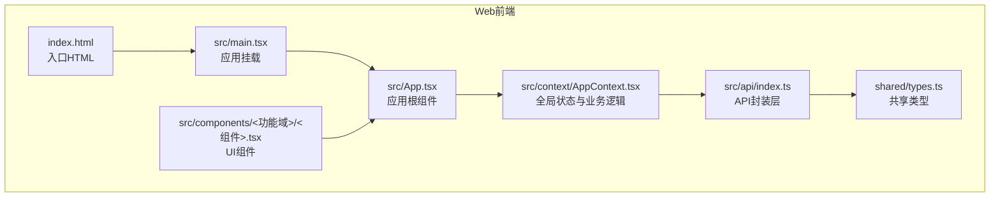
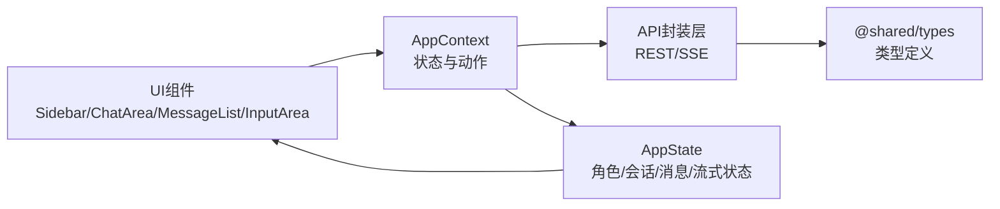
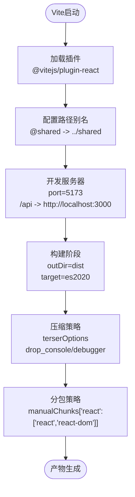
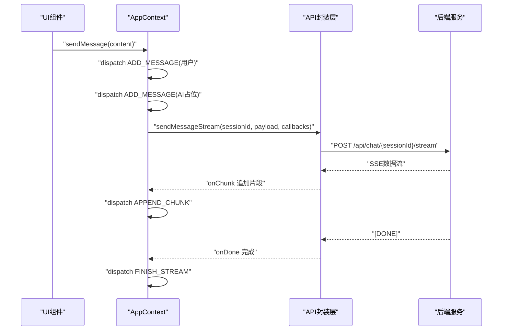
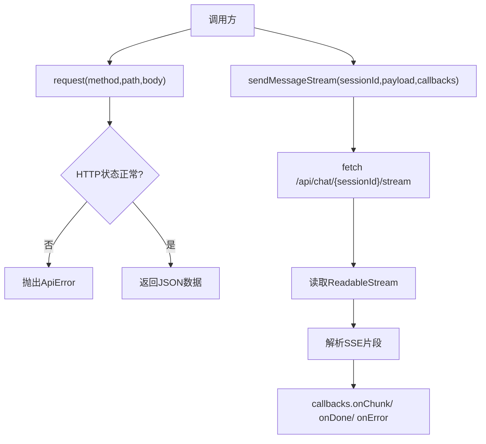
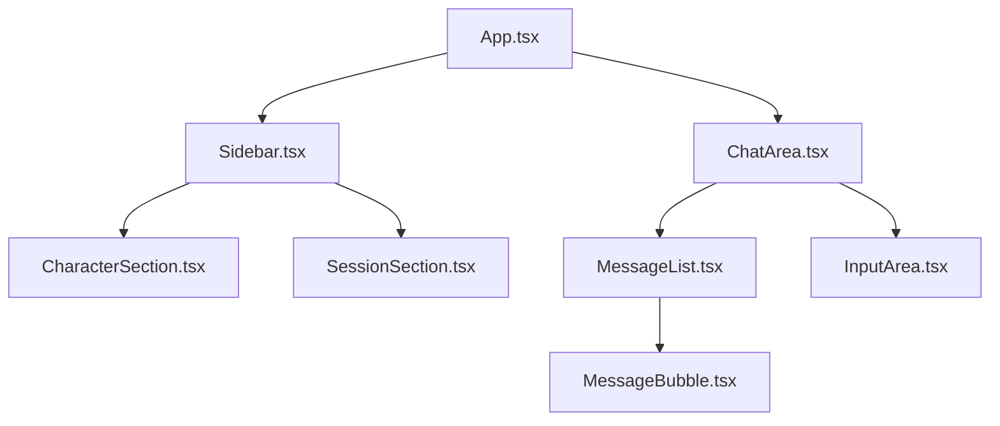
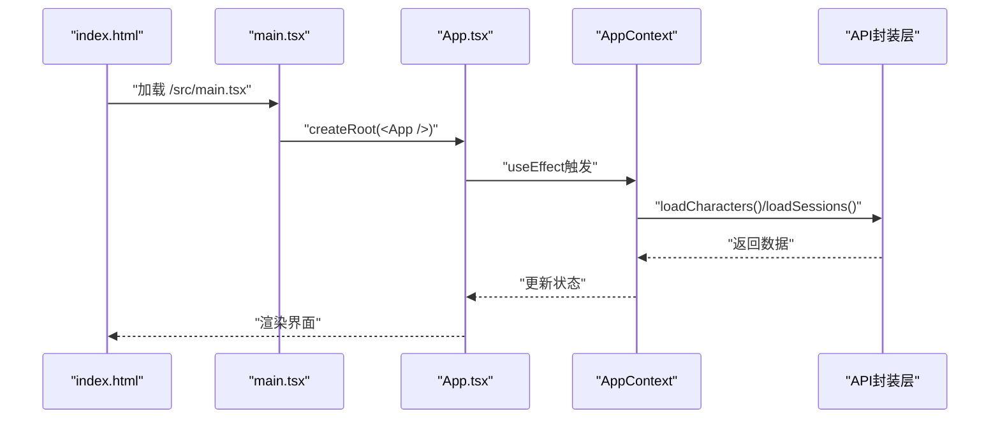
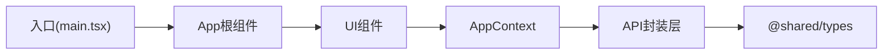

# React应用架构

<cite>
**本文档引用的文件**
- [vite.config.ts](file://web/vite.config.ts)
- [package.json](file://web/package.json)
- [tsconfig.json](file://web/tsconfig.json)
- [tsconfig.node.json](file://web/tsconfig.node.json)
- [main.tsx](file://web/src/main.tsx)
- [App.tsx](file://web/src/App.tsx)
- [AppContext.tsx](file://web/src/context/AppContext.tsx)
- [types.ts](file://shared/types.ts)
- [api/index.ts](file://web/src/api/index.ts)
- [Sidebar.tsx](file://web/src/components/Sidebar/Sidebar.tsx)
- [ChatArea.tsx](file://web/src/components/ChatArea/ChatArea.tsx)
- [CharacterSection.tsx](file://web/src/components/Sidebar/CharacterSection.tsx)
- [SessionSection.tsx](file://web/src/components/Sidebar/SessionSection.tsx)
- [MessageList.tsx](file://web/src/components/ChatArea/MessageList.tsx)
- [InputArea.tsx](file://web/src/components/ChatArea/InputArea.tsx)
- [MessageBubble.tsx](file://web/src/components/ChatArea/MessageBubble.tsx)
- [index.html](file://web/index.html)
- [eslint.config.mjs](file://eslint.config.mjs)
</cite>

## 目录
1. [简介](#简介)
2. [项目结构](#项目结构)
3. [核心组件](#核心组件)
4. [架构总览](#架构总览)
5. [详细组件分析](#详细组件分析)
6. [依赖分析](#依赖分析)
7. [性能考虑](#性能考虑)
8. [故障排除指南](#故障排除指南)
9. [结论](#结论)

## 简介
本项目是一个基于Vite构建的现代React前端应用，采用TypeScript进行强类型开发，结合自研的全局状态管理与API封装层，提供角色与会话驱动的对话体验。应用通过Vite开发服务器提供热更新与代理能力，生产环境使用Rollup打包并启用多种压缩与分包策略，确保首屏加载与交互性能。

## 项目结构
前端工程位于web目录下，采用“功能域+模块化”的组织方式：共享类型定义独立于前端，API层与上下文层解耦，组件按功能域拆分（侧边栏、聊天区），入口文件负责挂载根组件。

图表来源
- [index.html:1-13](file://web/index.html#L1-L13)
- [main.tsx:1-11](file://web/src/main.tsx#L1-L11)
- [App.tsx:1-29](file://web/src/App.tsx#L1-L29)
- [AppContext.tsx:1-384](file://web/src/context/AppContext.tsx#L1-L384)
- [api/index.ts:1-212](file://web/src/api/index.ts#L1-L212)
- [types.ts:1-166](file://shared/types.ts#L1-L166)

章节来源
- [index.html:1-13](file://web/index.html#L1-L13)
- [main.tsx:1-11](file://web/src/main.tsx#L1-L11)
- [App.tsx:1-29](file://web/src/App.tsx#L1-L29)

## 核心组件
- 入口与根组件
  - 入口脚本在index.html中引入/src/main.tsx，使用React 18的createRoot挂载App。
  - App作为布局容器，组合Sidebar与ChatArea，并在首次渲染时触发角色与会话的异步加载。
- 全局状态与业务逻辑
  - AppContext使用useReducer维护AppState，封装角色、会话、消息、流式状态与UI状态。
  - 提供loadCharacters、loadSessions、loadMessages、sendMessage等高阶操作，内部通过API模块发起网络请求。
- API封装层
  - API模块对REST接口进行统一封装，支持同步与SSE流式响应；在开发环境通过Vite代理转发至后端服务。
- 组件体系
  - Sidebar包含角色与会话两个功能区；ChatArea包含消息列表与输入区域。
  - UI组件通过useAppContext钩子访问状态与动作，保持低耦合与可测试性。

章节来源
- [main.tsx:1-11](file://web/src/main.tsx#L1-L11)
- [App.tsx:1-29](file://web/src/App.tsx#L1-L29)
- [AppContext.tsx:1-384](file://web/src/context/AppContext.tsx#L1-L384)
- [api/index.ts:1-212](file://web/src/api/index.ts#L1-L212)

## 架构总览
应用采用“入口 -> 根组件 -> 上下文 -> API -> 类型定义”的单向数据流，组件仅负责渲染与事件处理，状态变更通过上下文动作完成，API层负责与后端通信。

图表来源
- [AppContext.tsx:1-384](file://web/src/context/AppContext.tsx#L1-L384)
- [api/index.ts:1-212](file://web/src/api/index.ts#L1-L212)
- [types.ts:1-166](file://shared/types.ts#L1-L166)

## 详细组件分析

### Vite配置与构建优化
- 插件与解析
  - 使用@vitejs/plugin-react提升开发体验，路径别名@shared指向shared目录，便于跨平台共享类型复用。
- 开发服务器
  - 监听端口5173，默认代理所有/api前缀请求到本地3000端口，便于前后端联调。
- 构建优化
  - 输出目录dist，清空输出目录避免残留；目标ES2020；CSS与JS均启用压缩；Terser移除console与debugger；Rollup手动分包将react与react-dom单独打包，提升缓存命中率。
- TypeScript配置
  - tsconfig.json针对浏览器端设置ESNext模块解析、严格模式、隔离模块与路径映射；tsconfig.node.json仅用于Vite配置文件的类型检查。

图表来源
- [vite.config.ts:1-44](file://web/vite.config.ts#L1-L44)
- [tsconfig.json:1-21](file://web/tsconfig.json#L1-L21)
- [tsconfig.node.json:1-11](file://web/tsconfig.node.json#L1-L11)

章节来源
- [vite.config.ts:1-44](file://web/vite.config.ts#L1-L44)
- [tsconfig.json:1-21](file://web/tsconfig.json#L1-L21)
- [tsconfig.node.json:1-11](file://web/tsconfig.node.json#L1-L11)

### 全局状态管理（AppContext）
- 状态模型
  - 包含角色列表、会话列表、消息列表、当前选中角色与会话、流式状态、UI状态类型与提示信息。
- 动作与Reducer
  - 支持设置角色/会话列表、选择角色/会话、添加/追加消息、流式结束/错误、清理消息、删除会话等。
  - 选择角色时自动筛选对应会话并重置消息；选择会话时清空消息并异步加载历史。
- 业务动作
  - 加载角色/会话/消息；角色增删改；会话创建/删除；发送消息（含SSE流式）。
  - 流式发送时通过AbortController控制中断，UI根据isStreaming与statusType反馈状态。

图表来源
- [AppContext.tsx:310-350](file://web/src/context/AppContext.tsx#L310-L350)
- [api/index.ts:137-201](file://web/src/api/index.ts#L137-L201)

章节来源
- [AppContext.tsx:1-384](file://web/src/context/AppContext.tsx#L1-L384)

### API封装层（跨平台复用）
- 设计原则
  - 纯TS模块，无DOM/框架依赖，可在小程序、Telegram Bot等环境中复用。
  - 开发环境通过Vite代理转发/api请求，生产环境BASE_URL为空（同源）。
- 接口覆盖
  - 角色：创建/查询/详情/更新/删除
  - 会话：创建/查询/详情/删除
  - 消息：分页查询
  - 聊天：同步回复与SSE流式回复
  - 聊天记录导入
- SSE实现
  - 使用fetch + ReadableStream Reader逐片解析SSE数据，支持中断与错误处理。

图表来源
- [api/index.ts:37-52](file://web/src/api/index.ts#L37-L52)
- [api/index.ts:137-201](file://web/src/api/index.ts#L137-L201)

章节来源
- [api/index.ts:1-212](file://web/src/api/index.ts#L1-L212)

### 组件树结构与职责
- Sidebar
  - 组合StatusBar、CharacterSection、SessionSection，承载角色与会话管理入口。
- CharacterSection
  - 展示角色列表，支持新建、编辑与删除；编辑完成后刷新会话列表。
- SessionSection
  - 基于当前角色过滤会话列表；支持新建会话、删除会话与导入聊天记录。
- ChatArea
  - 组合ChatHeader、MessageList、InputArea，负责消息展示与输入交互。
- MessageList
  - 自动滚动到底部，渲染消息气泡。
- InputArea
  - 处理多行输入、回车发送、禁用态控制与焦点管理。
- MessageBubble
  - 根据消息角色与流式状态渲染样式。

图表来源
- [App.tsx:1-29](file://web/src/App.tsx#L1-L29)
- [Sidebar.tsx:1-15](file://web/src/components/Sidebar/Sidebar.tsx#L1-L15)
- [ChatArea.tsx:1-15](file://web/src/components/ChatArea/ChatArea.tsx#L1-L15)
- [CharacterSection.tsx:1-47](file://web/src/components/Sidebar/CharacterSection.tsx#L1-L47)
- [SessionSection.tsx:1-58](file://web/src/components/Sidebar/SessionSection.tsx#L1-L58)
- [MessageList.tsx:1-24](file://web/src/components/ChatArea/MessageList.tsx#L1-L24)
- [InputArea.tsx:1-50](file://web/src/components/ChatArea/InputArea.tsx#L1-L50)
- [MessageBubble.tsx:1-18](file://web/src/components/ChatArea/MessageBubble.tsx#L1-L18)

章节来源
- [Sidebar.tsx:1-15](file://web/src/components/Sidebar/Sidebar.tsx#L1-L15)
- [ChatArea.tsx:1-15](file://web/src/components/ChatArea/ChatArea.tsx#L1-L15)
- [CharacterSection.tsx:1-47](file://web/src/components/Sidebar/CharacterSection.tsx#L1-L47)
- [SessionSection.tsx:1-58](file://web/src/components/Sidebar/SessionSection.tsx#L1-L58)
- [MessageList.tsx:1-24](file://web/src/components/ChatArea/MessageList.tsx#L1-L24)
- [InputArea.tsx:1-50](file://web/src/components/ChatArea/InputArea.tsx#L1-L50)
- [MessageBubble.tsx:1-18](file://web/src/components/ChatArea/MessageBubble.tsx#L1-L18)

### 启动流程与路由说明
- 启动流程
  - index.html加载/src/main.tsx，createRoot挂载App。
  - App在首次渲染时调用useAppContext提供的loadCharacters与loadSessions，异步初始化数据。
- 路由说明
  - 当前版本未集成前端路由库，页面通过组件切换实现视图管理；如需SPA路由，可在后续扩展。

图表来源
- [index.html:1-13](file://web/index.html#L1-L13)
- [main.tsx:1-11](file://web/src/main.tsx#L1-L11)
- [App.tsx:1-29](file://web/src/App.tsx#L1-L29)
- [AppContext.tsx:204-220](file://web/src/context/AppContext.tsx#L204-L220)
- [api/index.ts:62-81](file://web/src/api/index.ts#L62-L81)

章节来源
- [index.html:1-13](file://web/index.html#L1-L13)
- [main.tsx:1-11](file://web/src/main.tsx#L1-L11)
- [App.tsx:1-29](file://web/src/App.tsx#L1-L29)

## 依赖分析
- 依赖关系
  - UI组件依赖AppContext提供状态与动作；AppContext依赖API封装层；API层依赖共享类型；入口依赖根组件。
- 模块边界
  - shared/types为纯类型模块，零依赖，保证跨平台复用。
  - API封装层与上下文层解耦，便于单元测试与替换实现。

图表来源
- [AppContext.tsx:1-384](file://web/src/context/AppContext.tsx#L1-L384)
- [api/index.ts:1-212](file://web/src/api/index.ts#L1-L212)
- [types.ts:1-166](file://shared/types.ts#L1-L166)
- [main.tsx:1-11](file://web/src/main.tsx#L1-L11)
- [App.tsx:1-29](file://web/src/App.tsx#L1-L29)

章节来源
- [package.json:1-22](file://web/package.json#L1-L22)

## 性能考虑
- 构建优化
  - ES2020目标与Terser压缩减少体积；移除console与debugger提升运行效率。
  - React与React-DOM手动分包，利用浏览器缓存提升二次加载速度。
- 运行时优化
  - 消息列表自动滚动仅在消息数组变化时触发；输入区域禁用态避免无效渲染。
  - 流式渲染通过增量拼接最后一条消息，减少重复渲染。
- 开发体验
  - Vite热更新与快速冷启动；代理解决跨域问题，无需额外CORS配置。

## 故障排除指南
- 开发代理无法访问后端
  - 检查vite.config.ts中的server.proxy配置是否正确指向后端地址。
- 构建后静态资源404
  - 确认vite.config.ts中build.outDir与部署路径一致；生产环境BASE_URL为空（同源）。
- 流式消息异常中断
  - 检查AbortController使用与错误回调；确认后端SSE输出格式符合预期。
- 类型检查报错
  - 检查tsconfig.json的moduleResolution与paths配置；确保@shared别名正确解析。

章节来源
- [vite.config.ts:12-42](file://web/vite.config.ts#L12-L42)
- [api/index.ts:145-201](file://web/src/api/index.ts#L145-L201)
- [tsconfig.json:14-16](file://web/tsconfig.json#L14-L16)

## 结论
该React应用以Vite为核心，结合TypeScript与自研上下文/API层，实现了清晰的模块化与跨平台复用能力。通过合理的构建优化与运行时策略，兼顾了开发效率与用户体验。后续可在保持现有架构稳定性的前提下，按需引入前端路由、状态持久化与性能监控等能力。