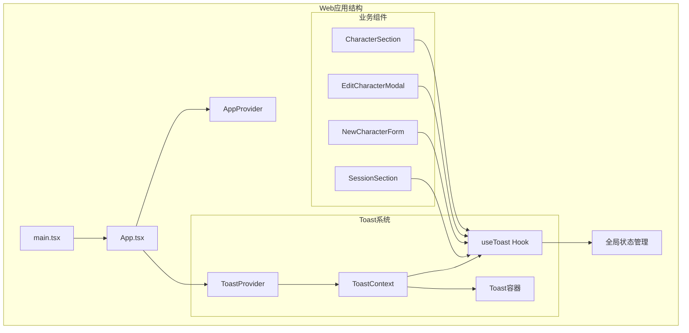
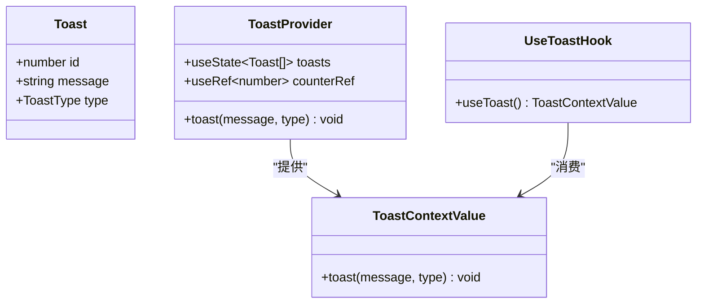
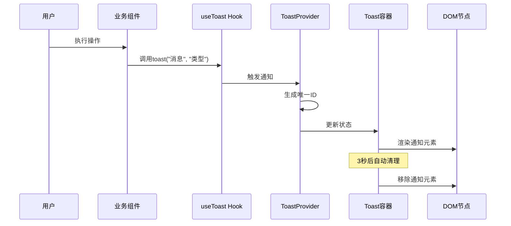
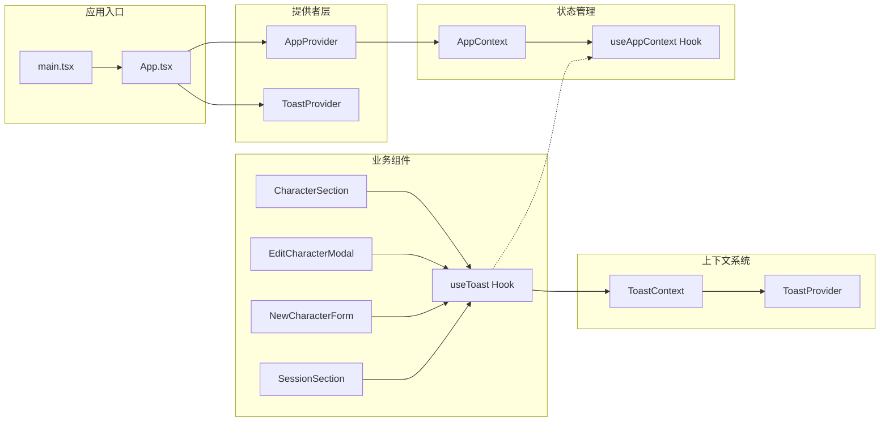
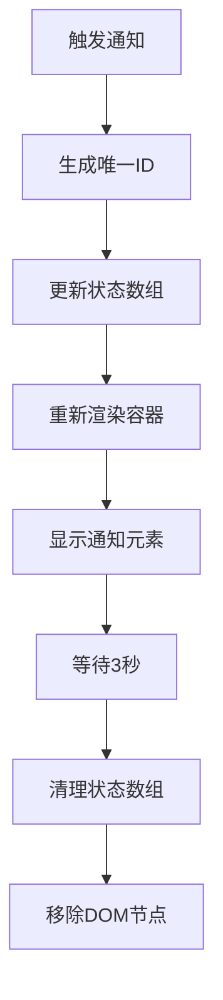

# Toast通知系统

<cite>
**本文档引用的文件**
- [Toast.tsx](file://web/src/components/Toast.tsx)
- [AppContext.tsx](file://web/src/context/AppContext.tsx)
- [App.tsx](file://web/src/App.tsx)
- [main.tsx](file://web/src/main.tsx)
- [CharacterSection.tsx](file://web/src/components/Sidebar/CharacterSection.tsx)
- [EditCharacterModal.tsx](file://web/src/components/Sidebar/EditCharacterModal.tsx)
- [NewCharacterForm.tsx](file://web/src/components/Sidebar/NewCharacterForm.tsx)
- [SessionSection.tsx](file://web/src/components/Sidebar/SessionSection.tsx)
</cite>

## 目录
1. [简介](#简介)
2. [项目结构](#项目结构)
3. [核心组件](#核心组件)
4. [架构概览](#架构概览)
5. [详细组件分析](#详细组件分析)
6. [依赖关系分析](#依赖关系分析)
7. [性能考虑](#性能考虑)
8. [故障排除指南](#故障排除指南)
9. [结论](#结论)

## 简介

Toast通知系统是AI Companion聊天应用中的重要用户体验组件，提供轻量级、非侵入性的状态反馈机制。该系统采用React Context模式实现，支持成功、错误和信息三种通知类型，具有自动消失功能和良好的可扩展性。

系统设计遵循以下核心原则：
- **轻量级设计**：最小化DOM节点和样式复杂度
- **响应式交互**：自动定时消失，不影响用户操作
- **类型安全**：完整的TypeScript类型定义
- **易于集成**：简单的API接口，便于在各组件中使用

## 项目结构

Toast通知系统位于前端Web应用的组件目录中，与主要的应用状态管理形成清晰的分层架构：



**图表来源**
- [main.tsx:1-11](file://web/src/main.tsx#L1-L11)
- [App.tsx:35-43](file://web/src/App.tsx#L35-L43)
- [Toast.tsx:21-47](file://web/src/components/Toast.tsx#L21-L47)

**章节来源**
- [main.tsx:1-11](file://web/src/main.tsx#L1-L11)
- [App.tsx:35-43](file://web/src/App.tsx#L35-L43)

## 核心组件

### Toast上下文系统

Toast系统的核心是一个基于React Context的轻量级通知管理器，包含以下关键组件：

#### 数据模型定义



**图表来源**
- [Toast.tsx:3-11](file://web/src/components/Toast.tsx#L3-L11)
- [Toast.tsx:21-31](file://web/src/components/Toast.tsx#L21-L31)
- [Toast.tsx:15-19](file://web/src/components/Toast.tsx#L15-L19)

#### 核心功能特性

1. **类型安全的通知**：支持'success'、'error'、'info'三种类型
2. **自动清理机制**：3秒后自动移除通知
3. **唯一标识符**：自动生成递增ID确保通知独立性
4. **上下文封装**：通过React Context提供全局访问

**章节来源**
- [Toast.tsx:1-48](file://web/src/components/Toast.tsx#L1-L48)

## 架构概览

Toast系统采用分层架构设计，与应用的整体状态管理模式无缝集成：



**图表来源**
- [Toast.tsx:25-31](file://web/src/components/Toast.tsx#L25-L31)
- [Toast.tsx:36-44](file://web/src/components/Toast.tsx#L36-L44)

## 详细组件分析

### 使用场景分析

Toast系统在多个业务场景中发挥重要作用，以下是主要使用模式：

#### 成功操作反馈

```mermaid
flowchart TD
A[用户操作] --> B{操作类型}
B --> |角色创建| C[NewCharacterForm]
B --> |角色更新| D[EditCharacterModal]
B --> |会话删除| E[SessionSection]
C --> F[API调用成功]
D --> F
E --> F
F --> G[调用toast("成功消息", "success")]
G --> H[显示绿色成功通知]
```

**图表来源**
- [NewCharacterForm.tsx:24](file://web/src/components/Sidebar/NewCharacterForm.tsx#L24)
- [EditCharacterModal.tsx:25](file://web/src/components/Sidebar/EditCharacterModal.tsx#L25)
- [SessionSection.tsx:24](file://web/src/components/Sidebar/SessionSection.tsx#L24)

#### 错误处理反馈

```mermaid
flowchart TD
A[用户操作] --> B{操作类型}
B --> |角色创建| C[NewCharacterForm]
B --> |角色更新| D[EditCharacterModal]
B --> |会话删除| E[SessionSection]
C --> F[API调用失败]
D --> F
E --> F
F --> G[调用toast("错误消息", "error")]
G --> H[显示红色错误通知]
H --> I[用户可查看具体错误信息]
```

**图表来源**
- [NewCharacterForm.tsx:26](file://web/src/components/Sidebar/NewCharacterForm.tsx#L26)
- [EditCharacterModal.tsx:28](file://web/src/components/Sidebar/EditCharacterModal.tsx#L28)
- [SessionSection.tsx:26](file://web/src/components/Sidebar/SessionSection.tsx#L26)

**章节来源**
- [CharacterSection.tsx:1-51](file://web/src/components/Sidebar/CharacterSection.tsx#L1-L51)
- [EditCharacterModal.tsx:1-74](file://web/src/components/Sidebar/EditCharacterModal.tsx#L1-L74)
- [NewCharacterForm.tsx:1-51](file://web/src/components/Sidebar/NewCharacterForm.tsx#L1-L51)
- [SessionSection.tsx:1-71](file://web/src/components/Sidebar/SessionSection.tsx#L1-L71)

### 组件集成模式

Toast系统通过统一的Hook接口与各个业务组件集成，形成一致的用户体验：

| 组件类型 | 集成方式 | 使用场景 |
|---------|----------|----------|
| 角色管理组件 | `useToast()` Hook | 创建、更新、删除角色操作 |
| 会话管理组件 | `useToast()` Hook | 新建、删除会话操作 |
| 编辑模态框 | `useToast()` Hook | 角色信息修改确认 |
| 表单组件 | `useToast()` Hook | 用户输入验证和提交反馈 |

**章节来源**
- [CharacterSection.tsx:10-11](file://web/src/components/Sidebar/CharacterSection.tsx#L10-L11)
- [EditCharacterModal.tsx:15-16](file://web/src/components/Sidebar/EditCharacterModal.tsx#L15-L16)
- [NewCharacterForm.tsx:6-7](file://web/src/components/Sidebar/NewCharacterForm.tsx#L6-L7)
- [SessionSection.tsx:12-13](file://web/src/components/Sidebar/SessionSection.tsx#L12-L13)

## 依赖关系分析

### 模块间依赖关系



**图表来源**
- [App.tsx:37-41](file://web/src/App.tsx#L37-L41)
- [Toast.tsx:13](file://web/src/components/Toast.tsx#L13)
- [AppContext.tsx:215](file://web/src/context/AppContext.tsx#L215)

### 外部依赖分析

Toast系统具有极低的外部依赖性，仅依赖React标准库：

- **React基础库**：useState、useContext、useCallback、useRef
- **React类型定义**：完整的TypeScript类型支持
- **浏览器API**：setTimeout用于自动清理

这种设计确保了系统的轻量化和高兼容性。

**章节来源**
- [Toast.tsx:1](file://web/src/components/Toast.tsx#L1)
- [App.tsx:37-41](file://web/src/App.tsx#L37-L41)

## 性能考虑

### 内存管理优化

Toast系统采用高效的内存管理策略：

1. **自动垃圾回收**：3秒后自动清理DOM节点
2. **状态最小化**：仅存储必要的通知数据
3. **引用优化**：使用useRef避免不必要的重渲染

### 渲染性能



**图表来源**
- [Toast.tsx:25-31](file://web/src/components/Toast.tsx#L25-L31)
- [Toast.tsx:36-44](file://web/src/components/Toast.tsx#L36-L44)

### 最佳实践建议

1. **避免频繁调用**：同一操作中避免连续触发多个Toast
2. **合理使用类型**：根据操作结果选择合适的通知类型
3. **保持消息简洁**：通知内容应简明扼要，避免过长文本

## 故障排除指南

### 常见问题及解决方案

#### 问题1：useToast Hook报错
**症状**：`useToast must be used within ToastProvider`
**原因**：在ToastProvider外部使用了useToast Hook
**解决方案**：确保所有使用useToast的组件都在ToastProvider内部

#### 问题2：通知不显示
**症状**：调用了toast函数但没有看到通知
**原因**：可能被其他组件覆盖或样式冲突
**解决方案**：检查CSS样式和z-index属性

#### 问题3：通知重复出现
**症状**：同一操作多次触发相同通知
**原因**：组件重复渲染导致多次调用
**解决方案**：使用useCallback或适当的条件判断

**章节来源**
- [Toast.tsx:17](file://web/src/components/Toast.tsx#L17)

### 调试技巧

1. **控制台日志**：在关键位置添加console.log进行调试
2. **React DevTools**：使用开发者工具检查组件树和状态变化
3. **样式检查**：验证CSS类名和样式规则是否正确应用

## 结论

Toast通知系统作为AI Companion应用的重要组成部分，展现了优秀的软件工程实践：

### 设计优势

1. **简洁高效**：极简的实现却提供了完整的功能
2. **类型安全**：完整的TypeScript支持确保开发时的类型安全
3. **易于维护**：清晰的架构和模块化设计便于后续维护
4. **用户体验**：非侵入式的反馈机制提升了整体用户体验

### 技术亮点

- **Context模式**：充分利用React的Context API实现跨组件通信
- **Hook设计**：提供直观的useToast Hook简化使用流程
- **自动管理**：内置的生命周期管理减少了手动清理工作
- **扩展性强**：易于添加新的通知类型和自定义行为

该系统为整个应用提供了统一、可靠的状态反馈机制，是构建高质量用户界面的重要基础设施。