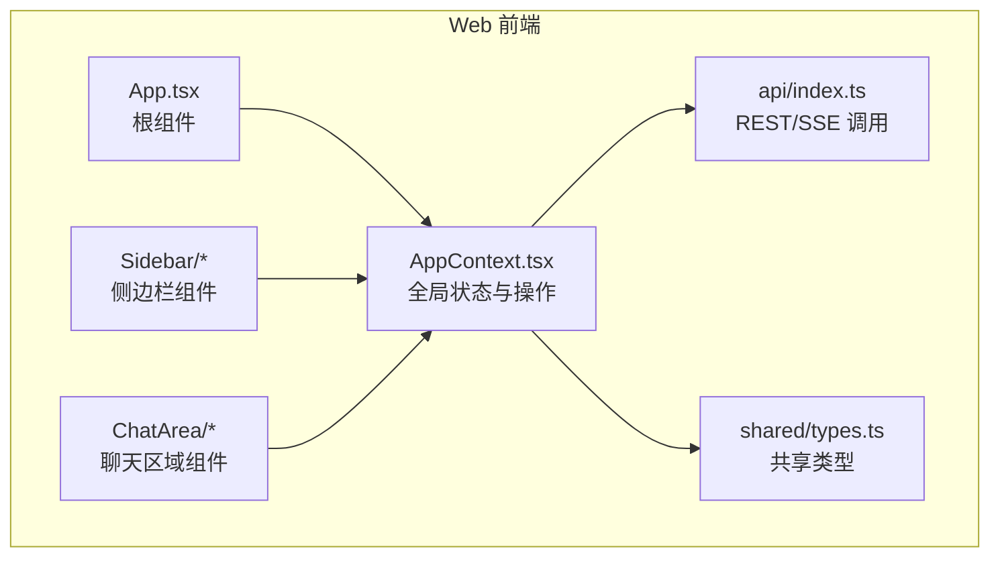
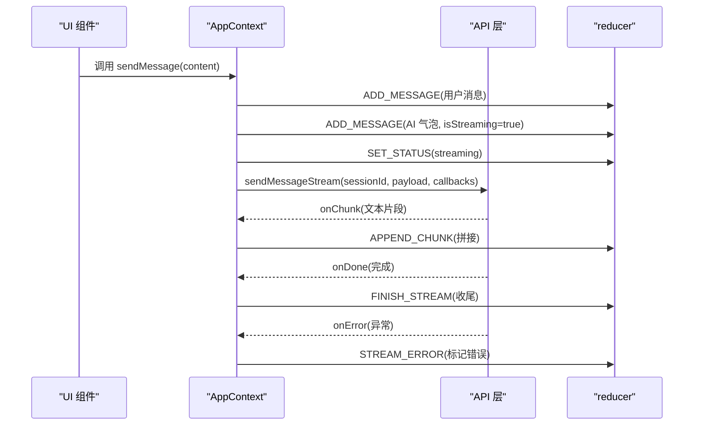
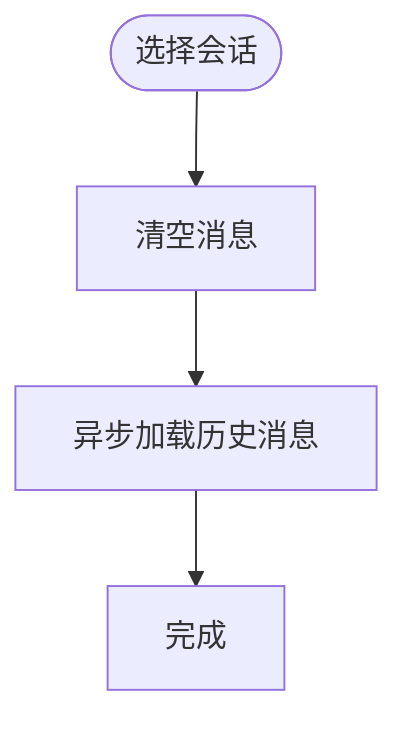
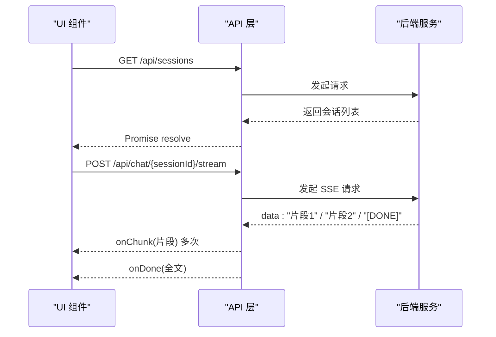
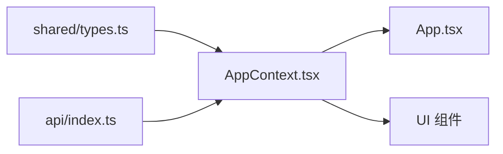

# 上下文状态管理

<cite>
**本文档引用的文件**
- [web/src/context/AppContext.tsx](file://web/src/context/AppContext.tsx)
- [web/src/App.tsx](file://web/src/App.tsx)
- [web/src/api/index.ts](file://web/src/api/index.ts)
- [shared/types.ts](file://shared/types.ts)
- [web/src/components/ChatArea/InputArea.tsx](file://web/src/components/ChatArea/InputArea.tsx)
- [web/src/components/ChatArea/MessageList.tsx](file://web/src/components/ChatArea/MessageList.tsx)
</cite>

## 目录
1. [简介](#简介)
2. [项目结构](#项目结构)
3. [核心组件](#核心组件)
4. [架构总览](#架构总览)
5. [详细组件分析](#详细组件分析)
6. [依赖关系分析](#依赖关系分析)
7. [性能考量](#性能考量)
8. [故障排查指南](#故障排查指南)
9. [结论](#结论)
10. [附录](#附录)

## 简介
本文件系统性阐述 AI Companion 前端的全局状态管理方案，围绕 AppContext 的设计理念与实现进行深入解析。该方案采用 React Context + useReducer 的组合，将聊天应用的“角色”“会话”“消息”“流式状态”“UI 状态”等数据集中管理，并通过 Provider/Consumer 模式在组件树中传递。文档重点覆盖：
- 状态提升与集中化设计
- Context Provider 与 useAppContext Consumer 的使用模式
- 全局状态的数据结构与职责边界
- 状态更新机制与流式渲染策略
- API 集成（REST 与 SSE）、错误处理与可中断能力
- 状态持久化与会话恢复思路
- 最佳实践、性能优化与调试技巧

## 项目结构
前端状态管理位于 web 子目录，核心文件如下：
- AppContext：全局状态与操作封装
- App：根组件，负责初始化加载角色与会话
- API 层：统一的 REST 与 SSE 调用模块
- 类型定义：共享的 TS 类型，确保前后端一致
- UI 组件：Sidebar 与 ChatArea 下的多个子组件消费状态

图表来源
- [web/src/App.tsx:1-29](file://web/src/App.tsx#L1-L29)
- [web/src/context/AppContext.tsx:1-384](file://web/src/context/AppContext.tsx#L1-L384)
- [web/src/api/index.ts:1-212](file://web/src/api/index.ts#L1-L212)
- [shared/types.ts:1-166](file://shared/types.ts#L1-L166)

章节来源
- [web/src/App.tsx:1-29](file://web/src/App.tsx#L1-L29)
- [web/src/context/AppContext.tsx:1-384](file://web/src/context/AppContext.tsx#L1-L384)
- [web/src/api/index.ts:1-212](file://web/src/api/index.ts#L1-L212)
- [shared/types.ts:1-166](file://shared/types.ts#L1-L166)

## 核心组件
- AppContext（全局状态与操作）
  - 状态结构：包含角色列表、会话列表、消息列表、当前选中角色/会话 ID、流式状态、UI 状态类型与提示信息
  - 操作集合：加载角色/会话/消息、选择角色/会话、角色 CRUD、会话 CRUD、发送消息（含流式）
- AppProvider：提供状态与操作函数，封装副作用与异步流程
- useAppContext：Consumer Hook，向子组件暴露状态与操作
- API 层：统一的 REST 与 SSE 调用，支持 AbortController 中断
- 类型系统：共享 TS 类型，保证前后端一致性

章节来源
- [web/src/context/AppContext.tsx:16-43](file://web/src/context/AppContext.tsx#L16-L43)
- [web/src/context/AppContext.tsx:49-61](file://web/src/context/AppContext.tsx#L49-L61)
- [web/src/context/AppContext.tsx:177-192](file://web/src/context/AppContext.tsx#L177-L192)
- [web/src/context/AppContext.tsx:196-373](file://web/src/context/AppContext.tsx#L196-L373)
- [web/src/api/index.ts:37-52](file://web/src/api/index.ts#L37-L52)
- [web/src/api/index.ts:137-201](file://web/src/api/index.ts#L137-L201)
- [shared/types.ts:15-165](file://shared/types.ts#L15-L165)

## 架构总览
AppContext 采用“状态提升 + 单一数据源”的设计，将角色、会话、消息与 UI 状态集中于单一 reducer，避免多处分散状态导致的不一致。AppProvider 负责：
- 初始化状态与 reducer
- 封装 API 调用，将结果映射为状态动作
- 提供稳定的回调函数（通过 useCallback 缓解重渲染）
- 管理流式渲染的生命周期（开始、增量、结束、错误）

图表来源
- [web/src/context/AppContext.tsx:310-350](file://web/src/context/AppContext.tsx#L310-L350)
- [web/src/api/index.ts:137-201](file://web/src/api/index.ts#L137-L201)

章节来源
- [web/src/context/AppContext.tsx:310-350](file://web/src/context/AppContext.tsx#L310-L350)
- [web/src/api/index.ts:137-201](file://web/src/api/index.ts#L137-L201)

## 详细组件分析

### AppContext 全局状态与操作
- 状态结构与职责
  - 数据域：characters、sessions、messages
  - 选中域：currentCharacterId、currentSessionId
  - 流式域：isStreaming
  - UI 状态：statusType、statusMessage
- 动作类型与更新策略
  - SET_*：直接替换对应字段
  - SELECT_CHARACTER：切换角色并重置会话与消息
  - SELECT_SESSION：切换会话并清空消息，随后异步加载历史
  - ADD_MESSAGE：追加消息
  - APPEND_CHUNK：对最后一条 assistant 消息增量拼接
  - FINISH_STREAM：结束流式，清除流式标记与状态
  - STREAM_ERROR：标记错误并设置状态
  - CLEAR_MESSAGES：清空消息
  - REMOVE_SESSION：删除会话并清理当前会话与消息
- Provider 封装的操作
  - 加载：loadCharacters、loadSessions、loadMessages
  - 选择：selectCharacter、selectSession
  - 角色 CRUD：createCharacter、updateCharacter、deleteCharacter
  - 会话 CRUD：createSession、deleteSession
  - 发送消息：sendMessage（含 SSE 流式）
- 关键优化点
  - useCallback 包裹所有操作函数，避免子组件无谓重渲染
  - 流式渲染通过 AbortController 支持取消
  - 选择会话后立即清空消息，异步加载历史，避免阻塞 UI

图表来源
- [web/src/context/AppContext.tsx:83-88](file://web/src/context/AppContext.tsx#L83-L88)
- [web/src/context/AppContext.tsx:250-252](file://web/src/context/AppContext.tsx#L250-L252)

章节来源
- [web/src/context/AppContext.tsx:16-43](file://web/src/context/AppContext.tsx#L16-L43)
- [web/src/context/AppContext.tsx:49-61](file://web/src/context/AppContext.tsx#L49-L61)
- [web/src/context/AppContext.tsx:63-171](file://web/src/context/AppContext.tsx#L63-L171)
- [web/src/context/AppContext.tsx:196-373](file://web/src/context/AppContext.tsx#L196-L373)

### API 集成与错误处理
- REST 接口
  - 角色：GET/POST/PUT/DELETE /api/characters
  - 会话：GET/POST/DELETE /api/sessions
  - 消息：GET /api/messages?sessionId=...&limit=...
  - 聊天：POST /api/chat/{sessionId}
- SSE 流式接口
  - POST /api/chat/{sessionId}/stream
  - 客户端按 SSE 格式解析 data: 片段，遇到 [DONE] 结束
- 错误处理
  - HTTP 非 OK 时抛出 ApiError
  - SSE 读取异常通过 onError 回调上抛
  - 支持 AbortController 取消请求
- 可扩展性
  - API 层为纯 TS 模块，可移植到小程序等环境

图表来源
- [web/src/api/index.ts:91-101](file://web/src/api/index.ts#L91-L101)
- [web/src/api/index.ts:107-112](file://web/src/api/index.ts#L107-L112)
- [web/src/api/index.ts:137-201](file://web/src/api/index.ts#L137-L201)

章节来源
- [web/src/api/index.ts:37-52](file://web/src/api/index.ts#L37-L52)
- [web/src/api/index.ts:58-81](file://web/src/api/index.ts#L58-L81)
- [web/src/api/index.ts:87-101](file://web/src/api/index.ts#L87-L101)
- [web/src/api/index.ts:107-112](file://web/src/api/index.ts#L107-L112)
- [web/src/api/index.ts:137-201](file://web/src/api/index.ts#L137-L201)

### UI 组件与状态消费
- 输入区 InputArea
  - 读取 state.currentSessionId 与 isStreaming 控制可用性
  - Enter 发送，禁用 Shift+Enter 换行
- 消息列表 MessageList
  - 依据 state.messages 渲染
  - 新消息时自动滚动到底部

章节来源
- [web/src/components/ChatArea/InputArea.tsx:1-50](file://web/src/components/ChatArea/InputArea.tsx#L1-L50)
- [web/src/components/ChatArea/MessageList.tsx:1-24](file://web/src/components/ChatArea/MessageList.tsx#L1-L24)

### 类型系统与数据契约
- 角色：id、name、basePrompt、model、speechPatterns、createdAt
- 会话：id、characterId、title、summary、messageCount、createdAt、updatedAt
- 消息：id、sessionId、role、content、emotionSnapshot、createdAt
- 聊天 UI 状态：StatusType（online/streaming/error）、ChatMessageItem（role/content/isStreaming）

章节来源
- [shared/types.ts:34-41](file://shared/types.ts#L34-L41)
- [shared/types.ts:60-68](file://shared/types.ts#L60-L68)
- [shared/types.ts:79-86](file://shared/types.ts#L79-L86)
- [shared/types.ts:159-165](file://shared/types.ts#L159-L165)

## 依赖关系分析
- AppContext 依赖
  - shared/types：类型定义
  - web/src/api/index：REST/SSE 调用
- App 依赖 AppContext：初始化加载角色与会话
- UI 组件依赖 AppContext：读取状态与调用操作

图表来源
- [shared/types.ts:1-166](file://shared/types.ts#L1-166)
- [web/src/context/AppContext.tsx:1-10](file://web/src/context/AppContext.tsx#L1-L10)
- [web/src/api/index.ts:1-28](file://web/src/api/index.ts#L1-L28)
- [web/src/App.tsx:1-29](file://web/src/App.tsx#L1-L29)

章节来源
- [web/src/context/AppContext.tsx:1-10](file://web/src/context/AppContext.tsx#L1-L10)
- [web/src/api/index.ts:1-28](file://web/src/api/index.ts#L1-L28)
- [web/src/App.tsx:1-29](file://web/src/App.tsx#L1-L29)

## 性能考量
- 状态提升与不可变更新
  - reducer 通过浅拷贝与数组/对象拼接实现不可变更新，利于 React 优化
- useCallback 缓解重渲染
  - 所有操作函数均通过 useCallback 包裹，减少子组件重渲染
- 流式渲染与中断
  - 使用 AbortController 在新消息开始或组件卸载时取消前一次流式请求
- 异步加载与 UI 解耦
  - 切换会话时先清空消息，再异步加载历史，避免阻塞 UI
- 滚动优化
  - 消息列表仅在消息数组变化时滚动到底部，避免频繁 DOM 访问

章节来源
- [web/src/context/AppContext.tsx:196-373](file://web/src/context/AppContext.tsx#L196-L373)
- [web/src/context/AppContext.tsx:310-350](file://web/src/context/AppContext.tsx#L310-L350)
- [web/src/components/ChatArea/MessageList.tsx:9-14](file://web/src/components/ChatArea/MessageList.tsx#L9-L14)

## 故障排查指南
- 常见问题
  - 无法加载角色/会话：检查 API 层请求是否抛出 ApiError；确认后端接口可用与网络代理配置
  - 流式渲染卡住：确认 SSE 接口返回格式正确；检查 AbortController 是否被意外复用
  - 消息未显示：确认 isStreaming 与消息数组结构；检查 APPEND_CHUNK 与 FINISH_STREAM 的触发顺序
- 调试建议
  - 在 reducer 分支打印 action 与 state，定位更新路径
  - 在 API 层拦截请求与响应，验证数据结构
  - 在 UI 组件中打印 state.currentSessionId 与 state.messages，确认数据流向

章节来源
- [web/src/api/index.ts:46-51](file://web/src/api/index.ts#L46-L51)
- [web/src/context/AppContext.tsx:109-143](file://web/src/context/AppContext.tsx#L109-L143)
- [web/src/context/AppContext.tsx:334-347](file://web/src/context/AppContext.tsx#L334-L347)

## 结论
本方案通过 Context + useReducer 实现了清晰的状态提升与集中化管理，结合 API 层的统一调用与 SSE 流式能力，满足聊天应用的核心交互需求。通过 useCallback、AbortController、异步加载与不可变更新等手段，兼顾了性能与可维护性。后续可在本地持久化与会话恢复方面进一步完善。

## 附录
- 状态持久化与会话恢复建议
  - 本地存储：将 currentCharacterId、currentSessionId、messages（分页）持久化
  - 会话恢复：应用启动时读取持久化数据，优先恢复选中角色与会话，再异步补齐历史
  - 注意：避免将大体量消息一次性持久化，建议按会话维度分片存储
- 最佳实践清单
  - 明确状态边界：仅存放 UI 与业务所需数据
  - 不可变更新：严格使用不可变写法，配合 React.memo/useMemo
  - 错误上抛：统一捕获并映射为 UI 友好提示
  - 可测试性：将副作用抽离至 Provider 内部，便于单元测试