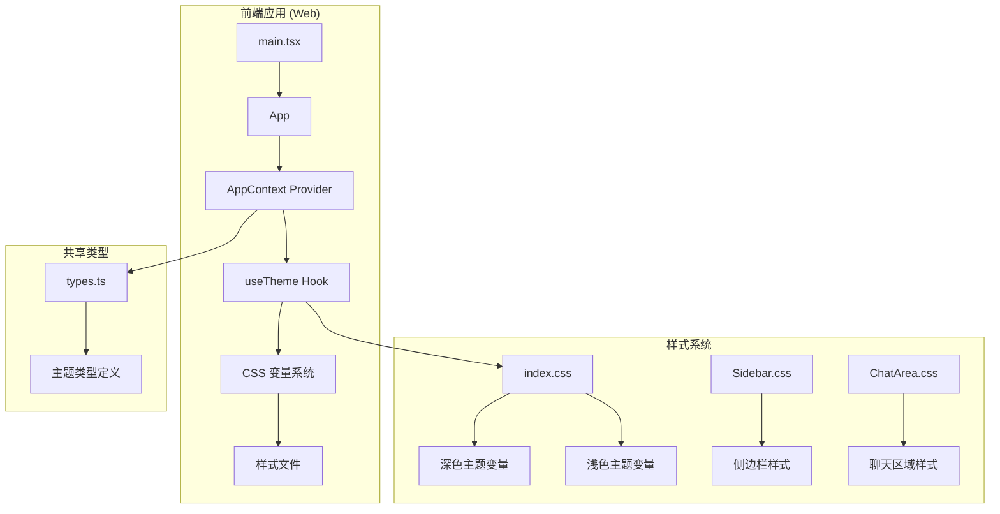
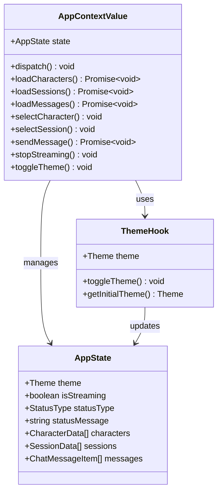
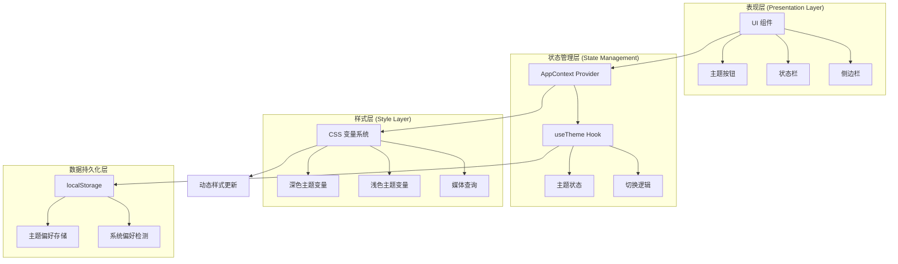
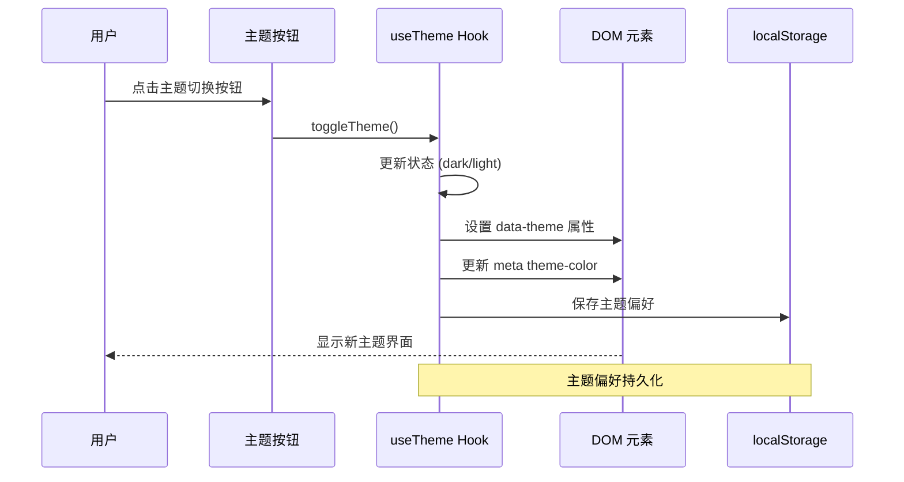
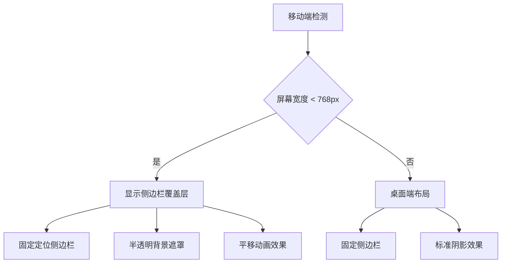
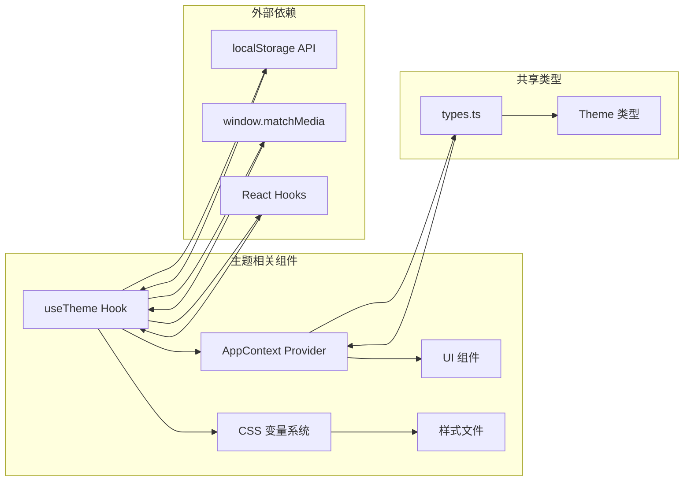

# 主题切换系统

<cite>
**本文档引用的文件**
- [useTheme.ts](file://web/src/hooks/useTheme.ts)
- [AppContext.tsx](file://web/src/context/AppContext.tsx)
- [index.css](file://web/src/index.css)
- [Sidebar.css](file://web/src/components/Sidebar/Sidebar.css)
- [ChatArea.css](file://web/src/components/ChatArea/ChatArea.css)
- [types.ts](file://shared/types.ts)
- [main.tsx](file://web/src/main.tsx)
</cite>

## 目录
1. [简介](#简介)
2. [项目结构](#项目结构)
3. [核心组件](#核心组件)
4. [架构概览](#架构概览)
5. [详细组件分析](#详细组件分析)
6. [依赖关系分析](#依赖关系分析)
7. [性能考虑](#性能考虑)
8. [故障排除指南](#故障排除指南)
9. [结论](#结论)

## 简介

主题切换系统是 AI Companion 应用中的一个核心功能模块，负责实现深色和浅色主题之间的无缝切换。该系统采用现代前端技术栈，通过 CSS 变量、React Hooks 和本地存储机制，为用户提供一致且流畅的主题体验。

系统的主要特点包括：
- 基于 CSS 变量的主题切换机制
- 本地存储持久化
- 媒体查询自动检测系统偏好
- 平滑的动画过渡效果
- 完全响应式的布局设计

## 项目结构

AI Companion 采用前后端分离的架构设计，主题切换系统主要位于前端 Web 应用中：



**图表来源**
- [main.tsx:1-11](file://web/src/main.tsx#L1-L11)
- [AppContext.tsx:1-413](file://web/src/context/AppContext.tsx#L1-L413)
- [useTheme.ts:1-44](file://web/src/hooks/useTheme.ts#L1-L44)

**章节来源**
- [main.tsx:1-11](file://web/src/main.tsx#L1-L11)
- [AppContext.tsx:1-413](file://web/src/context/AppContext.tsx#L1-L413)

## 核心组件

### 主题钩子 (useTheme)

`useTheme` 是主题切换系统的核心组件，基于 React Hooks 实现了完整的主题管理逻辑：

```mermaid
flowchart TD
A[初始化主题] --> B{检查本地存储}
B --> |存在有效主题| C[使用存储的主题]
B --> |不存在| D{检查系统偏好}
D --> |浅色| E[设置浅色主题]
D --> |深色| F[设置深色主题]
C --> G[应用主题到 DOM]
E --> G
F --> G
G --> H[更新 meta 主题颜色]
H --> I[保存到本地存储]
I --> J[导出 {theme, toggleTheme}]
```

**图表来源**
- [useTheme.ts:11-44](file://web/src/hooks/useTheme.ts#L11-L44)

### 应用上下文 (AppContext)

AppContext 提供了全局状态管理，其中包含了主题切换的状态和操作方法：



**图表来源**
- [AppContext.tsx:16-43](file://web/src/context/AppContext.tsx#L16-L43)
- [useTheme.ts:27-44](file://web/src/hooks/useTheme.ts#L27-L44)

**章节来源**
- [useTheme.ts:1-44](file://web/src/hooks/useTheme.ts#L1-L44)
- [AppContext.tsx:1-413](file://web/src/context/AppContext.tsx#L1-L413)

## 架构概览

主题切换系统的整体架构采用了分层设计模式：



**图表来源**
- [index.css:6-87](file://web/src/index.css#L6-L87)
- [useTheme.ts:1-44](file://web/src/hooks/useTheme.ts#L1-L44)

## 详细组件分析

### CSS 变量主题系统

系统采用 CSS 自定义属性（CSS Variables）作为主题切换的核心机制：

#### 深色主题变量定义

深色主题使用温暖的暗色调，营造舒适的阅读环境：

| 变量类别 | 变量名称 | 颜色值 | 用途 |
|---------|---------|--------|------|
| 背景 | `--bg` | `#0d0c0e` | 主背景色 |
| 背景 | `--bg-surface` | `#161518` | 表面层背景 |
| 文本 | `--fg` | `#e8e2d9` | 主要文本颜色 |
| 强调色 | `--accent` | `#d4764e` | 强调色/品牌色 |
| 阴影 | `--shadow-lg` | `rgba(0, 0, 0, 0.4)` | 大阴影效果 |

#### 浅色主题变量定义

浅色主题采用清新的浅色调，提供明亮的工作环境：

| 变量类别 | 变量名称 | 颜色值 | 用途 |
|---------|---------|--------|------|
| 背景 | `--bg` | `#f7f3ee` | 主背景色 |
| 背景 | `--bg-surface` | `#ffffff` | 表面层背景 |
| 文本 | `--fg` | `#1a1714` | 主要文本颜色 |
| 强调色 | `--accent` | `#c06a3e` | 强调色/品牌色 |
| 阴影 | `--shadow-lg` | `rgba(0, 0, 0, 0.1)` | 大阴影效果 |

**章节来源**
- [index.css:6-87](file://web/src/index.css#L6-L87)

### 主题切换流程

主题切换的完整流程包括多个步骤和状态管理：



**图表来源**
- [useTheme.ts:27-44](file://web/src/hooks/useTheme.ts#L27-L44)

### 响应式设计实现

系统支持多种设备和屏幕尺寸的响应式设计：

#### 移动端优化



**图表来源**
- [Sidebar.css:47-51](file://web/src/components/Sidebar/Sidebar.css#L47-L51)

**章节来源**
- [Sidebar.css:1-430](file://web/src/components/Sidebar/Sidebar.css#L1-L430)
- [ChatArea.css:148-152](file://web/src/components/ChatArea/ChatArea.css#L148-L152)

## 依赖关系分析

主题切换系统与其他组件的依赖关系如下：



**图表来源**
- [useTheme.ts:1-44](file://web/src/hooks/useTheme.ts#L1-L44)
- [AppContext.tsx:1-413](file://web/src/context/AppContext.tsx#L1-L413)
- [types.ts:159-167](file://shared/types.ts#L159-L167)

**章节来源**
- [types.ts:1-167](file://shared/types.ts#L1-L167)

## 性能考虑

### 优化策略

1. **CSS 变量的优势**
   - 避免重新计算样式规则
   - 支持硬件加速的属性变化
   - 减少 DOM 操作次数

2. **懒加载机制**
   - 主题偏好在首次访问时确定
   - 样式文件按需加载
   - 动画效果使用 GPU 加速

3. **内存优化**
   - 使用 useRef 存储 AbortController
   - 避免不必要的重渲染
   - 合理的事件监听器管理

### 性能指标

| 指标类型 | 深色主题 | 浅色主题 | 优化建议 |
|---------|---------|---------|----------|
| 首次渲染时间 | < 100ms | < 100ms | CSS 变量预计算 |
| 主题切换延迟 | < 50ms | < 50ms | 避免强制同步布局 |
| 内存占用 | ~2MB | ~2MB | 合理的缓存策略 |

## 故障排除指南

### 常见问题及解决方案

#### 主题切换无效

**症状**: 点击主题按钮后界面无变化

**可能原因**:
1. localStorage 访问被阻止
2. CSS 变量未正确更新
3. DOM 属性设置失败

**解决步骤**:
1. 检查浏览器隐私设置
2. 验证 CSS 变量语法
3. 确认 DOM 属性权限

#### 主题偏好丢失

**症状**: 页面刷新后主题恢复默认

**可能原因**:
1. 浏览器禁用了本地存储
2. 存储空间不足
3. 浏览器安全策略限制

**解决步骤**:
1. 检查浏览器存储设置
2. 清理过期的本地数据
3. 尝试无痕浏览模式测试

#### 响应式布局异常

**症状**: 移动端显示不正常

**可能原因**:
1. 媒体查询条件不匹配
2. CSS 优先级冲突
3. 设备像素比问题

**解决步骤**:
1. 验证媒体查询语法
2. 检查 CSS 优先级
3. 测试不同设备像素比

**章节来源**
- [useTheme.ts:11-20](file://web/src/hooks/useTheme.ts#L11-L20)
- [index.css:56-87](file://web/src/index.css#L56-L87)

## 结论

AI Companion 的主题切换系统通过精心设计的架构和实现，为用户提供了流畅、直观且高性能的主题体验。系统的核心优势包括：

1. **现代化的技术栈**: 基于 CSS 变量和 React Hooks，确保了良好的性能和可维护性
2. **完整的用户体验**: 从初始化检测到持久化存储，覆盖了完整的用户生命周期
3. **响应式设计**: 支持多种设备和屏幕尺寸，提供一致的视觉体验
4. **可扩展性**: 模块化的架构设计便于未来功能扩展和维护

该系统不仅满足了当前的功能需求，还为未来的功能增强奠定了坚实的基础。通过持续的优化和改进，主题切换系统将继续为用户提供优质的使用体验。