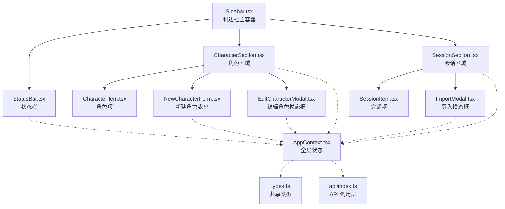
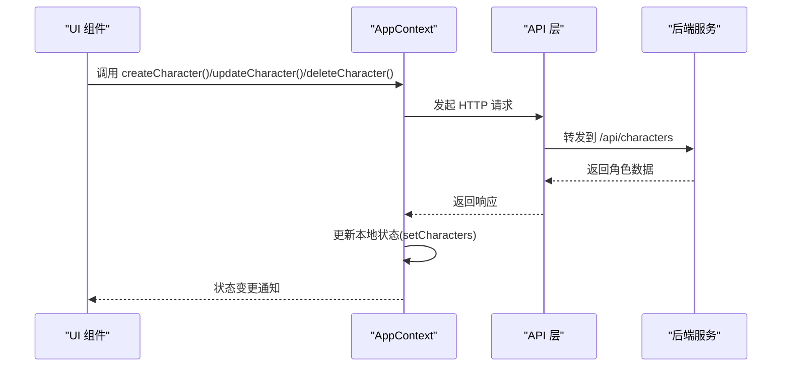
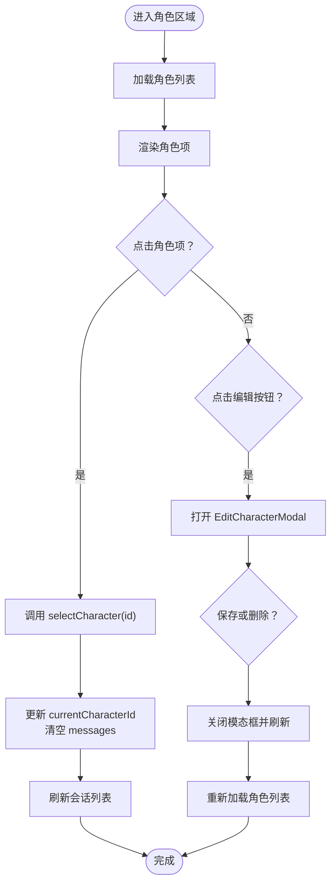
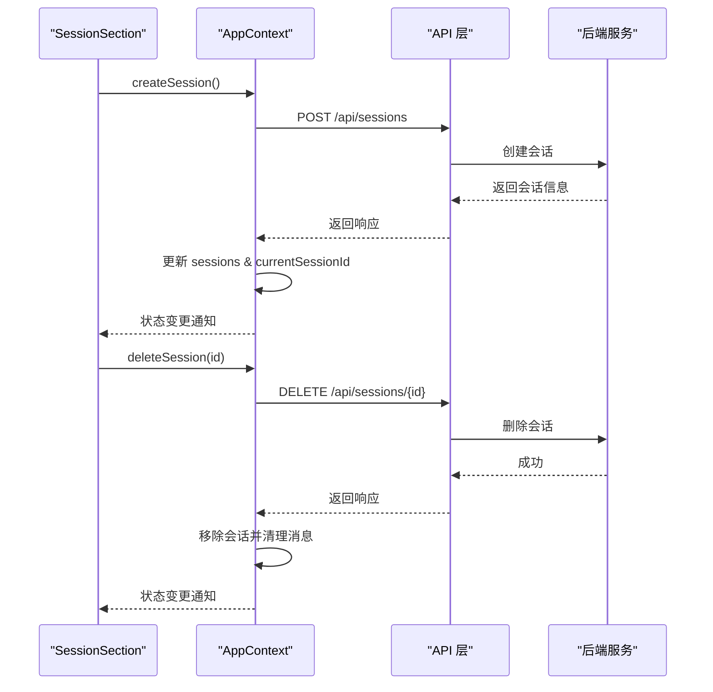
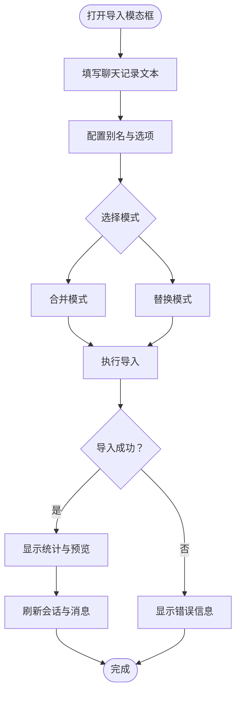
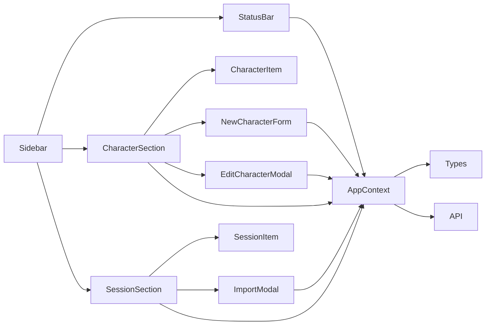

# 侧边栏系统

<cite>
**本文档引用的文件**
- [Sidebar.tsx](file://web/src/components/Sidebar/Sidebar.tsx)
- [CharacterSection.tsx](file://web/src/components/Sidebar/CharacterSection.tsx)
- [SessionSection.tsx](file://web/src/components/Sidebar/SessionSection.tsx)
- [CharacterItem.tsx](file://web/src/components/Sidebar/CharacterItem.tsx)
- [SessionItem.tsx](file://web/src/components/Sidebar/SessionItem.tsx)
- [EditCharacterModal.tsx](file://web/src/components/Sidebar/EditCharacterModal.tsx)
- [NewCharacterForm.tsx](file://web/src/components/Sidebar/NewCharacterForm.tsx)
- [ImportModal.tsx](file://web/src/components/Sidebar/ImportModal.tsx)
- [StatusBar.tsx](file://web/src/components/Sidebar/StatusBar.tsx)
- [Sidebar.css](file://web/src/components/Sidebar/Sidebar.css)
- [AppContext.tsx](file://web/src/context/AppContext.tsx)
- [types.ts](file://shared/types.ts)
- [api/index.ts](file://web/src/api/index.ts)
</cite>

## 目录
1. [简介](#简介)
2. [项目结构](#项目结构)
3. [核心组件](#核心组件)
4. [架构总览](#架构总览)
5. [详细组件分析](#详细组件分析)
6. [依赖关系分析](#依赖关系分析)
7. [性能考虑](#性能考虑)
8. [故障排除指南](#故障排除指南)
9. [结论](#结论)

## 简介
本文件为 AI Companion 侧边栏系统的详细技术文档，涵盖 Sidebar 主组件的整体布局与功能组织，角色管理与会话管理的导航结构，以及 Modal 对话框组件的交互逻辑。文档同时说明 StatusBar 状态栏组件的功能与用户反馈机制，并包含侧边栏的展开收起动画与响应式适配的实现细节。

## 项目结构
侧边栏系统位于 Web 前端工程的组件目录中，采用模块化设计，每个子组件独立负责特定功能区域：
- 主容器组件：Sidebar.tsx
- 角色区域：CharacterSection.tsx + CharacterItem.tsx + NewCharacterForm.tsx + EditCharacterModal.tsx
- 会话区域：SessionSection.tsx + SessionItem.tsx + ImportModal.tsx
- 状态栏：StatusBar.tsx
- 样式：Sidebar.css
- 全局状态：AppContext.tsx
- 类型定义：shared/types.ts
- API 层：web/src/api/index.ts

图表来源
- [Sidebar.tsx:1-15](file://web/src/components/Sidebar/Sidebar.tsx#L1-L15)
- [CharacterSection.tsx:1-47](file://web/src/components/Sidebar/CharacterSection.tsx#L1-L47)
- [SessionSection.tsx:1-58](file://web/src/components/Sidebar/SessionSection.tsx#L1-L58)
- [StatusBar.tsx:1-26](file://web/src/components/Sidebar/StatusBar.tsx#L1-L26)
- [AppContext.tsx:1-384](file://web/src/context/AppContext.tsx#L1-L384)

章节来源
- [Sidebar.tsx:1-15](file://web/src/components/Sidebar/Sidebar.tsx#L1-L15)
- [Sidebar.css:1-384](file://web/src/components/Sidebar/Sidebar.css#L1-L384)

## 核心组件
- Sidebar 主容器：负责装配状态栏、角色区域与会话区域，提供基础布局与样式入口。
- AppContext 全局状态：集中管理角色、会话、消息、当前选中项与流式状态，封装 CRUD 与流式聊天操作。
- 类型系统：共享的 TypeScript 接口定义角色、会话、消息、导入结果等数据模型。
- API 层：封装 HTTP 请求与 SSE 流式接口，统一错误处理与响应格式。

章节来源
- [AppContext.tsx:16-32](file://web/src/context/AppContext.tsx#L16-L32)
- [types.ts:34-68](file://shared/types.ts#L34-L68)
- [api/index.ts:15-28](file://web/src/api/index.ts#L15-L28)

## 架构总览
侧边栏系统采用“容器-展示”分层与“上下文-状态管理”的组合模式：
- 容器组件（Sidebar、CharacterSection、SessionSection）负责布局与事件编排。
- 展示组件（CharacterItem、SessionItem）负责具体渲染。
- AppContext 提供全局状态与动作方法，组件通过 hooks 获取上下文。
- API 层抽象网络请求，支持同步与流式两种聊天模式。

图表来源
- [AppContext.tsx:258-280](file://web/src/context/AppContext.tsx#L258-L280)
- [api/index.ts:58-81](file://web/src/api/index.ts#L58-L81)

## 详细组件分析

### Sidebar 主容器
- 职责：装配状态栏、角色区域、会话区域；引入样式文件。
- 结构：三段式布局，垂直方向排列，使用 Flex 布局与固定宽度。
- 样式：侧边栏背景采用径向渐变与变量主题，具备沉浸式视觉效果。

章节来源
- [Sidebar.tsx:1-15](file://web/src/components/Sidebar/Sidebar.tsx#L1-L15)
- [Sidebar.css:6-19](file://web/src/components/Sidebar/Sidebar.css#L6-L19)

### 角色区域（CharacterSection）
- 功能组织：
  - 角色列表展示：遍历 state.characters，渲染 CharacterItem。
  - 角色切换：调用 AppContext.selectCharacter，更新当前角色与会话。
  - 编辑角色：打开 EditCharacterModal，支持更新与删除。
  - 新建角色：集成 NewCharacterForm，提交后刷新列表。
- 状态管理：通过 AppContext 的 selectCharacter、loadSessions、createCharacter、updateCharacter、deleteCharacter 等方法协调。
- 交互细节：编辑按钮仅在鼠标悬停时可见；角色项点击进入切换流程。

图表来源
- [CharacterSection.tsx:12-24](file://web/src/components/Sidebar/CharacterSection.tsx#L12-L24)
- [AppContext.tsx:241-252](file://web/src/context/AppContext.tsx#L241-L252)

章节来源
- [CharacterSection.tsx:1-47](file://web/src/components/Sidebar/CharacterSection.tsx#L1-L47)
- [CharacterItem.tsx:1-38](file://web/src/components/Sidebar/CharacterItem.tsx#L1-L38)
- [NewCharacterForm.tsx:1-48](file://web/src/components/Sidebar/NewCharacterForm.tsx#L1-L48)
- [EditCharacterModal.tsx:1-70](file://web/src/components/Sidebar/EditCharacterModal.tsx#L1-L70)

### 会话区域（SessionSection）
- 功能组织：
  - 会话历史记录：按当前角色过滤 state.sessions 并渲染 SessionItem。
  - 会话搜索：当前实现未提供搜索功能，可通过扩展字段与过滤逻辑实现。
  - 会话操作：新建会话、导入聊天记录、删除会话。
- 交互细节：
  - 新建会话按钮仅在存在当前角色时可用。
  - 导入按钮仅在存在当前会话时可用。
  - 删除会话前进行确认，异常时弹出错误提示。

图表来源
- [SessionSection.tsx:15-22](file://web/src/components/Sidebar/SessionSection.tsx#L15-L22)
- [AppContext.tsx:286-304](file://web/src/context/AppContext.tsx#L286-L304)
- [api/index.ts:87-101](file://web/src/api/index.ts#L87-L101)

章节来源
- [SessionSection.tsx:1-58](file://web/src/components/Sidebar/SessionSection.tsx#L1-L58)
- [SessionItem.tsx:1-36](file://web/src/components/Sidebar/SessionItem.tsx#L1-L36)

### Modal 对话框组件

#### EditCharacterModal（编辑角色模态框）
- 交互逻辑：
  - 表单绑定角色名称与人格设定，支持保存与删除。
  - 保存成功后关闭模态框并刷新会话列表。
  - 删除前二次确认，异常时弹出错误提示。
- 状态管理：通过 AppContext.updateCharacter 与 deleteCharacter 协调。

章节来源
- [EditCharacterModal.tsx:1-70](file://web/src/components/Sidebar/EditCharacterModal.tsx#L1-L70)
- [AppContext.tsx:266-280](file://web/src/context/AppContext.tsx#L266-L280)

#### NewCharacterForm（新建角色表单）
- 交互逻辑：
  - 输入角色 ID、名称与人格提示词，提交后清空表单并提示错误。
  - 提交前进行非空校验，避免无效数据。
- 状态管理：通过 AppContext.createCharacter 协调。

章节来源
- [NewCharacterForm.tsx:1-48](file://web/src/components/Sidebar/NewCharacterForm.tsx#L1-L48)
- [AppContext.tsx:258-264](file://web/src/context/AppContext.tsx#L258-L264)

#### ImportModal（导入模态框）
- 交互逻辑：
  - 支持多种别名配置（用户/助手），可选择合并或替换模式。
  - 可选触发长期记忆提取、生成会话摘要、提取人格画像。
  - 导入完成后展示解析与写入统计、排队任务与预览。
- 错误处理：捕获异常并显示错误信息，导入过程中禁用交互。
- 状态管理：通过 AppContext.loadSessions 与 loadMessages 刷新数据。

图表来源
- [ImportModal.tsx:37-72](file://web/src/components/Sidebar/ImportModal.tsx#L37-L72)
- [api/index.ts:207-211](file://web/src/api/index.ts#L207-L211)

章节来源
- [ImportModal.tsx:1-254](file://web/src/components/Sidebar/ImportModal.tsx#L1-L254)
- [AppContext.tsx:213-235](file://web/src/context/AppContext.tsx#L213-L235)

### StatusBar 状态栏组件
- 功能：根据 AppContext.state.statusType 显示在线、回复中或错误状态，配合彩色指示点与文本提示。
- 状态映射：online（绿色脉冲）、streaming（黄色脉冲）、error（红色）。
- 用户反馈：通过状态文本与颜色变化直观反映系统状态。

章节来源
- [StatusBar.tsx:1-26](file://web/src/components/Sidebar/StatusBar.tsx#L1-L26)
- [AppContext.tsx:145-150](file://web/src/context/AppContext.tsx#L145-L150)

### 侧边栏样式与响应式适配
- 布局：固定宽度 320px，最小宽度约束，垂直滚动容器。
- 主题：使用 CSS 变量与渐变背景，营造沉浸式视觉体验。
- 交互：角色项与会话项悬停高亮、激活态强调、删除按钮延迟显示。
- 动画：状态点根据状态类型应用不同频率的脉冲动画。

章节来源
- [Sidebar.css:6-19](file://web/src/components/Sidebar/Sidebar.css#L6-L19)
- [Sidebar.css:42-68](file://web/src/components/Sidebar/Sidebar.css#L42-L68)
- [Sidebar.css:96-182](file://web/src/components/Sidebar/Sidebar.css#L96-L182)
- [Sidebar.css:316-383](file://web/src/components/Sidebar/Sidebar.css#L316-L383)

## 依赖关系分析
- 组件耦合：
  - Sidebar 作为容器，依赖 StatusBar、CharacterSection、SessionSection。
  - CharacterSection 依赖 CharacterItem、NewCharacterForm、EditCharacterModal。
  - SessionSection 依赖 SessionItem、ImportModal。
  - 所有子组件均通过 AppContext 获取状态与动作。
- 外部依赖：
  - AppContext 依赖 shared/types.ts 的类型定义。
  - AppContext 依赖 web/src/api/index.ts 的网络请求封装。
  - ImportModal 依赖 API.importChatRecords 进行导入操作。

图表来源
- [Sidebar.tsx:1-15](file://web/src/components/Sidebar/Sidebar.tsx#L1-L15)
- [AppContext.tsx:16-32](file://web/src/context/AppContext.tsx#L16-L32)
- [api/index.ts:15-28](file://web/src/api/index.ts#L15-L28)

章节来源
- [types.ts:34-68](file://shared/types.ts#L34-L68)
- [api/index.ts:137-201](file://web/src/api/index.ts#L137-L201)

## 性能考虑
- 列表渲染优化：
  - 角色与会话列表使用 key 保持稳定标识，减少重排。
  - 滚动容器限制高度，避免一次性渲染过多节点。
- 状态更新策略：
  - AppContext 使用 useReducer 集中更新，避免细粒度状态分散导致的重复渲染。
  - 流式聊天通过 SSE 分片更新，避免大字符串一次性拼接。
- 异步加载：
  - 会话与消息异步加载，不阻塞 UI 响应。
- 样式性能：
  - 使用 CSS 变量与简单动画，降低重绘成本。

## 故障排除指南
- 角色/会话加载失败：
  - 检查 AppContext 中 loadCharacters/loadSessions 的异常日志。
  - 确认 API 层请求路径与后端服务连通性。
- 编辑/删除角色异常：
  - 查看 EditCharacterModal 的错误提示与 AppContext.updateCharacter/deleteCharacter 的返回。
- 导入失败：
  - 检查 ImportModal 的错误信息与 API.importChatRecords 的响应。
  - 确认当前会话是否已选择，文本是否为空。
- 状态栏异常：
  - 检查 AppContext.dispatch 的 SET_STATUS 是否正确触发。
  - 确认 StatusBar 的状态映射与 CSS 动画配置。

章节来源
- [AppContext.tsx:204-220](file://web/src/context/AppContext.tsx#L204-L220)
- [EditCharacterModal.tsx:24-38](file://web/src/components/Sidebar/EditCharacterModal.tsx#L24-L38)
- [ImportModal.tsx:67-71](file://web/src/components/Sidebar/ImportModal.tsx#L67-L71)
- [StatusBar.tsx:9-25](file://web/src/components/Sidebar/StatusBar.tsx#L9-L25)

## 结论
侧边栏系统通过清晰的模块划分与全局状态管理，实现了角色与会话的高效导航与操作。Modal 对话框提供了完善的编辑与导入能力，StatusBar 则直观地反馈系统状态。样式层采用沉浸式设计与响应式适配，确保在不同设备上的良好体验。未来可在会话区域增加搜索与排序功能，并进一步优化导入流程的可视化反馈。