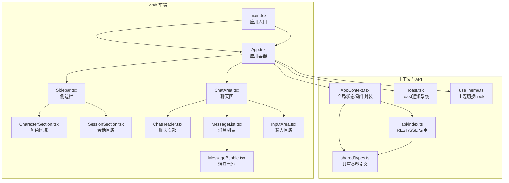
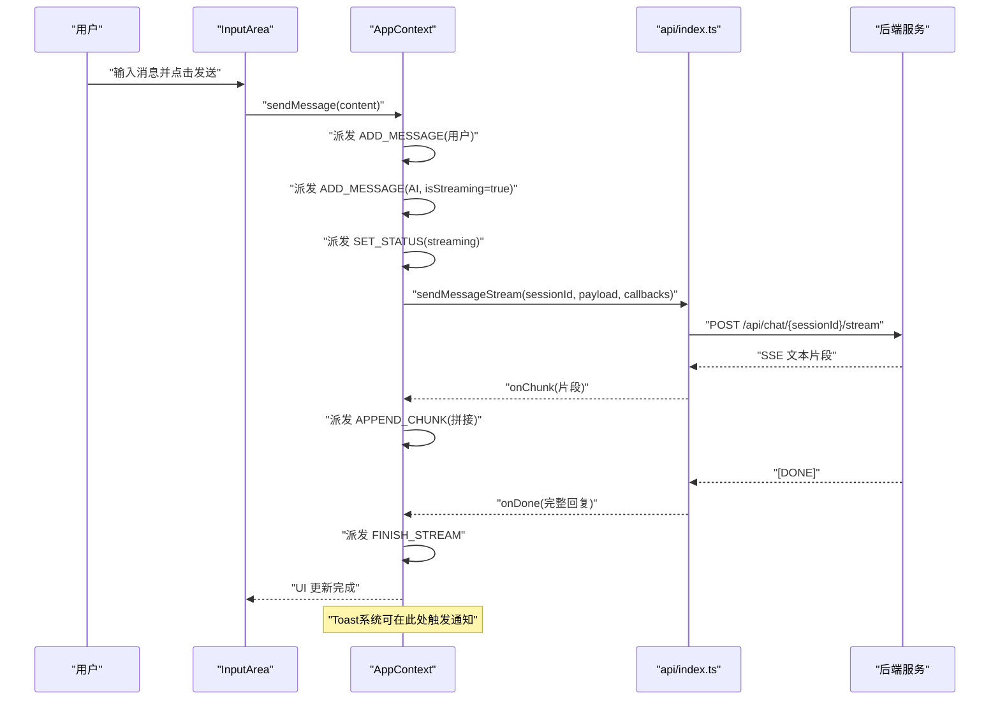
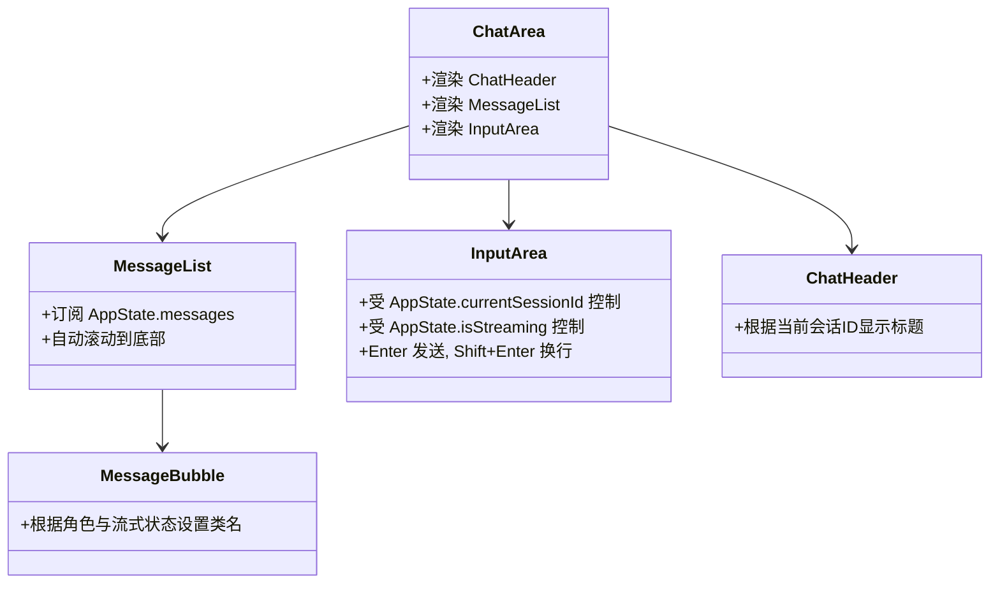
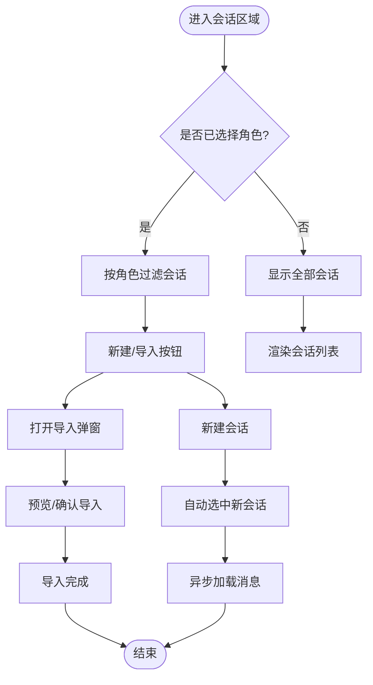
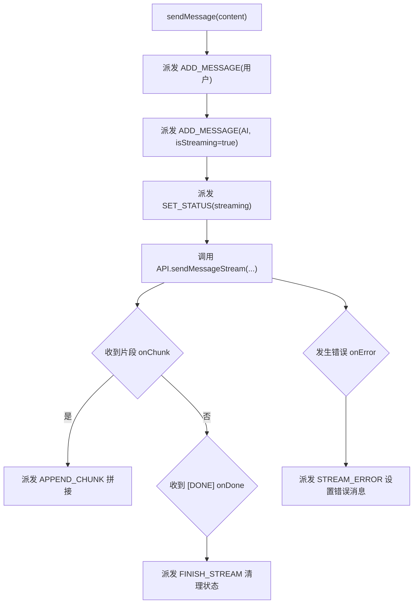
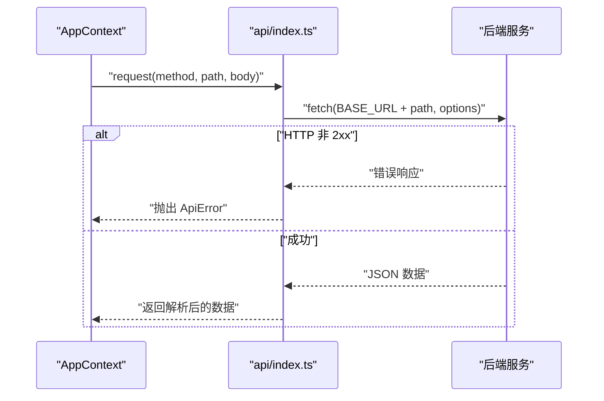
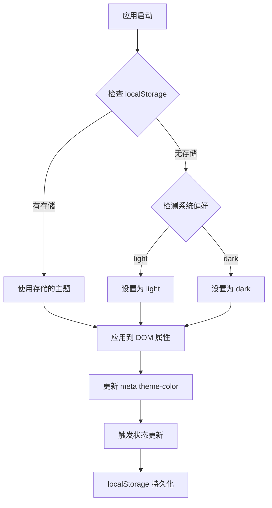
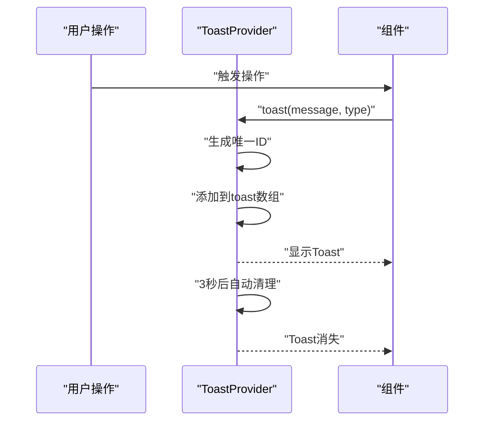
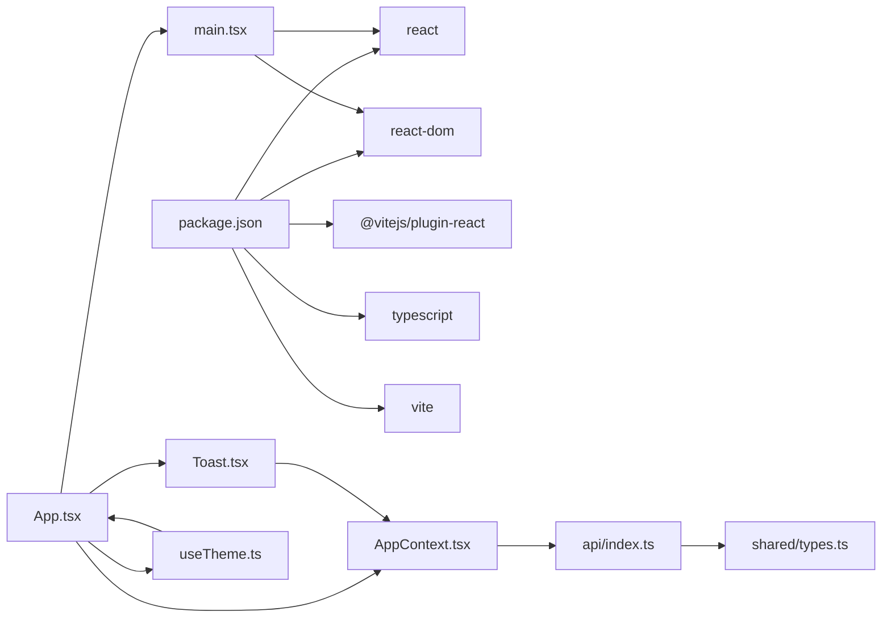

# 前端应用详解

<cite>
**本文档引用的文件**
- [web/src/App.tsx](file://web/src/App.tsx)
- [web/src/main.tsx](file://web/src/main.tsx)
- [web/vite.config.ts](file://web/vite.config.ts)
- [web/package.json](file://web/package.json)
- [shared/types.ts](file://shared/types.ts)
- [web/src/context/AppContext.tsx](file://web/src/context/AppContext.tsx)
- [web/src/api/index.ts](file://web/src/api/index.ts)
- [web/src/components/ChatArea/ChatArea.tsx](file://web/src/components/ChatArea/ChatArea.tsx)
- [web/src/components/ChatArea/MessageList.tsx](file://web/src/components/ChatArea/MessageList.tsx)
- [web/src/components/ChatArea/InputArea.tsx](file://web/src/components/ChatArea/InputArea.tsx)
- [web/src/components/ChatArea/ChatHeader.tsx](file://web/src/components/ChatArea/ChatHeader.tsx)
- [web/src/components/ChatArea/MessageBubble.tsx](file://web/src/components/ChatArea/MessageBubble.tsx)
- [web/src/components/Sidebar/Sidebar.tsx](file://web/src/components/Sidebar/Sidebar.tsx)
- [web/src/components/Sidebar/CharacterSection.tsx](file://web/src/components/Sidebar/CharacterSection.tsx)
- [web/src/components/Sidebar/SessionSection.tsx](file://web/src/components/Sidebar/SessionSection.tsx)
- [web/src/components/Toast.tsx](file://web/src/components/Toast.tsx)
- [web/src/hooks/useTheme.ts](file://web/src/hooks/useTheme.ts)
</cite>

## 更新摘要
**所做更改**
- 新增主题切换系统章节，包含useTheme hook实现和主题持久化机制
- 新增Toast通知系统章节，涵盖ToastProvider和useToast hook
- 更新移动端响应式设计章节，说明侧边栏折叠和触摸交互
- 扩展聊天交互体验章节，增加流式状态管理和错误处理
- 更新架构总览图，反映新增的Toast和主题系统

## 目录
1. [引言](#引言)
2. [项目结构](#项目结构)
3. [核心组件](#核心组件)
4. [架构总览](#架构总览)
5. [详细组件分析](#详细组件分析)
6. [主题切换系统](#主题切换系统)
7. [Toast通知系统](#toast通知系统)
8. [移动端响应式设计](#移动端响应式设计)
9. [依赖关系分析](#依赖关系分析)
10. [性能考虑](#性能考虑)
11. [故障排查指南](#故障排查指南)
12. [结论](#结论)
13. [附录](#附录)

## 引言
本文件面向AI Companion前端应用，系统性阐述基于Vite与React 19的现代前端架构。重点覆盖组件树结构、状态管理（AppContext）、路由配置（单页应用）、聊天界面设计（ChatArea及其子组件）、侧边栏组件体系（角色与会话）、API集成（REST与SSE流式）、主题切换系统、Toast通知系统以及最佳实践（Props设计、事件处理、样式管理、响应式与用户体验优化）。文档同时提供可视化图示，帮助不同技术背景的读者快速理解与上手。

## 项目结构
前端位于web目录，采用Vite作为构建工具，React 19作为UI框架，TypeScript提供类型安全。共享类型定义位于shared目录，便于前后端与多平台复用。入口文件负责挂载根组件，App.tsx组织侧边栏与聊天区两大区域，并在初始化时加载角色与会话数据。

**图表来源**
- [web/src/main.tsx:1-11](file://web/src/main.tsx#L1-L11)
- [web/src/App.tsx:1-44](file://web/src/App.tsx#L1-L44)
- [web/src/context/AppContext.tsx:1-413](file://web/src/context/AppContext.tsx#L1-L413)
- [web/src/api/index.ts:1-212](file://web/src/api/index.ts#L1-L212)
- [web/src/components/Toast.tsx:1-48](file://web/src/components/Toast.tsx#L1-L48)
- [web/src/hooks/useTheme.ts:1-44](file://web/src/hooks/useTheme.ts#L1-L44)
- [shared/types.ts:1-166](file://shared/types.ts#L1-L166)

**章节来源**
- [web/src/main.tsx:1-11](file://web/src/main.tsx#L1-L11)
- [web/src/App.tsx:1-44](file://web/src/App.tsx#L1-L44)
- [web/vite.config.ts:1-44](file://web/vite.config.ts#L1-L44)
- [web/package.json:1-22](file://web/package.json#L1-L22)

## 核心组件
- 应用入口与挂载：main.tsx使用React 19的createRoot挂载App组件，引入全局样式。
- 应用容器：App.tsx在首次渲染时加载角色与会话数据，并渲染Sidebar与ChatArea，集成ToastProvider和主题系统。
- 全局状态：AppContext.tsx基于useReducer与Context提供统一状态与动作封装，包含角色、会话、消息、当前选中项、流式状态与UI状态。
- API层：api/index.ts封装REST与SSE调用，统一错误处理，支持跨平台复用。
- 共享类型：shared/types.ts定义消息、角色、会话、SSE回调、错误类型等，确保前后端一致的数据契约。
- 主题系统：useTheme hook提供主题切换功能，支持本地存储持久化和系统偏好检测。
- Toast通知：ToastProvider提供全局通知系统，支持成功、错误、信息三种类型的通知。

**章节来源**
- [web/src/main.tsx:1-11](file://web/src/main.tsx#L1-L11)
- [web/src/App.tsx:1-44](file://web/src/App.tsx#L1-L44)
- [web/src/context/AppContext.tsx:1-413](file://web/src/context/AppContext.tsx#L1-L413)
- [web/src/api/index.ts:1-212](file://web/src/api/index.ts#L1-L212)
- [web/src/components/Toast.tsx:1-48](file://web/src/components/Toast.tsx#L1-L48)
- [web/src/hooks/useTheme.ts:1-44](file://web/src/hooks/useTheme.ts#L1-L44)
- [shared/types.ts:1-166](file://shared/types.ts#L1-L166)

## 架构总览
前端采用"单页应用"模式，无显式路由配置文件；通过AppContext集中管理状态与业务动作，组件通过hooks读取状态并触发动作。聊天流程通过SSE实现流式输出，消息列表自动滚动至底部，输入区支持快捷键发送与禁用态控制。新增的Toast系统提供全局通知管理，主题系统支持深浅主题切换和持久化。

**图表来源**
- [web/src/components/ChatArea/InputArea.tsx:1-50](file://web/src/components/ChatArea/InputArea.tsx#L1-L50)
- [web/src/context/AppContext.tsx:331-370](file://web/src/context/AppContext.tsx#L331-L370)
- [web/src/api/index.ts:137-201](file://web/src/api/index.ts#L137-L201)

## 详细组件分析

### 聊天界面组件设计
- ChatArea主组件：聚合ChatHeader、MessageList、InputArea，形成完整的聊天视图容器。
- MessageList消息列表：监听全局消息数组，自动滚动到底部；通过MessageBubble渲染每条消息。
- InputArea输入区域：受当前会话与流式状态控制，支持Enter发送、Shift+Enter换行、禁用态提示。
- ChatHeader头部组件：根据当前会话ID展示标题，未选中会话时提示选择。

**图表来源**
- [web/src/components/ChatArea/ChatArea.tsx:1-15](file://web/src/components/ChatArea/ChatArea.tsx#L1-L15)
- [web/src/components/ChatArea/MessageList.tsx:1-24](file://web/src/components/ChatArea/MessageList.tsx#L1-L24)
- [web/src/components/ChatArea/InputArea.tsx:1-50](file://web/src/components/ChatArea/InputArea.tsx#L1-L50)
- [web/src/components/ChatArea/ChatHeader.tsx:1-16](file://web/src/components/ChatArea/ChatHeader.tsx#L1-L16)
- [web/src/components/ChatArea/MessageBubble.tsx:1-18](file://web/src/components/ChatArea/MessageBubble.tsx#L1-L18)

**章节来源**
- [web/src/components/ChatArea/ChatArea.tsx:1-15](file://web/src/components/ChatArea/ChatArea.tsx#L1-L15)
- [web/src/components/ChatArea/MessageList.tsx:1-24](file://web/src/components/ChatArea/MessageList.tsx#L1-L24)
- [web/src/components/ChatArea/InputArea.tsx:1-50](file://web/src/components/ChatArea/InputArea.tsx#L1-L50)
- [web/src/components/ChatArea/ChatHeader.tsx:1-16](file://web/src/components/ChatArea/ChatHeader.tsx#L1-L16)
- [web/src/components/ChatArea/MessageBubble.tsx:1-18](file://web/src/components/ChatArea/MessageBubble.tsx#L1-L18)

### 侧边栏组件系统
- Sidebar容器：组合StatusBar、CharacterSection、SessionSection。
- CharacterSection角色区域：展示角色列表、新增角色表单、编辑角色弹窗；支持选择角色并刷新会话。
- SessionSection会话区域：按当前角色过滤会话列表，支持新建会话、删除会话、导入聊天记录；导入弹窗在需要时显示。

**图表来源**
- [web/src/components/Sidebar/SessionSection.tsx:1-58](file://web/src/components/Sidebar/SessionSection.tsx#L1-L58)
- [web/src/components/Sidebar/CharacterSection.tsx:1-47](file://web/src/components/Sidebar/CharacterSection.tsx#L1-L47)

**章节来源**
- [web/src/components/Sidebar/Sidebar.tsx:1-15](file://web/src/components/Sidebar/Sidebar.tsx#L1-L15)
- [web/src/components/Sidebar/CharacterSection.tsx:1-47](file://web/src/components/Sidebar/CharacterSection.tsx#L1-L47)
- [web/src/components/Sidebar/SessionSection.tsx:1-58](file://web/src/components/Sidebar/SessionSection.tsx#L1-L58)

### AppContext上下文管理
- 状态模型：包含角色、会话、消息、当前选中角色/会话、流式状态与UI状态。
- 动作类型：角色/会话增删改查、消息设置/追加、流式状态切换、状态提示、移除会话等。
- 动作封装：提供loadCharacters、loadSessions、loadMessages、selectCharacter、selectSession、createCharacter、updateCharacter、deleteCharacter、createSession、deleteSession、sendMessage等高阶方法，内部统一调度reducer与API调用。
- 流式处理：sendMessage在开始时添加占位AI消息，SSE回调中逐片断追加，完成后清理流式状态与错误标记。

**图表来源**
- [web/src/context/AppContext.tsx:331-370](file://web/src/context/AppContext.tsx#L331-L370)
- [web/src/api/index.ts:137-201](file://web/src/api/index.ts#L137-L201)

**章节来源**
- [web/src/context/AppContext.tsx:1-413](file://web/src/context/AppContext.tsx#L1-L413)

### API集成与错误处理
- REST接口：统一通过request函数封装fetch，自动序列化/反序列化JSON，非2xx抛出ApiError。
- SSE流式：sendMessageStream返回AbortController，支持取消；解析data:行的SSE片段，遇到[DONE]触发完成回调。
- 错误处理：API层捕获网络异常与AbortError（取消），上抛错误交由AppContext reducer处理；UI层通过状态提示与消息标记反馈给用户。
- 代理与跨域：Vite dev server将/api前缀代理到后端，生产环境同源部署。

**图表来源**
- [web/src/api/index.ts:37-52](file://web/src/api/index.ts#L37-L52)
- [web/src/context/AppContext.tsx:225-241](file://web/src/context/AppContext.tsx#L225-L241)

**章节来源**
- [web/src/api/index.ts:1-212](file://web/src/api/index.ts#L1-L212)
- [web/vite.config.ts:12-20](file://web/vite.config.ts#L12-L20)

## 主题切换系统
前端应用集成了完整的主题切换系统，支持深浅主题模式的无缝切换和持久化存储。

### useTheme Hook实现
- 主题类型定义：使用Theme类型别名为'dark'或'light'，确保类型安全。
- 初始化逻辑：优先从localStorage读取用户偏好，否则检测系统颜色方案，最后回退到'dark'。
- 持久化机制：通过STORAGE_KEY常量将主题状态保存到localStorage，实现跨会话记忆。
- DOM属性更新：使用data-theme属性在根元素上应用主题，配合CSS变量实现样式切换。
- 主题色更新：动态更新meta[name="theme-color"]标签，确保浏览器地址栏颜色随主题变化。

### 主题切换流程

**图表来源**
- [web/src/hooks/useTheme.ts:11-20](file://web/src/hooks/useTheme.ts#L11-L20)
- [web/src/hooks/useTheme.ts:27-43](file://web/src/hooks/useTheme.ts#L27-L43)

### 主题切换交互
- 切换触发：用户通过应用菜单或快捷键触发主题切换。
- 实时更新：toggleTheme函数切换主题状态，effect钩子自动更新DOM属性。
- 用户体验：平滑的主题过渡效果，支持动画渐变。

**章节来源**
- [web/src/hooks/useTheme.ts:1-44](file://web/src/hooks/useTheme.ts#L1-L44)
- [web/src/App.tsx:12](file://web/src/App.tsx#L12)

## Toast通知系统
Toast通知系统提供了全局的轻量级通知机制，支持多种通知类型和自动消失功能。

### ToastProvider实现
- 上下文设计：使用React Context提供toast函数，确保在整个组件树中可访问。
- 状态管理：维护toast数组状态，使用ref计数器生成唯一ID。
- 自动清理：每个toast在3秒后自动消失，通过setTimeout实现定时清理。
- 类型系统：支持success、error、info三种通知类型，分别对应不同的视觉样式。

### Toast通知流程

**图表来源**
- [web/src/components/Toast.tsx:21-31](file://web/src/components/Toast.tsx#L21-L31)

### 通知类型与样式
- 成功通知：绿色主题，显示✓图标，用于操作成功反馈。
- 错误通知：红色主题，显示✕图标，用于错误状态提示。
- 信息通知：蓝色主题，默认类型，用于一般性信息提示。

### 使用场景
- API操作反馈：角色创建、会话删除等操作的成功或失败提示。
- 用户引导：首次使用提示、功能介绍等信息展示。
- 错误处理：网络异常、权限不足等错误状态的用户友好提示。

**章节来源**
- [web/src/components/Toast.tsx:1-48](file://web/src/components/Toast.tsx#L1-L48)
- [web/src/App.tsx:4](file://web/src/App.tsx#L4)

## 移动端响应式设计
应用采用移动端优先的设计理念，通过灵活的布局系统和交互模式适应不同设备尺寸。

### 侧边栏折叠机制
- 移动端行为：在小屏幕设备上，侧边栏默认隐藏，通过菜单按钮触发显示。
- 遮罩层设计：侧边栏打开时显示半透明遮罩层，提供更好的视觉层次。
- 触摸交互：支持点击遮罩层关闭侧边栏，提升移动端操作体验。
- 响应式断点：根据屏幕宽度自动切换布局模式。

### 布局适配策略
- Flexbox布局：主要使用Flexbox实现弹性布局，确保内容在不同屏幕尺寸下的自适应。
- CSS Grid辅助：在复杂布局场景下使用CSS Grid提供更精确的控制。
- 媒体查询：针对特定设备尺寸使用媒体查询优化布局细节。
- 触摸友好的交互元素：按钮和链接具有足够的触摸目标尺寸。

### 移动端特殊处理
- 触摸滚动优化：消息列表使用CSS transform进行滚动，提升移动端滚动性能。
- 键盘适配：输入区域在移动端显示时自动调整高度，避免键盘遮挡。
- 导航简化：移动端导航采用汉堡菜单，减少空间占用。

**章节来源**
- [web/src/App.tsx:19-32](file://web/src/App.tsx#L19-L32)

## 依赖关系分析
- 构建与运行：Vite提供开发服务器与打包能力，React 19作为UI库，TypeScript进行类型检查。
- 运行时依赖：React与React-DOM。
- 开发依赖：@vitejs/plugin-react、TypeScript、Vite。
- 类型共享：shared/types.ts被前端与后端共同引用，确保数据契约一致。
- 主题系统：独立的useTheme hook，不依赖外部库，提供轻量级主题切换功能。
- 通知系统：ToastProvider作为独立组件，可与其他应用模块解耦。

**图表来源**
- [web/package.json:1-22](file://web/package.json#L1-L22)
- [web/src/main.tsx:1-11](file://web/src/main.tsx#L1-L11)
- [web/src/App.tsx:1-44](file://web/src/App.tsx#L1-L44)
- [web/src/context/AppContext.tsx:1-413](file://web/src/context/AppContext.tsx#L1-L413)
- [web/src/components/Toast.tsx:1-48](file://web/src/components/Toast.tsx#L1-L48)
- [web/src/hooks/useTheme.ts:1-44](file://web/src/hooks/useTheme.ts#L1-L44)
- [web/src/api/index.ts:1-212](file://web/src/api/index.ts#L1-L212)
- [shared/types.ts:1-166](file://shared/types.ts#L1-L166)

**章节来源**
- [web/package.json:1-22](file://web/package.json#L1-L22)
- [web/vite.config.ts:1-44](file://web/vite.config.ts#L1-L44)

## 性能考虑
- 代码分割：Vite Rollup配置对react进行手动分包，减少重复依赖。
- 构建压缩：启用terser压缩与mangle，移除console调试语句，减小产物体积。
- 懒加载与异步：会话切换时异步加载消息，避免阻塞UI；SSE流式渲染，即时反馈。
- 自动滚动优化：仅在消息数组变化时滚动，避免频繁DOM操作。
- 禁用态控制：输入区根据会话与流式状态禁用，防止重复提交。
- 主题切换优化：useTheme hook使用useCallback优化切换函数，避免不必要的重渲染。
- Toast性能：ToastProvider使用useCallback优化toast函数，减少组件重渲染。

**章节来源**
- [web/vite.config.ts:21-42](file://web/vite.config.ts#L21-L42)
- [web/src/components/ChatArea/MessageList.tsx:9-14](file://web/src/components/ChatArea/MessageList.tsx#L9-L14)
- [web/src/components/ChatArea/InputArea.tsx:9-16](file://web/src/components/ChatArea/InputArea.tsx#L9-L16)
- [web/src/hooks/useTheme.ts:38-40](file://web/src/hooks/useTheme.ts#L38-L40)
- [web/src/components/Toast.tsx:25-31](file://web/src/components/Toast.tsx#L25-L31)

## 故障排查指南
- 无法连接后端：检查Vite代理配置与后端端口，确认/api前缀转发正确。
- SSE流中断：查看AbortController是否被提前调用，确认后端SSE输出格式与[DONE]标记。
- 状态不更新：确认AppContext动作是否正确派发，reducer分支是否覆盖对应Action类型。
- 类型不匹配：核对shared/types.ts中的字段与后端返回一致，避免JSON解析异常。
- 输入框不聚焦：确认选中会话后副作用是否执行，textareaRef是否有效。
- 主题切换失效：检查localStorage访问权限，确认useTheme hook正确初始化。
- Toast不显示：验证ToastProvider包裹范围，确认useToast hook在正确上下文中使用。
- 移动端布局异常：检查CSS媒体查询断点，确认Flexbox布局在小屏幕设备上的表现。

**章节来源**
- [web/vite.config.ts:12-20](file://web/vite.config.ts#L12-L20)
- [web/src/context/AppContext.tsx:331-370](file://web/src/context/AppContext.tsx#L331-L370)
- [web/src/api/index.ts:137-201](file://web/src/api/index.ts#L137-L201)
- [shared/types.ts:1-166](file://shared/types.ts#L1-166)
- [web/src/hooks/useTheme.ts:11-20](file://web/src/hooks/useTheme.ts#L11-L20)
- [web/src/components/Toast.tsx:15-19](file://web/src/components/Toast.tsx#L15-L19)

## 结论
该前端应用以Vite+React 19为基础，结合自研AppContext与API层，实现了清晰的状态管理与可复用的类型定义。新增的主题切换系统提供了完整的深浅主题支持，Toast通知系统增强了用户反馈体验，移动端响应式设计确保了跨设备的一致性。聊天界面采用流式渲染与自动滚动，侧边栏提供角色与会话的完整管理体验。通过SSE与REST的组合，系统在交互流畅度与可维护性之间取得良好平衡。建议后续持续完善错误边界、国际化与主题系统，进一步提升可访问性与可扩展性。

## 附录
- 组件开发最佳实践
  - Props设计：优先使用只读与最小必要字段，避免在子组件内修改父级状态。
  - 事件处理：统一在父组件派发动作，子组件仅负责UI交互与回调触发。
  - 样式管理：采用CSS类名与模块化样式，避免内联样式的滥用。
  - 响应式设计：利用Flex/Grid布局与媒体查询，保证在桌面与移动设备上的可用性。
  - 用户体验：提供加载指示、禁用态、键盘快捷键与无障碍提示，增强易用性。
  - 主题系统：使用CSS变量和data-theme属性实现主题切换，确保一致性。
  - 通知系统：合理使用Toast提供及时反馈，避免过度通知影响用户体验。
  - 性能优化：使用useCallback和useMemo优化昂贵计算，避免不必要的重渲染。