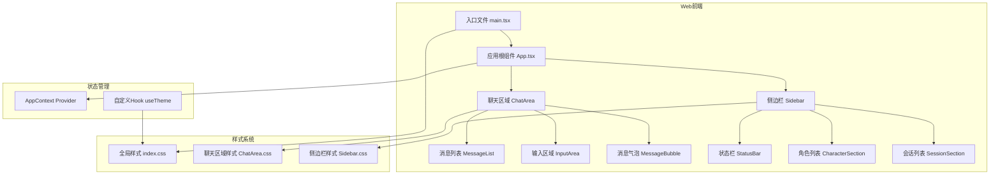
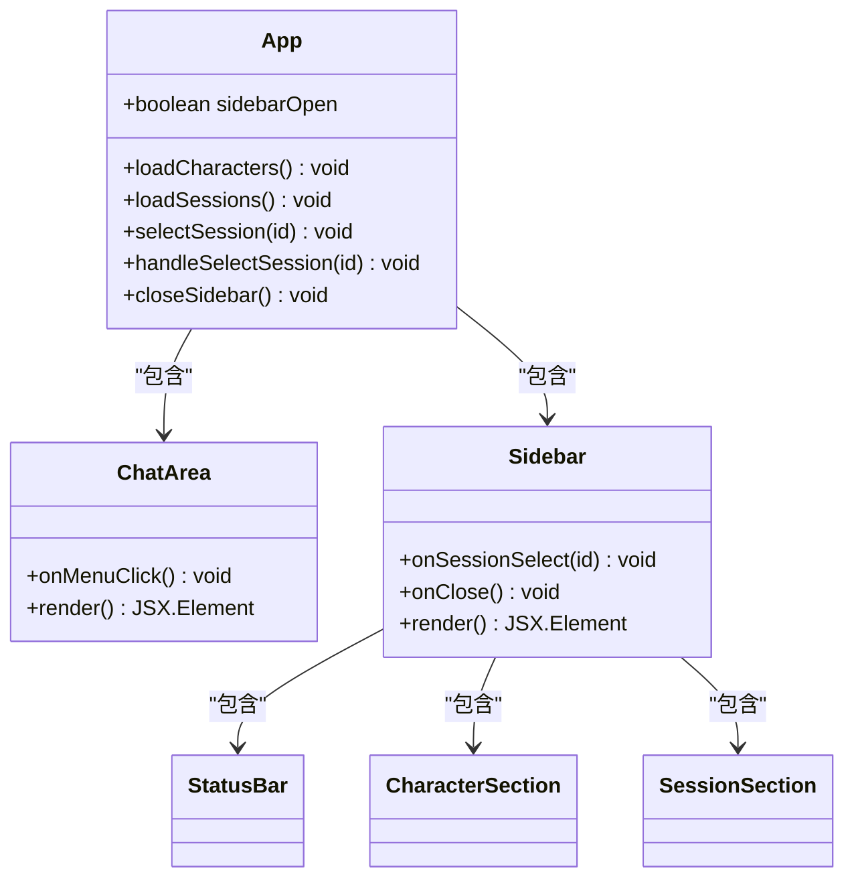
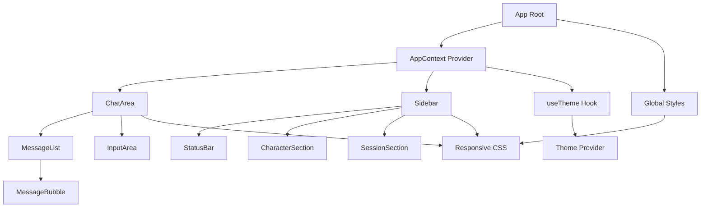
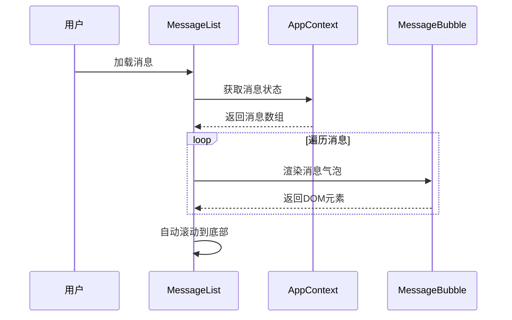
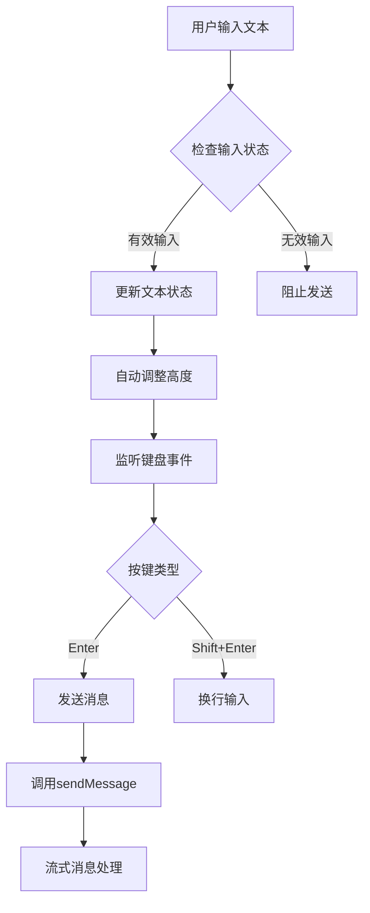
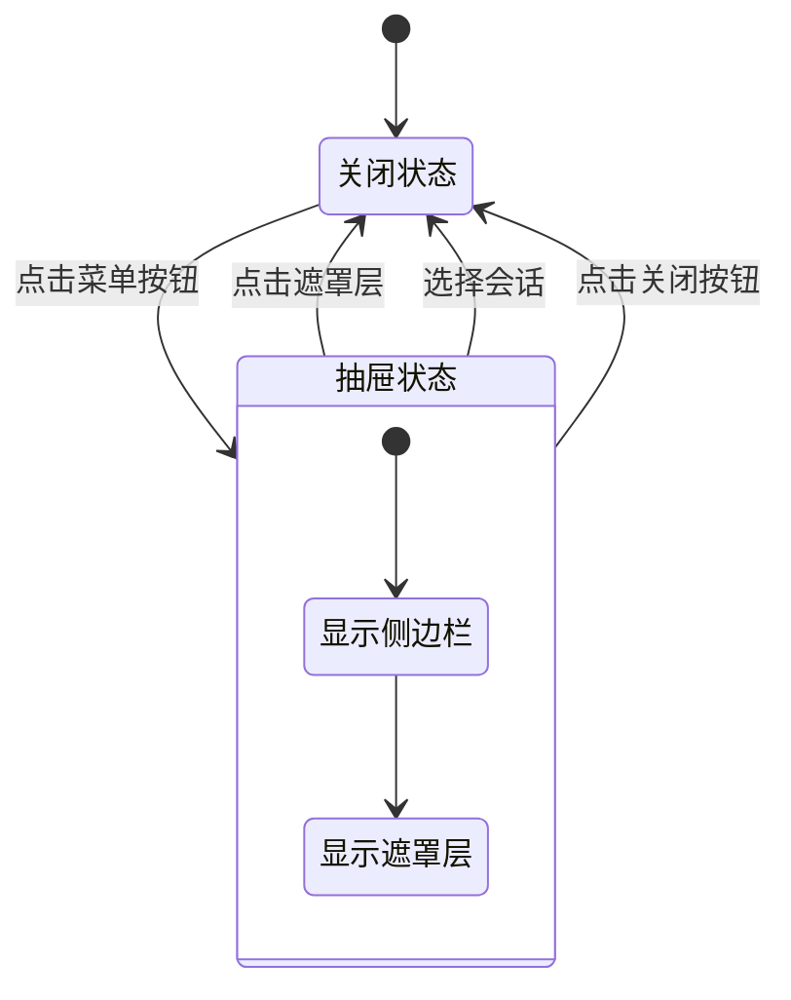
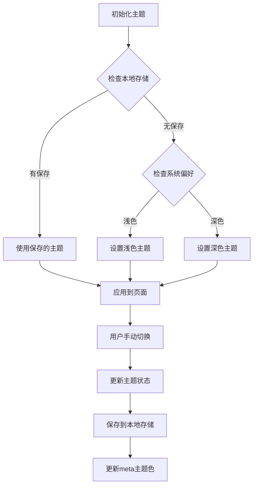

# 移动端响应式设计

<cite>
**本文档引用的文件**
- [web/src/index.css](file://web/src/index.css)
- [web/src/App.tsx](file://web/src/App.tsx)
- [web/src/components/ChatArea/ChatArea.tsx](file://web/src/components/ChatArea/ChatArea.tsx)
- [web/src/components/ChatArea/ChatArea.css](file://web/src/components/ChatArea/ChatArea.css)
- [web/src/components/ChatArea/InputArea.tsx](file://web/src/components/ChatArea/InputArea.tsx)
- [web/src/components/ChatArea/MessageList.tsx](file://web/src/components/ChatArea/MessageList.tsx)
- [web/src/components/ChatArea/MessageBubble.tsx](file://web/src/components/ChatArea/MessageBubble.tsx)
- [web/src/components/Sidebar/Sidebar.tsx](file://web/src/components/Sidebar/Sidebar.tsx)
- [web/src/components/Sidebar/Sidebar.css](file://web/src/components/Sidebar/Sidebar.css)
- [web/src/hooks/useTheme.ts](file://web/src/hooks/useTheme.ts)
- [web/src/context/AppContext.tsx](file://web/src/context/AppContext.tsx)
- [web/vite.config.ts](file://web/vite.config.ts)
- [web/package.json](file://web/package.json)
</cite>

## 目录
1. [简介](#简介)
2. [项目结构](#项目结构)
3. [核心组件](#核心组件)
4. [架构概览](#架构概览)
5. [详细组件分析](#详细组件分析)
6. [依赖关系分析](#依赖关系分析)
7. [性能考虑](#性能考虑)
8. [故障排除指南](#故障排除指南)
9. [结论](#结论)

## 简介

本项目是一个基于React的AI聊天应用，专注于移动端响应式设计。系统采用现代化的前端技术栈，包括React 19、TypeScript、Vite构建工具，并实现了完整的移动端适配方案。

该应用的核心特点是：
- 完整的移动端响应式布局
- 深色/浅色主题切换
- 流式消息传输体验
- 侧边栏抽屉式导航
- 自适应输入区域

## 项目结构

项目采用前后端分离架构，前端位于web目录下，使用React + TypeScript开发：



**图表来源**
- [web/src/main.tsx:1-11](file://web/src/main.tsx#L1-L11)
- [web/src/App.tsx:1-44](file://web/src/App.tsx#L1-L44)
- [web/src/index.css:1-469](file://web/src/index.css#L1-L469)

**章节来源**
- [web/src/main.tsx:1-11](file://web/src/main.tsx#L1-L11)
- [web/src/App.tsx:1-44](file://web/src/App.tsx#L1-L44)
- [web/src/index.css:1-469](file://web/src/index.css#L1-L469)

## 核心组件

### 应用主容器

应用采用Flexbox布局，支持桌面端和移动端两种显示模式：



**图表来源**
- [web/src/App.tsx:8-33](file://web/src/App.tsx#L8-L33)
- [web/src/components/ChatArea/ChatArea.tsx:10-18](file://web/src/components/ChatArea/ChatArea.tsx#L10-L18)
- [web/src/components/Sidebar/Sidebar.tsx:11-22](file://web/src/components/Sidebar/Sidebar.tsx#L11-L22)

### 响应式布局系统

系统实现了完整的移动端适配方案，主要特点包括：

1. **断点设计**：以768px为分界点
2. **布局转换**：桌面端横向布局，移动端纵向布局
3. **侧边栏抽屉**：移动端采用滑入式侧边栏
4. **安全区域适配**：支持刘海屏和底部安全区域

**章节来源**
- [web/src/index.css:356-462](file://web/src/index.css#L356-L462)
- [web/src/App.tsx:27](file://web/src/App.tsx#L27)

## 架构概览

应用采用模块化架构，每个功能区域都是独立的组件：



**图表来源**
- [web/src/context/AppContext.tsx:217-402](file://web/src/context/AppContext.tsx#L217-L402)
- [web/src/hooks/useTheme.ts:27-43](file://web/src/hooks/useTheme.ts#L27-L43)
- [web/src/index.css:356-462](file://web/src/index.css#L356-L462)

## 详细组件分析

### 聊天区域组件

聊天区域是应用的核心交互界面，实现了完整的消息展示和输入功能：

#### 消息列表组件



**图表来源**
- [web/src/components/ChatArea/MessageList.tsx:58-68](file://web/src/components/ChatArea/MessageList.tsx#L58-L68)
- [web/src/context/AppContext.tsx:384-402](file://web/src/context/AppContext.tsx#L384-L402)

#### 输入区域组件

输入区域实现了智能的文本域高度调整和键盘事件处理：



**图表来源**
- [web/src/components/ChatArea/InputArea.tsx:24-36](file://web/src/components/ChatArea/InputArea.tsx#L24-L36)
- [web/src/context/AppContext.tsx:331-370](file://web/src/context/AppContext.tsx#L331-L370)

**章节来源**
- [web/src/components/ChatArea/MessageList.tsx:1-70](file://web/src/components/ChatArea/MessageList.tsx#L1-L70)
- [web/src/components/ChatArea/InputArea.tsx:1-69](file://web/src/components/ChatArea/InputArea.tsx#L1-L69)

### 侧边栏组件

侧边栏在移动端采用抽屉式设计，提供角色管理和会话管理功能：

#### 移动端侧边栏交互流程



**图表来源**
- [web/src/App.tsx:10-22](file://web/src/App.tsx#L10-L22)
- [web/src/index.css:230-245](file://web/src/index.css#L230-L245)

#### 侧边栏内容组织

侧边栏包含三个主要部分：
1. **状态栏**：显示应用连接状态
2. **角色管理**：角色列表和新建角色表单
3. **会话管理**：会话列表和导入功能

**章节来源**
- [web/src/components/Sidebar/Sidebar.tsx:1-23](file://web/src/components/Sidebar/Sidebar.tsx#L1-L23)
- [web/src/components/Sidebar/Sidebar.css:72-429](file://web/src/components/Sidebar/Sidebar.css#L72-L429)

### 主题系统

应用实现了完整的深色/浅色主题切换机制：

#### 主题切换流程



**图表来源**
- [web/src/hooks/useTheme.ts:11-25](file://web/src/hooks/useTheme.ts#L11-L25)
- [web/src/hooks/useTheme.ts:30-43](file://web/src/hooks/useTheme.ts#L30-L43)

**章节来源**
- [web/src/hooks/useTheme.ts:1-44](file://web/src/hooks/useTheme.ts#L1-L44)
- [web/src/index.css:57-87](file://web/src/index.css#L57-L87)

## 依赖关系分析

### 构建配置

项目使用Vite作为构建工具，配置了现代化的优化选项：

```mermaid
graph LR
A[Vite配置] --> B[React插件]
A --> C[别名解析]
A --> D[开发服务器]
A --> E[生产构建]
B --> F[@vitejs/plugin-react]
C --> G[@shared -> shared/]
D --> H[端口5173]
E --> I[ES2020目标]
E --> J[Terser压缩]
E --> K[CSS最小化]
```

**图表来源**
- [web/vite.config.ts:5-43](file://web/vite.config.ts#L5-L43)

### 依赖管理

项目依赖关系简洁明了：

```mermaid
graph TD
A[companion-web] --> B[react ^19.0.0]
A --> C[react-dom ^19.0.0]
A --> D[@vitejs/plugin-react ^4.4.0]
A --> E[typescript ~5.7.0]
A --> F[vite ^6.0.0]
G[开发依赖] --> D
G --> E
G --> F
```

**图表来源**
- [web/package.json:5-21](file://web/package.json#L5-L21)

**章节来源**
- [web/vite.config.ts:1-44](file://web/vite.config.ts#L1-L44)
- [web/package.json:1-22](file://web/package.json#L1-L22)

## 性能考虑

### 响应式性能优化

1. **CSS媒体查询优化**：仅在必要时应用移动端样式
2. **组件懒加载**：大型组件按需加载
3. **虚拟滚动**：长消息列表使用虚拟化技术
4. **图片优化**：使用现代格式和适当的尺寸

### 移动端性能特性

- **触摸友好**：所有交互元素至少44px
- **手势支持**：支持滑动、点击等移动端手势
- **内存管理**：及时清理事件监听器和定时器
- **网络优化**：流式传输减少延迟

## 故障排除指南

### 常见问题及解决方案

#### 响应式布局问题

**症状**：移动端布局异常
**解决方案**：
1. 检查CSS媒体查询是否正确
2. 验证视口元标签配置
3. 确认Flexbox属性设置

#### 主题切换问题

**症状**：主题切换后样式不生效
**解决方案**：
1. 检查localStorage访问权限
2. 验证CSS变量更新
3. 确认meta主题色更新

#### 性能问题

**症状**：页面卡顿或加载缓慢
**解决方案**：
1. 使用浏览器开发者工具分析性能
2. 检查组件重渲染频率
3. 优化CSS动画和过渡效果

**章节来源**
- [web/src/hooks/useTheme.ts:33-35](file://web/src/hooks/useTheme.ts#L33-L35)
- [web/src/index.css:45-51](file://web/src/index.css#L45-L51)

## 结论

该项目在移动端响应式设计方面表现出色，实现了以下关键特性：

1. **完整的移动端适配**：从布局到交互都针对移动设备优化
2. **优雅的主题系统**：深色/浅色主题无缝切换
3. **流畅的用户体验**：流式消息传输和即时反馈
4. **现代化的技术栈**：使用最新的React和TypeScript特性
5. **良好的可维护性**：模块化架构和清晰的组件分离

通过合理的架构设计和响应式策略，该应用为用户提供了优秀的跨平台聊天体验，特别是在移动设备上的表现尤为突出。