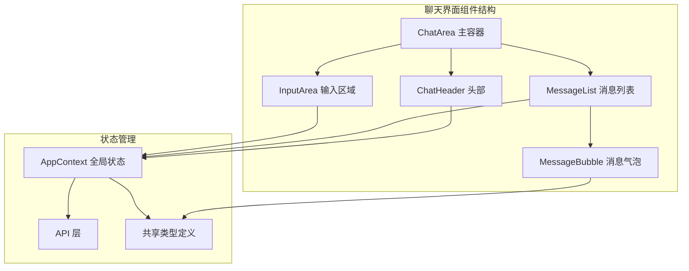
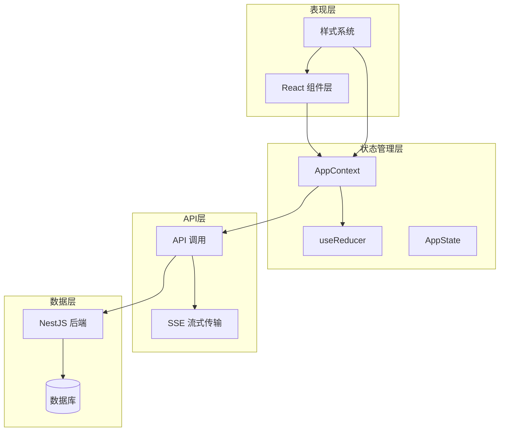
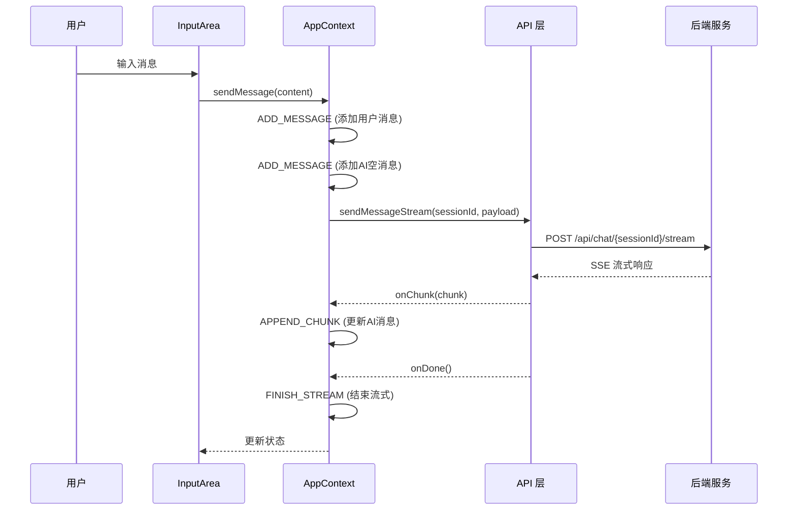
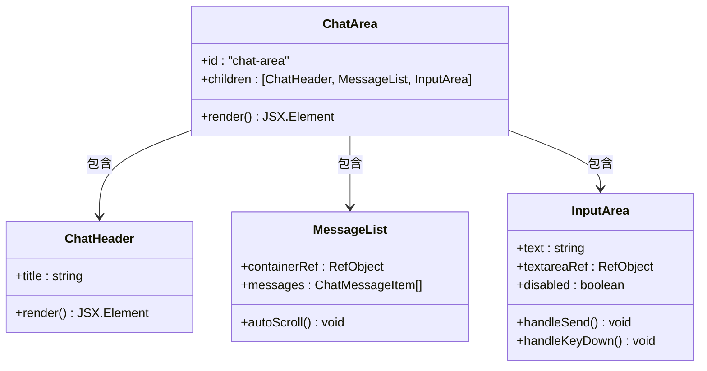
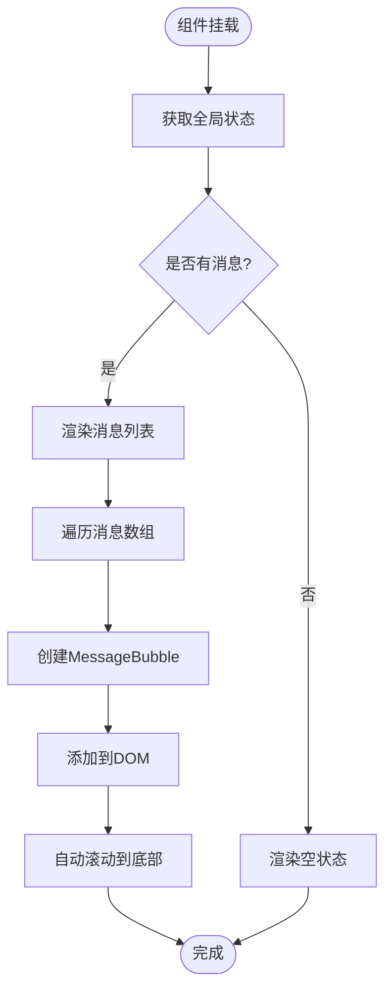
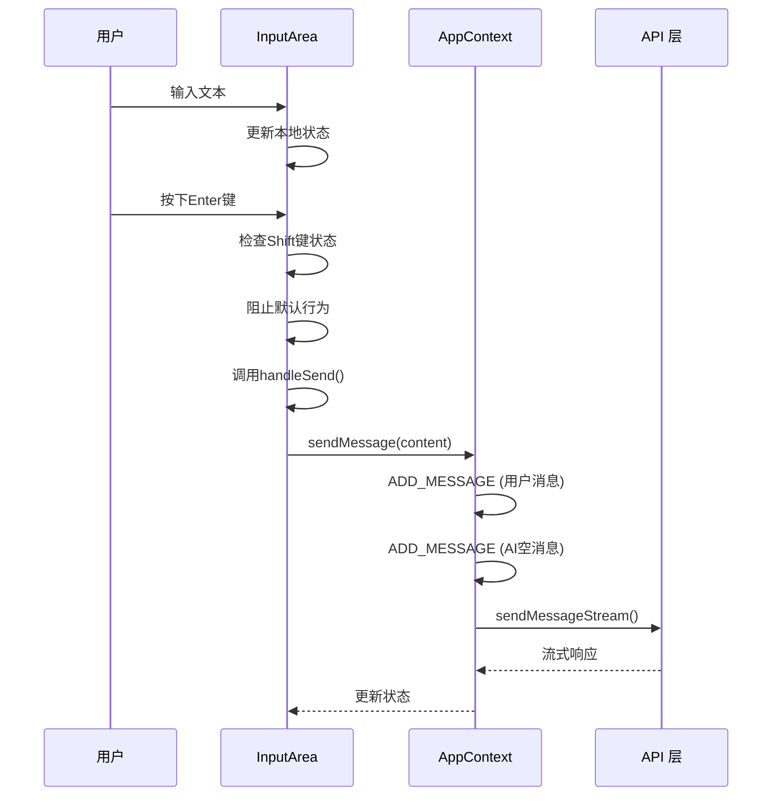
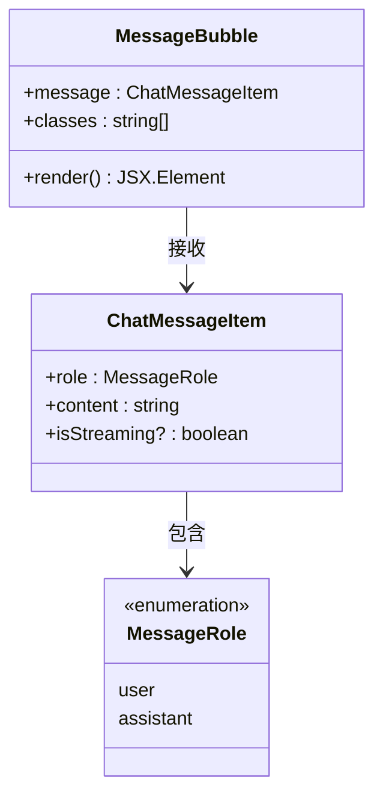
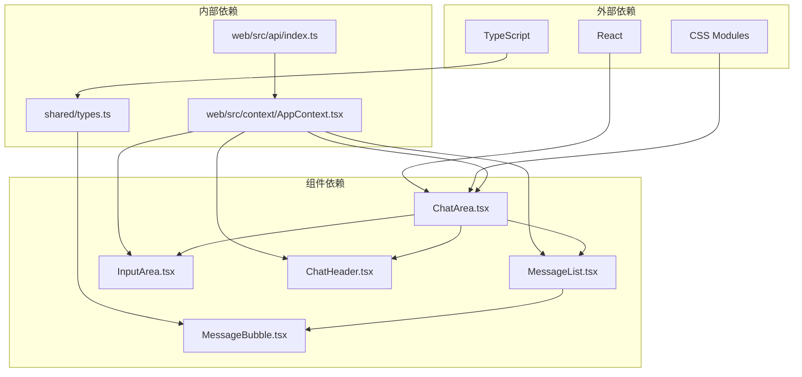

# 聊天界面组件

<cite>
**本文档引用的文件**
- [ChatArea.tsx](file://web/src/components/ChatArea/ChatArea.tsx)
- [MessageList.tsx](file://web/src/components/ChatArea/MessageList.tsx)
- [InputArea.tsx](file://web/src/components/ChatArea/InputArea.tsx)
- [ChatHeader.tsx](file://web/src/components/ChatArea/ChatHeader.tsx)
- [MessageBubble.tsx](file://web/src/components/ChatArea/MessageBubble.tsx)
- [ChatArea.css](file://web/src/components/ChatArea/ChatArea.css)
- [AppContext.tsx](file://web/src/context/AppContext.tsx)
- [types.ts](file://shared/types.ts)
- [index.ts](file://web/src/api/index.ts)
- [index.css](file://web/src/index.css)
- [main.tsx](file://web/src/main.tsx)
</cite>

## 目录
1. [简介](#简介)
2. [项目结构](#项目结构)
3. [核心组件](#核心组件)
4. [架构概览](#架构概览)
5. [详细组件分析](#详细组件分析)
6. [依赖关系分析](#依赖关系分析)
7. [性能考虑](#性能考虑)
8. [故障排除指南](#故障排除指南)
9. [结论](#结论)

## 简介

AI Companion聊天界面组件是一个基于React构建的现代化聊天应用界面，采用Glassmorphism设计风格和渐变色彩系统。该组件系统提供了完整的聊天体验，包括消息显示、实时输入、角色切换和会话管理等功能。

系统采用Context + useReducer的状态管理模式，实现了全局状态管理与组件解耦。整体设计注重用户体验，提供了流畅的动画效果和响应式布局。

## 项目结构

聊天界面组件位于Web前端项目的组件目录中，采用模块化设计，每个组件都有独立的文件和样式文件。

**图表来源**
- [ChatArea.tsx:1-15](file://web/src/components/ChatArea/ChatArea.tsx#L1-L15)
- [AppContext.tsx:1-384](file://web/src/context/AppContext.tsx#L1-L384)

**章节来源**
- [ChatArea.tsx:1-15](file://web/src/components/ChatArea/ChatArea.tsx#L1-L15)
- [main.tsx:1-11](file://web/src/main.tsx#L1-L11)

## 核心组件

聊天界面系统由五个核心组件构成，每个组件都有明确的职责分工：

### ChatArea 主容器组件
作为整个聊天界面的根组件，负责协调各个子组件的布局和数据传递。采用flex布局实现垂直方向的自适应排列。

### MessageList 消息列表组件
负责渲染所有聊天消息，实现自动滚动到最新消息的功能，并处理消息的动态更新。

### InputArea 输入区域组件
提供用户输入功能，支持多行文本输入、快捷键操作和发送逻辑。

### ChatHeader 头部组件
显示当前会话信息，提供简洁的标题展示。

### MessageBubble 消息气泡组件
渲染单个消息气泡，根据消息类型和状态应用不同的样式。

**章节来源**
- [ChatArea.tsx:1-15](file://web/src/components/ChatArea/ChatArea.tsx#L1-L15)
- [MessageList.tsx:1-24](file://web/src/components/ChatArea/MessageList.tsx#L1-L24)
- [InputArea.tsx:1-50](file://web/src/components/ChatArea/InputArea.tsx#L1-L50)
- [ChatHeader.tsx:1-16](file://web/src/components/ChatArea/ChatHeader.tsx#L1-L16)
- [MessageBubble.tsx:1-18](file://web/src/components/ChatArea/MessageBubble.tsx#L1-L18)

## 架构概览

系统采用分层架构设计，从上到下分为表现层、状态管理层、API层和数据层。

**图表来源**
- [AppContext.tsx:1-384](file://web/src/context/AppContext.tsx#L1-L384)
- [index.ts:1-212](file://web/src/api/index.ts#L1-L212)

### 状态管理架构

**图表来源**
- [InputArea.tsx:18-29](file://web/src/components/ChatArea/InputArea.tsx#L18-L29)
- [AppContext.tsx:310-350](file://web/src/context/AppContext.tsx#L310-L350)
- [index.ts:137-201](file://web/src/api/index.ts#L137-L201)

**章节来源**
- [AppContext.tsx:1-384](file://web/src/context/AppContext.tsx#L1-L384)
- [index.ts:1-212](file://web/src/api/index.ts#L1-L212)

## 详细组件分析

### ChatArea 主容器组件

ChatArea是整个聊天界面的根组件，采用简洁的结构设计，负责协调各个子组件的工作。

**图表来源**
- [ChatArea.tsx:6-14](file://web/src/components/ChatArea/ChatArea.tsx#L6-L14)
- [ChatHeader.tsx:3-15](file://web/src/components/ChatArea/ChatHeader.tsx#L3-L15)
- [MessageList.tsx:5-23](file://web/src/components/ChatArea/MessageList.tsx#L5-L23)
- [InputArea.tsx:4-49](file://web/src/components/ChatArea/InputArea.tsx#L4-L49)

#### 布局协调机制
- 采用flex布局实现垂直方向的自适应排列
- 使用CSS变量实现主题色的一致性
- 支持响应式设计，在移动设备上调整布局

**章节来源**
- [ChatArea.tsx:1-15](file://web/src/components/ChatArea/ChatArea.tsx#L1-L15)
- [ChatArea.css:6-13](file://web/src/components/ChatArea/ChatArea.css#L6-L13)

### MessageList 消息列表组件

MessageList负责渲染所有聊天消息，实现了智能的滚动控制和实时更新机制。

**图表来源**
- [MessageList.tsx:5-23](file://web/src/components/ChatArea/MessageList.tsx#L5-L23)

#### 滚动控制机制
- 使用useEffect监听消息变化
- 通过scrollTop属性实现自动滚动
- 优化滚动性能，避免不必要的重排

#### 实时更新机制
- 基于React状态驱动的重新渲染
- 消息数组变化触发组件更新
- 保持滚动位置在最新消息处

**章节来源**
- [MessageList.tsx:1-24](file://web/src/components/ChatArea/MessageList.tsx#L1-L24)

### InputArea 输入区域组件

InputArea提供了完整的消息输入功能，支持多种交互方式和快捷键操作。

**图表来源**
- [InputArea.tsx:18-30](file://web/src/components/ChatArea/InputArea.tsx#L18-L30)
- [AppContext.tsx:310-350](file://web/src/context/AppContext.tsx#L310-L350)

#### 文本输入处理
- 使用受控组件模式管理输入状态
- 支持多行文本输入和自动高度调整
- 实现输入验证和清理功能

#### 快捷键处理
- Enter键发送消息（Shift+Enter换行）
- 阻止默认的表单提交行为
- 提供清晰的键盘导航体验

#### 发送逻辑
- 禁用状态下阻止发送操作
- 清空输入框内容
- 调用全局状态管理器处理消息发送

**章节来源**
- [InputArea.tsx:1-50](file://web/src/components/ChatArea/InputArea.tsx#L1-L50)

### ChatHeader 头部组件

ChatHeader提供简洁的会话信息展示，根据当前状态动态更新标题。

#### 标题生成逻辑
- 当存在当前会话时显示会话ID前缀
- 当无会话时提示用户选择会话
- 使用简洁的字体和颜色设计

**章节来源**
- [ChatHeader.tsx:1-16](file://web/src/components/ChatArea/ChatHeader.tsx#L1-L16)

### MessageBubble 消息气泡组件

MessageBubble负责渲染单个消息气泡，实现了丰富的样式系统和状态指示。

**图表来源**
- [MessageBubble.tsx:3-17](file://web/src/components/ChatArea/MessageBubble.tsx#L3-L17)
- [types.ts:161-165](file://shared/types.ts#L161-L165)

#### 样式系统设计
- 基于CSS类名的动态样式组合
- 支持用户消息和助手消息的不同样式
- 实现流式状态的视觉指示

#### 交互效果
- 消息出现的淡入动画
- 流式消息的脉冲指示器
- 错误状态的特殊样式

**章节来源**
- [MessageBubble.tsx:1-18](file://web/src/components/ChatArea/MessageBubble.tsx#L1-L18)

## 依赖关系分析

聊天界面组件系统具有清晰的依赖层次结构，各组件之间的耦合度较低，便于维护和扩展。

**图表来源**
- [types.ts:1-166](file://shared/types.ts#L1-L166)
- [AppContext.tsx:1-384](file://web/src/context/AppContext.tsx#L1-L384)
- [index.ts:1-212](file://web/src/api/index.ts#L1-L212)

### 组件间通信机制

系统采用单向数据流模式，通过全局状态管理器实现组件间的数据传递：

1. **父组件到子组件**：通过props传递状态和回调函数
2. **子组件到父组件**：通过回调函数向上级传递事件
3. **全局状态共享**：通过Context提供全局状态访问

### 类型安全保证

系统使用TypeScript确保类型安全，共享类型定义位于独立的文件中，便于跨平台复用。

**章节来源**
- [types.ts:1-166](file://shared/types.ts#L1-L166)
- [AppContext.tsx:8-10](file://web/src/context/AppContext.tsx#L8-L10)

## 性能考虑

聊天界面组件系统在设计时充分考虑了性能优化，采用了多种策略来提升用户体验。

### 渲染优化
- 使用React.memo避免不必要的重新渲染
- 通过key属性优化列表渲染性能
- 实现虚拟滚动以处理大量消息的情况

### 状态管理优化
- 使用useCallback缓存回调函数
- 通过useReducer优化复杂状态更新
- 实现状态选择器减少订阅范围

### 网络请求优化
- 实现请求去重和取消机制
- 使用AbortController处理请求中断
- 优化SSE流式传输的内存使用

### 内存管理
- 及时清理事件监听器和定时器
- 实现组件卸载时的资源回收
- 优化大对象的内存占用

## 故障排除指南

### 常见问题及解决方案

#### 消息无法发送
1. **检查会话状态**：确认currentSessionId是否有效
2. **验证输入内容**：确保消息内容非空且未被禁用
3. **检查网络连接**：确认API请求能够正常到达后端

#### 消息不显示或显示异常
1. **检查消息数组**：确认messages状态正确更新
2. **验证消息类型**：确保role字段值为有效的枚举值
3. **检查CSS样式**：确认相关CSS类名正确应用

#### 滚动位置异常
1. **检查ref引用**：确认containerRef正确绑定到DOM元素
2. **验证滚动逻辑**：确认useEffect依赖项正确配置
3. **检查容器高度**：确保消息容器有正确的高度

#### 流式响应问题
1. **检查SSE连接**：确认服务器端SSE服务正常运行
2. **验证回调函数**：确保onChunk、onDone回调正确实现
3. **处理中断情况**：确认AbortController正确使用

**章节来源**
- [InputArea.tsx:9-23](file://web/src/components/ChatArea/InputArea.tsx#L9-L23)
- [MessageList.tsx:10-14](file://web/src/components/ChatArea/MessageList.tsx#L10-L14)
- [AppContext.tsx:331-347](file://web/src/context/AppContext.tsx#L331-L347)

## 结论

AI Companion聊天界面组件系统展现了现代React应用的最佳实践，通过合理的架构设计和组件划分，实现了高内聚、低耦合的系统结构。

### 设计优势
- **模块化设计**：每个组件职责明确，易于维护和测试
- **状态管理**：采用Context + useReducer模式，状态集中管理
- **类型安全**：完整的TypeScript类型定义，编译期错误检测
- **性能优化**：多种优化策略确保流畅的用户体验
- **响应式设计**：适配不同设备尺寸的屏幕

### 技术亮点
- **流式传输**：SSE实现的实时消息传输
- **动画效果**：CSS动画和过渡效果提升用户体验
- **主题系统**：CSS变量实现的可定制主题
- **无障碍设计**：符合Web标准的可访问性支持

该组件系统为构建复杂的聊天应用提供了坚实的基础，其设计理念和实现方式值得在类似项目中借鉴和参考。