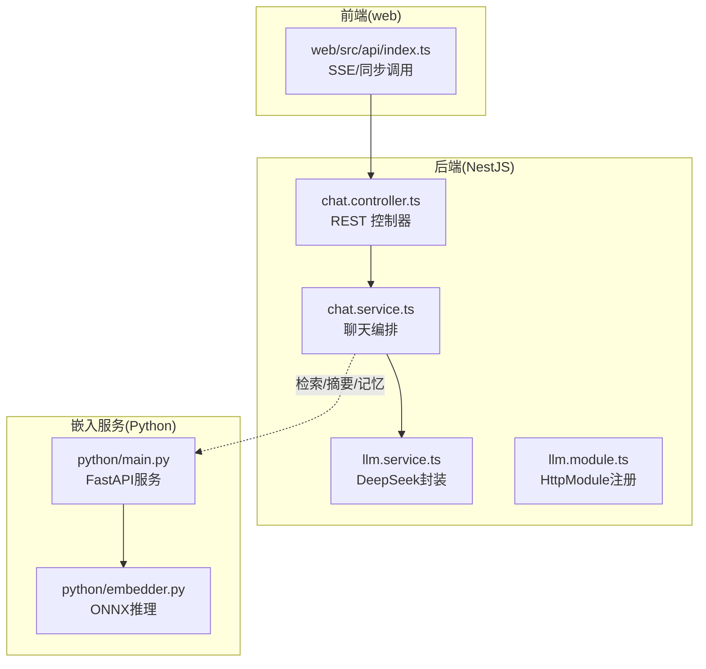
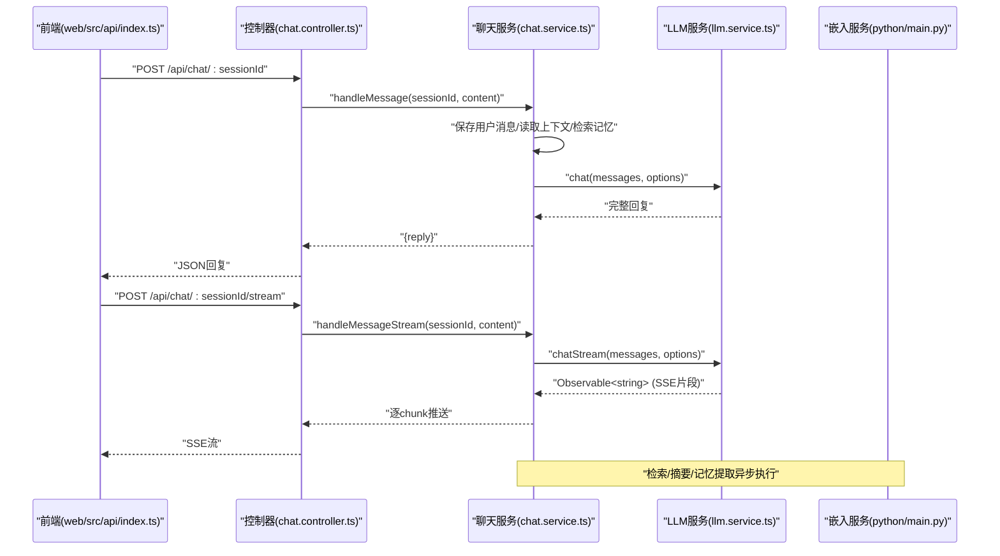
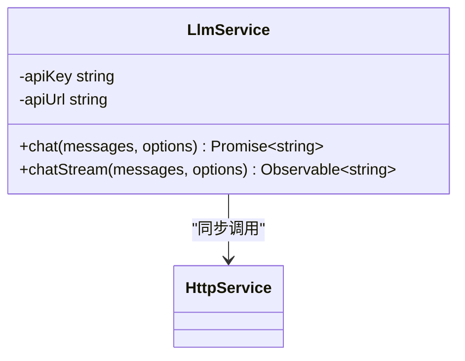
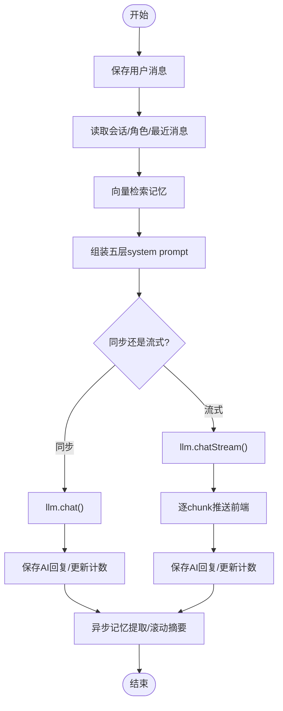
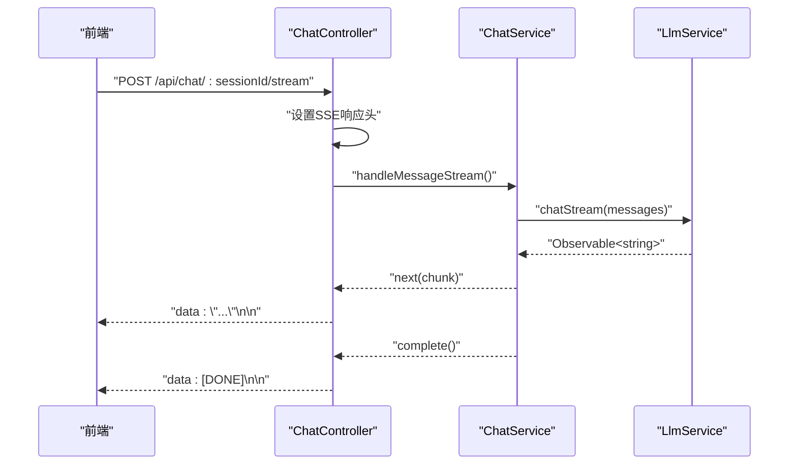
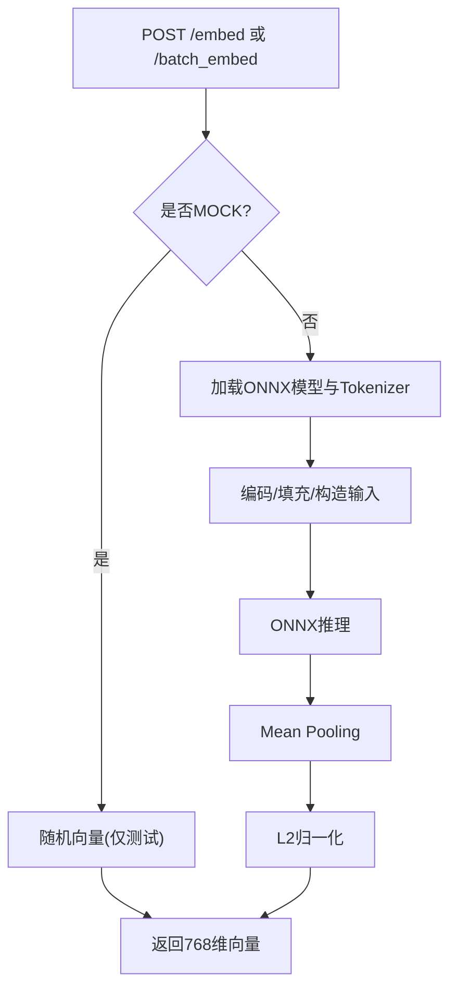
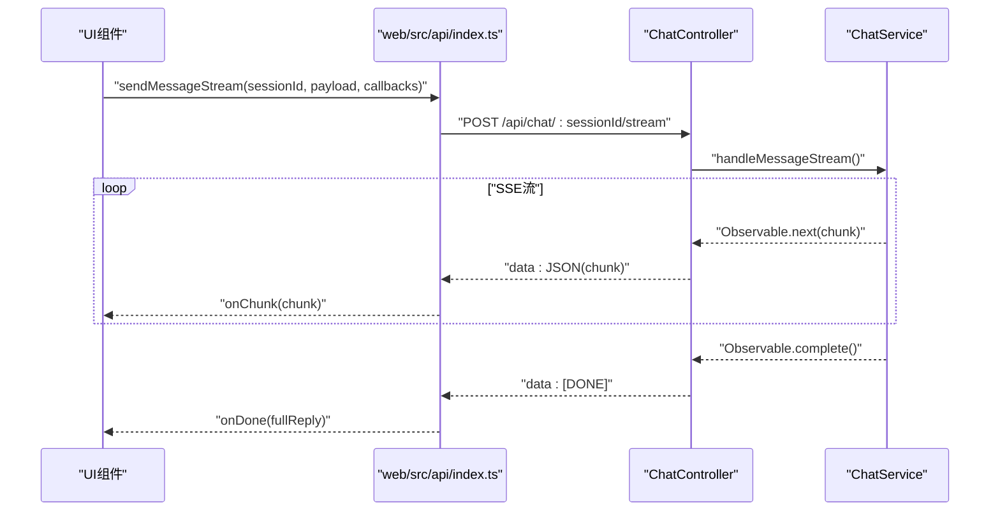
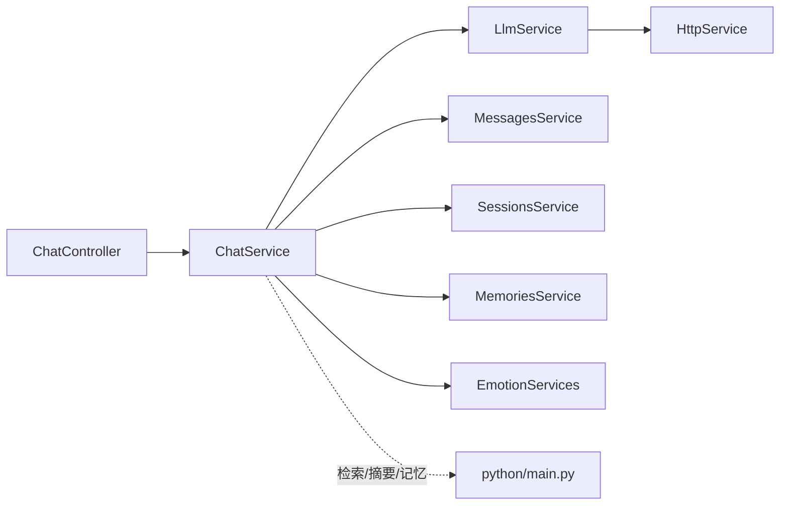

# LLM推理服务

<cite>
**本文引用的文件**
- [llm.service.ts](file://src/llm/llm.service.ts)
- [llm.module.ts](file://src/llm/llm.module.ts)
- [types.ts](file://shared/types.ts)
- [chat.service.ts](file://src/chat/chat.service.ts)
- [chat.controller.ts](file://src/chat/chat.controller.ts)
- [index.ts](file://web/src/api/index.ts)
- [main.py](file://python/main.py)
- [embedder.py](file://python/embedder.py)
- [test_chat.js](file://test_chat.js)
</cite>

## 目录
1. [简介](#简介)
2. [项目结构](#项目结构)
3. [核心组件](#核心组件)
4. [架构总览](#架构总览)
5. [详细组件分析](#详细组件分析)
6. [依赖分析](#依赖分析)
7. [性能考虑](#性能考虑)
8. [故障排查指南](#故障排查指南)
9. [结论](#结论)
10. [附录](#附录)

## 简介
本文件面向AI Companion项目的LLM推理服务，系统性阐述基于DeepSeek API的集成与请求处理机制，覆盖提示工程、参数配置、响应解析、流式SSE实现、错误处理与重试策略、性能优化、API配置与调用示例等内容。文档同时给出前后端交互序列图、流式处理流程图与类图，帮助开发者快速理解与扩展。

## 项目结构
- 后端采用NestJS，LLM服务位于src/llm，聊天编排位于src/chat，共享类型定义位于shared/types.ts。
- 前端调用层位于web/src/api/index.ts，提供同步与SSE流式接口。
- 向量化服务位于python/，提供Embedding能力，供记忆检索使用。
- 测试脚本位于test_chat.js，演示端到端调用流程。

图表来源
- [chat.controller.ts:16-76](file://src/chat/chat.controller.ts#L16-L76)
- [chat.service.ts:29-113](file://src/chat/chat.service.ts#L29-L113)
- [llm.service.ts:26-33](file://src/llm/llm.service.ts#L26-L33)
- [llm.module.ts:5-15](file://src/llm/llm.module.ts#L5-L15)
- [index.ts:137-201](file://web/src/api/index.ts#L137-L201)
- [main.py:26-122](file://python/main.py#L26-L122)
- [embedder.py:31-116](file://python/embedder.py#L31-L116)

章节来源
- [chat.controller.ts:16-76](file://src/chat/chat.controller.ts#L16-L76)
- [chat.service.ts:29-113](file://src/chat/chat.service.ts#L29-L113)
- [llm.service.ts:26-33](file://src/llm/llm.service.ts#L26-L33)
- [llm.module.ts:5-15](file://src/llm/llm.module.ts#L5-L15)
- [index.ts:137-201](file://web/src/api/index.ts#L137-L201)
- [main.py:26-122](file://python/main.py#L26-L122)
- [embedder.py:31-116](file://python/embedder.py#L31-L116)

## 核心组件
- LLM服务（DeepSeek封装）：提供同步与流式两种调用模式，封装HTTP请求、SSE解析与错误传播。
- 聊天服务：负责消息持久化、上下文组装、向量检索、滚动摘要、异步记忆提取、情绪与语境注入。
- 聊天控制器：暴露REST端点，支持同步与SSE流式。
- 嵌入服务：提供单条与批量文本向量化，支撑记忆检索。
- 前端API层：统一封装fetch请求，提供SSE流式回调与错误处理。

章节来源
- [llm.service.ts:26-57](file://src/llm/llm.service.ts#L26-L57)
- [llm.service.ts:70-145](file://src/llm/llm.service.ts#L70-L145)
- [chat.service.ts:42-113](file://src/chat/chat.service.ts#L42-L113)
- [chat.controller.ts:21-75](file://src/chat/chat.controller.ts#L21-L75)
- [main.py:91-122](file://python/main.py#L91-L122)
- [index.ts:137-201](file://web/src/api/index.ts#L137-L201)

## 架构总览
下图展示从Web前端到后端控制器、聊天编排、LLM服务以及嵌入服务的整体调用链路与数据流。

图表来源
- [index.ts:137-201](file://web/src/api/index.ts#L137-L201)
- [chat.controller.ts:21-75](file://src/chat/chat.controller.ts#L21-L75)
- [chat.service.ts:42-113](file://src/chat/chat.service.ts#L42-L113)
- [chat.service.ts:130-231](file://src/chat/chat.service.ts#L130-L231)
- [llm.service.ts:36-57](file://src/llm/llm.service.ts#L36-L57)
- [llm.service.ts:70-145](file://src/llm/llm.service.ts#L70-L145)
- [main.py:91-122](file://python/main.py#L91-L122)

## 详细组件分析

### LLM服务（DeepSeek封装）
- 同步模式：通过NestJS的HttpService发起POST请求，等待完整响应后解析choices[0].message.content。
- 流式模式：使用Node内置https.request直连DeepSeek，接收text/event-stream，按行解析"data: ..."，提取choices[0].delta.content，遇到"[DONE]"完成流。
- 关键参数：model、temperature、max_tokens，默认值在服务内设定；通过LlmOptions可覆盖。
- 认证：从环境变量读取DEEPSEEK_API_KEY，添加Authorization头。
- 超时：HttpService请求带timeout；流式请求使用原生https.request的超时控制。

图表来源
- [llm.service.ts:26-33](file://src/llm/llm.service.ts#L26-L33)
- [llm.service.ts:36-57](file://src/llm/llm.service.ts#L36-L57)
- [llm.service.ts:70-145](file://src/llm/llm.service.ts#L70-L145)

章节来源
- [llm.service.ts:26-57](file://src/llm/llm.service.ts#L26-L57)
- [llm.service.ts:70-145](file://src/llm/llm.service.ts#L70-L145)
- [llm.module.ts:5-15](file://src/llm/llm.module.ts#L5-L15)

### 聊天服务（提示工程与编排）
- 同步对话：保存用户消息→读取上下文→向量检索记忆→组装system prompt→调LLM→保存AI回复→更新消息计数→返回reply。
- 流式对话：与同步类似，但将LLM调用改为chatStream，逐chunk推送到前端，完成后进行清理、保存与异步任务。
- 提示工程：分五层构建system prompt（固定人格→滚动摘要→导入画像→动态记忆→严格规则），并注入用户情绪与AI情绪状态。
- 异步任务：记忆提取（事实/偏好/情绪）与滚动摘要（每50条消息且超过1小时）。

图表来源
- [chat.service.ts:42-113](file://src/chat/chat.service.ts#L42-L113)
- [chat.service.ts:130-231](file://src/chat/chat.service.ts#L130-L231)
- [chat.service.ts:249-315](file://src/chat/chat.service.ts#L249-L315)
- [chat.service.ts:334-374](file://src/chat/chat.service.ts#L334-L374)
- [chat.service.ts:424-497](file://src/chat/chat.service.ts#L424-L497)

章节来源
- [chat.service.ts:42-113](file://src/chat/chat.service.ts#L42-L113)
- [chat.service.ts:130-231](file://src/chat/chat.service.ts#L130-L231)
- [chat.service.ts:249-315](file://src/chat/chat.service.ts#L249-L315)
- [chat.service.ts:334-374](file://src/chat/chat.service.ts#L334-L374)
- [chat.service.ts:424-497](file://src/chat/chat.service.ts#L424-L497)

### 聊天控制器（REST与SSE）
- 同步端点：POST /api/chat/:sessionId，直接返回完整回复。
- 流式端点：POST /api/chat/:sessionId/stream，设置SSE响应头，逐chunk写入"data: ..."，结束时发送"[DONE]"。
- 前端示例：控制器注释提供了fetch + ReadableStream的SSE消费示例。

图表来源
- [chat.controller.ts:46-75](file://src/chat/chat.controller.ts#L46-L75)
- [chat.service.ts:130-231](file://src/chat/chat.service.ts#L130-L231)
- [llm.service.ts:70-145](file://src/llm/llm.service.ts#L70-L145)

章节来源
- [chat.controller.ts:21-75](file://src/chat/chat.controller.ts#L21-L75)

### 嵌入服务（向量化）
- FastAPI提供/embed与/batch_embed两个端点，返回768维向量。
- 支持MOCK模式：当未配置真实模型时，使用随机向量保障流程可用。
- ONNXRuntime推理：加载Jina v2中文模型，Tokenizer编码，mean pooling后归一化。

图表来源
- [main.py:91-122](file://python/main.py#L91-L122)
- [embedder.py:31-116](file://python/embedder.py#L31-L116)

章节来源
- [main.py:26-122](file://python/main.py#L26-L122)
- [embedder.py:31-116](file://python/embedder.py#L31-L116)

### 前端API层（SSE与同步）
- 同步：request()封装fetch，校验HTTP状态并抛出ApiError。
- 流式：sendMessageStream()使用ReadableStream读取SSE，按行解析"data: ..."，累积fullReply，遇到"[DONE]"触发onDone。

图表来源
- [index.ts:137-201](file://web/src/api/index.ts#L137-L201)
- [chat.controller.ts:46-75](file://src/chat/chat.controller.ts#L46-L75)
- [chat.service.ts:130-231](file://src/chat/chat.service.ts#L130-L231)

章节来源
- [index.ts:37-52](file://web/src/api/index.ts#L37-L52)
- [index.ts:137-201](file://web/src/api/index.ts#L137-L201)

## 依赖分析
- LlmService依赖NestJS的HttpService（同步）与Node原生https（流式）。
- ChatService依赖LlmService、消息/会话/记忆服务、情绪与语境服务。
- ChatController依赖ChatService，暴露REST与SSE端点。
- 嵌入服务独立于后端，通过HTTP提供向量化能力。

图表来源
- [chat.controller.ts:17-18](file://src/chat/chat.controller.ts#L17-L18)
- [chat.service.ts:31-40](file://src/chat/chat.service.ts#L31-L40)
- [llm.service.ts:26-33](file://src/llm/llm.service.ts#L26-L33)
- [main.py:91-122](file://python/main.py#L91-L122)

章节来源
- [chat.controller.ts:17-18](file://src/chat/chat.controller.ts#L17-L18)
- [chat.service.ts:31-40](file://src/chat/chat.service.ts#L31-L40)
- [llm.service.ts:26-33](file://src/llm/llm.service.ts#L26-L33)
- [main.py:91-122](file://python/main.py#L91-L122)

## 性能考虑
- 连接与超时
  - HttpModule全局timeout与最大重定向配置，减少慢请求堆积。
  - 流式请求使用原生https.request超时控制，避免长时间挂起。
- 并发与资源
  - 流式场景使用Observable与背压，前端逐chunk消费，降低内存峰值。
  - 异步任务（记忆提取、滚动摘要）使用setImmediate，不阻塞主线程。
- 缓存与预热
  - 嵌入服务支持MOCK模式，便于开发阶段验证；生产建议提前下载ONNX模型并预热。
- 网络与限流
  - 建议在网关或代理层配置合理的超时、重试与限流策略，避免级联故障。
- 日志与可观测性
  - 在关键步骤（检索、摘要、记忆提取）输出日志，便于定位性能瓶颈。

章节来源
- [llm.module.ts:7-10](file://src/llm/llm.module.ts#L7-L10)
- [chat.service.ts:103-110](file://src/chat/chat.service.ts#L103-L110)
- [chat.service.ts:212-221](file://src/chat/chat.service.ts#L212-L221)
- [main.py:34-70](file://python/main.py#L34-L70)

## 故障排查指南
- 常见错误与处理
  - 认证失败：确认DEEPSEEK_API_KEY已正确设置。
  - 网络超时：检查代理/防火墙，适当增大超时；必要时启用重试。
  - SSE解析异常：前端按行解析"data: ..."，若出现非JSON行需忽略；确保后端正确发送"[DONE]"。
  - 嵌入服务不可用：确认Python服务已启动且端口正确；MOCK模式仅用于开发验证。
- 重试策略
  - 后端：对非幂等请求谨慎重试；对幂等请求可在网关层配置指数退避重试。
  - 前端：SSE断开后可重新建立连接；对HTTP错误弹窗提示并允许用户重试。
- 调试技巧
  - 使用test_chat.js进行端到端验证，观察角色创建、会话创建与两轮对话。
  - 在浏览器Network面板查看SSE流，确认headers与chunk格式。
  - 在后端日志中关注“[Memory]”“[Summarize]”等标记，判断异步任务是否执行。

章节来源
- [llm.service.ts:133-135](file://src/llm/llm.service.ts#L133-L135)
- [index.ts:194-198](file://web/src/api/index.ts#L194-L198)
- [test_chat.js:65-129](file://test_chat.js#L65-L129)

## 结论
本LLM推理服务以NestJS为核心，结合DeepSeek API与自研嵌入服务，实现了从提示工程到流式响应的完整闭环。通过清晰的模块划分与异步编排，系统在保证用户体验的同时兼顾了可维护性与扩展性。后续可在网关层引入更完善的限流与重试、增强日志与指标采集，并对嵌入模型进行进一步优化以提升检索效率。

## 附录

### API配置指南
- 环境变量
  - DEEPSEEK_API_KEY：DeepSeek API密钥
  - EMBEDDING_MODEL_PATH / EMBEDDING_TOKENIZER_PATH：嵌入模型与Tokenizer路径（可选）
  - EMBEDDING_MAX_LENGTH：最大序列长度（默认512）
  - MOCK_EMBEDDING：1启用MOCK模式（仅测试）
- 参数调优
  - temperature：0.3~0.8之间平衡创造性与稳定性；记忆提取建议更低温度
  - max_tokens：依据回复长度需求调整，注意成本与延迟
  - model：默认deepseek-chat，可按需切换
- 监控指标
  - LLM调用耗时、成功率、错误类型分布
  - SSE流延迟、断流次数、重连次数
  - 嵌入服务响应时间、维度一致性

章节来源
- [llm.service.ts:28-33](file://src/llm/llm.service.ts#L28-L33)
- [embedder.py:26-28](file://python/embedder.py#L26-L28)
- [main.py:34-70](file://python/main.py#L34-L70)

### 实际调用示例
- 同步对话
  - 发送：POST /api/chat/{sessionId}
  - 返回：{ reply: "..." }
- 流式对话（SSE）
  - 发送：POST /api/chat/{sessionId}/stream
  - 前端逐chunk消费，结束时收到"data: [DONE]"
- 端到端测试
  - 使用test_chat.js创建角色与会话，执行多轮对话并等待异步任务完成

章节来源
- [chat.controller.ts:21-75](file://src/chat/chat.controller.ts#L21-L75)
- [index.ts:137-201](file://web/src/api/index.ts#L137-L201)
- [test_chat.js:65-129](file://test_chat.js#L65-L129)