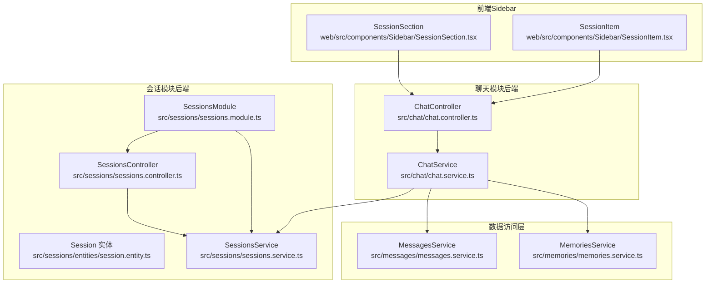
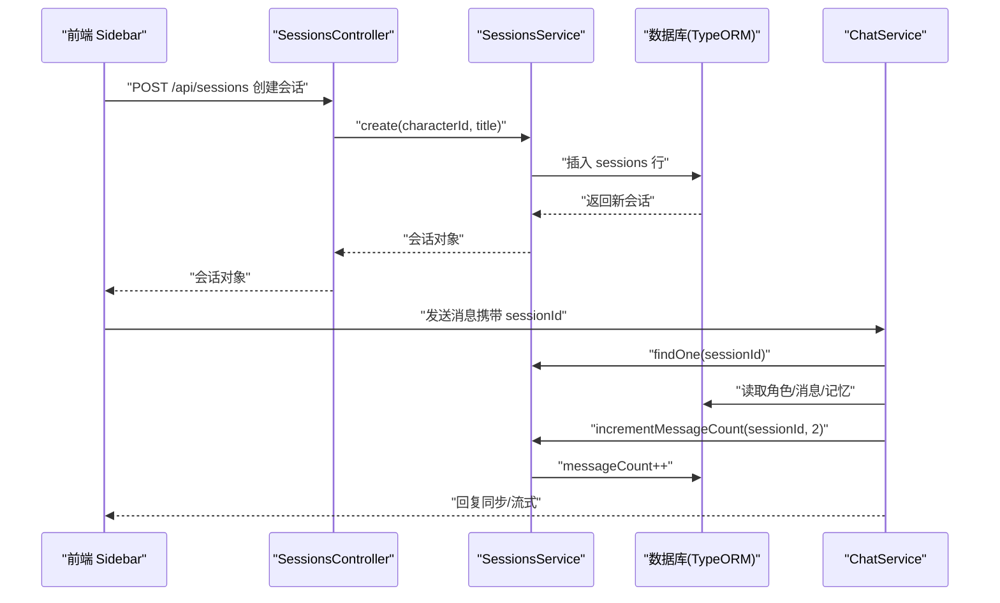
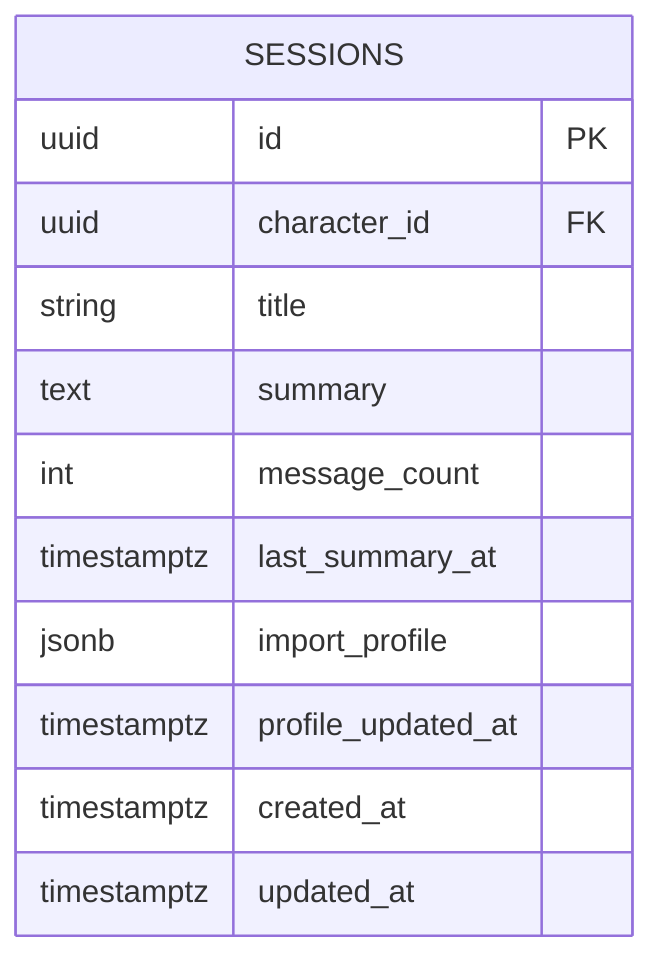
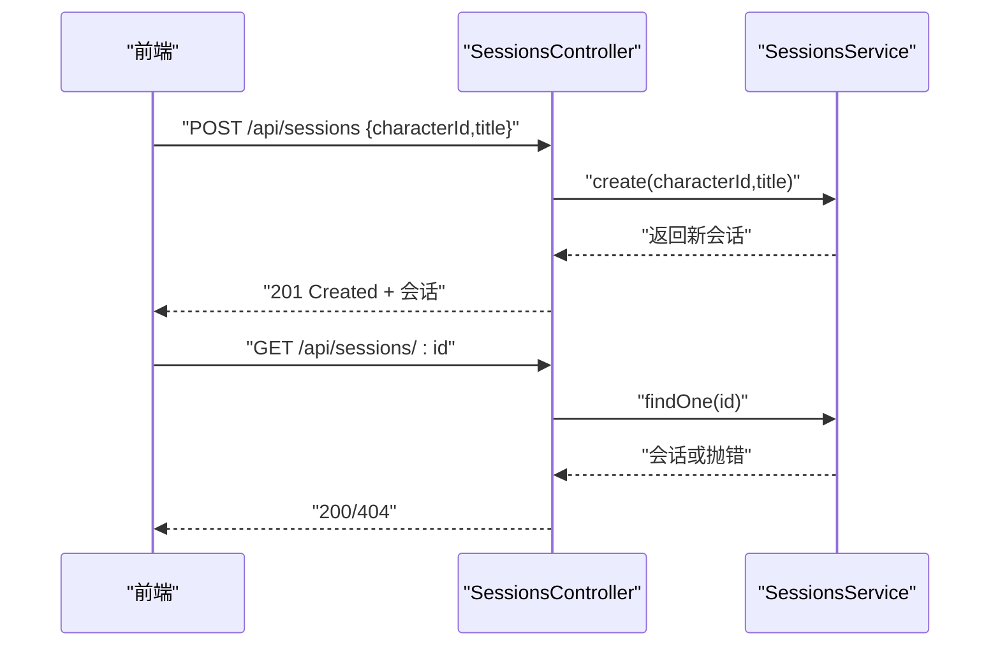
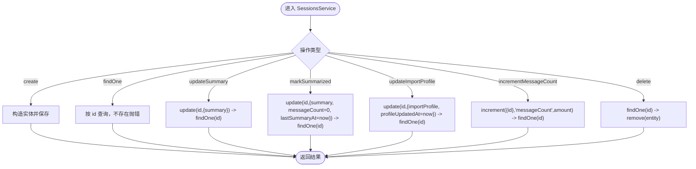
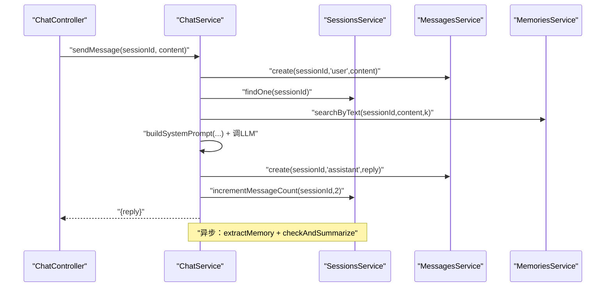
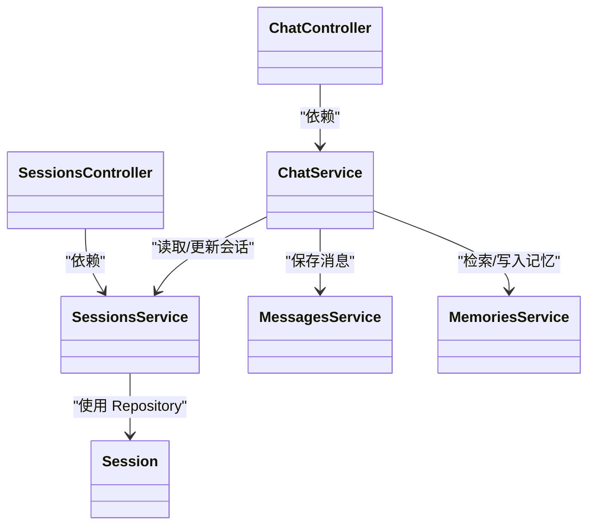

# 会话管理模块

<cite>
**本文引用的文件**
- [src/sessions/entities/session.entity.ts](file://src/sessions/entities/session.entity.ts)
- [src/sessions/sessions.controller.ts](file://src/sessions/sessions.controller.ts)
- [src/sessions/sessions.service.ts](file://src/sessions/sessions.service.ts)
- [src/sessions/sessions.module.ts](file://src/sessions/sessions.module.ts)
- [src/chat/chat.controller.ts](file://src/chat/chat.controller.ts)
- [src/chat/chat.service.ts](file://src/chat/chat.service.ts)
- [src/messages/messages.service.ts](file://src/messages/messages.service.ts)
- [src/memories/memories.service.ts](file://src/memories/memories.service.ts)
- [web/src/components/Sidebar/SessionSection.tsx](file://web/src/components/Sidebar/SessionSection.tsx)
- [web/src/components/Sidebar/SessionItem.tsx](file://web/src/components/Sidebar/SessionItem.tsx)
</cite>

## 目录
1. [简介](#简介)
2. [项目结构](#项目结构)
3. [核心组件](#核心组件)
4. [架构概览](#架构概览)
5. [详细组件分析](#详细组件分析)
6. [依赖分析](#依赖分析)
7. [性能考虑](#性能考虑)
8. [故障排查指南](#故障排查指南)
9. [结论](#结论)
10. [附录：API 文档与使用示例](#附录api-文档与使用示例)

## 简介
本文件面向“AI Companion”项目的会话管理模块，系统性阐述会话实体设计与数据库映射、会话控制器的 API 实现、会话服务的业务逻辑、与聊天模块的集成方式、会话数据的持久化机制、最佳实践与性能优化建议，并提供完整的 API 文档与使用示例。

## 项目结构
会话管理模块位于后端 src/sessions 目录，采用 NestJS + TypeORM 的标准分层：实体（entities）、控制器（controller）、服务（service）、模块（module）。前端侧在 web/src/components/Sidebar 中提供会话列表与新建/删除交互。

图表来源
- [src/sessions/sessions.controller.ts:1-28](file://src/sessions/sessions.controller.ts#L1-L28)
- [src/sessions/sessions.service.ts:1-62](file://src/sessions/sessions.service.ts#L1-L62)
- [src/sessions/sessions.module.ts:1-14](file://src/sessions/sessions.module.ts#L1-L14)
- [src/chat/chat.controller.ts:1-77](file://src/chat/chat.controller.ts#L1-L77)
- [src/chat/chat.service.ts:1-547](file://src/chat/chat.service.ts#L1-L547)
- [src/messages/messages.service.ts:1-93](file://src/messages/messages.service.ts#L1-L93)
- [src/memories/memories.service.ts:1-138](file://src/memories/memories.service.ts#L1-L138)
- [web/src/components/Sidebar/SessionSection.tsx:1-58](file://web/src/components/Sidebar/SessionSection.tsx#L1-L58)
- [web/src/components/Sidebar/SessionItem.tsx:1-36](file://web/src/components/Sidebar/SessionItem.tsx#L1-L36)

章节来源
- [src/sessions/sessions.controller.ts:1-28](file://src/sessions/sessions.controller.ts#L1-L28)
- [src/sessions/sessions.service.ts:1-62](file://src/sessions/sessions.service.ts#L1-L62)
- [src/sessions/sessions.module.ts:1-14](file://src/sessions/sessions.module.ts#L1-L14)
- [src/chat/chat.controller.ts:1-77](file://src/chat/chat.controller.ts#L1-L77)
- [src/chat/chat.service.ts:1-547](file://src/chat/chat.service.ts#L1-L547)
- [src/messages/messages.service.ts:1-93](file://src/messages/messages.service.ts#L1-L93)
- [src/memories/memories.service.ts:1-138](file://src/memories/memories.service.ts#L1-L138)
- [web/src/components/Sidebar/SessionSection.tsx:1-58](file://web/src/components/Sidebar/SessionSection.tsx#L1-L58)
- [web/src/components/Sidebar/SessionItem.tsx:1-36](file://web/src/components/Sidebar/SessionItem.tsx#L1-L36)

## 核心组件
- 会话实体（Session）：定义会话的字段、索引与时间戳，承载会话元数据与状态。
- 会话控制器（SessionsController）：提供创建、查询、删除会话的 REST API。
- 会话服务（SessionsService）：封装会话的增删改查、摘要标记、导入画像更新、消息计数递增等业务逻辑。
- 会话模块（SessionsModule）：注册 TypeORM 实体、注入控制器与服务，暴露服务供其他模块使用。
- 聊天服务（ChatService）：在消息收发过程中读取/更新会话状态，驱动滚动摘要与消息计数。
- 前端 Sidebar：展示会话列表、标题、消息计数，支持新建与删除会话。

章节来源
- [src/sessions/entities/session.entity.ts:1-64](file://src/sessions/entities/session.entity.ts#L1-L64)
- [src/sessions/sessions.controller.ts:1-28](file://src/sessions/sessions.controller.ts#L1-L28)
- [src/sessions/sessions.service.ts:1-62](file://src/sessions/sessions.service.ts#L1-L62)
- [src/sessions/sessions.module.ts:1-14](file://src/sessions/sessions.module.ts#L1-L14)
- [src/chat/chat.service.ts:1-547](file://src/chat/chat.service.ts#L1-L547)
- [web/src/components/Sidebar/SessionSection.tsx:1-58](file://web/src/components/Sidebar/SessionSection.tsx#L1-L58)
- [web/src/components/Sidebar/SessionItem.tsx:1-36](file://web/src/components/Sidebar/SessionItem.tsx#L1-L36)

## 架构概览
会话管理贯穿“前端交互 → 控制器 → 服务 → 数据库”的链路，同时与聊天、消息、记忆模块协作完成上下文组装与摘要维护。

图表来源
- [src/sessions/sessions.controller.ts:1-28](file://src/sessions/sessions.controller.ts#L1-L28)
- [src/sessions/sessions.service.ts:1-62](file://src/sessions/sessions.service.ts#L1-L62)
- [src/chat/chat.service.ts:1-547](file://src/chat/chat.service.ts#L1-L547)
- [web/src/components/Sidebar/SessionSection.tsx:1-58](file://web/src/components/Sidebar/SessionSection.tsx#L1-L58)

## 详细组件分析

### 会话实体与数据库映射
- 主键：UUID，自增列由数据库生成。
- 关联字段：characterId 指向角色；title/summary 为可选元信息；messageCount 用于滚动摘要触发；lastSummaryAt 记录上次摘要时间；importProfile 与 profileUpdatedAt 支持导入画像与更新时间。
- 时间戳：createdAt/updatedAt 使用 timestamptz 类型，确保时区一致。
- JSONB 字段：importProfile 以 JSONB 存储，便于灵活扩展。

图表来源
- [src/sessions/entities/session.entity.ts:32-63](file://src/sessions/entities/session.entity.ts#L32-L63)

章节来源
- [src/sessions/entities/session.entity.ts:1-64](file://src/sessions/entities/session.entity.ts#L1-L64)

### 会话控制器 API 实现
- POST /api/sessions：创建会话，接收 characterId 与可选 title。
- GET /api/sessions：按更新时间倒序列出所有会话。
- GET /api/sessions/:id：按 ID 查询会话。
- DELETE /api/sessions/:id：删除会话。

图表来源
- [src/sessions/sessions.controller.ts:8-26](file://src/sessions/sessions.controller.ts#L8-L26)
- [src/sessions/sessions.service.ts:13-28](file://src/sessions/sessions.service.ts#L13-L28)

章节来源
- [src/sessions/sessions.controller.ts:1-28](file://src/sessions/sessions.controller.ts#L1-L28)
- [src/sessions/sessions.service.ts:1-62](file://src/sessions/sessions.service.ts#L1-L62)

### 会话服务业务逻辑
- create：基于 characterId/title 创建会话并持久化。
- findAll：按 updatedAt 倒序返回会话列表。
- findOne：按 ID 查询，不存在则抛出未找到异常。
- updateSummary：更新 summary 并返回最新会话。
- markSummarized：更新 summary、清零 messageCount、设置 lastSummaryAt，并返回最新会话。
- updateImportProfile：更新 importProfile 并设置 profileUpdatedAt。
- incrementMessageCount：对 messageCount 增量更新，并返回最新会话。
- delete：先 findOne 再 remove，确保存在性校验。

图表来源
- [src/sessions/sessions.service.ts:13-60](file://src/sessions/sessions.service.ts#L13-L60)

章节来源
- [src/sessions/sessions.service.ts:1-62](file://src/sessions/sessions.service.ts#L1-L62)

### 会话与聊天模块的集成
- ChatController 通过路由参数 :sessionId 接收会话标识，分别支持同步与流式两种模式。
- ChatService 在 handleMessage/handleMessageStream 中：
  - 保存用户消息后读取会话与角色；
  - 组装 system prompt（包含会话摘要与导入画像）；
  - 调用 LLM 生成回复；
  - 保存 AI 回复并调用 sessionsService.incrementMessageCount(sessionId, 2)；
  - 异步触发记忆提取与滚动摘要检查。

图表来源
- [src/chat/chat.controller.ts:20-75](file://src/chat/chat.controller.ts#L20-L75)
- [src/chat/chat.service.ts:42-113](file://src/chat/chat.service.ts#L42-L113)
- [src/chat/chat.service.ts:130-231](file://src/chat/chat.service.ts#L130-L231)
- [src/chat/chat.service.ts:334-374](file://src/chat/chat.service.ts#L334-L374)
- [src/messages/messages.service.ts:36-49](file://src/messages/messages.service.ts#L36-L49)
- [src/memories/memories.service.ts:115-136](file://src/memories/memories.service.ts#L115-L136)

章节来源
- [src/chat/chat.controller.ts:1-77](file://src/chat/chat.controller.ts#L1-L77)
- [src/chat/chat.service.ts:1-547](file://src/chat/chat.service.ts#L1-L547)
- [src/messages/messages.service.ts:1-93](file://src/messages/messages.service.ts#L1-L93)
- [src/memories/memories.service.ts:1-138](file://src/memories/memories.service.ts#L1-L138)

### 会话数据持久化机制与一致性
- 会话实体通过 TypeORM 管理，使用 timestamptz 保证时区一致性。
- 会话与消息、记忆之间通过 sessionId 建立关联：
  - 消息表 messages 的 sessionId 外键指向 sessions.id；
  - 记忆表 memory_chunks 的 session_id 外键指向 sessions.id。
- 事务层面：当前实现未显式开启事务，读写分离通过服务层方法串行调用完成。若需强一致，可在关键路径（如创建会话+初始化第一条消息）引入事务包裹。

章节来源
- [src/sessions/entities/session.entity.ts:32-63](file://src/sessions/entities/session.entity.ts#L32-L63)
- [src/messages/messages.service.ts:36-49](file://src/messages/messages.service.ts#L36-L49)
- [src/memories/memories.service.ts:14-28](file://src/memories/memories.service.ts#L14-L28)

### 前端会话列表与交互
- SessionSection：过滤当前角色下的会话，提供新建会话与导入按钮，支持删除确认。
- SessionItem：渲染会话标题、消息计数，点击选择会话，点击×删除。
- 与后端 API 协同：新建会话调用 POST /api/sessions；删除会话调用 DELETE /api/sessions/:id。

章节来源
- [web/src/components/Sidebar/SessionSection.tsx:1-58](file://web/src/components/Sidebar/SessionSection.tsx#L1-L58)
- [web/src/components/Sidebar/SessionItem.tsx:1-36](file://web/src/components/Sidebar/SessionItem.tsx#L1-L36)
- [src/sessions/sessions.controller.ts:1-28](file://src/sessions/sessions.controller.ts#L1-L28)

## 依赖分析
- 低耦合高内聚：会话模块仅依赖 TypeORM 注入的 Repository，不直接访问其他模块实体。
- 服务间依赖：
  - ChatService 依赖 SessionsService、MessagesService、MemoriesService、LlmService、Emotion/Mood 服务。
  - SessionsService 仅依赖 Session 实体的 Repository。
- 外部依赖：pgvector（通过 DataSource 直接 SQL 访问）。

图表来源
- [src/sessions/sessions.controller.ts:1-28](file://src/sessions/sessions.controller.ts#L1-L28)
- [src/sessions/sessions.service.ts:1-62](file://src/sessions/sessions.service.ts#L1-L62)
- [src/chat/chat.controller.ts:1-77](file://src/chat/chat.controller.ts#L1-L77)
- [src/chat/chat.service.ts:1-547](file://src/chat/chat.service.ts#L1-L547)
- [src/messages/messages.service.ts:1-93](file://src/messages/messages.service.ts#L1-L93)
- [src/memories/memories.service.ts:1-138](file://src/memories/memories.service.ts#L1-L138)

章节来源
- [src/sessions/sessions.module.ts:1-14](file://src/sessions/sessions.module.ts#L1-L14)
- [src/sessions/sessions.service.ts:1-62](file://src/sessions/sessions.service.ts#L1-L62)
- [src/chat/chat.service.ts:1-547](file://src/chat/chat.service.ts#L1-L547)

## 性能考虑
- 滚动摘要策略：当消息数达到阈值且距离上次摘要超过设定时间窗口时才生成摘要，避免频繁计算。
- 异步处理：记忆提取与摘要检查通过 setImmediate 异步执行，不阻塞主线程。
- 分页与限制：最近消息读取限制数量，减少上下文拼接成本。
- 数据库索引：建议为 sessions.character_id、sessions.updated_at、messages.session_id、memory_chunks.session_id 等建立合适索引以提升查询性能。
- 事务与批量写入：在需要强一致性的场景（如创建会话+第一条消息）建议使用事务包裹；批量导入历史消息可使用批量写入接口。

## 故障排查指南
- 会话不存在：findOne(id) 未命中时抛出未找到异常，需检查 sessionId 是否正确传入。
- 角色缺失：ChatService 读取会话后需验证角色是否存在，否则抛错。
- 记忆检索异常：MemoriesService.searchByText 在检索失败时会吞掉异常并记录日志，不影响主流程。
- 摘要未生成：检查 messageCount 是否达到阈值、lastSummaryAt 是否在时间窗口之外。

章节来源
- [src/sessions/sessions.service.ts:22-28](file://src/sessions/sessions.service.ts#L22-L28)
- [src/chat/chat.service.ts:55-61](file://src/chat/chat.service.ts#L55-L61)
- [src/chat/chat.service.ts:67-75](file://src/chat/chat.service.ts#L67-L75)
- [src/chat/chat.service.ts:334-343](file://src/chat/chat.service.ts#L334-L343)

## 结论
会话管理模块以清晰的分层设计实现了会话的创建、查询、更新与删除，并通过与聊天、消息、记忆模块的紧密协作，支撑了上下文维护与长期记忆的形成。通过滚动摘要与异步处理，系统在保证用户体验的同时兼顾了性能与可维护性。后续可在事务一致性、索引优化与批量导入等方面进一步增强。

## 附录：API 文档与使用示例

### 会话 API
- 创建会话
  - 方法：POST
  - 路径：/api/sessions
  - 请求体：{ characterId: string, title?: string }
  - 响应：会话对象
- 查询所有会话
  - 方法：GET
  - 路径：/api/sessions
  - 响应：会话数组（按更新时间倒序）
- 查询单个会话
  - 方法：GET
  - 路径：/api/sessions/:id
  - 响应：会话对象
- 删除会话
  - 方法：DELETE
  - 路径：/api/sessions/:id
  - 响应：删除结果

章节来源
- [src/sessions/sessions.controller.ts:8-26](file://src/sessions/sessions.controller.ts#L8-L26)

### 聊天 API
- 同步消息发送
  - 方法：POST
  - 路径：/api/chat/:sessionId
  - 请求体：{ content: string }
  - 响应：{ reply: string }
- 流式消息发送（SSE）
  - 方法：POST
  - 路径：/api/chat/:sessionId/stream
  - 请求体：{ content: string }
  - 响应：SSE 流，数据帧包含分片回复，结束帧为 [DONE]

章节来源
- [src/chat/chat.controller.ts:20-75](file://src/chat/chat.controller.ts#L20-L75)

### 使用示例（概念性步骤）
- 新建会话
  - 前端调用 POST /api/sessions，传入当前角色 ID 与可选标题，得到会话 ID。
  - 将会话 ID 保存到本地状态，用于后续聊天请求。
- 发送消息
  - 同步模式：POST /api/chat/{sessionId}，传入用户输入，等待完整回复。
  - 流式模式：POST /api/chat/{sessionId}/stream，订阅 SSE，逐字显示回复。
- 删除会话
  - 前端调用 DELETE /api/sessions/{id}，并在确认后刷新会话列表。

章节来源
- [web/src/components/Sidebar/SessionSection.tsx:15-22](file://web/src/components/Sidebar/SessionSection.tsx#L15-L22)
- [src/sessions/sessions.controller.ts:23-26](file://src/sessions/sessions.controller.ts#L23-L26)
- [src/chat/chat.controller.ts:20-75](file://src/chat/chat.controller.ts#L20-L75)