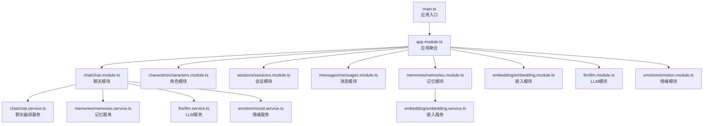
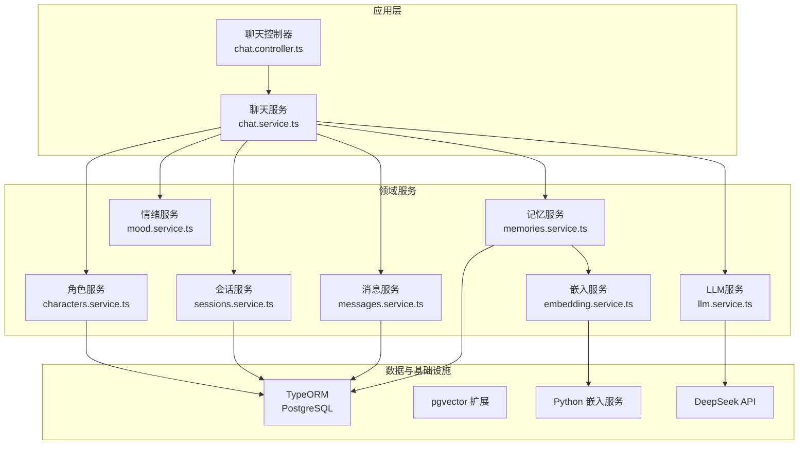
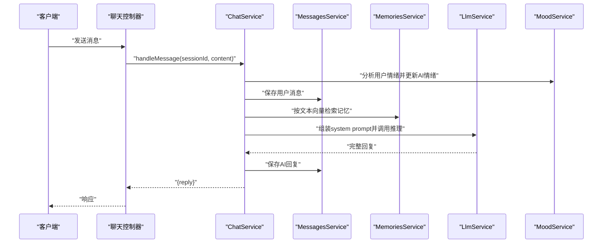
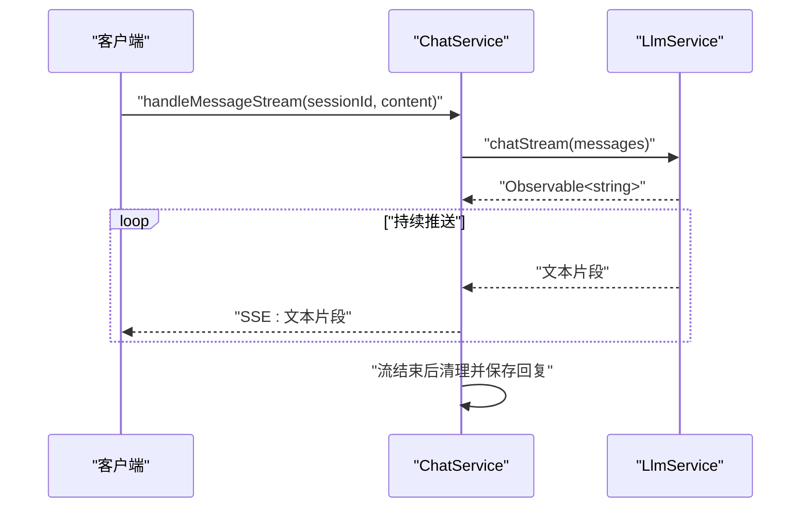
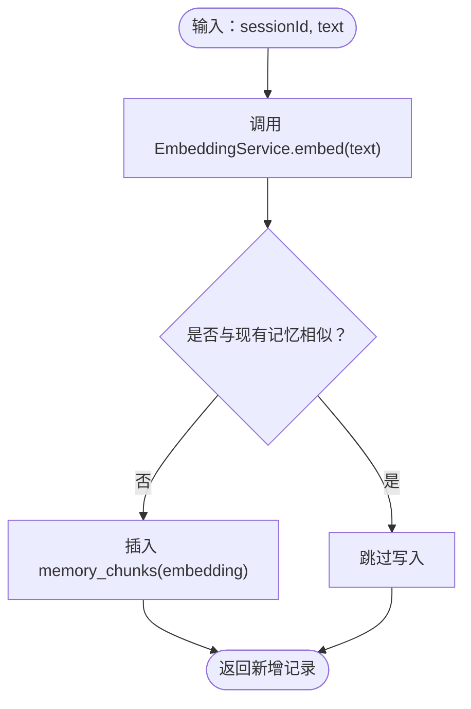
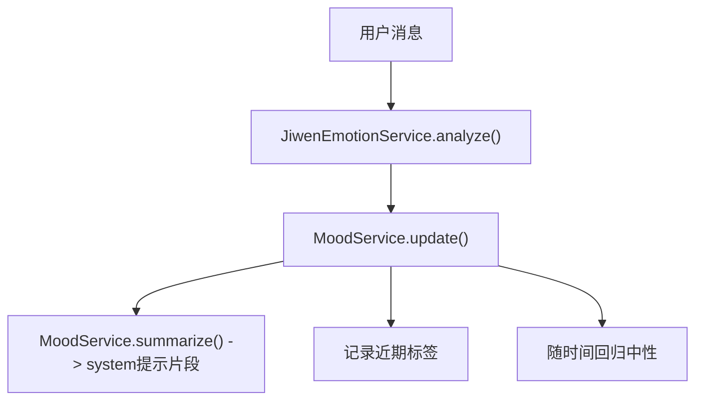
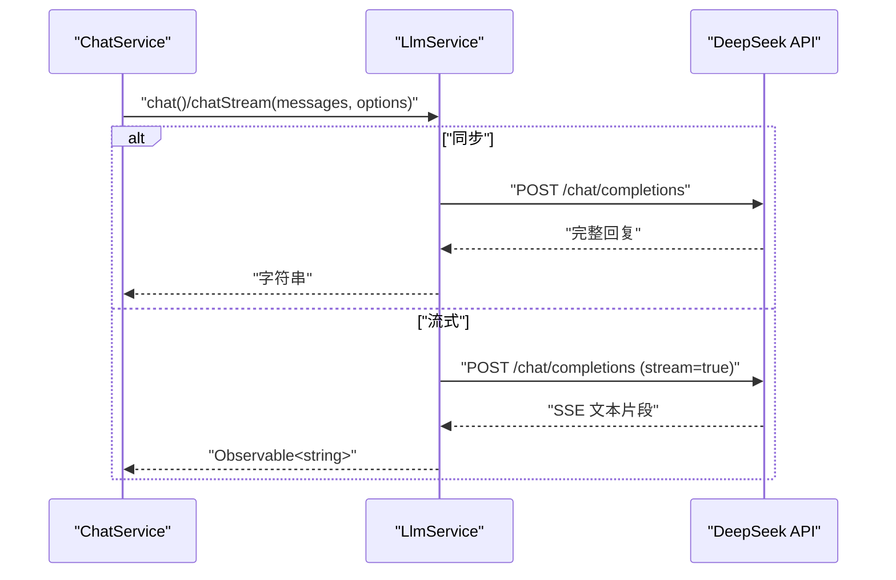
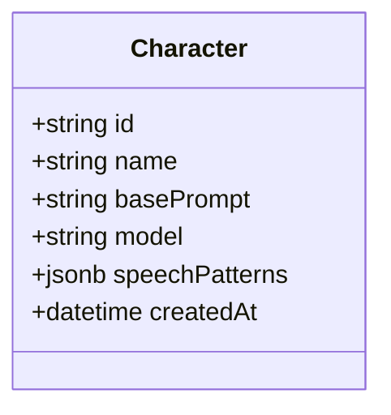
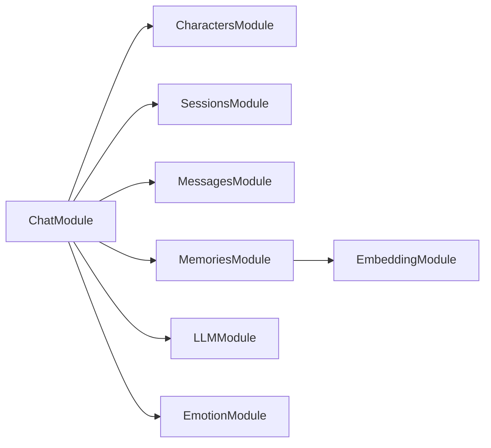

# 后端服务详解

<cite>
**本文引用的文件**
- [src/main.ts](file://src/main.ts)
- [src/app.module.ts](file://src/app.module.ts)
- [src/chat/chat.module.ts](file://src/chat/chat.module.ts)
- [src/chat/chat.service.ts](file://src/chat/chat.service.ts)
- [src/characters/characters.module.ts](file://src/characters/characters.module.ts)
- [src/characters/characters.service.ts](file://src/characters/characters.service.ts)
- [src/characters/entities/character.entity.ts](file://src/characters/entities/character.entity.ts)
- [src/messages/entities/message.entity.ts](file://src/messages/entities/message.entity.ts)
- [src/memories/memories.module.ts](file://src/memories/memories.module.ts)
- [src/memories/memories.service.ts](file://src/memories/memories.service.ts)
- [src/emotion/emotion.module.ts](file://src/emotion/emotion.module.ts)
- [src/emotion/mood.service.ts](file://src/emotion/mood.service.ts)
- [src/llm/llm.module.ts](file://src/llm/llm.module.ts)
- [src/llm/llm.service.ts](file://src/llm/llm.service.ts)
- [src/embedding/embedding.module.ts](file://src/embedding/embedding.module.ts)
- [src/embedding/embedding.service.ts](file://src/embedding/embedding.service.ts)
- [src/sessions/sessions.module.ts](file://src/sessions/sessions.module.ts)
- [src/sessions/sessions.service.ts](file://src/sessions/sessions.service.ts)
- [src/sessions/entities/session.entity.ts](file://src/sessions/entities/session.entity.ts)
- [src/migrations/1710000000000-init-pgvector-schema.ts](file://src/migrations/1710000000000-init-pgvector-schema.ts)
</cite>

## 目录
1. [简介](#简介)
2. [项目结构](#项目结构)
3. [核心组件](#核心组件)
4. [架构总览](#架构总览)
5. [详细组件分析](#详细组件分析)
6. [依赖分析](#依赖分析)
7. [性能考虑](#性能考虑)
8. [故障排查指南](#故障排查指南)
9. [结论](#结论)
10. [附录](#附录)

## 简介
本项目为“AI Companion”后端服务，采用 NestJS 构建模块化微服务架构，围绕“聊天”这一核心业务闭环，整合角色管理、会话与消息持久化、向量记忆检索、情绪建模与调节、以及 LLM 推理与流式响应处理。系统通过 TypeORM 连接 PostgreSQL，结合 pgvector 实现语义向量检索；通过独立的 Python 服务提供文本嵌入能力；并通过深度集成 DeepSeek API 实现高效、可流式的对话推理。

## 项目结构
后端采用按业务域划分的模块化组织方式，核心模块如下：
- 应用入口与全局配置：AppModule、main.ts
- 业务模块：Characters（角色）、Sessions（会话）、Messages（消息）、Chat（聊天编排）、Memories（记忆）、Embedding（嵌入）、LLM（推理）、Emotion（情绪）
- 数据迁移：pgvector 初始化迁移脚本
- 静态资源：内置 ServeStatic 提供前端 SPA

图表来源
- [src/main.ts:1-22](file://src/main.ts#L1-L22)
- [src/app.module.ts:18-63](file://src/app.module.ts#L18-L63)
- [src/chat/chat.module.ts:12-34](file://src/chat/chat.module.ts#L12-L34)
- [src/characters/characters.module.ts:7-13](file://src/characters/characters.module.ts#L7-L13)
- [src/memories/memories.module.ts:5-17](file://src/memories/memories.module.ts#L5-L17)
- [src/llm/llm.module.ts:1-16](file://src/llm/llm.module.ts#L1-L16)
- [src/emotion/emotion.module.ts:1-10](file://src/emotion/emotion.module.ts#L1-L10)
- [src/embedding/embedding.module.ts:1-16](file://src/embedding/embedding.module.ts#L1-L16)

章节来源
- [src/main.ts:1-22](file://src/main.ts#L1-L22)
- [src/app.module.ts:18-63](file://src/app.module.ts#L18-L63)

## 核心组件
- 控制器-服务-实体分层
  - 控制器：负责接收请求、参数校验与响应封装（如聊天模块控制器）
  - 服务：承载业务逻辑与跨模块编排（如 ChatService）
  - 实体：定义数据库表结构与字段映射（如 Character、Message、Session）
- 数据访问层：基于 TypeORM 的仓储模式，配合迁移脚本确保 pgvector 扩展与表结构一致
- 模块化依赖：通过 @Module imports 与 exports 明确模块间耦合边界

章节来源
- [src/chat/chat.module.ts:12-34](file://src/chat/chat.module.ts#L12-L34)
- [src/characters/characters.module.ts:7-13](file://src/characters/characters.module.ts#L7-L13)
- [src/memories/memories.module.ts:5-17](file://src/memories/memories.module.ts#L5-L17)
- [src/llm/llm.module.ts:1-16](file://src/llm/llm.module.ts#L1-L16)
- [src/emotion/emotion.module.ts:1-10](file://src/emotion/emotion.module.ts#L1-L10)
- [src/embedding/embedding.module.ts:1-16](file://src/embedding/embedding.module.ts#L1-L16)

## 架构总览
系统整体采用“控制器-服务-实体”的分层架构，结合外部服务（DeepSeek API、Python 嵌入服务）与数据库（PostgreSQL + pgvector）实现完整的聊天体验。

图表来源
- [src/chat/chat.service.ts:31-40](file://src/chat/chat.service.ts#L31-L40)
- [src/memories/memories.service.ts:31-34](file://src/memories/memories.service.ts#L31-L34)
- [src/embedding/embedding.service.ts:18-21](file://src/embedding/embedding.service.ts#L18-L21)
- [src/llm/llm.service.ts:28-33](file://src/llm/llm.service.ts#L28-L33)

## 详细组件分析

### 聊天模块（ChatModule）
职责：编排一次完整的对话流程，串联角色、会话、消息、记忆、情绪与 LLM 推理，支持同步与流式两种交互模式。

图表来源
- [src/chat/chat.service.ts:42-113](file://src/chat/chat.service.ts#L42-L113)
- [src/llm/llm.service.ts:36-57](file://src/llm/llm.service.ts#L36-L57)
- [src/memories/memories.service.ts:115-118](file://src/memories/memories.service.ts#L115-L118)

章节来源
- [src/chat/chat.module.ts:12-34](file://src/chat/chat.module.ts#L12-L34)
- [src/chat/chat.service.ts:13-28](file://src/chat/chat.service.ts#L13-L28)

### 流式对话（SSE）
支持边生成边推送的实时体验，前端逐字渲染，提升感知速度。

图表来源
- [src/chat/chat.service.ts:130-231](file://src/chat/chat.service.ts#L130-L231)
- [src/llm/llm.service.ts:70-145](file://src/llm/llm.service.ts#L70-L145)

章节来源
- [src/chat/chat.service.ts:119-231](file://src/chat/chat.service.ts#L119-L231)

### 记忆模块（MemoriesModule）
- 设计要点：memory_chunks 表包含 VECTOR(768) 列，使用 DataSource 直接执行原生 SQL，避免 TypeORM 同步删除该列
- 能力：向量检索、去重判断、按文本向量化后写入
- 与嵌入模块解耦：通过 EmbeddingService 获取向量

图表来源
- [src/memories/memories.service.ts:124-136](file://src/memories/memories.service.ts#L124-L136)
- [src/embedding/embedding.service.ts:33-42](file://src/embedding/embedding.service.ts#L33-L42)

章节来源
- [src/memories/memories.module.ts:5-17](file://src/memories/memories.module.ts#L5-L17)
- [src/memories/memories.service.ts:7-28](file://src/memories/memories.service.ts#L7-L28)

### 情绪模块（EmotionModule）
- 情绪建模：基于 valence（愉悦度）与 arousal（激活度）的二维连续空间，映射为标签（如“开心”“平静”等）
- 情绪调节：AI 对用户情绪产生共情波动，随时间回归中性，同时记录近期标签序列
- 情绪摘要：将当前情绪状态转化为 system prompt 片段，指导回复语气与表情使用

图表来源
- [src/chat/chat.service.ts:45-47](file://src/chat/chat.service.ts#L45-L47)
- [src/emotion/mood.service.ts:33-57](file://src/emotion/mood.service.ts#L33-L57)
- [src/emotion/mood.service.ts:59-91](file://src/emotion/mood.service.ts#L59-L91)

章节来源
- [src/emotion/emotion.module.ts:1-10](file://src/emotion/emotion.module.ts#L1-L10)
- [src/emotion/mood.service.ts:17-111](file://src/emotion/mood.service.ts#L17-L111)

### LLM 推理服务（LLMModule）
- 同步模式：等待完整回复后返回
- 流式模式：返回 Observable，逐片段推送，前端可即时渲染
- 参数：模型、温度、最大 token 数等可配置
- 集成：DeepSeek API，鉴权头与超时控制

图表来源
- [src/llm/llm.service.ts:36-57](file://src/llm/llm.service.ts#L36-L57)
- [src/llm/llm.service.ts:70-145](file://src/llm/llm.service.ts#L70-L145)

章节来源
- [src/llm/llm.module.ts:1-16](file://src/llm/llm.module.ts#L1-L16)
- [src/llm/llm.service.ts:19-25](file://src/llm/llm.service.ts#L19-L25)

### 角色管理（CharactersModule）
- 角色实体：包含 id、name、basePrompt、model、speechPatterns、createdAt
- 服务：提供创建、查询、更新、删除与按最新创建时间排序
- 与其他模块协作：会话模块通过角色 id 查询角色配置，作为 system prompt 的基础

图表来源
- [src/characters/entities/character.entity.ts:3-22](file://src/characters/entities/character.entity.ts#L3-L22)

章节来源
- [src/characters/characters.module.ts:7-13](file://src/characters/characters.module.ts#L7-L13)
- [src/characters/characters.service.ts:6-40](file://src/characters/characters.service.ts#L6-L40)
- [src/characters/entities/character.entity.ts:3-22](file://src/characters/entities/character.entity.ts#L3-L22)

### 会话与消息（Sessions & Messages）
- 会话：维护 summary、messageCount、lastSummaryAt、importProfile 等，用于滚动摘要与个性化提示
- 消息：持久化用户与 AI 的对话，支持最近 N 条读取与情绪快照存储

章节来源
- [src/sessions/sessions.module.ts](file://src/sessions/sessions.module.ts)
- [src/sessions/sessions.service.ts](file://src/sessions/sessions.service.ts)
- [src/sessions/entities/session.entity.ts](file://src/sessions/entities/session.entity.ts)
- [src/messages/entities/message.entity.ts:3-24](file://src/messages/entities/message.entity.ts#L3-L24)

### 数据库与迁移（TypeORM + pgvector）
- TypeORM 配置：PostgreSQL，禁用自动同步以保护 VECTOR 列，启用迁移并自动运行初始化脚本
- 迁移脚本：初始化 pgvector 扩展与相关表结构

章节来源
- [src/app.module.ts:37-50](file://src/app.module.ts#L37-L50)
- [src/migrations/1710000000000-init-pgvector-schema.ts](file://src/migrations/1710000000000-init-pgvector-schema.ts)

## 依赖分析
模块间依赖关系清晰，遵循“上层控制器依赖服务，服务依赖仓储与外部服务”的原则，避免循环依赖。

图表来源
- [src/chat/chat.module.ts:22-30](file://src/chat/chat.module.ts#L22-L30)
- [src/memories/memories.module.ts:12-16](file://src/memories/memories.module.ts#L12-L16)

章节来源
- [src/chat/chat.module.ts:12-34](file://src/chat/chat.module.ts#L12-L34)
- [src/memories/memories.module.ts:5-17](file://src/memories/memories.module.ts#L5-L17)

## 性能考虑
- 流式响应：优先使用 chatStream，降低首字延迟，改善用户体验
- 向量检索：合理设置检索 top-k，避免过度扫描；对高频查询可考虑缓存相似度高的记忆片段
- 嵌入服务：批量嵌入优于逐条调用；Python 服务健康检查失败时降级或重试
- 滚动摘要：定期触发，减少上下文长度，提高推理效率与稳定性
- 数据库：pgvector 索引与迁移脚本确保检索性能；避免频繁重建 schema

## 故障排查指南
- CORS 问题：开发阶段允许任意来源，生产需限制具体域名
- 数据库连接：确认 .env 中 DB_* 环境变量正确；迁移脚本已启用，确保 pgvector 扩展可用
- LLM 调用：检查 DEEPSEEK_API_KEY 是否配置；关注超时与网络错误
- 嵌入服务：确认 PYTHON_EMBED_URL 可达；可通过 healthCheck 探活
- 记忆检索：若检索为空，检查嵌入服务是否正常与向量维度是否匹配

章节来源
- [src/main.ts:7-13](file://src/main.ts#L7-L13)
- [src/app.module.ts:37-50](file://src/app.module.ts#L37-L50)
- [src/llm/llm.service.ts:28-33](file://src/llm/llm.service.ts#L28-L33)
- [src/embedding/embedding.service.ts:18-21](file://src/embedding/embedding.service.ts#L18-L21)

## 结论
本后端服务以模块化为核心，围绕聊天场景完成从“消息收发、角色与会话管理、记忆检索、情绪建模、LLM 推理”到“流式响应”的完整闭环。通过 TypeORM 与 pgvector 的组合实现高可靠的向量检索，借助独立 Python 嵌入服务与 DeepSeek API 提升扩展性与性能。建议在生产环境中完善监控、限流与缓存策略，持续优化检索与推理参数，保障长对话与大规模并发下的稳定性。

## 附录

### API 接口文档（概览）
- 聊天
  - POST /chat/handle
    - 请求体：{ sessionId: string, content: string }
    - 响应：{ reply: string }
  - GET /chat/stream/{sessionId}
    - 流式响应：SSE，逐片段推送文本
- 角色
  - GET /characters
  - GET /characters/:id
  - POST /characters
  - PUT /characters/:id
  - DELETE /characters/:id
- 会话
  - GET /sessions
  - GET /sessions/:id
  - POST /sessions
  - PUT /sessions/:id
- 消息
  - GET /messages
  - GET /messages/:id
  - POST /messages
- 记忆
  - POST /memories/search
    - 请求体：{ sessionId: string, text: string, limit?: number }
    - 响应：[{ id, content, memory_type, similarity }]
  - POST /memories/add
    - 请求体：{ sessionId: string, content: string, type: "fact"|"preference"|"emotion", sourceMsgId?: number }
    - 响应：新增记录或 null（重复）
- 嵌入
  - POST /embedding/embed
    - 请求体：{ text: string }
    - 响应：[768维向量]
  - POST /embedding/batch_embed
    - 请求体：string[]
    - 响应：number[][]
  - GET /embedding/health
    - 响应：{ status: "ok"|"error" }
- LLM
  - POST /llm/chat
    - 请求体：{ messages: ChatMessage[], options?: LlmOptions }
    - 响应：string
  - POST /llm/chat_stream
    - 请求体：{ messages: ChatMessage[], options?: LlmOptions }
    - 响应：SSE 流式文本

章节来源
- [src/chat/chat.service.ts:42-113](file://src/chat/chat.service.ts#L42-L113)
- [src/characters/characters.service.ts:13-39](file://src/characters/characters.service.ts#L13-L39)
- [src/memories/memories.service.ts:115-136](file://src/memories/memories.service.ts#L115-L136)
- [src/embedding/embedding.service.ts:33-65](file://src/embedding/embedding.service.ts#L33-L65)
- [src/llm/llm.service.ts:36-57](file://src/llm/llm.service.ts#L36-L57)
- [src/llm/llm.service.ts:70-145](file://src/llm/llm.service.ts#L70-L145)