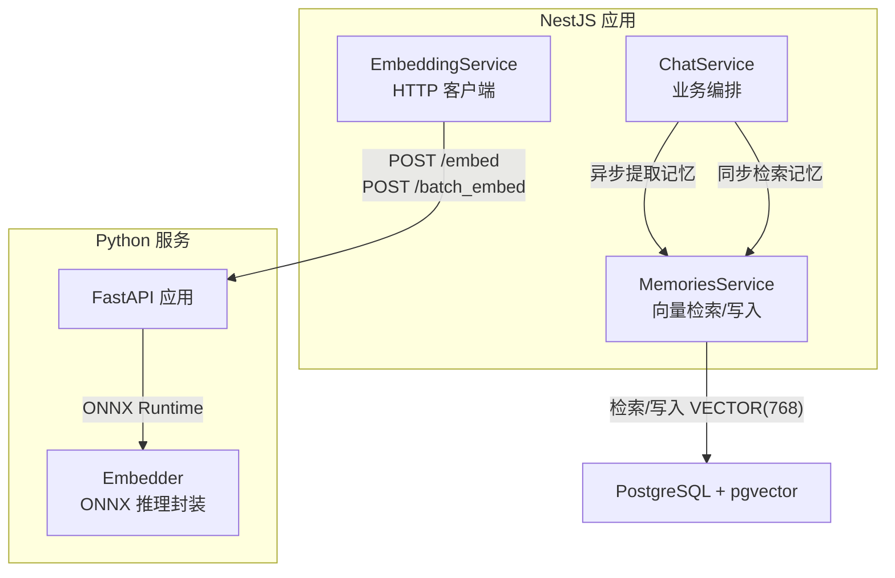
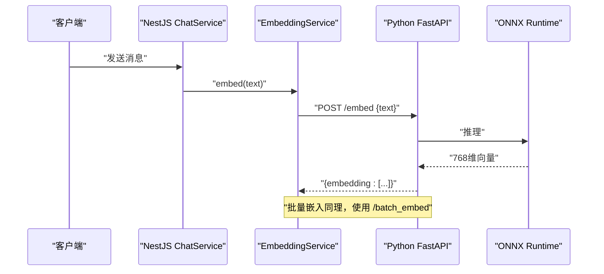
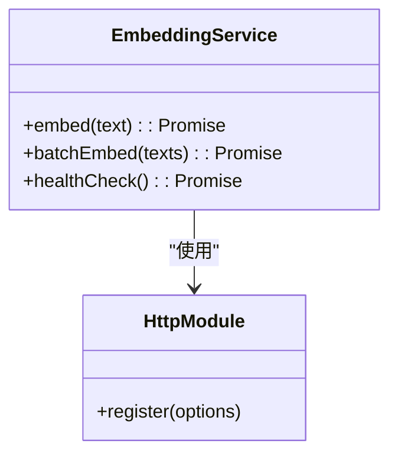
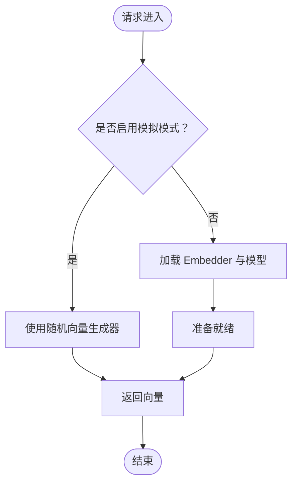
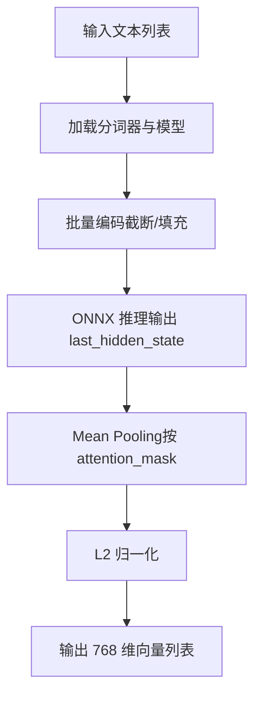
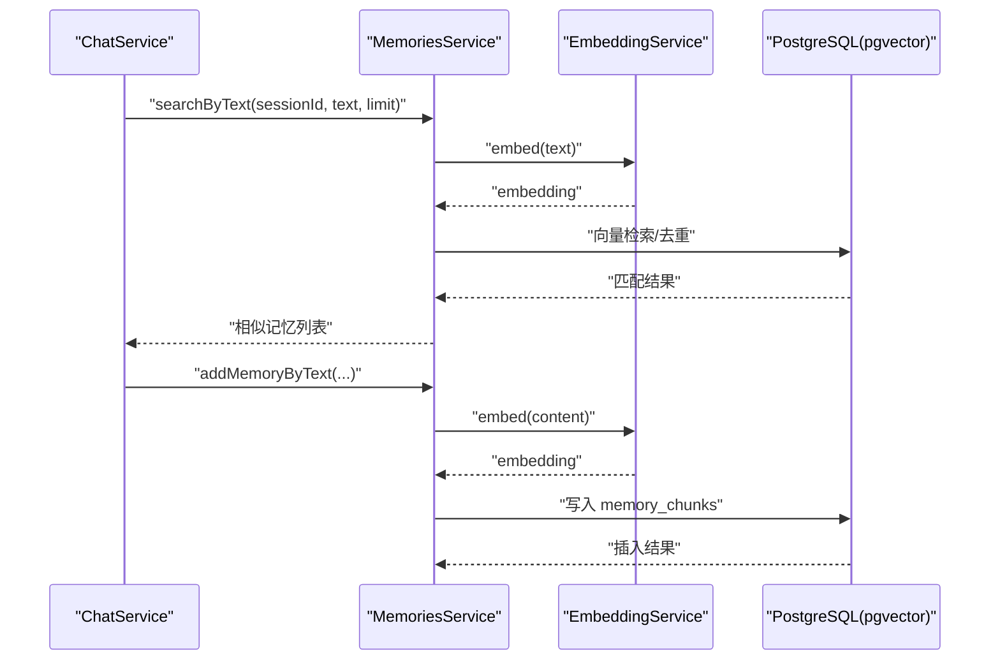
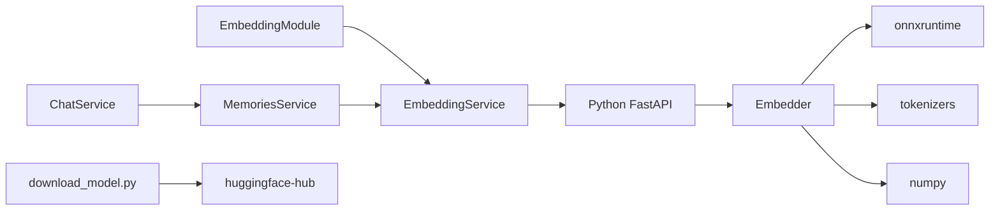

# 向量嵌入服务

<cite>
**本文引用的文件**
- [src/embedding/embedding.service.ts](file://src/embedding/embedding.service.ts)
- [src/embedding/embedding.module.ts](file://src/embedding/embedding.module.ts)
- [python/main.py](file://python/main.py)
- [python/embedder.py](file://python/embedder.py)
- [python/scripts/download_model.py](file://python/scripts/download_model.py)
- [python/pyproject.toml](file://python/pyproject.toml)
- [src/memories/memories.service.ts](file://src/memories/memories.service.ts)
- [src/chat/chat.service.ts](file://src/chat/chat.service.ts)
</cite>

## 目录
1. [简介](#简介)
2. [项目结构](#项目结构)
3. [核心组件](#核心组件)
4. [架构总览](#架构总览)
5. [详细组件分析](#详细组件分析)
6. [依赖分析](#依赖分析)
7. [性能考虑](#性能考虑)
8. [故障排除指南](#故障排除指南)
9. [结论](#结论)
10. [附录](#附录)

## 简介
本文件面向“AI Companion”项目的向量嵌入服务，系统性阐述嵌入服务的架构设计、NestJS 与 Python FastAPI 的集成机制、向量嵌入的实现原理（文本预处理、模型加载与向量计算）、批处理机制（任务队列、并发控制与性能优化）、Python 服务的实现细节（模型下载/缓存/内存管理）、与记忆系统的交互（数据流转与错误处理）、服务配置（环境变量、资源限制与监控指标），以及故障排除与性能调优建议。

## 项目结构
向量嵌入服务由两部分组成：
- NestJS 层：提供 HTTP 客户端封装，负责调用 Python FastAPI 服务，暴露单条与批量嵌入接口，并提供健康检查。
- Python FastAPI 层：提供 /embed、/batch_embed、/health 三个端点，内部可选择使用真实模型（ONNX Runtime）或模拟模式（随机向量）。

图表来源
- [src/embedding/embedding.service.ts:1-84](file://src/embedding/embedding.service.ts#L1-L84)
- [src/memories/memories.service.ts:1-138](file://src/memories/memories.service.ts#L1-L138)
- [src/chat/chat.service.ts:1-547](file://src/chat/chat.service.ts#L1-L547)
- [python/main.py:1-123](file://python/main.py#L1-L123)
- [python/embedder.py:1-116](file://python/embedder.py#L1-L116)

章节来源
- [src/embedding/embedding.module.ts:1-16](file://src/embedding/embedding.module.ts#L1-L16)
- [src/embedding/embedding.service.ts:1-84](file://src/embedding/embedding.service.ts#L1-L84)
- [python/main.py:1-123](file://python/main.py#L1-L123)

## 核心组件
- 嵌入服务（NestJS）：封装 HTTP 客户端，调用 Python 服务进行单条/批量向量化，提供健康检查。
- 嵌入模块（NestJS）：注册 HTTP 客户端模块并导出嵌入服务。
- FastAPI 服务（Python）：提供 /embed、/batch_embed、/health 三个端点；支持真实模型或模拟模式。
- Embedder（Python）：封装 ONNX Runtime 推理，完成分词、编码、mean pooling、归一化等步骤。
- 下载脚本（Python）：从 Hugging Face Hub 下载模型与分词器到本地缓存目录。
- 记忆服务（NestJS）：与 PostgreSQL/pgvector 交互，执行向量检索、去重与写入；在异步记忆提取流程中调用嵌入服务。

章节来源
- [src/embedding/embedding.service.ts:1-84](file://src/embedding/embedding.service.ts#L1-L84)
- [src/embedding/embedding.module.ts:1-16](file://src/embedding/embedding.module.ts#L1-L16)
- [python/main.py:1-123](file://python/main.py#L1-L123)
- [python/embedder.py:1-116](file://python/embedder.py#L1-L116)
- [python/scripts/download_model.py:1-42](file://python/scripts/download_model.py#L1-L42)
- [src/memories/memories.service.ts:1-138](file://src/memories/memories.service.ts#L1-L138)

## 架构总览
嵌入服务采用“微服务式”分离：NestJS 负责业务编排与外部通信，Python 服务专注向量化推理。二者通过 HTTP 通信，NestJS 侧提供统一的嵌入能力抽象，Python 侧提供高性能 ONNX 推理与灵活的模型配置。

图表来源
- [src/chat/chat.service.ts:65-75](file://src/chat/chat.service.ts#L65-L75)
- [src/embedding/embedding.service.ts:33-42](file://src/embedding/embedding.service.ts#L33-L42)
- [python/main.py:91-101](file://python/main.py#L91-L101)
- [python/embedder.py:103-115](file://python/embedder.py#L103-L115)

## 详细组件分析

### NestJS 嵌入服务（EmbeddingService）
- 职责：对外暴露 embed 与 batchEmbed 方法，分别对应单条与批量向量化；提供 healthCheck 用于探活。
- 超时与容错：单条推理 10 秒，批量推理 30 秒；健康检查 3 秒；异常捕获后 healthCheck 返回 false。
- 配置：通过环境变量 PYTHON_EMBED_URL 指定 Python 服务地址，默认 http://localhost:8000。
- 依赖注入：通过 HttpModule 注入 HttpService，统一超时与重定向策略。

图表来源
- [src/embedding/embedding.service.ts:1-84](file://src/embedding/embedding.service.ts#L1-L84)
- [src/embedding/embedding.module.ts:1-16](file://src/embedding/embedding.module.ts#L1-L16)

章节来源
- [src/embedding/embedding.service.ts:1-84](file://src/embedding/embedding.service.ts#L1-L84)
- [src/embedding/embedding.module.ts:1-16](file://src/embedding/embedding.module.ts#L1-L16)

### Python FastAPI 服务（main.py）
- 端点：
  - POST /embed：单条文本向量化，返回 768 维向量。
  - POST /batch_embed：批量文本向量化，返回多个 768 维向量。
  - GET /health：健康检查，返回状态、是否为模拟模式、维度。
- 模式切换：
  - 支持 --mock 参数或 MOCK_EMBEDDING=1 环境变量进入模拟模式，使用伪随机向量。
  - 非模拟模式下加载 Embedder 并初始化推理引擎。
- 启动方式：uv run uvicorn main:app --port 8000；可配合 --mock 进行流程验证。

图表来源
- [python/main.py:33-71](file://python/main.py#L33-L71)
- [python/main.py:91-122](file://python/main.py#L91-L122)

章节来源
- [python/main.py:1-123](file://python/main.py#L1-L123)

### Embedder（Python）实现细节
- 模型与分词器：
  - 默认路径：python/models/jina-embeddings-v2-base-zh.onnx 与 tokenizer.json。
  - 支持通过环境变量 EMBEDDING_MODEL_PATH、EMBEDDING_TOKENIZER_PATH 指定自定义路径。
  - 最大序列长度由 EMBEDDING_MAX_LENGTH 控制，默认 512。
- 推理流程：
  - 分词与编码：使用 tokenizers 读取 JSON 分词器，批量编码并截断至最大长度。
  - ONNX 推理：使用 ONNX Runtime InferenceSession，输入 input_ids 与 attention_mask。
  - Mean Pooling + 归一化：对最后一层隐藏状态按 attention_mask 池化并 L2 归一化，得到 768 维向量。
- 批处理：batch_embed 支持空列表返回空数组，避免无效调用。

图表来源
- [python/embedder.py:71-92](file://python/embedder.py#L71-L92)
- [python/embedder.py:94-102](file://python/embedder.py#L94-L102)
- [python/embedder.py:107-115](file://python/embedder.py#L107-L115)

章节来源
- [python/embedder.py:1-116](file://python/embedder.py#L1-L116)

### 模型下载与缓存（download_model.py）
- 从 Hugging Face Hub 下载 jina-embeddings-v2-base-zh 的 ONNX 模型与 tokenizer.json 至 python/models/。
- 使用 hf_hub_download 获取文件并写入目标路径，确保后续推理可用。
- 建议在部署前执行该脚本，或在容器启动时拉取模型。

章节来源
- [python/scripts/download_model.py:1-42](file://python/scripts/download_model.py#L1-L42)

### 与记忆系统的交互（MemoriesService）
- 数据流转：
  - ChatService 在同步阶段调用 MemoriesService.searchByText，后者再调用 EmbeddingService.embed 获取查询向量，然后在 PostgreSQL 中执行向量检索与去重。
  - 异步记忆提取阶段，ChatService 调用 MemoriesService.addMemoryByText，后者同样先 embed 再去重写入。
- 错误处理：
  - 检索阶段对异常进行捕获并记录日志，不影响主流程。
  - 去重阈值默认 0.95（余弦相似度），超过则跳过写入。

图表来源
- [src/chat/chat.service.ts:65-75](file://src/chat/chat.service.ts#L65-L75)
- [src/chat/chat.service.ts:114-118](file://src/chat/chat.service.ts#L114-L118)
- [src/memories/memories.service.ts:114-136](file://src/memories/memories.service.ts#L114-L136)
- [src/embedding/embedding.service.ts:33-42](file://src/embedding/embedding.service.ts#L33-L42)

章节来源
- [src/memories/memories.service.ts:1-138](file://src/memories/memories.service.ts#L1-L138)
- [src/chat/chat.service.ts:1-547](file://src/chat/chat.service.ts#L1-L547)

## 依赖分析
- NestJS 侧：
  - EmbeddingModule 注册 HttpModule，统一超时与重定向。
  - EmbeddingService 依赖 HttpService，调用 Python 服务。
  - MemoriesService 依赖 DataSource 与 EmbeddingService。
  - ChatService 依赖 MemoriesService、LLM、情感与心情服务。
- Python 侧：
  - FastAPI 提供端点；根据模式选择 Embedder 或伪随机向量。
  - Embedder 依赖 onnxruntime、tokenizers、numpy。
  - 下载脚本依赖 huggingface-hub。

图表来源
- [src/embedding/embedding.module.ts:1-16](file://src/embedding/embedding.module.ts#L1-L16)
- [src/embedding/embedding.service.ts:1-84](file://src/embedding/embedding.service.ts#L1-L84)
- [src/memories/memories.service.ts:1-138](file://src/memories/memories.service.ts#L1-L138)
- [src/chat/chat.service.ts:1-547](file://src/chat/chat.service.ts#L1-L547)
- [python/main.py:1-123](file://python/main.py#L1-L123)
- [python/embedder.py:1-116](file://python/embedder.py#L1-L116)
- [python/scripts/download_model.py:1-42](file://python/scripts/download_model.py#L1-L42)
- [python/pyproject.toml:1-22](file://python/pyproject.toml#L1-L22)

章节来源
- [python/pyproject.toml:1-22](file://python/pyproject.toml#L1-L22)

## 性能考虑
- 批处理优先：在需要对多条文本向量化时，优先使用 batchEmbed，利用模型推理的批内并行提升吞吐。
- 超时与并发：
  - 单条推理超时 10 秒，批量 30 秒；可根据硬件调整。
  - Python 侧 ONNX Runtime 默认 CPU 执行，可通过提供 GPU/加速 Provider 优化推理速度（需在生产环境评估）。
- 序列长度与内存：
  - EMBEDDING_MAX_LENGTH 控制最大长度，默认 512；过长会增加显存占用与推理时间。
  - 批大小与序列长度共同决定内存峰值，建议在压测后确定最优组合。
- 模拟模式与开发效率：
  - 开发/联调阶段可启用 --mock 或 MOCK_EMBEDDING=1，快速验证流程；生产务必关闭。
- 缓存与预热：
  - 首次加载模型耗时较长，建议在容器启动阶段预热 Embedder，减少首次请求延迟。
- PostgreSQL/pgvector：
  - 记忆检索使用 HNSW + 余弦距离；建议在生产环境建立合适的索引与参数，定期维护统计信息。

## 故障排除指南
- Python 服务不可达：
  - 检查 PYTHON_EMBED_URL 是否正确；使用 healthCheck 探活。
  - 确认 Python 服务已启动且端口开放。
- 模型缺失：
  - 若出现“模型/分词器不存在”错误，请先执行下载脚本，或将模型与分词器放置于指定路径或通过环境变量指向。
- 推理异常：
  - 检查文本编码是否正常；确认 MAX_LENGTH 与分词器配置一致。
  - 如使用 GPU Provider，确认驱动与依赖版本兼容。
- 记忆检索失败：
  - 捕获异常不影响主流程；可在日志中查看具体错误信息。
  - 确保 PostgreSQL 已创建 memory_chunks 表与向量索引。
- 批处理性能不足：
  - 适当增大批大小；合并多次调用为批量请求。
  - 降低 MAX_LENGTH 或减少输入文本长度以降低内存峰值。

章节来源
- [src/embedding/embedding.service.ts:70-82](file://src/embedding/embedding.service.ts#L70-L82)
- [python/main.py:64-70](file://python/main.py#L64-L70)
- [python/embedder.py:40-52](file://python/embedder.py#L40-L52)
- [src/memories/memories.service.ts:64-110](file://src/memories/memories.service.ts#L64-L110)

## 结论
本向量嵌入服务通过 NestJS 与 Python FastAPI 的清晰分工，实现了高内聚、低耦合的嵌入能力：NestJS 负责业务编排与外部通信，Python 负责高性能推理与模型管理。结合批处理、健康检查与完善的错误处理，系统在开发与生产环境中均具备良好的可维护性与扩展性。建议在生产中关闭模拟模式、预热模型、合理配置批大小与序列长度，并持续监控 Python 服务与数据库性能。

## 附录

### 环境变量与配置清单
- NestJS（嵌入服务）
  - PYTHON_EMBED_URL：Python FastAPI 地址，默认 http://localhost:8000
- Python（推理）
  - MOCK_EMBEDDING：1 启用模拟模式，0 关闭（默认）
  - EMBEDDING_MODEL_PATH：自定义模型路径
  - EMBEDDING_TOKENIZER_PATH：自定义分词器路径
  - EMBEDDING_MAX_LENGTH：最大序列长度，默认 512
- Python（依赖）
  - onnxruntime、numpy、tokenizers、fastapi、uvicorn、pydantic、huggingface-hub、certifi、truststore

章节来源
- [src/embedding/embedding.service.ts:18-21](file://src/embedding/embedding.service.ts#L18-L21)
- [python/main.py:33-35](file://python/main.py#L33-L35)
- [python/embedder.py:26-28](file://python/embedder.py#L26-L28)
- [python/pyproject.toml:1-22](file://python/pyproject.toml#L1-L22)