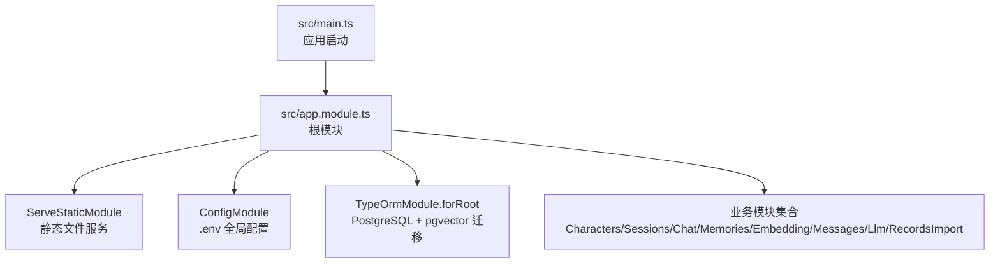
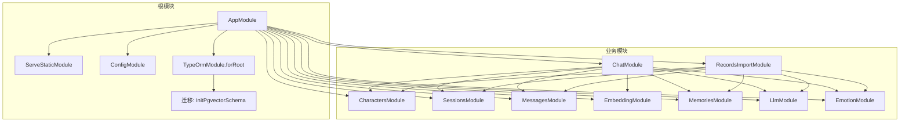
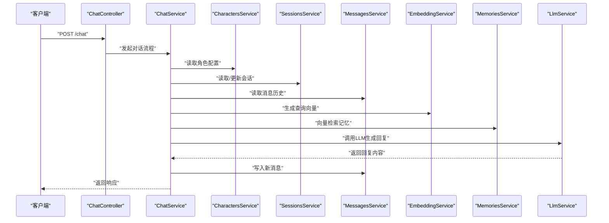
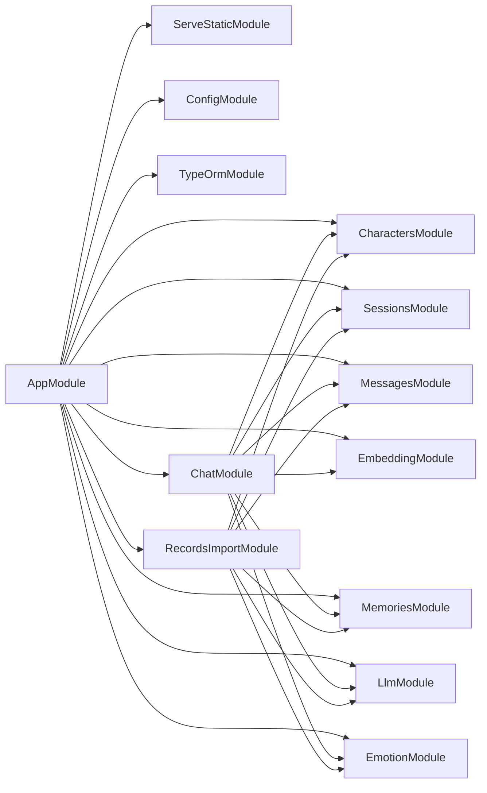

# 应用模块架构

<cite>
**本文引用的文件**
- [src/app.module.ts](file://src/app.module.ts)
- [src/main.ts](file://src/main.ts)
- [src/config/database.config.ts](file://src/config/database.config.ts)
- [src/migrations/1710000000000-init-pgvector-schema.ts](file://src/migrations/1710000000000-init-pgvector-schema.ts)
- [src/characters/characters.module.ts](file://src/characters/characters.module.ts)
- [src/sessions/sessions.module.ts](file://src/sessions/sessions.module.ts)
- [src/chat/chat.module.ts](file://src/chat/chat.module.ts)
- [src/embedding/embedding.module.ts](file://src/embedding/embedding.module.ts)
- [src/memories/memories.module.ts](file://src/memories/memories.module.ts)
- [src/messages/messages.module.ts](file://src/messages/messages.module.ts)
- [src/llm/llm.module.ts](file://src/llm/llm.module.ts)
- [src/records-import/records-import.module.ts](file://src/records-import/records-import.module.ts)
- [package.json](file://package.json)
- [nest-cli.json](file://nest-cli.json)
</cite>

## 目录
1. [引言](#引言)
2. [项目结构](#项目结构)
3. [核心组件](#核心组件)
4. [架构总览](#架构总览)
5. [详细组件分析](#详细组件分析)
6. [依赖分析](#依赖分析)
7. [性能考虑](#性能考虑)
8. [故障排查指南](#故障排查指南)
9. [结论](#结论)
10. [附录](#附录)

## 引言
本文件面向AI Companion应用的模块架构，系统性阐述NestJS根模块AppModule的设计理念与配置要点，涵盖静态文件服务、环境变量配置、数据库连接与TypeORM迁移机制、模块导入顺序与依赖关系、全局中间件与路由优先级、模块化最佳实践（依赖注入与服务提供者管理）、以及生产环境部署策略与常见问题处理建议。读者可据此快速理解系统如何通过模块化组织业务能力，并在TypeORM与pgvector向量扩展的支持下实现智能对话与记忆检索。

## 项目结构
AI Companion采用NestJS标准目录结构，按功能域划分模块，核心入口位于src/app.module.ts，应用启动逻辑位于src/main.ts。数据库配置与迁移位于src/config/database.config.ts与src/migrations目录；前端产物位于web/dist，通过ServeStaticModule在生产环境提供SPA静态资源。

图表来源
- [src/app.module.ts:18-62](file://src/app.module.ts#L18-L62)
- [src/main.ts:4-21](file://src/main.ts#L4-L21)

章节来源
- [src/app.module.ts:1-64](file://src/app.module.ts#L1-L64)
- [src/main.ts:1-22](file://src/main.ts#L1-L22)
- [nest-cli.json:1-9](file://nest-cli.json#L1-L9)

## 核心组件
- 根模块AppModule
  - 静态文件服务：通过ServeStaticModule提供web/dist静态资源，开发阶段由Vite代理API，生产阶段由NestJS直接服务。
  - 环境变量：ConfigModule.forRoot({ isGlobal: true })使.env配置全局可用。
  - 数据库连接：TypeOrmModule.forRoot配置PostgreSQL，启用迁移、禁用自动同步以保护vector列，启动时自动运行迁移。
  - 业务模块：按领域导入Characters、Sessions、Chat、Embedding、Memories、RecordsImport等模块。
- 应用启动main.ts
  - 启用CORS（开发默认允许任意来源），监听端口并输出访问日志。
- 数据库配置database.config.ts
  - CLI迁移专用数据源配置，加载.env并在启动时运行迁移。
- 迁移脚本1710000000000-init-pgvector-schema.ts
  - 初始化pgvector扩展、自定义枚举类型、核心表结构与索引（含向量HNSW索引）。

章节来源
- [src/app.module.ts:18-62](file://src/app.module.ts#L18-L62)
- [src/main.ts:7-13](file://src/main.ts#L7-L13)
- [src/config/database.config.ts:8-20](file://src/config/database.config.ts#L8-L20)
- [src/migrations/1710000000000-init-pgvector-schema.ts:6-93](file://src/migrations/1710000000000-init-pgvector-schema.ts#L6-L93)

## 架构总览
下图展示根模块与各子模块的关系、数据流与依赖方向。AppModule作为控制中心，统一装配静态资源、配置与数据库；业务模块围绕对话、记忆、嵌入、LLM与情感等能力协作，形成闭环的对话编排。

图表来源
- [src/app.module.ts:18-62](file://src/app.module.ts#L18-L62)
- [src/chat/chat.module.ts:22-33](file://src/chat/chat.module.ts#L22-L33)
- [src/records-import/records-import.module.ts:12-23](file://src/records-import/records-import.module.ts#L12-L23)

## 详细组件分析

### 根模块AppModule设计与配置
- 静态文件服务
  - ServeStaticModule.forRoot配置rootPath指向web/dist，生产环境自动提供SPA；未设置exclude，确保NestJS路由优先于静态文件。
  - SPA回退：通过serveStaticOptions.index指定index.html，保证前端路由刷新可用。
- 环境变量配置
  - ConfigModule.forRoot({ isGlobal: true })使process.env在全局可用，便于数据库连接参数与日志开关等集中管理。
- 数据库与迁移
  - TypeOrmModule.forRoot配置PostgreSQL连接参数，autoLoadEntities启用实体自动发现，synchronize设为false以避免pgvector列被TypeORM删除。
  - migrations与migrationsRun分别声明迁移类与启动时自动执行，确保pgvector扩展与表结构一致。
- 业务模块导入
  - 按领域导入：Characters、Sessions、Chat、Embedding、Memories、RecordsImport等，形成清晰的职责边界。

章节来源
- [src/app.module.ts:23-50](file://src/app.module.ts#L23-L50)
- [src/app.module.ts:52-59](file://src/app.module.ts#L52-L59)

### 应用启动与全局中间件
- CORS启用
  - main.ts中启用CORS，开发阶段允许任意来源；生产环境建议限定origin为具体域名，提升安全性。
- 路由优先级
  - ServeStaticModule未设置exclude，意味着NestJS路由优先于静态文件，符合SPA场景下的API优先策略。

章节来源
- [src/main.ts:9-13](file://src/main.ts#L9-L13)
- [src/app.module.ts:26-30](file://src/app.module.ts#L26-L30)

### 数据库与迁移机制
- 数据源配置
  - database.config.ts提供CLI迁移所需的数据源，加载.env并启用migrationsRun，确保TypeORM命令行工具可用。
- 迁移实现
  - InitPgvectorSchema1710000000000迁移：
    - 创建vector扩展与自定义枚举类型；
    - 定义characters、sessions、messages、memory_chunks等核心表；
    - 为messages与memory_chunks添加必要索引，其中memory_chunks包含向量HNSW索引以支持高效相似度检索；
    - 提供down方法用于回滚，保障演进安全。
- 同步策略
  - 根模块TypeOrmModule.forRoot明确synchronize=false，配合迁移管理结构变更，避免破坏向量列。

章节来源
- [src/config/database.config.ts:8-20](file://src/config/database.config.ts#L8-L20)
- [src/migrations/1710000000000-init-pgvector-schema.ts:6-93](file://src/migrations/1710000000000-init-pgvector-schema.ts#L6-L93)
- [src/app.module.ts:46-48](file://src/app.module.ts#L46-L48)

### 模块化设计与依赖注入
- 依赖注入与提供者
  - 各模块通过providers注册服务（如CharactersService、SessionsService、ChatService等），通过exports对外暴露接口或TypeOrmModule，供其他模块按需注入。
- 实体注册与仓储
  - 使用TypeOrmModule.forFeature([Entity])在模块内注册实体，生成对应Repository，便于在服务中注入使用。
- 模块间依赖
  - ChatModule依赖Characters、Sessions、Messages、Llm、Memories、Emotion等模块，形成完整的对话编排链路。
  - RecordsImportModule复用相同依赖，但以控制器形式提供批量导入能力。

章节来源
- [src/characters/characters.module.ts:7-12](file://src/characters/characters.module.ts#L7-L12)
- [src/sessions/sessions.module.ts:7-12](file://src/sessions/sessions.module.ts#L7-L12)
- [src/messages/messages.module.ts:7-12](file://src/messages/messages.module.ts#L7-L12)
- [src/chat/chat.module.ts:22-33](file://src/chat/chat.module.ts#L22-L33)
- [src/records-import/records-import.module.ts:12-23](file://src/records-import/records-import.module.ts#L12-L23)

### 关键模块交互序列（对话编排）
以下序列图展示一次完整对话的调用链，体现根模块到业务模块的协作关系。

图表来源
- [src/chat/chat.module.ts:12-21](file://src/chat/chat.module.ts#L12-L21)
- [src/chat/chat.module.ts:22-33](file://src/chat/chat.module.ts#L22-L33)

## 依赖分析
- 模块耦合与内聚
  - AppModule高内聚地整合基础设施（静态资源、配置、数据库），业务模块围绕各自领域内聚，模块间通过exports与依赖注入解耦。
- 直接与间接依赖
  - ChatModule与RecordsImportModule均依赖Characters、Sessions、Messages、Embedding、Memories、Llm、Emotion，体现对话与导入两条主线的共性依赖。
- 外部依赖与集成点
  - PostgreSQL + pgvector用于向量存储与检索；HTTP模块用于外部API调用（LLM与嵌入服务）。
- 接口契约
  - 各模块通过exports暴露服务或TypeOrmModule，确保下游模块仅依赖抽象而非具体实现细节。

图表来源
- [src/app.module.ts:52-59](file://src/app.module.ts#L52-L59)
- [src/chat/chat.module.ts:22-33](file://src/chat/chat.module.ts#L22-L33)
- [src/records-import/records-import.module.ts:12-23](file://src/records-import/records-import.module.ts#L12-L23)

章节来源
- [src/app.module.ts:52-59](file://src/app.module.ts#L52-L59)
- [src/chat/chat.module.ts:22-33](file://src/chat/chat.module.ts#L22-L33)
- [src/records-import/records-import.module.ts:12-23](file://src/records-import/records-import.module.ts#L12-L23)

## 性能考虑
- 向量检索性能
  - 迁移中为memory_chunks创建HNSW向量索引，结合cosine相似度运算，显著提升大规模语料的近似最近邻检索效率。
- 数据库连接与日志
  - 生产环境建议关闭DB_LOGGING，避免SQL日志对性能的影响；合理设置连接池参数（可通过TypeORM配置项调整）。
- 嵌入与LLM调用
  - EmbeddingModule与LlmModule分别配置超时与重定向上限，避免阻塞与资源浪费；在服务层增加重试与降级策略可进一步增强鲁棒性。
- 静态资源与路由
  - 由于NestJS路由优先于静态文件，前端路由刷新无需额外配置，减少不必要的中间件开销。

章节来源
- [src/migrations/1710000000000-init-pgvector-schema.ts:90-92](file://src/migrations/1710000000000-init-pgvector-schema.ts#L90-L92)
- [src/embedding/embedding.module.ts:7-11](file://src/embedding/embedding.module.ts#L7-L11)
- [src/llm/llm.module.ts:7-11](file://src/llm/llm.module.ts#L7-L11)
- [src/app.module.ts:26-30](file://src/app.module.ts#L26-L30)

## 故障排查指南
- 迁移失败或向量列丢失
  - 确认TypeOrmModule.forRoot中synchronize=false且migrationsRun=true；检查InitPgvectorSchema迁移是否成功执行。
  - 若出现向量列被删除，检查是否误用synchronize或手动修改了实体字段导致TypeORM重建表。
- CORS跨域问题
  - 生产环境需将origin限制为具体域名；若仍报跨域错误，检查代理层（如Nginx）是否正确转发请求头。
- 静态资源无法访问
  - 确认web/build已生成且ServeStaticModule指向正确的WEB_DIST路径；检查serveRoot与SPA回退配置。
- 环境变量未生效
  - 确保.env存在且ConfigModule.forRoot({ isGlobal: true })已启用；CLI迁移时database.config.ts会单独加载.env。
- 数据库连接异常
  - 核对DB_HOST、DB_PORT、DB_USER、DB_NAME、DB_PASSWORD与DB_LOGGING；确认PostgreSQL服务与pgvector扩展可用。

章节来源
- [src/app.module.ts:46-48](file://src/app.module.ts#L46-L48)
- [src/migrations/1710000000000-init-pgvector-schema.ts:6-93](file://src/migrations/1710000000000-init-pgvector-schema.ts#L6-L93)
- [src/main.ts:9-13](file://src/main.ts#L9-L13)
- [src/config/database.config.ts:5-6](file://src/config/database.config.ts#L5-L6)

## 结论
AppModule通过“静态文件服务 + 全局配置 + 数据库与迁移”的基础设施装配，为上层业务模块提供稳定、可演进的运行环境。模块化设计强调服务导出与依赖注入，结合pgvector向量能力，实现了从角色配置、会话管理、消息记录到记忆检索与LLM调用的完整对话闭环。遵循本文的配置与最佳实践，可在开发与生产环境中获得一致、可靠的体验。

## 附录
- 生产环境部署建议
  - 构建前端：执行构建脚本生成web/dist。
  - 启动后端：使用生产脚本启动，确保环境变量齐全。
  - 数据库：提前安装pgvector扩展，迁移自动完成表结构初始化。
- 常用脚本与命令
  - 构建与运行：参考package.json中的build、start、start:prod等脚本。
  - 迁移管理：通过typeorm脚本进行迁移生成、运行与回滚。

章节来源
- [package.json:8-27](file://package.json#L8-L27)
- [package.json:24-27](file://package.json#L24-L27)