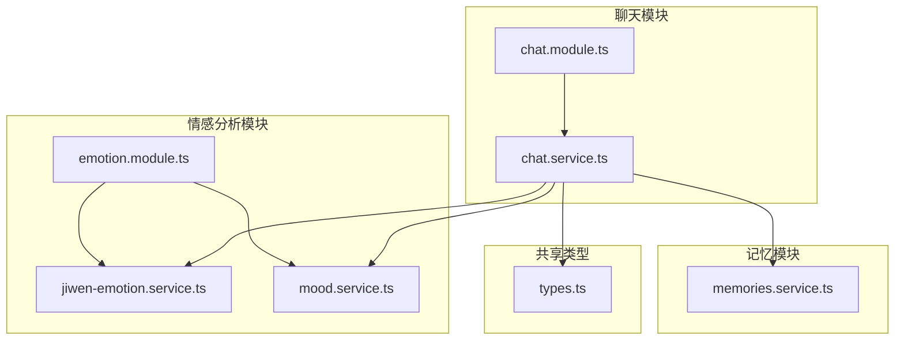
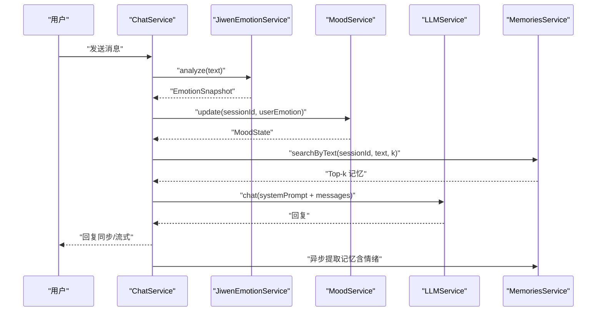
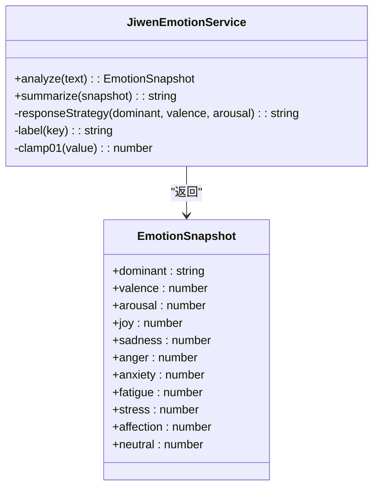
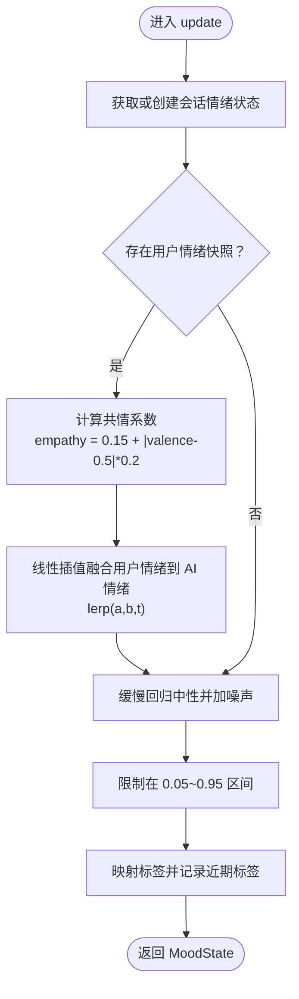
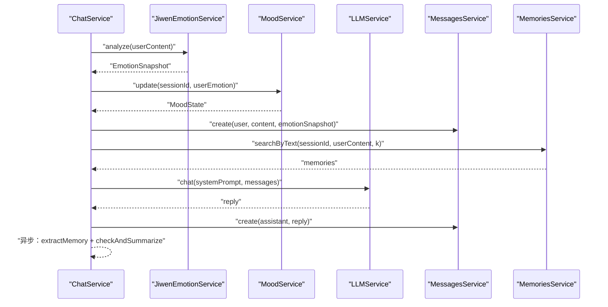
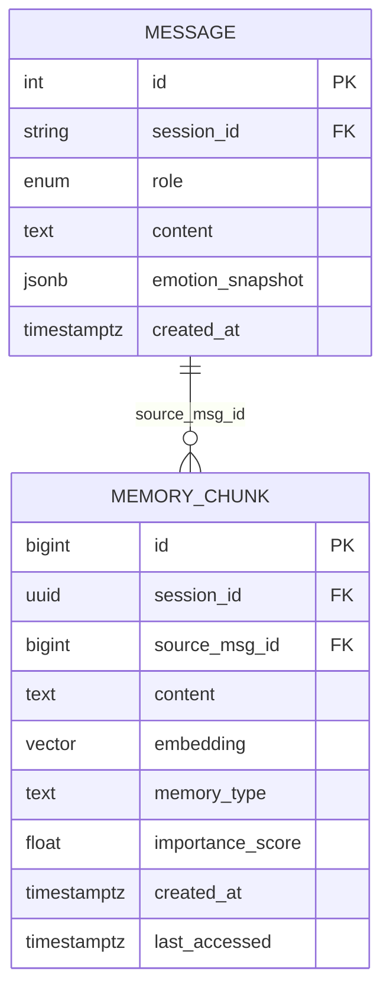
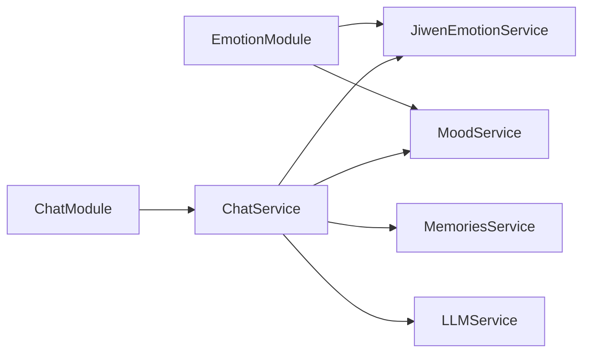

# 情感分析模块

<cite>
**本文引用的文件**
- [emotion.module.ts](file://src/emotion/emotion.module.ts)
- [jiwen-emotion.service.ts](file://src/emotion/jiwen-emotion.service.ts)
- [mood.service.ts](file://src/emotion/mood.service.ts)
- [chat.service.ts](file://src/chat/chat.service.ts)
- [chat.module.ts](file://src/chat/chat.module.ts)
- [memories.service.ts](file://src/memories/memories.service.ts)
- [types.ts](file://shared/types.ts)
- [app.module.ts](file://src/app.module.ts)
- [Implementation_Plan.md](file://docs/Implementation_Plan.md)
- [Learning_Notes.md](file://docs/Learning_Notes.md)
</cite>

## 目录
1. [简介](#简介)
2. [项目结构](#项目结构)
3. [核心组件](#核心组件)
4. [架构总览](#架构总览)
5. [详细组件分析](#详细组件分析)
6. [依赖关系分析](#依赖关系分析)
7. [性能考量](#性能考量)
8. [故障排查指南](#故障排查指南)
9. [结论](#结论)
10. [附录](#附录)

## 简介
本技术文档聚焦于 AI Companion 的情感分析模块，系统性阐述其整体架构与实现细节。该模块由“情绪识别”和“情绪调节”两大核心服务构成：
- 情绪识别服务（JiwenEmotionService）负责对用户输入进行中文情感词典匹配与强度计算，输出情绪快照（包含主导情绪、愉悦度、唤醒度等），并生成可注入系统提示的“情绪摘要”。
- 情绪调节服务（MoodService）基于用户情绪快照进行 AI 自身情绪建模与动态调节，输出“AI 当前情绪状态摘要”，用于指导回复语气与表情使用。

情感分析与聊天模块深度集成：在每次对话中，系统先进行情绪识别与 AI 情绪调节，随后将“用户情绪摘要”和“AI 情绪摘要”拼接到系统提示中，驱动 LLM 生成符合当前情绪状态的自然回复。同时，系统支持将情绪快照持久化到消息实体，并通过异步记忆提取将“情绪”类记忆写入向量数据库，形成可检索的历史情绪片段。

## 项目结构
情感分析模块位于后端工程的 emotion 子目录，通过 NestJS 模块化组织，与聊天模块、记忆模块、嵌入模块共同协作，形成完整的对话编排链路。

图表来源
- [emotion.module.ts:1-10](file://src/emotion/emotion.module.ts#L1-L10)
- [jiwen-emotion.service.ts:1-134](file://src/emotion/jiwen-emotion.service.ts#L1-L134)
- [mood.service.ts:1-111](file://src/emotion/mood.service.ts#L1-L111)
- [chat.module.ts:1-35](file://src/chat/chat.module.ts#L1-L35)
- [chat.service.ts:1-547](file://src/chat/chat.service.ts#L1-L547)
- [memories.service.ts:1-138](file://src/memories/memories.service.ts#L1-L138)
- [types.ts:79-86](file://shared/types.ts#L79-L86)

章节来源
- [emotion.module.ts:1-10](file://src/emotion/emotion.module.ts#L1-L10)
- [chat.module.ts:1-35](file://src/chat/chat.module.ts#L1-L35)
- [Implementation_Plan.md:40-80](file://docs/Implementation_Plan.md#L40-L80)

## 核心组件
- 情绪识别服务（JiwenEmotionService）
  - 输入：用户文本
  - 输出：情绪快照（包含各情绪得分、主导情绪、愉悦度、唤醒度）
  - 附加能力：生成“情绪摘要”，包含用户情绪标签、倾向与强度，并给出具体回应策略建议
- 情绪调节服务（MoodService）
  - 输入：会话标识、用户情绪快照（可为空）
  - 输出：AI 情绪状态（愉悦度、唤醒度、标签、近期标签序列）
  - 附加能力：生成“AI 当前情绪状态摘要”，包含语气建议、表情与颜文字推荐
- 聊天服务（ChatService）
  - 在对话编排中调用上述两个服务，将情绪摘要注入系统提示，驱动 LLM 生成回复
  - 支持同步与流式两种交互模式
  - 将情绪快照持久化到消息实体，并异步提取“情绪”类记忆写入向量库

章节来源
- [jiwen-emotion.service.ts:32-76](file://src/emotion/jiwen-emotion.service.ts#L32-L76)
- [jiwen-emotion.service.ts:78-97](file://src/emotion/jiwen-emotion.service.ts#L78-L97)
- [mood.service.ts:18-57](file://src/emotion/mood.service.ts#L18-L57)
- [mood.service.ts:59-91](file://src/emotion/mood.service.ts#L59-L91)
- [chat.service.ts:42-113](file://src/chat/chat.service.ts#L42-L113)
- [chat.service.ts:130-231](file://src/chat/chat.service.ts#L130-L231)

## 架构总览
情感分析模块在聊天流程中的位置如下：

图表来源
- [chat.service.ts:42-113](file://src/chat/chat.service.ts#L42-L113)
- [chat.service.ts:130-231](file://src/chat/chat.service.ts#L130-L231)
- [jiwen-emotion.service.ts:32-76](file://src/emotion/jiwen-emotion.service.ts#L32-L76)
- [mood.service.ts:33-57](file://src/emotion/mood.service.ts#L33-L57)
- [memories.service.ts:115-118](file://src/memories/memories.service.ts#L115-L118)

## 详细组件分析

### 情绪识别服务（JiwenEmotionService）
- 情绪词典设计
  - 使用加权中文情感词典，覆盖七类情绪：喜悦、悲伤、愤怒、焦虑、疲劳、压力、依恋
  - 每类情绪维护一组关键词与权重，用于统计匹配强度
- 情感强度计算
  - 基于词典匹配累计得分，结合标点与口语化表达（如笑声、叹息）进行强度微调
  - 计算主导情绪：若最高分低于阈值则判定为“平稳”
  - 计算愉悦度（valence）与唤醒度（arousal）：综合正负情绪分量，经归一化得到 0~1 区间
- 情绪摘要与回应策略
  - 将主导情绪、愉悦度区间与唤醒度区间转化为易读标签
  - 基于情绪标签生成“回应策略”，指导 AI 采用共情、安抚、鼓励或轻松的语气
- 数据结构
  - 情绪快照包含各情绪得分、主导情绪、愉悦度、唤醒度等字段

图表来源
- [jiwen-emotion.service.ts:3-8](file://src/emotion/jiwen-emotion.service.ts#L3-L8)
- [jiwen-emotion.service.ts:32-76](file://src/emotion/jiwen-emotion.service.ts#L32-L76)
- [jiwen-emotion.service.ts:78-114](file://src/emotion/jiwen-emotion.service.ts#L78-L114)

章节来源
- [jiwen-emotion.service.ts:16-24](file://src/emotion/jiwen-emotion.service.ts#L16-L24)
- [jiwen-emotion.service.ts:32-76](file://src/emotion/jiwen-emotion.service.ts#L32-L76)
- [jiwen-emotion.service.ts:78-114](file://src/emotion/jiwen-emotion.service.ts#L78-L114)

### 情绪调节服务（MoodService）
- 情绪状态建模
  - 以会话为单位维护 AI 的情绪状态（愉悦度、唤醒度、标签、近期标签序列）
  - 初始化时赋予轻微随机扰动，确保初始状态自然
- 情绪调节算法
  - 共情系数：随用户情绪偏离中性程度增加而提高，使 AI 更贴近用户情绪
  - 衰减与噪声：对愉悦度与唤醒度进行缓慢回归至中性，并加入小幅度随机噪声，模拟真实人类情绪波动
  - 标签映射：根据愉悦度与唤醒度区间映射到“开心/温暖/平静/低落/烦躁/兴奋/困倦/平静”等标签
- 情绪摘要
  - 输出当前情绪状态、语气建议、表情与颜文字推荐，指导回复风格

图表来源
- [mood.service.ts:33-57](file://src/emotion/mood.service.ts#L33-L57)
- [mood.service.ts:97-109](file://src/emotion/mood.service.ts#L97-L109)

章节来源
- [mood.service.ts:18-57](file://src/emotion/mood.service.ts#L18-L57)
- [mood.service.ts:59-91](file://src/emotion/mood.service.ts#L59-L91)
- [mood.service.ts:101-109](file://src/emotion/mood.service.ts#L101-L109)

### 聊天服务（ChatService）中的情感分析集成
- 同步对话流程
  - 分析用户情绪 → 更新 AI 情绪 → 保存用户消息（含情绪快照）→ 组装系统提示（含用户/AI 情绪摘要）→ 调用 LLM → 保存 AI 回复 → 异步提取记忆与滚动摘要
- 流式对话（SSE）
  - 与同步流程一致，但将 LLM 回复以流式方式逐字推送前端，完成后清理括号动作描述并保存完整回复
- 系统提示拼装
  - 将“说话风格”“滚动摘要”“长期画像”“记忆片段”“用户/AI 情绪摘要”等多层信息组合为系统提示，确保回复风格与情绪状态一致

图表来源
- [chat.service.ts:42-113](file://src/chat/chat.service.ts#L42-L113)
- [chat.service.ts:130-231](file://src/chat/chat.service.ts#L130-L231)

章节来源
- [chat.service.ts:42-113](file://src/chat/chat.service.ts#L42-L113)
- [chat.service.ts:130-231](file://src/chat/chat.service.ts#L130-L231)
- [chat.service.ts:424-497](file://src/chat/chat.service.ts#L424-L497)

### 情绪状态的数据结构与存储
- 消息实体中的情绪快照
  - 消息数据结构包含情绪快照字段，用于记录本次对话中用户的情绪状态
- 情绪历史与趋势
  - MoodService 维护“近期标签”序列，便于观察情绪趋势
  - 记忆模块支持将“情绪”类记忆写入向量库，便于后续检索与分析
- 持久化与检索
  - 情绪快照随消息持久化
  - 情绪记忆通过向量化与相似度检索实现历史情绪片段的复用

图表来源
- [types.ts:79-86](file://shared/types.ts#L79-L86)
- [memories.service.ts:14-28](file://src/memories/memories.service.ts#L14-L28)

章节来源
- [types.ts:79-86](file://shared/types.ts#L79-L86)
- [memories.service.ts:115-136](file://src/memories/memories.service.ts#L115-L136)

## 依赖关系分析
- 模块依赖
  - EmotionModule 向外导出 JiwenEmotionService 与 MoodService
  - ChatModule 依赖 EmotionModule，并在 ChatService 中注入这两个服务
- 跨模块协作
  - ChatService 在系统提示中拼接“用户情绪摘要”和“AI 情绪摘要”，并通过 MemoriesService 检索与写入“情绪”类记忆
- 外部服务
  - LLMService：用于生成回复
  - EmbeddingService：用于向量化（在记忆提取与检索中使用）

图表来源
- [emotion.module.ts:5-8](file://src/emotion/emotion.module.ts#L5-L8)
- [chat.module.ts:22-30](file://src/chat/chat.module.ts#L22-L30)
- [chat.service.ts:31-40](file://src/chat/chat.service.ts#L31-L40)

章节来源
- [emotion.module.ts:1-10](file://src/emotion/emotion.module.ts#L1-L10)
- [chat.module.ts:1-35](file://src/chat/chat.module.ts#L1-L35)
- [chat.service.ts:1-12](file://src/chat/chat.service.ts#L1-L12)

## 性能考量
- 情绪识别复杂度
  - 词典匹配与正则检测为线性复杂度，输入文本长度与词典规模决定时间消耗
  - 建议：控制词典规模与关键词数量，避免过度匹配导致性能下降
- 情绪调节复杂度
  - 线性插值与常数运算，开销极低，几乎可忽略
- 记忆检索与写入
  - 向量检索与插入涉及数据库与 Python 服务调用，需关注延迟与吞吐
  - 建议：合理设置检索 top-k、批量化嵌入、启用索引与连接池

[本节为通用性能讨论，无需特定文件来源]

## 故障排查指南
- 情绪识别异常
  - 症状：主导情绪始终为“平稳”，或愉悦度/唤醒度异常
  - 排查：确认输入文本是否包含足够情绪关键词；检查正则匹配与权重累加逻辑
- 情绪调节异常
  - 症状：AI 情绪不随用户情绪变化，或波动过大
  - 排查：核对共情系数计算、衰减与噪声参数；检查标签映射区间
- 系统提示拼装异常
  - 症状：回复风格与情绪状态不符
  - 排查：确认“用户/AI 情绪摘要”正确传入系统提示；检查系统提示拼装顺序与格式
- 记忆提取失败
  - 症状：异步记忆提取未写入或报错
  - 排查：检查 LLM 提取 prompt 与解析逻辑；确认向量化服务可用与去重阈值合理

章节来源
- [jiwen-emotion.service.ts:32-76](file://src/emotion/jiwen-emotion.service.ts#L32-L76)
- [mood.service.ts:33-57](file://src/emotion/mood.service.ts#L33-L57)
- [chat.service.ts:424-497](file://src/chat/chat.service.ts#L424-L497)
- [memories.service.ts:115-136](file://src/memories/memories.service.ts#L115-L136)

## 结论
情感分析模块通过“Jiwen 情绪识别 + Mood 情绪调节”的双轨设计，实现了对用户情绪的快速感知与对 AI 自身情绪的动态建模，并将其无缝注入到系统提示中，驱动 LLM 生成贴合情境的自然回复。模块具备良好的扩展性与可维护性，既满足当前需求，也为未来引入更复杂的多轮理解与趋势分析预留空间。

[本节为总结性内容，无需特定文件来源]

## 附录

### 配置指南
- 环境变量
  - 数据库连接、DeepSeek API 密钥、Python 向量服务地址等通过 .env 文件集中管理
- 模块启用
  - EmotionModule 与 ChatModule 已在根模块中装配，无需额外配置
- 参数调优建议
  - 情绪识别：调整词典权重与正则阈值，平衡敏感度与误报率
  - 情绪调节：调整共情系数、衰减速度与噪声幅度，控制 AI 情绪波动范围
  - 记忆检索：调整 top-k 与去重阈值，提升检索质量与稳定性

章节来源
- [Learning_Notes.md:261-305](file://docs/Learning_Notes.md#L261-L305)
- [Implementation_Plan.md:159-177](file://docs/Implementation_Plan.md#L159-L177)

### 应用示例与效果评估
- 示例场景
  - 用户表达“好累”：情绪识别输出“低落/偏消极/较低”，AI 情绪调节偏向“低落/困倦”，回复语气柔和、表情较少
  - 用户连续感叹号与笑声：情绪识别放大“喜悦/兴奋”，AI 情绪调节随之提升，回复更轻松活泼
- 评估方法
  - 人工评估：对回复风格与情绪一致性进行打分
  - 指标追踪：记录情绪标签分布、回复长度与表情使用频率
  - A/B 实验：对比不同阈值与权重下的用户体验与留存指标

[本节为通用实践建议，无需特定文件来源]