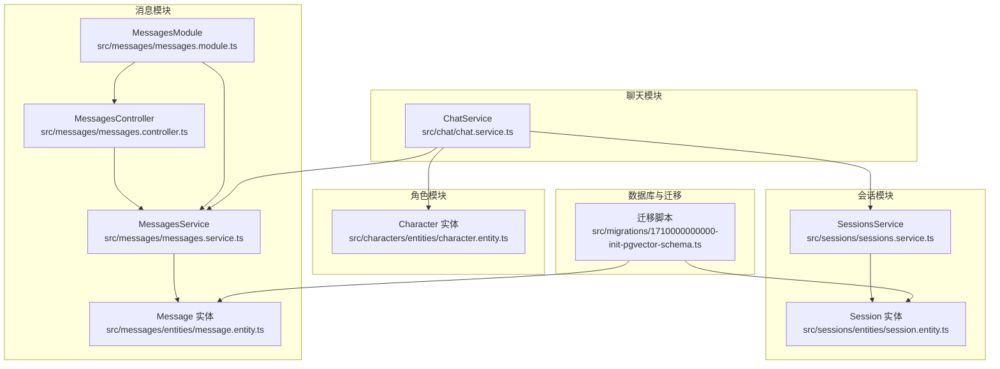
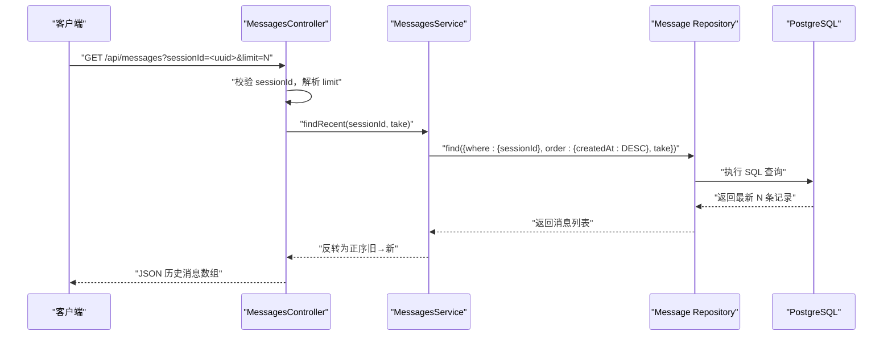
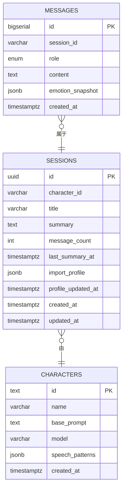
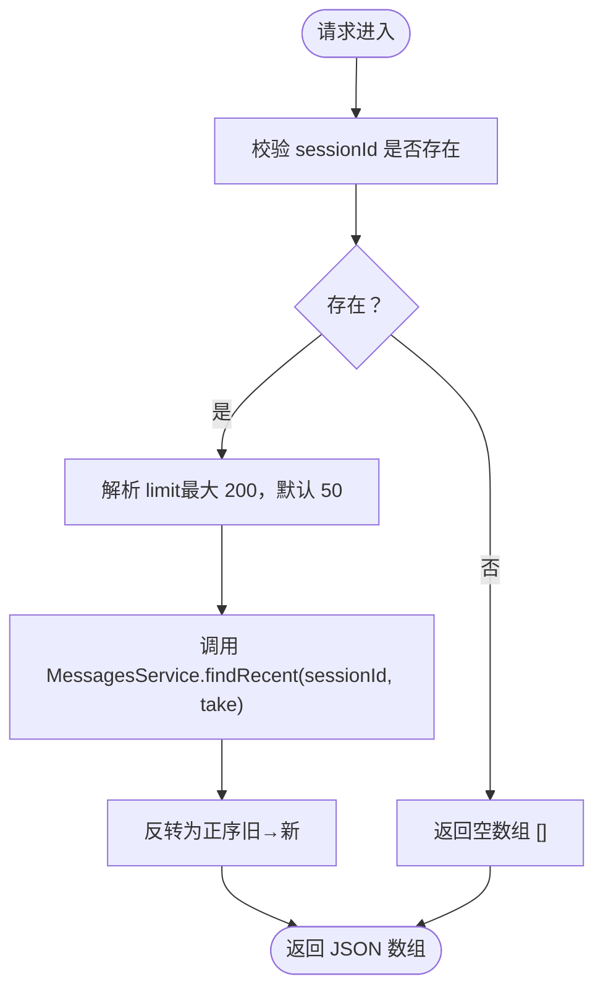
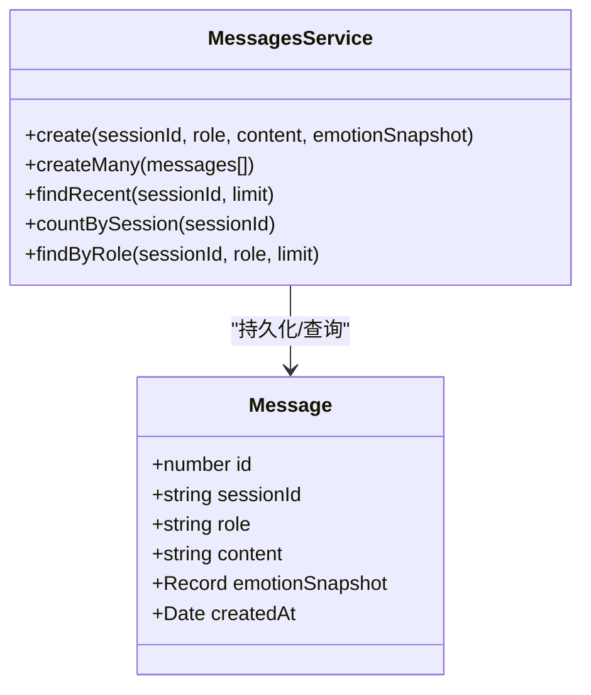
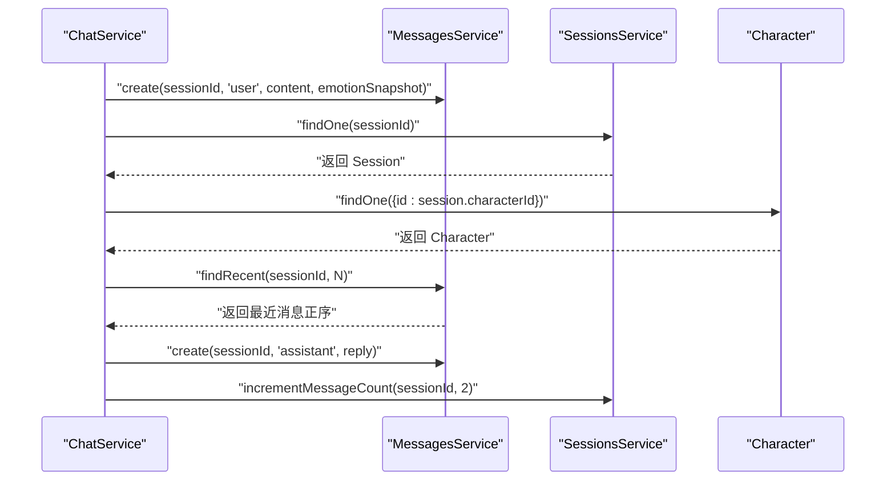
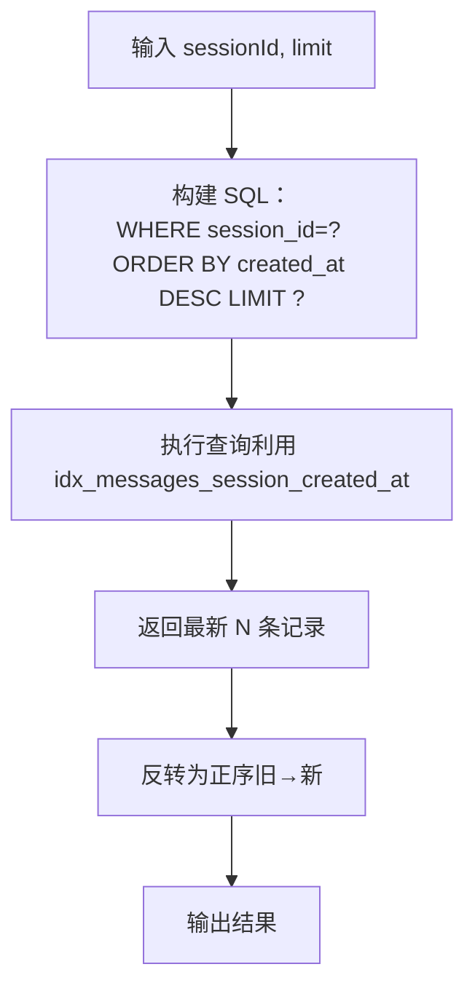
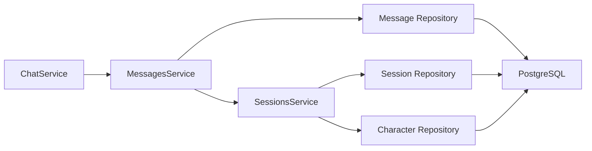

# 消息管理模块

<cite>
**本文引用的文件**
- [message.entity.ts](file://src/messages/entities/message.entity.ts)
- [messages.controller.ts](file://src/messages/messages.controller.ts)
- [messages.service.ts](file://src/messages/messages.service.ts)
- [messages.module.ts](file://src/messages/messages.module.ts)
- [session.entity.ts](file://src/sessions/entities/session.entity.ts)
- [sessions.service.ts](file://src/sessions/sessions.service.ts)
- [character.entity.ts](file://src/characters/entities/character.entity.ts)
- [1710000000000-init-pgvector-schema.ts](file://src/migrations/1710000000000-init-pgvector-schema.ts)
- [chat.service.ts](file://src/chat/chat.service.ts)
- [app.module.ts](file://src/app.module.ts)
- [Learning_Notes.md](file://docs/Learning_Notes.md)
</cite>

## 目录
1. [简介](#简介)
2. [项目结构](#项目结构)
3. [核心组件](#核心组件)
4. [架构总览](#架构总览)
5. [详细组件分析](#详细组件分析)
6. [依赖分析](#依赖分析)
7. [性能考虑](#性能考虑)
8. [故障排查指南](#故障排查指南)
9. [结论](#结论)
10. [附录](#附录)

## 简介
本文件为 AI Companion 的“消息管理模块”技术文档，聚焦消息实体设计与数据库映射、消息控制器 API 实现、消息服务的业务逻辑、消息与会话/角色的关联关系、消息历史查询优化策略，以及消息管理的最佳实践与完整 API 文档。文档同时给出关键流程的时序图与类图，帮助读者快速理解模块职责与交互。

## 项目结构
消息管理模块位于 src/messages，包含实体、控制器、服务与模块文件；配合迁移脚本完成数据库初始化与索引建立；在聊天模块中被消费以实现上下文拼接与滚动摘要等能力。

图表来源
- [messages.controller.ts:1-27](file://src/messages/messages.controller.ts#L1-L27)
- [messages.service.ts:1-93](file://src/messages/messages.service.ts#L1-L93)
- [message.entity.ts:1-25](file://src/messages/entities/message.entity.ts#L1-L25)
- [messages.module.ts:1-14](file://src/messages/messages.module.ts#L1-L14)
- [session.entity.ts:1-64](file://src/sessions/entities/session.entity.ts#L1-L64)
- [sessions.service.ts:1-62](file://src/sessions/sessions.service.ts#L1-L62)
- [character.entity.ts:1-23](file://src/characters/entities/character.entity.ts#L1-L23)
- [1710000000000-init-pgvector-schema.ts:1-107](file://src/migrations/1710000000000-init-pgvector-schema.ts#L1-L107)
- [chat.service.ts:1-547](file://src/chat/chat.service.ts#L1-L547)

章节来源
- [messages.controller.ts:1-27](file://src/messages/messages.controller.ts#L1-L27)
- [messages.service.ts:1-93](file://src/messages/messages.service.ts#L1-L93)
- [message.entity.ts:1-25](file://src/messages/entities/message.entity.ts#L1-L25)
- [messages.module.ts:1-14](file://src/messages/messages.module.ts#L1-L14)
- [session.entity.ts:1-64](file://src/sessions/entities/session.entity.ts#L1-L64)
- [sessions.service.ts:1-62](file://src/sessions/sessions.service.ts#L1-L62)
- [character.entity.ts:1-23](file://src/characters/entities/character.entity.ts#L1-L23)
- [1710000000000-init-pgvector-schema.ts:1-107](file://src/migrations/1710000000000-init-pgvector-schema.ts#L1-L107)
- [chat.service.ts:1-547](file://src/chat/chat.service.ts#L1-L547)

## 核心组件
- 消息实体：定义消息的主键、所属会话、角色、内容、情绪快照与创建时间等字段。
- 消息控制器：提供基于会话的消息历史查询接口，支持 limit 参数控制返回数量。
- 消息服务：负责消息的创建、批量导入、最近消息查询、按角色查询与计数统计。
- 会话实体与服务：维护会话元信息、消息计数与滚动摘要状态。
- 迁移脚本：初始化表结构、枚举类型与复合索引，支撑高效查询。

章节来源
- [message.entity.ts:1-25](file://src/messages/entities/message.entity.ts#L1-L25)
- [messages.controller.ts:1-27](file://src/messages/messages.controller.ts#L1-L27)
- [messages.service.ts:1-93](file://src/messages/messages.service.ts#L1-L93)
- [session.entity.ts:1-64](file://src/sessions/entities/session.entity.ts#L1-L64)
- [sessions.service.ts:1-62](file://src/sessions/sessions.service.ts#L1-L62)
- [1710000000000-init-pgvector-schema.ts:1-107](file://src/migrations/1710000000000-init-pgvector-schema.ts#L1-L107)

## 架构总览
消息管理模块采用典型的三层架构：控制器接收请求并校验参数，服务层封装数据访问与业务逻辑，实体与迁移脚本负责数据库映射与索引优化。聊天模块通过消息服务获取上下文，驱动 LLM 对话与记忆提取。

图表来源
- [messages.controller.ts:14-25](file://src/messages/messages.controller.ts#L14-L25)
- [messages.service.ts:67-74](file://src/messages/messages.service.ts#L67-L74)
- [1710000000000-init-pgvector-schema.ts:84-86](file://src/migrations/1710000000000-init-pgvector-schema.ts#L84-L86)

章节来源
- [messages.controller.ts:1-27](file://src/messages/messages.controller.ts#L1-L27)
- [messages.service.ts:1-93](file://src/messages/messages.service.ts#L1-L93)
- [1710000000000-init-pgvector-schema.ts:1-107](file://src/migrations/1710000000000-init-pgvector-schema.ts#L1-L107)

## 详细组件分析

### 消息实体与数据库映射
- 主键：自增整数 id（bigserial），适合高吞吐消息写入。
- 会话关联：session_id 为字符类型，与会话 UUID 对应；迁移脚本中定义为非空，确保消息归属明确。
- 角色枚举：messages_role_enum 包含 user/assistant，保证角色值域一致。
- 内容字段：content 为 text，支持长文本；emotion_snapshot 为 jsonb，便于扩展情绪分析。
- 时间戳：created_at 使用 timestamptz，默认值为 now()，统一时区与时序。

图表来源
- [message.entity.ts:1-25](file://src/messages/entities/message.entity.ts#L1-L25)
- [session.entity.ts:1-64](file://src/sessions/entities/session.entity.ts#L1-L64)
- [character.entity.ts:1-23](file://src/characters/entities/character.entity.ts#L1-L23)
- [1710000000000-init-pgvector-schema.ts:60-68](file://src/migrations/1710000000000-init-pgvector-schema.ts#L60-L68)

章节来源
- [message.entity.ts:1-25](file://src/messages/entities/message.entity.ts#L1-L25)
- [1710000000000-init-pgvector-schema.ts:60-68](file://src/migrations/1710000000000-init-pgvector-schema.ts#L60-L68)

### 消息控制器 API 实现
- 路径：/api/messages
- 方法：GET
- 查询参数：
  - sessionId：必填，会话 UUID
  - limit：可选，最大 200，默认 50
- 返回：按时间正序排列的历史消息数组（旧→新），便于拼接到 LLM 请求中

图表来源
- [messages.controller.ts:14-25](file://src/messages/messages.controller.ts#L14-L25)
- [messages.service.ts:67-74](file://src/messages/messages.service.ts#L67-L74)

章节来源
- [messages.controller.ts:1-27](file://src/messages/messages.controller.ts#L1-L27)

### 消息服务业务逻辑
- create：保存用户消息或 AI 回复，支持传入情绪快照
- createMany：批量导入历史消息
- findRecent：按会话查询最近 N 条消息，按创建时间倒序取出后再反转为正序
- countBySession：统计会话消息总数，用于滚动摘要触发条件
- findByRole：按角色查询，用于风格分析等场景

图表来源
- [messages.service.ts:22-92](file://src/messages/messages.service.ts#L22-L92)
- [message.entity.ts:5-24](file://src/messages/entities/message.entity.ts#L5-L24)

章节来源
- [messages.service.ts:1-93](file://src/messages/messages.service.ts#L1-L93)

### 与会话和角色的关联关系
- 消息与会话：messages.session_id 指向 sessions.id，迁移脚本中定义为非空，确保消息归属清晰。
- 会话与角色：sessions.character_id 指向 characters.id，用于确定该会话使用的角色人格与模型。
- 级联与约束：迁移脚本未显式声明外键约束，但通过业务层保证一致性；消息删除不会自动影响会话，需在业务层处理。

图表来源
- [chat.service.ts:42-113](file://src/chat/chat.service.ts#L42-L113)
- [messages.service.ts:36-48](file://src/messages/messages.service.ts#L36-L48)
- [sessions.service.ts:22-28](file://src/sessions/sessions.service.ts#L22-L28)
- [character.entity.ts:1-23](file://src/characters/entities/character.entity.ts#L1-L23)

章节来源
- [chat.service.ts:1-547](file://src/chat/chat.service.ts#L1-L547)
- [session.entity.ts:1-64](file://src/sessions/entities/session.entity.ts#L1-L64)
- [character.entity.ts:1-23](file://src/characters/entities/character.entity.ts#L1-L23)

### 消息历史查询优化
- 复合索引：messages(session_id, created_at) 支持按会话与时间排序的高效查询
- 查询策略：先按 created_at DESC 取最新 N 条，再反转为正序，满足 LLM 上下文拼接要求
- 性能建议：
  - 控制 limit 上限（默认 50，最大 200）
  - 使用复合索引避免全表扫描
  - 对高频查询可考虑物化视图或缓存近期上下文

图表来源
- [messages.service.ts:67-74](file://src/messages/messages.service.ts#L67-L74)
- [1710000000000-init-pgvector-schema.ts:84-86](file://src/migrations/1710000000000-init-pgvector-schema.ts#L84-L86)

章节来源
- [messages.service.ts:63-74](file://src/messages/messages.service.ts#L63-L74)
- [1710000000000-init-pgvector-schema.ts:84-86](file://src/migrations/1710000000000-init-pgvector-schema.ts#L84-L86)

### 消息管理最佳实践
- 消息大小限制：建议对 content 设置合理上限（如 65536 字符），超出则截断或拆分
- 内容安全检查：对用户输入进行基础清洗与敏感词过滤，避免恶意内容注入
- 数据备份策略：定期导出会话与消息数据，保留 JSON 格式以便审计与回放
- 存储策略：结合滚动摘要减少上下文长度，提升 LLM 效率与成本控制
- 日志与监控：记录消息创建/查询耗时、错误码与异常堆栈，便于定位性能瓶颈

## 依赖分析
- 模块内聚：消息模块仅依赖 TypeORM 仓库与自身实体，职责单一
- 模块耦合：消息服务被聊天模块直接依赖，形成核心链路；会话与角色模块提供上下文支撑
- 外部依赖：PostgreSQL + pgvector 扩展，迁移脚本负责表结构与索引初始化

图表来源
- [chat.service.ts:30-40](file://src/chat/chat.service.ts#L30-L40)
- [messages.service.ts:24-27](file://src/messages/messages.service.ts#L24-L27)
- [sessions.service.ts:8-11](file://src/sessions/sessions.service.ts#L8-L11)
- [app.module.ts:37-50](file://src/app.module.ts#L37-L50)

章节来源
- [chat.service.ts:1-547](file://src/chat/chat.service.ts#L1-L547)
- [messages.service.ts:1-93](file://src/messages/messages.service.ts#L1-L93)
- [sessions.service.ts:1-62](file://src/sessions/sessions.service.ts#L1-L62)
- [app.module.ts:1-64](file://src/app.module.ts#L1-L64)

## 性能考虑
- 写入性能：消息表使用自增主键，写入吞吐高；批量导入使用 createMany 提升效率
- 查询性能：复合索引 idx_messages_session_created_at 显著降低按会话查询成本
- 上下文拼接：findRecent 先倒序取 N 再反转，避免额外排序开销
- 滚动摘要：当消息数达到阈值且距离上次摘要超过设定时间，触发摘要以缩短上下文长度

## 故障排查指南
- 控制器返回空数组：确认 sessionId 是否传递，limit 是否超过上限
- 查询缓慢：检查是否命中 idx_messages_session_created_at；避免在 session_id 上做函数计算
- 消息顺序异常：确认调用方是否正确使用 findRecent 返回的正序结果
- 会话不存在：SessionsService.findOne 会在找不到会话时抛出异常，需在上游捕获并提示

章节来源
- [messages.controller.ts:20-22](file://src/messages/messages.controller.ts#L20-L22)
- [messages.service.ts:67-74](file://src/messages/messages.service.ts#L67-L74)
- [sessions.service.ts:22-28](file://src/sessions/sessions.service.ts#L22-L28)

## 结论
消息管理模块通过简洁的实体设计、高效的查询索引与清晰的三层架构，为聊天模块提供了稳定的上下文支撑。配合滚动摘要与批量导入能力，可在保证性能的同时维持高质量的对话体验。后续可进一步引入消息归档与冷热分离策略，以应对更大规模的数据增长。

## 附录

### API 文档
- 获取会话历史消息
  - 方法：GET
  - 路径：/api/messages
  - 查询参数：
    - sessionId：字符串，必填
    - limit：数字，可选，默认 50，最大 200
  - 返回：消息数组（按时间正序）

章节来源
- [messages.controller.ts:7-9](file://src/messages/messages.controller.ts#L7-L9)
- [messages.controller.ts:14-25](file://src/messages/messages.controller.ts#L14-L25)

### 实际应用场景示例
- 即时对话上下文拼接：调用 findRecent 获取最近 N 条消息，拼接到 LLM 请求中
- 滚动摘要：当会话消息数达到阈值且时间间隔满足条件，生成摘要并清零计数
- 风格分析：按角色查询消息，统计用户或 AI 的表达特征

章节来源
- [chat.service.ts:63-98](file://src/chat/chat.service.ts#L63-L98)
- [chat.service.ts:334-374](file://src/chat/chat.service.ts#L334-L374)
- [messages.service.ts:84-91](file://src/messages/messages.service.ts#L84-L91)