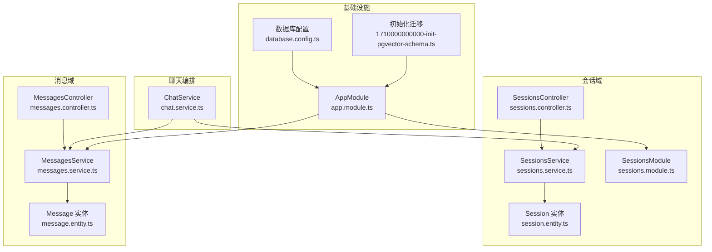
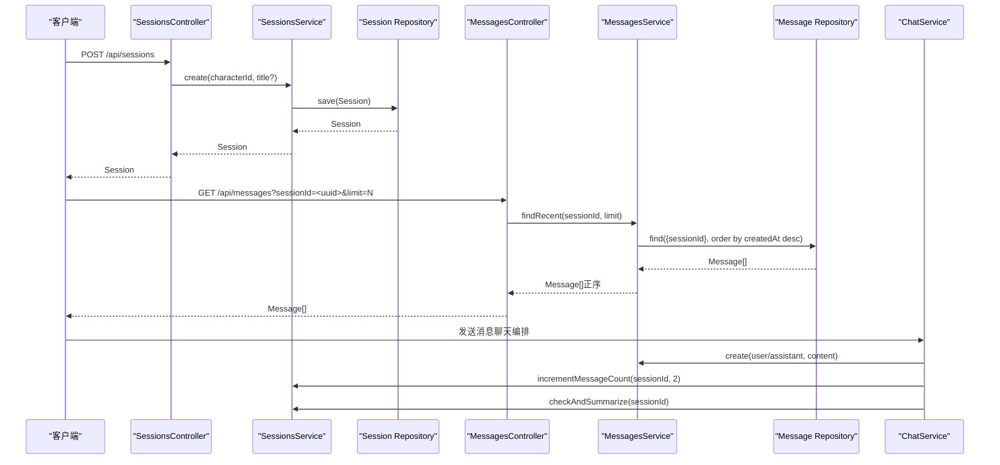
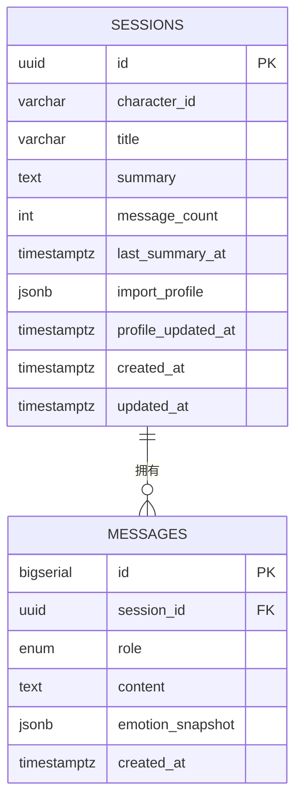
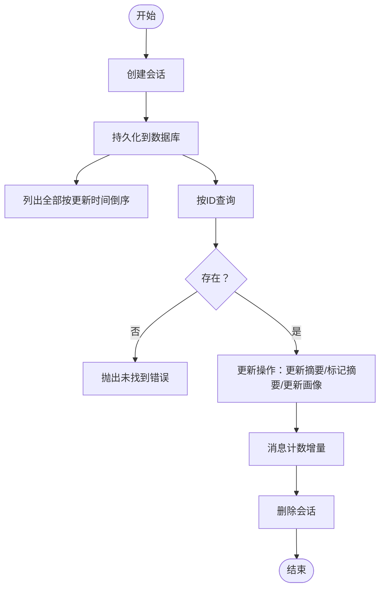
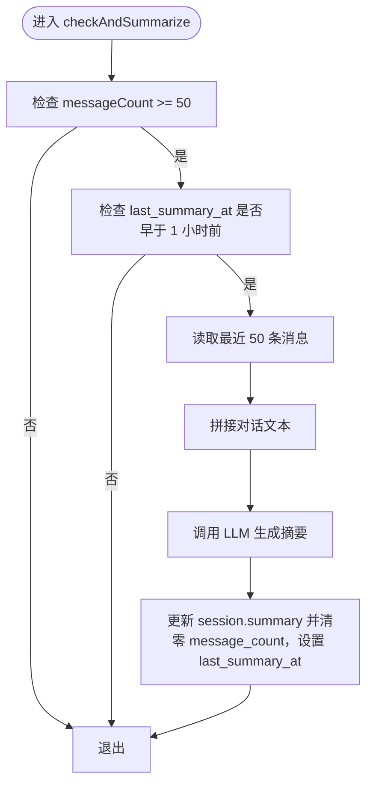
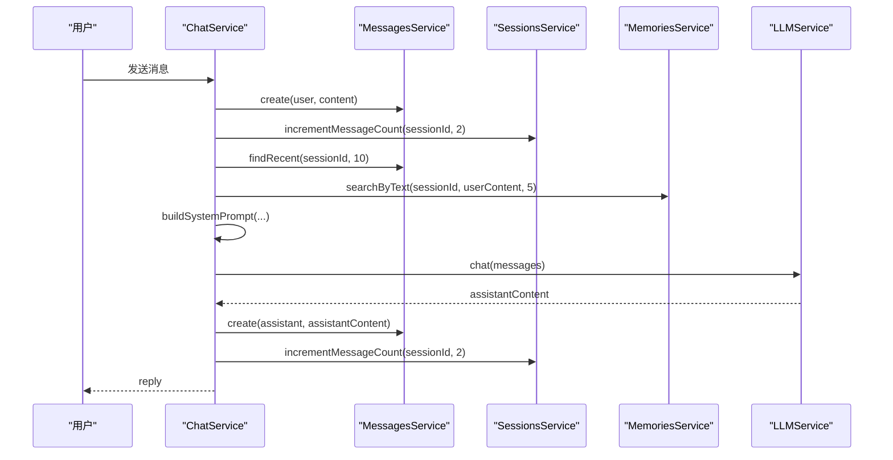
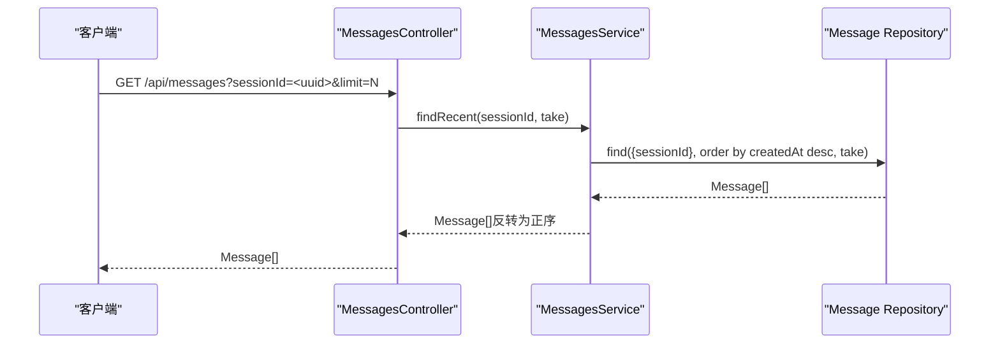
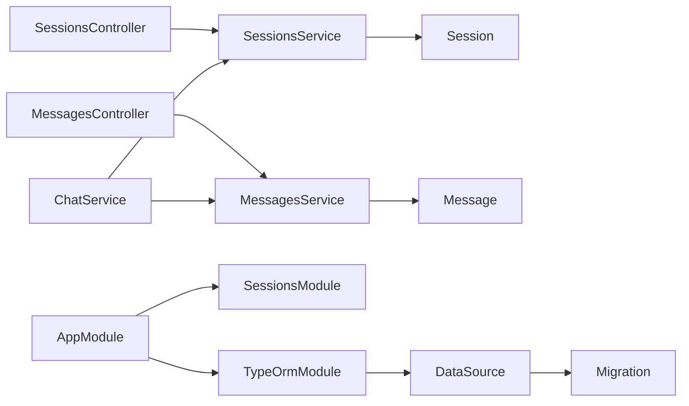

# 会话管理

<cite>
**本文引用的文件**
- [session.entity.ts](file://src/sessions/entities/session.entity.ts)
- [sessions.service.ts](file://src/sessions/sessions.service.ts)
- [sessions.controller.ts](file://src/sessions/sessions.controller.ts)
- [sessions.module.ts](file://src/sessions/sessions.module.ts)
- [message.entity.ts](file://src/messages/entities/message.entity.ts)
- [messages.service.ts](file://src/messages/messages.service.ts)
- [messages.controller.ts](file://src/messages/messages.controller.ts)
- [chat.service.ts](file://src/chat/chat.service.ts)
- [database.config.ts](file://src/config/database.config.ts)
- [1710000000000-init-pgvector-schema.ts](file://src/migrations/1710000000000-init-pgvector-schema.ts)
- [app.module.ts](file://src/app.module.ts)
</cite>

## 目录
1. [简介](#简介)
2. [项目结构](#项目结构)
3. [核心组件](#核心组件)
4. [架构总览](#架构总览)
5. [详细组件分析](#详细组件分析)
6. [依赖关系分析](#依赖关系分析)
7. [性能考量](#性能考量)
8. [故障排查指南](#故障排查指南)
9. [结论](#结论)
10. [附录](#附录)

## 简介
本技术文档围绕会话管理系统展开，系统性阐述会话生命周期管理（创建、更新、查询、删除）、会话实体设计（字段、索引、约束）、会话摘要生成与消息计数统计、上下文维护机制，以及会话与聊天记录的关系与基于会话ID的消息检索方式。同时给出最佳实践与性能优化建议，帮助开发者在保证功能正确性的前提下提升系统稳定性与吞吐能力。

## 项目结构
会话管理相关代码主要分布在以下模块：
- 会话领域：实体、服务、控制器、模块
- 消息领域：实体、服务、控制器
- 聊天编排：核心业务流程，负责上下文组装、摘要生成、消息计数与异步任务调度
- 数据库配置与迁移：PostgreSQL + pgvector 初始化与表结构

图表来源
- [session.entity.ts:32-63](file://src/sessions/entities/session.entity.ts#L32-L63)
- [sessions.service.ts:6-11](file://src/sessions/sessions.service.ts#L6-L11)
- [sessions.controller.ts:4-27](file://src/sessions/sessions.controller.ts#L4-L27)
- [sessions.module.ts:7-13](file://src/sessions/sessions.module.ts#L7-L13)
- [message.entity.ts:5-24](file://src/messages/entities/message.entity.ts#L5-L24)
- [messages.service.ts:22-27](file://src/messages/messages.service.ts#L22-L27)
- [messages.controller.ts:10-26](file://src/messages/messages.controller.ts#L10-L26)
- [chat.service.ts:30-40](file://src/chat/chat.service.ts#L30-L40)
- [database.config.ts:8-20](file://src/config/database.config.ts#L8-L20)
- [1710000000000-init-pgvector-schema.ts:34-68](file://src/migrations/1710000000000-init-pgvector-schema.ts#L34-L68)
- [app.module.ts:18-62](file://src/app.module.ts#L18-L62)

章节来源
- [session.entity.ts:32-63](file://src/sessions/entities/session.entity.ts#L32-L63)
- [sessions.service.ts:6-11](file://src/sessions/sessions.service.ts#L6-L11)
- [sessions.controller.ts:4-27](file://src/sessions/sessions.controller.ts#L4-L27)
- [sessions.module.ts:7-13](file://src/sessions/sessions.module.ts#L7-L13)
- [message.entity.ts:5-24](file://src/messages/entities/message.entity.ts#L5-L24)
- [messages.service.ts:22-27](file://src/messages/messages.service.ts#L22-L27)
- [messages.controller.ts:10-26](file://src/messages/messages.controller.ts#L10-L26)
- [chat.service.ts:30-40](file://src/chat/chat.service.ts#L30-L40)
- [database.config.ts:8-20](file://src/config/database.config.ts#L8-L20)
- [1710000000000-init-pgvector-schema.ts:34-68](file://src/migrations/1710000000000-init-pgvector-schema.ts#L34-L68)
- [app.module.ts:18-62](file://src/app.module.ts#L18-L62)

## 核心组件
- 会话实体（Session）：承载会话元数据、摘要、消息计数、导入画像与时间戳等。
- 会话服务（SessionsService）：提供会话创建、查询、更新摘要、导入画像、消息计数增量、删除等操作。
- 会话控制器（SessionsController）：暴露 REST API，供前端或外部系统调用。
- 消息实体（Message）：记录每条消息的会话归属、角色、内容、情绪快照与创建时间。
- 消息服务（MessagesService）：提供消息保存、批量导入、最近消息读取、按角色筛选、消息计数统计等。
- 聊天服务（ChatService）：核心业务编排，负责上下文组装、滚动摘要检查、异步记忆提取与消息计数更新。
- 数据库配置与迁移：PostgreSQL + pgvector 初始化脚本，确保 sessions 与 messages 表结构一致。

章节来源
- [session.entity.ts:32-63](file://src/sessions/entities/session.entity.ts#L32-L63)
- [sessions.service.ts:6-61](file://src/sessions/sessions.service.ts#L6-L61)
- [sessions.controller.ts:1-28](file://src/sessions/sessions.controller.ts#L1-L28)
- [message.entity.ts:5-24](file://src/messages/entities/message.entity.ts#L5-L24)
- [messages.service.ts:13-92](file://src/messages/messages.service.ts#L13-L92)
- [chat.service.ts:13-28](file://src/chat/chat.service.ts#L13-L28)
- [database.config.ts:8-20](file://src/config/database.config.ts#L8-L20)
- [1710000000000-init-pgvector-schema.ts:34-68](file://src/migrations/1710000000000-init-pgvector-schema.ts#L34-L68)

## 架构总览
会话管理采用分层架构：
- 表现层：SessionsController、MessagesController
- 应用层：SessionsService、MessagesService、ChatService
- 领域层：Session、Message 实体
- 基础设施：TypeORM 数据源、PostgreSQL + pgvector 迁移

图表来源
- [sessions.controller.ts:8-11](file://src/sessions/sessions.controller.ts#L8-L11)
- [sessions.service.ts:13-16](file://src/sessions/sessions.service.ts#L13-L16)
- [messages.controller.ts:14-25](file://src/messages/messages.controller.ts#L14-L25)
- [messages.service.ts:67-74](file://src/messages/messages.service.ts#L67-L74)
- [chat.service.ts:42-113](file://src/chat/chat.service.ts#L42-L113)

## 详细组件分析

### 会话实体设计与约束
- 主键：UUID，自动生成
- 关联字段：character_id（角色 ID）
- 可选字段：title（标题）、summary（摘要）、import_profile（导入画像 JSONB）
- 计数与时间：message_count（默认 0）、last_summary_at（上次摘要时间）、profile_updated_at（画像更新时间）
- 时间戳：created_at、updated_at（自动维护）

图表来源
- [session.entity.ts:32-63](file://src/sessions/entities/session.entity.ts#L32-L63)
- [message.entity.ts:5-24](file://src/messages/entities/message.entity.ts#L5-L24)
- [1710000000000-init-pgvector-schema.ts:34-68](file://src/migrations/1710000000000-init-pgvector-schema.ts#L34-L68)

章节来源
- [session.entity.ts:32-63](file://src/sessions/entities/session.entity.ts#L32-L63)
- [1710000000000-init-pgvector-schema.ts:34-68](file://src/migrations/1710000000000-init-pgvector-schema.ts#L34-L68)

### 会话生命周期管理
- 创建：SessionsController 接收请求，调用 SessionsService.create，持久化后返回会话对象。
- 查询：SessionsController 支持列出全部（按更新时间倒序）与按 ID 查询；SessionsService.findOne 增加存在性校验。
- 更新：支持更新摘要、标记已摘要（重置计数并记录摘要时间）、更新导入画像（同时更新画像更新时间）。
- 删除：SessionsController 删除指定会话，内部先校验存在性，再执行删除。

图表来源
- [sessions.controller.ts:8-26](file://src/sessions/sessions.controller.ts#L8-L26)
- [sessions.service.ts:13-60](file://src/sessions/sessions.service.ts#L13-L60)

章节来源
- [sessions.controller.ts:1-28](file://src/sessions/sessions.controller.ts#L1-L28)
- [sessions.service.ts:13-60](file://src/sessions/sessions.service.ts#L13-L60)

### 会话摘要生成与消息计数统计
- 摘要生成触发条件：
  - 消息数 ≥ 50 条
  - 距离上次摘要 ≥ 1 小时（使用 last_summary_at 判断，避免因会话更新导致的误判）
- 摘要生成流程：
  - 读取最近 50 条消息，拼接为对话文本
  - 调用 LLM 生成摘要
  - 更新 session.summary，并将 message_count 清零，记录 last_summary_at
- 消息计数统计：
  - 每次保存用户消息与 AI 回复后，调用 SessionsService.incrementMessageCount(sessionId, 2)
  - MessagesService 提供 countBySession 用于外部统计

图表来源
- [chat.service.ts:334-374](file://src/chat/chat.service.ts#L334-L374)
- [sessions.service.ts:35-42](file://src/sessions/sessions.service.ts#L35-L42)
- [messages.service.ts:76-82](file://src/messages/messages.service.ts#L76-L82)

章节来源
- [chat.service.ts:334-374](file://src/chat/chat.service.ts#L334-L374)
- [sessions.service.ts:35-42](file://src/sessions/sessions.service.ts#L35-L42)
- [messages.service.ts:76-82](file://src/messages/messages.service.ts#L76-L82)

### 上下文维护机制
- 最近消息读取：MessagesService.findRecent(sessionId, limit) 按时间倒序取出最新 N 条，再反转为正序，满足 LLM 对话数组的交替顺序要求。
- 系统 Prompt 组装：ChatService.buildSystemPrompt 将角色基础提示、滚动摘要、导入画像、动态记忆、用户/AI 情绪状态等多层次信息拼接为系统提示，作为 LLM 输入的一部分。
- 情绪与心情：用户输入经 jiwen 情绪分析，AI 情绪受用户影响产生共鸣波动，二者汇总后参与系统提示。

图表来源
- [chat.service.ts:42-113](file://src/chat/chat.service.ts#L42-L113)
- [messages.service.ts:67-74](file://src/messages/messages.service.ts#L67-L74)
- [sessions.service.ts:52-55](file://src/sessions/sessions.service.ts#L52-L55)

章节来源
- [chat.service.ts:42-113](file://src/chat/chat.service.ts#L42-L113)
- [messages.service.ts:67-74](file://src/messages/messages.service.ts#L67-L74)
- [sessions.service.ts:52-55](file://src/sessions/sessions.service.ts#L52-L55)

### 会话与聊天记录的关系及消息检索
- 关系：Message.session_id 外键关联 Session.id；一个会话包含多条消息。
- 消息检索：
  - 按会话 ID 获取历史消息：MessagesController.findBySession 接收 sessionId 与 limit，调用 MessagesService.findRecent 返回按时间正序排列的消息列表。
  - 统计消息数量：MessagesService.countBySession 用于判断是否触发滚动摘要。
  - 按角色筛选：MessagesService.findByRole 支持按用户或 AI 角色筛选，便于风格分析。

图表来源
- [messages.controller.ts:14-25](file://src/messages/messages.controller.ts#L14-L25)
- [messages.service.ts:67-74](file://src/messages/messages.service.ts#L67-L74)

章节来源
- [messages.controller.ts:14-25](file://src/messages/messages.controller.ts#L14-L25)
- [messages.service.ts:67-74](file://src/messages/messages.service.ts#L67-L74)

## 依赖关系分析
- 会话模块：SessionsModule 导入 TypeOrmModule.forFeature([Session])，注入 SessionsService 与 SessionsController。
- 消息模块：MessagesService 依赖 Message 实体仓库；MessagesController 依赖 MessagesService。
- 聊天模块：ChatService 依赖 SessionsService、MessagesService、MemoriesService、LLMService、JiwenEmotionService、MoodService。
- 数据库：AppModule 使用 TypeOrmModule.forRoot 配置 PostgreSQL，加载迁移脚本；database.config.ts 提供 DataSource 配置。

图表来源
- [sessions.module.ts:7-13](file://src/sessions/sessions.module.ts#L7-L13)
- [messages.service.ts:22-27](file://src/messages/messages.service.ts#L22-L27)
- [chat.service.ts:30-40](file://src/chat/chat.service.ts#L30-L40)
- [app.module.ts:37-50](file://src/app.module.ts#L37-L50)
- [database.config.ts:8-20](file://src/config/database.config.ts#L8-L20)

章节来源
- [sessions.module.ts:7-13](file://src/sessions/sessions.module.ts#L7-L13)
- [messages.service.ts:22-27](file://src/messages/messages.service.ts#L22-L27)
- [chat.service.ts:30-40](file://src/chat/chat.service.ts#L30-L40)
- [app.module.ts:37-50](file://src/app.module.ts#L37-L50)
- [database.config.ts:8-20](file://src/config/database.config.ts#L8-L20)

## 性能考量
- 会话查询排序：SessionsService.findAll 使用 updatedAt 倒序，建议在 updated_at 上建立索引以优化排序与分页。
- 消息检索：MessagesService.findRecent 依赖 sessionId + createdAt 排序，建议在 messages(session_id, created_at desc) 上建立复合索引，减少排序成本。
- 摘要触发阈值：当前阈值为 50 条消息且至少 1 小时间隔，可根据业务量调整以平衡上下文质量与计算开销。
- 异步任务：滚动摘要与记忆提取通过 setImmediate 异步执行，避免阻塞主线程；建议结合队列或后台任务系统进一步解耦。
- 数据库连接：生产环境启用 migrationsRun 并关闭 synchronize，确保表结构稳定与可追踪。

[本节为通用性能建议，不直接分析具体文件]

## 故障排查指南
- 会话不存在：SessionsService.findOne 若未找到会话，抛出未找到异常。前端应捕获并提示用户。
- 消息检索为空：MessagesController.findBySession 当 sessionId 缺失时返回空数组；确认前端传参正确。
- 摘要未生成：检查 messageCount 是否达到阈值、last_summary_at 是否超过 1 小时；确认 LLM 服务可用。
- 情绪与心情：若情绪分析或 AI 情绪汇总异常，检查对应服务的日志输出与网络连通性。

章节来源
- [sessions.service.ts:22-28](file://src/sessions/sessions.service.ts#L22-L28)
- [messages.controller.ts:20-25](file://src/messages/messages.controller.ts#L20-L25)
- [chat.service.ts:334-374](file://src/chat/chat.service.ts#L334-L374)

## 结论
会话管理系统通过清晰的分层设计与职责划分，实现了会话生命周期的完整闭环：从创建、查询、更新到删除；并通过消息计数与滚动摘要机制维持上下文的有效性。结合消息检索与系统 Prompt 组装，系统能够在保持低延迟的同时提供高质量的对话体验。建议在生产环境中强化索引策略、异步任务解耦与监控告警，持续优化吞吐与稳定性。

[本节为总结性内容，不直接分析具体文件]

## 附录
- API 端点概览
  - 会话
    - POST /api/sessions：创建会话
    - GET /api/sessions：列出会话（按更新时间倒序）
    - GET /api/sessions/:id：按 ID 查询
    - DELETE /api/sessions/:id：删除会话
  - 消息
    - GET /api/messages?sessionId=<uuid>&limit=<N>：按会话 ID 获取历史消息（正序）

章节来源
- [sessions.controller.ts:8-26](file://src/sessions/sessions.controller.ts#L8-L26)
- [messages.controller.ts:14-25](file://src/messages/messages.controller.ts#L14-L25)