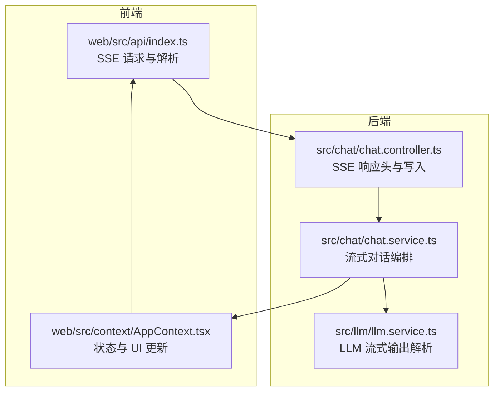
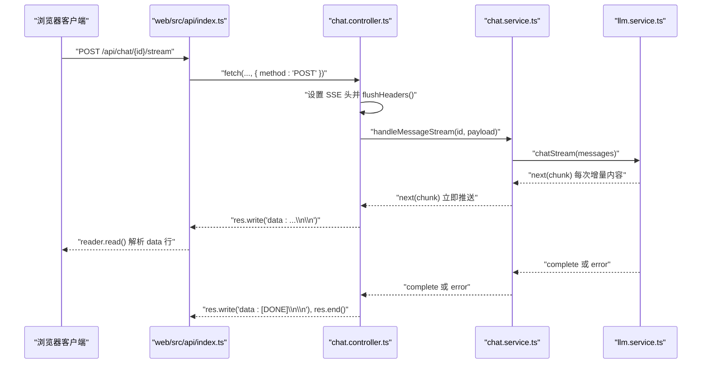
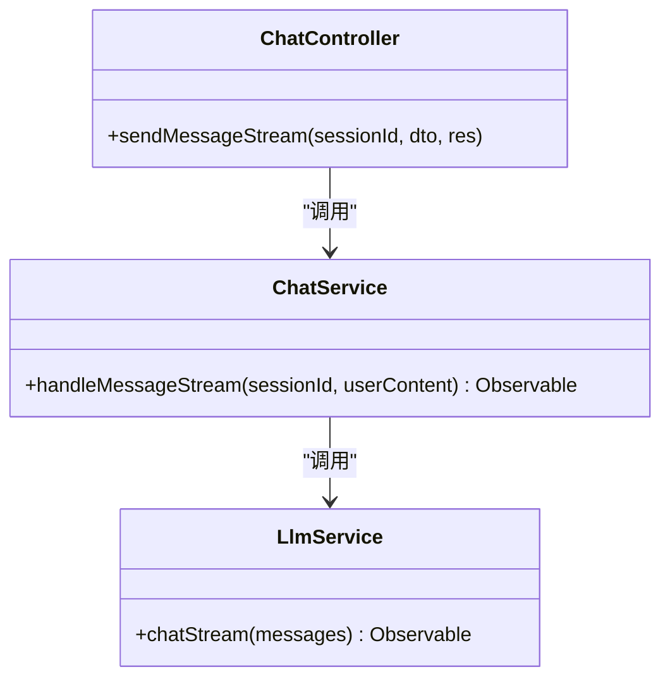
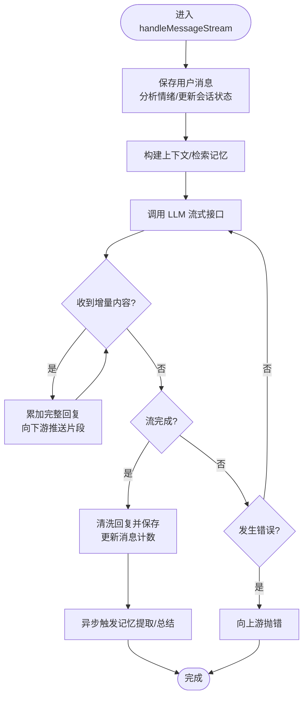
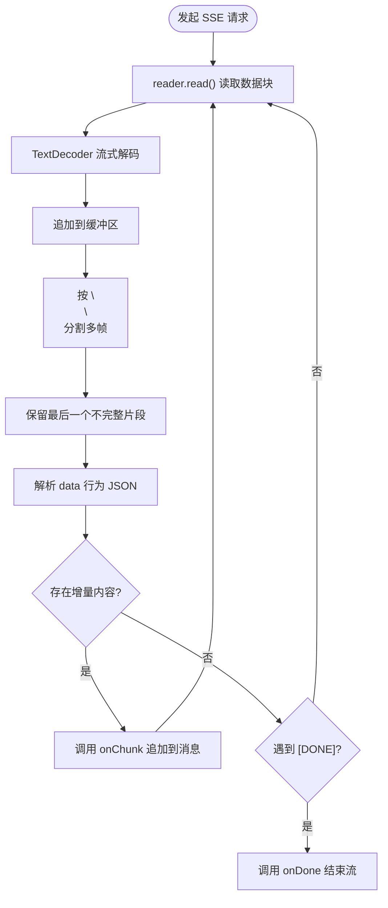
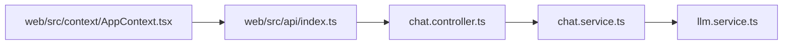

# 流式响应处理

<cite>
**本文引用的文件**
- [src/chat/chat.controller.ts](file://src/chat/chat.controller.ts)
- [src/chat/chat.service.ts](file://src/chat/chat.service.ts)
- [src/llm/llm.service.ts](file://src/llm/llm.service.ts)
- [web/src/api/index.ts](file://web/src/api/index.ts)
- [web/src/context/AppContext.tsx](file://web/src/context/AppContext.tsx)
- [docs/Learning_Notes.md](file://docs/Learning_Notes.md)
</cite>

## 目录
1. [引言](#引言)
2. [项目结构](#项目结构)
3. [核心组件](#核心组件)
4. [架构总览](#架构总览)
5. [详细组件分析](#详细组件分析)
6. [依赖关系分析](#依赖关系分析)
7. [性能考虑](#性能考虑)
8. [故障排查指南](#故障排查指南)
9. [结论](#结论)
10. [附录](#附录)

## 引言
本文件围绕“流式响应处理”主题，系统阐述基于 Server-Sent Events（SSE）的实时消息推送机制，覆盖从后端控制器、服务层到前端 API 与 UI 的完整链路。重点包括：
- SSE 实现原理与使用场景
- 流式聊天接口的响应头设置、数据格式化与连接管理
- 将大模型（LLM）的流式输出转换为实时消息流的机制，含缓冲区管理与错误处理
- 性能优化策略（背压控制与内存管理）
- 调试技巧与监控方案

## 项目结构
本项目采用 NestJS 后端 + 前端 Web 应用的分层架构，流式聊天能力由以下模块协同实现：
- 控制器层：负责路由与 HTTP 响应头设置
- 服务层：负责业务流程编排与流式数据的产生
- LLM 服务：负责对接外部模型并解析流式数据
- 前端 API 层：负责发起 SSE 请求与解析
- 前端上下文层：负责状态更新与 UI 响应

图表来源
- [src/chat/chat.controller.ts:46-75](file://src/chat/chat.controller.ts#L46-L75)
- [src/chat/chat.service.ts:130-231](file://src/chat/chat.service.ts#L130-L231)
- [src/llm/llm.service.ts:97-146](file://src/llm/llm.service.ts#L97-L146)
- [web/src/api/index.ts:137-170](file://web/src/api/index.ts#L137-L170)
- [web/src/context/AppContext.tsx:326-347](file://web/src/context/AppContext.tsx#L326-L347)

章节来源
- [src/chat/chat.controller.ts:16-75](file://src/chat/chat.controller.ts#L16-L75)
- [src/chat/chat.service.ts:115-231](file://src/chat/chat.service.ts#L115-L231)
- [src/llm/llm.service.ts:97-146](file://src/llm/llm.service.ts#L97-L146)
- [web/src/api/index.ts:114-170](file://web/src/api/index.ts#L114-L170)
- [web/src/context/AppContext.tsx:90-143](file://web/src/context/AppContext.tsx#L90-L143)

## 核心组件
- SSE 控制器：设置 SSE 必需响应头，将 Observable 的流式片段写入响应体，并在完成或错误时发送终止标记
- 流式聊天服务：封装消息持久化、上下文构建、记忆检索与 LLM 流式调用；流结束后异步保存回复并触发记忆提取
- LLM 服务：通过原生 HTTPS 请求连接外部模型，按行解析 SSE，提取增量内容并逐片发出
- 前端 API：使用 fetch 发起 SSE 请求，解析 data 行，拼接缓冲区，逐段回传给 UI
- 前端上下文：接收流式片段，追加到最新一条助手消息，完成时清除流式状态

章节来源
- [src/chat/chat.controller.ts:46-75](file://src/chat/chat.controller.ts#L46-L75)
- [src/chat/chat.service.ts:130-231](file://src/chat/chat.service.ts#L130-L231)
- [src/llm/llm.service.ts:97-146](file://src/llm/llm.service.ts#L97-L146)
- [web/src/api/index.ts:137-170](file://web/src/api/index.ts#L137-L170)
- [web/src/context/AppContext.tsx:90-143](file://web/src/context/AppContext.tsx#L90-L143)

## 架构总览
下面的序列图展示了从客户端到后端再到 LLM 的完整调用链路，以及后端如何将流式片段回推给客户端。

图表来源
- [src/chat/chat.controller.ts:46-75](file://src/chat/chat.controller.ts#L46-L75)
- [src/chat/chat.service.ts:130-231](file://src/chat/chat.service.ts#L130-L231)
- [src/llm/llm.service.ts:97-146](file://src/llm/llm.service.ts#L97-L146)
- [web/src/api/index.ts:137-170](file://web/src/api/index.ts#L137-L170)

## 详细组件分析

### SSE 控制器（响应头与写入）
- 响应头设置
  - Content-Type: text/event-stream; charset=utf-8
  - Cache-Control: no-cache
  - Connection: keep-alive
  - X-Accel-Buffering: no（禁用 Nginx 缓冲，确保实时性）
- 写入策略
  - 使用 res.write 写入标准 SSE 格式：data: <JSON 字符串>\n\n
  - 错误时写入包含错误信息的数据帧并结束连接
  - 完成时写入 [DONE] 标记并结束连接

章节来源
- [src/chat/chat.controller.ts:52-75](file://src/chat/chat.controller.ts#L52-L75)

### 流式聊天服务（编排与生命周期）
- 生命周期
  - 步骤 1-3：保存用户消息、更新情绪与会话状态、读取上下文与检索记忆
  - 步骤 4：返回 Observable，开始流式推送 AI 回复
  - 步骤 5：流结束后异步保存 AI 回复、更新消息计数、触发记忆提取与总结
- 关键点
  - 使用 Observable 包装异步流程，确保异常与完成事件正确传播
  - 在 next 中累积完整回复，以便完成后清洗与持久化

章节来源
- [src/chat/chat.service.ts:119-231](file://src/chat/chat.service.ts#L119-L231)

### LLM 服务（SSE 解析与增量推送）
- 连接与请求
  - 使用 Node.js 原生 https.request 连接外部模型
  - 写入请求体并监听响应流
- SSE 解析
  - 基于行缓冲解析，识别 data: 前缀行
  - 忽略空行与非 data 行
  - 对 JSON 片段解析，提取 choices[0].delta.content 作为增量内容
  - 遇到 [DONE] 标记时完成流
- 取消与错误
  - 订阅取消时销毁请求
  - 请求错误时向上游抛出

章节来源
- [src/llm/llm.service.ts:97-146](file://src/llm/llm.service.ts#L97-L146)

### 前端 API（SSE 请求与解析）
- 请求
  - 使用 fetch 发起 POST 请求，携带 JSON 负载
  - 使用 AbortController 支持取消
- 解析
  - 通过 ReadableStream reader 逐块读取
  - TextDecoder 流式解码，维护缓冲区
  - 以 \n\n 分割多条数据帧，保留最后一个不完整片段
  - 提取 data: JSON 字符串，解析增量内容
- 终止
  - 遇到 [DONE] 或流结束时，调用 onDone 回调

章节来源
- [web/src/api/index.ts:137-170](file://web/src/api/index.ts#L137-L170)

### 前端上下文（状态与 UI 更新）
- 状态更新
  - APPEND_CHUNK：将新片段追加到最新一条助手消息
  - FINISH_STREAM：结束流式状态，恢复在线状态
  - STREAM_ERROR：将错误信息写入最后一条助手消息并提示
- 交互
  - 发送消息时触发流式发送，回调驱动 UI 渲染

章节来源
- [web/src/context/AppContext.tsx:90-143](file://web/src/context/AppContext.tsx#L90-L143)
- [web/src/context/AppContext.tsx:326-347](file://web/src/context/AppContext.tsx#L326-L347)

### 类关系图（代码级）

图表来源
- [src/chat/chat.controller.ts:46-75](file://src/chat/chat.controller.ts#L46-L75)
- [src/chat/chat.service.ts:130-231](file://src/chat/chat.service.ts#L130-L231)
- [src/llm/llm.service.ts:97-146](file://src/llm/llm.service.ts#L97-L146)

### 流式处理流程图（后端）

图表来源
- [src/chat/chat.service.ts:130-231](file://src/chat/chat.service.ts#L130-L231)

### 前端解析流程图

图表来源
- [web/src/api/index.ts:137-170](file://web/src/api/index.ts#L137-L170)

## 依赖关系分析
- 控制器依赖服务层提供流式数据源
- 服务层依赖 LLM 服务获取增量内容
- 前端 API 依赖控制器提供的 SSE 端点
- 前端上下文依赖 API 的回调以更新 UI

图表来源
- [src/chat/chat.controller.ts:16-75](file://src/chat/chat.controller.ts#L16-L75)
- [src/chat/chat.service.ts:115-231](file://src/chat/chat.service.ts#L115-L231)
- [src/llm/llm.service.ts:97-146](file://src/llm/llm.service.ts#L97-L146)
- [web/src/api/index.ts:114-170](file://web/src/api/index.ts#L114-L170)
- [web/src/context/AppContext.tsx:326-347](file://web/src/context/AppContext.tsx#L326-L347)

## 性能考虑
- 背压控制
  - 后端：使用 Observable 自带的背压语义，上游生产者（LLM）仅在下游可消费时推送，避免一次性堆积大量数据
  - 前端：逐帧解析与渲染，避免一次性拼接过长字符串导致主线程阻塞
- 内存管理
  - 后端：仅在流结束后才累积完整回复，其余时间仅传递增量片段
  - 前端：缓冲区仅保留未完整的一行，及时丢弃已解析片段
- 缓冲与刷新
  - 后端：flushHeaders 确保响应头立即下发，减少首包延迟
  - Nginx：通过 X-Accel-Buffering: no 禁用代理缓冲，保证实时性
- I/O 优化
  - 后端：使用原生 HTTPS 请求，按行解析，避免整块 JSON 解析带来的内存峰值
- 资源释放
  - 取消订阅时销毁底层请求，防止资源泄漏

章节来源
- [src/chat/chat.controller.ts:52-57](file://src/chat/chat.controller.ts#L52-L57)
- [src/llm/llm.service.ts:97-146](file://src/llm/llm.service.ts#L97-L146)
- [web/src/api/index.ts:137-170](file://web/src/api/index.ts#L137-L170)

## 故障排查指南
- 常见问题与定位
  - 前端无法收到数据：检查控制器是否设置了正确的 SSE 头并 flushHeaders；确认网络代理未缓存响应
  - 前端解析异常：确认 data 行格式与 JSON 结构；注意最后一个不完整片段的处理
  - 后端流未结束：确认 LLM 服务在收到 [DONE] 时完成 Observable；检查订阅是否被提前取消
  - 错误未上报：确认控制器在 error 分支写入了包含错误信息的数据帧并结束连接
- 调试建议
  - 后端：在关键节点打印日志（保存消息、开始流、收到增量、完成/错误）
  - 前端：记录缓冲区长度、解析耗时、累计回复长度，定位卡顿点
  - 监控：统计每条流的耗时、吞吐、错误率与取消率，结合日志定位瓶颈
- 取消与超时
  - 前端使用 AbortController 取消长时间无响应的请求
  - 后端订阅取消时销毁底层请求，避免悬挂连接

章节来源
- [src/chat/chat.controller.ts:66-74](file://src/chat/chat.controller.ts#L66-L74)
- [src/llm/llm.service.ts:133-144](file://src/llm/llm.service.ts#L133-L144)
- [web/src/api/index.ts:137-170](file://web/src/api/index.ts#L137-L170)

## 结论
本项目通过清晰的分层设计与标准 SSE 协议，实现了从后端到前端的低延迟、高实时性的流式聊天体验。后端以 Observable 为纽带串联业务与外部模型，前端以流式解析与增量渲染保障交互流畅。配合背压控制、缓冲区管理与取消机制，整体具备良好的性能与可维护性。后续可在监控指标、错误分类与重试策略方面进一步完善。

## 附录
- SSE 使用场景
  - 实时聊天、直播弹幕、数据仪表盘更新、日志流展示等
- 与其他流式方案对比
  - SSE：单向服务器到客户端，简单可靠，适合文本增量推送
  - WebSocket：双向通信，适合复杂交互，实现成本更高
  - HTTP 长轮询：兼容性好但延迟与开销较高

章节来源
- [docs/Learning_Notes.md:1251-1269](file://docs/Learning_Notes.md#L1251-L1269)