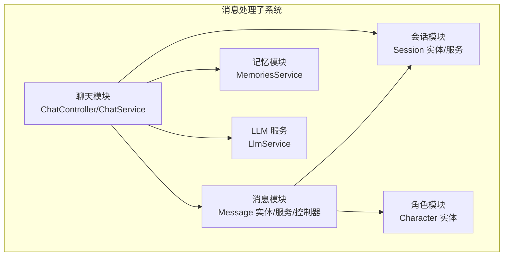
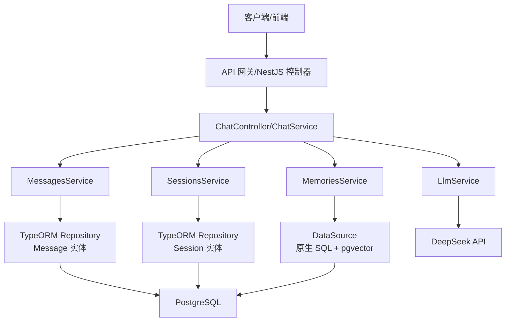
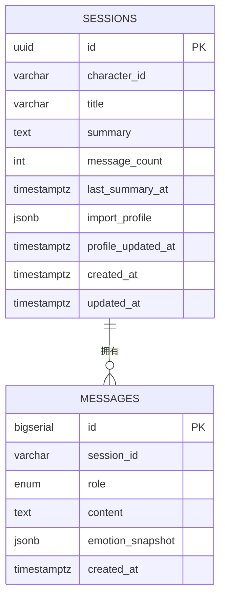
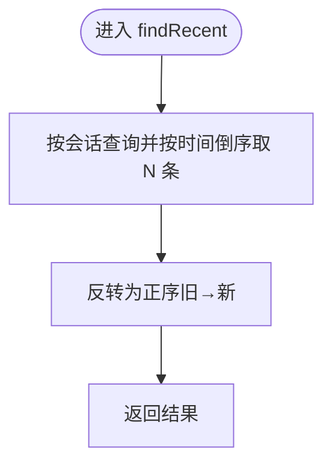
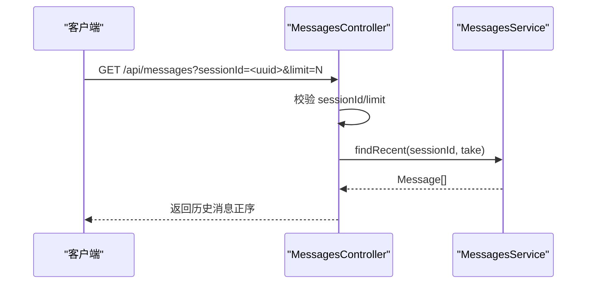
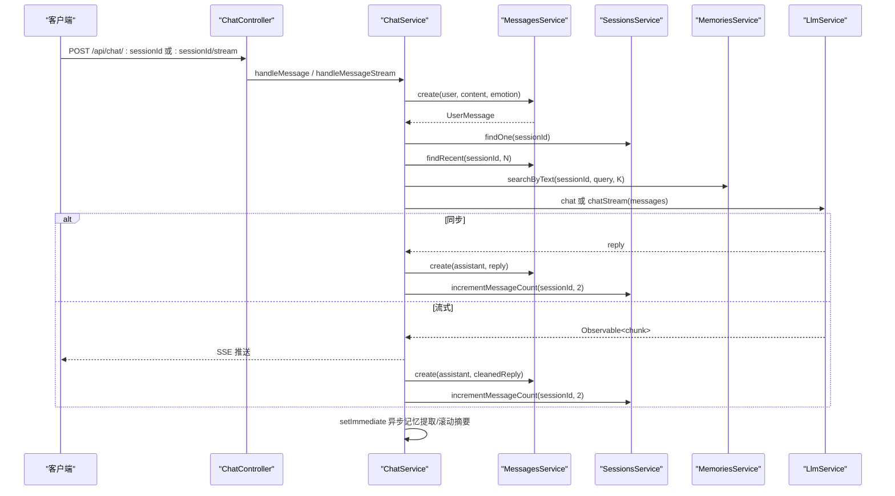
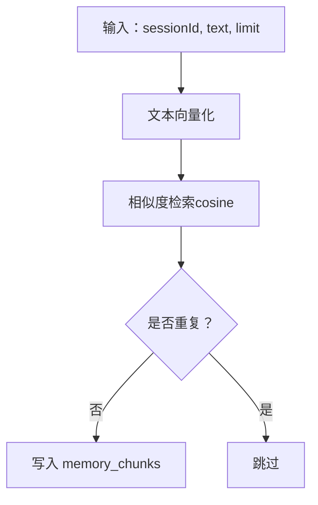
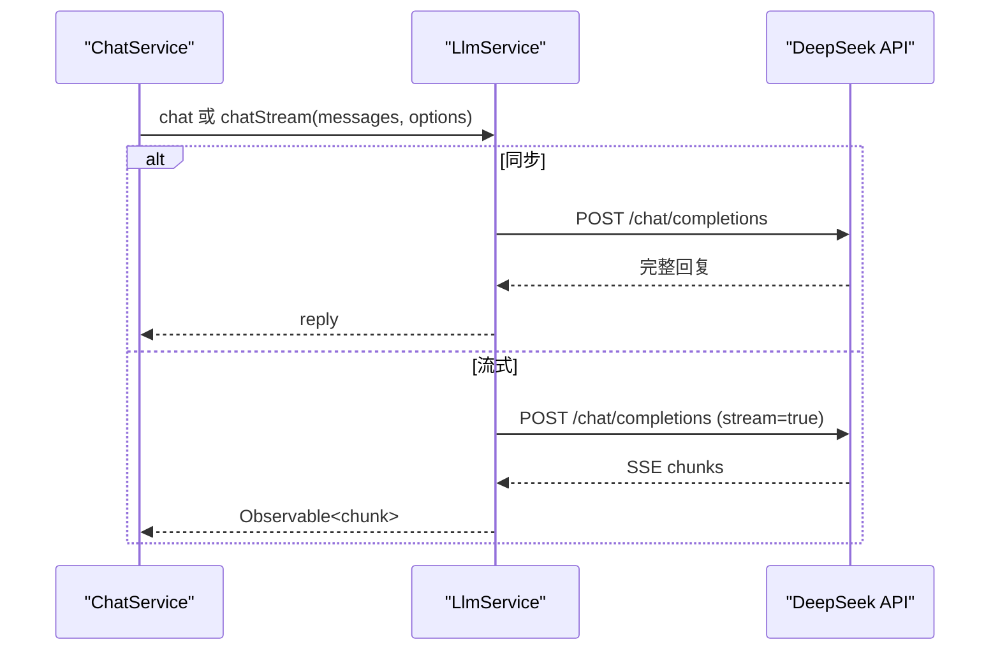
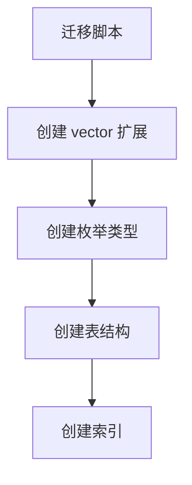
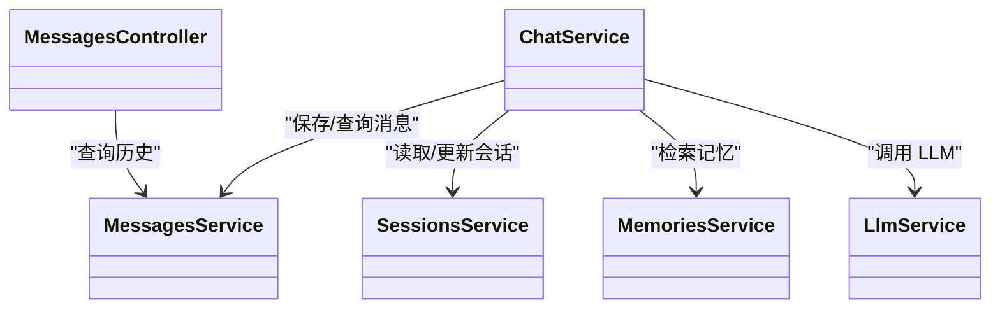

# 消息处理

<cite>
**本文引用的文件**
- [message.entity.ts](file://src/messages/entities/message.entity.ts)
- [messages.controller.ts](file://src/messages/messages.controller.ts)
- [messages.service.ts](file://src/messages/messages.service.ts)
- [messages.module.ts](file://src/messages/messages.module.ts)
- [session.entity.ts](file://src/sessions/entities/session.entity.ts)
- [sessions.service.ts](file://src/sessions/sessions.service.ts)
- [character.entity.ts](file://src/characters/entities/character.entity.ts)
- [chat.controller.ts](file://src/chat/chat.controller.ts)
- [chat.service.ts](file://src/chat/chat.service.ts)
- [memories.service.ts](file://src/memories/memories.service.ts)
- [llm.service.ts](file://src/llm/llm.service.ts)
- [1710000000000-init-pgvector-schema.ts](file://src/migrations/1710000000000-init-pgvector-schema.ts)
- [app.module.ts](file://src/app.module.ts)
- [database.config.ts](file://src/config/database.config.ts)
</cite>

## 目录
1. [简介](#简介)
2. [项目结构](#项目结构)
3. [核心组件](#核心组件)
4. [架构总览](#架构总览)
5. [详细组件分析](#详细组件分析)
6. [依赖分析](#依赖分析)
7. [性能考虑](#性能考虑)
8. [故障排查指南](#故障排查指南)
9. [结论](#结论)
10. [附录](#附录)

## 简介
本文件面向消息处理系统，围绕消息实体设计与数据库映射、消息的创建/查询/更新/删除与批量操作、消息与会话/角色的关联关系、消息历史维护、消息格式标准化与安全检查、性能优化与数据一致性保障等方面进行系统化技术说明。文档同时给出关键流程的时序图与类图，帮助读者快速理解代码结构与交互。

## 项目结构
消息处理子系统主要由以下模块构成：
- 消息模块：负责消息实体、服务与控制器
- 会话模块：负责会话实体与服务
- 角色模块：负责角色实体
- 聊天模块：负责消息编排、LLM 调用、流式输出、滚动摘要与记忆提取
- 记忆模块：负责向量检索与去重
- 数据库迁移：负责初始化 pgvector 扩展、枚举类型与表结构

图表来源
- [messages.module.ts:1-13](file://src/messages/messages.module.ts#L1-L13)
- [chat.controller.ts:1-77](file://src/chat/chat.controller.ts#L1-L77)
- [chat.service.ts:1-547](file://src/chat/chat.service.ts#L1-L547)
- [memories.service.ts:1-138](file://src/memories/memories.service.ts#L1-L138)
- [llm.service.ts:1-147](file://src/llm/llm.service.ts#L1-L147)

章节来源
- [messages.module.ts:1-13](file://src/messages/messages.module.ts#L1-L13)
- [messages.controller.ts:1-27](file://src/messages/messages.controller.ts#L1-L27)
- [messages.service.ts:1-93](file://src/messages/messages.service.ts#L1-L93)
- [session.entity.ts:1-64](file://src/sessions/entities/session.entity.ts#L1-L64)
- [sessions.service.ts:1-62](file://src/sessions/sessions.service.ts#L1-L62)
- [character.entity.ts:1-23](file://src/characters/entities/character.entity.ts#L1-L23)
- [chat.controller.ts:1-77](file://src/chat/chat.controller.ts#L1-L77)
- [chat.service.ts:1-547](file://src/chat/chat.service.ts#L1-L547)
- [memories.service.ts:1-138](file://src/memories/memories.service.ts#L1-L138)
- [llm.service.ts:1-147](file://src/llm/llm.service.ts#L1-L147)

## 核心组件
- 消息实体：定义消息的字段、类型与索引，包含会话标识、角色、内容、情绪快照与创建时间。
- 消息服务：提供单条/批量创建、最近消息查询、按角色查询、消息计数统计等能力。
- 会话实体与服务：管理会话元数据、滚动摘要、导入画像、消息计数与更新时间。
- 聊天服务：编排消息保存、上下文组装、记忆检索、LLM 调用、回复清理、异步记忆提取与滚动摘要。
- 记忆服务：基于 pgvector 的向量检索、去重与写入。
- LLM 服务：封装 DeepSeek API 的同步与流式调用。
- 数据库迁移：初始化 pgvector 扩展、枚举类型与表结构，并建立必要索引。

章节来源
- [message.entity.ts:1-25](file://src/messages/entities/message.entity.ts#L1-L25)
- [messages.service.ts:1-93](file://src/messages/messages.service.ts#L1-L93)
- [session.entity.ts:1-64](file://src/sessions/entities/session.entity.ts#L1-L64)
- [sessions.service.ts:1-62](file://src/sessions/sessions.service.ts#L1-L62)
- [chat.service.ts:1-547](file://src/chat/chat.service.ts#L1-L547)
- [memories.service.ts:1-138](file://src/memories/memories.service.ts#L1-L138)
- [llm.service.ts:1-147](file://src/llm/llm.service.ts#L1-L147)
- [1710000000000-init-pgvector-schema.ts:1-107](file://src/migrations/1710000000000-init-pgvector-schema.ts#L1-L107)

## 架构总览
消息处理在系统中的位置与交互如下：

图表来源
- [chat.controller.ts:1-77](file://src/chat/chat.controller.ts#L1-L77)
- [chat.service.ts:1-547](file://src/chat/chat.service.ts#L1-L547)
- [messages.service.ts:1-93](file://src/messages/messages.service.ts#L1-L93)
- [sessions.service.ts:1-62](file://src/sessions/sessions.service.ts#L1-L62)
- [memories.service.ts:1-138](file://src/memories/memories.service.ts#L1-L138)
- [llm.service.ts:1-147](file://src/llm/llm.service.ts#L1-L147)
- [app.module.ts:18-63](file://src/app.module.ts#L18-L63)

## 详细组件分析

### 消息实体与数据库映射
- 字段设计
  - 主键：自增整型 ID
  - 会话标识：字符串类型，关联会话
  - 角色：枚举类型，限定为用户或助手
  - 内容：文本字段，承载消息正文
  - 情绪快照：JSONB 字段，用于存储情绪分析结果
  - 创建时间：自动创建时间戳
- 索引与约束
  - 会话+时间复合索引，支撑按会话查询与排序
  - 枚举类型 messages_role_enum，确保角色值域合法
- 关联关系
  - 消息属于会话（一对多）
  - 消息可被记忆模块引用（source_msg_id）

图表来源
- [message.entity.ts:1-25](file://src/messages/entities/message.entity.ts#L1-L25)
- [session.entity.ts:1-64](file://src/sessions/entities/session.entity.ts#L1-L64)
- [1710000000000-init-pgvector-schema.ts:60-82](file://src/migrations/1710000000000-init-pgvector-schema.ts#L60-L82)

章节来源
- [message.entity.ts:1-25](file://src/messages/entities/message.entity.ts#L1-L25)
- [1710000000000-init-pgvector-schema.ts:6-93](file://src/migrations/1710000000000-init-pgvector-schema.ts#L6-L93)

### 消息服务：创建/查询/批量/统计
- 单条创建：接收会话标识、角色、内容与可选情绪快照，持久化后返回实体
- 批量创建：接收输入数组，统一转换为实体并一次性保存
- 最近消息查询：按时间倒序取 N 条，再反转为正序，便于拼接到 LLM 请求
- 按角色查询：按会话与角色过滤，支持限制数量
- 统计计数：用于滚动摘要触发判断

图表来源
- [messages.service.ts:67-74](file://src/messages/messages.service.ts#L67-L74)

章节来源
- [messages.service.ts:1-93](file://src/messages/messages.service.ts#L1-L93)

### 控制器：历史消息查询接口
- 端点：GET /api/messages
- 查询参数：sessionId（必填）、limit（可选，默认 50，上限 200）
- 行为：校验 sessionId，计算 take 值，调用服务层获取最近消息

图表来源
- [messages.controller.ts:14-25](file://src/messages/messages.controller.ts#L14-L25)
- [messages.service.ts:67-74](file://src/messages/messages.service.ts#L67-L74)

章节来源
- [messages.controller.ts:1-27](file://src/messages/messages.controller.ts#L1-L27)

### 聊天服务：消息编排与历史维护
- 同步对话：保存用户消息 → 读取上下文 → 检索记忆 → 组装 system prompt → 调 LLM → 保存 AI 回复 → 更新会话消息计数 → 异步记忆提取与滚动摘要
- 流式对话：与同步流程一致，但将 LLM 回复以 Observable 形式逐块推送，完成后清理并保存回复
- 历史维护：
  - 滚动摘要：当消息数 ≥ 50 且距离上次摘要 ≥ 1 小时，读取最近 50 条，生成摘要并更新会话
  - 记忆提取：从对话中抽取事实/偏好/情绪，向量化后去重并写入记忆表

图表来源
- [chat.controller.ts:20-75](file://src/chat/chat.controller.ts#L20-L75)
- [chat.service.ts:42-113](file://src/chat/chat.service.ts#L42-L113)
- [chat.service.ts:130-231](file://src/chat/chat.service.ts#L130-L231)
- [messages.service.ts:36-49](file://src/messages/messages.service.ts#L36-L49)
- [sessions.service.ts:52-55](file://src/sessions/sessions.service.ts#L52-L55)
- [memories.service.ts:115-136](file://src/memories/memories.service.ts#L115-L136)
- [llm.service.ts:35-57](file://src/llm/llm.service.ts#L35-L57)

章节来源
- [chat.controller.ts:1-77](file://src/chat/chat.controller.ts#L1-L77)
- [chat.service.ts:1-547](file://src/chat/chat.service.ts#L1-L547)

### 记忆服务：向量检索与去重
- 检索：将查询文本向量化，使用 pgvector 的余弦距离进行相似度检索
- 写入：插入记忆条目，包含 session_id、source_msg_id、content、embedding、memory_type 等
- 去重：计算与现有 embedding 的余弦相似度，超过阈值则跳过

图表来源
- [memories.service.ts:42-59](file://src/memories/memories.service.ts#L42-L59)
- [memories.service.ts:64-88](file://src/memories/memories.service.ts#L64-L88)
- [memories.service.ts:93-110](file://src/memories/memories.service.ts#L93-L110)
- [memories.service.ts:115-136](file://src/memories/memories.service.ts#L115-L136)

章节来源
- [memories.service.ts:1-138](file://src/memories/memories.service.ts#L1-L138)

### LLM 服务：同步与流式调用
- 同步：发送完整请求，等待返回
- 流式：建立 HTTPS 请求，解析 SSE 文本块，逐块推送

图表来源
- [llm.service.ts:35-57](file://src/llm/llm.service.ts#L35-L57)
- [llm.service.ts:70-145](file://src/llm/llm.service.ts#L70-L145)

章节来源
- [llm.service.ts:1-147](file://src/llm/llm.service.ts#L1-L147)

### 数据库初始化与索引
- 初始化扩展与类型：创建 vector 扩展与枚举类型
- 创建表：characters、sessions、messages、memory_chunks
- 建立索引：messages 与 memory_chunks 的复合索引与向量索引（HNSW + cosine）

图表来源
- [1710000000000-init-pgvector-schema.ts:6-93](file://src/migrations/1710000000000-init-pgvector-schema.ts#L6-L93)

章节来源
- [1710000000000-init-pgvector-schema.ts:1-107](file://src/migrations/1710000000000-init-pgvector-schema.ts#L1-L107)

## 依赖分析
- 模块耦合
  - ChatService 依赖 MessagesService、SessionsService、MemoriesService、LlmService
  - MessagesController 仅依赖 MessagesService
  - MemoriesService 直接使用 DataSource，绕过 TypeORM 对 vector 列的支持限制
- 外部依赖
  - PostgreSQL + pgvector：向量检索与索引
  - DeepSeek API：对话生成与流式输出
- 数据一致性
  - 通过事务性保存与异步任务分离，避免阻塞主流程
  - 会话消息计数与滚动摘要相互配合，控制上下文规模

图表来源
- [chat.service.ts:30-40](file://src/chat/chat.service.ts#L30-L40)
- [messages.controller.ts:11-12](file://src/messages/messages.controller.ts#L11-L12)
- [messages.service.ts:24-27](file://src/messages/messages.service.ts#L24-L27)
- [sessions.service.ts:8-11](file://src/sessions/sessions.service.ts#L8-L11)
- [memories.service.ts:31-34](file://src/memories/memories.service.ts#L31-L34)
- [llm.service.ts:27-33](file://src/llm/llm.service.ts#L27-L33)

章节来源
- [chat.service.ts:1-547](file://src/chat/chat.service.ts#L1-L547)
- [messages.controller.ts:1-27](file://src/messages/messages.controller.ts#L1-L27)
- [messages.service.ts:1-93](file://src/messages/messages.service.ts#L1-L93)
- [sessions.service.ts:1-62](file://src/sessions/sessions.service.ts#L1-L62)
- [memories.service.ts:1-138](file://src/memories/memories.service.ts#L1-L138)
- [llm.service.ts:1-147](file://src/llm/llm.service.ts#L1-L147)

## 性能考虑
- 查询性能
  - 为 messages(session_id, created_at) 建立复合索引，加速按会话分页与排序
  - 为 memory_chunks(embedding) 建立 HNSW 索引，提升向量检索效率
- 写入性能
  - 批量创建消息：使用 save(entities) 一次性提交，减少往返
  - 异步任务：记忆提取与滚动摘要通过 setImmediate 异步执行，避免阻塞主流程
- 上下文控制
  - 通过滚动摘要与最近 N 条消息拼接，控制 LLM 输入规模，降低延迟与成本
- LLM 调用
  - 流式输出：前端可逐字渲染，提升感知速度；错误处理与超时控制保障稳定性
- 存储与索引
  - 使用 JSONB 存储情绪快照与导入画像，便于灵活扩展
  - 会话消息计数与最后摘要时间字段，支撑滚动摘要触发策略

章节来源
- [1710000000000-init-pgvector-schema.ts:84-92](file://src/migrations/1710000000000-init-pgvector-schema.ts#L84-L92)
- [messages.service.ts:51-61](file://src/messages/messages.service.ts#L51-L61)
- [chat.service.ts:100-111](file://src/chat/chat.service.ts#L100-L111)
- [chat.service.ts:334-374](file://src/chat/chat.service.ts#L334-L374)
- [llm.service.ts:69-145](file://src/llm/llm.service.ts#L69-L145)

## 故障排查指南
- 会话不存在
  - 现象：查找会话时抛出“不存在”异常
  - 处理：确认 sessionId 是否正确传入，或检查会话是否已被删除
- LLM 调用失败
  - 现象：流式/同步调用报错或超时
  - 处理：检查 API Key、网络连通性与超时配置；查看前端 SSE 错误回调
- 记忆检索异常
  - 现象：向量检索返回空或报错
  - 处理：确认 pgvector 已启用、embedding 列存在且非空；检查阈值与相似度计算
- 消息历史为空
  - 现象：查询历史返回空数组
  - 处理：确认 sessionId 参数有效；检查 limit 参数范围（默认 50，最大 200）

章节来源
- [sessions.service.ts:22-28](file://src/sessions/sessions.service.ts#L22-L28)
- [chat.controller.ts:66-74](file://src/chat/chat.controller.ts#L66-L74)
- [memories.service.ts:42-59](file://src/memories/memories.service.ts#L42-L59)
- [messages.controller.ts:20-25](file://src/messages/messages.controller.ts#L20-L25)

## 结论
该消息处理系统以清晰的模块划分与强约束的数据库设计为基础，结合会话滚动摘要与向量记忆检索，实现了高效、可扩展的消息编排与历史维护。通过同步/流式双模式的 LLM 调用与异步任务分离，兼顾了用户体验与系统性能。建议在生产环境中持续关注索引维护、向量维度与阈值调优，以及会话生命周期管理，以进一步提升稳定性与吞吐量。

## 附录
- 数据库连接配置
  - TypeORM 在 AppModule 中集中配置，启用迁移并禁止自动同步以保护 pgvector 列
  - CLI 场景可通过 database.config.ts 的 DataSource 进行迁移管理

章节来源
- [app.module.ts:37-50](file://src/app.module.ts#L37-L50)
- [database.config.ts:8-20](file://src/config/database.config.ts#L8-L20)