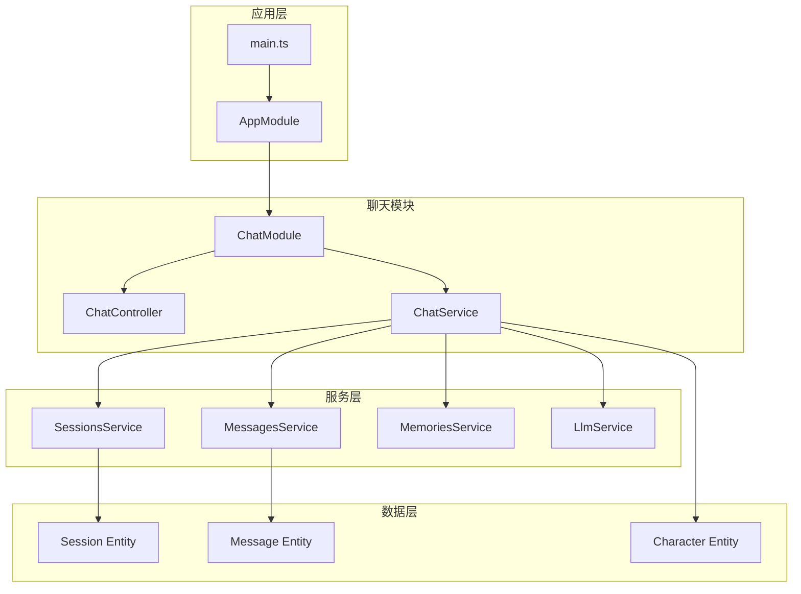
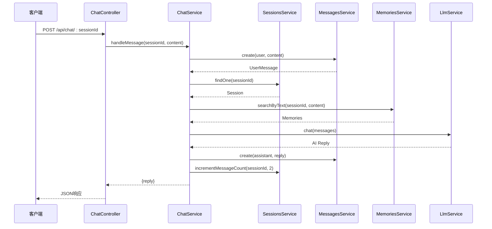
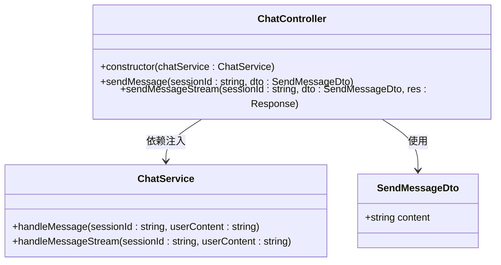
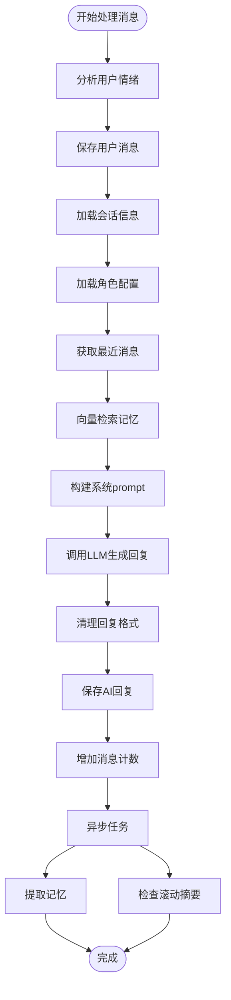
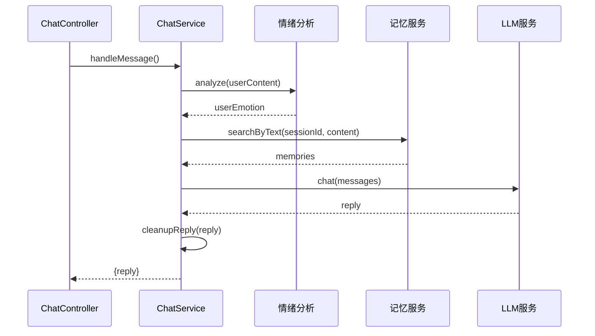
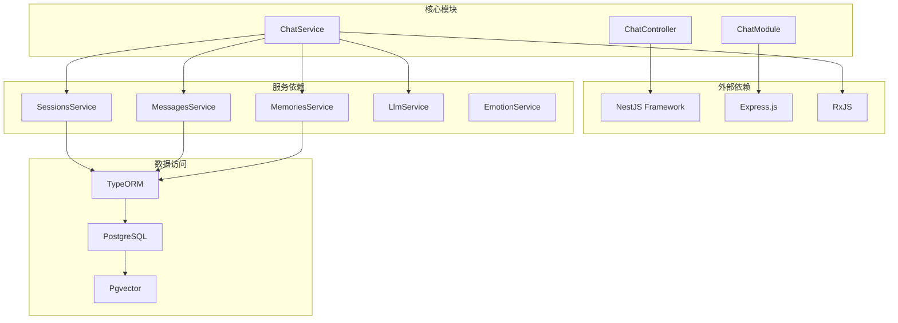

# 聊天控制器

<cite>
**本文档引用的文件**
- [chat.controller.ts](file://src/chat/chat.controller.ts)
- [chat.service.ts](file://src/chat/chat.service.ts)
- [chat.module.ts](file://src/chat/chat.module.ts)
- [types.ts](file://shared/types.ts)
- [sessions.service.ts](file://src/sessions/sessions.service.ts)
- [messages.service.ts](file://src/messages/messages.service.ts)
- [memories.service.ts](file://src/memories/memories.service.ts)
- [llm.service.ts](file://src/llm/llm.service.ts)
- [session.entity.ts](file://src/sessions/entities/session.entity.ts)
- [message.entity.ts](file://src/messages/entities/message.entity.ts)
- [character.entity.ts](file://src/characters/entities/character.entity.ts)
- [app.module.ts](file://src/app.module.ts)
- [main.ts](file://src/main.ts)
</cite>

## 目录
1. [简介](#简介)
2. [项目结构](#项目结构)
3. [核心组件](#核心组件)
4. [架构概览](#架构概览)
5. [详细组件分析](#详细组件分析)
6. [依赖分析](#依赖分析)
7. [性能考虑](#性能考虑)
8. [故障排除指南](#故障排除指南)
9. [结论](#结论)
10. [附录](#附录)

## 简介
本文档详细介绍了聊天控制器（ChatController）的技术实现，包括其API设计、实现细节、与ChatService的交互方式以及完整的API接口文档。聊天控制器提供了两个核心接口：同步聊天接口和流式聊天接口，实现了完整的对话处理流程，包括消息保存、上下文构建、向量检索、LLM调用和记忆管理等功能。

## 项目结构
聊天控制器位于项目的聊天模块中，采用分层架构设计，将HTTP处理、业务逻辑和服务调用清晰分离。



**图表来源**
- [chat.controller.ts:16-18](file://src/chat/chat.controller.ts#L16-L18)
- [chat.service.ts:31-40](file://src/chat/chat.service.ts#L31-L40)
- [chat.module.ts:22-33](file://src/chat/chat.module.ts#L22-L33)

**章节来源**
- [chat.controller.ts:1-77](file://src/chat/chat.controller.ts#L1-L77)
- [chat.module.ts:1-35](file://src/chat/chat.module.ts#L1-L35)
- [app.module.ts:18-63](file://src/app.module.ts#L18-L63)

## 核心组件
聊天控制器包含两个主要组件：ChatController和ChatService，它们协同工作实现完整的聊天功能。

### ChatController
ChatController是HTTP接口层，负责接收和处理客户端请求，提供两个核心API端点：
- POST /api/chat/:sessionId - 同步聊天接口
- POST /api/chat/:sessionId/stream - 流式聊天接口

### ChatService
ChatService是业务逻辑核心，负责完整的对话处理流程，包括：
- 用户消息保存和AI回复生成
- 上下文构建和系统prompt组装
- 向量检索和记忆管理
- 情绪分析和AI情绪调节
- 异步记忆提取和滚动摘要

**章节来源**
- [chat.controller.ts:16-77](file://src/chat/chat.controller.ts#L16-L77)
- [chat.service.ts:30-113](file://src/chat/chat.service.ts#L30-L113)

## 架构概览
聊天控制器采用模块化设计，通过依赖注入实现松耦合的组件交互。



**图表来源**
- [chat.controller.ts:21-27](file://src/chat/chat.controller.ts#L21-L27)
- [chat.service.ts:42-113](file://src/chat/chat.service.ts#L42-L113)
- [messages.service.ts:36-49](file://src/messages/messages.service.ts#L36-L49)
- [sessions.service.ts:22-28](file://src/sessions/sessions.service.ts#L22-L28)
- [memories.service.ts:115-118](file://src/memories/memories.service.ts#L115-L118)
- [llm.service.ts:36-57](file://src/llm/llm.service.ts#L36-L57)

## 详细组件分析

### ChatController 类结构
ChatController采用装饰器模式，通过NestJS的路由装饰器定义API端点。



**图表来源**
- [chat.controller.ts:17-77](file://src/chat/chat.controller.ts#L17-L77)
- [chat.service.ts:30-231](file://src/chat/chat.service.ts#L30-L231)

#### 同步聊天接口实现
同步聊天接口提供完整的对话响应，适用于需要一次性获取完整回复的场景。

**章节来源**
- [chat.controller.ts:20-27](file://src/chat/chat.controller.ts#L20-L27)
- [chat.service.ts:42-113](file://src/chat/chat.service.ts#L42-L113)

#### 流式聊天接口实现
流式聊天接口通过Server-Sent Events (SSE)实现实时响应，提供更好的用户体验。

**章节来源**
- [chat.controller.ts:46-75](file://src/chat/chat.controller.ts#L46-L75)
- [chat.service.ts:130-231](file://src/chat/chat.service.ts#L130-L231)

### ChatService 业务逻辑
ChatService实现了完整的对话处理流程，包含同步和异步两个版本。



**图表来源**
- [chat.service.ts:42-113](file://src/chat/chat.service.ts#L42-L113)
- [chat.service.ts:130-231](file://src/chat/chat.service.ts#L130-L231)

**章节来源**
- [chat.service.ts:13-28](file://src/chat/chat.service.ts#L13-L28)

### 数据流和处理逻辑
聊天服务内部的数据流展示了完整的对话处理过程。



**图表来源**
- [chat.service.ts:42-113](file://src/chat/chat.service.ts#L42-L113)
- [chat.service.ts:190-202](file://src/chat/chat.service.ts#L190-L202)

**章节来源**
- [chat.service.ts:119-133](file://src/chat/chat.service.ts#L119-L133)

## 依赖分析
聊天控制器的依赖关系体现了模块化的架构设计。



**图表来源**
- [chat.module.ts:22-33](file://src/chat/chat.module.ts#L22-L33)
- [chat.service.ts:31-40](file://src/chat/chat.service.ts#L31-L40)

**章节来源**
- [chat.module.ts:12-35](file://src/chat/chat.module.ts#L12-L35)
- [chat.service.ts:1-12](file://src/chat/chat.service.ts#L1-L12)

## 性能考虑
聊天控制器在设计时充分考虑了性能优化和用户体验：

### 流式处理优势
- **实时响应**：SSE流式传输提供毫秒级的响应体验
- **渐进式渲染**：用户可以立即看到AI回复的生成过程
- **网络效率**：减少单次请求的响应时间

### 异步任务处理
- **非阻塞设计**：记忆提取和滚动摘要在后台异步执行
- **setImmediate优化**：确保主线程不被阻塞
- **错误隔离**：异步任务失败不影响主流程

### 缓存和优化策略
- **向量检索缓存**：基于相似度阈值的去重机制
- **消息上下文优化**：智能选择最近的消息进行上下文构建
- **内存管理**：及时清理临时数据和释放资源

## 故障排除指南
聊天控制器的错误处理机制确保了系统的稳定性和可靠性。

### 常见错误类型
1. **会话不存在**：当sessionId无效时抛出NotFoundException
2. **角色配置缺失**：当角色不存在时抛出错误
3. **LLM调用失败**：网络问题或API限制导致的异常
4. **数据库连接问题**：TypeORM连接异常

### 错误处理策略
- **参数验证**：在控制器层进行基本的参数校验
- **异常捕获**：在服务层捕获并处理各种异常情况
- **优雅降级**：异步任务失败时不影响主流程
- **日志记录**：详细的错误日志便于调试和监控

**章节来源**
- [sessions.service.ts:22-28](file://src/sessions/sessions.service.ts#L22-L28)
- [chat.service.ts:59-61](file://src/chat/chat.service.ts#L59-L61)
- [chat.service.ts:311-314](file://src/chat/chat.service.ts#L311-L314)

## 结论
聊天控制器通过清晰的分层架构和模块化设计，实现了高效、可扩展的聊天功能。其双模式API设计满足了不同场景的需求，流式接口提供了优秀的用户体验，而同步接口保证了简单易用。通过完善的依赖注入机制和错误处理策略，系统具备了良好的可维护性和稳定性。

## 附录

### API 接口文档

#### 同步聊天接口
- **URL**: `POST /api/chat/:sessionId`
- **功能**: 发送消息并等待完整回复
- **请求参数**:
  - `sessionId`: 会话ID (路径参数)
  - `content`: 用户消息内容 (请求体)
- **响应格式**: `{ "reply": string }`
- **状态码**: 
  - 200: 成功
  - 404: 会话不存在
  - 500: 服务器内部错误

#### 流式聊天接口
- **URL**: `POST /api/chat/:sessionId/stream`
- **功能**: 通过SSE流式发送消息回复
- **请求参数**:
  - `sessionId`: 会话ID (路径参数)
  - `content`: 用户消息内容 (请求体)
- **响应格式**: 
  - `data: "回复片段"` (逐字推送)
  - `data: "[DONE]"` (流结束标记)
- **状态码**: 
  - 200: 成功
  - 404: 会话不存在
  - 500: 服务器内部错误

#### 请求体结构
```typescript
interface SendMessagePayload {
  content: string;
}
```

#### 响应体结构
```typescript
interface SendMessageResponse {
  reply: string;
}
```

### 最佳实践建议
1. **参数验证**: 在生产环境中添加更严格的参数验证
2. **错误处理**: 实现统一的错误响应格式
3. **性能监控**: 添加请求耗时和错误率监控
4. **安全考虑**: 实现API限流和输入过滤
5. **测试覆盖**: 增加单元测试和集成测试

**章节来源**
- [types.ts:92-98](file://shared/types.ts#L92-L98)
- [types.ts:114-121](file://shared/types.ts#L114-L121)