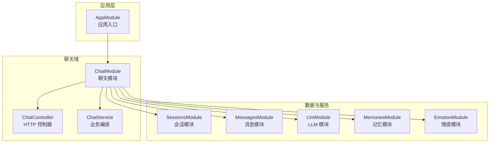
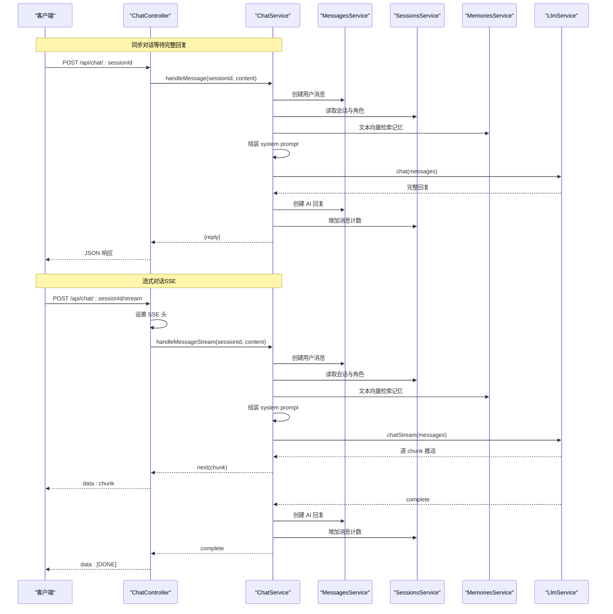
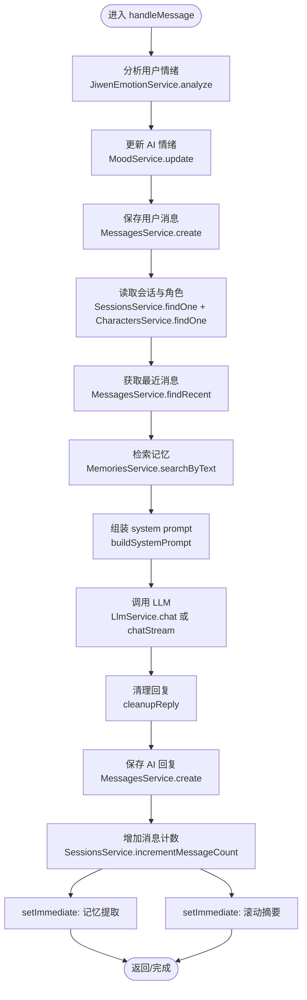
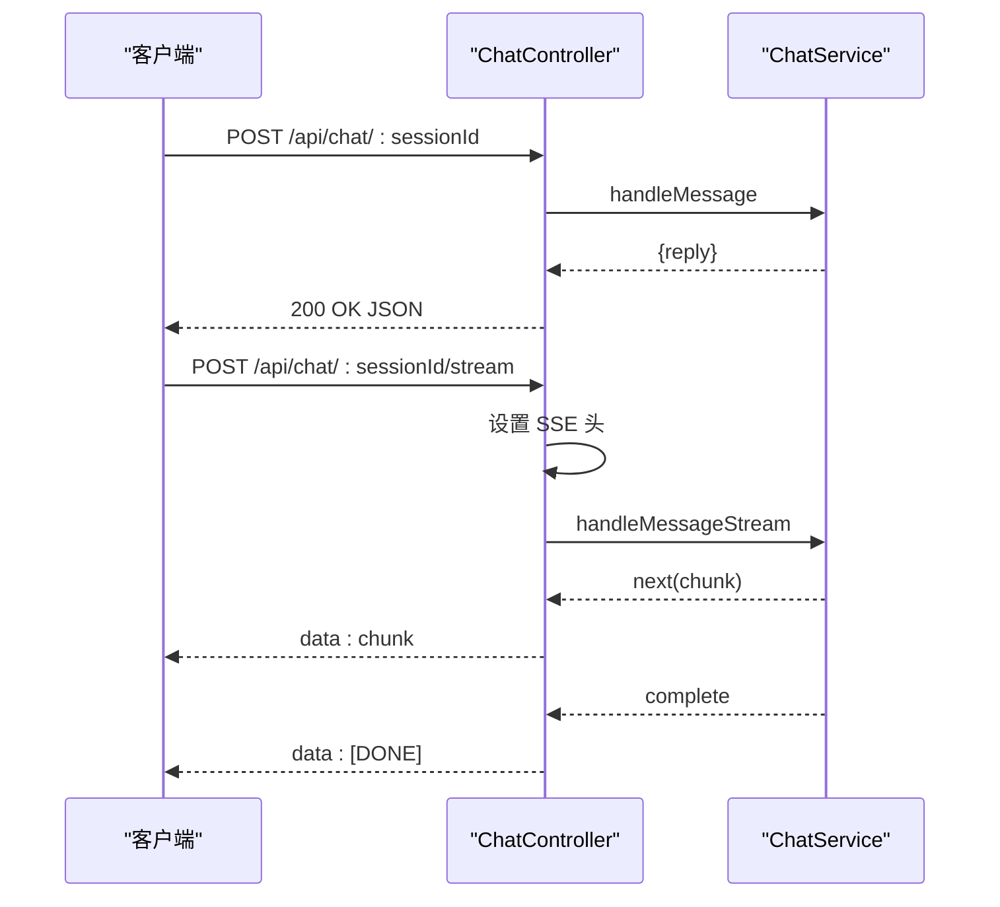
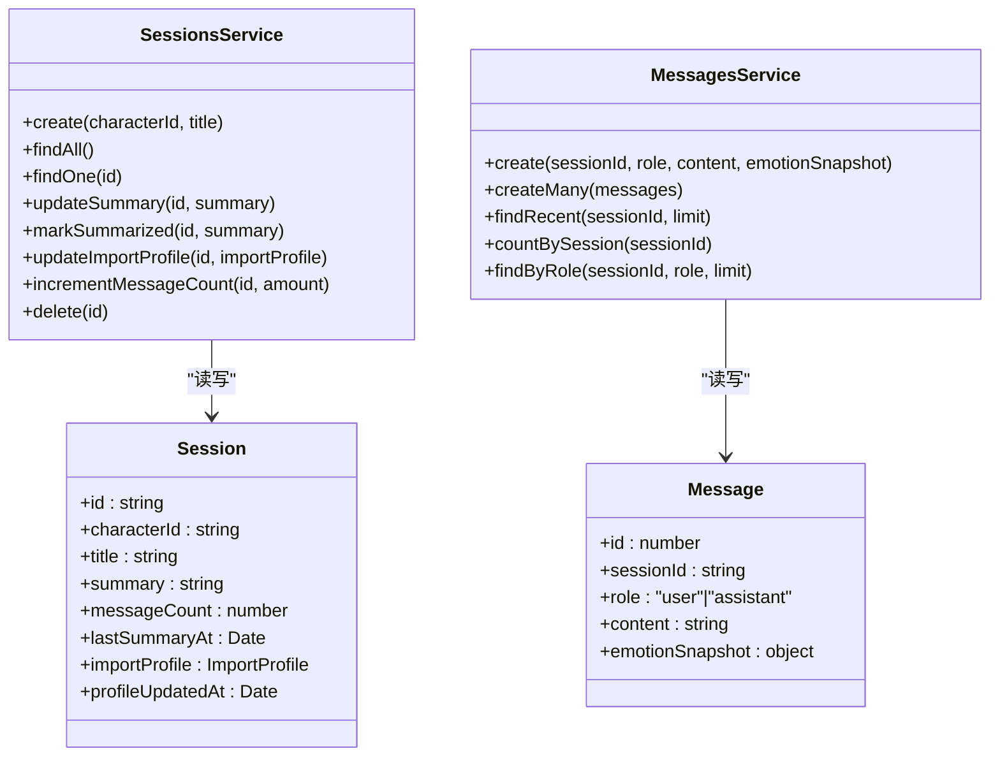
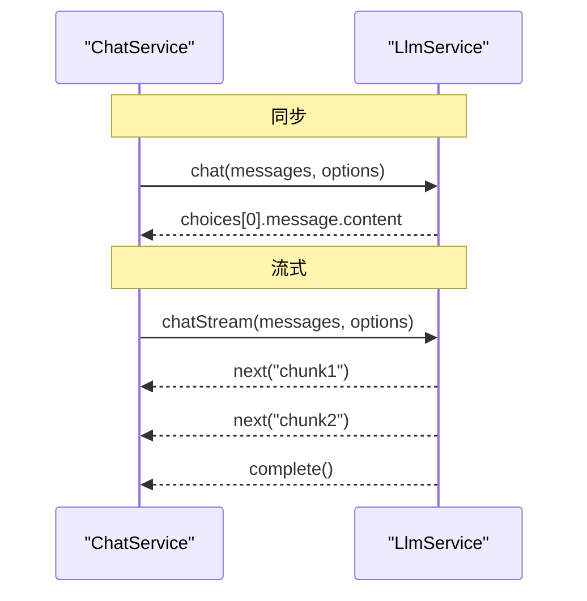
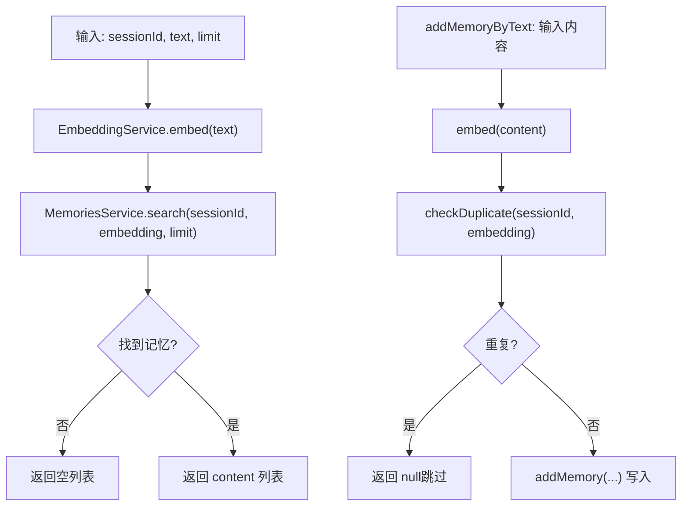
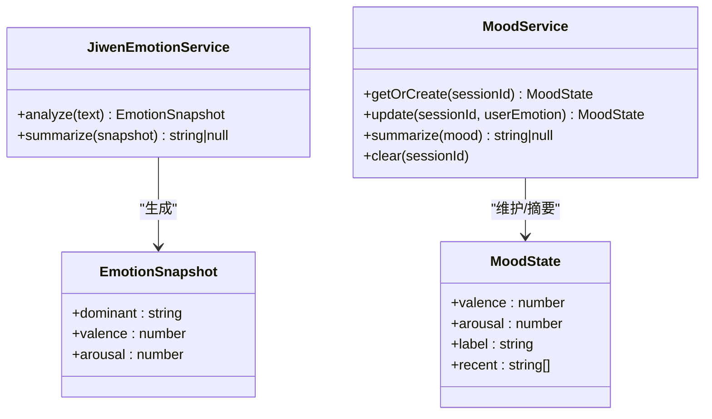
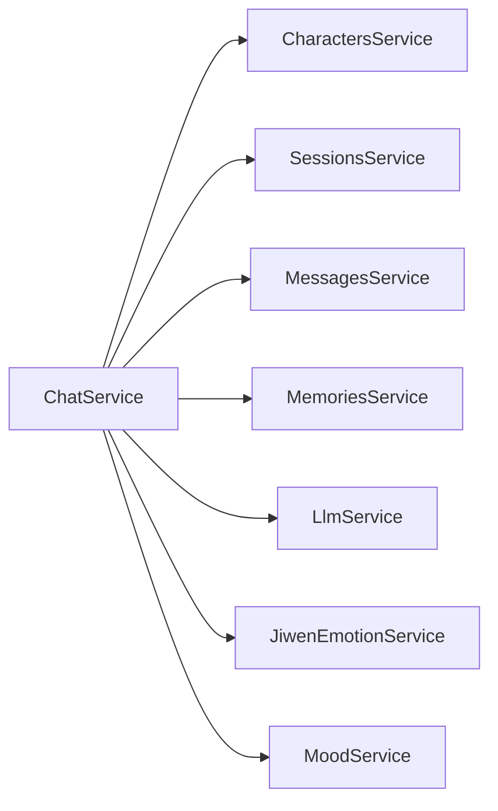

# 聊天服务实现

<cite>
**本文引用的文件**
- [src/chat/chat.service.ts](file://src/chat/chat.service.ts)
- [src/chat/chat.controller.ts](file://src/chat/chat.controller.ts)
- [src/chat/chat.module.ts](file://src/chat/chat.module.ts)
- [src/sessions/sessions.service.ts](file://src/sessions/sessions.service.ts)
- [src/sessions/entities/session.entity.ts](file://src/sessions/entities/session.entity.ts)
- [src/messages/messages.service.ts](file://src/messages/messages.service.ts)
- [src/messages/entities/message.entity.ts](file://src/messages/entities/message.entity.ts)
- [src/llm/llm.service.ts](file://src/llm/llm.service.ts)
- [src/memories/memories.service.ts](file://src/memories/memories.service.ts)
- [src/memories/entities/memory.entity.ts](file://src/memories/entities/memory.entity.ts)
- [src/emotion/jiwen-emotion.service.ts](file://src/emotion/jiwen-emotion.service.ts)
- [src/emotion/mood.service.ts](file://src/emotion/mood.service.ts)
- [src/characters/characters.service.ts](file://src/characters/characters.service.ts)
- [src/characters/entities/character.entity.ts](file://src/characters/entities/character.entity.ts)
- [src/app.module.ts](file://src/app.module.ts)
</cite>

## 目录
1. [简介](#简介)
2. [项目结构](#项目结构)
3. [核心组件](#核心组件)
4. [架构总览](#架构总览)
5. [详细组件分析](#详细组件分析)
6. [依赖关系分析](#依赖关系分析)
7. [性能考量](#性能考量)
8. [故障排查指南](#故障排查指南)
9. [结论](#结论)
10. [附录](#附录)

## 简介
本技术文档围绕聊天服务实现，系统性阐述 ChatService 的核心业务逻辑与编排机制，覆盖会话管理、消息处理、上下文维护、历史记录与记忆检索、LLM 推理调用、情感分析与情绪建模、同步与流式聊天的差异策略、以及与 SessionsModule、MessagesModule、LlmModule、MemoriesModule、EmotionModule 的交互关系。文档同时提供关键流程的可视化图示、调试要点与最佳实践，帮助开发者快速理解与扩展。

## 项目结构
聊天服务位于 src/chat 目录，采用 NestJS 模块化组织，核心入口为 ChatModule，控制器 ChatController 提供同步与流式两个对外接口，业务编排集中在 ChatService 中。其他模块分别负责会话、消息、LLM、记忆与情感分析的纯数据读写与领域服务。

图表来源
- [src/app.module.ts:18-62](file://src/app.module.ts#L18-L62)
- [src/chat/chat.module.ts:12-34](file://src/chat/chat.module.ts#L12-L34)

章节来源
- [src/app.module.ts:18-62](file://src/app.module.ts#L18-L62)
- [src/chat/chat.module.ts:12-34](file://src/chat/chat.module.ts#L12-L34)

## 核心组件
- ChatService：统一编排一次完整对话，包含同步与流式两条路径，负责情绪分析、会话与角色读取、上下文组装、向量检索记忆、调用 LLM、清理回复、异步记忆提取与滚动摘要。
- ChatController：暴露同步与流式两个 API，设置 SSE 响应头，将流式数据以 Server-Sent Events 推送至前端。
- SessionsService 与 Session 实体：维护会话元数据（摘要、消息计数、导入画像、最后摘要时间等），支撑滚动摘要触发与上下文拼接。
- MessagesService 与 Message 实体：持久化消息，提供“最近 N 条”查询用于上下文拼接，统计消息数用于滚动摘要判断。
- LlmService：封装 DeepSeek API，支持同步与流式两种调用模式。
- MemoriesService 与 Memory 实体：基于 pgvector 的向量检索与去重，支持文本嵌入、相似度检索、写入记忆碎片。
- Emotion 服务：JiwenEmotionService（用户情绪快照与摘要）与 MoodService（AI 情绪建模与摘要）。
- Characters 服务与实体：角色基础人格与说话风格注入到 system prompt。

章节来源
- [src/chat/chat.service.ts:31-40](file://src/chat/chat.service.ts#L31-L40)
- [src/chat/chat.controller.ts:16-76](file://src/chat/chat.controller.ts#L16-L76)
- [src/sessions/sessions.service.ts:7-61](file://src/sessions/sessions.service.ts#L7-L61)
- [src/sessions/entities/session.entity.ts:32-63](file://src/sessions/entities/session.entity.ts#L32-L63)
- [src/messages/messages.service.ts:23-92](file://src/messages/messages.service.ts#L23-L92)
- [src/messages/entities/message.entity.ts:5-24](file://src/messages/entities/message.entity.ts#L5-L24)
- [src/llm/llm.service.ts:27-146](file://src/llm/llm.service.ts#L27-L146)
- [src/memories/memories.service.ts:30-137](file://src/memories/memories.service.ts#L30-L137)
- [src/memories/entities/memory.entity.ts:16-43](file://src/memories/entities/memory.entity.ts#L16-L43)
- [src/emotion/jiwen-emotion.service.ts:31-133](file://src/emotion/jiwen-emotion.service.ts#L31-L133)
- [src/emotion/mood.service.ts:18-110](file://src/emotion/mood.service.ts#L18-L110)
- [src/characters/characters.service.ts:7-40](file://src/characters/characters.service.ts#L7-L40)
- [src/characters/entities/character.entity.ts:4-22](file://src/characters/entities/character.entity.ts#L4-L22)

## 架构总览
聊天服务的端到端流程分为“同步对话”和“流式对话”两类，二者共享相同的上下文组装与 LLM 调用步骤，差异在于响应时机与错误处理策略。同步模式等待完整回复后返回；流式模式通过 Observable 逐字推送，完成后异步保存 AI 回复并触发记忆提取与滚动摘要。

图表来源
- [src/chat/chat.controller.ts:21-75](file://src/chat/chat.controller.ts#L21-L75)
- [src/chat/chat.service.ts:42-113](file://src/chat/chat.service.ts#L42-L113)
- [src/chat/chat.service.ts:130-231](file://src/chat/chat.service.ts#L130-L231)
- [src/messages/messages.service.ts:36-48](file://src/messages/messages.service.ts#L36-L48)
- [src/sessions/sessions.service.ts:22-27](file://src/sessions/sessions.service.ts#L22-L27)
- [src/memories/memories.service.ts:115-118](file://src/memories/memories.service.ts#L115-L118)
- [src/llm/llm.service.ts:36-57](file://src/llm/llm.service.ts#L36-L57)
- [src/llm/llm.service.ts:70-144](file://src/llm/llm.service.ts#L70-L144)

## 详细组件分析

### ChatService：核心业务编排
- 情绪与情绪摘要
  - 用户输入经 JiwenEmotionService 分析得到情绪快照，MoodService 基于用户情绪进行 AI 情绪建模与衰减，两者摘要作为第四层注入 system prompt。
- 会话与角色读取
  - 通过 SessionsService 读取会话摘要与导入画像，通过 CharactersService 读取角色 basePrompt 与说话风格，作为 prompt 第一层与第三层注入。
- 上下文与记忆
  - 从 MessagesService 获取最近 N 条消息，拼接到 LLM 请求数组；同时通过 MemoriesService 按用户输入进行向量检索，作为 prompt 第三层。
- LLM 推理
  - 同步模式：等待完整回复；流式模式：逐 chunk 推送。
- 回复清理
  - 对 LLM 输出中的括号动作描述进行清洗，替换为 emoji/颜文字，确保符合微信式聊天风格。
- 异步任务
  - 记忆提取：从一轮对话中抽取事实/偏好/情绪，向量化后去重并写入 memory_chunks。
  - 滚动摘要：当消息数达到阈值且距离上次摘要超过设定时间，生成摘要并重置计数。

图表来源
- [src/chat/chat.service.ts:42-113](file://src/chat/chat.service.ts#L42-L113)
- [src/chat/chat.service.ts:249-315](file://src/chat/chat.service.ts#L249-L315)
- [src/chat/chat.service.ts:334-374](file://src/chat/chat.service.ts#L334-L374)
- [src/chat/chat.service.ts:424-497](file://src/chat/chat.service.ts#L424-L497)
- [src/chat/chat.service.ts:507-544](file://src/chat/chat.service.ts#L507-L544)

章节来源
- [src/chat/chat.service.ts:42-113](file://src/chat/chat.service.ts#L42-L113)
- [src/chat/chat.service.ts:130-231](file://src/chat/chat.service.ts#L130-L231)
- [src/chat/chat.service.ts:249-315](file://src/chat/chat.service.ts#L249-L315)
- [src/chat/chat.service.ts:334-374](file://src/chat/chat.service.ts#L334-L374)
- [src/chat/chat.service.ts:424-497](file://src/chat/chat.service.ts#L424-L497)
- [src/chat/chat.service.ts:507-544](file://src/chat/chat.service.ts#L507-L544)

### ChatController：同步与流式接口
- 同步接口：POST /api/chat/:sessionId，等待完整回复后返回 JSON。
- 流式接口：POST /api/chat/:sessionId/stream，设置 SSE 头，逐字推送 data: chunk，结束时发送 data: [DONE]。

图表来源
- [src/chat/chat.controller.ts:21-75](file://src/chat/chat.controller.ts#L21-L75)

章节来源
- [src/chat/chat.controller.ts:16-76](file://src/chat/chat.controller.ts#L16-L76)

### SessionsModule 与 MessagesModule：会话与消息
- SessionsService
  - 提供创建、查找、更新摘要、标记摘要完成、增量消息计数、更新导入画像等能力。
  - 用于滚动摘要触发条件判断（消息数阈值与时间阈值）。
- MessagesService
  - 保存消息、批量导入、查询最近 N 条消息（用于拼接 LLM 上下文）、按角色查询、统计消息数。

图表来源
- [src/sessions/sessions.service.ts:7-61](file://src/sessions/sessions.service.ts#L7-L61)
- [src/sessions/entities/session.entity.ts:32-63](file://src/sessions/entities/session.entity.ts#L32-L63)
- [src/messages/messages.service.ts:23-92](file://src/messages/messages.service.ts#L23-L92)
- [src/messages/entities/message.entity.ts:5-24](file://src/messages/entities/message.entity.ts#L5-L24)

章节来源
- [src/sessions/sessions.service.ts:7-61](file://src/sessions/sessions.service.ts#L7-L61)
- [src/sessions/entities/session.entity.ts:32-63](file://src/sessions/entities/session.entity.ts#L32-L63)
- [src/messages/messages.service.ts:23-92](file://src/messages/messages.service.ts#L23-L92)
- [src/messages/entities/message.entity.ts:5-24](file://src/messages/entities/message.entity.ts#L5-L24)

### LlmModule：DeepSeek 推理
- 同步 chat：等待完整回复，返回字符串。
- 流式 chatStream：返回 Observable，逐 chunk 推送 delta.content，前端以 SSE 接收。

图表来源
- [src/llm/llm.service.ts:36-57](file://src/llm/llm.service.ts#L36-L57)
- [src/llm/llm.service.ts:70-144](file://src/llm/llm.service.ts#L70-L144)

章节来源
- [src/llm/llm.service.ts:27-146](file://src/llm/llm.service.ts#L27-L146)

### MemoriesModule：向量检索与记忆写入
- 文本向量检索：对用户输入进行嵌入，按余弦相似度检索会话内记忆。
- 写入记忆：嵌入后去重（阈值），写入 memory_chunks。
- 重要：embedding 为 VECTOR(768)，TypeORM 不支持，因此通过 DataSource 直接执行原生 SQL。

图表来源
- [src/memories/memories.service.ts:42-59](file://src/memories/memories.service.ts#L42-L59)
- [src/memories/memories.service.ts:115-118](file://src/memories/memories.service.ts#L115-L118)
- [src/memories/memories.service.ts:124-136](file://src/memories/memories.service.ts#L124-L136)
- [src/memories/entities/memory.entity.ts:16-43](file://src/memories/entities/memory.entity.ts#L16-L43)

章节来源
- [src/memories/memories.service.ts:30-137](file://src/memories/memories.service.ts#L30-L137)
- [src/memories/entities/memory.entity.ts:16-43](file://src/memories/entities/memory.entity.ts#L16-L43)

### EmotionModule：用户情绪与 AI 情绪
- JiwenEmotionService：基于词典加权计算情绪分数，输出主导情绪、愉悦度、唤醒度等快照，并生成摘要提示。
- MoodService：维护每个会话的 AI 情绪状态（valence/arousal/label/recent），根据用户情绪进行共鸣波动与衰减，生成情绪摘要。

图表来源
- [src/emotion/jiwen-emotion.service.ts:31-133](file://src/emotion/jiwen-emotion.service.ts#L31-L133)
- [src/emotion/mood.service.ts:18-110](file://src/emotion/mood.service.ts#L18-L110)

章节来源
- [src/emotion/jiwen-emotion.service.ts:31-133](file://src/emotion/jiwen-emotion.service.ts#L31-L133)
- [src/emotion/mood.service.ts:18-110](file://src/emotion/mood.service.ts#L18-L110)

### CharactersModule：角色与说话风格
- CharactersService：提供角色的 id/name/basePrompt/model/speechPatterns 等读写能力。
- ChatService 将角色的 basePrompt 与 speechPatterns 注入到 system prompt 的第一层与附加层，形成个性化人格。

章节来源
- [src/characters/characters.service.ts:7-40](file://src/characters/characters.service.ts#L7-L40)
- [src/characters/entities/character.entity.ts:4-22](file://src/characters/entities/character.entity.ts#L4-L22)
- [src/chat/chat.service.ts:424-497](file://src/chat/chat.service.ts#L424-L497)

## 依赖关系分析
- ChatModule 导入并装配所有子模块，形成强聚合的聊天域。
- ChatService 依赖 Characters、Sessions、Messages、Memories、Llm、Emotion 服务，耦合度高但职责清晰。
- 数据一致性与性能
  - 消息与会话均通过 TypeORM 管理，保证 ACID。
  - 记忆向量操作通过原生 SQL，避免 TypeORM 对 VECTOR 列的限制。
  - setImmediate 异步执行记忆提取与滚动摘要，避免阻塞主线程。

图表来源
- [src/chat/chat.module.ts:22-33](file://src/chat/chat.module.ts#L22-L33)
- [src/chat/chat.service.ts:31-40](file://src/chat/chat.service.ts#L31-L40)

章节来源
- [src/chat/chat.module.ts:12-34](file://src/chat/chat.module.ts#L12-L34)
- [src/chat/chat.service.ts:31-40](file://src/chat/chat.service.ts#L31-L40)

## 性能考量
- 同步 vs 流式
  - 同步模式延迟更低，适合快速反馈；流式模式提升感知速度，需注意前端缓冲与网络稳定性。
- LLM 调用
  - 合理设置 temperature、max_tokens，避免超时与过长回复。
  - 流式模式下，逐 chunk 推送减少首字延迟。
- 记忆检索
  - 检索 limit 控制在合理范围，避免上下文过长导致成本上升。
  - 向量检索使用 cosine 距离，阈值去重避免冗余。
- 异步任务
  - setImmediate 将非关键路径异步化，降低主流程阻塞风险。
- 数据库
  - pgvector 索引与迁移脚本确保向量列存在，避免 TypeORM 同步删除。

## 故障排查指南
- 角色不存在
  - 现象：读取角色时报错。
  - 排查：确认 CharactersService.findOne 是否返回有效角色；检查 sessionId 绑定的角色 id。
  - 参考
    - [src/chat/chat.service.ts:56-61](file://src/chat/chat.service.ts#L56-L61)
    - [src/characters/characters.service.ts:22-27](file://src/characters/characters.service.ts#L22-L27)
- 记忆检索异常
  - 现象：控制台打印 Memory Search 错误。
  - 排查：检查 EmbeddingService 可用性、pgvector 扩展与索引是否存在、数据库连接。
  - 参考
    - [src/chat/chat.service.ts:67-75](file://src/chat/chat.service.ts#L67-L75)
    - [src/memories/memories.service.ts:115-118](file://src/memories/memories.service.ts#L115-L118)
- LLM 调用失败
  - 现象：chat/chatStream 抛出错误。
  - 排查：确认 DEEPSEEK_API_KEY、网络连通性、超时设置、模型可用性。
  - 参考
    - [src/llm/llm.service.ts:32-33](file://src/llm/llm.service.ts#L32-L33)
    - [src/llm/llm.service.ts:36-57](file://src/llm/llm.service.ts#L36-L57)
    - [src/llm/llm.service.ts:70-144](file://src/llm/llm.service.ts#L70-L144)
- 情绪分析异常
  - 现象：情绪摘要为空或异常。
  - 排查：确认输入文本编码、标点与语气词是否被正确识别。
  - 参考
    - [src/emotion/jiwen-emotion.service.ts:32-76](file://src/emotion/jiwen-emotion.service.ts#L32-L76)
    - [src/emotion/mood.service.ts:33-57](file://src/emotion/mood.service.ts#L33-L57)
- 滚动摘要未触发
  - 现象：消息数已达阈值但未生成摘要。
  - 排查：检查 messageCount 是否正确递增、lastSummaryAt 是否早于阈值时间。
  - 参考
    - [src/chat/chat.service.ts:334-374](file://src/chat/chat.service.ts#L334-L374)
    - [src/sessions/sessions.service.ts:52-54](file://src/sessions/sessions.service.ts#L52-L54)

## 结论
本聊天服务实现以 ChatService 为核心，将角色、会话、消息、记忆、情感与 LLM 有机整合，既满足同步即时反馈，又支持流式体验。通过系统化的 prompt 组装、向量检索与异步记忆提取，实现了具备长期记忆与情绪共鸣的对话系统。建议在生产环境中关注 LLM 超时与流式稳定性、pgvector 索引维护与去重阈值调优，并持续完善情绪策略与摘要质量评估。

## 附录
- API 定义（路径与行为）
  - POST /api/chat/:sessionId
    - 请求体：{ content: string }
    - 响应：{ reply: string }
  - POST /api/chat/:sessionId/stream
    - 请求体：{ content: string }
    - 响应：SSE 流，逐字推送 JSON 字符串，结束时发送 [DONE]
- 调试建议
  - 打开数据库日志查看 SQL 执行情况。
  - 在 ChatService 关键节点添加日志，定位情绪、记忆、LLM 调用耗时。
  - 使用最小化输入复现问题，逐步缩小范围。
- 最佳实践
  - 控制上下文长度，避免超出模型上下文窗口。
  - 为流式场景准备前端缓冲与断线重连策略。
  - 定期评估记忆去重阈值与检索 top-k，平衡召回与性能。