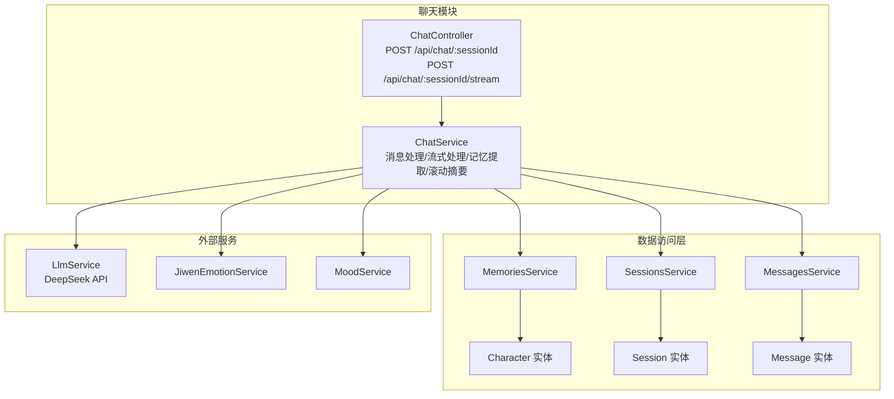
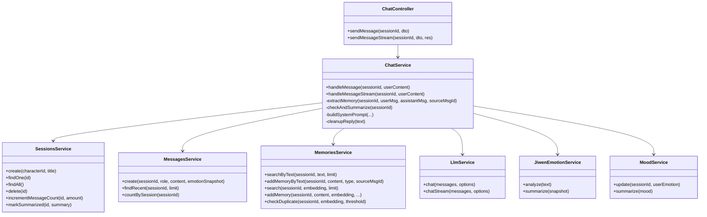
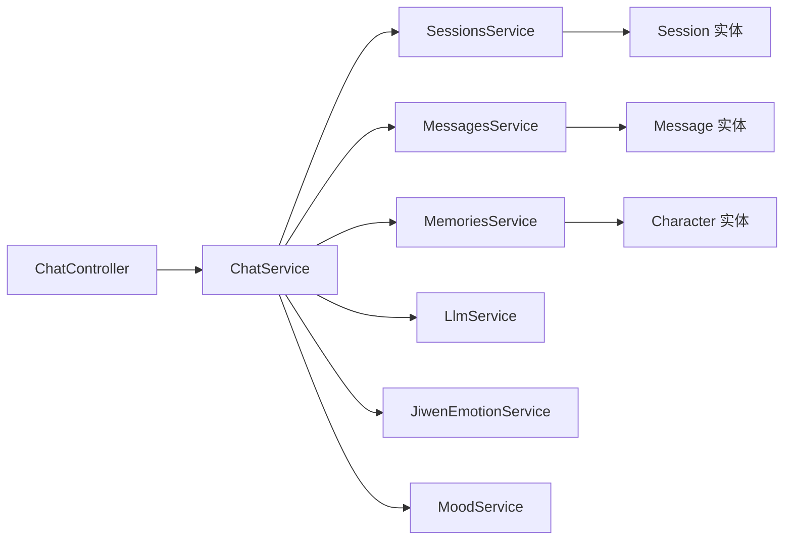
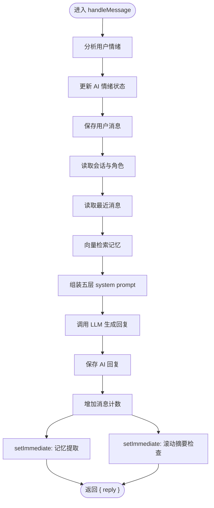
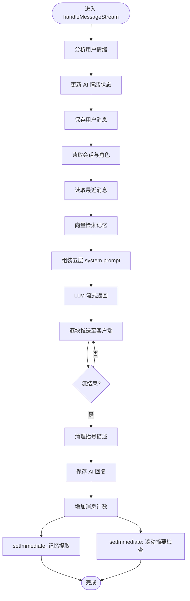

# 聊天服务模块

<cite>
**本文引用的文件**
- [chat.controller.ts](file://src/chat/chat.controller.ts)
- [chat.service.ts](file://src/chat/chat.service.ts)
- [chat.module.ts](file://src/chat/chat.module.ts)
- [sessions.controller.ts](file://src/sessions/sessions.controller.ts)
- [sessions.service.ts](file://src/sessions/sessions.service.ts)
- [memories.service.ts](file://src/memories/memories.service.ts)
- [messages.service.ts](file://src/messages/messages.service.ts)
- [llm.service.ts](file://src/llm/llm.service.ts)
- [jiwen-emotion.service.ts](file://src/emotion/jiwen-emotion.service.ts)
- [mood.service.ts](file://src/emotion/mood.service.ts)
- [character.entity.ts](file://src/characters/entities/character.entity.ts)
- [session.entity.ts](file://src/sessions/entities/session.entity.ts)
- [message.entity.ts](file://src/messages/entities/message.entity.ts)
- [types.ts](file://shared/types.ts)
- [app.module.ts](file://src/app.module.ts)
</cite>

## 目录
1. [简介](#简介)
2. [项目结构](#项目结构)
3. [核心组件](#核心组件)
4. [架构总览](#架构总览)
5. [详细组件分析](#详细组件分析)
6. [依赖分析](#依赖分析)
7. [性能考虑](#性能考虑)
8. [故障排查指南](#故障排查指南)
9. [结论](#结论)
10. [附录](#附录)

## 简介
本文件为 AI Companion 聊天服务模块的全面技术文档，聚焦控制器-服务-实体三层架构，系统阐述聊天控制器的同步与流式接口设计、聊天服务的核心业务编排（会话管理、消息处理、上下文维护、历史记忆检索与存储、情绪与情感状态编排）、以及与角色管理、记忆系统、LLM 与情感分析模块的交互关系。文档同时提供完整的 API 接口说明、错误处理机制、性能优化建议与常见问题排查。

## 项目结构
聊天模块位于 src/chat，采用标准 NestJS 分层：控制器负责 HTTP 接口与 SSE 流式推送，服务层编排业务流程并协调多个子服务，实体层定义数据库表结构。模块通过 TypeORM 注入角色、会话、消息、记忆等实体，依赖 LLM、记忆、情感分析等服务完成端到端对话闭环。

图表来源
- [chat.controller.ts:16-77](file://src/chat/chat.controller.ts#L16-L77)
- [chat.service.ts:30-40](file://src/chat/chat.service.ts#L30-L40)
- [sessions.service.ts:7-11](file://src/sessions/sessions.service.ts#L7-L11)
- [messages.service.ts:23-27](file://src/messages/messages.service.ts#L23-L27)
- [memories.service.ts:29-34](file://src/memories/memories.service.ts#L29-L34)
- [llm.service.ts:26-33](file://src/llm/llm.service.ts#L26-L33)
- [jiwen-emotion.service.ts:30-31](file://src/emotion/jiwen-emotion.service.ts#L30-L31)
- [mood.service.ts:17-19](file://src/emotion/mood.service.ts#L17-L19)

章节来源
- [chat.module.ts:12-35](file://src/chat/chat.module.ts#L12-L35)
- [app.module.ts:18-64](file://src/app.module.ts#L18-L64)

## 核心组件
- 控制器：提供同步聊天与流式聊天两个端点，负责参数校验、SSE 响应头设置与流式数据推送。
- 服务：编排完整对话流程，包括情绪分析、会话与角色读取、上下文组装、向量检索记忆、调用 LLM、保存消息、异步记忆提取与滚动摘要。
- 会话服务：创建/查询/删除会话，维护摘要、消息计数、导入画像等。
- 消息服务：保存消息、批量导入、读取最近消息、统计消息数。
- 记忆服务：基于 pgvector 的向量检索与去重插入，支持文本→嵌入→检索/去重→写入。
- LLM 服务：封装 DeepSeek API，支持同步与流式两种模式。
- 情感服务：用户情绪快照与摘要，AI 情绪状态建模与摘要。
- 实体：角色、会话、消息三类持久化对象。

章节来源
- [chat.controller.ts:16-77](file://src/chat/chat.controller.ts#L16-L77)
- [chat.service.ts:29-113](file://src/chat/chat.service.ts#L29-L113)
- [sessions.service.ts:7-61](file://src/sessions/sessions.service.ts#L7-L61)
- [messages.service.ts:22-92](file://src/messages/messages.service.ts#L22-L92)
- [memories.service.ts:29-137](file://src/memories/memories.service.ts#L29-L137)
- [llm.service.ts:26-146](file://src/llm/llm.service.ts#L26-L146)
- [jiwen-emotion.service.ts:30-133](file://src/emotion/jiwen-emotion.service.ts#L30-L133)
- [mood.service.ts:17-110](file://src/emotion/mood.service.ts#L17-L110)
- [character.entity.ts:3-22](file://src/characters/entities/character.entity.ts#L3-L22)
- [session.entity.ts:32-63](file://src/sessions/entities/session.entity.ts#L32-L63)
- [message.entity.ts:5-24](file://src/messages/entities/message.entity.ts#L5-L24)

## 架构总览
聊天模块遵循控制器-服务-实体分层，服务层通过注入的子服务完成业务编排，确保高内聚、低耦合。模块间通过明确的接口契约协作，避免循环依赖。

图表来源
- [chat.controller.ts:16-77](file://src/chat/chat.controller.ts#L16-L77)
- [chat.service.ts:30-40](file://src/chat/chat.service.ts#L30-L40)
- [sessions.service.ts:7-61](file://src/sessions/sessions.service.ts#L7-L61)
- [messages.service.ts:22-92](file://src/messages/messages.service.ts#L22-L92)
- [memories.service.ts:29-137](file://src/memories/memories.service.ts#L29-L137)
- [llm.service.ts:26-146](file://src/llm/llm.service.ts#L26-L146)
- [jiwen-emotion.service.ts:30-133](file://src/emotion/jiwen-emotion.service.ts#L30-L133)
- [mood.service.ts:17-110](file://src/emotion/mood.service.ts#L17-L110)

## 详细组件分析

### 聊天控制器（ChatController）
- 同步接口：POST /api/chat/:sessionId，接收 content 参数，调用 ChatService.handleMessage 返回完整回复。
- 流式接口：POST /api/chat/:sessionId/stream，设置 SSE 响应头，将 ChatService.handleMessageStream 的 Observable 逐块推送至客户端，结束时发送 [DONE] 标记。
- 错误处理：流式模式在 error 分支向客户端发送包含错误信息的数据帧并结束连接。

章节来源
- [chat.controller.ts:16-77](file://src/chat/chat.controller.ts#L16-L77)

### 聊天服务（ChatService）
- 同步流程要点
  - 用户情绪分析与 AI 情绪状态更新，保存用户消息。
  - 读取会话与角色，获取最近消息，向量检索相关记忆。
  - 组装五层 system prompt（固定人格、滚动摘要、导入画像、动态记忆、用户/AI 情绪、核心规则），调用 LLM 得到回复。
  - 保存 AI 回复，增加消息计数。
  - 异步触发记忆提取与滚动摘要检查。
- 流式流程要点
  - 与同步流程一致，但在 LLM 调用处使用 chatStream，逐块推送至客户端。
  - 流结束后清理括号动作描述、保存回复、更新计数，并触发异步记忆提取与滚动摘要。
- 异步任务
  - 记忆提取：从对话中抽取事实/偏好/情绪，向量化、去重、写入 memory_chunks。
  - 滚动摘要：当消息数达到阈值且距离上次摘要超过一小时时，对最近若干条消息进行摘要并更新会话。
- Prompt 组装与回复清理
  - buildSystemPrompt 支持多层上下文叠加，确保回复风格与规则约束。
  - cleanupReply 将括号动作描述替换为表情与颜文字，提升微信式自然度。

章节来源
- [chat.service.ts:42-113](file://src/chat/chat.service.ts#L42-L113)
- [chat.service.ts:130-231](file://src/chat/chat.service.ts#L130-L231)
- [chat.service.ts:249-315](file://src/chat/chat.service.ts#L249-L315)
- [chat.service.ts:334-374](file://src/chat/chat.service.ts#L334-L374)
- [chat.service.ts:424-497](file://src/chat/chat.service.ts#L424-L497)
- [chat.service.ts:507-544](file://src/chat/chat.service.ts#L507-L544)

### 会话服务（SessionsService）
- 创建会话、查询列表、按 ID 查询、删除会话。
- 维护摘要、消息计数、导入画像及其更新时间。
- 提供标记摘要完成与增量计数的方法，用于滚动摘要触发与性能优化。

章节来源
- [sessions.service.ts:7-61](file://src/sessions/sessions.service.ts#L7-L61)

### 消息服务（MessagesService）
- 保存单条或多条消息，读取最近 N 条消息用于上下文拼接，统计消息总数用于滚动摘要判断。
- 为 LLM 请求构造 user/assistant 交替的消息序列。

章节来源
- [messages.service.ts:22-92](file://src/messages/messages.service.ts#L22-L92)

### 记忆服务（MemoriesService）
- 基于 pgvector 的向量检索与去重插入，避免重复记忆。
- 文本→嵌入→检索/去重→写入的完整链路，支持按会话维度隔离与排序。

章节来源
- [memories.service.ts:29-137](file://src/memories/memories.service.ts#L29-L137)

### LLM 服务（LlmService）
- 同步 chat：等待完整回复后返回。
- 流式 chatStream：返回 Observable，逐块推送 delta 内容，前端可实现逐字显示。
- 支持模型、温度、最大 token 等参数配置。

章节来源
- [llm.service.ts:26-146](file://src/llm/llm.service.ts#L26-L146)

### 情感分析服务
- JiwenEmotionService：基于词典加权计算情绪快照，输出主导情绪、愉悦度、唤醒度与摘要策略。
- MoodService：维护会话级 AI 情绪状态，随用户情绪产生共鸣波动并生成回复语气摘要。

章节来源
- [jiwen-emotion.service.ts:30-133](file://src/emotion/jiwen-emotion.service.ts#L30-L133)
- [mood.service.ts:17-110](file://src/emotion/mood.service.ts#L17-L110)

### 数据模型
- 角色（Character）：包含 basePrompt、模型选择、说话风格等。
- 会话（Session）：包含角色 ID、标题、摘要、消息计数、导入画像及时间戳。
- 消息（Message）：包含会话 ID、角色、内容、情绪快照与创建时间。

章节来源
- [character.entity.ts:3-22](file://src/characters/entities/character.entity.ts#L3-L22)
- [session.entity.ts:32-63](file://src/sessions/entities/session.entity.ts#L32-L63)
- [message.entity.ts:5-24](file://src/messages/entities/message.entity.ts#L5-L24)

## 依赖分析
- 控制器仅依赖 ChatService，职责单一。
- ChatService 依赖会话、消息、记忆、LLM、情感分析服务，承担编排职责。
- 会话/消息服务依赖对应实体仓库，负责数据持久化。
- 记忆服务直接使用 DataSource 执行原生 SQL，绕过 TypeORM 对向量列的限制。
- 模块通过 TypeORM 注入实体，AppModule 统一配置数据库与迁移。

图表来源
- [chat.controller.ts:16-77](file://src/chat/chat.controller.ts#L16-L77)
- [chat.service.ts:30-40](file://src/chat/chat.service.ts#L30-L40)
- [sessions.service.ts:7-11](file://src/sessions/sessions.service.ts#L7-L11)
- [messages.service.ts:23-27](file://src/messages/messages.service.ts#L23-L27)
- [memories.service.ts:29-34](file://src/memories/memories.service.ts#L29-L34)
- [character.entity.ts:3-22](file://src/characters/entities/character.entity.ts#L3-L22)
- [session.entity.ts:32-63](file://src/sessions/entities/session.entity.ts#L32-L63)
- [message.entity.ts:5-24](file://src/messages/entities/message.entity.ts#L5-L24)

## 性能考虑
- 流式接口优先：在长回复场景使用 SSE 流式推送，降低首字延迟与等待时间。
- 异步记忆与摘要：将非关键路径的任务放入 setImmediate，避免阻塞主流程。
- 检索与去重：向量检索与去重使用 pgvector，注意索引与阈值设置，减少重复写入。
- 消息上下文：限制最近消息数量，平衡上下文长度与性能。
- LLM 参数：合理设置温度与最大 token，兼顾回复质量与稳定性。
- 数据库：pgvector 扩展与迁移需谨慎，避免 TypeORM 自动同步导致向量列丢失。

## 故障排查指南
- 角色不存在：当会话绑定的角色 ID 无法找到时抛出错误，检查角色是否正确创建。
- 记忆检索异常：向量检索可能因索引或数据异常失败，查看日志并确认 embedding 服务可用性。
- LLM 调用超时：检查 DEEPSEEK_API_KEY 与网络连通性，适当增大超时时间。
- SSE 流中断：确认响应头设置与客户端读取逻辑，确保在 error 分支正确结束连接。
- 情绪/摘要异常：若情绪或摘要为空，检查输入文本与摘要触发条件（消息数与时间间隔）。

章节来源
- [chat.service.ts:59-61](file://src/chat/chat.service.ts#L59-L61)
- [chat.service.ts:73-75](file://src/chat/chat.service.ts#L73-L75)
- [llm.service.ts:36-56](file://src/llm/llm.service.ts#L36-L56)
- [chat.controller.ts:66-69](file://src/chat/chat.controller.ts#L66-L69)
- [chat.service.ts:338-343](file://src/chat/chat.service.ts#L338-L343)

## 结论
聊天模块通过清晰的分层设计与完善的业务编排，实现了从消息输入到回复输出的完整闭环，结合角色、会话、记忆与情感分析，提供了具备上下文记忆与情绪共鸣能力的对话体验。同步与流式双通道满足不同场景需求，异步任务保障性能与稳定性。后续可在检索索引、LLM 参数与前端渲染方面持续优化。

## 附录

### API 接口文档

- 同步聊天
  - 方法与路径：POST /api/chat/:sessionId
  - 请求参数（SendMessagePayload）
    - content: string（必填）
  - 成功响应（SendMessageResponse）
    - reply: string
  - 错误处理
    - 角色不存在：抛出错误（服务内部）
    - LLM 调用异常：抛出错误（服务内部）

- 流式聊天（SSE）
  - 方法与路径：POST /api/chat/:sessionId/stream
  - 请求参数（SendMessagePayload）
    - content: string（必填）
  - 响应格式（SSE）
    - data: "<chunk>"（逐字/逐句）
    - data: "[DONE]"（结束标记）
  - 错误处理
    - 流中错误：data: "{\"error\":\"...\"}"
    - 连接中断：客户端自行处理

- 会话管理（参考）
  - 创建会话：POST /api/sessions
    - 请求体：{ characterId: string, title?: string }
    - 响应：SessionData
  - 查询会话：GET /api/sessions
    - 响应：SessionData[]
  - 获取单会话：GET /api/sessions/:id
    - 响应：SessionData
  - 删除会话：DELETE /api/sessions/:id
    - 响应：SessionData

章节来源
- [types.ts:92-98](file://shared/types.ts#L92-L98)
- [types.ts:104-108](file://shared/types.ts#L104-L108)
- [sessions.controller.ts:8-26](file://src/sessions/sessions.controller.ts#L8-L26)
- [chat.controller.ts:21-27](file://src/chat/chat.controller.ts#L21-L27)
- [chat.controller.ts:46-75](file://src/chat/chat.controller.ts#L46-L75)

### 关键流程图

#### 同步聊天流程

图表来源
- [chat.service.ts:42-113](file://src/chat/chat.service.ts#L42-L113)

#### 流式聊天流程

图表来源
- [chat.service.ts:130-231](file://src/chat/chat.service.ts#L130-L231)