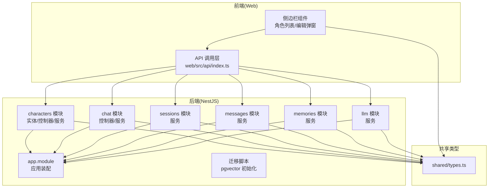
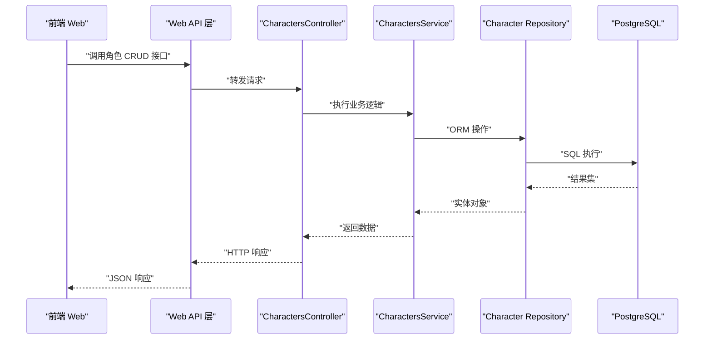
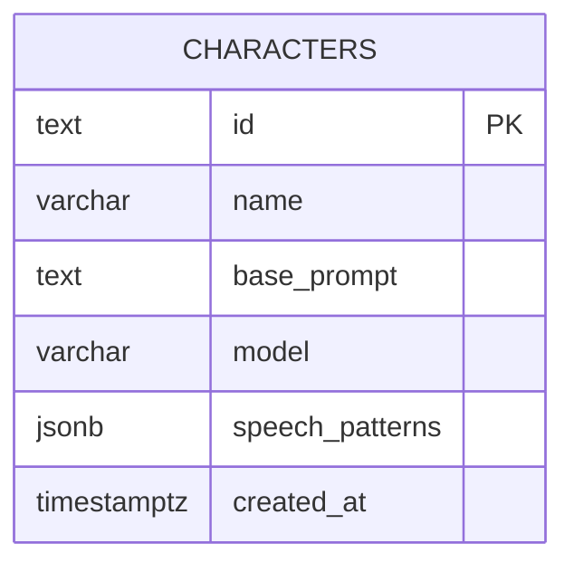
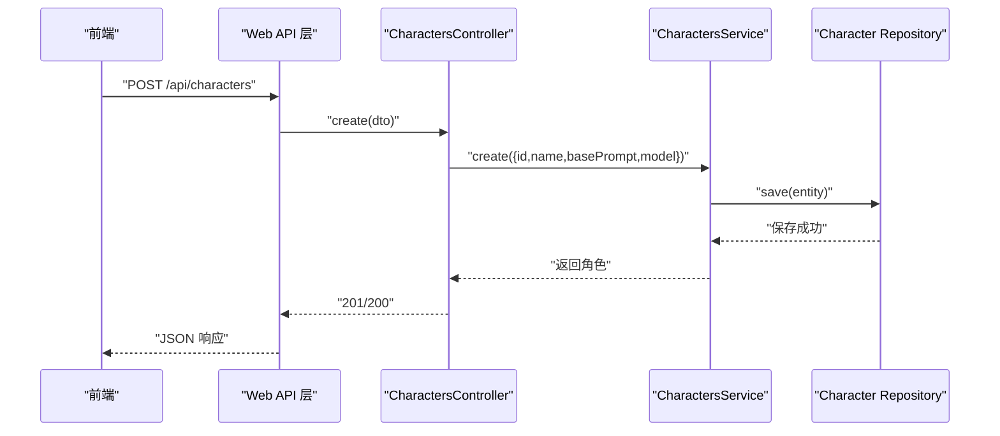
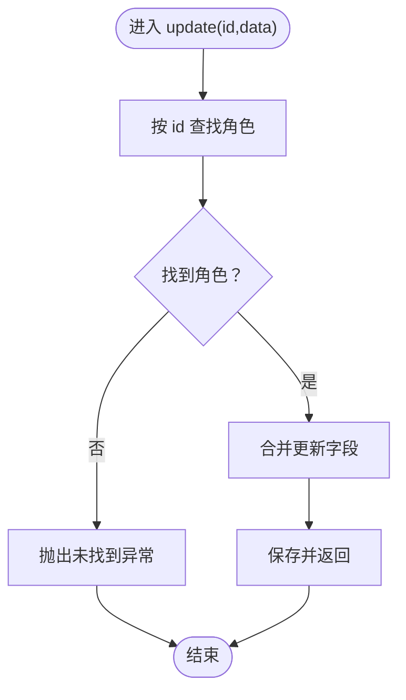
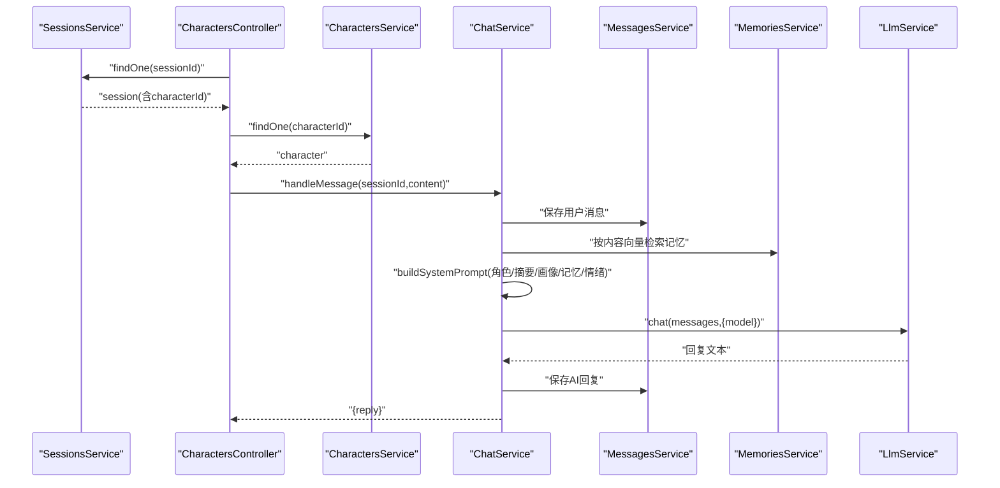
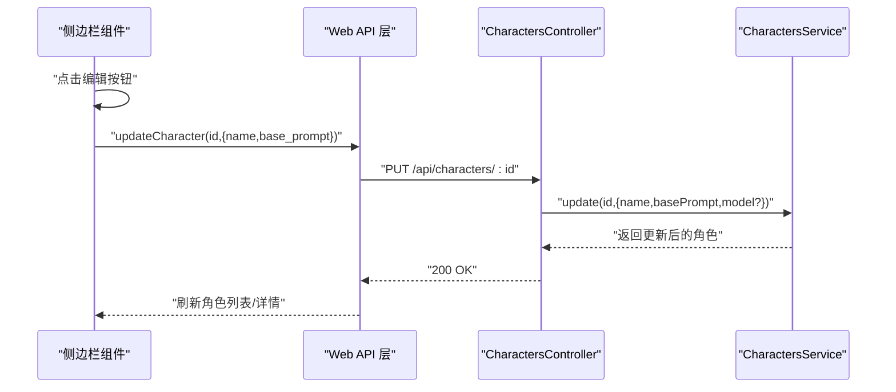
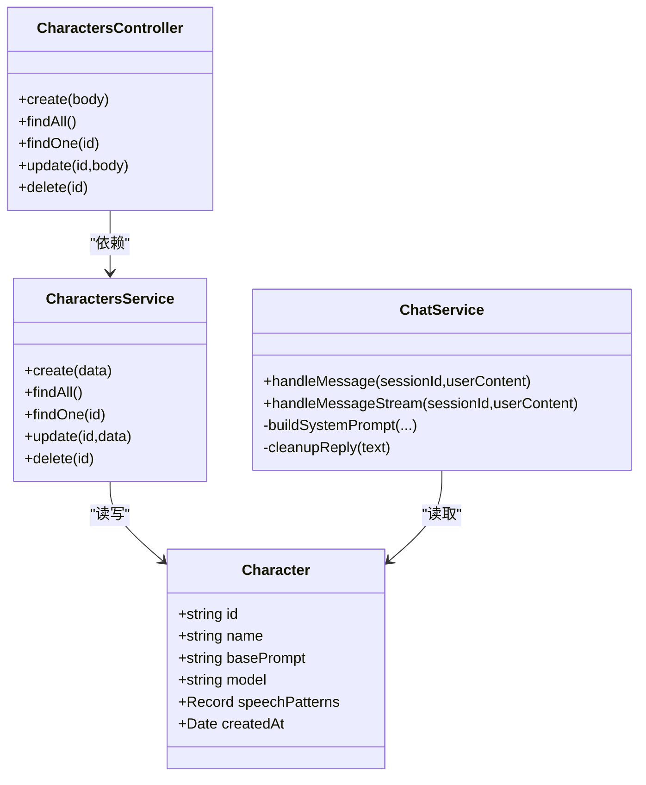

# 角色管理系统

<cite>
**本文档引用的文件**
- [character.entity.ts](file://src/characters/entities/character.entity.ts)
- [characters.controller.ts](file://src/characters/characters.controller.ts)
- [characters.service.ts](file://src/characters/characters.service.ts)
- [characters.module.ts](file://src/characters/characters.module.ts)
- [chat.controller.ts](file://src/chat/chat.controller.ts)
- [chat.service.ts](file://src/chat/chat.service.ts)
- [sessions.service.ts](file://src/sessions/sessions.service.ts)
- [messages.service.ts](file://src/messages/messages.service.ts)
- [memories.service.ts](file://src/memories/memories.service.ts)
- [llm.service.ts](file://src/llm/llm.service.ts)
- [types.ts](file://shared/types.ts)
- [app.module.ts](file://src/app.module.ts)
- [1710000000000-init-pgvector-schema.ts](file://src/migrations/1710000000000-init-pgvector-schema.ts)
- [index.ts](file://web/src/api/index.ts)
- [CharacterItem.tsx](file://web/src/components/Sidebar/CharacterItem.tsx)
- [EditCharacterModal.tsx](file://web/src/components/Sidebar/EditCharacterModal.tsx)
</cite>

## 目录
1. [简介](#简介)
2. [项目结构](#项目结构)
3. [核心组件](#核心组件)
4. [架构总览](#架构总览)
5. [详细组件分析](#详细组件分析)
6. [依赖分析](#依赖分析)
7. [性能考虑](#性能考虑)
8. [故障排查指南](#故障排查指南)
9. [结论](#结论)
10. [附录：API 文档与最佳实践](#附录api-文档与最佳实践)

## 简介
本文件面向“AI Companion”角色管理系统，围绕角色实体设计、数据库映射、控制器与服务的业务逻辑、与聊天模块的集成方式、Prompt 模板与参数配置、以及前端交互与 API 使用进行系统化技术说明。目标是帮助开发者快速理解并扩展角色管理能力，同时提供可操作的配置建议与排障指引。

## 项目结构
角色管理相关代码主要分布在后端 NestJS 模块与共享类型定义中，前端通过统一 API 层对接后端接口。

图表来源
- [characters.module.ts:1-14](file://src/characters/characters.module.ts#L1-L14)
- [chat.controller.ts:1-77](file://src/chat/chat.controller.ts#L1-L77)
- [chat.service.ts:1-547](file://src/chat/chat.service.ts#L1-L547)
- [sessions.service.ts:1-62](file://src/sessions/sessions.service.ts#L1-L62)
- [messages.service.ts:1-93](file://src/messages/messages.service.ts#L1-L93)
- [memories.service.ts:1-138](file://src/memories/memories.service.ts#L1-L138)
- [llm.service.ts:1-147](file://src/llm/llm.service.ts#L1-L147)
- [app.module.ts:1-64](file://src/app.module.ts#L1-L64)
- [1710000000000-init-pgvector-schema.ts:1-107](file://src/migrations/1710000000000-init-pgvector-schema.ts#L1-L107)
- [index.ts:1-212](file://web/src/api/index.ts#L1-L212)
- [types.ts:1-166](file://shared/types.ts#L1-L166)

章节来源
- [characters.module.ts:1-14](file://src/characters/characters.module.ts#L1-L14)
- [app.module.ts:18-62](file://src/app.module.ts#L18-L62)
- [1710000000000-init-pgvector-schema.ts:6-93](file://src/migrations/1710000000000-init-pgvector-schema.ts#L6-L93)
- [types.ts:34-54](file://shared/types.ts#L34-L54)

## 核心组件
- 角色实体与数据库映射：定义角色主键、显示名、基础 Prompt、默认模型、说话风格 JSON、创建时间等字段及约束。
- 角色控制器与服务：提供角色的增删改查与分页排序，支持按 id 查询与更新。
- 聊天服务：在消息处理链路中读取当前会话绑定的角色，组装多层 System Prompt 并调用 LLM。
- 会话与消息服务：维护会话与消息的持久化与上下文读取。
- 记忆服务：基于 pgvector 的向量检索与去重写入。
- LLM 服务：封装 DeepSeek API 的同步与流式调用。
- 前端 API 层与组件：提供角色 CRUD 与聊天交互的统一入口与 UI 控件。

章节来源
- [character.entity.ts:1-23](file://src/characters/entities/character.entity.ts#L1-L23)
- [characters.controller.ts:17-56](file://src/characters/characters.controller.ts#L17-L56)
- [characters.service.ts:6-41](file://src/characters/characters.service.ts#L6-L41)
- [chat.service.ts:42-113](file://src/chat/chat.service.ts#L42-L113)
- [sessions.service.ts:6-62](file://src/sessions/sessions.service.ts#L6-L62)
- [messages.service.ts:22-93](file://src/messages/messages.service.ts#L22-L93)
- [memories.service.ts:29-138](file://src/memories/memories.service.ts#L29-L138)
- [llm.service.ts:26-147](file://src/llm/llm.service.ts#L26-L147)
- [index.ts:58-81](file://web/src/api/index.ts#L58-L81)

## 架构总览
角色管理贯穿“前端 API 层 → 控制器 → 服务 → 数据库/向量存储”的完整链路，并与聊天模块协同工作，形成“角色选择 → 上下文组装 → LLM 调用 → 记忆提取/摘要”的闭环。

图表来源
- [characters.controller.ts:17-56](file://src/characters/characters.controller.ts#L17-L56)
- [characters.service.ts:6-41](file://src/characters/characters.service.ts#L6-L41)
- [character.entity.ts:1-23](file://src/characters/entities/character.entity.ts#L1-L23)
- [index.ts:58-81](file://web/src/api/index.ts#L58-L81)

## 详细组件分析

### 角色实体与数据库映射
- 主键：id（text，唯一标识）
- 名称：name（显示名）
- 基础 Prompt：basePrompt（text，固定人格设定）
- 默认模型：model（text，默认值 deepseek-chat）
- 说话风格：speechPatterns（jsonb，默认空对象）
- 创建时间：createdAt（自动生成）

图表来源
- [character.entity.ts:4-22](file://src/characters/entities/character.entity.ts#L4-L22)
- [1710000000000-init-pgvector-schema.ts:24-32](file://src/migrations/1710000000000-init-pgvector-schema.ts#L24-L32)

章节来源
- [character.entity.ts:1-23](file://src/characters/entities/character.entity.ts#L1-L23)
- [1710000000000-init-pgvector-schema.ts:24-32](file://src/migrations/1710000000000-init-pgvector-schema.ts#L24-L32)

### 角色控制器 API 实现
- POST /api/characters：创建角色（id、name、base_prompt、model）
- GET /api/characters：查询全部角色（按创建时间倒序）
- GET /api/characters/:id：按 id 查询角色
- PUT /api/characters/:id：更新角色（name、base_prompt、model）
- DELETE /api/characters/:id：删除角色

图表来源
- [characters.controller.ts:21-29](file://src/characters/characters.controller.ts#L21-L29)
- [characters.service.ts:13-16](file://src/characters/characters.service.ts#L13-L16)
- [index.ts:58-60](file://web/src/api/index.ts#L58-L60)

章节来源
- [characters.controller.ts:17-56](file://src/characters/characters.controller.ts#L17-L56)
- [index.ts:58-81](file://web/src/api/index.ts#L58-L81)

### 角色服务业务逻辑
- create：构造实体并保存
- findAll：按创建时间倒序查询
- findOne：按 id 查询，不存在则抛出异常
- update：按 id 查找并合并更新字段后保存
- delete：按 id 查找并移除

图表来源
- [characters.service.ts:30-34](file://src/characters/characters.service.ts#L30-L34)
- [characters.service.ts:22-28](file://src/characters/characters.service.ts#L22-L28)

章节来源
- [characters.service.ts:6-41](file://src/characters/characters.service.ts#L6-L41)

### 角色与聊天模块的集成
- 会话绑定角色：聊天服务在处理消息前，先根据会话 id 读取当前角色。
- Prompt 组装：聊天服务将角色的 basePrompt、会话摘要、导入画像、检索记忆、情绪摘要与 AI 情绪摘要按层级拼装为 system prompt。
- LLM 调用：使用角色的 model 或默认模型，调用 LLM 服务生成回复。
- 流式与非流式：支持同步完整回复与 SSE 流式推送。

图表来源
- [chat.controller.ts:21-27](file://src/chat/chat.controller.ts#L21-L27)
- [chat.service.ts:55-61](file://src/chat/chat.service.ts#L55-L61)
- [chat.service.ts:78-95](file://src/chat/chat.service.ts#L78-L95)
- [llm.service.ts:36-57](file://src/llm/llm.service.ts#L36-L57)

章节来源
- [chat.service.ts:42-113](file://src/chat/chat.service.ts#L42-L113)
- [chat.service.ts:424-497](file://src/chat/chat.service.ts#L424-L497)
- [llm.service.ts:26-147](file://src/llm/llm.service.ts#L26-L147)

### Prompt 模板管理与参数配置
- 四层 Prompt 组装：
  - 固定层：角色 basePrompt
  - 风格层：speechPatterns 中的语气、句尾、口头禅、表情风格、平均长度、反问频率、自我披露等提示
  - 摘要层：会话滚动摘要
  - 画像层：导入画像 userPersona/relationshipProfile 的稳定事实、偏好、表达风格、情绪模式、边界、关系语气、亲密度、信任信号、反复话题、支持需求、AI 角色等
  - 记忆层：向量检索得到的记忆片段
  - 情绪层：用户情绪摘要与 AI 情绪摘要
  - 规则层：严格的行为与表达规则（如禁止说自己是 AI、严禁括号动作描述、强调表情与颜文字等）
- 模型参数：
  - 默认模型：deepseek-chat
  - 默认温度：0.8；记忆提取任务使用较低温度（0.3）以提升准确性
  - 默认最大 tokens：2000；摘要任务使用 500
- 说话风格注入：speechPatterns 以 JSON 形式存储，运行时动态注入到第二层提示中

章节来源
- [chat.service.ts:424-497](file://src/chat/chat.service.ts#L424-L497)
- [llm.service.ts:36-57](file://src/llm/llm.service.ts#L36-L57)
- [memories.service.ts:115-136](file://src/memories/memories.service.ts#L115-L136)

### 角色状态控制与前端交互
- 前端角色列表展示：CharacterItem 组件渲染角色头像、名称与基础 Prompt 预览，并支持点击选中与编辑按钮。
- 编辑弹窗：EditCharacterModal 支持修改名称与基础 Prompt，并提供删除确认与保存状态反馈。
- API 调用：web/src/api/index.ts 提供 create/update/delete/getCharacters/getCharacter 等接口，统一错误处理与 SSE 流式聊天。

图表来源
- [CharacterItem.tsx:10-37](file://web/src/components/Sidebar/CharacterItem.tsx#L10-L37)
- [EditCharacterModal.tsx:19-39](file://web/src/components/Sidebar/EditCharacterModal.tsx#L19-L39)
- [index.ts:70-77](file://web/src/api/index.ts#L70-L77)

章节来源
- [CharacterItem.tsx:1-38](file://web/src/components/Sidebar/CharacterItem.tsx#L1-L38)
- [EditCharacterModal.tsx:1-70](file://web/src/components/Sidebar/EditCharacterModal.tsx#L1-L70)
- [index.ts:58-81](file://web/src/api/index.ts#L58-L81)

## 依赖分析
- 模块耦合：
  - CharactersModule 仅依赖 TypeORM 注册的 Character 实体，导出服务供其他模块使用（如 ChatService 读取角色）。
  - ChatService 依赖 CharactersRepository、SessionsService、MessagesService、MemoriesService、LlmService 等，体现强业务编排特性。
- 外部依赖：
  - PostgreSQL + pgvector：角色、会话、消息、记忆向量存储与索引。
  - DeepSeek API：同步与流式对话。
- 类关系图：

图表来源
- [character.entity.ts:4-22](file://src/characters/entities/character.entity.ts#L4-L22)
- [characters.controller.ts:17-56](file://src/characters/characters.controller.ts#L17-L56)
- [characters.service.ts:6-41](file://src/characters/characters.service.ts#L6-L41)
- [chat.service.ts:31-40](file://src/chat/chat.service.ts#L31-L40)

章节来源
- [characters.module.ts:7-12](file://src/characters/characters.module.ts#L7-L12)
- [chat.service.ts:31-40](file://src/chat/chat.service.ts#L31-L40)

## 性能考虑
- 数据库索引：
  - memory_chunks.embedding 使用 HNSW（余弦距离）索引，提升向量检索性能。
  - memory_chunks.session_id、messages.session_id 等组合索引，优化按会话检索。
- 查询优化：
  - 角色查询按创建时间倒序，便于前端展示最新角色。
  - 消息查询限制最近 N 条，减少 LLM 上下文长度。
- LLM 参数：
  - 默认温度 0.8 平衡创意与稳定性；记忆提取任务使用更低温度（0.3）。
  - 分层 Prompt 控制 tokens 使用，避免超限。
- 异步处理：
  - 记忆提取与滚动摘要在 setImmediate 中异步执行，不阻塞主流程。

章节来源
- [1710000000000-init-pgvector-schema.ts:84-92](file://src/migrations/1710000000000-init-pgvector-schema.ts#L84-L92)
- [messages.service.ts:67-74](file://src/messages/messages.service.ts#L67-L74)
- [chat.service.ts:103-110](file://src/chat/chat.service.ts#L103-L110)
- [llm.service.ts:36-57](file://src/llm/llm.service.ts#L36-L57)

## 故障排查指南
- 角色不存在：
  - 当会话绑定的角色不存在时，聊天服务会抛出错误；检查会话 characterId 是否正确。
- 角色查询异常：
  - CharactersService.findOne 未找到角色会抛出未找到异常；确认 id 是否有效。
- LLM 调用失败：
  - 检查 DEEPSEEK_API_KEY 是否配置；关注超时与流式解析错误。
- 记忆检索异常：
  - 向量检索 try/catch 包裹，失败会记录日志；确认 pgvector 扩展与索引是否存在。
- SSE 流式问题：
  - 确认响应头设置与前端解析逻辑；注意 [DONE] 标记与缓冲区处理。

章节来源
- [chat.service.ts:59-61](file://src/chat/chat.service.ts#L59-L61)
- [characters.service.ts:24-26](file://src/characters/characters.service.ts#L24-L26)
- [llm.service.ts:133-135](file://src/llm/llm.service.ts#L133-L135)
- [memories.service.ts:73-88](file://src/memories/memories.service.ts#L73-L88)
- [chat.controller.ts:52-74](file://src/chat/chat.controller.ts#L52-L74)

## 结论
角色管理系统以清晰的实体与模块划分为基础，结合多层 Prompt 组装与 pgvector 向量检索，实现了可定制、可扩展的人格化对话体验。通过前后端统一的 API 层与类型定义，系统具备良好的可移植性与一致性。建议在实际部署中重点关注数据库索引、LLM 参数调优与前端流式体验的稳定性。

## 附录：API 文档与最佳实践

### API 文档
- 角色管理
  - POST /api/characters：创建角色
  - GET /api/characters：获取全部角色
  - GET /api/characters/:id：按 id 获取角色
  - PUT /api/characters/:id：更新角色
  - DELETE /api/characters/:id：删除角色
- 会话管理
  - POST /api/sessions：创建会话（绑定角色）
  - GET /api/sessions：获取全部会话
  - GET /api/sessions/:id：按 id 获取会话
  - DELETE /api/sessions/:id：删除会话
- 消息查询
  - GET /api/messages?sessionId=...&limit=...：获取会话消息
- 聊天
  - POST /api/chat/:sessionId：同步发送消息
  - POST /api/chat/:sessionId/stream：SSE 流式发送消息

章节来源
- [index.ts:58-81](file://web/src/api/index.ts#L58-L81)
- [index.ts:87-101](file://web/src/api/index.ts#L87-L101)
- [index.ts:107-112](file://web/src/api/index.ts#L107-L112)
- [index.ts:118-123](file://web/src/api/index.ts#L118-L123)
- [index.ts:137-201](file://web/src/api/index.ts#L137-L201)

### 最佳实践
- Prompt 设计
  - 固定层：明确角色身份、背景与边界，避免“你是 AI”等违禁表述。
  - 风格层：通过 speechPatterns 注入语气、句尾、表情风格等，保持回复自然。
  - 画像层：导入 userPersona 与 relationshipProfile，增强个性化与一致性。
  - 规则层：严格禁止括号动作描述，强调表情与颜文字的使用。
- 参数调优
  - 默认温度 0.8；记忆提取任务使用 0.3；摘要任务使用 0.5。
  - 控制最大 tokens，避免上下文过长导致成本上升与延迟增加。
- 数据库与索引
  - 确保 pgvector 扩展与索引存在；定期检查向量维度与相似度阈值。
- 前端交互
  - 使用 SSE 流式渲染，提升用户体验；提供取消请求能力。
  - 编辑角色时进行输入校验与保存状态反馈。

章节来源
- [chat.service.ts:424-497](file://src/chat/chat.service.ts#L424-L497)
- [llm.service.ts:36-57](file://src/llm/llm.service.ts#L36-L57)
- [memories.service.ts:115-136](file://src/memories/memories.service.ts#L115-L136)
- [index.ts:137-201](file://web/src/api/index.ts#L137-L201)