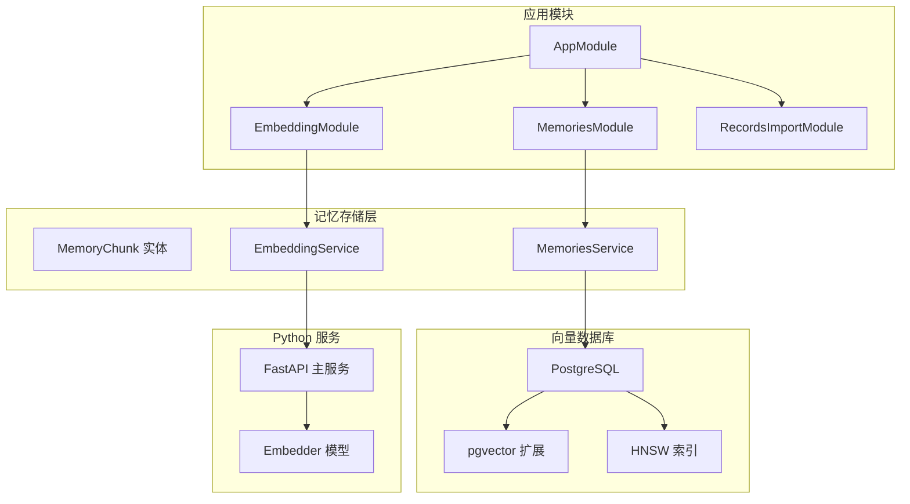
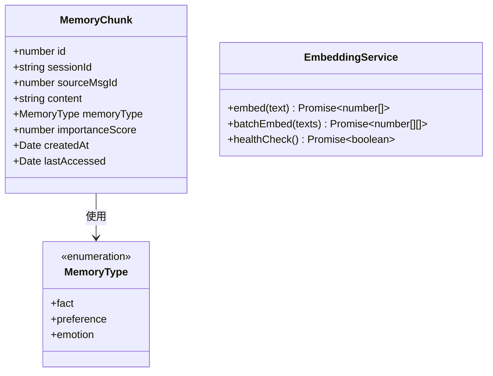
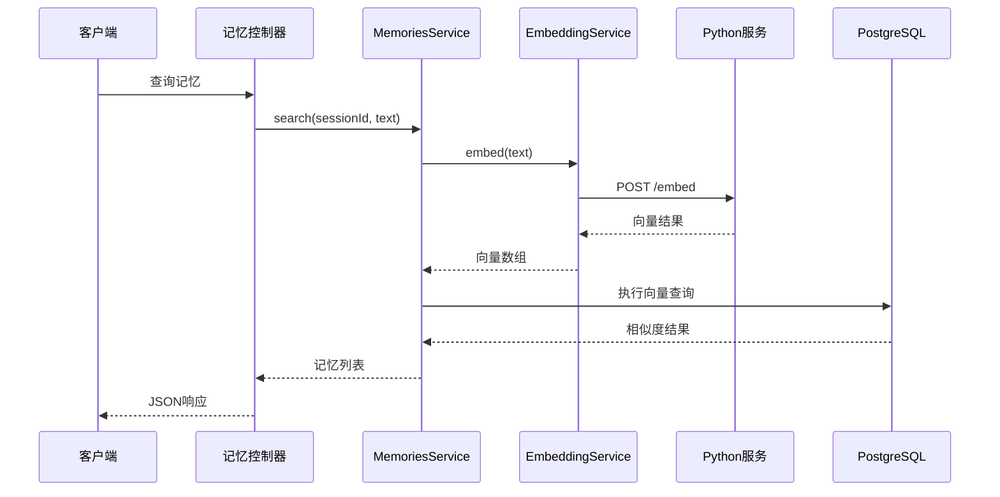
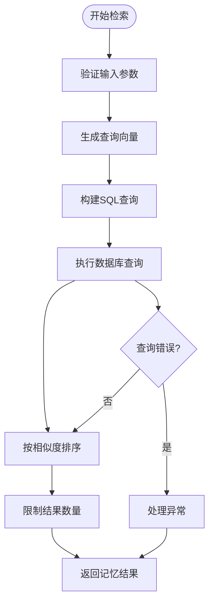
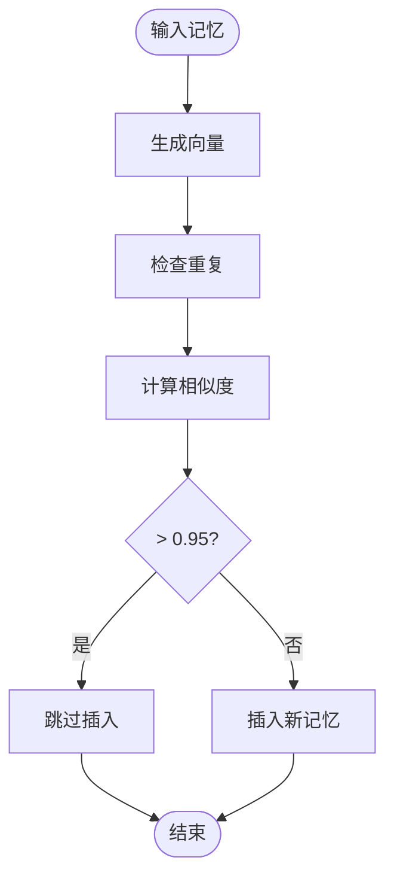
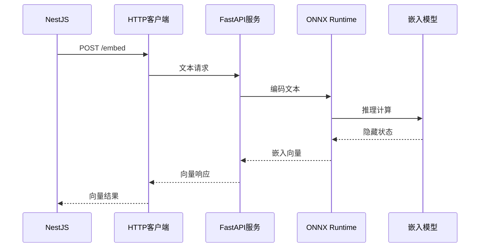
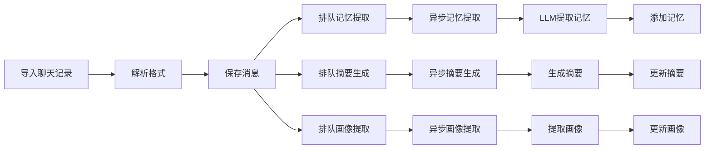
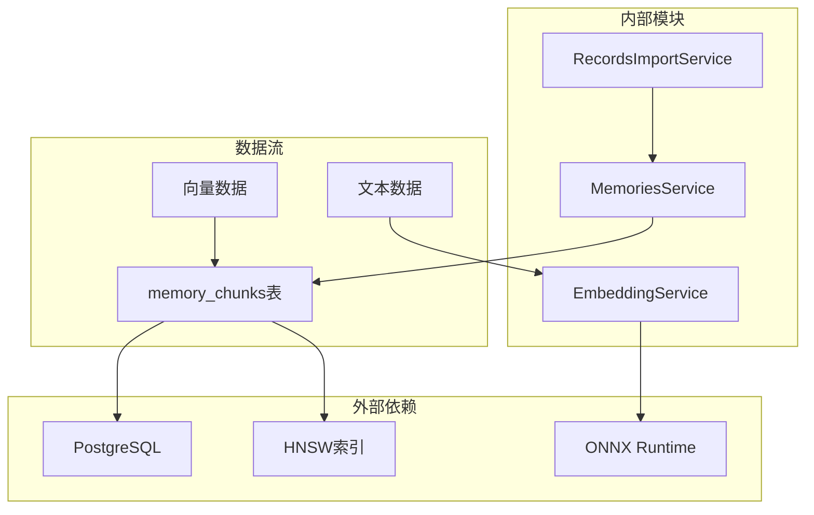

# 记忆存储模块

<cite>
**本文档引用的文件**
- [src/memories/entities/memory.entity.ts](file://src/memories/entities/memory.entity.ts)
- [src/memories/memories.service.ts](file://src/memories/memories.service.ts)
- [src/memories/memories.module.ts](file://src/memories/memories.module.ts)
- [src/embedding/embedding.service.ts](file://src/embedding/embedding.service.ts)
- [src/migrations/1710000000000-init-pgvector-schema.ts](file://src/migrations/1710000000000-init-pgvector-schema.ts)
- [python/embedder.py](file://python/embedder.py)
- [python/main.py](file://python/main.py)
- [src/records-import/records-import.service.ts](file://src/records-import/records-import.service.ts)
- [src/records-import/records-import.controller.ts](file://src/records-import/records-import.controller.ts)
- [shared/types.ts](file://shared/types.ts)
- [src/app.module.ts](file://src/app.module.ts)
</cite>

## 目录
1. [简介](#简介)
2. [项目结构](#项目结构)
3. [核心组件](#核心组件)
4. [架构概览](#架构概览)
5. [详细组件分析](#详细组件分析)
6. [依赖关系分析](#依赖关系分析)
7. [性能考虑](#性能考虑)
8. [故障排除指南](#故障排除指南)
9. [结论](#结论)
10. [附录](#附录)

## 简介

AI Companion记忆存储模块是一个基于PostgreSQL + pgvector的向量数据库系统，专门用于存储和检索人类长期记忆。该模块采用混合架构设计，将传统的关系型数据管理与现代向量相似度检索相结合，实现了高效的语义记忆存储和查询。

该模块的核心特性包括：
- **向量嵌入存储**：使用768维向量表示记忆内容的语义特征
- **语义检索**：基于余弦相似度的智能记忆匹配
- **去重机制**：防止重复记忆的插入
- **批量处理**：支持大规模记忆的高效导入
- **异步处理**：后台执行记忆提取和摘要生成

## 项目结构

记忆存储模块在整体项目中的位置和组织方式如下：



**图表来源**
- [src/app.module.ts:18-63](file://src/app.module.ts#L18-L63)
- [src/memories/memories.module.ts:12-17](file://src/memories/memories.module.ts#L12-L17)
- [src/embedding/embedding.service.ts:14-21](file://src/embedding/embedding.service.ts#L14-L21)

**章节来源**
- [src/app.module.ts:18-63](file://src/app.module.ts#L18-L63)
- [src/memories/memories.module.ts:12-17](file://src/memories/memories.module.ts#L12-L17)

## 核心组件

### 记忆实体设计

记忆实体采用简洁而高效的设计，专注于存储记忆的核心要素：



**图表来源**
- [src/memories/entities/memory.entity.ts:17-43](file://src/memories/entities/memory.entity.ts#L17-L43)
- [src/memories/memories.service.ts:5](file://src/memories/memories.service.ts#L5)

### 向量数据结构

向量数据采用768维的密集向量表示，通过Jina v2中文嵌入模型生成：

| 特征 | 描述 | 大小 |
|------|------|------|
| 维度 | 嵌入向量维度 | 768 |
| 类型 | 浮点数数组 | [-1.0, 1.0] |
| 归一化 | L2范数归一化 | 1.0 |
| 存储 | PostgreSQL VECTOR类型 | 3MB/条 |

**章节来源**
- [src/memories/entities/memory.entity.ts:30](file://src/memories/entities/memory.entity.ts#L30)
- [python/embedder.py:103-115](file://python/embedder.py#L103-L115)

## 架构概览

记忆存储模块采用分层架构，清晰分离了数据访问、业务逻辑和服务集成：



**图表来源**
- [src/memories/memories.service.ts:115-118](file://src/memories/memories.service.ts#L115-L118)
- [src/embedding/embedding.service.ts:33-42](file://src/embedding/embedding.service.ts#L33-L42)
- [python/main.py:91-100](file://python/main.py#L91-L100)

## 详细组件分析

### 记忆服务核心算法

#### 向量相似度检索算法

记忆服务实现了高效的向量相似度检索，基于pgvector的余弦距离运算符：



**图表来源**
- [src/memories/memories.service.ts:42-59](file://src/memories/memories.service.ts#L42-L59)

#### 去重机制算法

系统采用余弦相似度阈值判断重复记忆：



**图表来源**
- [src/memories/memories.service.ts:93-110](file://src/memories/memories.service.ts#L93-L110)

### Python嵌入服务集成

#### 模型加载和推理流程

Python服务采用ONNX Runtime进行高效的向量生成：



**图表来源**
- [python/main.py:52-62](file://python/main.py#L52-L62)
- [python/embedder.py:103-115](file://python/embedder.py#L103-L115)

### 批量导入和处理

#### 导入流水线架构

系统实现了完整的聊天记录导入和记忆提取流水线：



**图表来源**
- [src/records-import/records-import.service.ts:88-117](file://src/records-import/records-import.service.ts#L88-L117)
- [src/records-import/records-import.service.ts:245-287](file://src/records-import/records-import.service.ts#L245-L287)

**章节来源**
- [src/records-import/records-import.service.ts:48-128](file://src/records-import/records-import.service.ts#L48-L128)

## 依赖关系分析

### 组件耦合度分析

记忆存储模块展现了良好的内聚性和低耦合性：



**图表来源**
- [src/memories/memories.service.ts:31-34](file://src/memories/memories.service.ts#L31-L34)
- [src/embedding/embedding.service.ts:18-21](file://src/embedding/embedding.service.ts#L18-L21)

### 数据流依赖

系统中的数据流向体现了清晰的单向依赖关系：

| 组件 | 输入 | 输出 | 用途 |
|------|------|------|------|
| EmbeddingService | 文本 | 向量 | 记忆向量化 |
| MemoriesService | 向量/文本 | 记忆 | 检索和存储 |
| RecordsImportService | 导入数据 | 记忆提取 | 批量处理 |
| PostgreSQL | 记忆数据 | 查询结果 | 持久化存储 |

**章节来源**
- [src/memories/memories.service.ts:115-136](file://src/memories/memories.service.ts#L115-L136)
- [src/embedding/embedding.service.ts:33-65](file://src/embedding/embedding.service.ts#L33-L65)

## 性能考虑

### 索引优化策略

pgvector的HNSW索引配置对查询性能至关重要：

| 索引参数 | 值 | 作用 | 性能影响 |
|----------|----|------|----------|
| m | 16 | 节点连接数 | 更精确但占用更多空间 |
| ef_construction | 64 | 构建搜索深度 | 更精确但构建时间更长 |
| ef_search | 默认 | 查询搜索深度 | 可根据需求调整 |

### 批处理优化

Python服务实现了高效的批量向量化处理：

- **批量大小**：建议16-32条文本进行批量处理
- **内存管理**：ONNX Runtime自动管理内存池
- **并发控制**：HTTP服务支持多请求并发
- **超时设置**：单条推理10秒，批量推理30秒

### 缓存策略

系统采用了多层次的缓存机制：

1. **Python服务缓存**：ONNX模型和tokenizer的内存缓存
2. **数据库查询缓存**：热点记忆的查询结果缓存
3. **会话级缓存**：当前会话的记忆检索结果缓存

## 故障排除指南

### 常见问题诊断

#### 向量服务不可用

**症状**：`EmbeddingService`调用失败，返回超时错误

**排查步骤**：
1. 检查Python服务进程状态
2. 验证模型文件是否存在
3. 确认端口8000未被占用
4. 检查网络连接

**解决方法**：
```bash
# 启动Python服务
uv run uvicorn python/main.py:app --port 8000

# 检查服务健康状态
curl http://localhost:8000/health
```

#### pgvector索引问题

**症状**：查询性能下降或索引失效

**排查步骤**：
1. 检查HNSW索引状态
2. 验证向量维度一致性
3. 确认索引重建需求

**解决方法**：
```sql
-- 重建索引
DROP INDEX IF EXISTS idx_memory_embedding;
CREATE INDEX idx_memory_embedding ON memory_chunks 
USING hnsw (embedding vector_cosine_ops) 
WITH (m = 16, ef_construction = 64);

-- 分析表统计信息
ANALYZE memory_chunks;
```

#### 内存泄漏问题

**症状**：长时间运行后内存使用持续增长

**排查步骤**：
1. 监控Python服务内存使用
2. 检查ONNX会话生命周期
3. 验证垃圾回收机制

**解决方法**：
- 设置适当的超时时间
- 定期重启Python服务
- 监控内存使用情况

**章节来源**
- [src/embedding/embedding.service.ts:70-82](file://src/embedding/embedding.service.ts#L70-L82)
- [python/main.py:115-122](file://python/main.py#L115-L122)

## 结论

AI Companion记忆存储模块通过精心设计的混合架构，成功实现了高效、可靠的向量记忆管理系统。该模块的主要优势包括：

1. **架构清晰**：明确分离向量处理和关系数据管理
2. **性能优异**：基于pgvector的HNSW索引提供快速相似度检索
3. **扩展性强**：模块化设计便于功能扩展和维护
4. **可靠性高**：完善的错误处理和监控机制

未来可以考虑的改进方向：
- 实现增量索引更新机制
- 添加向量数据的备份和恢复策略
- 优化批量处理的并发控制
- 增强记忆质量评估和过滤机制

## 附录

### API参考

#### 记忆检索接口

| 接口 | 方法 | 路径 | 功能 |
|------|------|------|------|
| 检索记忆 | POST | `/api/import/chat-records` | 导入聊天记录并提取记忆 |
| 生成角色设定 | POST | `/api/import/enrich-character/:sessionId` | 基于聊天记录生成角色设定 |

#### 配置选项

| 环境变量 | 默认值 | 说明 |
|----------|--------|------|
| PYTHON_EMBED_URL | `http://localhost:8000` | Python嵌入服务地址 |
| EMBEDDING_MAX_LENGTH | `512` | 最大文本长度 |
| DB_HOST | `localhost` | 数据库主机 |
| DB_PORT | `54321` | 数据库端口 |
| DB_NAME | `companion` | 数据库名称 |

### 最佳实践

#### 内容组织策略

1. **记忆类型划分**：合理使用fact、preference、emotion三种类型
2. **重要性评分**：根据记忆的重要程度设置评分
3. **时间管理**：定期清理过期记忆
4. **去重策略**：利用相似度阈值避免重复

#### 检索效果优化

1. **查询优化**：合理设置limit参数
2. **预处理**：对输入文本进行必要的清洗
3. **缓存策略**：利用会话级缓存提升性能
4. **监控指标**：跟踪查询延迟和命中率