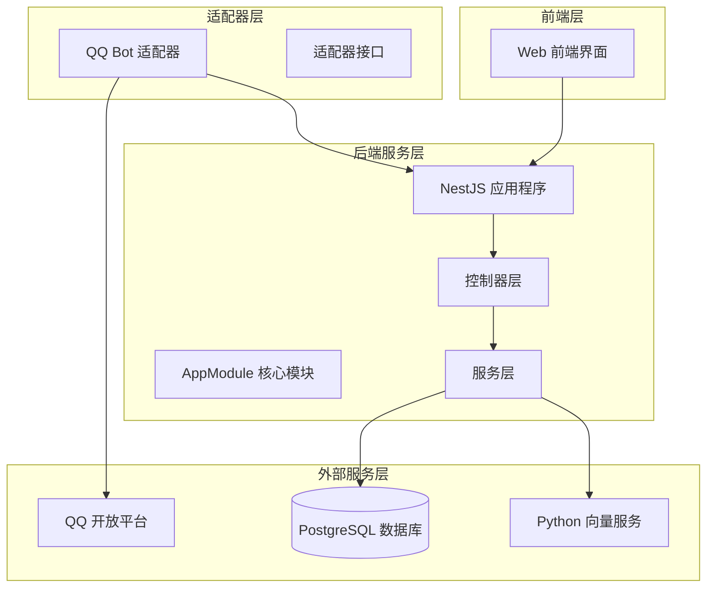
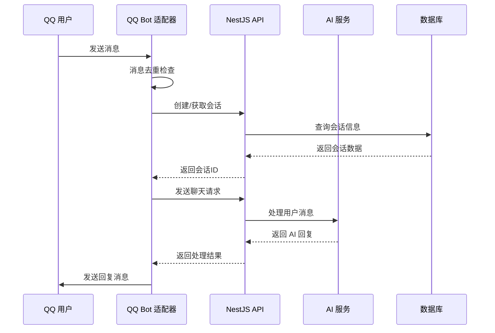
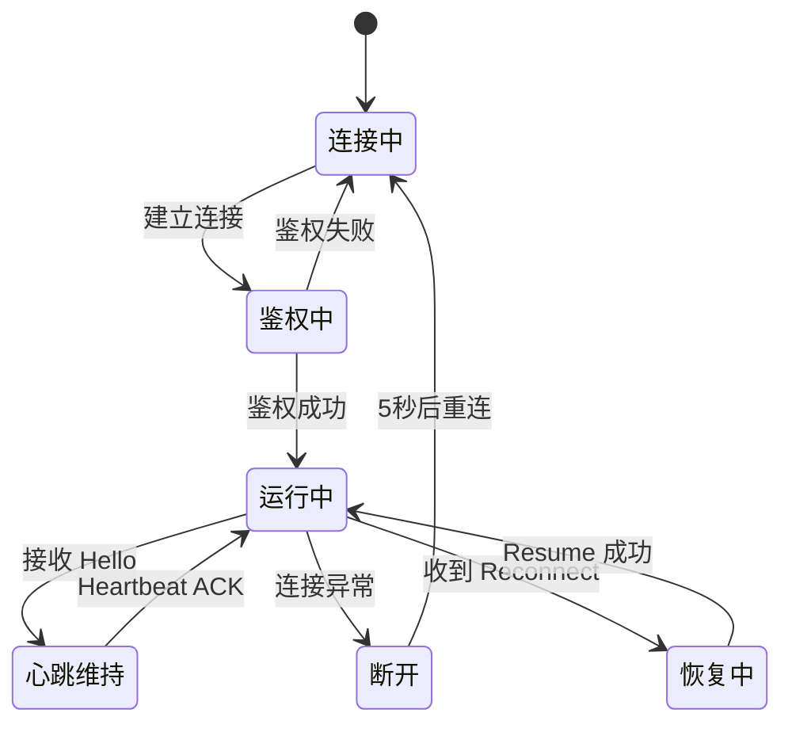
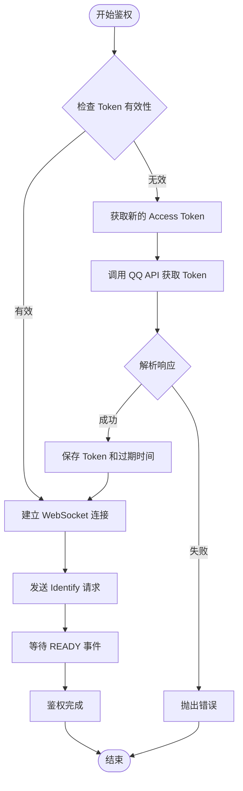
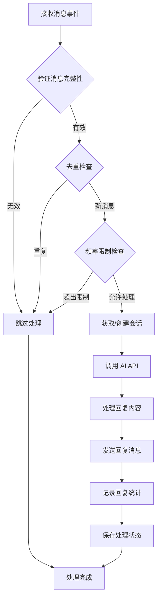
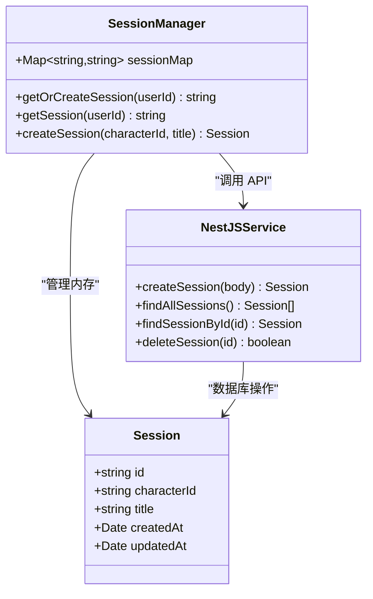
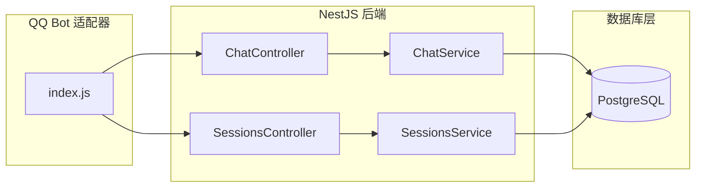

# QQ Bot 集成指南

<cite>
**本文档引用的文件**
- [adapters/qq-bot/index.js](file://adapters/qq-bot/index.js)
- [adapters/qq-bot/adapter.js](file://adapters/qq-bot/adapter.js)
- [docs/QQ_Bot_Integration.md](file://docs/QQ_Bot_Integration.md)
- [src/app.module.ts](file://src/app.module.ts)
- [src/main.ts](file://src/main.ts)
- [src/sessions/sessions.controller.ts](file://src/sessions/sessions.controller.ts)
- [src/chat/chat.controller.ts](file://src/chat/chat.controller.ts)
- [package.json](file://package.json)
</cite>

## 目录
1. [简介](#简介)
2. [项目结构](#项目结构)
3. [核心组件](#核心组件)
4. [架构概览](#架构概览)
5. [详细组件分析](#详细组件分析)
6. [依赖关系分析](#依赖关系分析)
7. [性能考虑](#性能考虑)
8. [故障排除指南](#故障排除指南)
9. [结论](#结论)

## 简介

本指南详细介绍了如何将 AI Companion 系统与 QQ 机器人平台进行集成，实现通过 QQ 私聊或群聊与 AI 角色进行智能对话的功能。该系统采用 WebSocket 协议与 QQ 开放平台通信，实现了完整的消息收发、会话管理和 AI 对话集成。

## 项目结构

AI Companion 项目采用 NestJS 框架构建，整体架构分为以下几个主要部分：



**图表来源**
- [src/app.module.ts:18-64](file://src/app.module.ts#L18-L64)
- [adapters/qq-bot/index.js:1-597](file://adapters/qq-bot/index.js#L1-L597)

**章节来源**
- [src/app.module.ts:1-64](file://src/app.module.ts#L1-L64)
- [package.json:1-90](file://package.json#L1-L90)

## 核心组件

### QQ Bot 适配器

QQ Bot 适配器是整个集成系统的核心组件，负责与 QQ 开放平台进行实时通信。该组件实现了完整的 WebSocket 协议处理、消息去重、频率限制等功能。

**主要功能特性：**
- WebSocket 连接管理与自动重连
- Access Token 鉴权机制
- 私聊和群聊消息处理
- 会话映射与持久化
- 消息去重与频率控制
- 断线恢复（Op 6 Resume）

### NestJS API 服务

后端采用 NestJS 框架提供 RESTful API 服务，主要包括会话管理和聊天处理功能。

**核心 API 端点：**
- `POST /api/sessions` - 创建新会话
- `POST /api/chat/:sessionId` - 发送消息并获取回复
- `POST /api/chat/:sessionId/stream` - SSE 流式回复

### 配置管理系统

系统采用环境变量配置，支持多种部署场景：

**关键配置项：**
- `QQ_BOT_APP_ID` - QQ 机器人 AppID
- `QQ_BOT_APP_SECRET` - QQ 机器人密钥
- `API_BASE` - NestJS API 基础地址
- `QQ_CHARACTER_ID` - 默认 AI 角色 ID
- `QQ_BOT_SANDBOX` - 沙箱模式开关

**章节来源**
- [adapters/qq-bot/index.js:38-45](file://adapters/qq-bot/index.js#L38-L45)
- [adapters/qq-bot/index.js:574-597](file://adapters/qq-bot/index.js#L574-L597)

## 架构概览

系统采用分层架构设计，实现了前后端分离和模块化组织：



**图表来源**
- [adapters/qq-bot/index.js:471-535](file://adapters/qq-bot/index.js#L471-L535)
- [src/chat/chat.controller.ts:20-27](file://src/chat/chat.controller.ts#L20-L27)

**章节来源**
- [docs/QQ_Bot_Integration.md:1-355](file://docs/QQ_Bot_Integration.md#L1-L355)

## 详细组件分析

### WebSocket 连接管理

QQ Bot 适配器实现了完整的 WebSocket 连接生命周期管理：



**图表来源**
- [adapters/qq-bot/index.js:318-458](file://adapters/qq-bot/index.js#L318-L458)

#### 连接流程实现

连接管理包含以下关键步骤：

1. **状态初始化** - 检查并加载之前的连接状态
2. **网关选择** - 根据沙箱模式选择不同的网关地址
3. **WebSocket 建立** - 连接到 QQ 网关服务器
4. **心跳管理** - 维护与服务器的心跳连接
5. **事件处理** - 处理各种 WebSocket 事件

#### 鉴权机制

系统采用最新的 Access Token 鉴权方式：



**图表来源**
- [adapters/qq-bot/index.js:65-87](file://adapters/qq-bot/index.js#L65-L87)
- [adapters/qq-bot/index.js:334-344](file://adapters/qq-bot/index.js#L334-L344)

**章节来源**
- [adapters/qq-bot/index.js:318-458](file://adapters/qq-bot/index.js#L318-L458)
- [adapters/qq-bot/index.js:65-87](file://adapters/qq-bot/index.js#L65-L87)

### 消息处理系统

系统实现了完整的消息处理管道，包括消息接收、去重、路由和回复：



**图表来源**
- [adapters/qq-bot/index.js:471-535](file://adapters/qq-bot/index.js#L471-L535)
- [adapters/qq-bot/index.js:102-129](file://adapters/qq-bot/index.js#L102-L129)

#### 私聊消息处理

私聊消息处理流程相对简单，主要包含会话管理和回复发送：

1. **消息验证** - 检查消息内容、用户ID和消息ID
2. **去重处理** - 使用 Set 数据结构防止重复处理
3. **频率控制** - 限制每个消息的回复次数
4. **会话管理** - 为用户创建或获取对应会话
5. **AI 对话** - 调用后端 API 获取回复
6. **消息发送** - 通过 QQ API 发送回复

#### 群聊消息处理

群聊消息处理增加了群组维度的会话管理：

1. **群组识别** - 使用 `group_id` 作为会话键
2. **@消息处理** - 仅响应被 @ 的消息
3. **权限检查** - 确保机器人具有相应的群组权限
4. **统一处理流程** - 与其他消息类型共享相同的处理逻辑

**章节来源**
- [adapters/qq-bot/index.js:471-535](file://adapters/qq-bot/index.js#L471-L535)

### 会话管理系统

系统实现了灵活的会话管理机制，支持用户级和群组级会话：



**图表来源**
- [adapters/qq-bot/index.js:210-221](file://adapters/qq-bot/index.js#L210-L221)
- [src/sessions/sessions.controller.ts:8-11](file://src/sessions/sessions.controller.ts#L8-L11)

**章节来源**
- [adapters/qq-bot/index.js:210-221](file://adapters/qq-bot/index.js#L210-L221)
- [src/sessions/sessions.controller.ts:1-28](file://src/sessions/sessions.controller.ts#L1-L28)

### API 集成架构

系统通过 RESTful API 与 NestJS 后端进行通信：



**图表来源**
- [adapters/qq-bot/index.js:169-204](file://adapters/qq-bot/index.js#L169-L204)
- [src/chat/chat.controller.ts:1-77](file://src/chat/chat.controller.ts#L1-L77)

**章节来源**
- [adapters/qq-bot/index.js:169-204](file://adapters/qq-bot/index.js#L169-L204)
- [src/chat/chat.controller.ts:1-77](file://src/chat/chat.controller.ts#L1-L77)

## 依赖关系分析

系统依赖关系清晰，遵循单一职责原则：

```mermaid
graph TB
subgraph "核心依赖"
WS[ws - WebSocket 库]
DOTENV[dotenv - 环境变量]
HTTPS[https - HTTPS 请求]
end
subgraph "NestJS 生态"
NEST[@nestjs/common - 框架核心]
TYPEORM[@nestjs/typeorm - ORM]
CONFIG[@nestjs/config - 配置管理]
end
subgraph "外部服务"
QQ[QQ 开放平台 API]
PYTHON[Python 向量服务]
PG[PostgreSQL 数据库]
end
QQBot[index.js] --> WS
QQBot --> DOTENV
QQBot --> HTTPS
Nest --> NEST
Nest --> TYPEORM
Nest --> CONFIG
Nest --> PYTHON
Nest --> PG
```

**图表来源**
- [package.json:29-46](file://package.json#L29-L46)
- [adapters/qq-bot/index.js:30-32](file://adapters/qq-bot/index.js#L30-L32)

**章节来源**
- [package.json:1-90](file://package.json#L1-L90)

## 性能考虑

### 连接池管理

系统采用单连接模型，通过以下机制优化性能：

- **连接复用** - 使用单一 WebSocket 连接处理所有消息
- **心跳优化** - 动态调整心跳间隔以适应网络状况
- **状态持久化** - 断线恢复时避免重新鉴权

### 内存管理

消息去重和会话管理采用高效的数据结构：

- **Set 结构** - O(1) 时间复杂度的消息去重
- **Map 结构** - O(1) 时间复杂度的会话查找
- **LRU 缓存** - 限制去重集合大小防止内存泄漏

### 错误处理策略

系统实现了多层次的错误处理机制：

- **网络异常** - 自动重连和指数退避
- **API 超时** - 30秒超时设置和错误重试
- **消息丢失** - 断线恢复确保消息完整性

## 故障排除指南

### 常见问题诊断

#### 连接问题

**症状：** 无法连接到 QQ 网关
**解决方案：**
1. 检查网络连通性
2. 验证 AppID 和 AppSecret 配置
3. 确认沙箱模式设置正确

#### 鉴权失败

**症状：** 频繁出现 Invalid Session 错误
**解决方案：**
1. 检查 Access Token 是否过期
2. 验证签名算法是否正确
3. 确认服务器时间同步

#### 消息重复

**症状：** 同一条消息被多次处理
**解决方案：**
1. 检查去重机制是否正常工作
2. 验证消息 ID 生成规则
3. 确认 Set 数据结构容量设置

#### 性能问题

**症状：** 处理延迟增加或内存占用过高
**解决方案：**
1. 监控去重集合大小
2. 检查会话映射内存使用
3. 优化心跳间隔设置

**章节来源**
- [adapters/qq-bot/index.js:574-597](file://adapters/qq-bot/index.js#L574-L597)

### 日志分析

系统提供了详细的日志输出，便于问题诊断：

- **连接日志** - 显示连接状态变化
- **消息日志** - 记录消息处理过程
- **错误日志** - 捕获异常和错误信息
- **性能日志** - 监控处理时间和资源使用

## 结论

AI Companion 的 QQ Bot 集成方案提供了一个完整、可靠的即时通讯与 AI 对话解决方案。通过采用现代的 WebSocket 技术和 NestJS 框架，系统实现了高可用性和良好的扩展性。

**主要优势：**
- 完整的消息处理管道
- 灵活的会话管理机制
- 高效的去重和频率控制
- 稳定的断线恢复能力
- 清晰的架构设计和模块化组织

**未来改进方向：**
- 集成官方 NodeSDK 以获得更好的维护性
- 实现消息队列以处理高并发场景
- 增强富文本和多媒体消息支持
- 优化性能监控和告警机制

该集成方案为 QQ 用户提供了一个无缝的 AI 对话体验，同时为开发者提供了清晰的扩展路径和完善的故障排除工具。