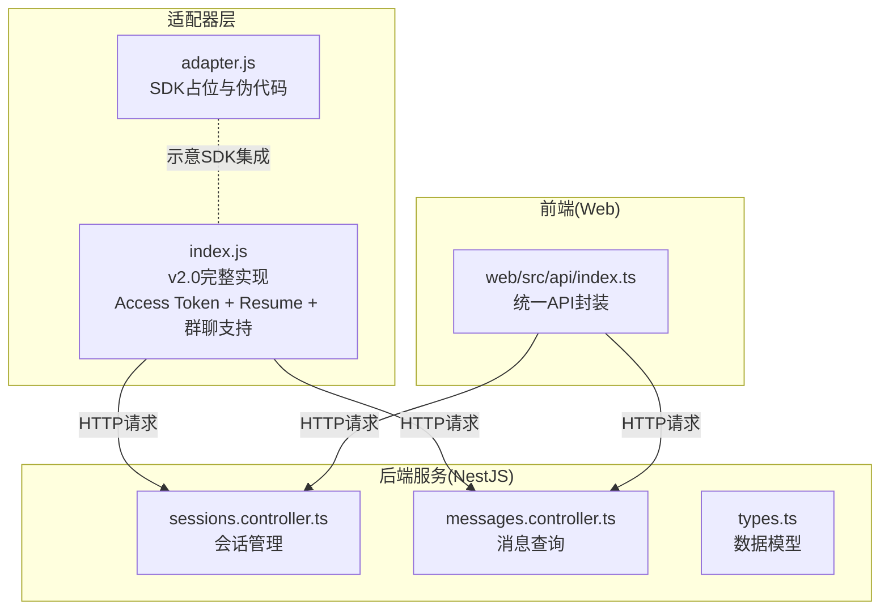
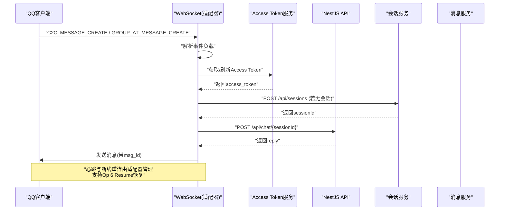
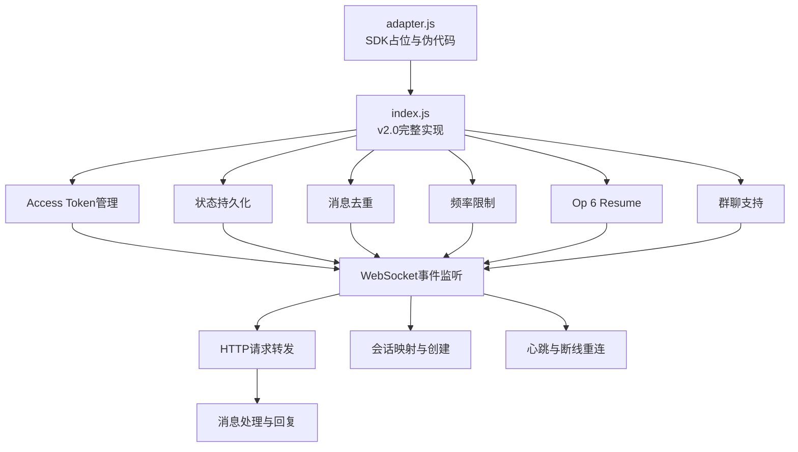
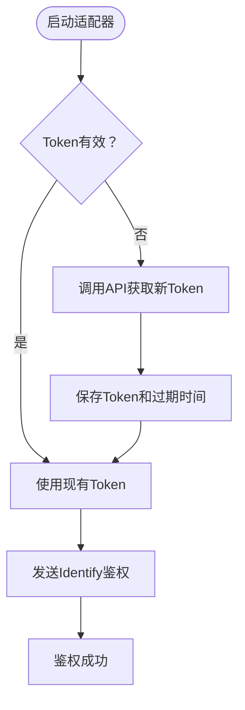
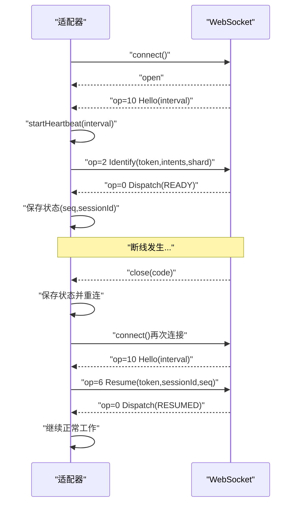
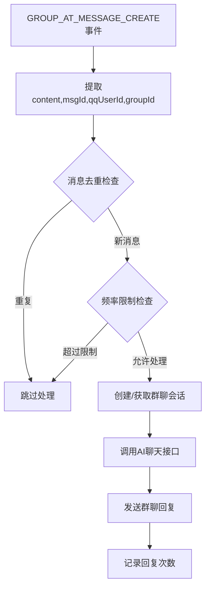
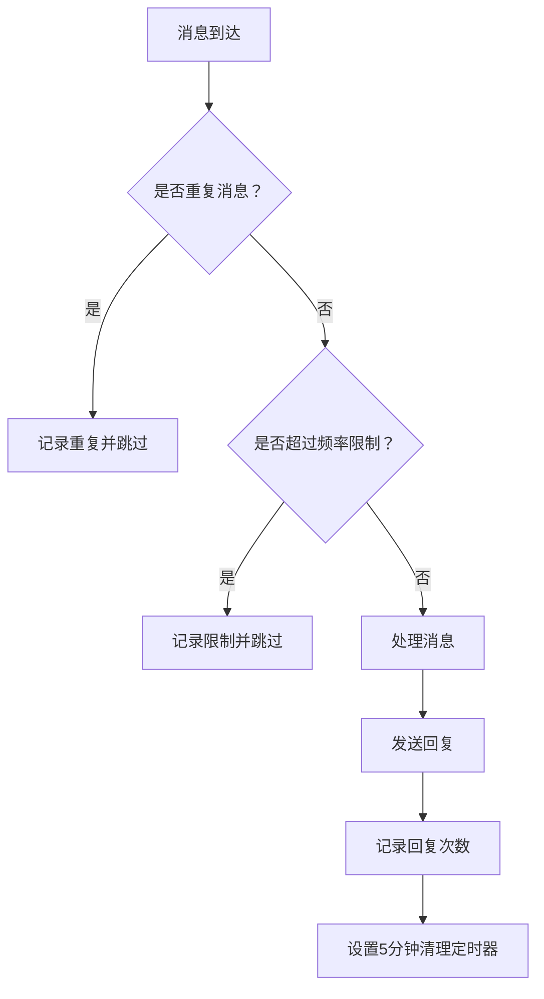
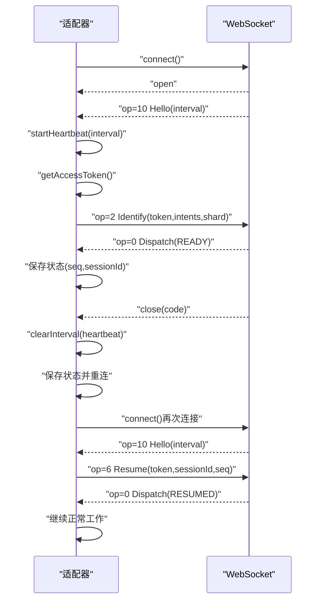
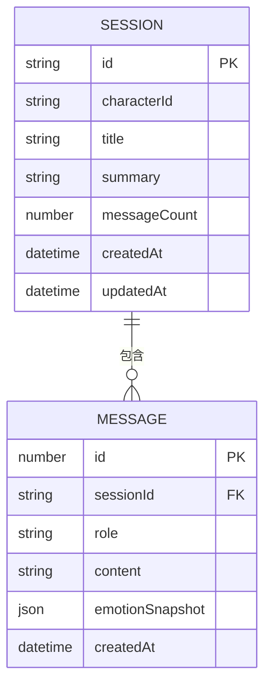
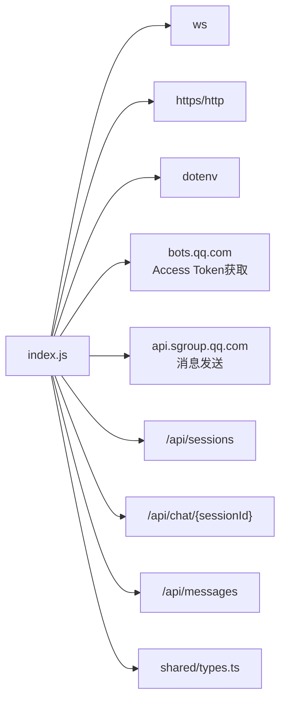

# QQ机器人适配器

<cite>
**本文引用的文件**
- [adapter.js](file://adapters/qq-bot/adapter.js)
- [index.js](file://adapters/qq-bot/index.js)
- [sessions.controller.ts](file://src/sessions/sessions.controller.ts)
- [messages.controller.ts](file://src/messages/messages.controller.ts)
- [types.ts](file://shared/types.ts)
- [index.ts（Web API 封装）](file://web/src/api/index.ts)
- [package.json](file://package.json)
</cite>

## 更新摘要
**变更内容**
- 重大升级：QQ机器人适配器从v1.0升级为v2.0，实现生产级适配器功能
- 新增Access Token鉴权机制，替代旧版Token方式
- 实现Op 6 Resume断线恢复功能，确保消息不丢失
- 新增群聊消息支持，处理GROUP_AT_MESSAGE_CREATE事件
- 实现消息去重机制，防止重复处理相同消息
- 添加频率限制控制，限制被动回复次数
- 增加状态持久化功能，支持断线后恢复
- 新增沙箱模式支持，便于测试环境使用

## 目录
1. [简介](#简介)
2. [项目结构](#项目结构)
3. [核心组件](#核心组件)
4. [架构总览](#架构总览)
5. [详细组件分析](#详细组件分析)
6. [依赖分析](#依赖分析)
7. [性能考虑](#性能考虑)
8. [故障排查指南](#故障排查指南)
9. [结论](#结论)
10. [附录](#附录)

## 简介
本文件面向"QQ机器人适配器"的技术实现，聚焦于v2.0版本的重大升级特性，包括生产级适配器架构、Access Token鉴权机制、Op 6 Resume断线恢复、群聊支持、消息去重、频率限制、状态持久化等核心功能。文档详细阐述adapter.js与index.js的职责分工与协作关系，并提供针对QQ机器人特有消息类型的处理方案。

**更新** 本次更新重点反映QQ机器人适配器v2.0的重大升级，从简单的WebSocket客户端升级为生产级适配器。

## 项目结构
QQ机器人适配器位于adapters/qq-bot目录，核心文件为：
- index.js：完整实现，包含v2.0所有新功能，负责配置加载、Access Token管理、WebSocket连接、鉴权、心跳、事件分发、HTTP请求转发、会话映射、消息去重、频率限制、状态持久化等
- adapter.js：占位示例，展示预期的SDK集成方式与伪代码流程

此外，与后端服务交互的关键接口定义在NestJS控制器与共享类型中，前端Web层也封装了统一的API访问方法。



**图表来源**
- [index.js:1-597](file://adapters/qq-bot/index.js#L1-L597)
- [adapter.js:1-35](file://adapters/qq-bot/adapter.js#L1-L35)
- [sessions.controller.ts:1-28](file://src/sessions/sessions.controller.ts#L1-L28)
- [messages.controller.ts:1-27](file://src/messages/messages.controller.ts#L1-L27)
- [types.ts:60-86](file://shared/types.ts#L60-L86)
- [index.ts（Web API 封装）:87-112](file://web/src/api/index.ts#L87-L112)

**章节来源**
- [index.js:1-597](file://adapters/qq-bot/index.js#L1-L597)
- [adapter.js:1-35](file://adapters/qq-bot/adapter.js#L1-L35)

## 核心组件
- **配置模块**：从环境变量读取appId、appSecret、apiBase、characterId、sandbox等关键参数
- **Access Token管理**：实现72小时有效期的Access Token获取与自动刷新机制
- **状态持久化**：保存seq和sessionId到本地文件，支持断线恢复
- **WebSocket客户端**：连接QQ Bot网关，处理Hello/Dispatch/Heartbeat/Resume等协议帧
- **会话映射**：维护qqUserId → sessionId的内存映射，支持私聊和群聊
- **消息去重**：使用Set存储已处理的消息ID，防止重复处理
- **频率限制**：限制每个消息最多被动回复2次，5分钟后自动清理
- **HTTP请求模块**：封装对NestJS API的调用，包括会话创建与对话问答
- **消息处理**：解析事件负载，过滤自身消息，调用AI服务并回发到QQ
- **心跳与重连**：根据Hello帧中的心跳间隔启动定时心跳，断线后延迟重连

**更新** v2.0版本新增了Access Token管理、状态持久化、消息去重、频率限制等生产级功能。

**章节来源**
- [index.js:38-45](file://adapters/qq-bot/index.js#L38-L45)
- [index.js:65-82](file://adapters/qq-bot/index.js#L65-L82)
- [index.js:55-56](file://adapters/qq-bot/index.js#L55-L56)
- [index.js:285-316](file://adapters/qq-bot/index.js#L285-L316)
- [index.js:99-112](file://adapters/qq-bot/index.js#L99-L112)
- [index.js:118-129](file://adapters/qq-bot/index.js#L118-L129)
- [index.js:135-204](file://adapters/qq-bot/index.js#L135-L204)
- [index.js:471-535](file://adapters/qq-bot/index.js#L471-L535)
- [index.js:460-465](file://adapters/qq-bot/index.js#L460-L465)

## 架构总览
QQ机器人适配器采用"WebSocket + HTTP"双通道架构，v2.0版本增强了生产级功能：
- **WebSocket**：接收来自QQ的实时事件（如私聊消息、群内@消息），支持Op 6 Resume断线恢复
- **HTTP**：与NestJS后端交互，完成会话管理与对话问答
- **Access Token**：使用新的Access Token鉴权机制替代旧版Token
- **消息去重**：防止重复处理相同消息
- **频率限制**：限制被动回复次数，避免滥用
- **状态持久化**：保存连接状态，支持断线恢复



**图表来源**
- [index.js:401-410](file://adapters/qq-bot/index.js#L401-L410)
- [index.js:471-501](file://adapters/qq-bot/index.js#L471-L501)
- [index.js:503-535](file://adapters/qq-bot/index.js#L503-L535)
- [index.js:65-82](file://adapters/qq-bot/index.js#L65-L82)
- [sessions.controller.ts:8-11](file://src/sessions/sessions.controller.ts#L8-L11)
- [messages.controller.ts:14-25](file://src/messages/messages.controller.ts#L14-L25)

## 详细组件分析

### adapter.js 与 index.js 的职责分工与协作
- **adapter.js**：作为"占位与示意"，展示如何通过官方SDK订阅事件、调用后端API、向用户发送消息。其核心价值在于明确SDK集成路径与期望的事件回调形态。
- **index.js**：实际实现v2.0完整功能，包含Access Token管理、状态持久化、消息去重、频率限制、Op 6 Resume断线恢复、群聊支持等生产级特性。两者协同目标一致：将QQ用户消息转换为后端可理解的会话与内容，并将后端回复转回QQ。

**更新** v2.0版本index.js实现了完整的生产级适配器功能。



**图表来源**
- [adapter.js:1-35](file://adapters/qq-bot/adapter.js#L1-L35)
- [index.js:65-82](file://adapters/qq-bot/index.js#L65-L82)
- [index.js:290-316](file://adapters/qq-bot/index.js#L290-L316)
- [index.js:99-112](file://adapters/qq-bot/index.js#L99-L112)
- [index.js:118-129](file://adapters/qq-bot/index.js#L118-L129)
- [index.js:360-372](file://adapters/qq-bot/index.js#L360-L372)
- [index.js:503-535](file://adapters/qq-bot/index.js#L503-L535)
- [index.js:471-501](file://adapters/qq-bot/index.js#L471-L501)

**章节来源**
- [adapter.js:1-35](file://adapters/qq-bot/adapter.js#L1-L35)
- [index.js:1-597](file://adapters/qq-bot/index.js#L1-L597)

### Access Token鉴权机制
v2.0版本实现了全新的Access Token鉴权机制，替代了旧版Token方式：

- **Token获取**：通过bots.qq.com/app/getAppAccessToken接口获取access_token，有效期72小时
- **自动刷新**：在token过期前1小时自动刷新，确保连接稳定性
- **鉴权头生成**：使用`QQBot ${appId}.${accessToken}`格式生成Authorization头
- **安全性**：支持沙箱模式和正式模式，便于测试和生产环境切换



**图表来源**
- [index.js:65-82](file://adapters/qq-bot/index.js#L65-L82)
- [index.js:84-87](file://adapters/qq-bot/index.js#L84-L87)
- [index.js:358-386](file://adapters/qq-bot/index.js#L358-L386)

**章节来源**
- [index.js:65-82](file://adapters/qq-bot/index.js#L65-L82)
- [index.js:84-87](file://adapters/qq-bot/index.js#L84-L87)
- [index.js:358-386](file://adapters/qq-bot/index.js#L358-L386)

### Op 6 Resume断线恢复
v2.0版本实现了Op 6 Resume断线恢复功能，确保消息不丢失：

- **状态保存**：连接建立时保存seq和sessionId到本地文件
- **断线检测**：连接断开时保存当前状态
- **自动恢复**：重新连接时尝试发送Resume请求恢复连接
- **超时保护**：超过30分钟的断线不会尝试恢复
- **平台限制**：遵循QQ平台的Resume限制



**图表来源**
- [index.js:290-316](file://adapters/qq-bot/index.js#L290-L316)
- [index.js:360-372](file://adapters/qq-bot/index.js#L360-L372)
- [index.js:397-401](file://adapters/qq-bot/index.js#L397-L401)

**章节来源**
- [index.js:290-316](file://adapters/qq-bot/index.js#L290-L316)
- [index.js:360-372](file://adapters/qq-bot/index.js#L360-L372)
- [index.js:397-401](file://adapters/qq-bot/index.js#L397-L401)

### 群聊消息支持
v2.0版本新增了完整的群聊消息支持：

- **事件类型**：处理GROUP_AT_MESSAGE_CREATE事件，支持@机器人消息
- **会话隔离**：使用`group-${groupId}`作为群聊会话标识
- **消息路由**：区分私聊和群聊的不同处理流程
- **权限控制**：支持群内@机器人的消息处理



**图表来源**
- [index.js:503-535](file://adapters/qq-bot/index.js#L503-L535)
- [index.js:524-527](file://adapters/qq-bot/index.js#L524-L527)

**章节来源**
- [index.js:503-535](file://adapters/qq-bot/index.js#L503-L535)
- [index.js:524-527](file://adapters/qq-bot/index.js#L524-L527)

### 消息去重与频率限制
v2.0版本实现了消息去重和频率限制双重保护：

- **消息去重**：使用Set存储已处理的消息ID，防止重复处理
- **容量控制**：最大存储1000个消息ID，超出时自动清理最旧记录
- **频率限制**：每个消息最多被动回复2次，5分钟后自动清理计数
- **幂等处理**：确保相同消息不会产生重复回复



**图表来源**
- [index.js:102-112](file://adapters/qq-bot/index.js#L102-L112)
- [index.js:120-129](file://adapters/qq-bot/index.js#L120-L129)

**章节来源**
- [index.js:102-112](file://adapters/qq-bot/index.js#L102-L112)
- [index.js:120-129](file://adapters/qq-bot/index.js#L120-L129)

### 消息处理机制（事件监听、解析与响应）
- **事件监听**：WebSocket on('message')接收原始帧，解析为payload，更新序列号seq
- **事件类型分发**：op=10 Hello（启动心跳）、op=0 Dispatch（收到事件）、op=11 Heartbeat ACK、op=7 Reconnect、op=9 Invalid Session
- **事件过滤**：仅处理C2C_MESSAGE_CREATE（私聊消息）与GROUP_AT_MESSAGE_CREATE（群内@消息），并忽略自身bot_id
- **内容解析**：从d.content、d.author.id、d.id等字段提取必要信息
- **响应生成**：获取或创建sessionId，调用chat接口获取reply，再通过HTTP API回复到QQ

**更新** v2.0版本的消息处理逻辑更加健壮，增加了Access Token管理、状态持久化、消息去重等功能。

```mermaid
flowchart TD
Start(["收到WebSocket消息"]) --> Parse["解析payload(op,d,s,t)"]
Parse --> OpCheck{"op类型？"}
OpCheck --> |Hello(10)| Hello["启动心跳(interval)<br/>获取Access Token"]
OpCheck --> |Dispatch(0)| Dispatch["检查事件类型"]
OpCheck --> |Reconnect(7)| Reconnect["立即重连"]
OpCheck --> |Invalid Session(9)| InvalidSession["清除状态并重连"]
OpCheck --> |Heartbeat ACK(11)| ACK["忽略或记录"]
Dispatch --> Type{"C2C/GROUP事件？"}
Type --> |否| End
Type --> |是| Dedup["消息去重检查"]
Dedup --> Duplicate{"重复消息？"}
Duplicate --> |是| End
Duplicate --> |否| RateLimit["频率限制检查"]
RateLimit --> LimitReached{"超过限制？"}
LimitReached --> |是| End
LimitReached --> |否| Filter["过滤自身消息"]
Filter --> Valid{"content/author有效？"}
Valid --> |否| End
Valid --> Msg["获取/创建sessionId"]
Msg --> Chat["调用chat接口获取reply"]
Chat --> Reply["发送回复到QQ"]
Reply --> Record["记录回复次数"]
Record --> SaveState["保存状态"]
SaveState --> End(["结束"])
```

**图表来源**
- [index.js:346-446](file://adapters/qq-bot/index.js#L346-L446)
- [index.js:401-410](file://adapters/qq-bot/index.js#L401-L410)
- [index.js:471-501](file://adapters/qq-bot/index.js#L471-L501)
- [index.js:503-535](file://adapters/qq-bot/index.js#L503-L535)

**章节来源**
- [index.js:346-446](file://adapters/qq-bot/index.js#L346-L446)
- [index.js:471-501](file://adapters/qq-bot/index.js#L471-L501)
- [index.js:503-535](file://adapters/qq-bot/index.js#L503-L535)

### 连接管理、心跳保持与断线重连
- **连接建立**：创建wss://api.sgroup.qq.com/websocket，on('open')输出日志
- **Access Token鉴权**：收到Hello后，根据heartbeat_interval启动心跳，并发送Identify（含intents与shard）
- **心跳机制**：周期性发送op=1的心跳包，确保连接存活
- **断线重连**：on('close')清理心跳，保存状态，等待5秒后重新connect()
- **Resume恢复**：支持Op 6 Resume断线恢复，保存seq和sessionId到本地文件

**更新** v2.0版本的连接管理更加完善，增加了Access Token管理和状态持久化。



**图表来源**
- [index.js:318-458](file://adapters/qq-bot/index.js#L318-L458)
- [index.js:65-82](file://adapters/qq-bot/index.js#L65-L82)
- [index.js:290-316](file://adapters/qq-bot/index.js#L290-L316)
- [index.js:360-372](file://adapters/qq-bot/index.js#L360-L372)

**章节来源**
- [index.js:318-458](file://adapters/qq-bot/index.js#L318-L458)
- [index.js:65-82](file://adapters/qq-bot/index.js#L65-L82)
- [index.js:290-316](file://adapters/qq-bot/index.js#L290-L316)

### 配置参数、权限设置与安全策略
- **配置项**
  - appId：应用标识
  - appSecret：用于换取access_token的密钥
  - apiBase：NestJS API基础地址
  - characterId：AI角色标识
  - sandbox：沙箱模式开关（true/false）
- **权限与鉴权**
  - intents：启用C2C_MESSAGE_CREATE和GROUP_AT_MESSAGE_CREATE事件
  - shard：分片参数，便于分布式部署
  - Authorization：HTTP回复时使用QQBot {appId}.{accessToken}
- **安全建议**
  - token存储在.env中，避免硬编码
  - 仅在公网可访问的服务器上部署，确保QQ回调可达
  - 对外暴露的API仅用于适配器内部，避免直接对外公开
  - 支持沙箱模式，便于测试环境使用

**更新** v2.0版本的配置更加完善，新增了沙箱模式支持。

**章节来源**
- [index.js:38-45](file://adapters/qq-bot/index.js#L38-L45)
- [index.js:380-382](file://adapters/qq-bot/index.js#L380-L382)
- [index.js:84-87](file://adapters/qq-bot/index.js#L84-L87)

### 错误处理、异常恢复与日志记录
- **WebSocket层**
  - on('error')记录错误
  - on('close')清理心跳并延迟重连
  - 消息解析失败时捕获异常并记录
  - Resume失败时自动降级为全新连接
- **业务层**
  - getAccessToken/getOrCreateSession/chat/sendReply包裹try/catch，失败时记录错误
  - 启动前校验appId/appSecret，缺失则退出进程
  - Access Token获取失败时优雅降级
- **日志**
  - 连接、鉴权、消息、回复、心跳、重连、Resume、去重、频率限制均有日志输出，便于排障

**更新** v2.0版本的错误处理机制更加完善，增加了Access Token管理、状态持久化等新功能的日志记录。

**章节来源**
- [index.js:337-344](file://adapters/qq-bot/index.js#L337-L344)
- [index.js:448-458](file://adapters/qq-bot/index.js#L448-L458)
- [index.js:471-501](file://adapters/qq-bot/index.js#L471-L501)
- [index.js:503-535](file://adapters/qq-bot/index.js#L503-L535)

### 性能优化、并发处理与资源管理
- **并发模型**
  - 每条消息处理为异步流程，避免阻塞WebSocket主循环
  - 会话映射使用Map，查找复杂度O(1)，减少重复创建
  - Access Token自动刷新，避免频繁获取
- **资源管理**
  - 心跳定时器在连接关闭时清理，防止泄漏
  - HTTP请求使用原生https模块，按需创建，及时释放
  - 状态文件定期保存，避免数据丢失
- **可扩展优化**
  - 引入队列/限流，避免后端瞬时高并发
  - 对频繁用户采用本地缓存会话ID，降低HTTP调用次数
  - 对长文本回复进行分片发送（如需）
  - 支持沙箱模式，便于性能测试

**更新** v2.0版本的性能优化策略更加明确，新增了Access Token缓存、状态持久化等机制。

**章节来源**
- [index.js:93](file://adapters/qq-bot/index.js#L93)
- [index.js:65-82](file://adapters/qq-bot/index.js#L65-L82)
- [index.js:290-316](file://adapters/qq-bot/index.js#L290-L316)

### 与后端服务的数据同步与一致性
- **会话同步**
  - 首次消息到达时创建会话，返回sessionId并写入内存映射
  - 私聊使用qqUserId作为键，群聊使用`group-${groupId}`作为键
  - 前端Web通过统一API封装调用/api/sessions
- **历史消息同步**
  - 前端通过/api/messages?sessionId=...&limit=...获取最近消息
  - 后端按时间升序返回，适配器侧无需关心排序细节
- **数据模型**
  - 会话与消息的数据结构在shared/types.ts中定义，前后端一致



**图表来源**
- [types.ts:60-86](file://shared/types.ts#L60-L86)
- [types.ts:79-86](file://shared/types.ts#L79-L86)

**章节来源**
- [sessions.controller.ts:8-11](file://src/sessions/sessions.controller.ts#L8-L11)
- [messages.controller.ts:14-25](file://src/messages/messages.controller.ts#L14-L25)
- [types.ts:60-86](file://shared/types.ts#L60-L86)

## 依赖分析
- **外部依赖**
  - ws：WebSocket客户端
  - https/http：HTTP请求
  - dotenv：环境变量加载
- **内部依赖**
  - 与NestJS的接口契约：/api/sessions、/api/chat/{sessionId}、/api/messages
  - 共享类型：SessionData、MessageData
  - QQ Bot API：bots.qq.com、api.sgroup.qq.com

**更新** v2.0版本新增了QQ Bot API依赖，用于Access Token获取和消息发送。



**图表来源**
- [index.js:30](file://adapters/qq-bot/index.js#L30)
- [index.js:372](file://adapters/qq-bot/index.js#L372)
- [index.js:236-279](file://adapters/qq-bot/index.js#L236-L279)
- [index.js:80-87](file://adapters/qq-bot/index.js#L84-L87)
- [index.js:214-227](file://adapters/qq-bot/index.js#L214-L227)
- [index.js:170-204](file://adapters/qq-bot/index.js#L170-L204)
- [types.ts:60-86](file://shared/types.ts#L60-L86)

**章节来源**
- [index.js:30](file://adapters/qq-bot/index.js#L30)
- [index.js:372](file://adapters/qq-bot/index.js#L372)
- [index.js:236-279](file://adapters/qq-bot/index.js#L236-L279)
- [index.js:84-87](file://adapters/qq-bot/index.js#L84-L87)
- [index.js:214-227](file://adapters/qq-bot/index.js#L214-L227)
- [index.js:170-204](file://adapters/qq-bot/index.js#L170-L204)
- [types.ts:60-86](file://shared/types.ts#L60-L86)

## 性能考虑
- **心跳频率与稳定性**：根据Hello帧的heartbeat_interval动态设置，避免过小导致带宽压力过大
- **事件处理解耦**：消息处理为单次异步流程，避免阻塞后续事件
- **会话缓存**：Map缓存用户到sessionId的映射，减少重复HTTP请求
- **资源回收**：连接关闭时清理定时器与回调，防止内存泄漏
- **Access Token缓存**：72小时有效期，提前1小时刷新，减少API调用
- **状态持久化**：定期保存连接状态，避免频繁重新鉴权
- **消息去重**：Set存储消息ID，避免重复处理
- **频率限制**：5分钟自动清理，防止内存泄漏
- **扩展建议**：引入背压/队列、批量处理、超时控制与熔断策略

**更新** v2.0版本的性能考虑更加全面，新增了多个优化机制。

## 故障排查指南
- **启动失败**
  - appId未设置：检查.env或直接配置
  - appSecret与token均未设置：优先使用appSecret自动获取
  - Access Token获取失败：检查网络连接和API可用性
- **连接问题**
  - 无法鉴权：确认intents与shard配置正确，token是否有效
  - 心跳异常：检查网络与防火墙，确认gateway可达
  - Resume失败：检查状态文件是否损坏，断线时间是否超过30分钟
- **消息处理问题**
  - 自身消息被过滤：确认bot_id过滤逻辑
  - 重复消息：检查消息去重机制
  - 频率限制：检查5分钟清理机制
  - 群聊消息：确认GROUP_AT_MESSAGE_CREATE事件处理
- **日志定位**
  - 关注连接、鉴权、消息、回复、心跳、重连、Resume、去重、频率限制等关键日志节点

**更新** v2.0版本的故障排查指南更加完善，新增了Access Token、Resume、群聊等相关问题的排查方法。

**章节来源**
- [index.js:574-596](file://adapters/qq-bot/index.js#L574-L596)
- [index.js:337-344](file://adapters/qq-bot/index.js#L337-L344)
- [index.js:448-458](file://adapters/qq-bot/index.js#L448-L458)
- [index.js:471-501](file://adapters/qq-bot/index.js#L471-L501)
- [index.js:503-535](file://adapters/qq-bot/index.js#L503-L535)

## 结论
该适配器v2.0版本实现了从简单WebSocket客户端到生产级适配器的重大升级，包含了Access Token鉴权、Op 6 Resume断线恢复、群聊支持、消息去重、频率限制、状态持久化等核心功能。adapter.js提供了SDK集成的参考路径，index.js则给出了完整的工程化实现。v2.0版本显著提升了适配器的稳定性、可靠性和功能性，为QQ机器人的生产环境部署提供了坚实基础。对于多媒体消息与更复杂的业务场景，可在现有框架上进行扩展，同时注意性能与稳定性保障。

**更新** v2.0版本代表了QQ机器人适配器的重大里程碑，从实验性功能升级为生产级解决方案。

## 附录
- **环境变量示例位置**：.env（用于存放QQ_BOT_APP_ID、QQ_BOT_APP_SECRET、QQ_BOT_TOKEN、API_BASE、QQ_CHARACTER_ID、QQ_BOT_SANDBOX等）
- **前端API封装**：web/src/api/index.ts中的createSession、getSession、getSessions、sendMessage等方法，便于理解与复用
- **启动脚本**：package.json中的qqbot脚本，可通过`npm run qqbot`启动适配器
- **沙箱模式**：设置QQ_BOT_SANDBOX=1启用沙箱网关，便于测试环境使用

**章节来源**
- [package.json:17](file://package.json#L17)
- [index.ts（Web API 封装）:87-112](file://web/src/api/index.ts#L87-L112)
- [index.js:47-53](file://adapters/qq-bot/index.js#L47-L53)