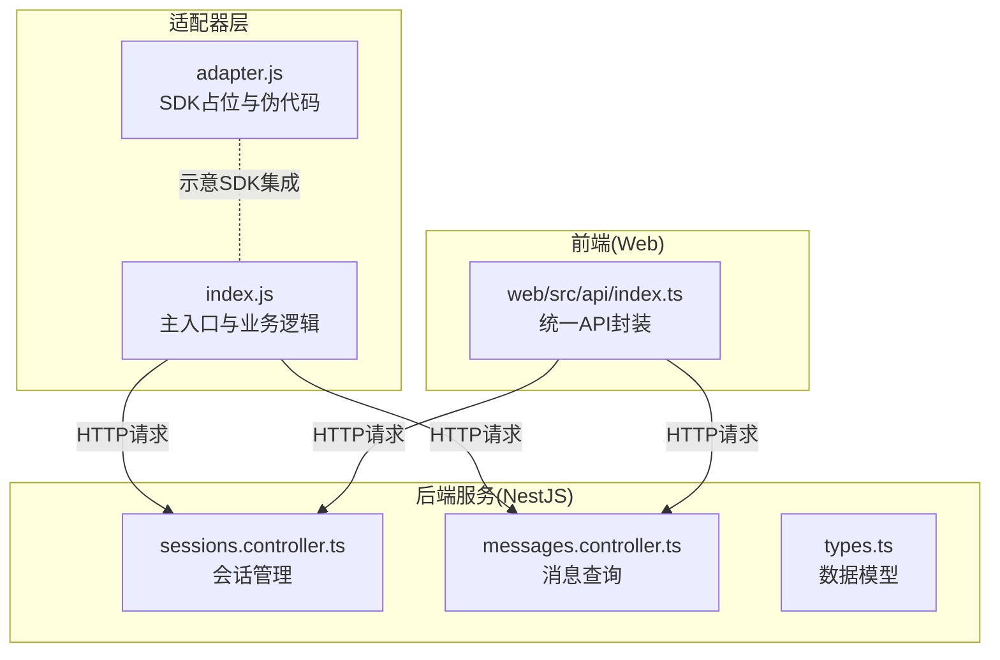
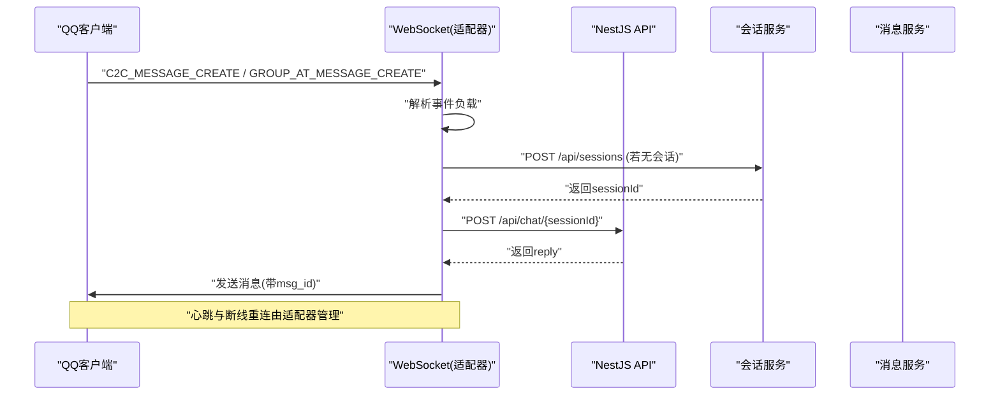
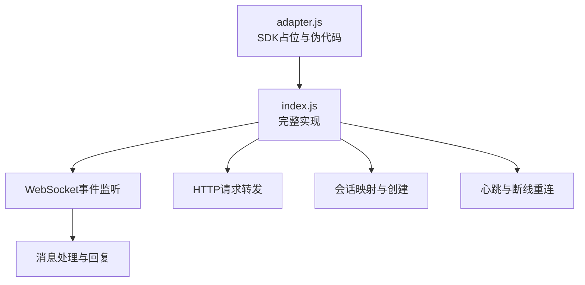
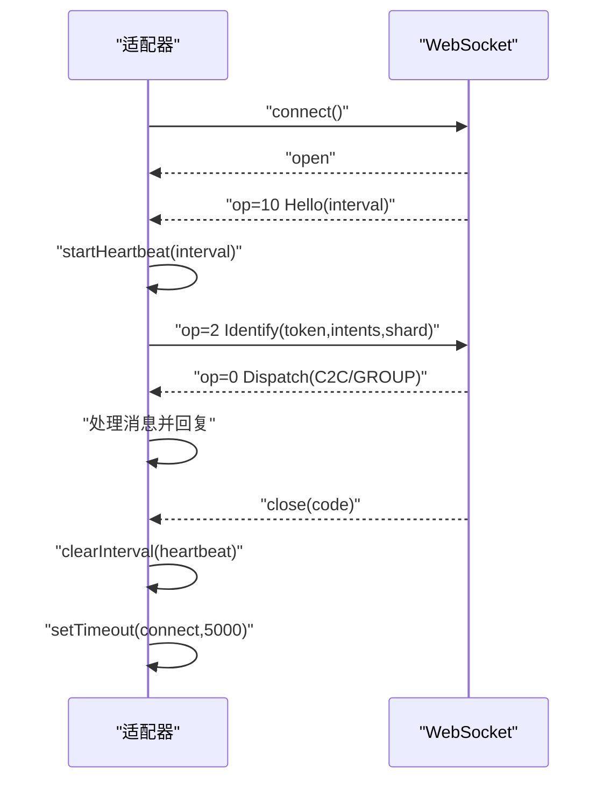
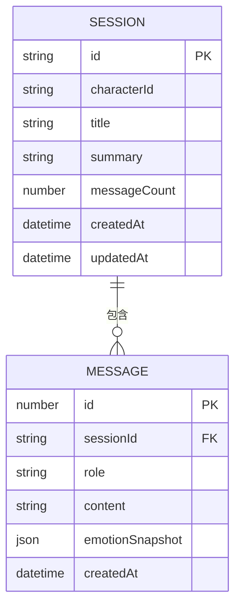
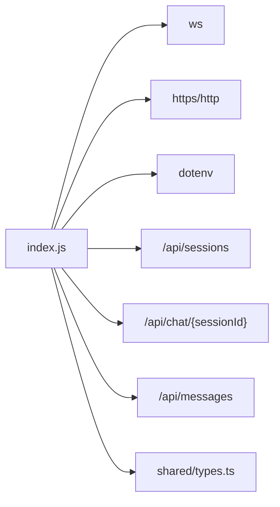

# QQ机器人适配器

<cite>
**本文引用的文件**
- [adapter.js](file://adapters/qq-bot/adapter.js)
- [index.js](file://adapters/qq-bot/index.js)
- [.env 示例](file://.env)
- [sessions.controller.ts](file://src/sessions/sessions.controller.ts)
- [messages.controller.ts](file://src/messages/messages.controller.ts)
- [types.ts](file://shared/types.ts)
- [index.ts（Web API 封装）](file://web/src/api/index.ts)
</cite>

## 目录
1. [简介](#简介)
2. [项目结构](#项目结构)
3. [核心组件](#核心组件)
4. [架构总览](#架构总览)
5. [详细组件分析](#详细组件分析)
6. [依赖分析](#依赖分析)
7. [性能考虑](#性能考虑)
8. [故障排查指南](#故障排查指南)
9. [结论](#结论)
10. [附录](#附录)

## 简介
本文件面向“QQ机器人适配器”的技术实现，聚焦于消息处理机制、WebSocket事件监听、消息解析与响应生成、连接管理与心跳、断线重连、配置与安全、错误处理与日志、性能优化与并发、以及与后端服务的数据同步与一致性保障。文档同时阐明 adapter.js 与 index.js 的职责分工与协作关系，并给出针对 QQ 机器人特有消息类型的处理建议。

## 项目结构
QQ 机器人适配器位于 adapters/qq-bot 目录，核心文件为：
- index.js：完整实现，负责配置加载、WebSocket连接、鉴权、心跳、事件分发、HTTP请求转发、会话映射、消息回复等
- adapter.js：占位示例，展示预期的 SDK 集成方式与伪代码流程

此外，与后端服务交互的关键接口定义在 NestJS 控制器与共享类型中，前端 Web 层也封装了统一的 API 访问方法。



图表来源
- [index.js:1-303](file://adapters/qq-bot/index.js#L1-L303)
- [adapter.js:1-35](file://adapters/qq-bot/adapter.js#L1-L35)
- [sessions.controller.ts:1-27](file://src/sessions/sessions.controller.ts#L1-L27)
- [messages.controller.ts:1-26](file://src/messages/messages.controller.ts#L1-L26)
- [types.ts:60-86](file://shared/types.ts#L60-L86)
- [index.ts（Web API 封装）:87-112](file://web/src/api/index.ts#L87-L112)

章节来源
- [index.js:1-303](file://adapters/qq-bot/index.js#L1-L303)
- [adapter.js:1-35](file://adapters/qq-bot/adapter.js#L1-L35)

## 核心组件
- 配置模块：从环境变量读取 appId、appSecret、token、gateway、apiBase、characterId 等关键参数
- WebSocket 客户端：连接 QQ Bot 网关，处理 Hello/Dispatch/Heartbeat 等协议帧
- 会话映射：维护 qqUserId → sessionId 的内存映射，必要时通过 HTTP 接口创建新会话
- HTTP 请求模块：封装对 NestJS API 的调用，包括会话创建与对话问答
- 消息处理：解析事件负载，过滤自身消息，调用 AI 服务并回发到 QQ
- 心跳与重连：根据 Hello 帧中的心跳间隔启动定时心跳，断线后延迟重连

章节来源
- [index.js:27-37](file://adapters/qq-bot/index.js#L27-L37)
- [index.js:74](file://adapters/qq-bot/index.js#L74)
- [index.js:80-104](file://adapters/qq-bot/index.js#L80-L104)
- [index.js:107-124](file://adapters/qq-bot/index.js#L107-L124)
- [index.js:133-197](file://adapters/qq-bot/index.js#L133-L197)
- [index.js:199-204](file://adapters/qq-bot/index.js#L199-L204)
- [index.js:207-226](file://adapters/qq-bot/index.js#L207-L226)
- [index.js:228-258](file://adapters/qq-bot/index.js#L228-L258)

## 架构总览
QQ 机器人适配器采用“WebSocket + HTTP”双通道架构：
- WebSocket：接收来自 QQ 的实时事件（如私聊消息、群内@消息）
- HTTP：与 NestJS 后端交互，完成会话管理与对话问答
- 适配器负责事件解析、会话映射、AI 调用与回复发送



图表来源
- [index.js:141-186](file://adapters/qq-bot/index.js#L141-L186)
- [index.js:107-124](file://adapters/qq-bot/index.js#L107-L124)
- [index.js:228-258](file://adapters/qq-bot/index.js#L228-L258)
- [sessions.controller.ts:8-11](file://src/sessions/sessions.controller.ts#L8-L11)
- [messages.controller.ts:14-25](file://src/messages/messages.controller.ts#L14-L25)

## 详细组件分析

### adapter.js 与 index.js 的职责分工与协作
- adapter.js：作为“占位与示意”，展示如何通过官方 SDK 订阅事件、调用后端 API、向用户发送消息。其核心价值在于明确 SDK 集成路径与期望的事件回调形态。
- index.js：实际实现，包含完整的配置、鉴权、WebSocket 生命周期、事件分发、HTTP 请求、会话映射、心跳与重连等逻辑。两者协同目标一致：将 QQ 用户消息转换为后端可理解的会话与内容，并将后端回复转回 QQ。



图表来源
- [adapter.js:1-35](file://adapters/qq-bot/adapter.js#L1-L35)
- [index.js:133-197](file://adapters/qq-bot/index.js#L133-L197)
- [index.js:107-124](file://adapters/qq-bot/index.js#L107-L124)
- [index.js:199-204](file://adapters/qq-bot/index.js#L199-L204)

章节来源
- [adapter.js:1-35](file://adapters/qq-bot/adapter.js#L1-L35)
- [index.js:1-303](file://adapters/qq-bot/index.js#L1-L303)

### 消息处理机制（事件监听、解析与响应）
- 事件监听：WebSocket on('message') 接收原始帧，解析为 payload，更新序列号 seq
- 事件类型分发：op=10 Hello（启动心跳）、op=0 Dispatch（收到事件）、op=11 Heartbeat ACK
- 事件过滤：仅处理 C2C_MESSAGE_CREATE（私聊消息）与 GROUP_AT_MESSAGE_CREATE（群内@消息），并忽略自身 bot_id
- 内容解析：从 d.content、d.author.id、d.id 等字段提取必要信息
- 响应生成：获取或创建 sessionId，调用 chat 接口获取 reply，再通过 HTTP API 回复到 QQ

```mermaid
flowchart TD
Start(["收到WebSocket消息"]) --> Parse["解析payload(op,d,s,t)"]
Parse --> OpCheck{"op类型？"}
OpCheck --> |Hello(10)| Hello["启动心跳(interval)"]
OpCheck --> |Dispatch(0)| Dispatch["检查事件类型"]
OpCheck --> |Heartbeat ACK(11)| ACK["忽略或记录"]
Dispatch --> Type{"C2C/GROUP事件？"}
Type --> |否| End
Type --> |是| Filter["过滤自身消息"]
Filter --> Valid{"content/author有效？"}
Valid --> |否| End
Valid --> Msg["获取/创建sessionId"]
Msg --> Chat["调用chat接口获取reply"]
Chat --> Reply["发送回复到QQ"]
Reply --> End(["结束"])
```

图表来源
- [index.js:141-186](file://adapters/qq-bot/index.js#L141-L186)
- [index.js:207-226](file://adapters/qq-bot/index.js#L207-L226)
- [index.js:228-258](file://adapters/qq-bot/index.js#L228-L258)

章节来源
- [index.js:141-186](file://adapters/qq-bot/index.js#L141-L186)
- [index.js:207-226](file://adapters/qq-bot/index.js#L207-L226)

### QQ机器人特有消息类型处理
- 文本消息：从 d.content 提取纯文本，经 chat 接口返回 reply 后直接发送
- 图片/语音/多媒体：当前实现未对富媒体字段进行专门解析与处理。建议扩展：
  - 在事件解析处识别 d.attachments 等字段
  - 对图片/语音等资源进行下载或转存，并在 chat 接口中以多模态形式传递
  - 回复时根据后端支持选择文本摘要或直传链接
- 会话隔离：基于 d.author.id 建立独立会话，避免跨用户消息串扰

章节来源
- [index.js:207-226](file://adapters/qq-bot/index.js#L207-L226)

### 连接管理、心跳保持与断线重连
- 连接建立：创建 wss://api.sgroup.qq.com/websocket，on('open') 输出日志
- 鉴权：收到 Hello 后，根据 heartbeat_interval 启动心跳，并发送 Identify（含 intents 与 shard）
- 心跳：周期性发送 op=1 的心跳包，确保连接存活
- 断线重连：on('close') 清理心跳，等待 5 秒后重新 connect()



图表来源
- [index.js:133-197](file://adapters/qq-bot/index.js#L133-L197)
- [index.js:199-204](file://adapters/qq-bot/index.js#L199-L204)

章节来源
- [index.js:133-197](file://adapters/qq-bot/index.js#L133-L197)
- [index.js:199-204](file://adapters/qq-bot/index.js#L199-L204)

### 配置参数、权限设置与安全策略
- 配置项
  - appId：应用标识
  - appSecret：用于换取 access_token 的密钥
  - token：鉴权令牌（可手动填写或通过 appSecret 自动获取）
  - gateway：WebSocket 网关地址
  - apiBase：NestJS API 基础地址
  - characterId：AI 角色标识
- 权限与鉴权
  - intents：启用 C2C_MESSAGE_CREATE 事件
  - shard：分片参数，便于分布式部署
  - Authorization：HTTP 回复时使用 QQBot {appId}.{token}
- 安全建议
  - token 存储在 .env 中，避免硬编码
  - 仅在公网可访问的服务器上部署，确保 QQ 回调可达
  - 对外暴露的 API 仅用于适配器内部，避免直接对外公开

章节来源
- [index.js:27-37](file://adapters/qq-bot/index.js#L27-L37)
- [index.js:154-163](file://adapters/qq-bot/index.js#L154-L163)
- [index.js:238-257](file://adapters/qq-bot/index.js#L238-L257)

### 错误处理、异常恢复与日志记录
- WebSocket 层
  - on('error') 记录错误
  - on('close') 清理心跳并延迟重连
  - 消息解析失败时捕获异常并记录
- 业务层
  - getOrCreateSession/chat/sendReply 包裹 try/catch，失败时记录错误
  - 启动前校验 appId/token，缺失则退出进程
- 日志
  - 连接、鉴权、消息、回复、心跳、重连均有日志输出，便于排障

章节来源
- [index.js:137-196](file://adapters/qq-bot/index.js#L137-L196)
- [index.js:183-185](file://adapters/qq-bot/index.js#L183-L185)
- [index.js:216-225](file://adapters/qq-bot/index.js#L216-L225)
- [index.js:268-290](file://adapters/qq-bot/index.js#L268-L290)

### 性能优化、并发处理与资源管理
- 并发模型
  - 每条消息处理为异步流程，避免阻塞 WebSocket 主循环
  - 会话映射使用 Map，查找复杂度 O(1)，减少重复创建
- 资源管理
  - 心跳定时器在连接关闭时清理，防止泄漏
  - HTTP 请求使用原生 http/https 模块，按需创建，及时释放
- 可扩展优化
  - 引入队列/限流，避免后端瞬时高并发
  - 对频繁用户采用本地缓存会话 ID，降低 HTTP 调用次数
  - 对长文本回复进行分片发送（如需）

章节来源
- [index.js:74](file://adapters/qq-bot/index.js#L74)
- [index.js:199-204](file://adapters/qq-bot/index.js#L199-L204)
- [index.js:80-104](file://adapters/qq-bot/index.js#L80-L104)

### 与后端服务的数据同步与一致性
- 会话同步
  - 首次消息到达时创建会话，返回 sessionId 并写入内存映射
  - 前端 Web 通过统一 API 封装调用 /api/sessions
- 历史消息同步
  - 前端通过 /api/messages?sessionId=...&limit=... 获取最近消息
  - 后端按时间升序返回，适配器侧无需关心排序细节
- 数据模型
  - 会话与消息的数据结构在 shared/types.ts 中定义，前后端一致



图表来源
- [types.ts:60-86](file://shared/types.ts#L60-L86)
- [types.ts:79-86](file://shared/types.ts#L79-L86)

章节来源
- [sessions.controller.ts:8-11](file://src/sessions/sessions.controller.ts#L8-L11)
- [messages.controller.ts:14-25](file://src/messages/messages.controller.ts#L14-L25)
- [types.ts:60-86](file://shared/types.ts#L60-L86)

## 依赖分析
- 外部依赖
  - ws：WebSocket 客户端
  - https/http：HTTP 请求
  - dotenv：环境变量加载
- 内部依赖
  - 与 NestJS 的接口契约：/api/sessions、/api/chat/{sessionId}、/api/messages
  - 共享类型：SessionData、MessageData



图表来源
- [index.js:21](file://adapters/qq-bot/index.js#L21)
- [index.js:27-37](file://adapters/qq-bot/index.js#L27-L37)
- [index.js:80-104](file://adapters/qq-bot/index.js#L80-L104)
- [index.js:121-124](file://adapters/qq-bot/index.js#L121-L124)
- [index.js:107-118](file://adapters/qq-bot/index.js#L107-L118)
- [types.ts:60-86](file://shared/types.ts#L60-L86)

章节来源
- [index.js:21](file://adapters/qq-bot/index.js#L21)
- [index.js:27-37](file://adapters/qq-bot/index.js#L27-L37)
- [index.js:80-104](file://adapters/qq-bot/index.js#L80-L104)
- [index.js:107-118](file://adapters/qq-bot/index.js#L107-L118)
- [index.js:121-124](file://adapters/qq-bot/index.js#L121-L124)
- [types.ts:60-86](file://shared/types.ts#L60-L86)

## 性能考虑
- 心跳频率与稳定性：根据 Hello 帧的 heartbeat_interval 动态设置，避免过小导致带宽压力过大
- 事件处理解耦：消息处理为单次异步流程，避免阻塞后续事件
- 会话缓存：Map 缓存用户到 sessionId 的映射，减少重复 HTTP 请求
- 资源回收：连接关闭时清理定时器与回调，防止内存泄漏
- 扩展建议：引入背压/队列、批量处理、超时控制与熔断策略

## 故障排查指南
- 启动失败
  - appId 未设置：检查 .env 或直接配置
  - token 与 appSecret 均未设置：优先使用 appSecret 自动获取，否则手动填写 token
- 连接问题
  - 无法鉴权：确认 intents 与 shard 配置正确，token 是否有效
  - 心跳异常：检查网络与防火墙，确认 gateway 可达
- 消息不回复
  - 自身消息被过滤：确认 bot_id 过滤逻辑
  - 会话创建失败：检查 /api/sessions 接口可用性
  - AI 调用失败：检查 /api/chat/{sessionId} 返回值与后端日志
- 日志定位
  - 关注连接、鉴权、消息、回复、心跳、重连等关键日志节点

章节来源
- [index.js:268-290](file://adapters/qq-bot/index.js#L268-L290)
- [index.js:137-196](file://adapters/qq-bot/index.js#L137-L196)
- [index.js:216-225](file://adapters/qq-bot/index.js#L216-L225)

## 结论
该适配器以最小实现覆盖了 QQ 机器人接入的核心链路：WebSocket 事件监听、鉴权与心跳、会话映射、HTTP 调用与回复发送。adapter.js 提供了 SDK 集成的参考路径，index.js 则给出了完整的工程化实现。对于多媒体消息与更复杂的业务场景，可在现有框架上进行扩展，同时注意性能与稳定性保障。

## 附录
- 环境变量示例位置：.env（用于存放 QQ_BOT_APP_ID、QQ_BOT_APP_SECRET、QQ_BOT_TOKEN、API_BASE、QQ_CHARACTER_ID 等）
- 前端 API 封装：web/src/api/index.ts 中的 createSession、getSession、getSessions、sendMessage 等方法，便于理解与复用

章节来源
- [.env 示例](file://.env)
- [index.ts（Web API 封装）:87-112](file://web/src/api/index.ts#L87-L112)