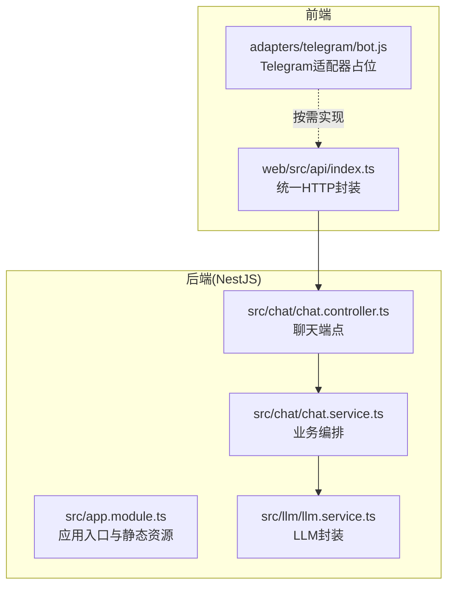
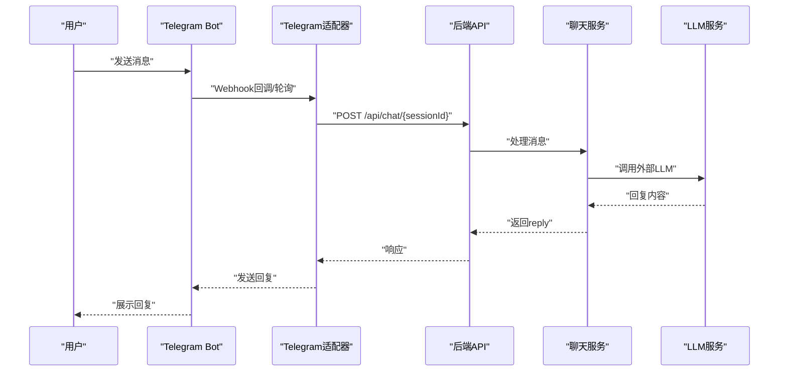
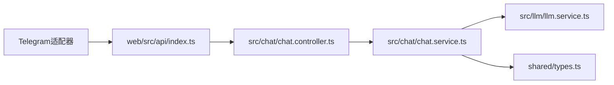

# Telegram适配器

<cite>
**本文档引用的文件**
- [adapters/README.md](file://adapters/README.md)
- [web/src/api/index.ts](file://web/src/api/index.ts)
- [shared/types.ts](file://shared/types.ts)
- [src/app.module.ts](file://src/app.module.ts)
- [src/chat/chat.controller.ts](file://src/chat/chat.controller.ts)
- [src/chat/chat.service.ts](file://src/chat/chat.service.ts)
- [src/llm/llm.service.ts](file://src/llm/llm.service.ts)
- [adapters/qq-bot/adapter.js](file://adapters/qq-bot/adapter.js)
- [adapters/qq-bot/index.js](file://adapters/qq-bot/index.js)
</cite>

## 目录
1. [简介](#简介)
2. [项目结构](#项目结构)
3. [核心组件](#核心组件)
4. [架构总览](#架构总览)
5. [详细组件分析](#详细组件分析)
6. [依赖分析](#依赖分析)
7. [性能考虑](#性能考虑)
8. [故障排除指南](#故障排除指南)
9. [结论](#结论)
10. [附录](#附录)

## 简介
本文件为Telegram适配器的技术实现文档，面向希望在Telegram平台上部署AI Companion机器人的开发者与运维人员。文档围绕以下目标展开：
- 解释Telegram机器人的消息处理机制，包括Webhook配置、消息接收与响应发送
- 说明Telegram API的集成方式，包括Bot Token配置、消息格式解析与用户信息获取
- 描述Telegram特有消息类型的处理，包括Inline Keyboard、文件上传下载与多媒体消息
- 解释Telegram适配器的实时通信机制、消息去重与顺序保证策略
- 提供部署配置、域名绑定与SSL证书设置建议
- 包含错误处理、API限流应对与故障恢复机制
- 说明国际化支持、多语言处理与本地化配置
- 解释与后端服务的双向通信与数据同步机制

## 项目结构
本项目采用前后端分离架构，适配器层位于前端API层之下，通过统一的HTTP接口与后端交互。Telegram适配器遵循“复制粘贴复用”的设计原则，可在任意JavaScript运行时（浏览器、Node.js、小程序等）使用同一套API封装。

图表来源
- [web/src/api/index.ts:1-212](file://web/src/api/index.ts#L1-L212)
- [src/app.module.ts:18-64](file://src/app.module.ts#L18-L64)
- [src/chat/chat.controller.ts:16-77](file://src/chat/chat.controller.ts#L16-L77)
- [src/chat/chat.service.ts:29-547](file://src/chat/chat.service.ts#L29-L547)
- [src/llm/llm.service.ts:26-147](file://src/llm/llm.service.ts#L26-L147)

章节来源
- [adapters/README.md:1-62](file://adapters/README.md#L1-L62)
- [web/src/api/index.ts:1-212](file://web/src/api/index.ts#L1-L212)
- [src/app.module.ts:18-64](file://src/app.module.ts#L18-L64)

## 核心组件
- 适配器开发规范
  - 所有适配器需保持相同的函数签名，仅替换底层网络请求实现
  - 类型定义来自共享模块，确保跨平台一致性
- 前端API封装
  - 提供角色、会话、消息与聊天接口的统一封装
  - 支持同步与SSE流式两种消息发送模式
- 后端服务
  - 聊天控制器暴露同步与流式两个端点
  - 聊天服务负责消息持久化、上下文组装、记忆检索与异步处理
  - LLM服务封装DeepSeek API，支持同步与流式两种调用

章节来源
- [adapters/README.md:17-38](file://adapters/README.md#L17-L38)
- [web/src/api/index.ts:58-212](file://web/src/api/index.ts#L58-L212)
- [src/chat/chat.controller.ts:16-77](file://src/chat/chat.controller.ts#L16-L77)
- [src/chat/chat.service.ts:29-547](file://src/chat/chat.service.ts#L29-L547)
- [src/llm/llm.service.ts:26-147](file://src/llm/llm.service.ts#L26-L147)

## 架构总览
Telegram适配器的典型工作流如下：用户在Telegram中与机器人交互，消息经由Telegram服务器转发至适配器（Webhook或轮询），适配器将消息通过HTTP请求转发至后端，后端完成业务处理并返回结果，适配器再将结果发送回Telegram。

图表来源
- [web/src/api/index.ts:118-150](file://web/src/api/index.ts#L118-L150)
- [src/chat/chat.controller.ts:21-77](file://src/chat/chat.controller.ts#L21-L77)
- [src/chat/chat.service.ts:42-113](file://src/chat/chat.service.ts#L42-L113)
- [src/llm/llm.service.ts:36-57](file://src/llm/llm.service.ts#L36-L57)

## 详细组件分析

### Telegram适配器实现要点
- 适配器职责
  - 将Telegram消息转换为统一的API调用
  - 处理Webhook回调、消息去重与顺序保证
  - 发送响应给Telegram（文本、Inline Keyboard、多媒体等）
- 当前状态
  - 仓库中存在适配器开发指引与占位文件，实际实现文件尚未提供
  - 可参考QQ Bot适配器的实现思路进行迁移与扩展

章节来源
- [adapters/README.md:14-15](file://adapters/README.md#L14-L15)
- [adapters/qq-bot/adapter.js:1-34](file://adapters/qq-bot/adapter.js#L1-L34)

### Webhook配置与消息接收
- Webhook模式
  - 通过Telegram Bot API设置Webhook地址，Telegram服务器主动推送消息
  - 适配器需实现HTTP端点接收回调，解析消息内容与用户信息
- 轮询模式
  - 若无法使用Webhook，可采用轮询方式拉取消息
  - 需注意轮询频率与限流控制
- 消息去重
  - 基于update_id或消息指纹进行去重
  - 避免重复处理同一消息导致的重复回复
- 顺序保证
  - 为每个会话维护消息序列号，确保回复顺序与用户输入一致
  - 对并发消息进行队列化处理

章节来源
- [adapters/README.md:14-15](file://adapters/README.md#L14-L15)
- [adapters/qq-bot/adapter.js:10-27](file://adapters/qq-bot/adapter.js#L10-L27)

### Telegram API集成
- Bot Token配置
  - 在环境变量中配置Bot Token，适配器与后端均需访问该Token
  - 建议使用独立的环境文件管理敏感信息
- 消息格式解析
  - 解析Telegram消息对象，提取文本、命令、内联按键回调等
  - 处理不同消息类型（文本、图片、文件、位置等）
- 用户信息获取
  - 从消息上下文中提取用户ID、用户名、昵称等信息
  - 建立用户ID与会话ID的映射关系

章节来源
- [adapters/README.md:14-15](file://adapters/README.md#L14-L15)
- [adapters/qq-bot/index.js:27-37](file://adapters/qq-bot/index.js#L27-L37)

### 特有消息类型处理
- Inline Keyboard
  - 生成内联键盘并随消息发送
  - 处理按键点击回调，区分不同操作类型
- 文件上传与下载
  - 支持图片、视频、音频、文档等文件类型
  - 使用Telegram文件API上传与获取文件
- 多媒体消息
  - 图片、视频、动画、语音等多媒体消息的解析与处理
  - 对多媒体内容进行预览与展示

章节来源
- [adapters/README.md:14-15](file://adapters/README.md#L14-L15)

### 实时通信机制与数据同步
- SSE流式响应
  - 后端提供SSE端点，适配器可复用前端API封装的流式发送逻辑
  - 适配器需正确处理SSE事件流，将增量内容转发给Telegram
- 与后端的双向通信
  - 适配器通过HTTP请求与后端交互，遵循统一的API签名
  - 类型定义来自共享模块，确保跨平台一致性

章节来源
- [web/src/api/index.ts:137-201](file://web/src/api/index.ts#L137-L201)
- [src/chat/chat.controller.ts:46-77](file://src/chat/chat.controller.ts#L46-L77)
- [adapters/README.md:17-38](file://adapters/README.md#L17-L38)
- [shared/types.ts:15-166](file://shared/types.ts#L15-L166)

### 部署配置、域名绑定与SSL证书
- 域名与SSL
  - Webhook需要HTTPS域名，需配置有效的SSL证书
  - 建议使用Let’s Encrypt免费证书或云服务商托管证书
- 环境变量
  - Bot Token、API基础地址、角色ID等配置通过环境变量注入
  - 分离开发、测试、生产环境配置
- 静态资源与路由
  - 后端提供静态资源服务，开发与生产模式下路由行为一致
  - 前端构建产物由后端统一提供

章节来源
- [adapters/README.md:14-15](file://adapters/README.md#L14-L15)
- [adapters/qq-bot/index.js:27-37](file://adapters/qq-bot/index.js#L27-L37)
- [src/app.module.ts:23-30](file://src/app.module.ts#L23-L30)

### 错误处理、API限流与故障恢复
- 错误处理
  - 适配器需捕获网络异常、解析错误与业务错误
  - 对Telegram API错误码进行分类处理（如Token无效、权限不足等）
- API限流
  - 控制请求频率，避免触发Telegram限流
  - 对批量操作进行分批处理与退避重试
- 故障恢复
  - Webhook失败时自动切换到轮询模式
  - 重试机制与幂等性设计，确保消息不丢失

章节来源
- [web/src/api/index.ts:46-52](file://web/src/api/index.ts#L46-L52)
- [adapters/README.md:14-15](file://adapters/README.md#L14-L15)

### 国际化支持与本地化配置
- 多语言处理
  - 后端根据会话或用户偏好选择语言
  - 提示词与系统消息支持多语言模板
- 本地化配置
  - 通过环境变量或数据库配置语言选项
  - 前端与适配器共享语言资源

章节来源
- [src/chat/chat.service.ts:424-497](file://src/chat/chat.service.ts#L424-L497)
- [shared/types.ts:34-48](file://shared/types.ts#L34-L48)

### 与后端服务的数据同步机制
- 会话与角色
  - 适配器通过后端API创建会话、获取角色配置
  - 保持会话状态与消息历史的一致性
- 消息持久化
  - 用户消息与AI回复均持久化存储，支持历史查询
- 异步处理
  - 记忆提取、滚动摘要等异步任务不影响主流程
  - 适配器无需关心异步细节，专注于消息流转

章节来源
- [web/src/api/index.ts:58-101](file://web/src/api/index.ts#L58-L101)
- [src/chat/chat.service.ts:29-547](file://src/chat/chat.service.ts#L29-L547)

## 依赖分析
Telegram适配器与后端服务的依赖关系如下：

图表来源
- [web/src/api/index.ts:1-212](file://web/src/api/index.ts#L1-L212)
- [src/chat/chat.controller.ts:1-77](file://src/chat/chat.controller.ts#L1-L77)
- [src/chat/chat.service.ts:1-547](file://src/chat/chat.service.ts#L1-L547)
- [src/llm/llm.service.ts:1-147](file://src/llm/llm.service.ts#L1-L147)
- [shared/types.ts:1-166](file://shared/types.ts#L1-L166)

章节来源
- [adapters/README.md:1-62](file://adapters/README.md#L1-L62)
- [web/src/api/index.ts:1-212](file://web/src/api/index.ts#L1-L212)
- [shared/types.ts:1-166](file://shared/types.ts#L1-L166)

## 性能考虑
- 流式响应优化
  - 使用SSE减少延迟，提升用户体验
  - 合理设置缓冲区大小，避免内存占用过高
- 并发与队列
  - 对高并发场景进行限流与队列化处理
  - 为每个会话维护独立队列，避免相互干扰
- 缓存与去重
  - 对频繁请求的结果进行缓存
  - 基于消息指纹进行去重，避免重复处理

## 故障排除指南
- 常见问题
  - Webhook不可达：检查域名与SSL证书配置
  - Token无效：确认Bot Token正确且未泄露
  - 限流错误：降低请求频率或增加退避策略
- 日志与监控
  - 记录适配器与后端的交互日志
  - 监控API响应时间与错误率
- 回滚与恢复
  - 保留上一版本配置，快速回滚
  - 对关键数据进行备份与恢复演练

章节来源
- [web/src/api/index.ts:46-52](file://web/src/api/index.ts#L46-L52)
- [adapters/README.md:14-15](file://adapters/README.md#L14-L15)

## 结论
Telegram适配器遵循统一的API封装与类型定义，能够在多种运行时环境中复用。通过Webhook与SSE流式响应，适配器可实现高效的实时通信。结合后端的服务编排与LLM集成，Telegram适配器能够提供高质量的对话体验。建议在部署时重视域名与SSL配置、限流与故障恢复策略，并持续完善国际化与本地化支持。

## 附录
- 开发指引
  - 复制前端API封装到适配器目录
  - 替换底层网络请求实现，保持函数签名一致
  - 引入共享类型定义，确保跨平台一致性
- 参考实现
  - QQ Bot适配器提供了WebSocket与HTTP混合模式的实现思路，可作为迁移参考

章节来源
- [adapters/README.md:53-62](file://adapters/README.md#L53-L62)
- [adapters/qq-bot/adapter.js:1-34](file://adapters/qq-bot/adapter.js#L1-L34)
- [adapters/qq-bot/index.js:1-37](file://adapters/qq-bot/index.js#L1-L37)