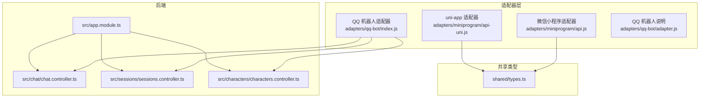
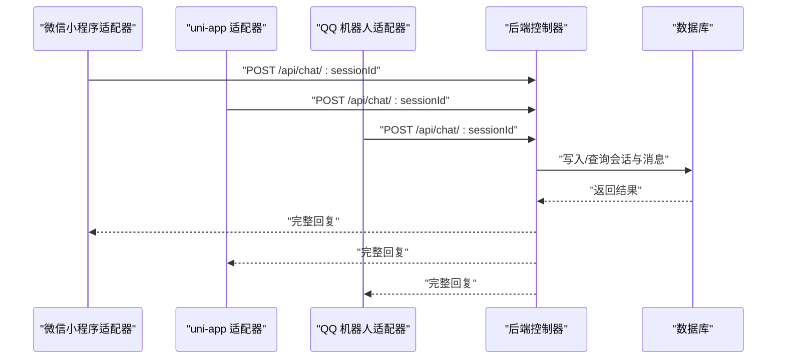
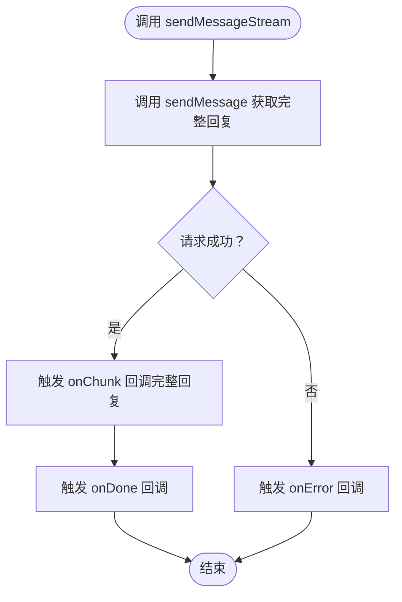
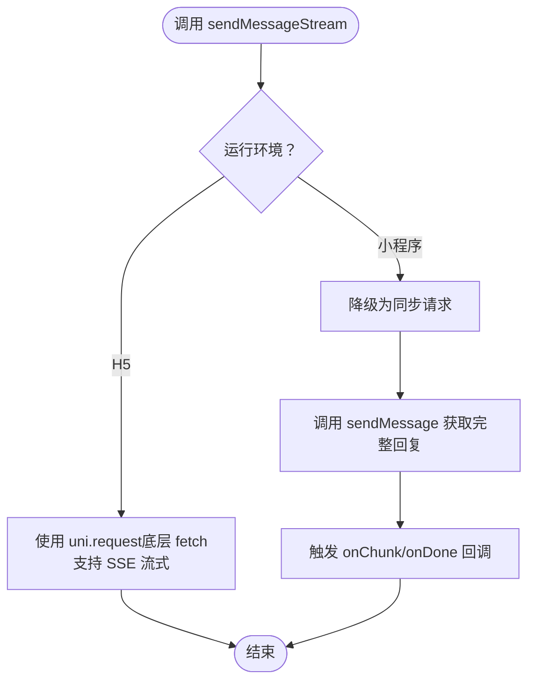
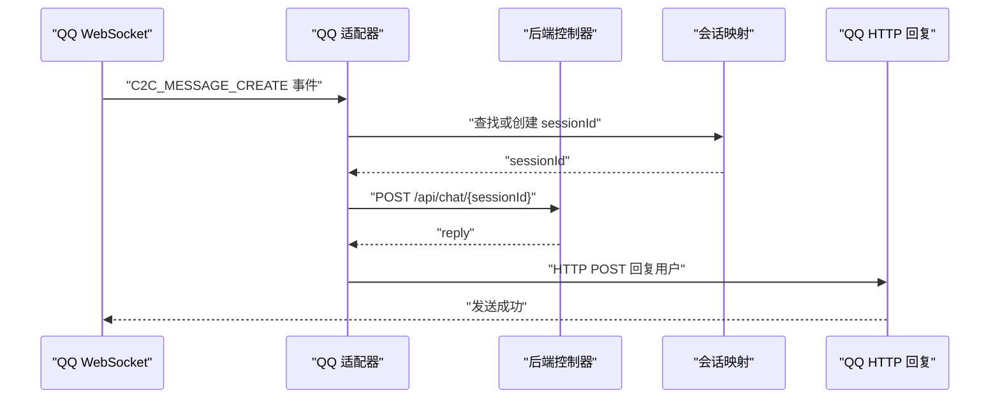
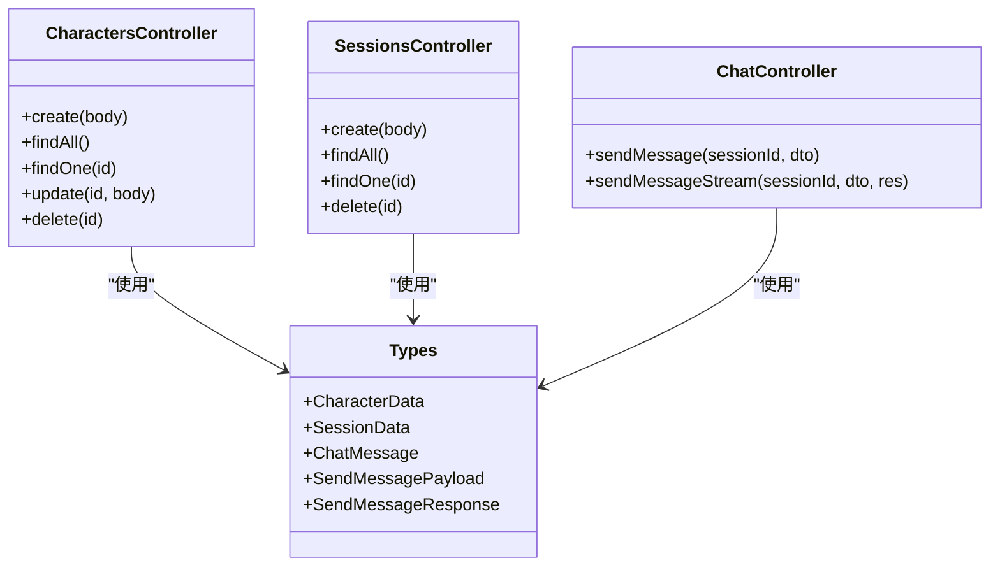
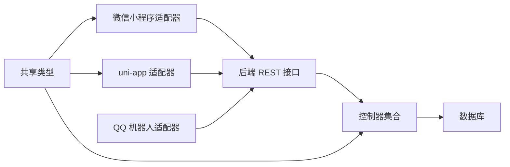

# 多平台适配器

<cite>
**本文引用的文件**
- [adapters/miniprogram/api.js](file://adapters/miniprogram/api.js)
- [adapters/miniprogram/api-uni.js](file://adapters/miniprogram/api-uni.js)
- [adapters/qq-bot/adapter.js](file://adapters/qq-bot/adapter.js)
- [adapters/qq-bot/index.js](file://adapters/qq-bot/index.js)
- [adapters/README.md](file://adapters/README.md)
- [shared/types.ts](file://shared/types.ts)
- [src/app.module.ts](file://src/app.module.ts)
- [src/chat/chat.controller.ts](file://src/chat/chat.controller.ts)
- [src/sessions/sessions.controller.ts](file://src/sessions/sessions.controller.ts)
- [src/characters/characters.controller.ts](file://src/characters/characters.controller.ts)
- [README.md](file://README.md)
</cite>

## 目录
1. [引言](#引言)
2. [项目结构](#项目结构)
3. [核心组件](#核心组件)
4. [架构总览](#架构总览)
5. [详细组件分析](#详细组件分析)
6. [依赖分析](#依赖分析)
7. [性能考虑](#性能考虑)
8. [故障排查指南](#故障排查指南)
9. [结论](#结论)
10. [附录](#附录)

## 引言
本文件面向“AI Companion”的多平台适配器系统，系统性阐述适配器模式的设计理念与实现机制，重点覆盖：
- 统一接口规范与平台特定实现的分离
- 微信小程序适配器的API封装、消息处理与状态管理
- QQ机器人适配器的事件处理、消息路由与错误恢复策略
- 适配器在整体架构中的作用与与后端控制器的交互关系
- 适配器扩展指南、测试策略、部署配置与监控建议

## 项目结构
适配器层位于应用根目录的 adapters 子目录中，按平台划分独立模块；共享类型定义位于 shared/types.ts；后端主模块在 src/app.module.ts，聊天、会话、角色等控制器分别位于 src/chat、src/sessions、src/characters。

图表来源
- [adapters/miniprogram/api.js:1-83](file://adapters/miniprogram/api.js#L1-L83)
- [adapters/miniprogram/api-uni.js:1-85](file://adapters/miniprogram/api-uni.js#L1-L85)
- [adapters/qq-bot/index.js:1-303](file://adapters/qq-bot/index.js#L1-L303)
- [adapters/qq-bot/adapter.js:1-35](file://adapters/qq-bot/adapter.js#L1-L35)
- [shared/types.ts:1-166](file://shared/types.ts#L1-L166)
- [src/app.module.ts:1-64](file://src/app.module.ts#L1-L64)
- [src/chat/chat.controller.ts:1-77](file://src/chat/chat.controller.ts#L1-L77)
- [src/sessions/sessions.controller.ts:1-28](file://src/sessions/sessions.controller.ts#L1-L28)
- [src/characters/characters.controller.ts:1-56](file://src/characters/characters.controller.ts#L1-L56)

章节来源
- [adapters/README.md:1-62](file://adapters/README.md#L1-L62)
- [README.md:1-99](file://README.md#L1-L99)

## 核心组件
- 统一接口规范：所有适配器导出一致的函数签名（角色 CRUD、会话 CRUD、消息发送），便于平台切换仅需替换 import 路径。
- 平台适配器：
  - 微信小程序：以 wx.request 替代 fetch，SSE 流式降级为同步回调。
  - uni-app：以 uni.request 兼容多端，H5 支持 SSE，小程序端降级。
  - QQ 机器人：WebSocket 接入 QQ Bot 网关，事件分发、会话映射、HTTP 回复。
- 后端控制器：提供 /api/characters、/api/sessions、/api/chat 等 REST 端点，其中聊天端点支持同步与 SSE 流式两种模式。

章节来源
- [adapters/README.md:17-38](file://adapters/README.md#L17-L38)
- [adapters/miniprogram/api.js:35-82](file://adapters/miniprogram/api.js#L35-L82)
- [adapters/miniprogram/api-uni.js:40-84](file://adapters/miniprogram/api-uni.js#L40-L84)
- [adapters/qq-bot/adapter.js:1-35](file://adapters/qq-bot/adapter.js#L1-L35)
- [src/chat/chat.controller.ts:16-77](file://src/chat/chat.controller.ts#L16-L77)
- [src/sessions/sessions.controller.ts:4-28](file://src/sessions/sessions.controller.ts#L4-L28)
- [src/characters/characters.controller.ts:17-56](file://src/characters/characters.controller.ts#L17-L56)

## 架构总览
适配器通过统一的 HTTP 接口与后端通信，后端控制器负责业务编排与数据持久化。不同平台的差异体现在网络层与流式能力上。

图表来源
- [adapters/miniprogram/api.js:67-69](file://adapters/miniprogram/api.js#L67-L69)
- [adapters/miniprogram/api-uni.js:72-74](file://adapters/miniprogram/api-uni.js#L72-L74)
- [adapters/qq-bot/index.js:121-124](file://adapters/qq-bot/index.js#L121-L124)
- [src/chat/chat.controller.ts:20-27](file://src/chat/chat.controller.ts#L20-L27)

## 详细组件分析

### 微信小程序适配器
- 设计要点
  - 以 wx.request 替代 fetch，保持函数签名与返回值一致，便于平台切换。
  - SSE 流式不可用时，sendMessageStream 降级为一次性回调，保证 UI 体验。
  - 域名白名单需在小程序后台配置，确保 HTTPS 访问后端。
- 关键函数
  - 角色与会话管理：createCharacter、getCharacters、getCharacter、deleteCharacter、createSession、getSessions、getSession、deleteSession
  - 消息发送：sendMessage、sendMessageStream（降级为同步）
- 状态管理
  - 由于平台限制，适配器不维护会话状态，状态由后端控制器与服务层管理。

图表来源
- [adapters/miniprogram/api.js:75-82](file://adapters/miniprogram/api.js#L75-L82)

章节来源
- [adapters/miniprogram/api.js:12-82](file://adapters/miniprogram/api.js#L12-L82)
- [adapters/README.md:10-11](file://adapters/README.md#L10-L11)

### uni-app 适配器
- 设计要点
  - 以 uni.request 兼容多端：H5 环境底层等价 fetch，支持 SSE；小程序端降级为同步。
  - 与微信小程序适配器类似，保持统一函数签名与类型引用。
- 关键函数
  - 与微信小程序适配器一致的角色、会话与消息发送 API。

图表来源
- [adapters/miniprogram/api-uni.js:10-11](file://adapters/miniprogram/api-uni.js#L10-L11)
- [adapters/miniprogram/api-uni.js:77-84](file://adapters/miniprogram/api-uni.js#L77-L84)

章节来源
- [adapters/miniprogram/api-uni.js:17-84](file://adapters/miniprogram/api-uni.js#L17-L84)
- [adapters/README.md:12-14](file://adapters/README.md#L12-L14)

### QQ 机器人适配器
- 设计要点
  - 通过 WebSocket 与 QQ 官方网关建立长连接，接收事件（如 C2C_MESSAGE_CREATE、GROUP_AT_MESSAGE_CREATE）。
  - 事件分发：收到消息后，映射或创建会话，调用后端 /api/chat/{sessionId} 获取回复，再通过 HTTP API 回复用户。
  - 错误恢复：连接断开后定时重连，心跳维持，异常日志输出。
- 关键流程
  - 鉴权与心跳：收到 Hello 后启动心跳并发送 Identify。
  - 事件处理：过滤自身消息，获取或创建会话，调用 chat 接口，发送回复。
  - 会话映射：维护 qqUserId → sessionId 的内存映射，首次对话自动创建会话。

图表来源
- [adapters/qq-bot/index.js:147-226](file://adapters/qq-bot/index.js#L147-L226)
- [adapters/qq-bot/index.js:107-118](file://adapters/qq-bot/index.js#L107-L118)
- [adapters/qq-bot/index.js:228-258](file://adapters/qq-bot/index.js#L228-L258)

章节来源
- [adapters/qq-bot/adapter.js:1-35](file://adapters/qq-bot/adapter.js#L1-L35)
- [adapters/qq-bot/index.js:27-37](file://adapters/qq-bot/index.js#L27-L37)
- [adapters/qq-bot/index.js:133-197](file://adapters/qq-bot/index.js#L133-L197)
- [adapters/qq-bot/index.js:206-226](file://adapters/qq-bot/index.js#L206-L226)
- [adapters/README.md:14](file://adapters/README.md#L14)

### 后端控制器与统一接口
- 控制器职责
  - 角色：创建、查询、更新、删除角色
  - 会话：创建、查询、获取单个、删除
  - 聊天：同步模式等待完整回复；流式模式通过 SSE 逐字推送
- 类型与一致性
  - 所有适配器导出的函数签名与类型来自 shared/types.ts，确保跨平台一致。

图表来源
- [src/characters/characters.controller.ts:17-56](file://src/characters/characters.controller.ts#L17-L56)
- [src/sessions/sessions.controller.ts:4-28](file://src/sessions/sessions.controller.ts#L4-L28)
- [src/chat/chat.controller.ts:16-77](file://src/chat/chat.controller.ts#L16-L77)
- [shared/types.ts:34-98](file://shared/types.ts#L34-L98)

章节来源
- [src/characters/characters.controller.ts:17-56](file://src/characters/characters.controller.ts#L17-L56)
- [src/sessions/sessions.controller.ts:4-28](file://src/sessions/sessions.controller.ts#L4-L28)
- [src/chat/chat.controller.ts:16-77](file://src/chat/chat.controller.ts#L16-L77)
- [shared/types.ts:114-121](file://shared/types.ts#L114-L121)

## 依赖分析
- 适配器与后端的耦合度低：仅依赖统一的 REST 接口与共享类型。
- 平台差异隔离：网络层（wx.request、uni.request、WebSocket）与业务逻辑解耦。
- 后端模块装配：AppModule 统一注册静态资源、配置加载与数据库连接，业务模块按需引入。

图表来源
- [adapters/miniprogram/api.js:12-82](file://adapters/miniprogram/api.js#L12-L82)
- [adapters/miniprogram/api-uni.js:17-84](file://adapters/miniprogram/api-uni.js#L17-L84)
- [adapters/qq-bot/index.js:121-124](file://adapters/qq-bot/index.js#L121-L124)
- [src/app.module.ts:18-62](file://src/app.module.ts#L18-L62)

章节来源
- [src/app.module.ts:18-62](file://src/app.module.ts#L18-L62)

## 性能考虑
- 微信小程序与 uni-app 小程序端：SSE 不可用，sendMessageStream 退化为一次性回调，UI 层需做好“首屏延迟”提示。
- QQ 机器人：WebSocket 长连接与心跳维持，注意网络抖动下的重连策略与事件去重。
- 后端流式响应：SSE 需禁用代理缓冲，确保实时推送；大文本分块传输时注意编码与边界处理。
- 会话映射：当前为内存 Map，生产环境建议持久化或使用分布式缓存，避免进程重启丢失。

## 故障排查指南
- 微信小程序
  - 现象：无法访问后端或返回错误
  - 排查：确认服务器域名已在小程序后台白名单；HTTPS 证书有效；请求头 Content-Type 正确
- uni-app
  - 现象：H5 端无流式、小程序端无回复
  - 排查：H5 环境是否使用 uni.request；小程序端是否正确降级为同步回调
- QQ 机器人
  - 现象：无法连接、无回复、频繁断线
  - 排查：appId/token 是否正确；WebSocket 网关地址；心跳间隔与鉴权参数；网络可达性与防火墙
  - 日志：关注连接断开与重连日志、消息解析错误、HTTP 回复失败
- 后端
  - 现象：SSE 无数据或提前关闭
  - 排查：SSE 响应头设置、代理缓冲、订阅完成信号与错误处理

章节来源
- [adapters/miniprogram/api.js:12-33](file://adapters/miniprogram/api.js#L12-L33)
- [adapters/miniprogram/api-uni.js:17-38](file://adapters/miniprogram/api-uni.js#L17-L38)
- [adapters/qq-bot/index.js:133-197](file://adapters/qq-bot/index.js#L133-L197)
- [adapters/qq-bot/index.js:228-258](file://adapters/qq-bot/index.js#L228-L258)
- [src/chat/chat.controller.ts:52-75](file://src/chat/chat.controller.ts#L52-L75)

## 结论
该多平台适配器系统通过统一接口与共享类型，将平台差异隔离在网络层，使业务逻辑与 UI/SDK 层解耦。微信小程序与 uni-app 在流式能力受限时采用降级策略，QQ 机器人通过 WebSocket 与 HTTP 双通道实现事件驱动与消息回复。整体架构清晰、扩展性强，适合进一步接入 Telegram 等其他平台。

## 附录

### 适配器扩展指南（新平台接入）
- 基于现有 web/src/api/index.ts（或参考 shared/types.ts）创建适配器：
  - 复制并替换 fetch 为平台专用 HTTP 客户端（如 wx.request、uni.request、原生 fetch）
  - 保持函数签名与返回值一致
  - 如平台不支持 SSE，提供同步回调版本
- 集成验证
  - 本地联调：角色 CRUD、会话 CRUD、消息发送（含流式）
  - 端到端：从平台客户端到后端控制器的完整链路
- 部署与监控
  - 为新平台准备独立的环境变量与配置文件
  - 监控指标：请求成功率、平均响应时间、流式推送延迟、WebSocket 连接稳定性

章节来源
- [adapters/README.md:53-62](file://adapters/README.md#L53-L62)
- [shared/types.ts:19-98](file://shared/types.ts#L19-L98)