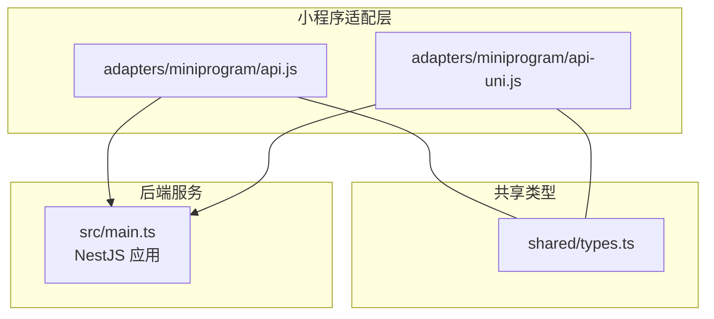
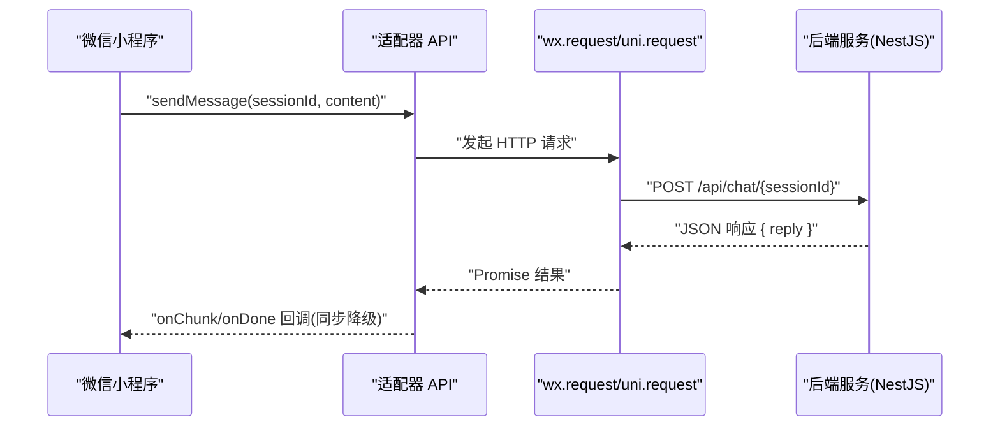
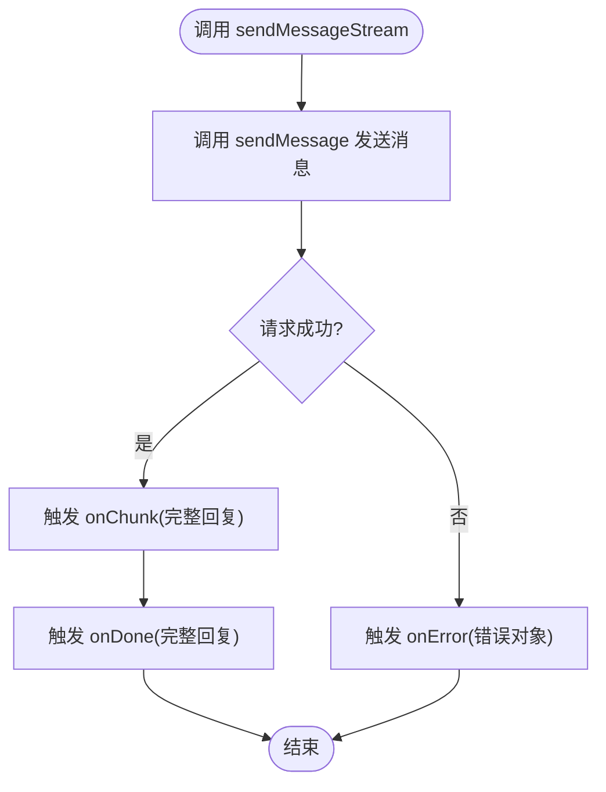
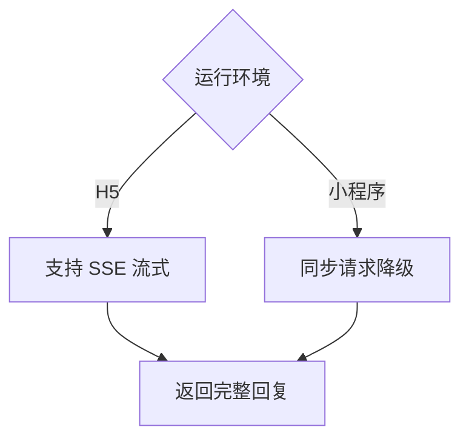
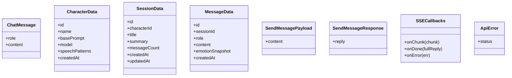
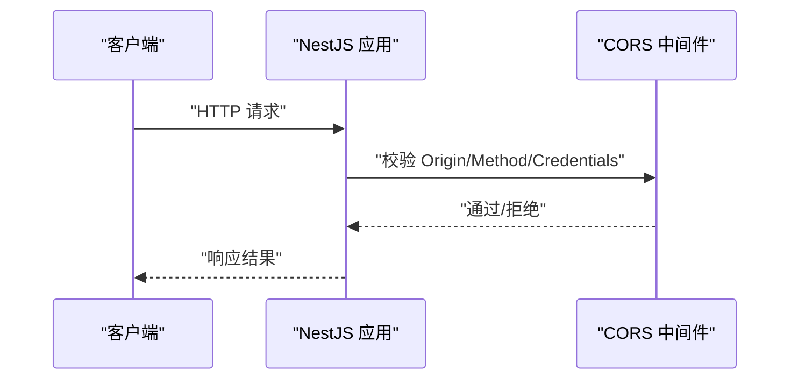
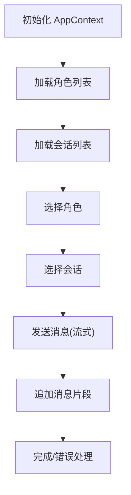
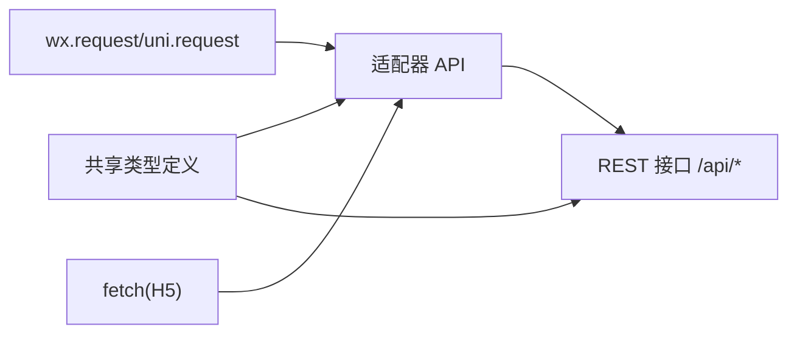

# 微信小程序适配器

<cite>
**本文档引用的文件**
- [adapters/miniprogram/api.js](file://adapters/miniprogram/api.js)
- [adapters/miniprogram/api-uni.js](file://adapters/miniprogram/api-uni.js)
- [shared/types.ts](file://shared/types.ts)
- [src/main.ts](file://src/main.ts)
- [web/src/context/AppContext.tsx](file://web/src/context/AppContext.tsx)
- [web/src/api/index.ts](file://web/src/api/index.ts)
- [adapters/qq-bot/adapter.js](file://adapters/qq-bot/adapter.js)
- [README.md](file://README.md)
</cite>

## 目录
1. [简介](#简介)
2. [项目结构](#项目结构)
3. [核心组件](#核心组件)
4. [架构总览](#架构总览)
5. [详细组件分析](#详细组件分析)
6. [依赖分析](#依赖分析)
7. [性能考虑](#性能考虑)
8. [故障排查指南](#故障排查指南)
9. [结论](#结论)
10. [附录](#附录)

## 简介
本文件面向微信小程序适配器的技术实现，聚焦以下目标：
- 解释小程序的消息处理机制，包括 API 封装设计、消息路由与状态管理
- 对比分析 api.js 与 api-uni.js 的功能差异与适用场景
- 说明小程序特有消息格式转换、用户身份验证与会话管理机制
- 描述小程序适配器与后端服务的通信协议、错误处理与重试机制
- 提供配置选项、环境变量与部署要求
- 给出调试技巧、性能优化策略与常见问题解决方案
- 说明与其它平台适配器的差异与兼容性考虑

## 项目结构
微信小程序适配器位于 adapters/miniprogram 目录，包含两个实现文件：
- api.js：直接基于微信小程序原生能力 wx.request() 的适配
- api-uni.js：基于 uni-app 的跨端适配，同时兼容微信/支付宝小程序、H5、App

共享类型定义位于 shared/types.ts，统一了角色、会话、消息、LLM 参数、SSE 回调与错误类型，确保前后端与多端一致。

**图表来源**
- [adapters/miniprogram/api.js:1-83](file://adapters/miniprogram/api.js#L1-L83)
- [adapters/miniprogram/api-uni.js:1-85](file://adapters/miniprogram/api-uni.js#L1-L85)
- [shared/types.ts:1-166](file://shared/types.ts#L1-L166)
- [src/main.ts:1-22](file://src/main.ts#L1-L22)

**章节来源**
- [adapters/miniprogram/api.js:1-83](file://adapters/miniprogram/api.js#L1-L83)
- [adapters/miniprogram/api-uni.js:1-85](file://adapters/miniprogram/api-uni.js#L1-L85)
- [shared/types.ts:1-166](file://shared/types.ts#L1-L166)
- [src/main.ts:1-22](file://src/main.ts#L1-L22)

## 核心组件
- API 封装层
  - api.js：以 wx.request() 替代 fetch()，提供角色、会话、消息与聊天接口；流式接口降级为同步
  - api-uni.js：以 uni.request() 替代 fetch()，在 H5 环境支持 SSE，在小程序环境降级为同步
- 共享类型定义：统一角色、会话、消息、LLM 参数、SSE 回调与错误类型
- 后端服务：NestJS 应用，启用 CORS，监听端口并提供 /api 路由

**章节来源**
- [adapters/miniprogram/api.js:14-83](file://adapters/miniprogram/api.js#L14-L83)
- [adapters/miniprogram/api-uni.js:19-85](file://adapters/miniprogram/api-uni.js#L19-L85)
- [shared/types.ts:19-108](file://shared/types.ts#L19-L108)
- [src/main.ts:9-13](file://src/main.ts#L9-L13)

## 架构总览
小程序适配器通过封装网络请求，向后端服务发起 REST 风格调用，完成角色管理、会话管理与消息交互。在流式返回方面，小程序环境不支持 SSE，因此采用同步返回策略。

**图表来源**
- [adapters/miniprogram/api.js:67-83](file://adapters/miniprogram/api.js#L67-L83)
- [adapters/miniprogram/api-uni.js:72-85](file://adapters/miniprogram/api-uni.js#L72-L85)
- [src/main.ts:15-16](file://src/main.ts#L15-L16)

## 详细组件分析

### 组件一：微信小程序 API 封装(api.js)
- 设计要点
  - 使用 wx.request() 替代 fetch()，保持函数签名与前端一致，便于平台切换
  - 所有接口均以 Promise 形式返回，成功时解析 res.data，失败时抛出错误
  - 流式接口 sendMessageStream 降级为同步：一次性返回完整回复
- 接口清单
  - 角色：创建、查询列表、查询单个、删除
  - 会话：创建、查询列表、查询单个、删除
  - 消息：发送消息
- 错误处理
  - HTTP 状态码不在 2xx 时，构造错误信息（优先使用 res.data.message）
  - wx.request 失败时直接 reject
- 流式降级
  - onChunk 与 onDone 均接收完整回复字符串，模拟“整段作为一个 chunk”的行为

**图表来源**
- [adapters/miniprogram/api.js:75-83](file://adapters/miniprogram/api.js#L75-L83)

**章节来源**
- [adapters/miniprogram/api.js:12-33](file://adapters/miniprogram/api.js#L12-L33)
- [adapters/miniprogram/api.js:35-83](file://adapters/miniprogram/api.js#L35-L83)

### 组件二：uni-app 跨端 API 封装(api-uni.js)
- 设计要点
  - 使用 uni.request()，在 H5 环境底层即 fetch()，支持 SSE；在小程序环境降级为同步
  - 与 api.js 相同的函数签名与错误处理策略
- 适用场景
  - 需要同时支持 H5 与小程序的跨端应用
  - H5 环境希望保留 SSE 流式体验，小程序环境接受同步降级

**图表来源**
- [adapters/miniprogram/api-uni.js:10-11](file://adapters/miniprogram/api-uni.js#L10-L11)
- [adapters/miniprogram/api-uni.js:77-85](file://adapters/miniprogram/api-uni.js#L77-L85)

**章节来源**
- [adapters/miniprogram/api-uni.js:17-38](file://adapters/miniprogram/api-uni.js#L17-L38)
- [adapters/miniprogram/api-uni.js:40-85](file://adapters/miniprogram/api-uni.js#L40-L85)

### 组件三：共享类型定义(shared/types.ts)
- 角色与会话
  - 角色数据结构、创建与更新载荷
  - 会话数据结构、创建载荷
- 消息与聊天
  - 消息数据结构
  - 发送消息载荷与响应结构
- SSE 回调
  - onChunk、onDone、onError 的回调约定
- 错误类型
  - ApiError 类型，携带 status 字段

**图表来源**
- [shared/types.ts:19-98](file://shared/types.ts#L19-L98)

**章节来源**
- [shared/types.ts:19-98](file://shared/types.ts#L19-L98)

### 组件四：后端服务(src/main.ts)
- CORS 配置
  - 开发阶段允许任意来源访问，生产环境建议限定具体域名
- 端口监听
  - 默认端口来自环境变量 PORT，未设置则使用 3000
- 路由
  - /api 下提供角色、会话、消息、聊天等 REST 接口

**图表来源**
- [src/main.ts:9-13](file://src/main.ts#L9-L13)
- [src/main.ts:15-16](file://src/main.ts#L15-L16)

**章节来源**
- [src/main.ts:9-13](file://src/main.ts#L9-L13)
- [src/main.ts:15-16](file://src/main.ts#L15-L16)

### 组件五：前端上下文与 API 使用(web/src)
- 前端上下文(AppContext)
  - 管理角色、会话、消息与状态，包含流式状态标记与增量拼接
- Web 端 API
  - 与后端一致的 REST 接口封装，用于 H5 环境

**图表来源**
- [web/src/context/AppContext.tsx:63-81](file://web/src/context/AppContext.tsx#L63-L81)
- [web/src/context/AppContext.tsx:49-61](file://web/src/context/AppContext.tsx#L49-L61)
- [web/src/api/index.ts:107-112](file://web/src/api/index.ts#L107-L112)

**章节来源**
- [web/src/context/AppContext.tsx:63-81](file://web/src/context/AppContext.tsx#L63-L81)
- [web/src/context/AppContext.tsx:49-61](file://web/src/context/AppContext.tsx#L49-L61)
- [web/src/api/index.ts:107-112](file://web/src/api/index.ts#L107-L112)

### 组件六：QQ Bot 适配器(对比参考)
- 说明
  - 该适配器为占位示例，展示第三方平台接入的典型流程
  - 与小程序适配器不同，它通过 WebSocket 接入第三方平台，并调用后端 API
- 差异
  - 平台接入方式：WebSocket vs 原生网络请求
  - 适配器职责：消息桥接 vs 直接 REST 调用

**章节来源**
- [adapters/qq-bot/adapter.js:1-35](file://adapters/qq-bot/adapter.js#L1-L35)

## 依赖分析
- 适配器对后端的依赖
  - 统一的 REST 接口：/api/characters、/api/sessions、/api/messages、/api/chat/{sessionId}
  - 共享类型定义：确保数据结构一致性
- 适配器对运行环境的依赖
  - 小程序：wx.request() 或 uni.request()（跨端）
  - H5：fetch()（uni-app 在 H5 下等价于 fetch）

**图表来源**
- [adapters/miniprogram/api.js:14-33](file://adapters/miniprogram/api.js#L14-L33)
- [adapters/miniprogram/api-uni.js:19-38](file://adapters/miniprogram/api-uni.js#L19-L38)
- [shared/types.ts:19-98](file://shared/types.ts#L19-L98)

**章节来源**
- [adapters/miniprogram/api.js:14-33](file://adapters/miniprogram/api.js#L14-L33)
- [adapters/miniprogram/api-uni.js:19-38](file://adapters/miniprogram/api-uni.js#L19-L38)
- [shared/types.ts:19-98](file://shared/types.ts#L19-L98)

## 性能考虑
- 网络请求
  - 小程序环境不支持 SSE，流式接口降级为同步，需注意首屏延迟与用户体验
  - 建议在 UI 层尽早显示“正在输入”提示，缓解等待感知
- 数据传输
  - 使用共享类型定义，避免字段命名不一致导致的序列化/反序列化开销
- 跨端适配
  - uni-app 在 H5 环境可利用 SSE，减少同步请求带来的往返次数
- CORS 与安全
  - 生产环境严格限制 CORS 来源，避免不必要的跨域风险

[本节为通用指导，无需特定文件引用]

## 故障排查指南
- 域名白名单
  - 小程序需在后台配置服务器域名白名单，否则 wx.request() 会失败
- 错误处理
  - 适配器在非 2xx 状态码时会抛出错误，错误信息优先取自 res.data.message
  - 建议在调用侧捕获错误并进行用户提示
- 端口与 CORS
  - 确认后端监听端口与环境变量一致
  - 开发阶段 CORS 允许任意来源，生产环境需限制来源
- uni-app 环境差异
  - H5 环境支持 SSE，小程序环境降级为同步；需分别测试与适配 UI

**章节来源**
- [adapters/miniprogram/api.js:12](file://adapters/miniprogram/api.js#L12)
- [adapters/miniprogram/api.js:24-26](file://adapters/miniprogram/api.js#L24-L26)
- [src/main.ts:9-13](file://src/main.ts#L9-L13)

## 结论
微信小程序适配器通过简洁的 API 封装，实现了与后端服务的一致交互。在流式体验受限的小程序环境中，采用同步降级策略保证可用性；对于需要跨端支持的应用，推荐使用 uni-app 版本以兼顾 H5 与小程序体验。配合共享类型定义与严格的 CORS 配置，可在多端环境下保持一致的开发与运行体验。

[本节为总结性内容，无需特定文件引用]

## 附录

### 配置选项与环境变量
- 后端
  - 端口：PORT（默认 3000）
  - CORS：开发阶段允许任意来源，生产环境建议限制为具体域名
- 适配器
  - BASE_URL：后端服务地址（生产与开发环境需区分）
  - uni-app 环境：H5 下支持 SSE，小程序下同步降级

**章节来源**
- [src/main.ts:15-16](file://src/main.ts#L15-L16)
- [src/main.ts:9-13](file://src/main.ts#L9-L13)
- [adapters/miniprogram/api.js:12](file://adapters/miniprogram/api.js#L12)
- [adapters/miniprogram/api-uni.js:17](file://adapters/miniprogram/api-uni.js#L17)

### 部署要求
- 小程序
  - 后端域名需加入小程序后台服务器域名白名单
  - 生产环境建议启用 HTTPS
- uni-app
  - H5 环境：无特殊限制
  - 小程序环境：遵循小程序部署规范与域名白名单要求
- 后端
  - 生产环境建议限制 CORS 来源，避免跨域风险

**章节来源**
- [adapters/miniprogram/api.js:12](file://adapters/miniprogram/api.js#L12)
- [src/main.ts:9-13](file://src/main.ts#L9-L13)

### 调试技巧
- 小程序端
  - 使用微信开发者工具查看网络面板，确认请求路径与响应体
  - 在 onChunk/onDone 中打印完整回复，验证同步降级是否符合预期
- uni-app 环境
  - H5 环境下观察浏览器控制台与网络面板，确认 SSE 是否生效
  - 小程序环境验证同步请求的完整回复
- 后端
  - 开启日志输出，定位 CORS 与路由匹配问题
  - 使用 supertest 等工具编写端到端测试

**章节来源**
- [adapters/miniprogram/api.js:75-83](file://adapters/miniprogram/api.js#L75-L83)
- [adapters/miniprogram/api-uni.js:77-85](file://adapters/miniprogram/api-uni.js#L77-L85)
- [src/main.ts:17-19](file://src/main.ts#L17-L19)

### 与其他平台适配器的差异与兼容性
- 与 QQ Bot 适配器
  - 接入方式：WebSocket（第三方平台）vs 原生网络请求（小程序）
  - 适配器职责：消息桥接（QQ Bot）vs 直接 REST 调用（小程序）
- 与 Web/H5 适配器
  - uni-app 在 H5 环境支持 SSE，UI 可获得流式体验
  - 小程序环境同步降级，UI 需适配“整段回复”的模式

**章节来源**
- [adapters/qq-bot/adapter.js:1-35](file://adapters/qq-bot/adapter.js#L1-L35)
- [adapters/miniprogram/api-uni.js:10-11](file://adapters/miniprogram/api-uni.js#L10-L11)