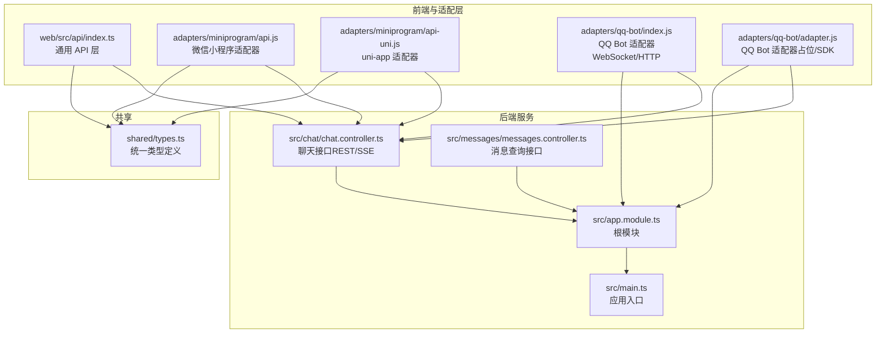
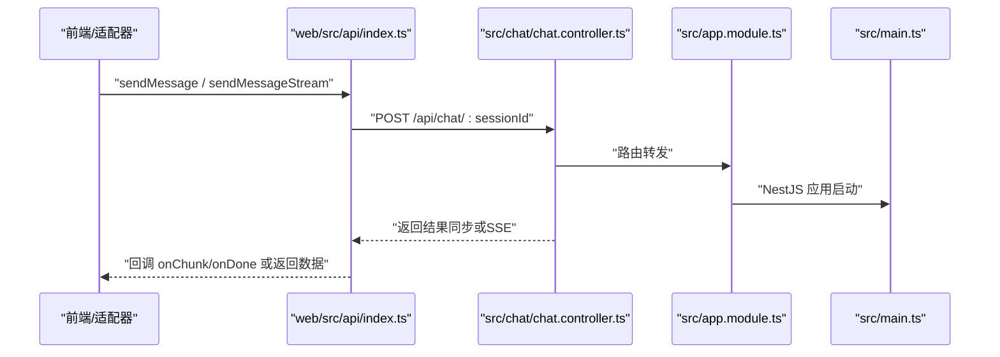
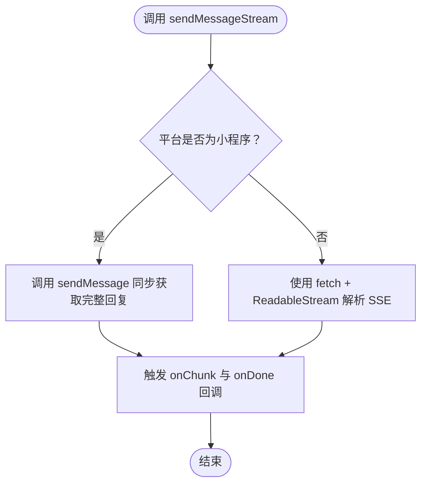
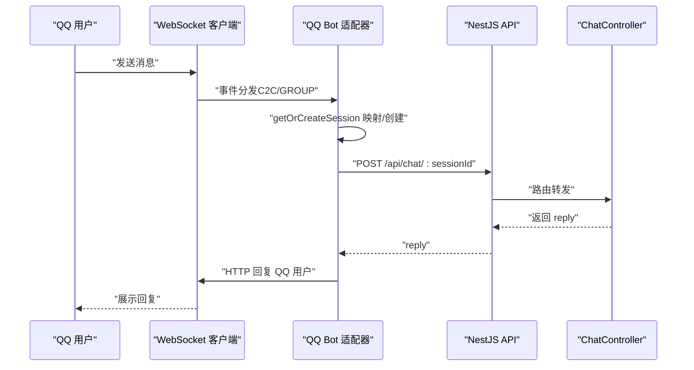
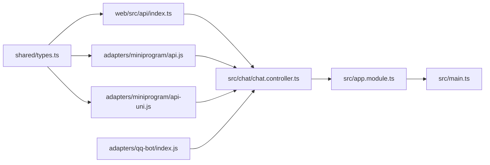

# 适配器架构设计

<cite>
**本文档引用的文件**
- [adapters/README.md](file://adapters/README.md)
- [adapters/miniprogram/api.js](file://adapters/miniprogram/api.js)
- [adapters/miniprogram/api-uni.js](file://adapters/miniprogram/api-uni.js)
- [adapters/qq-bot/adapter.js](file://adapters/qq-bot/adapter.js)
- [adapters/qq-bot/index.js](file://adapters/qq-bot/index.js)
- [web/src/api/index.ts](file://web/src/api/index.ts)
- [shared/types.ts](file://shared/types.ts)
- [src/app.module.ts](file://src/app.module.ts)
- [src/main.ts](file://src/main.ts)
- [src/chat/chat.controller.ts](file://src/chat/chat.controller.ts)
- [src/messages/messages.controller.ts](file://src/messages/messages.controller.ts)
- [web/src/context/AppContext.tsx](file://web/src/context/AppContext.tsx)
- [docs/Learning_Notes.md](file://docs/Learning_Notes.md)
</cite>

## 目录
1. [引言](#引言)
2. [项目结构](#项目结构)
3. [核心组件](#核心组件)
4. [架构总览](#架构总览)
5. [组件详解](#组件详解)
6. [依赖关系分析](#依赖关系分析)
7. [性能考量](#性能考量)
8. [故障排查指南](#故障排查指南)
9. [结论](#结论)
10. [附录](#附录)

## 引言
本文件面向“AI Companion”的适配器架构设计，系统阐述适配器模式在多平台消息系统中的应用价值与实现要点。重点包括：
- 统一接口规范：消息格式标准化、事件处理抽象、状态管理机制
- 通用功能模块与平台特定功能的分离策略
- 生命周期管理、错误处理与异常恢复
- 适配器扩展指南：新平台接入流程、接口实现规范与测试验证
- 适配器在整体系统中的定位与交互关系
- 配置管理、日志与监控方案

## 项目结构
本项目采用“共享类型 + 通用前端 API 层 + 平台适配器 + 后端服务”的分层组织方式：
- 共享类型：位于 shared/types.ts，确保前后端与各平台适配器的类型一致性
- 通用前端 API 层：web/src/api/index.ts，提供统一的 HTTP/SSE 接口，零框架依赖，可直接复制到各平台
- 平台适配器：adapters/*，针对不同运行环境替换底层网络请求与流式能力
- 后端服务：NestJS，提供 REST 与 SSE 接口，承载角色、会话、消息与聊天逻辑

图表来源
- [web/src/api/index.ts:1-212](file://web/src/api/index.ts#L1-L212)
- [adapters/miniprogram/api.js:1-83](file://adapters/miniprogram/api.js#L1-L83)
- [adapters/miniprogram/api-uni.js:1-85](file://adapters/miniprogram/api-uni.js#L1-L85)
- [adapters/qq-bot/index.js:1-303](file://adapters/qq-bot/index.js#L1-L303)
- [adapters/qq-bot/adapter.js:1-35](file://adapters/qq-bot/adapter.js#L1-L35)
- [src/app.module.ts:1-64](file://src/app.module.ts#L1-L64)
- [src/main.ts:1-22](file://src/main.ts#L1-L22)
- [src/chat/chat.controller.ts:1-76](file://src/chat/chat.controller.ts#L1-L76)
- [src/messages/messages.controller.ts:1-26](file://src/messages/messages.controller.ts#L1-L26)
- [shared/types.ts:1-166](file://shared/types.ts#L1-L166)

章节来源
- [adapters/README.md:1-62](file://adapters/README.md#L1-L62)
- [web/src/api/index.ts:1-212](file://web/src/api/index.ts#L1-L212)
- [shared/types.ts:1-166](file://shared/types.ts#L1-L166)

## 核心组件
- 统一类型系统：shared/types.ts 定义角色、会话、消息、聊天参数与响应、SSE 回调、错误类型等，确保跨平台一致
- 通用前端 API 层：web/src/api/index.ts 提供角色 CRUD、会话 CRUD、消息查询、同步聊天与 SSE 流式聊天接口
- 平台适配器：
  - 微信小程序与 uni-app：adapters/miniprogram/api.js 与 api-uni.js，替换 fetch 为平台原生请求；SSE 在小程序端降级为同步
  - QQ Bot：adapters/qq-bot/index.js 通过 WebSocket 接收消息，HTTP 调用后端 API，并维护用户到会话的映射
- 后端服务：NestJS 提供 REST 与 SSE 接口，负责聊天处理、消息持久化与检索

章节来源
- [shared/types.ts:1-166](file://shared/types.ts#L1-L166)
- [web/src/api/index.ts:1-212](file://web/src/api/index.ts#L1-L212)
- [adapters/miniprogram/api.js:1-83](file://adapters/miniprogram/api.js#L1-L83)
- [adapters/miniprogram/api-uni.js:1-85](file://adapters/miniprogram/api-uni.js#L1-L85)
- [adapters/qq-bot/index.js:1-303](file://adapters/qq-bot/index.js#L1-L303)

## 架构总览
适配器模式在此项目中的核心价值在于“统一接口 + 平台解耦”。前端通用 API 层屏蔽平台差异，后端提供稳定接口，适配器仅负责网络层替换与平台特性适配。

图表来源
- [web/src/api/index.ts:118-201](file://web/src/api/index.ts#L118-L201)
- [src/chat/chat.controller.ts:16-76](file://src/chat/chat.controller.ts#L16-L76)
- [src/app.module.ts:18-64](file://src/app.module.ts#L18-L64)
- [src/main.ts:4-22](file://src/main.ts#L4-L22)

## 组件详解

### 统一接口规范与类型系统
- 设计原则
  - 以 shared/types.ts 为核心，定义角色、会话、消息、聊天参数与响应、SSE 回调、错误类型
  - 前端 API 层与各平台适配器均引用该类型，保证跨平台一致性
  - 时间字段统一为 ISO 8601 字符串，避免平台差异导致的解析问题
- 关键接口
  - 角色：创建、查询、更新、删除
  - 会话：创建、查询、获取单个、删除
  - 消息：查询历史
  - 聊天：同步与 SSE 流式两种模式
- SSE 回调约定
  - onChunk：接收文本片段
  - onDone：接收完整回复
  - onError：错误回调

章节来源
- [shared/types.ts:11-166](file://shared/types.ts#L11-L166)
- [web/src/api/index.ts:58-212](file://web/src/api/index.ts#L58-L212)

### 通用前端 API 层（web/src/api/index.ts）
- 功能要点
  - request 封装通用 HTTP 请求，统一错误处理
  - 角色与会话 CRUD、消息查询、同步聊天、SSE 流式聊天
  - SSE 解析标准的 data: ... 格式，支持 [DONE] 结束标记
- 平台无关性
  - 无 DOM/React/框架依赖，可直接复制到小程序、RN、Telegram Bot 等环境
  - 通过替换 fetch 为平台原生请求即可适配

章节来源
- [web/src/api/index.ts:1-212](file://web/src/api/index.ts#L1-L212)

### 微信小程序与 uni-app 适配器
- 适配策略
  - 将 fetch 替换为 wx.request 或 uni.request
  - SSE 在小程序端不可用，降级为同步请求，回调 onChunk/onDone 同步触发
- 适用场景
  - 微信小程序、支付宝小程序、H5（uni-app）
  - H5 环境下 uni.request 底层即 fetch，支持 SSE

图表来源
- [adapters/miniprogram/api.js:75-83](file://adapters/miniprogram/api.js#L75-L83)
- [adapters/miniprogram/api-uni.js:77-85](file://adapters/miniprogram/api-uni.js#L77-L85)
- [web/src/api/index.ts:137-201](file://web/src/api/index.ts#L137-L201)

章节来源
- [adapters/miniprogram/api.js:1-83](file://adapters/miniprogram/api.js#L1-L83)
- [adapters/miniprogram/api-uni.js:1-85](file://adapters/miniprogram/api-uni.js#L1-L85)

### QQ Bot 适配器（WebSocket + HTTP）
- 架构说明
  - 通过 WebSocket 接收 QQ 用户消息，维护 qqUserId → sessionId 映射
  - 使用 HTTP 调用后端 API 获取回复，再通过 HTTP 回复 QQ 用户
  - 支持心跳保活与断线重连
- 关键流程
  - 鉴权：获取 access_token（可选），发送 Identify
  - 事件处理：识别 C2C_MESSAGE_CREATE/GROUP_AT_MESSAGE_CREATE
  - 会话管理：未命中则创建会话
  - 聊天调用：POST /api/chat/:sessionId
  - 回复：HTTP POST 回复消息接口

图表来源
- [adapters/qq-bot/index.js:133-226](file://adapters/qq-bot/index.js#L133-L226)
- [adapters/qq-bot/index.js:107-124](file://adapters/qq-bot/index.js#L107-L124)
- [src/chat/chat.controller.ts:20-76](file://src/chat/chat.controller.ts#L20-L76)

章节来源
- [adapters/qq-bot/adapter.js:1-35](file://adapters/qq-bot/adapter.js#L1-L35)
- [adapters/qq-bot/index.js:1-303](file://adapters/qq-bot/index.js#L1-L303)
- [src/chat/chat.controller.ts:1-76](file://src/chat/chat.controller.ts#L1-L76)

### 后端服务（NestJS）
- 根模块与静态资源
  - ServeStaticModule 提供前端产物托管
  - ConfigModule 加载 .env，TypeOrmModule 连接数据库
- 聊天接口
  - REST：POST /api/chat/:sessionId
  - SSE：POST /api/chat/:sessionId/stream，逐字推送 data: 片段，[DONE] 结束
- 消息查询
  - GET /api/messages?sessionId=&limit=

章节来源
- [src/app.module.ts:18-64](file://src/app.module.ts#L18-L64)
- [src/main.ts:7-13](file://src/main.ts#L7-L13)
- [src/chat/chat.controller.ts:16-76](file://src/chat/chat.controller.ts#L16-L76)
- [src/messages/messages.controller.ts:14-25](file://src/messages/messages.controller.ts#L14-L25)

## 依赖关系分析
- 低耦合高内聚
  - 适配器仅依赖 shared/types.ts 与后端接口契约，不依赖后端实现细节
  - web/src/api/index.ts 与各平台适配器共享同一套函数签名，便于切换
- 外部依赖
  - QQ Bot 适配器依赖 ws 与 HTTPS 模块，需公网可访问与正确的网关地址
  - 后端依赖 NestJS、TypeORM、pgvector 等

图表来源
- [shared/types.ts:1-166](file://shared/types.ts#L1-L166)
- [web/src/api/index.ts:15-28](file://web/src/api/index.ts#L15-L28)
- [adapters/miniprogram/api.js:14-33](file://adapters/miniprogram/api.js#L14-L33)
- [adapters/miniprogram/api-uni.js:19-38](file://adapters/miniprogram/api-uni.js#L19-L38)
- [adapters/qq-bot/index.js:21-104](file://adapters/qq-bot/index.js#L21-L104)
- [src/chat/chat.controller.ts:16-76](file://src/chat/chat.controller.ts#L16-L76)
- [src/app.module.ts:18-64](file://src/app.module.ts#L18-L64)
- [src/main.ts:4-22](file://src/main.ts#L4-L22)

章节来源
- [adapters/README.md:17-62](file://adapters/README.md#L17-L62)
- [web/src/api/index.ts:15-28](file://web/src/api/index.ts#L15-L28)

## 性能考量
- SSE 流式传输
  - 前端使用 ReadableStream 逐字解码，降低首字延迟体验
  - 后端以 text/event-stream 推送，注意禁用代理缓冲（如 Nginx）
- 小程序端降级
  - SSE 不可用时采用同步请求，回调 onChunk/onDone 同步触发，避免阻塞 UI
- 异步记忆与摘要
  - 记忆提取与滚动摘要采用异步执行，避免阻塞主聊天响应
- 数据库与向量化
  - 使用 pgvector 进行相似度检索，结合迁移脚本保证结构一致性

章节来源
- [web/src/api/index.ts:137-201](file://web/src/api/index.ts#L137-L201)
- [src/chat/chat.controller.ts:52-74](file://src/chat/chat.controller.ts#L52-L74)
- [docs/Learning_Notes.md:1157-1183](file://docs/Learning_Notes.md#L1157-L1183)

## 故障排查指南
- 常见问题
  - 跨域：开发阶段允许任意来源，生产环境需限制具体域名
  - 网络请求失败：检查平台请求封装是否正确，小程序需配置服务器域名白名单
  - SSE 不可用：确认平台是否支持 ReadableStream，小程序端需降级为同步
  - QQ Bot 连接失败：核对 appId/token/gateway，确保公网可访问与心跳保活
- 日志与监控
  - 适配器与后端均输出关键事件日志（连接、鉴权、消息处理、错误）
  - 建议在 CI/CD 中集成健康检查与告警

章节来源
- [src/main.ts:9-13](file://src/main.ts#L9-L13)
- [adapters/miniprogram/api.js:12-10](file://adapters/miniprogram/api.js#L12-L10)
- [adapters/qq-bot/index.js:133-197](file://adapters/qq-bot/index.js#L133-L197)

## 结论
本项目通过“共享类型 + 通用前端 API 层 + 平台适配器 + NestJS 后端”的架构，实现了多平台消息系统的统一接口与平台解耦。适配器模式在以下方面体现价值：
- 统一接口规范：类型一致、函数签名一致、SSE 回调一致
- 平台特性分离：通用逻辑集中，平台差异收敛在适配层
- 生命周期与错误处理：明确的连接/鉴权/心跳/重连与错误回调
- 扩展友好：新平台接入仅需复制通用 API 层并替换网络层

## 附录

### 适配器扩展指南
- 新平台接入流程
  - 复制 web/src/api/index.ts 到目标适配器目录
  - 将 fetch 替换为平台原生请求（如 wx.request、uni.request、axios 等）
  - 保持函数签名与类型一致，引用 shared/types.ts
  - 如平台不支持 SSE，实现同步回调 onChunk/onDone
- 接口实现规范
  - 角色/会话/消息/聊天接口一一对应
  - SSE 回调 onChunk/onDone/onError 必须按约定触发
  - 错误处理：捕获网络异常并抛出或传递给 onError
- 测试验证方法
  - 单元测试：模拟网络请求，验证回调触发与错误传播
  - 端到端测试：在目标平台运行，验证消息发送、流式显示、错误提示
  - 性能测试：对比同步与 SSE 的首字延迟与吞吐

章节来源
- [adapters/README.md:53-62](file://adapters/README.md#L53-L62)
- [web/src/api/index.ts:15-28](file://web/src/api/index.ts#L15-L28)
- [shared/types.ts:11-166](file://shared/types.ts#L11-L166)

### 配置管理、日志与监控
- 配置管理
  - .env 文件集中管理数据库、API 密钥、服务地址等敏感信息
  - NestJS ConfigModule 全局注入，模块内按需读取
- 日志
  - 适配器与后端均输出关键事件日志，便于排障
- 监控
  - 建议在 CI/CD 中加入健康检查与告警，覆盖接口可用性、响应时间与错误率

章节来源
- [src/app.module.ts:32-35](file://src/app.module.ts#L32-L35)
- [adapters/qq-bot/index.js:27-37](file://adapters/qq-bot/index.js#L27-L37)
- [docs/Learning_Notes.md:261-305](file://docs/Learning_Notes.md#L261-L305)