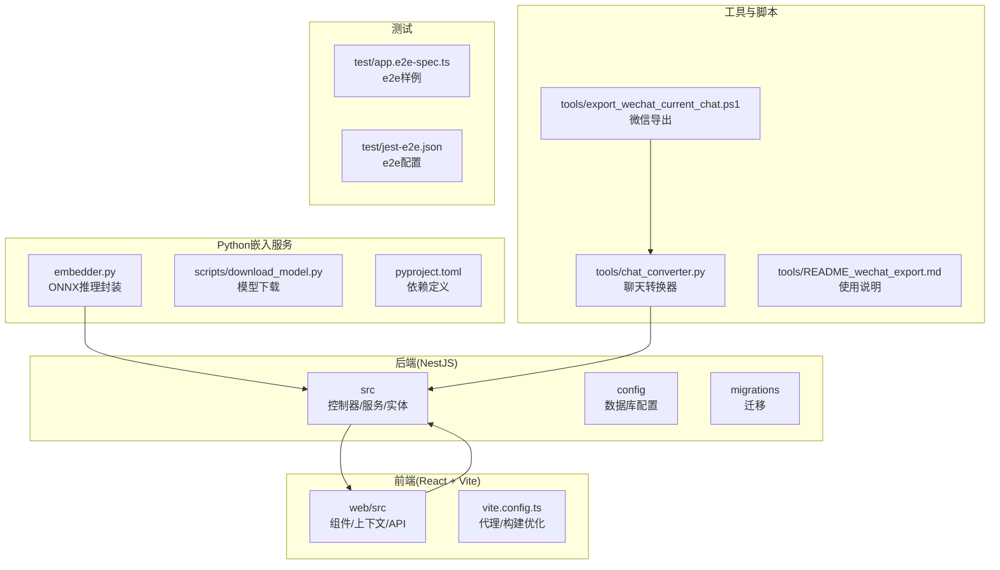
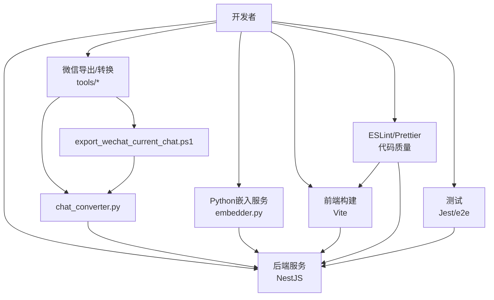
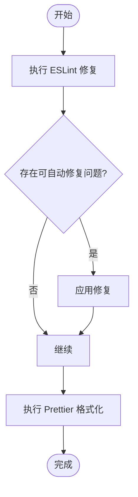
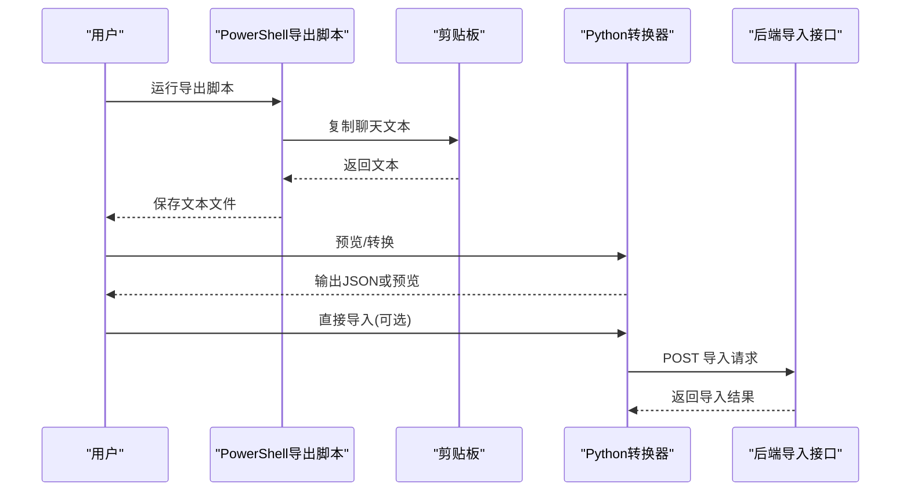
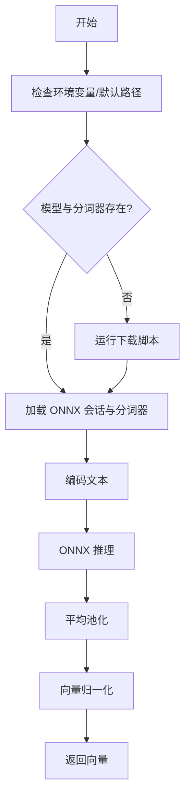
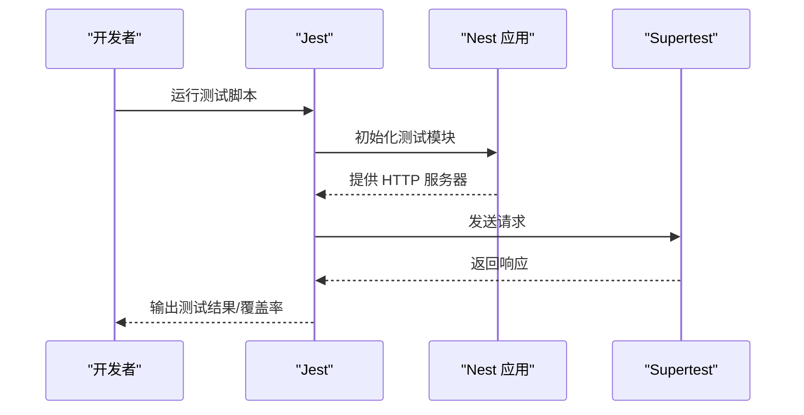
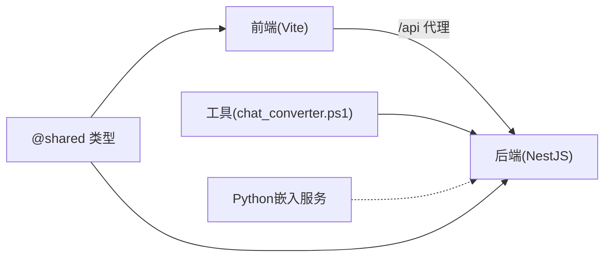

# 开发工具与脚本

<cite>
**本文引用的文件**
- [eslint.config.mjs](file://eslint.config.mjs)
- [package.json](file://package.json)
- [.prettierrc](file://.prettierrc)
- [tools/README_wechat_export.md](file://tools/README_wechat_export.md)
- [tools/chat_converter.py](file://tools/chat_converter.py)
- [tools/export_wechat_current_chat.ps1](file://tools/export_wechat_current_chat.ps1)
- [tools/export_wechat_current_chat.bat](file://tools/export_wechat_current_chat.bat)
- [python/scripts/download_model.py](file://python/scripts/download_model.py)
- [python/embedder.py](file://python/embedder.py)
- [python/pyproject.toml](file://python/pyproject.toml)
- [test/app.e2e-spec.ts](file://test/app.e2e-spec.ts)
- [test/jest-e2e.json](file://test/jest-e2e.json)
- [web/vite.config.ts](file://web/vite.config.ts)
- [web/package.json](file://web/package.json)
- [tsconfig.json](file://tsconfig.json)
- [tsconfig.build.json](file://tsconfig.build.json)
- [nest-cli.json](file://nest-cli.json)
- [start.bat](file://start.bat)
- [test_chat.js](file://test_chat.js)
</cite>

## 目录
1. [简介](#简介)
2. [项目结构](#项目结构)
3. [核心组件](#核心组件)
4. [架构总览](#架构总览)
5. [详细组件分析](#详细组件分析)
6. [依赖关系分析](#依赖关系分析)
7. [性能考虑](#性能考虑)
8. [故障排查指南](#故障排查指南)
9. [结论](#结论)
10. [附录](#附录)

## 简介
本指南面向 AI Companion 项目的开发者，聚焦于开发工具与辅助脚本的使用方法，涵盖以下主题：
- 代码格式化工具 Prettier 与 ESLint 的配置与使用
- 开发辅助脚本：微信聊天记录导出工具、聊天转换器、模型下载脚本
- 调试工具：浏览器调试、Node.js 调试、数据库调试
- IDE 配置建议：VS Code 插件、代码片段与快捷键
- 版本控制最佳实践：分支管理、提交规范、代码审查
- 自动化测试：单元测试、集成测试、端到端测试
- 性能分析与优化建议
- 开发环境环境变量与本地部署脚本

## 项目结构
该项目采用多模块组织方式：
- 后端（NestJS）：src 目录，包含控制器、服务、实体与迁移等
- 前端（React + Vite）：web 目录，包含前端构建与代理配置
- Python 嵌入服务：python 目录，提供 ONNX 推理与模型下载
- 工具与脚本：tools 目录，包含微信导出与聊天转换工具
- 测试：test 目录，包含 e2e 测试配置与样例
- 构建与编译配置：tsconfig.json、tsconfig.build.json、nest-cli.json
- 包管理与脚本：根目录 package.json、web/package.json

**图表来源**
- [tsconfig.json:1-30](file://tsconfig.json#L1-L30)
- [web/vite.config.ts:1-44](file://web/vite.config.ts#L1-L44)
- [python/embedder.py:1-116](file://python/embedder.py#L1-L116)
- [tools/export_wechat_current_chat.ps1:1-175](file://tools/export_wechat_current_chat.ps1#L1-L175)
- [tools/chat_converter.py:1-558](file://tools/chat_converter.py#L1-L558)
- [test/app.e2e-spec.ts:1-30](file://test/app.e2e-spec.ts#L1-L30)

**章节来源**
- [tsconfig.json:1-30](file://tsconfig.json#L1-L30)
- [web/vite.config.ts:1-44](file://web/vite.config.ts#L1-L44)
- [python/embedder.py:1-116](file://python/embedder.py#L1-L116)
- [tools/README_wechat_export.md:1-58](file://tools/README_wechat_export.md#L1-L58)

## 核心组件
- 代码格式化与校验：ESLint + Prettier
- 微信导出与聊天转换：PowerShell 脚本 + Python 转换器
- 嵌入模型服务：ONNX 推理封装与模型下载
- 测试框架：Jest（含 e2e）
- 前端构建与代理：Vite
- 本地启动脚本：多终端并行启动

**章节来源**
- [eslint.config.mjs:1-36](file://eslint.config.mjs#L1-L36)
- [package.json:1-90](file://package.json#L1-L90)
- [tools/chat_converter.py:1-558](file://tools/chat_converter.py#L1-L558)
- [tools/export_wechat_current_chat.ps1:1-175](file://tools/export_wechat_current_chat.ps1#L1-L175)
- [python/scripts/download_model.py:1-42](file://python/scripts/download_model.py#L1-L42)
- [python/embedder.py:1-116](file://python/embedder.py#L1-L116)
- [test/app.e2e-spec.ts:1-30](file://test/app.e2e-spec.ts#L1-L30)
- [web/vite.config.ts:1-44](file://web/vite.config.ts#L1-L44)
- [start.bat:1-21](file://start.bat#L1-L21)

## 架构总览
下图展示开发工具链在整体项目中的位置与交互：

**图表来源**
- [eslint.config.mjs:1-36](file://eslint.config.mjs#L1-L36)
- [tools/chat_converter.py:1-558](file://tools/chat_converter.py#L1-L558)
- [tools/export_wechat_current_chat.ps1:1-175](file://tools/export_wechat_current_chat.ps1#L1-L175)
- [python/embedder.py:1-116](file://python/embedder.py#L1-L116)
- [web/vite.config.ts:1-44](file://web/vite.config.ts#L1-L44)
- [test/app.e2e-spec.ts:1-30](file://test/app.e2e-spec.ts#L1-L30)

## 详细组件分析

### 代码格式化与校验：ESLint 与 Prettier
- 规则与集成
  - ESLint 使用 TypeScript ESLint 推荐配置与全局 Node/Jest 环境
  - Prettier 以插件形式集成，统一代码风格
  - 关闭部分严格规则以提升开发体验（例如显式 any），同时保留对未处理 Promise 的告警
- 常用命令
  - 格式化：根目录脚本提供格式化后端与测试文件
  - 修复：根目录脚本提供 ESLint 修复命令
- 配置要点
  - ESLint 配置启用 TypeScript 类型检查模式，基于 tsconfig 自动发现项目
  - Prettier 规则通过 ESLint 插件生效，避免重复配置

**图表来源**
- [eslint.config.mjs:1-36](file://eslint.config.mjs#L1-L36)
- [package.json:1-90](file://package.json#L1-L90)

**章节来源**
- [eslint.config.mjs:1-36](file://eslint.config.mjs#L1-L36)
- [package.json:1-90](file://package.json#L1-L90)

### 微信聊天记录导出与转换工具
- 功能概览
  - PowerShell 导出脚本：通过剪贴板安全导出当前微信聊天文本，支持自动全选与手动复制两种模式，可直接导入后端 API
  - Python 转换器：将多种聊天格式（微信时间戳、QQ、冒号分隔、方括号、CSV、纯文本）转换为项目导入 API 所需的 JSON
- 使用流程
  - 导出：在微信中选择目标聊天，滚动加载历史，运行导出脚本，得到文本文件
  - 预览/转换：使用转换器预览或输出 JSON
  - 导入：将 JSON 直接 POST 到后端导入接口，或通过转换器直接发送
- 常用参数
  - 用户别名与 AI 别名：用于角色识别
  - 强制格式：wechat/qq/auto
  - 输出：JSON 或预览
  - API 地址与会话 ID：用于直接导入

**图表来源**
- [tools/export_wechat_current_chat.ps1:1-175](file://tools/export_wechat_current_chat.ps1#L1-L175)
- [tools/chat_converter.py:1-558](file://tools/chat_converter.py#L1-L558)

**章节来源**
- [tools/README_wechat_export.md:1-58](file://tools/README_wechat_export.md#L1-L58)
- [tools/export_wechat_current_chat.ps1:1-175](file://tools/export_wechat_current_chat.ps1#L1-L175)
- [tools/chat_converter.py:1-558](file://tools/chat_converter.py#L1-L558)

### 嵌入模型下载与推理服务
- 模型下载
  - 使用 Hugging Face Hub 下载 Jina 中文嵌入模型与分词器，保存至 python/models
  - 可通过环境变量覆盖模型与分词器路径
- 推理封装
  - ONNX Runtime 推理，支持单条与批量文本向量化
  - 默认最大长度可通过环境变量配置
- 依赖与运行
  - 依赖 FastAPI、Uvicorn、ONNX Runtime、tokenizers 等
  - 通过 uv 或 pip 安装依赖后运行服务

**图表来源**
- [python/scripts/download_model.py:1-42](file://python/scripts/download_model.py#L1-L42)
- [python/embedder.py:1-116](file://python/embedder.py#L1-L116)
- [python/pyproject.toml:1-22](file://python/pyproject.toml#L1-L22)

**章节来源**
- [python/scripts/download_model.py:1-42](file://python/scripts/download_model.py#L1-L42)
- [python/embedder.py:1-116](file://python/embedder.py#L1-L116)
- [python/pyproject.toml:1-22](file://python/pyproject.toml#L1-L22)

### 测试工具与配置
- 单元测试与覆盖率：Jest 配置位于根 package.json，支持 ts-jest 转换
- 端到端测试：e2e 示例位于 test/app.e2e-spec.ts，配置位于 test/jest-e2e.json
- 调试测试：提供 Node.js 调试脚本（断点调试 Jest）

**图表来源**
- [test/app.e2e-spec.ts:1-30](file://test/app.e2e-spec.ts#L1-L30)
- [test/jest-e2e.json:1-10](file://test/jest-e2e.json#L1-L10)
- [package.json:72-88](file://package.json#L72-L88)

**章节来源**
- [test/app.e2e-spec.ts:1-30](file://test/app.e2e-spec.ts#L1-L30)
- [test/jest-e2e.json:1-10](file://test/jest-e2e.json#L1-L10)
- [package.json:72-88](file://package.json#L72-L88)

### 前端构建与代理
- Vite 配置
  - React 插件与别名映射（@shared 指向 shared 目录）
  - 本地开发服务器端口与代理：将 /api 代理到后端 3000 端口
  - 生产构建：Terser 压缩、移除 console/debugger、代码分割
- Web 包管理
  - 脚本：dev/build/preview
  - 依赖：React、Vite、TypeScript

**章节来源**
- [web/vite.config.ts:1-44](file://web/vite.config.ts#L1-L44)
- [web/package.json:1-22](file://web/package.json#L1-L22)

### 本地开发与启动
- 多终端并行启动
  - 数据库容器（PostgreSQL）
  - Python 嵌入服务（uvicorn）
  - NestJS 后端（开发模式）
  - 前端（Vite）
- 测试聊天脚本：提供简单测试调用

**章节来源**
- [start.bat:1-21](file://start.bat#L1-L21)
- [test_chat.js](file://test_chat.js)

## 依赖关系分析
- 后端与前端
  - 前端通过 /api 代理访问后端接口
  - 共享类型通过 @shared 别名共享
- 后端与 Python 嵌入服务
  - 嵌入服务独立运行并通过 HTTP 对外提供能力（本仓库未直接调用）
- 工具与后端
  - 聊天转换器输出 JSON，可直接导入后端 API

**图表来源**
- [web/vite.config.ts:1-44](file://web/vite.config.ts#L1-L44)
- [tools/chat_converter.py:1-558](file://tools/chat_converter.py#L1-L558)
- [python/embedder.py:1-116](file://python/embedder.py#L1-L116)

**章节来源**
- [web/vite.config.ts:1-44](file://web/vite.config.ts#L1-L44)
- [tools/chat_converter.py:1-558](file://tools/chat_converter.py#L1-L558)
- [python/embedder.py:1-116](file://python/embedder.py#L1-L116)

## 性能考虑
- 前端构建优化
  - 生产构建启用 Terser 压缩与代码分割，减少首屏体积
  - 移除 console 与 debugger，降低运行时开销
- 嵌入服务
  - ONNX Runtime 使用 CPU Provider，适合本地开发
  - 可通过环境变量调整最大序列长度，平衡精度与性能
- 代码质量
  - ESLint 规则在保证一致性的同时，避免过度严格导致的性能问题
  - Prettier 与 ESLint 插件统一风格，减少分歧带来的维护成本

**章节来源**
- [web/vite.config.ts:21-42](file://web/vite.config.ts#L21-L42)
- [python/embedder.py:28-28](file://python/embedder.py#L28-L28)
- [eslint.config.mjs:28-34](file://eslint.config.mjs#L28-L34)

## 故障排查指南
- 微信导出失败
  - 确认微信窗口已激活且可复制
  - 若自动全选无效，改用手动复制模式
  - 检查剪贴板内容是否为空
- 聊天转换失败
  - 确认输入格式与别名设置
  - 使用预览功能检查解析结果
  - 如需直接导入，确保提供会话 ID 与后端地址
- 嵌入模型缺失
  - 运行模型下载脚本
  - 检查模型与分词器路径或设置环境变量
- 测试调试
  - 使用调试脚本启动 Jest，设置断点进行调试
  - e2e 测试可单独运行验证后端接口

**章节来源**
- [tools/export_wechat_current_chat.ps1:124-148](file://tools/export_wechat_current_chat.ps1#L124-L148)
- [tools/chat_converter.py:517-520](file://tools/chat_converter.py#L517-L520)
- [python/scripts/download_model.py:32-37](file://python/scripts/download_model.py#L32-L37)
- [package.json:22-22](file://package.json#L22-L22)
- [test/app.e2e-spec.ts:1-30](file://test/app.e2e-spec.ts#L1-L30)

## 结论
本指南总结了 AI Companion 项目在开发工具与辅助脚本方面的配置与使用方法。通过统一的代码格式化策略、完善的导出与转换工具、清晰的测试与调试流程，以及合理的前端构建与代理配置，开发者可以高效地进行本地开发与协作。

## 附录

### A. VS Code 配置建议
- 推荐插件
  - ESLint：实时显示 ESLint 规范提示
  - Prettier：统一代码风格
  - TypeScript Importer：自动导入类型
  - DotENV：.env 文件高亮
  - YAML：YAML 配置文件支持
- 代码片段与快捷键
  - 在 VS Code 设置中配置“编辑器: 格式化程序”为 Prettier
  - 配置“Editor: Format On Save”，保存即格式化
  - 为常用命令添加快捷键（如一键运行测试、一键格式化）

### B. 版本控制最佳实践
- 分支管理
  - 主分支保护：禁止直接推送，必须通过 Pull Request 合并
  - 功能分支：按特性命名（feature/xxx）、短期有效、及时清理
  - 修复分支：hotfix/xxx，快速回归修复
- 提交规范
  - 类型：feat、fix、docs、style、refactor、perf、test、build、ci、chore
  - 格式：type(scope): subject
  - 示例：feat(core): add chat conversion tool
- 代码审查
  - PR 必须有至少一名 reviewer 同意
  - 通过 CI 检查（格式、类型、测试）
  - 合并前解决所有评论与冲突

### C. 自动化测试配置
- 单元测试
  - 使用 Jest + ts-jest，根 package.json 中配置 transform 与测试环境
- 集成测试
  - 通过 Supertest 发起 HTTP 请求，验证路由与业务逻辑
- 端到端测试
  - e2e 示例位于 test/app.e2e-spec.ts，配置位于 test/jest-e2e.json
  - 可单独运行 e2e 测试脚本

**章节来源**
- [package.json:72-88](file://package.json#L72-L88)
- [test/app.e2e-spec.ts:1-30](file://test/app.e2e-spec.ts#L1-L30)
- [test/jest-e2e.json:1-10](file://test/jest-e2e.json#L1-L10)

### D. 开发环境与环境变量
- 环境变量
  - 嵌入服务：EMBEDDING_MODEL_PATH、EMBEDDING_TOKENIZER_PATH、EMBEDDING_MAX_LENGTH
- 本地部署
  - 使用 start.bat 启动数据库、Python 嵌入服务、后端与前端四个终端
  - 前端代理指向后端 3000 端口，确保跨域访问正常

**章节来源**
- [python/embedder.py:26-28](file://python/embedder.py#L26-L28)
- [start.bat:1-21](file://start.bat#L1-L21)
- [web/vite.config.ts:14-19](file://web/vite.config.ts#L14-L19)