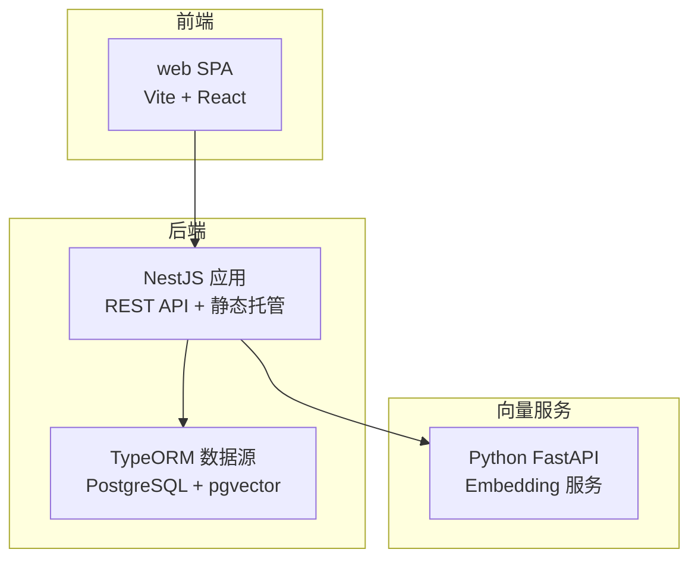
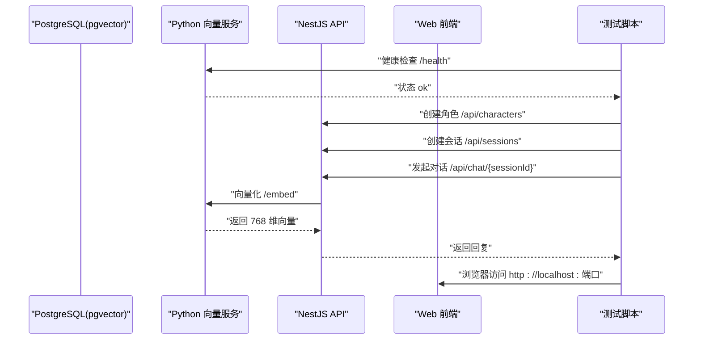
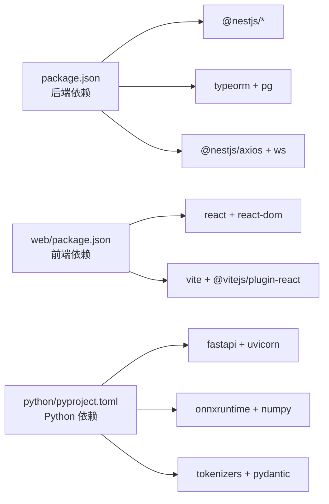

# 快速开始

<cite>
**本文引用的文件**
- [README.md](file://README.md)
- [package.json](file://package.json)
- [web/package.json](file://web/package.json)
- [src/main.ts](file://src/main.ts)
- [src/app.module.ts](file://src/app.module.ts)
- [src/config/database.config.ts](file://src/config/database.config.ts)
- [src/embedding/embedding.service.ts](file://src/embedding/embedding.service.ts)
- [python/pyproject.toml](file://python/pyproject.toml)
- [python/main.py](file://python/main.py)
- [python/embedder.py](file://python/embedder.py)
- [start.bat](file://start.bat)
- [test_chat.js](file://test_chat.js)
- [src/characters/characters.service.ts](file://src/characters/characters.service.ts)
- [src/chat/chat.service.ts](file://src/chat/chat.service.ts)
</cite>

## 目录
1. [简介](#简介)
2. [项目结构](#项目结构)
3. [核心组件](#核心组件)
4. [架构总览](#架构总览)
5. [详细组件分析](#详细组件分析)
6. [依赖分析](#依赖分析)
7. [性能考虑](#性能考虑)
8. [故障排除指南](#故障排除指南)
9. [结论](#结论)
10. [附录](#附录)

## 简介
本指南面向首次接触 AI Companion 的开发者与使用者，帮助你在最短时间内完成环境准备、依赖安装、数据库与向量服务配置，并启动后端、前端与 Python 向量服务，运行端到端聊天示例，体验创建角色、发起对话、记忆提取与滚动摘要等核心能力。

## 项目结构
项目采用“后端 NestJS + 前端 React/Vite + Python 向量服务”的分层架构：
- 后端：NestJS 应用，提供 REST API、静态资源托管、数据库迁移与连接管理。
- 前端：React + Vite，SPA 应用，通过 API 与后端交互。
- Python：FastAPI 向量服务，提供单条与批量文本向量化接口。
- 数据库：PostgreSQL + pgvector 扩展，用于存储角色、会话、消息、记忆等数据及向量索引。

图表来源
- [src/app.module.ts:18-63](file://src/app.module.ts#L18-L63)
- [src/config/database.config.ts:8-20](file://src/config/database.config.ts#L8-L20)
- [python/main.py:26-29](file://python/main.py#L26-L29)

章节来源
- [README.md:28-58](file://README.md#L28-L58)
- [src/app.module.ts:18-63](file://src/app.module.ts#L18-L63)
- [web/package.json:1-22](file://web/package.json#L1-22)

## 核心组件
- 后端入口与跨域配置：后端监听端口并启用 CORS，便于前后端联调。
- 数据库连接：通过 TypeORM DataSource 连接 PostgreSQL，默认端口可配置。
- 向量服务集成：后端通过 HTTP 调用 Python FastAPI 的 /embed 与 /batch_embed 接口。
- 前端静态托管：生产环境自动托管 web/dist，开发阶段由 Vite 代理 API。

章节来源
- [src/main.ts:4-21](file://src/main.ts#L4-L21)
- [src/config/database.config.ts:8-20](file://src/config/database.config.ts#L8-L20)
- [src/app.module.ts:32-50](file://src/app.module.ts#L32-L50)
- [src/embedding/embedding.service.ts:13-21](file://src/embedding/embedding.service.ts#L13-L21)

## 架构总览
下图展示了启动顺序与调用链路：数据库容器启动 → Python 向量服务启动 → NestJS 后端启动 → 前端开发服务器启动 → 端到端测试脚本验证。

图表来源
- [start.bat:6-20](file://start.bat#L6-L20)
- [python/main.py:115-122](file://python/main.py#L115-L122)
- [src/embedding/embedding.service.ts:33-65](file://src/embedding/embedding.service.ts#L33-L65)
- [test_chat.js:70-121](file://test_chat.js#L70-L121)

## 详细组件分析

### 后端服务（NestJS）
- 启动与端口：默认监听端口可由环境变量控制，开发时建议使用热更新模式。
- 静态资源：生产构建后自动托管 web/dist；开发阶段由 Vite 代理 API。
- 数据库：TypeORM 初始化 PostgreSQL 连接，自动运行 pgvector 初始化迁移。
- 模块组织：角色、会话、消息、聊天、嵌入、记忆、记录导入等模块按领域划分。

章节来源
- [src/main.ts:15-20](file://src/main.ts#L15-L20)
- [src/app.module.ts:23-30](file://src/app.module.ts#L23-L30)
- [src/app.module.ts:37-50](file://src/app.module.ts#L37-L50)

### 数据库与迁移
- 连接参数：host、port、username、password、database、logging 等均来自环境变量。
- 迁移：启动时自动执行 pgvector 初始化迁移，确保扩展与表结构就绪。
- 建议：生产环境禁止同步实体，使用迁移管理结构变更。

章节来源
- [src/config/database.config.ts:8-20](file://src/config/database.config.ts#L8-L20)
- [src/app.module.ts:47-48](file://src/app.module.ts#L47-L48)

### 向量服务（Python FastAPI）
- 职责：提供单条与批量文本向量化，输出 768 维浮点数组。
- 启动：使用 uvicorn 在指定端口启动，支持 mock 模式先行验证。
- 模型：默认使用 Jina v2 Base ZH 模型，可通过环境变量指定模型与分词器路径。
- 健康检查：/health 返回状态、mock 模式与维度信息。

章节来源
- [python/main.py:1-18](file://python/main.py#L1-L18)
- [python/main.py:115-122](file://python/main.py#L115-L122)
- [python/embedder.py:31-70](file://python/embedder.py#L31-L70)

### 嵌入服务（后端对接 Python）
- 单条向量：POST /embed，请求体包含 text 字段，返回 embedding 数组。
- 批量向量：POST /batch_embed，请求体为字符串数组，返回二维数组。
- 健康检查：GET /health，用于检测 Python 服务在线状态。
- 超时策略：单条推理 10 秒，批量推理 30 秒，避免阻塞。

章节来源
- [src/embedding/embedding.service.ts:33-65](file://src/embedding/embedding.service.ts#L33-L65)
- [src/embedding/embedding.service.ts:70-82](file://src/embedding/embedding.service.ts#L70-L82)

### 前端应用（React + Vite）
- 开发：Vite 提供热更新与代理，开发时可直接访问后端 API。
- 构建：打包后产物位于 web/dist，由后端静态模块托管。
- 交互：通过 web/src/api/index.ts 发起请求，实现角色、会话与聊天功能。

章节来源
- [web/package.json:5-9](file://web/package.json#L5-L9)

### 聊天与记忆（核心业务）
- 对话流程：保存用户消息 → 读取上下文 → 向量检索记忆 → 组装系统提示 → 调用 LLM → 保存 AI 回复 → 异步记忆提取与滚动摘要。
- 流式对话：SSE 实时推送回复片段，完成后统一清理与持久化。
- 记忆提取：从对话中抽取事实、偏好、情绪，向量化后去重写入 memory_chunks。
- 滚动摘要：达到阈值后生成摘要并重置计数。

章节来源
- [src/chat/chat.service.ts:42-113](file://src/chat/chat.service.ts#L42-L113)
- [src/chat/chat.service.ts:130-231](file://src/chat/chat.service.ts#L130-L231)
- [src/chat/chat.service.ts:249-315](file://src/chat/chat.service.ts#L249-L315)
- [src/chat/chat.service.ts:334-374](file://src/chat/chat.service.ts#L334-L374)

## 依赖分析
- 后端依赖：NestJS 核心、TypeORM、PostgreSQL 驱动、Axios、WS、Config、Serve-Static 等。
- 前端依赖：React、ReactDOM、Vite、React 插件等。
- Python 依赖：FastAPI、Uvicorn、ONNX Runtime、NumPy、Tokenizers、Pydantic、Hugging Face Hub 等。
- 迁移工具：TypeORM CLI，通过 npm 脚本调用。

图表来源
- [package.json:29-46](file://package.json#L29-L46)
- [web/package.json:10-20](file://web/package.json#L10-L20)
- [python/pyproject.toml:1-16](file://python/pyproject.toml#L1-L16)

章节来源
- [package.json:29-46](file://package.json#L29-L46)
- [web/package.json:10-20](file://web/package.json#L10-L20)
- [python/pyproject.toml:1-16](file://python/pyproject.toml#L1-L16)

## 性能考虑
- 向量服务批处理：批量推理可显著提升吞吐，减少模型调用开销。
- 超时控制：单条与批量推理分别设置合理超时，避免阻塞请求。
- 滚动摘要：定期生成摘要降低上下文长度，提高响应速度与稳定性。
- 数据库索引：确保向量字段建立 GIN/HNSW 等索引（由 pgvector 管理），优化检索性能。

## 故障排除指南
- 数据库无法连接
  - 检查数据库容器是否启动，确认 host/port/用户名/密码与 .env 一致。
  - 确认端口映射与防火墙放行。
- Python 向量服务未启动
  - 使用 mock 模式先行验证：设置环境变量或命令行参数进入 mock 模式。
  - 确认模型与分词器文件存在，或通过环境变量指向自定义路径。
- 健康检查失败
  - 后端嵌入服务会探测 /health，若失败需排查 Python 服务端口与网络连通性。
- 端到端测试失败
  - 确保 Python 与 NestJS 均在运行，按启动顺序逐一排查。
  - 检查会话 ID 是否正确传递，以及角色是否存在。

章节来源
- [python/main.py:35-51](file://python/main.py#L35-L51)
- [python/embedder.py:40-52](file://python/embedder.py#L40-L52)
- [src/embedding/embedding.service.ts:70-82](file://src/embedding/embedding.service.ts#L70-L82)
- [test_chat.js:124-129](file://test_chat.js#L124-L129)

## 结论
通过本指南，你可以完成从环境准备到应用运行的全流程。建议先以 mock 模式验证向量服务，再逐步接入真实模型与数据库，最后运行端到端测试脚本，体验完整的聊天与记忆能力。

## 附录

### 环境搭建与依赖安装
- Node.js 与后端依赖
  - 安装 Node.js（推荐 LTS 版本）。
  - 在项目根目录执行依赖安装，确保网络可访问 npm 源。
- 前端依赖
  - 在 web 目录执行依赖安装，用于本地开发与构建。
- Python 依赖
  - 进入 python 目录，使用 uv 或 pip 安装 pyproject.toml 中声明的依赖。
  - 如需使用 ONNX Runtime，请确保系统满足其运行要求。
- 数据库与 pgvector
  - 安装 PostgreSQL，确保服务可访问。
  - 在数据库中启用 pgvector 扩展（版本与兼容性需满足要求）。
  - 配置数据库连接参数（host、port、用户名、密码、数据库名）。

章节来源
- [README.md:28-32](file://README.md#L28-L32)
- [web/package.json:1-22](file://web/package.json#L1-L22)
- [python/pyproject.toml:1-16](file://python/pyproject.toml#L1-L16)
- [src/config/database.config.ts:8-20](file://src/config/database.config.ts#L8-L20)

### 环境变量配置
- 数据库连接
  - DB_HOST、DB_PORT、DB_USER、DB_PASSWORD、DB_NAME、DB_LOGGING
- 向量服务地址
  - PYTHON_EMBED_URL（默认 http://localhost:8000）
- 其他
  - PORT（后端监听端口，默认 3000）
  - 可选：EMBEDDING_MODEL_PATH、EMBEDDING_TOKENIZER_PATH、EMBEDDING_MAX_LENGTH

章节来源
- [src/config/database.config.ts:10-19](file://src/config/database.config.ts#L10-L19)
- [src/app.module.ts:40-49](file://src/app.module.ts#L40-L49)
- [src/embedding/embedding.service.ts:18-21](file://src/embedding/embedding.service.ts#L18-L21)
- [python/embedder.py:26-28](file://python/embedder.py#L26-L28)

### 启动顺序与本地开发
- 启动数据库容器（如使用 Docker），确保端口映射与权限正确。
- 启动 Python 向量服务（可先用 mock 模式验证）。
- 启动 NestJS 后端（开发模式自动热更新）。
- 启动前端开发服务器（Vite）。
- 运行端到端测试脚本，验证角色创建、会话创建与对话流程。

章节来源
- [start.bat:6-20](file://start.bat#L6-L20)
- [python/main.py:7-14](file://python/main.py#L7-L14)
- [src/main.ts:15-20](file://src/main.ts#L15-L20)
- [test_chat.js:8-12](file://test_chat.js#L8-L12)

### 基本使用示例
- 创建角色
  - 调用创建角色接口，传入唯一 id、名称与基础提示词。
- 创建会话
  - 指定角色 id 创建会话，获取会话 id。
- 发起对话
  - 向 /api/chat/{sessionId} 发送用户消息，接收 AI 回复。
- 查看效果
  - 前端界面实时显示消息列表与输入框；后台异步执行记忆提取与滚动摘要。

章节来源
- [src/characters/characters.service.ts:13-16](file://src/characters/characters.service.ts#L13-L16)
- [test_chat.js:70-121](file://test_chat.js#L70-L121)