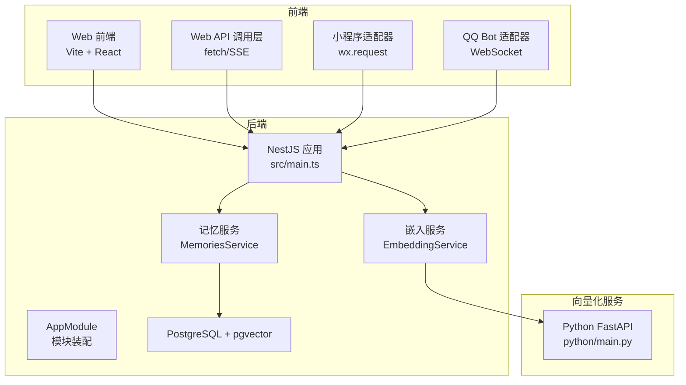
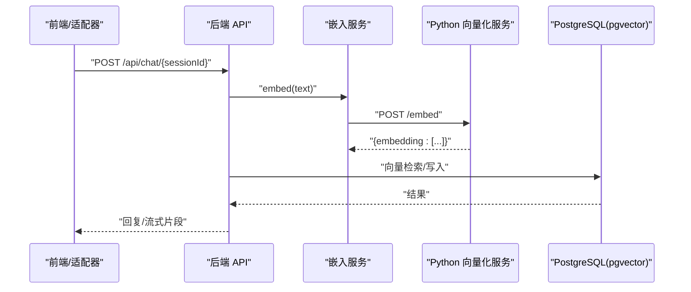
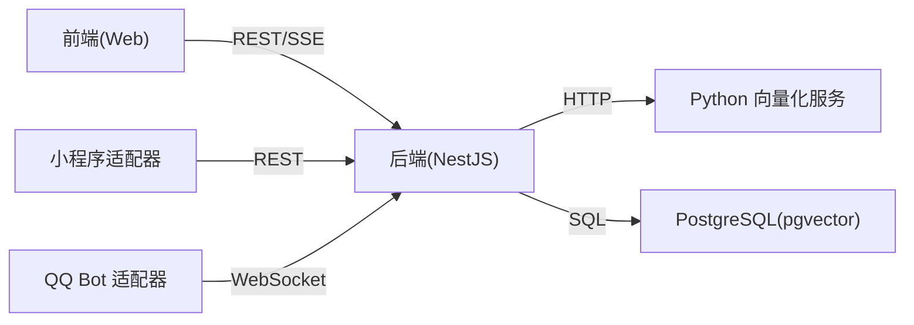

# 常见问题诊断

<cite>
**本文引用的文件**
- [README.md](file://README.md)
- [src/main.ts](file://src/main.ts)
- [src/app.module.ts](file://src/app.module.ts)
- [src/config/database.config.ts](file://src/config/database.config.ts)
- [src/embedding/embedding.service.ts](file://src/embedding/embedding.service.ts)
- [src/memories/memories.service.ts](file://src/memories/memories.service.ts)
- [python/main.py](file://python/main.py)
- [python/pyproject.toml](file://python/pyproject.toml)
- [web/package.json](file://web/package.json)
- [web/src/api/index.ts](file://web/src/api/index.ts)
- [adapters/miniprogram/api.js](file://adapters/miniprogram/api.js)
- [adapters/qq-bot/adapter.js](file://adapters/qq-bot/adapter.js)
</cite>

## 目录
1. [简介](#简介)
2. [项目结构](#项目结构)
3. [核心组件](#核心组件)
4. [架构总览](#架构总览)
5. [详细组件分析](#详细组件分析)
6. [依赖分析](#依赖分析)
7. [性能考虑](#性能考虑)
8. [故障排查指南](#故障排查指南)
9. [结论](#结论)
10. [附录](#附录)

## 简介
本指南面向运维与开发者，聚焦 AI Companion 系统中最常见的运行期问题，提供系统化诊断流程与快速定位方法。覆盖范围包括：
- 数据库连接失败与迁移异常
- API 密钥与鉴权相关问题
- 服务启动异常与端口占用
- 向量化服务（Python）中断与健康检查
- 前端应用与多平台适配器（小程序、QQ Bot）故障
- 紧急处置流程与预防建议

## 项目结构
系统采用前后端分离与多模块协作的架构：
- 后端：NestJS 应用，提供角色、会话、消息、聊天、记忆与导入等接口；集成 PostgreSQL 与 pgvector 向量扩展。
- 向量化服务：独立的 Python FastAPI 服务，提供单条与批量文本向量化。
- 前端：React/Vite 构建产物，通过静态资源服务对外提供。
- 适配器：小程序与 QQ Bot 的平台适配层。

**图表来源**
- [src/main.ts:1-22](file://src/main.ts#L1-L22)
- [src/app.module.ts:1-64](file://src/app.module.ts#L1-L64)
- [src/config/database.config.ts:1-22](file://src/config/database.config.ts#L1-L22)
- [src/embedding/embedding.service.ts:1-84](file://src/embedding/embedding.service.ts#L1-L84)
- [src/memories/memories.service.ts:1-138](file://src/memories/memories.service.ts#L1-L138)
- [python/main.py:1-123](file://python/main.py#L1-L123)
- [web/src/api/index.ts:1-212](file://web/src/api/index.ts#L1-L212)
- [adapters/miniprogram/api.js:1-83](file://adapters/miniprogram/api.js#L1-L83)
- [adapters/qq-bot/adapter.js:1-35](file://adapters/qq-bot/adapter.js#L1-L35)

**章节来源**
- [README.md:24-99](file://README.md#L24-L99)
- [src/main.ts:1-22](file://src/main.ts#L1-L22)
- [src/app.module.ts:1-64](file://src/app.module.ts#L1-L64)
- [src/config/database.config.ts:1-22](file://src/config/database.config.ts#L1-L22)
- [python/main.py:1-123](file://python/main.py#L1-L123)
- [web/package.json:1-22](file://web/package.json#L1-L22)

## 核心组件
- 后端主进程与端口监听：负责启动 NestJS 应用、CORS 配置与端口输出。
- 数据库配置：TypeORM 数据源，支持 .env 注入主机、端口、账号、密码、数据库名与日志开关。
- 嵌入服务：通过 HTTP 调用 Python 向量化服务，支持单条与批量嵌入，并内置健康检查。
- 记忆服务：基于原生 SQL 操作 pgvector 表，实现向量检索、去重与写入。
- 向量化服务：FastAPI 提供 /embed、/batch_embed、/health 接口，支持 mock 模式。
- 前端 API 层：统一的 fetch/SSE 封装，支持流式返回与错误处理。
- 平台适配器：小程序适配器将 fetch 替换为 wx.request；QQ Bot 适配器为 WebSocket 回调预留。

**章节来源**
- [src/main.ts:4-21](file://src/main.ts#L4-L21)
- [src/config/database.config.ts:8-20](file://src/config/database.config.ts#L8-L20)
- [src/app.module.ts:37-50](file://src/app.module.ts#L37-L50)
- [src/embedding/embedding.service.ts:14-83](file://src/embedding/embedding.service.ts#L14-L83)
- [src/memories/memories.service.ts:30-137](file://src/memories/memories.service.ts#L30-L137)
- [python/main.py:26-123](file://python/main.py#L26-L123)
- [web/src/api/index.ts:37-201](file://web/src/api/index.ts#L37-L201)
- [adapters/miniprogram/api.js:14-82](file://adapters/miniprogram/api.js#L14-L82)
- [adapters/qq-bot/adapter.js:14-34](file://adapters/qq-bot/adapter.js#L14-L34)

## 架构总览
系统数据流与交互要点：
- 前端通过 /api/* 发起请求，后端路由处理后调用业务服务。
- 记忆检索链路：前端 → 后端 → 嵌入服务 → Python 向量化服务 → 返回向量 → 后端检索 pgvector。
- 小程序与 QQ Bot 通过各自适配器对接后端 API。

**图表来源**
- [web/src/api/index.ts:137-201](file://web/src/api/index.ts#L137-L201)
- [src/embedding/embedding.service.ts:33-42](file://src/embedding/embedding.service.ts#L33-L42)
- [python/main.py:91-100](file://python/main.py#L91-L100)
- [src/memories/memories.service.ts:42-59](file://src/memories/memories.service.ts#L42-L59)

## 详细组件分析

### 数据库连接与迁移
- 关键点
  - 数据源配置来自 .env，字段包括主机、端口、用户名、密码、数据库名与日志开关。
  - 启动时自动运行迁移，确保 pgvector 扩展与表结构存在。
  - 生产环境禁止自动同步，避免删除向量列。
- 常见症状
  - 启动时报连接错误或迁移失败。
  - pgvector 表缺失或向量列被删除。
- 快速定位
  - 检查 .env 中 DB_* 变量是否正确。
  - 确认数据库服务可达且端口开放。
  - 查看 DB_LOGGING=true 时的 SQL 日志。

**章节来源**
- [src/config/database.config.ts:8-20](file://src/config/database.config.ts#L8-L20)
- [src/app.module.ts:37-50](file://src/app.module.ts#L37-L50)

### 嵌入服务（Python 向量化）
- 关键点
  - 通过 HTTP 调用 /embed、/batch_embed，支持 mock 模式。
  - 健康检查 /health 返回状态与维度信息。
- 常见症状
  - 后端调用超时或返回空向量。
  - 健康检查失败。
- 快速定位
  - 检查 PYTHON_EMBED_URL 是否指向正确地址。
  - 使用 /health 确认服务在线与维度正确。
  - 若模型未下载，启用 mock 模式验证流程。

**章节来源**
- [src/embedding/embedding.service.ts:18-83](file://src/embedding/embedding.service.ts#L18-L83)
- [python/main.py:33-71](file://python/main.py#L33-L71)
- [python/main.py:115-123](file://python/main.py#L115-L123)

### 记忆服务（pgvector 检索）
- 关键点
  - 使用原生 SQL 操作 VECTOR(768) 列，不依赖 TypeORM 实体。
  - 支持按相似度检索、去重与写入。
- 常见症状
  - 检索无结果或相似度异常。
  - 写入报错或重复数据未去重。
- 快速定位
  - 确认 pgvector 已安装并启用。
  - 检查索引是否存在与向量维度一致。
  - 核对 session_id 与阈值参数。

**章节来源**
- [src/memories/memories.service.ts:30-137](file://src/memories/memories.service.ts#L30-L137)

### 前端 API 层与流式处理
- 关键点
  - 统一的 fetch 封装，错误时抛出 ApiError。
  - SSE 流式解析 data: 片段，支持 [DONE] 结束标记。
- 常见症状
  - 网络错误、跨域失败、SSE 解析异常。
- 快速定位
  - 检查 BASE_URL 与代理配置（开发模式下 Vite 代理）。
  - 确认后端已开启 CORS 并允许凭据。

**章节来源**
- [web/src/api/index.ts:37-52](file://web/src/api/index.ts#L37-L52)
- [web/src/api/index.ts:137-201](file://web/src/api/index.ts#L137-L201)
- [src/main.ts:9-13](file://src/main.ts#L9-L13)

### 小程序适配器
- 关键点
  - 将 fetch 替换为 wx.request，不支持 SSE，使用同步版本替代。
  - 需在小程序后台配置服务器域名白名单。
- 常见症状
  - 网络请求失败或返回 HTTP 错误码。
- 快速定位
  - 检查 BASE_URL 与域名白名单。
  - 确认后端允许来自该域名的请求。

**章节来源**
- [adapters/miniprogram/api.js:12-33](file://adapters/miniprogram/api.js#L12-L33)
- [adapters/miniprogram/api.js:75-82](file://adapters/miniprogram/api.js#L75-L82)

### QQ Bot 适配器
- 关键点
  - 通过 WebSocket 接收用户消息，转发至后端 API，再回传给用户。
  - 需公网可访问与回调地址配置。
- 常见症状
  - WebSocket 连接失败或回调地址不可达。
- 快速定位
  - 检查公网 IP 与防火墙策略。
  - 确认 appId/token 配置正确。

**章节来源**
- [adapters/qq-bot/adapter.js:14-34](file://adapters/qq-bot/adapter.js#L14-L34)

## 依赖分析
- 后端依赖
  - TypeORM/PostgreSQL：数据持久化与迁移。
  - Axios/HttpService：HTTP 客户端调用 Python 向量化服务。
- 向量化服务依赖
  - FastAPI/Uvicorn：服务框架。
  - ONNX Runtime：模型推理。
- 前端依赖
  - React/Vite：构建与开发工具链。

**图表来源**
- [src/app.module.ts:37-50](file://src/app.module.ts#L37-L50)
- [src/embedding/embedding.service.ts:18-21](file://src/embedding/embedding.service.ts#L18-L21)
- [python/pyproject.toml:6-16](file://python/pyproject.toml#L6-L16)
- [web/package.json:10-20](file://web/package.json#L10-L20)

**章节来源**
- [src/app.module.ts:37-50](file://src/app.module.ts#L37-L50)
- [python/pyproject.toml:1-22](file://python/pyproject.toml#L1-L22)
- [web/package.json:1-22](file://web/package.json#L1-L22)

## 性能考虑
- 嵌入服务
  - 批量嵌入优于逐条调用，减少模型推理开销。
  - 设置合理超时（单条 10s，批量 30s）。
- pgvector
  - 确保索引存在并定期维护。
  - 控制检索 limit，避免全表扫描。
- 前端
  - SSE 流式传输提升交互体验，注意内存与解码缓冲区管理。

[本节为通用指导，无需列出章节来源]

## 故障排查指南

### 一、系统性排查流程
- 步骤 1：确认环境变量
  - 后端：DB_HOST/DB_PORT/DB_USER/DB_PASSWORD/DB_NAME/DB_LOGGING、PYTHON_EMBED_URL、PORT。
  - 向量化：MOCK_EMBEDDING（可选）。
- 步骤 2：验证依赖服务
  - 数据库：连接字符串正确，端口开放，pgvector 已安装。
  - 向量化服务：/health 可访问，维度为 768。
- 步骤 3：网络连通性
  - 后端与前端在同一网络内，跨域配置正确。
  - 平台适配器（小程序/QQ Bot）域名与回调地址可访问。

**章节来源**
- [src/config/database.config.ts:10-14](file://src/config/database.config.ts#L10-L14)
- [src/app.module.ts:40-44](file://src/app.module.ts#L40-L44)
- [src/embedding/embedding.service.ts:19](file://src/embedding/embedding.service.ts#L19)
- [python/main.py:115-123](file://python/main.py#L115-L123)

### 二、常见问题与诊断

#### 1. 数据库连接失败
- 症状
  - 启动时报连接错误或迁移失败。
- 诊断
  - 检查 .env 中 DB_* 变量与数据库服务状态。
  - 开启 DB_LOGGING=true 查看 SQL 日志。
- 处理
  - 修复连接参数或数据库服务。
  - 如需临时验证，使用最小化配置启动。

**章节来源**
- [src/config/database.config.ts:19](file://src/config/database.config.ts#L19)
- [src/app.module.ts:49](file://src/app.module.ts#L49)

#### 2. API 密钥与鉴权错误
- 现状
  - 代码中未发现显式的鉴权中间件或密钥校验逻辑。
- 建议
  - 在网关或拦截器中增加鉴权校验。
  - 对外部平台（如 QQ Bot）增加签名/Token 校验。

[本小节为通用建议，无需列出章节来源]

#### 3. 服务启动异常
- 症状
  - 端口占用导致启动失败。
- 诊断
  - 查看端口占用并更换 PORT。
  - 检查 CORS 配置是否允许来源。
- 处理
  - 修改端口或释放占用端口。
  - 生产环境限制 origin。

**章节来源**
- [src/main.ts:15-17](file://src/main.ts#L15-L17)
- [src/main.ts:9-13](file://src/main.ts#L9-L13)

#### 4. 向量化服务中断
- 症状
  - 嵌入服务超时或健康检查失败。
- 诊断
  - 检查 PYTHON_EMBED_URL 与端口。
  - 使用 /health 确认服务在线与维度。
  - 若模型未下载，启用 mock 模式验证流程。
- 处理
  - 启动 Python 服务或修复依赖。
  - 临时启用 MOCK_EMBEDDING=1。

**章节来源**
- [src/embedding/embedding.service.ts:19](file://src/embedding/embedding.service.ts#L19)
- [python/main.py:33-71](file://python/main.py#L33-L71)
- [python/main.py:115-123](file://python/main.py#L115-L123)

#### 5. 前端应用崩溃
- 症状
  - 页面空白、SSE 解析异常或跨域失败。
- 诊断
  - 检查 BASE_URL 与代理配置。
  - 确认后端 CORS 允许凭据。
- 处理
  - 修正代理或同源策略。
  - 修复跨域头与凭据设置。

**章节来源**
- [web/src/api/index.ts:30-31](file://web/src/api/index.ts#L30-L31)
- [web/src/api/index.ts:137-201](file://web/src/api/index.ts#L137-L201)
- [src/main.ts:9-13](file://src/main.ts#L9-L13)

#### 6. 多平台适配器失效
- 小程序
  - 症状：网络请求失败或不支持 SSE。
  - 诊断：检查 BASE_URL 与域名白名单。
- QQ Bot
  - 症状：WebSocket 连接失败。
  - 诊断：确认公网可访问与 appId/token。

**章节来源**
- [adapters/miniprogram/api.js:12-33](file://adapters/miniprogram/api.js#L12-L33)
- [adapters/qq-bot/adapter.js:14-34](file://adapters/qq-bot/adapter.js#L14-L34)

### 三、快速定位方法
- 日志级别
  - 启用 DB_LOGGING=true 查看 SQL。
  - 后端默认日志输出端口信息。
- 错误码识别
  - 前端统一抛出 ApiError，包含 message 与 HTTP 状态。
- 堆栈跟踪
  - 后端异常默认输出到控制台，结合日志定位。

**章节来源**
- [src/config/database.config.ts:19](file://src/config/database.config.ts#L19)
- [src/main.ts:17-19](file://src/main.ts#L17-L19)
- [web/src/api/index.ts:46-50](file://web/src/api/index.ts#L46-L50)

### 四、紧急处置流程
- 服务重启
  - 后端：重新启动 NestJS 进程。
  - 向量化：重启 Python FastAPI 服务。
- 配置回滚
  - 恢复 .env 至上一个稳定版本。
- 临时方案
  - 启用 MOCK_EMBEDDING=1 以绕过模型依赖。
  - 降低检索 limit 或关闭流式以缓解性能问题。

**章节来源**
- [python/main.py:33-41](file://python/main.py#L33-L41)
- [src/memories/memories.service.ts:46](file://src/memories/memories.service.ts#L46)

### 五、问题自检清单
- 环境变量
  - DB_HOST/DB_PORT/DB_USER/DB_PASSWORD/DB_NAME/DB_LOGGING
  - PYTHON_EMBED_URL
  - PORT
- 依赖服务
  - 数据库可连接、pgvector 已安装
  - 向量化服务 /health 正常
- 网络
  - CORS 允许来源与凭据
  - 平台域名白名单与回调地址可访问
- 前端
  - BASE_URL 与代理配置正确
  - SSE 解析与 [DONE] 处理正常

**章节来源**
- [src/config/database.config.ts:10-14](file://src/config/database.config.ts#L10-L14)
- [src/app.module.ts:40-44](file://src/app.module.ts#L40-L44)
- [src/embedding/embedding.service.ts:19](file://src/embedding/embedding.service.ts#L19)
- [python/main.py:115-123](file://python/main.py#L115-L123)
- [web/src/api/index.ts:30-31](file://web/src/api/index.ts#L30-L31)

### 六、预防措施
- 生产环境
  - 禁止 DB 自动同步，使用迁移管理。
  - 严格限制 CORS 与来源。
  - 为外部平台增加鉴权与限流。
- 运维
  - 健康检查自动化监控。
  - 日志分级与告警联动。
  - 定期备份数据库与模型文件。

**章节来源**
- [src/app.module.ts:46-48](file://src/app.module.ts#L46-L48)
- [src/main.ts:9-13](file://src/main.ts#L9-L13)

## 结论
通过上述系统化流程与组件级诊断方法，可快速定位并解决 AI Companion 的常见运行问题。建议在生产环境中完善鉴权、监控与备份机制，并持续优化向量化与检索性能。

[本节为总结，无需列出章节来源]

## 附录

### A. 关键端点与环境变量速查
- 端点
  - /api/*：后端 REST 接口
  - /embed、/batch_embed、/health：向量化服务
- 环境变量
  - DB_*：数据库连接
  - DB_LOGGING：SQL 日志开关
  - PYTHON_EMBED_URL：向量化服务地址
  - PORT：后端监听端口
  - MOCK_EMBEDDING：向量化服务 mock 模式

**章节来源**
- [src/config/database.config.ts:10-19](file://src/config/database.config.ts#L10-L19)
- [src/app.module.ts:40-49](file://src/app.module.ts#L40-L49)
- [src/embedding/embedding.service.ts:19](file://src/embedding/embedding.service.ts#L19)
- [python/main.py:115-123](file://python/main.py#L115-L123)