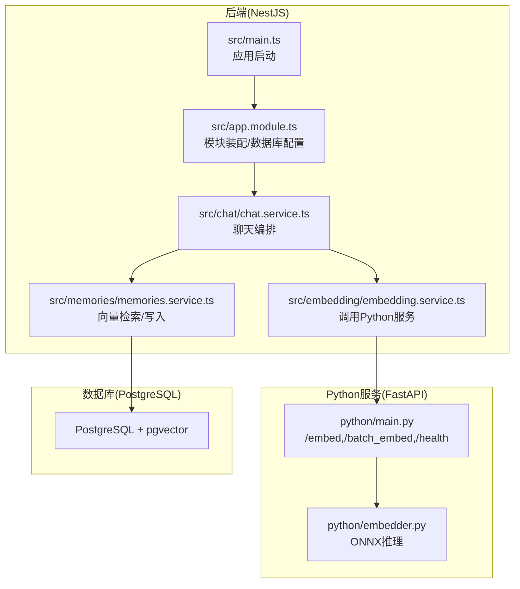
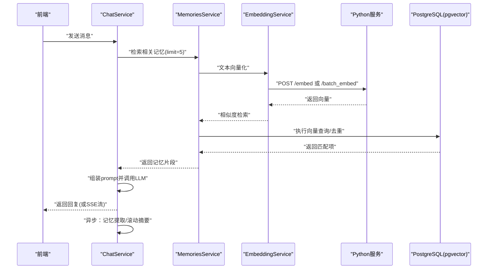
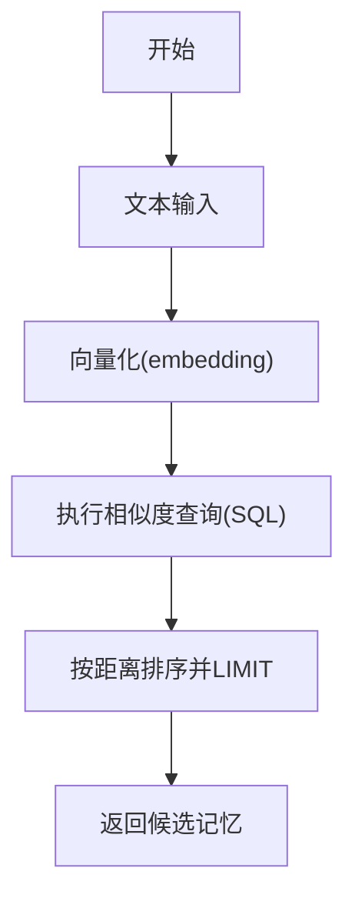
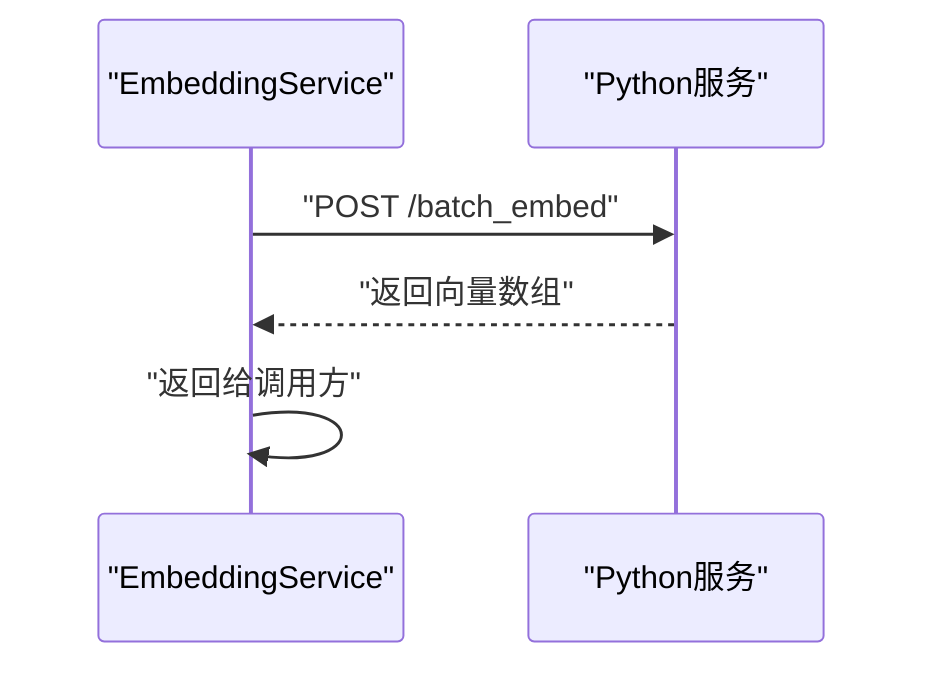
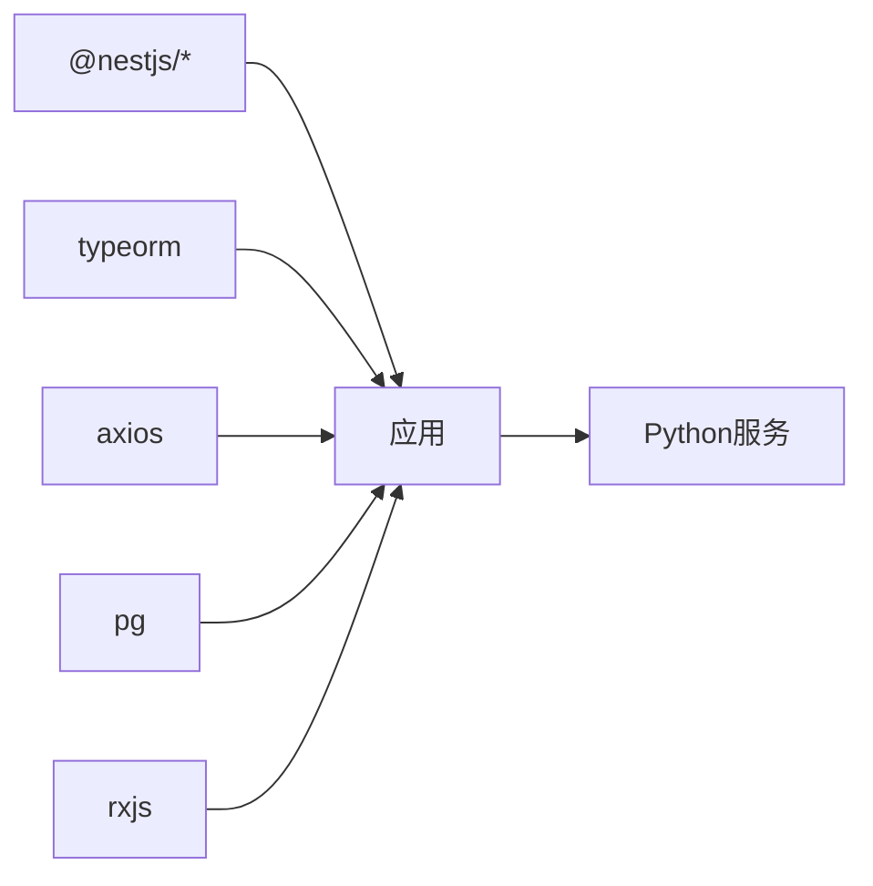
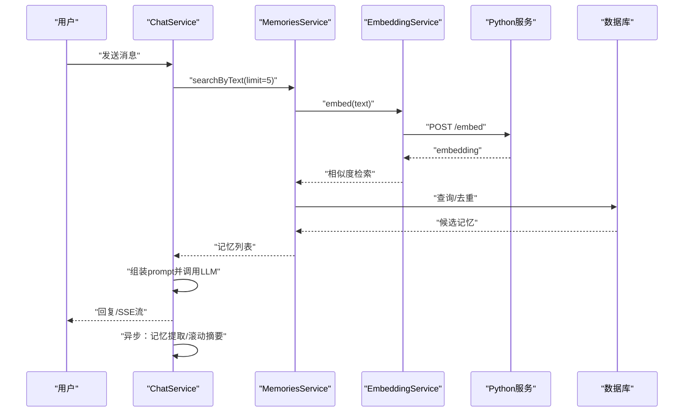

# 性能问题排查

<cite>
**本文引用的文件**
- [src/main.ts](file://src/main.ts)
- [src/app.module.ts](file://src/app.module.ts)
- [src/config/database.config.ts](file://src/config/database.config.ts)
- [src/embedding/embedding.service.ts](file://src/embedding/embedding.service.ts)
- [src/memories/memories.service.ts](file://src/memories/memories.service.ts)
- [src/chat/chat.service.ts](file://src/chat/chat.service.ts)
- [python/main.py](file://python/main.py)
- [python/embedder.py](file://python/embedder.py)
- [package.json](file://package.json)
</cite>

## 目录
1. [简介](#简介)
2. [项目结构](#项目结构)
3. [核心组件](#核心组件)
4. [架构总览](#架构总览)
5. [详细组件分析](#详细组件分析)
6. [依赖分析](#依赖分析)
7. [性能考虑](#性能考虑)
8. [故障排查指南](#故障排查指南)
9. [结论](#结论)
10. [附录](#附录)

## 简介
本指南面向AI Companion项目的运维与开发团队，聚焦系统性能问题的诊断与优化，覆盖数据库查询、API响应、内存/CPU占用、前端渲染等维度。文档基于仓库现有实现，结合组件职责与调用链路，给出可落地的监控手段、瓶颈定位方法、优化策略与压测建议。

## 项目结构
系统采用前后端分离与微服务化思路：
- 后端（NestJS）：统一入口、路由编排、数据库访问、外部服务调用（Python向量化服务）。
- Python服务（FastAPI）：文本向量化（ONNX推理），提供/embed与/batch_embed接口。
- 前端（React/Vite）：SPA，由NestJS ServeStaticModule在生产环境托管。

图表来源
- [src/main.ts:1-22](file://src/main.ts#L1-L22)
- [src/app.module.ts:18-64](file://src/app.module.ts#L18-L64)
- [src/chat/chat.service.ts:30-113](file://src/chat/chat.service.ts#L30-L113)
- [src/memories/memories.service.ts:29-137](file://src/memories/memories.service.ts#L29-L137)
- [src/embedding/embedding.service.ts:13-83](file://src/embedding/embedding.service.ts#L13-L83)
- [python/main.py:26-123](file://python/main.py#L26-L123)
- [python/embedder.py:31-116](file://python/embedder.py#L31-L116)

章节来源
- [src/main.ts:1-22](file://src/main.ts#L1-L22)
- [src/app.module.ts:18-64](file://src/app.module.ts#L18-L64)

## 核心组件
- 应用启动与CORS：后端启动时启用CORS，便于前端与后端联调；生产环境需收紧来源白名单。
- 数据库配置：TypeORM连接PostgreSQL，迁移启用pgvector扩展与表结构；开发阶段可开启SQL日志辅助定位。
- 向量服务：嵌入服务通过HTTP调用Python FastAPI，支持单条与批量向量化，带超时控制与健康检查。
- 记忆检索：直接使用原生SQL进行向量相似度检索与去重，利用pgvector的HNSW索引与余弦距离。
- 聊天编排：同步保存消息、检索记忆、组装prompt、调用LLM；异步触发记忆提取与滚动摘要。

章节来源
- [src/app.module.ts:37-50](file://src/app.module.ts#L37-L50)
- [src/embedding/embedding.service.ts:13-83](file://src/embedding/embedding.service.ts#L13-L83)
- [src/memories/memories.service.ts:29-137](file://src/memories/memories.service.ts#L29-L137)
- [src/chat/chat.service.ts:30-113](file://src/chat/chat.service.ts#L30-L113)

## 架构总览
下图展示一次典型聊天请求的端到端流程，包括同步与异步阶段，以及与Python服务和数据库的交互。

图表来源
- [src/chat/chat.service.ts:42-113](file://src/chat/chat.service.ts#L42-L113)
- [src/memories/memories.service.ts:42-118](file://src/memories/memories.service.ts#L42-L118)
- [src/embedding/embedding.service.ts:33-65](file://src/embedding/embedding.service.ts#L33-L65)
- [python/main.py:91-112](file://python/main.py#L91-L112)

## 详细组件分析

### 向量检索性能分析
- 查询路径：文本 → 向量化 → pgvector余弦距离排序 → 限行返回。
- 关键SQL与索引：使用向量距离运算符与HNSW索引，查询按距离排序并限制数量。
- 性能要点：
  - 确保pgvector扩展与索引已正确创建与迁移。
  - 控制检索limit，避免返回过多候选。
  - 批量向量化优于多次单条调用，减少网络与推理开销。

图表来源
- [src/memories/memories.service.ts:42-59](file://src/memories/memories.service.ts#L42-L59)
- [src/memories/memories.service.ts:115-118](file://src/memories/memories.service.ts#L115-L118)

章节来源
- [src/memories/memories.service.ts:29-137](file://src/memories/memories.service.ts#L29-L137)

### Python服务响应时间分析
- 接口：/embed（单条）、/batch_embed（批量）、/health（健康检查）。
- 超时与Mock：嵌入服务对单条推理设置10秒超时，批量30秒；Python服务支持MOCK模式用于快速验证。
- 性能要点：
  - 使用批量接口降低推理次数。
  - 在模型未准备完成时启用MOCK，保障端到端流程稳定。
  - 健康检查用于快速判断服务可用性。

图表来源
- [src/embedding/embedding.service.ts:56-65](file://src/embedding/embedding.service.ts#L56-L65)
- [python/main.py:103-112](file://python/main.py#L103-L112)

章节来源
- [src/embedding/embedding.service.ts:13-83](file://src/embedding/embedding.service.ts#L13-L83)
- [python/main.py:26-123](file://python/main.py#L26-L123)

### 前端渲染性能优化
- SPA架构：由NestJS ServeStaticModule在生产环境托管，开发阶段由Vite代理API。
- 建议：
  - 合理拆分组件，避免不必要的重渲染。
  - 对长列表使用虚拟滚动或分页。
  - 使用浏览器开发者工具的性能面板定位卡顿帧。

章节来源
- [src/app.module.ts:23-30](file://src/app.module.ts#L23-L30)
- [web/src/main.tsx:1-11](file://web/src/main.tsx#L1-L11)

## 依赖分析
- 后端依赖：NestJS、TypeORM、Axios、pg、rxjs等。
- Python依赖：FastAPI、ONNX Runtime、tokenizers等。
- 运行脚本：提供构建、开发、调试、迁移等命令。

图表来源
- [package.json:29-46](file://package.json#L29-L46)

章节来源
- [package.json:1-90](file://package.json#L1-L90)

## 性能考虑
- 数据库查询
  - 索引：确保memory_chunks的向量列与会话索引存在且生效。
  - 查询：限制返回数量，避免全表扫描。
  - 连接：合理配置连接池大小与超时，避免并发拥塞。
- API响应
  - 超时：嵌入服务已设置超时，建议在网关或反向代理层统一超时策略。
  - 缓存：对热点查询结果进行短期缓存（注意一致性）。
- 内存/CPU
  - Python服务：ONNX推理在CPU上运行，可通过批量提升吞吐；必要时评估GPU加速。
  - 后端：避免在请求路径中进行高复杂度计算，尽量异步化。
- 前端
  - 渲染：减少DOM层级，使用React.memo与key优化列表。
  - 网络：合并请求，避免重复拉取。

[本节为通用指导，无需特定文件引用]

## 故障排查指南

### 数据库查询缓慢
- 现象
  - 检索记忆耗时明显上升。
- 诊断步骤
  - 检查pgvector扩展与索引是否创建成功。
  - 开启数据库SQL日志（开发环境），观察查询计划与执行时间。
  - 分析慢查询：确认是否命中向量索引，LIMIT是否合理。
- 优化建议
  - 为向量列建立HNSW索引并选择合适的参数。
  - 控制检索上下文长度与返回条数。
  - 对频繁访问的数据进行归档或分区。

章节来源
- [src/config/database.config.ts:8-20](file://src/config/database.config.ts#L8-L20)
- [src/memories/memories.service.ts:42-59](file://src/memories/memories.service.ts#L42-L59)

### API响应延迟
- 现象
  - /chat接口整体延迟升高；SSE流式响应卡顿。
- 诊断步骤
  - 检查嵌入服务健康状态与超时配置。
  - 分段测量：消息保存、检索记忆、LLM调用、保存回复。
  - 观察Python服务的CPU与内存占用。
- 优化建议
  - 使用批量向量化接口。
  - 对LLM调用增加缓存与预热。
  - 异步处理非关键路径（记忆提取、滚动摘要）。

章节来源
- [src/embedding/embedding.service.ts:70-82](file://src/embedding/embedding.service.ts#L70-L82)
- [src/chat/chat.service.ts:119-231](file://src/chat/chat.service.ts#L119-L231)

### 内存使用过高
- 现象
  - 后端或Python服务内存持续增长。
- 诊断步骤
  - 使用进程级监控工具查看RSS与堆详情。
  - 检查是否存在未释放的Observable订阅或长生命周期对象。
- 优化建议
  - 限制一次性处理的消息/文本数量。
  - 对向量数组与中间结果及时释放。
  - Python侧避免重复加载模型与tokenizer。

章节来源
- [python/embedder.py:34-70](file://python/embedder.py#L34-L70)
- [src/chat/chat.service.ts:249-315](file://src/chat/chat.service.ts#L249-L315)

### CPU负载过重
- 现象
  - Python服务CPU飙升；后端线程阻塞。
- 诊断步骤
  - 分析CPU火焰图，定位热点函数。
  - 检查ONNX推理是否为瓶颈。
- 优化建议
  - 批量推理，减少调用次数。
  - 考虑GPU推理或模型量化。
  - 后端将非CPU密集型任务异步化。

章节来源
- [python/embedder.py:107-116](file://python/embedder.py#L107-L116)
- [src/embedding/embedding.service.ts:56-65](file://src/embedding/embedding.service.ts#L56-L65)

### 前端渲染性能问题
- 现象
  - 消息列表滚动卡顿；输入框延迟响应。
- 诊断步骤
  - 使用浏览器性能面板记录帧率与重排重绘。
  - 检查是否存在深层组件强制更新。
- 优化建议
  - 虚拟滚动/分页加载。
  - 合理使用React.memo与key。
  - 避免在渲染阶段进行昂贵计算。

章节来源
- [web/src/main.tsx:1-11](file://web/src/main.tsx#L1-L11)

### 性能监控工具使用
- 数据库性能分析
  - 开启SQL日志，定位慢查询。
  - 使用EXPLAIN/EXPLAIN ANALYZE分析查询计划。
- 系统资源监控
  - 使用top/htop、Windows任务管理器或Prometheus+Grafana。
- 应用性能监控
  - 后端：在关键路径添加日志埋点或接入APM（如自定义指标）。
  - Python：使用内置性能分析器或第三方工具。

章节来源
- [src/config/database.config.ts:19](file://src/config/database.config.ts#L19)
- [src/app.module.ts:49](file://src/app.module.ts#L49)

### 压力测试与负载测试
- 方法
  - 使用JMeter或Artillery对/chat接口进行并发压测。
  - 模拟SSE流式场景，关注首字节时间与吞吐。
- 基准测试
  - 固定输入规模，对比不同批大小、索引参数下的延迟与吞吐。
- 建议
  - 逐步加压，观察内存/CPU/IO拐点。
  - 记录P50/P95/P99延迟与错误率。

[本节为通用指导，无需特定文件引用]

### 性能优化策略
- 数据库
  - 索引优化：HNSW参数调优、复合索引。
  - 查询缓存：对低频、稳定检索结果做短期缓存。
- 连接池配置
  - 后端TypeORM连接池与数据库最大连接数平衡。
- 异步处理
  - 将记忆提取与滚动摘要放入异步队列或setImmediate之后执行。
- Python服务
  - 批量推理、模型预热、禁用不必要的日志。

章节来源
- [src/chat/chat.service.ts:100-111](file://src/chat/chat.service.ts#L100-L111)
- [src/embedding/embedding.service.ts:33-65](file://src/embedding/embedding.service.ts#L33-L65)

### 预防措施与最佳实践
- 环境隔离：开发/测试/生产分别配置日志级别与超时。
- 依赖管理：锁定Python依赖版本，定期更新pgvector与驱动。
- 监控告警：对延迟、错误率、资源使用设置阈值告警。
- 发布策略：灰度发布，逐步扩大流量，观察指标变化。

[本节为通用指导，无需特定文件引用]

## 结论
通过分层排查与针对性优化，可有效缓解AI Companion在高并发场景下的性能瓶颈。建议优先从数据库索引与查询限制、Python批量推理与缓存、后端异步化与前端渲染优化入手，配合完善的监控与压测体系，持续保障系统稳定与高性能。

[本节为总结性内容，无需特定文件引用]

## 附录

### 关键流程时序图（端到端聊天）

图表来源
- [src/chat/chat.service.ts:42-113](file://src/chat/chat.service.ts#L42-L113)
- [src/memories/memories.service.ts:115-118](file://src/memories/memories.service.ts#L115-L118)
- [src/embedding/embedding.service.ts:33-42](file://src/embedding/embedding.service.ts#L33-L42)
- [python/main.py:91-101](file://python/main.py#L91-L101)