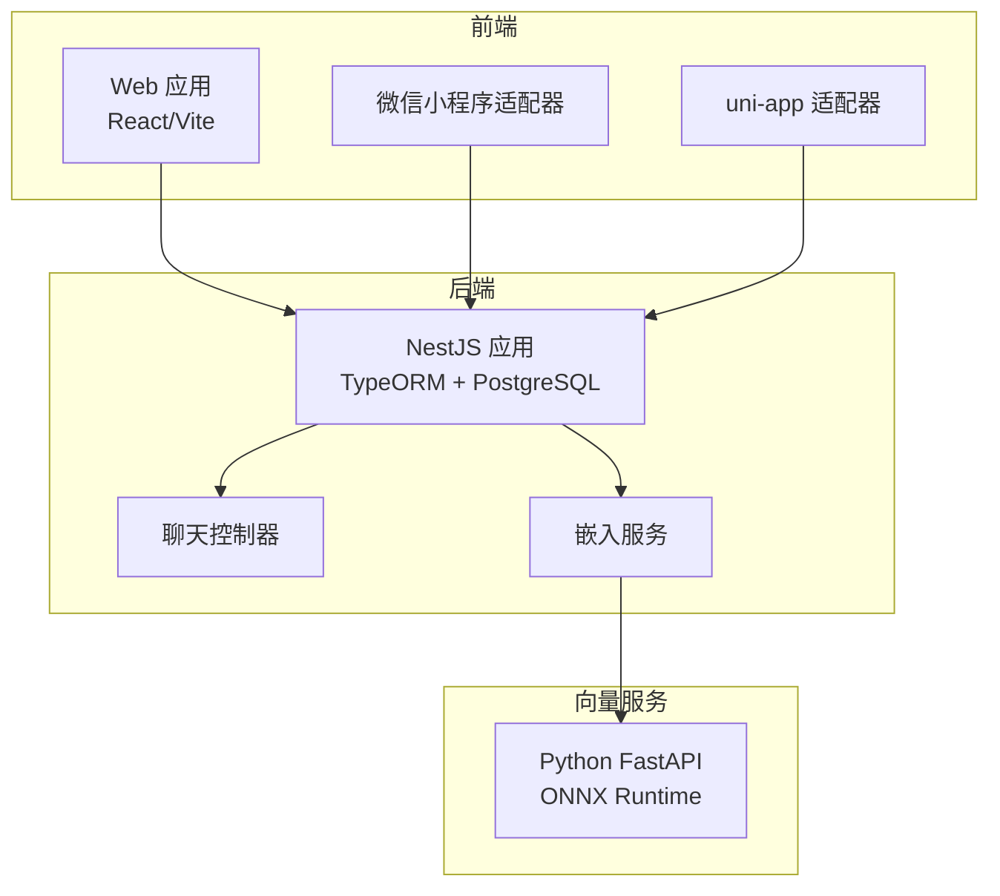
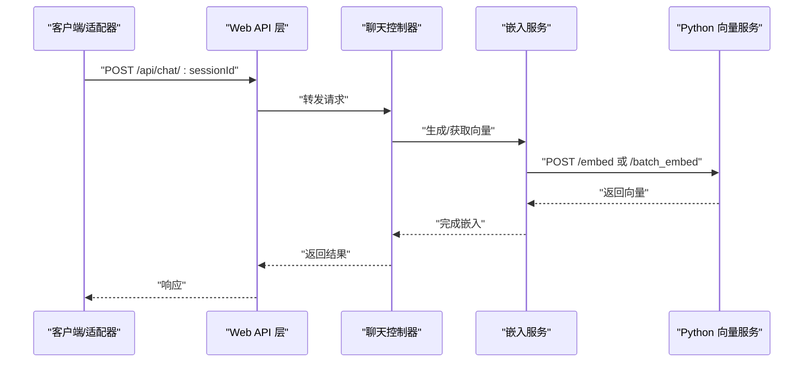
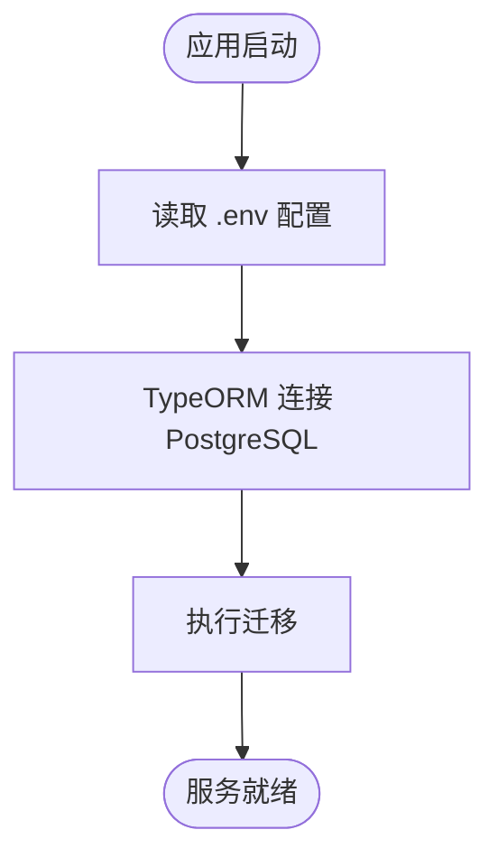
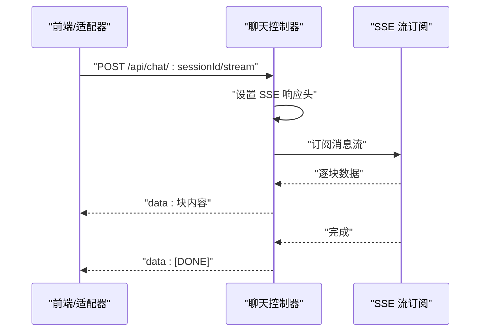
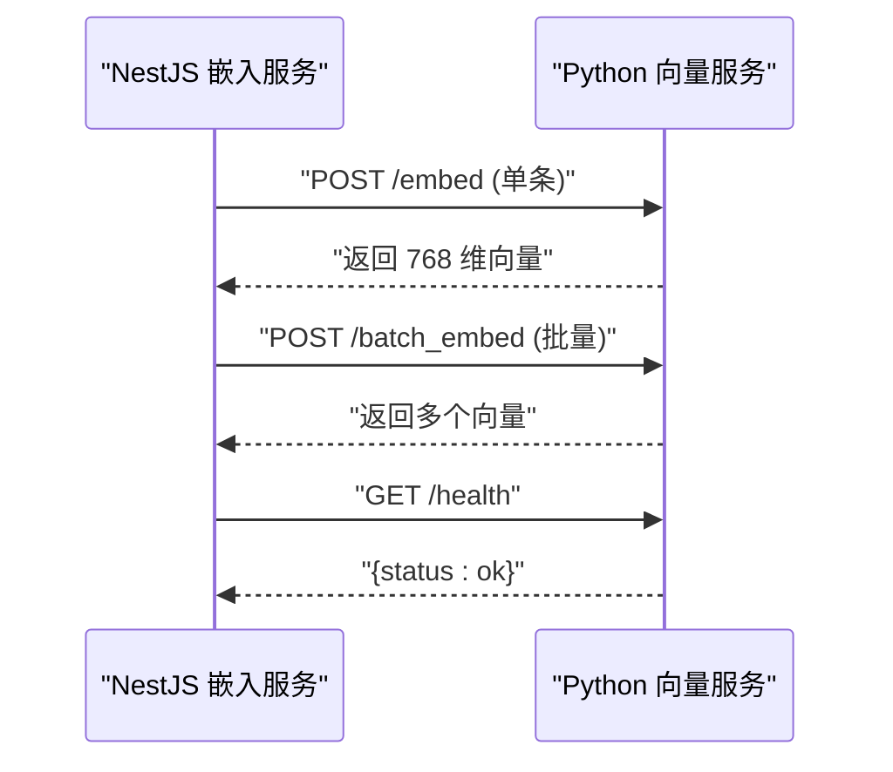
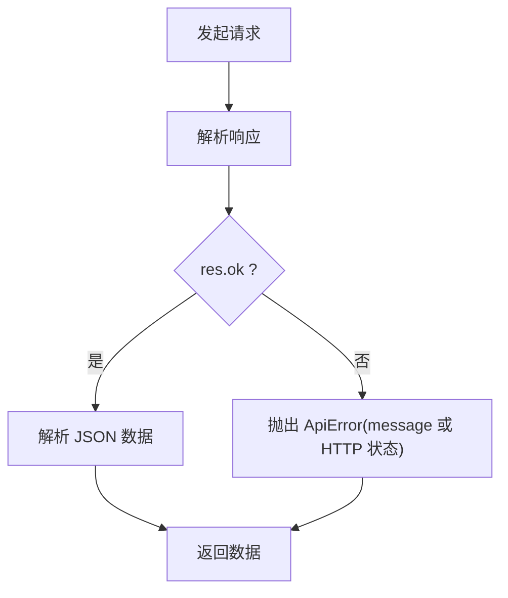
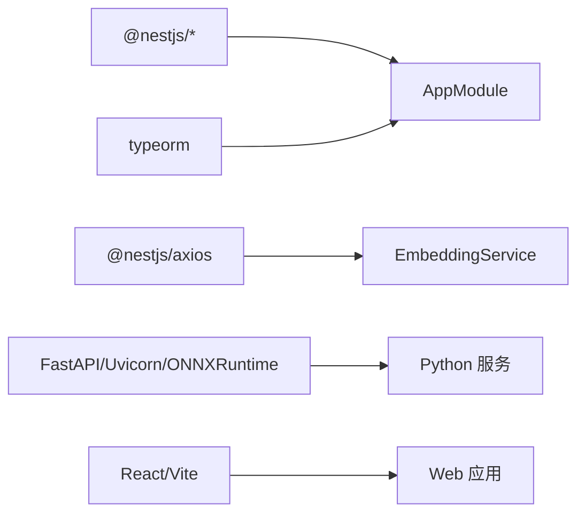

# 故障排除

<cite>
**本文引用的文件**
- [README.md](file://README.md)
- [package.json](file://package.json)
- [src/main.ts](file://src/main.ts)
- [src/app.module.ts](file://src/app.module.ts)
- [src/config/database.config.ts](file://src/config/database.config.ts)
- [src/chat/chat.controller.ts](file://src/chat/chat.controller.ts)
- [src/embedding/embedding.service.ts](file://src/embedding/embedding.service.ts)
- [web/src/api/index.ts](file://web/src/api/index.ts)
- [web/package.json](file://web/package.json)
- [python/main.py](file://python/main.py)
- [python/pyproject.toml](file://python/pyproject.toml)
- [adapters/miniprogram/api.js](file://adapters/miniprogram/api.js)
- [adapters/miniprogram/api-uni.js](file://adapters/miniprogram/api-uni.js)
- [adapters/qq-bot/adapter.js](file://adapters/qq-bot/adapter.js)
</cite>

## 目录
1. [简介](#简介)
2. [项目结构](#项目结构)
3. [核心组件](#核心组件)
4. [架构总览](#架构总览)
5. [详细组件分析](#详细组件分析)
6. [依赖分析](#依赖分析)
7. [性能考虑](#性能考虑)
8. [故障排除指南](#故障排除指南)
9. [结论](#结论)
10. [附录](#附录)

## 简介
本指南面向运维与开发人员，提供针对 AI Companion 的系统化故障排除方法。覆盖数据库连接、API 调用失败、性能问题、内存泄漏、网络问题、多平台适配器失效、错误日志解读与紧急处置流程。文档基于仓库中的实际实现进行分析，并给出可操作的排查步骤与优化建议。

## 项目结构
项目采用前后端分离与多平台适配的分层架构：
- 后端：NestJS 应用，提供 REST API 与静态资源服务，集成 PostgreSQL（含 pgvector 扩展迁移）。
- 前端：React/Vite 应用，通过统一 API 层访问后端；同时提供跨端适配器（微信小程序、uni-app、Telegram Bot 等）。
- Python 向量服务：独立 FastAPI 服务，提供文本向量化能力，被后端通过 HTTP 调用。
- 适配器：多平台适配层，屏蔽平台差异，统一调用后端 API。

图表来源
- [src/app.module.ts:18-63](file://src/app.module.ts#L18-L63)
- [src/chat/chat.controller.ts:16-76](file://src/chat/chat.controller.ts#L16-L76)
- [src/embedding/embedding.service.ts:13-83](file://src/embedding/embedding.service.ts#L13-L83)
- [web/src/api/index.ts:30-211](file://web/src/api/index.ts#L30-L211)
- [python/main.py:26-122](file://python/main.py#L26-L122)

章节来源
- [src/app.module.ts:18-63](file://src/app.module.ts#L18-L63)
- [web/package.json:1-22](file://web/package.json#L1-L22)
- [package.json:1-90](file://package.json#L1-L90)

## 核心组件
- 后端主入口与 CORS 配置：负责应用启动、CORS 允许来源、监听端口与日志输出。
- 数据库配置与迁移：TypeORM 连接 PostgreSQL，启用迁移并禁止自动同步以保护向量列。
- 聊天控制器：提供同步与流式（SSE）两种聊天接口，支持长连接与断开处理。
- 嵌入服务：封装对 Python 向量服务的 HTTP 调用，包含单条与批量向量化、健康检查与超时控制。
- Web API 层：统一的前端 HTTP 请求封装，包含错误处理与 SSE 流式解析。
- Python 向量服务：提供 /embed、/batch_embed、/health 接口，支持 mock 模式与真实模型。
- 多平台适配器：微信小程序与 uni-app 适配器，分别针对平台特性进行降级与兼容。

章节来源
- [src/main.ts:4-21](file://src/main.ts#L4-L21)
- [src/app.module.ts:37-50](file://src/app.module.ts#L37-L50)
- [src/chat/chat.controller.ts:16-76](file://src/chat/chat.controller.ts#L16-L76)
- [src/embedding/embedding.service.ts:13-83](file://src/embedding/embedding.service.ts#L13-L83)
- [web/src/api/index.ts:37-52](file://web/src/api/index.ts#L37-L52)
- [python/main.py:91-122](file://python/main.py#L91-L122)
- [adapters/miniprogram/api.js:12-33](file://adapters/miniprogram/api.js#L12-L33)
- [adapters/miniprogram/api-uni.js:17-38](file://adapters/miniprogram/api-uni.js#L17-L38)

## 架构总览
后端通过 TypeORM 连接 PostgreSQL，承载角色、会话、消息、记忆等实体；聊天控制器负责接收用户消息并返回同步或流式响应；嵌入服务通过 HTTP 调用 Python 向量服务生成向量；前端通过统一 API 层访问后端；多平台适配器按平台特性替换底层网络请求。

图表来源
- [web/src/api/index.ts:118-123](file://web/src/api/index.ts#L118-L123)
- [src/chat/chat.controller.ts:21-27](file://src/chat/chat.controller.ts#L21-L27)
- [src/embedding/embedding.service.ts:33-42](file://src/embedding/embedding.service.ts#L33-L42)
- [python/main.py:91-112](file://python/main.py#L91-L112)

## 详细组件分析

### 数据库连接与迁移
- 连接参数来自环境变量，类型为 PostgreSQL，启用迁移且禁止自动同步，确保 pgvector 扩展与向量列不受 TypeORM 影响。
- 启动时自动运行迁移，开发阶段可通过 CLI 工具管理迁移。

图表来源
- [src/app.module.ts:37-50](file://src/app.module.ts#L37-L50)
- [src/config/database.config.ts:8-20](file://src/config/database.config.ts#L8-L20)

章节来源
- [src/app.module.ts:37-50](file://src/app.module.ts#L37-L50)
- [src/config/database.config.ts:8-20](file://src/config/database.config.ts#L8-L20)

### 聊天控制器与流式响应
- 提供同步与流式两种聊天接口，流式模式使用 SSE，需正确设置响应头并禁用代理缓冲。
- 错误时写入错误数据并结束连接，完成时发送 [DONE] 标记。

图表来源
- [src/chat/chat.controller.ts:46-75](file://src/chat/chat.controller.ts#L46-L75)

章节来源
- [src/chat/chat.controller.ts:16-76](file://src/chat/chat.controller.ts#L16-L76)

### 嵌入服务与 Python 向量服务
- 嵌入服务封装对 Python FastAPI 的 HTTP 调用，支持单条与批量向量化，并内置健康检查与超时。
- Python 服务支持 mock 模式与真实模型，提供 /embed、/batch_embed、/health。

图表来源
- [src/embedding/embedding.service.ts:33-65](file://src/embedding/embedding.service.ts#L33-L65)
- [python/main.py:91-122](file://python/main.py#L91-L122)

章节来源
- [src/embedding/embedding.service.ts:13-83](file://src/embedding/embedding.service.ts#L13-L83)
- [python/main.py:91-122](file://python/main.py#L91-L122)

### Web API 层与错误处理
- 统一的 request 封装，对非 2xx 响应抛出带 message 的错误，便于前端捕获与展示。
- SSE 流式解析遵循 data: 格式，遇到 [DONE] 结束；异常时区分 AbortError 与其他错误。

图表来源
- [web/src/api/index.ts:37-52](file://web/src/api/index.ts#L37-L52)

章节来源
- [web/src/api/index.ts:37-52](file://web/src/api/index.ts#L37-L52)

### 多平台适配器
- 微信小程序适配器：使用 wx.request，不支持 SSE，降级为同步请求。
- uni-app 适配器：H5 下支持 SSE，小程序环境下降级为同步请求。

章节来源
- [adapters/miniprogram/api.js:12-33](file://adapters/miniprogram/api.js#L12-L33)
- [adapters/miniprogram/api-uni.js:17-38](file://adapters/miniprogram/api-uni.js#L17-L38)

## 依赖分析
- 后端依赖：NestJS、TypeORM、PostgreSQL、Axios/RxJS、WS 等。
- 前端依赖：React、Vite、TypeScript。
- Python 向量服务依赖：FastAPI、Uvicorn、ONNX Runtime、Hugging Face Hub 等。

图表来源
- [package.json:29-46](file://package.json#L29-L46)
- [web/package.json:10-20](file://web/package.json#L10-L20)
- [python/pyproject.toml:6-16](file://python/pyproject.toml#L6-L16)

章节来源
- [package.json:29-46](file://package.json#L29-L46)
- [web/package.json:10-20](file://web/package.json#L10-L20)
- [python/pyproject.toml:6-16](file://python/pyproject.toml#L6-L16)

## 性能考虑
- 数据库查询优化
  - 使用迁移而非自动同步，确保向量列与索引结构稳定。
  - 在生产环境开启必要的索引与查询计划分析。
- 缓存策略
  - 对热点角色与会话元数据进行缓存，减少重复查询。
  - 控制嵌入结果缓存（需结合语义稳定性与更新频率）。
- 资源使用监控
  - 监控数据库连接池、慢查询与锁等待。
  - 监控 Python 向量服务的 CPU、内存与推理耗时。
- 嵌入服务超时与并发
  - 单条推理默认 10 秒，批量 30 秒，可根据硬件条件调整。
  - 批量嵌入通常优于逐条调用，提升吞吐。

章节来源
- [src/app.module.ts:46-48](file://src/app.module.ts#L46-L48)
- [src/embedding/embedding.service.ts:38-61](file://src/embedding/embedding.service.ts#L38-L61)

## 故障排除指南

### 一、数据库连接问题
- 症状
  - 启动时报连接失败、迁移无法执行、查询超时。
- 诊断步骤
  - 检查环境变量 DB_HOST/DB_PORT/DB_USER/DB_PASSWORD/DB_NAME 是否正确。
  - 确认 PostgreSQL 服务可达，端口开放，pgvector 扩展已安装。
  - 查看 TypeORM 日志开关 DB_LOGGING 是否开启以便定位 SQL。
  - 使用 CLI 工具手动运行迁移验证。
- 解决方法
  - 修正 .env 中的数据库连接参数。
  - 在容器或云环境中配置安全组与内网访问。
  - 如需本地调试，确认 Docker Compose/服务状态。
- 相关文件
  - [src/app.module.ts:37-50](file://src/app.module.ts#L37-L50)
  - [src/config/database.config.ts:8-20](file://src/config/database.config.ts#L8-L20)
  - [package.json:24-27](file://package.json#L24-L27)

章节来源
- [src/app.module.ts:37-50](file://src/app.module.ts#L37-L50)
- [src/config/database.config.ts:8-20](file://src/config/database.config.ts#L8-L20)
- [package.json:24-27](file://package.json#L24-L27)

### 二、API 调用失败
- 症状
  - 前端/适配器报错“HTTP 4xx/5xx”、“网络错误”、“SSE 断开”。
- 诊断步骤
  - 检查后端 CORS 配置与来源白名单，开发阶段允许任意来源，生产需精确配置。
  - 确认 /api 前缀路由是否正确，静态资源是否正确提供。
  - 检查 Web API 层的错误处理逻辑，关注 message 字段与状态码。
  - 对于流式接口，确认代理（如 Nginx）未缓冲，SSE 头设置正确。
- 解决方法
  - 修正 CORS 与静态资源 serveRoot。
  - 修复前端 BASE_URL 与路由拼接。
  - 适配器中替换 fetch 为平台原生请求（如 wx.request），并处理非 2xx。
- 相关文件
  - [src/main.ts:9-13](file://src/main.ts#L9-L13)
  - [web/src/api/index.ts:37-52](file://web/src/api/index.ts#L37-L52)
  - [src/chat/chat.controller.ts:52-57](file://src/chat/chat.controller.ts#L52-L57)

章节来源
- [src/main.ts:9-13](file://src/main.ts#L9-L13)
- [web/src/api/index.ts:37-52](file://web/src/api/index.ts#L37-L52)
- [src/chat/chat.controller.ts:52-57](file://src/chat/chat.controller.ts#L52-L57)

### 三、Python 向量服务中断
- 症状
  - 嵌入服务健康检查失败、/embed 或 /batch_embed 超时或报错。
- 诊断步骤
  - 检查 PYTHON_EMBED_URL 是否正确，默认 http://localhost:8000。
  - 访问 /health 确认服务状态与维度信息。
  - 若模型未下载，使用 mock 模式先行验证流程。
- 解决方法
  - 启动 Python 服务并确保端口开放。
  - 正式部署时移除 mock 模式，下载并加载 ONNX 模型。
  - 调整嵌入服务超时时间以匹配硬件性能。
- 相关文件
  - [src/embedding/embedding.service.ts:18-21](file://src/embedding/embedding.service.ts#L18-L21)
  - [python/main.py:115-122](file://python/main.py#L115-L122)

章节来源
- [src/embedding/embedding.service.ts:18-21](file://src/embedding/embedding.service.ts#L18-L21)
- [python/main.py:115-122](file://python/main.py#L115-L122)

### 四、性能问题与内存泄漏
- 症状
  - 响应缓慢、CPU 占用高、内存持续增长。
- 诊断方法
  - 使用 Node.js 内置性能分析工具与外部 APM。
  - 分析数据库慢查询与连接池占用。
  - 监控 Python 服务的推理耗时与内存。
- 优化建议
  - 批量嵌入优先于逐条调用。
  - 合理设置超时与并发上限。
  - 对高频数据进行缓存与预热。
  - 定期重启服务以释放内存碎片。
- 相关文件
  - [src/embedding/embedding.service.ts:38-61](file://src/embedding/embedding.service.ts#L38-L61)

章节来源
- [src/embedding/embedding.service.ts:38-61](file://src/embedding/embedding.service.ts#L38-L61)

### 五、网络问题排查
- 症状
  - API 连接超时、跨域失败、代理配置导致 SSE 缓冲。
- 诊断步骤
  - 使用 curl/wget 验证 /api 与 /health 可达性。
  - 检查代理（Nginx/Traefik）是否禁用缓冲（X-Accel-Buffering）。
  - 确认防火墙放行端口与域名白名单。
- 解决方法
  - 在聊天控制器中正确设置 SSE 头并禁用缓冲。
  - 在生产环境配置反向代理与证书。
- 相关文件
  - [src/chat/chat.controller.ts:52-57](file://src/chat/chat.controller.ts#L52-L57)

章节来源
- [src/chat/chat.controller.ts:52-57](file://src/chat/chat.controller.ts#L52-L57)

### 六、多平台适配器失效
- 症状
  - 微信小程序无流式、uni-app 在小程序端降级为同步。
- 诊断步骤
  - 确认适配器中的 BASE_URL 与后端域名一致。
  - 检查平台网络权限与域名白名单配置。
- 解决方法
  - 微信小程序：使用同步版本替代流式，或在 H5 环境使用 uni-app。
  - uni-app：根据运行环境选择 SSE 或同步。
- 相关文件
  - [adapters/miniprogram/api.js:12-33](file://adapters/miniprogram/api.js#L12-L33)
  - [adapters/miniprogram/api-uni.js:17-38](file://adapters/miniprogram/api-uni.js#L17-L38)

章节来源
- [adapters/miniprogram/api.js:12-33](file://adapters/miniprogram/api.js#L12-L33)
- [adapters/miniprogram/api-uni.js:17-38](file://adapters/miniprogram/api-uni.js#L17-L38)

### 七、错误日志解读与追踪
- 错误码与含义
  - HTTP 4xx：请求参数错误、认证失败、资源不存在。
  - HTTP 5xx：后端内部错误、上游服务不可用。
- 堆栈跟踪分析
  - 后端：查看 NestJS 启动日志与 DB SQL 日志（DB_LOGGING=true）。
  - 前端：捕获 ApiError.message，结合网络面板定位失败请求。
  - Python：查看服务标准输出与日志级别。
- 上下文信息提取
  - 请求 ID/会话 ID、用户输入、时间戳、上游服务响应体。
- 相关文件
  - [web/src/api/index.ts:47-49](file://web/src/api/index.ts#L47-L49)
  - [src/app.module.ts](file://src/app.module.ts#L49)

章节来源
- [web/src/api/index.ts:47-49](file://web/src/api/index.ts#L47-L49)
- [src/app.module.ts](file://src/app.module.ts#L49)

### 八、紧急情况处理流程
- 服务降级
  - 关闭流式接口，改为同步响应；关闭非关键功能。
  - 临时启用 mock 嵌入服务，保证流程可用。
- 数据恢复
  - 使用迁移工具回滚到上一个稳定版本。
  - 备份数据库并在测试环境验证恢复。
- 系统回滚
  - 回退到上一个稳定镜像/版本，恢复静态资源与配置。
  - 逐步验证数据库迁移、Python 服务与前端构建产物。
- 相关文件
  - [package.json:24-27](file://package.json#L24-L27)
  - [python/main.py:37-41](file://python/main.py#L37-L41)

章节来源
- [package.json:24-27](file://package.json#L24-L27)
- [python/main.py:37-41](file://python/main.py#L37-L41)

### 九、社区支持与问题反馈
- 社区渠道
  - 文档与资源：参阅 README 中的官方文档、Discord 频道、课程与企业支持链接。
- 问题反馈
  - 提供最小可复现步骤、环境信息（Node/Nest/Python/数据库版本）、日志片段与截图。
- 相关文件
  - [README.md:73-84](file://README.md#L73-L84)

章节来源
- [README.md:73-84](file://README.md#L73-L84)

## 结论
通过系统化的故障排除流程、日志与性能分析方法以及多平台适配器的针对性处理，可快速定位并解决 AI Companion 的常见问题。建议在生产环境完善监控告警、定期演练回滚与灾难恢复，并保持依赖与模型的版本一致性。

## 附录
- 快速检查清单
  - 数据库：连接参数、扩展、迁移状态、SQL 日志。
  - 后端：CORS、静态资源、SSE 头、日志级别。
  - 嵌入服务：URL、超时、mock 状态、健康检查。
  - 前端：BASE_URL、错误处理、SSE 解析。
  - 适配器：平台 API、域名白名单、降级策略。
  - 网络：代理缓冲、防火墙、证书与域名。
  - 性能：批处理、缓存、超时与并发限制。