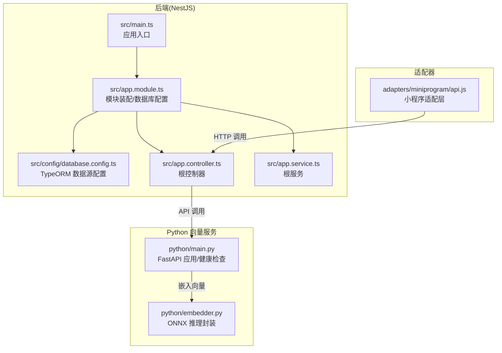
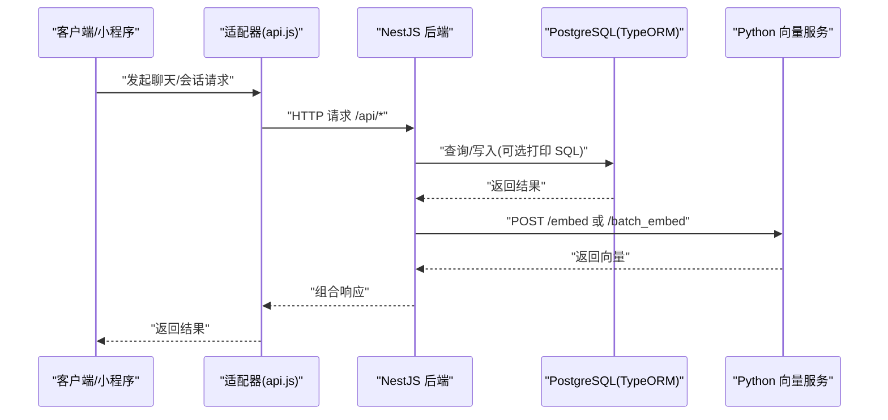
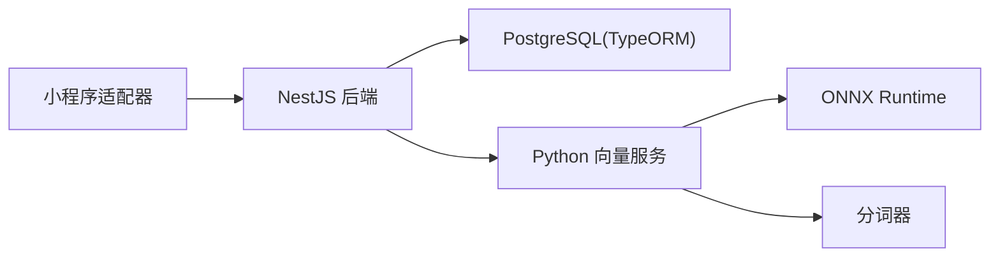

# 日志分析与调试

<cite>
**本文引用的文件**
- [src/main.ts](file://src/main.ts)
- [src/app.module.ts](file://src/app.module.ts)
- [src/config/database.config.ts](file://src/config/database.config.ts)
- [src/app.controller.ts](file://src/app.controller.ts)
- [src/app.service.ts](file://src/app.service.ts)
- [python/main.py](file://python/main.py)
- [python/embedder.py](file://python/embedder.py)
- [adapters/miniprogram/api.js](file://adapters/miniprogram/api.js)
- [docs/Learning_Notes.md](file://docs/Learning_Notes.md)
</cite>

## 目录
1. [简介](#简介)
2. [项目结构](#项目结构)
3. [核心组件](#核心组件)
4. [架构总览](#架构总览)
5. [详细组件分析](#详细组件分析)
6. [依赖分析](#依赖分析)
7. [性能考虑](#性能考虑)
8. [故障排查指南](#故障排查指南)
9. [结论](#结论)
10. [附录](#附录)

## 简介
本指南面向“AI Companion”项目的日志分析与调试，目标是帮助开发者快速定位问题、理解系统行为，并掌握在不同环境下的日志配置与采集策略。内容覆盖：
- 如何解读系统日志（错误码、堆栈跟踪、上下文信息）
- 各组件日志格式与关键信息（NestJS 后端、Python 向量服务、数据库、多平台适配器）
- 日志级别配置（开发/生产）
- 问题追踪方法（时间线、调用链、性能瓶颈）
- 调试工具使用（浏览器开发者工具、Node.js 调试器、Python 调试器）
- 日志收集与聚合最佳实践、远程调试与监控配置

## 项目结构
项目采用前后端分离与多模块组织：
- 后端（NestJS）：主应用入口、模块装配、数据库连接、静态资源服务
- Python 向量服务：FastAPI 提供文本向量化接口
- 多平台适配器：示例为微信小程序适配层
- 文档与笔记：包含环境变量、SQL 日志开关等运维要点

图表来源
- [src/main.ts:1-22](file://src/main.ts#L1-L22)
- [src/app.module.ts:18-62](file://src/app.module.ts#L18-L62)
- [src/config/database.config.ts:8-20](file://src/config/database.config.ts#L8-L20)
- [src/app.controller.ts:1-13](file://src/app.controller.ts#L1-L13)
- [src/app.service.ts:1-9](file://src/app.service.ts#L1-L9)
- [python/main.py:26-29](file://python/main.py#L26-L29)
- [python/embedder.py:31-70](file://python/embedder.py#L31-L70)
- [adapters/miniprogram/api.js:12-33](file://adapters/miniprogram/api.js#L12-L33)

章节来源
- [src/main.ts:1-22](file://src/main.ts#L1-L22)
- [src/app.module.ts:18-62](file://src/app.module.ts#L18-L62)
- [src/config/database.config.ts:8-20](file://src/config/database.config.ts#L8-L20)
- [python/main.py:26-29](file://python/main.py#L26-L29)
- [python/embedder.py:31-70](file://python/embedder.py#L31-L70)
- [adapters/miniprogram/api.js:12-33](file://adapters/miniprogram/api.js#L12-L33)

## 核心组件
- NestJS 应用入口与静态资源服务：负责启动 HTTP 服务、CORS 配置、静态页面提供
- 数据库连接与迁移：通过 TypeORM 连接 PostgreSQL，支持迁移与可选 SQL 日志
- Python 向量服务：FastAPI 提供单条/批量向量化接口，支持健康检查与假向量模式
- 多平台适配器：示例为小程序适配层，统一 API 调用风格

章节来源
- [src/main.ts:1-22](file://src/main.ts#L1-L22)
- [src/app.module.ts:18-62](file://src/app.module.ts#L18-L62)
- [src/config/database.config.ts:8-20](file://src/config/database.config.ts#L8-L20)
- [python/main.py:91-123](file://python/main.py#L91-L123)
- [python/embedder.py:31-116](file://python/embedder.py#L31-L116)
- [adapters/miniprogram/api.js:12-83](file://adapters/miniprogram/api.js#L12-L83)

## 架构总览
下图展示从客户端到后端再到向量服务的整体调用链路及日志关注点。

图表来源
- [adapters/miniprogram/api.js:14-33](file://adapters/miniprogram/api.js#L14-L33)
- [src/app.module.ts:37-50](file://src/app.module.ts#L37-L50)
- [python/main.py:91-123](file://python/main.py#L91-L123)

## 详细组件分析

### NestJS 后端日志与配置
- 应用入口与启动
  - 启动时输出运行信息与访问地址
  - 允许跨域访问（开发阶段）
- 静态资源与 SPA 回退
  - 生产环境提供 web/dist 静态资源，开发阶段由 Vite 代理
- 数据库连接与日志
  - TypeORM 连接参数来自环境变量
  - 通过环境变量控制是否打印 SQL 日志，便于开发调试

建议的日志关注点
- 启动阶段：端口、静态资源路径、数据库连接状态
- 请求阶段：路由命中、控制器处理耗时、数据库查询耗时
- 错误阶段：异常捕获、错误码与消息、堆栈跟踪

章节来源
- [src/main.ts:1-22](file://src/main.ts#L1-L22)
- [src/app.module.ts:18-62](file://src/app.module.ts#L18-L62)
- [src/config/database.config.ts:8-20](file://src/config/database.config.ts#L8-L20)
- [docs/Learning_Notes.md:882-898](file://docs/Learning_Notes.md#L882-L898)

### Python 向量服务日志与配置
- 应用与端点
  - FastAPI 应用定义标题与版本
  - 提供 /embed、/batch_embed、/health 三个端点
- 模型加载与假向量模式
  - 支持通过命令行参数或环境变量启用假向量模式
  - 健康检查返回 mock 状态与维度信息
- ONNX 推理封装
  - 初始化时打印模型与分词器加载状态
  - 输出输入节点名，便于验证推理输入

建议的日志关注点
- 模型加载：路径、输入节点、分词器状态
- 推理过程：批大小、池化与归一化
- 健康检查：状态、mock 模式、维度

章节来源
- [python/main.py:26-29](file://python/main.py#L26-L29)
- [python/main.py:33-71](file://python/main.py#L33-L71)
- [python/main.py:91-123](file://python/main.py#L91-L123)
- [python/embedder.py:31-70](file://python/embedder.py#L31-L70)
- [python/embedder.py:103-116](file://python/embedder.py#L103-L116)

### 数据库日志（TypeORM/PostgreSQL）
- 连接参数与迁移
  - 通过环境变量配置主机、端口、用户、密码、数据库名
  - 启动时自动运行迁移，禁止自动同步以保护向量列
- SQL 日志
  - 通过环境变量开启 SQL 日志，便于开发阶段观察 ORM 生成的 SQL

建议的日志关注点
- 连接阶段：DSN、迁移执行状态
- 查询阶段：慢查询阈值、重复查询、索引缺失
- 错误阶段：SQL 异常、权限不足、连接超时

章节来源
- [src/config/database.config.ts:8-20](file://src/config/database.config.ts#L8-L20)
- [src/app.module.ts:37-50](file://src/app.module.ts#L37-L50)
- [docs/Learning_Notes.md:882-898](file://docs/Learning_Notes.md#L882-L898)

### 多平台适配器日志（以小程序为例）
- 适配层职责
  - 将通用 API 调用替换为平台特定的网络请求
  - 对 HTTP 响应进行状态码判断与错误包装
- 流式回包降级
  - 小程序不支持 SSE，降级为一次性返回完整回复

建议的日志关注点
- 请求阶段：URL、方法、请求体
- 响应阶段：状态码、错误消息、失败原因
- 降级阶段：流式能力缺失提示、同步回包完整性

章节来源
- [adapters/miniprogram/api.js:12-33](file://adapters/miniprogram/api.js#L12-L33)
- [adapters/miniprogram/api.js:75-82](file://adapters/miniprogram/api.js#L75-L82)

## 依赖分析
- 组件耦合
  - 后端对数据库的依赖通过 TypeORM 管理
  - 后端对外部向量服务存在 HTTP 依赖
  - 适配器对后端 API 的依赖为纯 HTTP 调用
- 外部依赖
  - Python 向量服务依赖 ONNX Runtime 与分词器
  - 建议在容器中统一管理依赖版本

图表来源
- [src/app.module.ts:37-50](file://src/app.module.ts#L37-L50)
- [python/main.py:52-70](file://python/main.py#L52-L70)
- [python/embedder.py:54-63](file://python/embedder.py#L54-L63)
- [adapters/miniprogram/api.js:12-33](file://adapters/miniprogram/api.js#L12-L33)

## 性能考虑
- SQL 日志与性能
  - 开发阶段开启 SQL 日志有助于定位慢查询，但会带来额外 IO 与 CPU 开销，生产需关闭
- 向量服务性能
  - 批量推理优于单条推理，减少网络往返
  - 合理设置最大长度与批大小，避免内存峰值过高
- 网络与适配器
  - 小程序端禁用 SSE 会增加单次响应体积，建议在前端缓存与分页策略上优化

章节来源
- [docs/Learning_Notes.md:882-898](file://docs/Learning_Notes.md#L882-L898)
- [python/main.py:103-112](file://python/main.py#L103-L112)
- [adapters/miniprogram/api.js:75-82](file://adapters/miniprogram/api.js#L75-L82)

## 故障排查指南

### 如何解读系统日志
- 错误码与消息
  - HTTP 状态码：2xx 成功、4xx 客户端错误、5xx 服务端错误
  - 平台错误：小程序适配器将非 2xx 响应包装为错误对象
- 堆栈跟踪
  - 后端异常：结合控制器/服务层调用链定位
  - 向量服务异常：模型加载失败、输入形状不匹配、ONNX 推理错误
- 上下文信息
  - 请求 ID/Trace ID：建议在网关或中间件注入并贯穿全链路
  - 时间戳：用于时间线分析与性能对比
  - 关键参数：查询语句、输入文本、批大小

章节来源
- [adapters/miniprogram/api.js:22-31](file://adapters/miniprogram/api.js#L22-L31)

### 日志级别配置
- 开发环境
  - 开启数据库 SQL 日志，便于观察 ORM 行为
  - 启用详细日志输出，包含请求/响应细节
- 生产环境
  - 关闭 SQL 日志，降低开销
  - 使用结构化日志，按严重级别输出
  - 仅记录必要上下文，避免敏感信息泄露

章节来源
- [src/config/database.config.ts:19](file://src/config/database.config.ts#L19)
- [docs/Learning_Notes.md:882-898](file://docs/Learning_Notes.md#L882-L898)

### 问题追踪方法
- 时间线分析
  - 从前端到后端再到向量服务，按时间戳串联请求链
  - 识别延迟点：网络、数据库、推理
- 调用链追踪
  - 在 API 层添加请求 ID，贯穿数据库与外部服务
  - 记录关键步骤耗时，定位瓶颈
- 性能瓶颈识别
  - SQL 慢查询：结合 EXPLAIN 分析索引与扫描
  - 推理耗时：批大小、输入长度、设备算力
  - 网络抖动：重试策略与超时设置

章节来源
- [src/app.module.ts:37-50](file://src/app.module.ts#L37-L50)
- [python/main.py:103-112](file://python/main.py#L103-L112)

### 调试工具使用
- 浏览器开发者工具
  - Network 面板：查看请求/响应、SSE 断开、重定向
  - Console 面板：查看前端错误与日志
- Node.js 调试器
  - 使用断点调试后端控制器与服务层逻辑
  - 结合日志定位异常抛出位置
- Python 调试器
  - 在向量服务关键函数设置断点，检查输入形状与输出维度
  - 验证假向量模式与真实模型模式的行为差异

章节来源
- [src/app.controller.ts:1-13](file://src/app.controller.ts#L1-L13)
- [src/app.service.ts:1-9](file://src/app.service.ts#L1-L9)
- [python/embedder.py:103-116](file://python/embedder.py#L103-L116)

### 日志收集与聚合最佳实践
- 结构化日志
  - 使用 JSON 格式输出，包含时间戳、级别、模块、消息、上下文字段
- 分层采集
  - 应用层：NestJS、Python 服务
  - 基础设施层：数据库、Web 服务器
  - 平台层：小程序适配器
- 聚合与告警
  - 使用集中式日志系统（如 ELK/Fluent Bit/Loki+Grafana）
  - 设置错误率、P95 延迟等指标告警
- 远程调试与监控
  - 通过 SSH/VPN 进行远程登录与日志查看
  - 使用 APM 工具（如 NestJS 插件、OpenTelemetry）采集指标与追踪

章节来源
- [src/app.module.ts:37-50](file://src/app.module.ts#L37-L50)
- [python/main.py:91-123](file://python/main.py#L91-L123)

## 结论
通过明确各组件的日志格式与关键信息、合理配置日志级别、建立完善的日志采集与聚合体系，并结合浏览器、Node.js、Python 调试工具，可以高效完成问题定位与性能优化。生产环境应以结构化、低开销、可审计为目标，开发环境则以可观测性与可诊断性为核心。

## 附录

### 环境变量与配置要点
- 数据库相关
  - 主机、端口、用户、密码、数据库名
  - 是否开启 SQL 日志
- 向量服务相关
  - 向量服务地址
  - 假向量模式开关
- 应用相关
  - 端口、CORS 白名单、静态资源路径

章节来源
- [docs/Learning_Notes.md:261-270](file://docs/Learning_Notes.md#L261-L270)
- [src/config/database.config.ts:8-20](file://src/config/database.config.ts#L8-L20)
- [src/app.module.ts:37-50](file://src/app.module.ts#L37-L50)