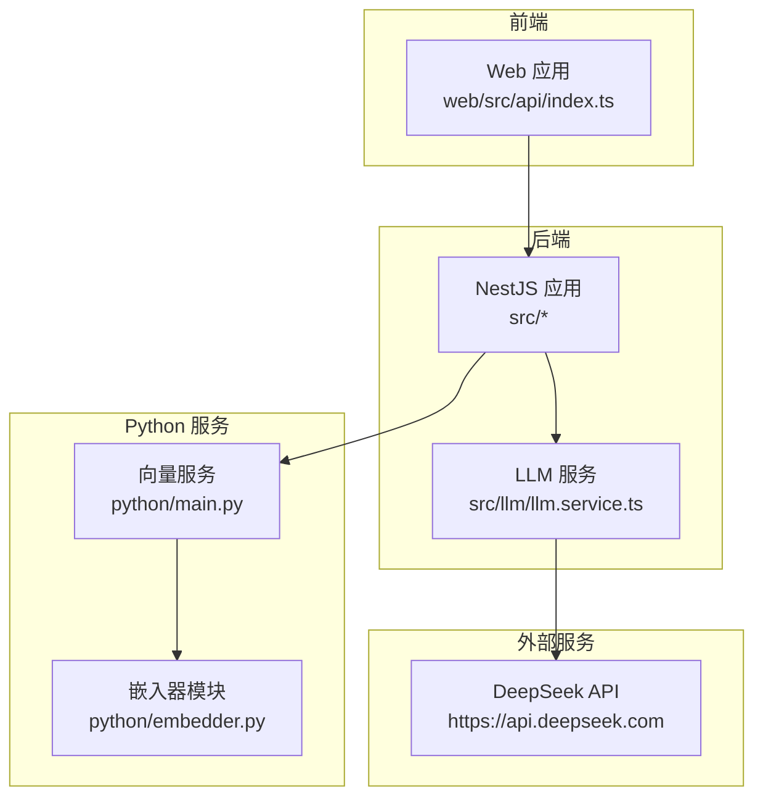
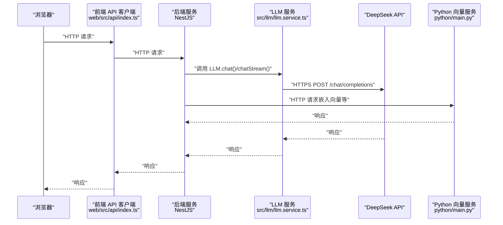
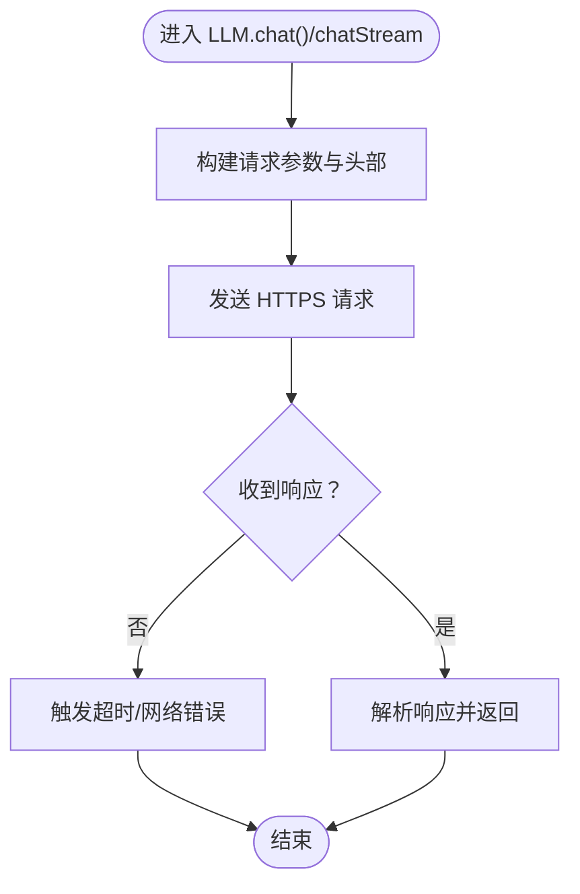
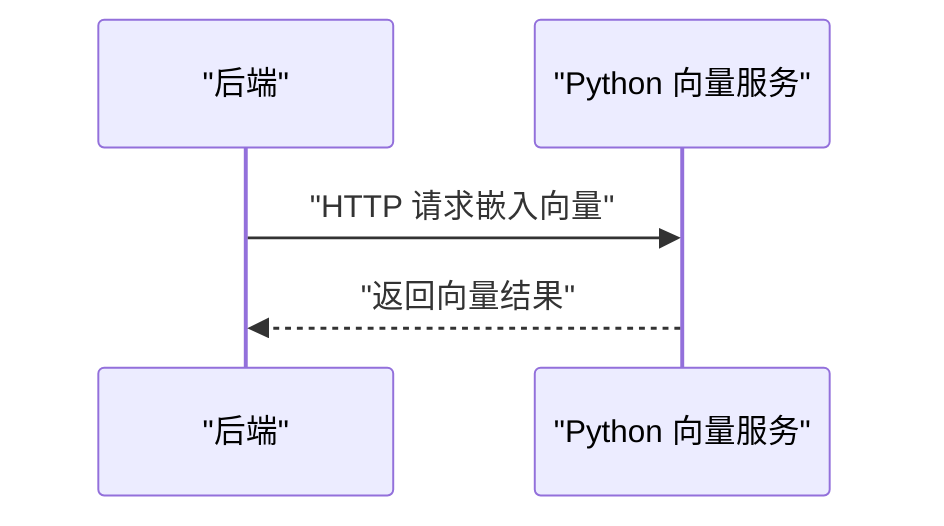
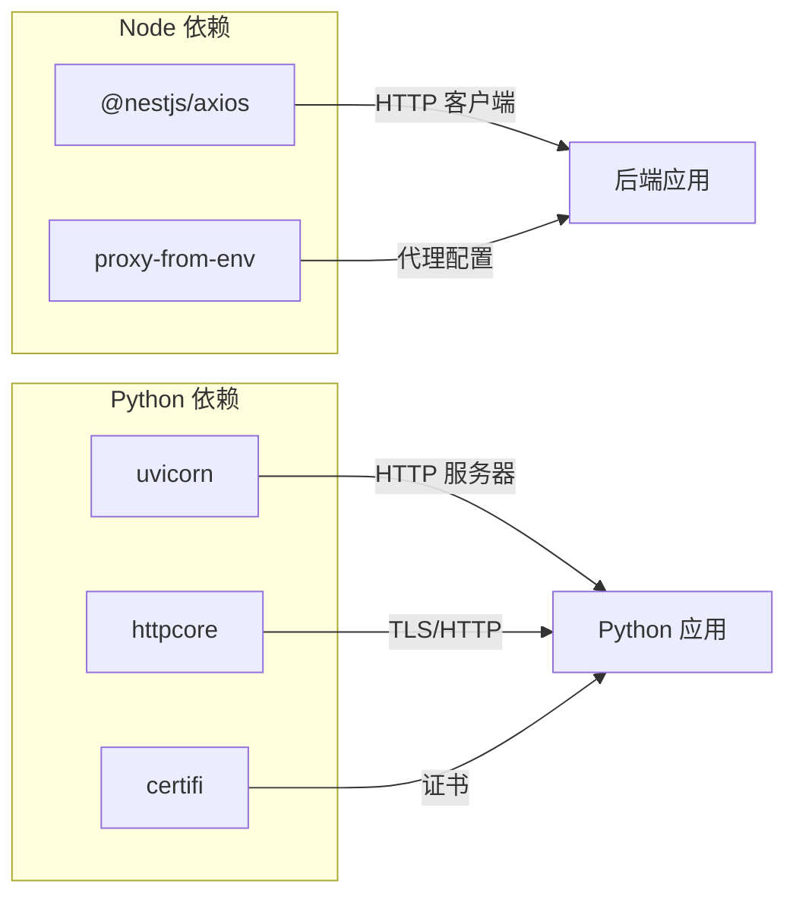

# 网络问题诊断

<cite>
**本文引用的文件**
- [llm.service.ts](file://src/llm/llm.service.ts)
- [test_chat.js](file://test_chat.js)
- [Learning_Notes.md](file://docs/Learning_Notes.md)
- [embedder.py](file://python/embedder.py)
- [main.py](file://python/main.py)
- [pyproject.toml](file://python/pyproject.toml)
- [uv.lock](file://python/uv.lock)
- [index.ts](file://web/src/api/index.ts)
- [api.js](file://adapters/miniprogram/api.js)
- [api-uni.js](file://adapters/miniprogram/api-uni.js)
- [adapter.js](file://adapters/qq-bot/adapter.js)
- [index.js](file://adapters/qq-bot/index.js)
- [package.json](file://package.json)
- [package-lock.json](file://package-lock.json)
</cite>

## 目录
1. [简介](#简介)
2. [项目结构](#项目结构)
3. [核心组件](#核心组件)
4. [架构总览](#架构总览)
5. [详细组件分析](#详细组件分析)
6. [依赖分析](#依赖分析)
7. [性能考量](#性能考量)
8. [故障排查指南](#故障排查指南)
9. [结论](#结论)
10. [附录](#附录)

## 简介
本指南面向“AI Companion”项目的网络问题诊断与解决，覆盖以下主题：
- API 连接超时、代理配置错误、防火墙阻断、DNS 解析失败的排查步骤
- 网络连通性测试方法：ping、端口扫描、HTTP 请求验证
- 不同组件的网络配置要求：DeepSeek API 连接、Python 向量服务通信、多平台适配器网络请求
- 代理与防火墙配置指南：企业网络环境下的特殊配置与安全策略
- SSL/TLS 证书问题诊断与 HTTPS 调试技巧
- 网络性能优化建议：连接池、超时、重试
- 使用网络监控工具进行问题定位：抓包与流量监控

## 项目结构
本项目由后端 NestJS 应用、前端 Web 应用、Python 向量服务与多平台适配器组成。网络相关的关键交互点包括：
- 后端通过 HTTP 客户端调用 DeepSeek API
- 前端通过 HTTP 客户端调用后端 API
- Python 服务提供嵌入向量能力，供后端调用
- 多平台适配器通过各自平台的网络接口发起请求

图表来源
- [llm.service.ts:1-98](file://src/llm/llm.service.ts#L1-L98)
- [index.ts](file://web/src/api/index.ts)
- [main.py](file://python/main.py)
- [embedder.py](file://python/embedder.py)

章节来源
- [llm.service.ts:1-98](file://src/llm/llm.service.ts#L1-L98)
- [test_chat.js:1-129](file://test_chat.js#L1-L129)
- [Learning_Notes.md:652-728](file://docs/Learning_Notes.md#L652-L728)

## 核心组件
- LLM 服务：封装 DeepSeek API 的调用，支持同步与流式响应，并内置超时控制
- 嵌入向量服务：Python Uvicorn 应用，提供向量嵌入能力
- 前端 API 客户端：统一管理后端 API 调用
- 多平台适配器：小程序与 QQ 机器人适配器，负责平台侧网络请求

章节来源
- [llm.service.ts:1-98](file://src/llm/llm.service.ts#L1-L98)
- [embedder.py](file://python/embedder.py)
- [main.py](file://python/main.py)
- [index.ts](file://web/src/api/index.ts)
- [api.js](file://adapters/miniprogram/api.js)
- [api-uni.js](file://adapters/miniprogram/api-uni.js)
- [adapter.js](file://adapters/qq-bot/adapter.js)
- [index.js](file://adapters/qq-bot/index.js)

## 架构总览
下图展示从浏览器到后端、再到 DeepSeek API 与 Python 服务的整体链路。

图表来源
- [llm.service.ts:1-98](file://src/llm/llm.service.ts#L1-L98)
- [index.ts](file://web/src/api/index.ts)
- [main.py](file://python/main.py)

## 详细组件分析

### LLM 服务（DeepSeek API）
- 功能要点
  - 提供同步与流式两种调用方式
  - 使用 HTTPS 访问 DeepSeek API
  - 内置超时控制（毫秒级）
  - 通过请求头携带认证信息
- 关键网络配置
  - 目标主机与路径：固定为 DeepSeek 的公开域名与路径
  - 端口：443（HTTPS）
  - 超时：毫秒级（需结合实际网络状况调整）
  - 认证：请求头携带 Bearer Token
- 常见问题定位
  - 超时：检查本地网络质量、代理设置、目标站点可达性
  - 认证失败：核对环境变量中的密钥是否正确
  - 流式响应：确认 Accept 头为流式格式

图表来源
- [llm.service.ts:36-98](file://src/llm/llm.service.ts#L36-L98)

章节来源
- [llm.service.ts:1-98](file://src/llm/llm.service.ts#L1-L98)

### 嵌入向量服务（Python Uvicorn）
- 功能要点
  - 提供向量嵌入能力，供后端调用
  - 使用标准 HTTP 接口
- 关键网络配置
  - 监听端口：默认 8000（可通过命令行参数或配置调整）
  - 超时与并发：由 Uvicorn 与业务逻辑共同决定
- 常见问题定位
  - 服务未启动：确认进程状态与端口占用
  - 跨域与代理：若置于反向代理后，需确保代理透传请求头
  - TLS：生产环境建议启用 HTTPS 并配置证书

图表来源
- [main.py](file://python/main.py)
- [embedder.py](file://python/embedder.py)

章节来源
- [main.py](file://python/main.py)
- [embedder.py](file://python/embedder.py)
- [pyproject.toml](file://python/pyproject.toml)
- [uv.lock:205-216](file://python/uv.lock#L205-L216)

### 前端 API 客户端
- 功能要点
  - 统一管理后端 API 调用，便于跨平台与适配器扩展
- 常见问题定位
  - CORS：若前端与后端端口不同，需确保后端允许跨域
  - 代理：开发阶段可使用 Vite/构建工具的代理功能
  - 编码：确保 UTF-8 传输，避免中文乱码

章节来源
- [index.ts](file://web/src/api/index.ts)

### 多平台适配器
- 小程序适配器
  - 通过平台提供的网络接口发起请求
  - 注意平台的网络限制与证书策略
- QQ 机器人适配器
  - 通过平台 API 发起请求
  - 注意平台的鉴权与速率限制

章节来源
- [api.js](file://adapters/miniprogram/api.js)
- [api-uni.js](file://adapters/miniprogram/api-uni.js)
- [adapter.js](file://adapters/qq-bot/adapter.js)
- [index.js](file://adapters/qq-bot/index.js)

## 依赖分析
- Node 生态中的网络相关依赖
  - 代理环境变量：支持从环境变量读取代理配置
  - HTTP/HTTPS 客户端：后端使用 @nestjs/axios；前端与测试脚本使用原生 HTTP 模块
- Python 生态中的网络相关依赖
  - Uvicorn：异步 HTTP 服务器
  - httpcore/certifi：TLS 与证书处理

图表来源
- [package.json](file://package.json)
- [package-lock.json:8485-8493](file://package-lock.json#L8485-L8493)
- [pyproject.toml](file://python/pyproject.toml)
- [uv.lock:205-216](file://python/uv.lock#L205-L216)

章节来源
- [package.json](file://package.json)
- [package-lock.json:8485-8493](file://package-lock.json#L8485-L8493)
- [pyproject.toml](file://python/pyproject.toml)
- [uv.lock:205-216](file://python/uv.lock#L205-L216)

## 性能考量
- 连接池与并发
  - 后端 HTTP 客户端默认行为取决于底层实现；如需自定义连接池，可在客户端层进行封装
  - Python Uvicorn 的并发模型基于事件循环，注意避免阻塞操作
- 超时设置
  - LLM 服务已内置超时；根据网络状况适当调整
  - 前端与适配器应设置合理的超时与重试策略
- 重试机制
  - 对于瞬时网络波动，建议在客户端层引入指数退避重试
- 流式响应
  - 利用流式接口降低首字延迟，提升用户体验

## 故障排查指南

### 通用排查步骤
- 端到端验证
  - 使用测试脚本验证后端 API 是否可用
  - 使用 curl 或浏览器开发者工具查看请求与响应
- DNS 与路由
  - 使用系统 ping/dig/nslookup 验证域名解析
  - 使用 traceroute/tracert 追踪路由路径
- 端口连通性
  - 使用 telnet/nmap 验证目标端口是否开放
- 代理与防火墙
  - 检查系统/IDE/终端的代理设置
  - 在企业网络中确认代理白名单与证书信任策略

章节来源
- [test_chat.js:1-129](file://test_chat.js#L1-L129)
- [Learning_Notes.md:652-728](file://docs/Learning_Notes.md#L652-L728)

### API 连接超时
- 症状
  - 请求长时间无响应或抛出超时异常
- 排查要点
  - 检查 LLM 服务的超时配置与网络质量
  - 确认 DeepSeek API 的可用性与限流策略
  - 在客户端增加重试与降级策略
- 优化建议
  - 为不同阶段设置不同的超时阈值
  - 引入熔断与快速失败机制

章节来源
- [llm.service.ts:36-57](file://src/llm/llm.service.ts#L36-L57)

### 代理配置错误
- 症状
  - 本地可访问公网，但应用无法访问特定域名
- 排查要点
  - 确认代理环境变量是否正确
  - 检查代理规则与目标域名匹配
  - 在企业网络中确认代理 CA 证书被系统信任
- 解决建议
  - 在开发环境使用系统代理或 IDE 代理插件
  - 在生产环境使用受信代理与证书

章节来源
- [package-lock.json:8485-8493](file://package-lock.json#L8485-L8493)

### 防火墙阻断
- 症状
  - 仅部分端口或域名可访问
- 排查要点
  - 使用端口扫描确认目标端口开放情况
  - 在防火墙策略中放行所需端口与域名
- 解决建议
  - 与 IT 部门协作，申请临时放行与长期白名单

章节来源
- [test_chat.js:1-129](file://test_chat.js#L1-L129)

### DNS 解析失败
- 症状
  - 无法通过域名访问，IP 直连正常
- 排查要点
  - 使用 nslookup/dig 检查解析结果
  - 更换 DNS 服务器（如 8.8.8.8）
- 解决建议
  - 在企业网络中配置内部 DNS 或 hosts 文件

章节来源
- [Learning_Notes.md:652-728](file://docs/Learning_Notes.md#L652-L728)

### SSL/TLS 证书问题
- 症状
  - HTTPS 请求报证书错误或握手失败
- 排查要点
  - 检查系统时间与时区
  - 验证证书链与中间证书是否完整
  - 在企业网络中确认代理 CA 证书被信任
- 解决建议
  - 更新系统证书库
  - 在 Python 侧使用受信证书或禁用严格校验（仅开发环境）

章节来源
- [uv.lock:205-216](file://python/uv.lock#L205-L216)

### HTTPS 连接调试
- 使用浏览器开发者工具查看网络面板
- 使用 openssl s_client 验证证书链
- 在后端开启详细日志以捕获 TLS 握手信息

章节来源
- [llm.service.ts:70-98](file://src/llm/llm.service.ts#L70-L98)

### 网络性能优化
- 连接池
  - 自定义 HTTP 客户端以复用连接
- 超时与重试
  - 为不同阶段设置超时阈值与指数退避重试
- 流式响应
  - 使用流式接口减少等待时间

章节来源
- [llm.service.ts:70-98](file://src/llm/llm.service.ts#L70-L98)

### 使用网络监控工具定位问题
- 抓包分析
  - 使用 Wireshark/Fiddler 抓取 HTTP/HTTPS 流量
  - 分析请求头、响应状态与证书信息
- 流量监控
  - 使用系统自带网络监视工具或第三方工具
  - 关注丢包率、RTT 与带宽利用率

## 结论
本指南提供了从组件到整体链路的网络问题诊断方法，涵盖超时、代理、防火墙、DNS 与证书等常见问题，并给出了性能优化与监控建议。建议在开发与生产环境中分别制定网络基线与应急预案，确保系统在网络层面的稳定性与安全性。

## 附录

### 端到端测试清单
- 后端 API 可达性：使用测试脚本验证
- 前端到后端：检查跨域与代理
- 后端到 DeepSeek：验证超时与认证
- 后端到 Python 服务：验证端口与证书
- 多平台适配器：验证平台网络限制与证书策略

章节来源
- [test_chat.js:1-129](file://test_chat.js#L1-L129)
- [index.ts](file://web/src/api/index.ts)
- [llm.service.ts:36-98](file://src/llm/llm.service.ts#L36-L98)
- [main.py](file://python/main.py)