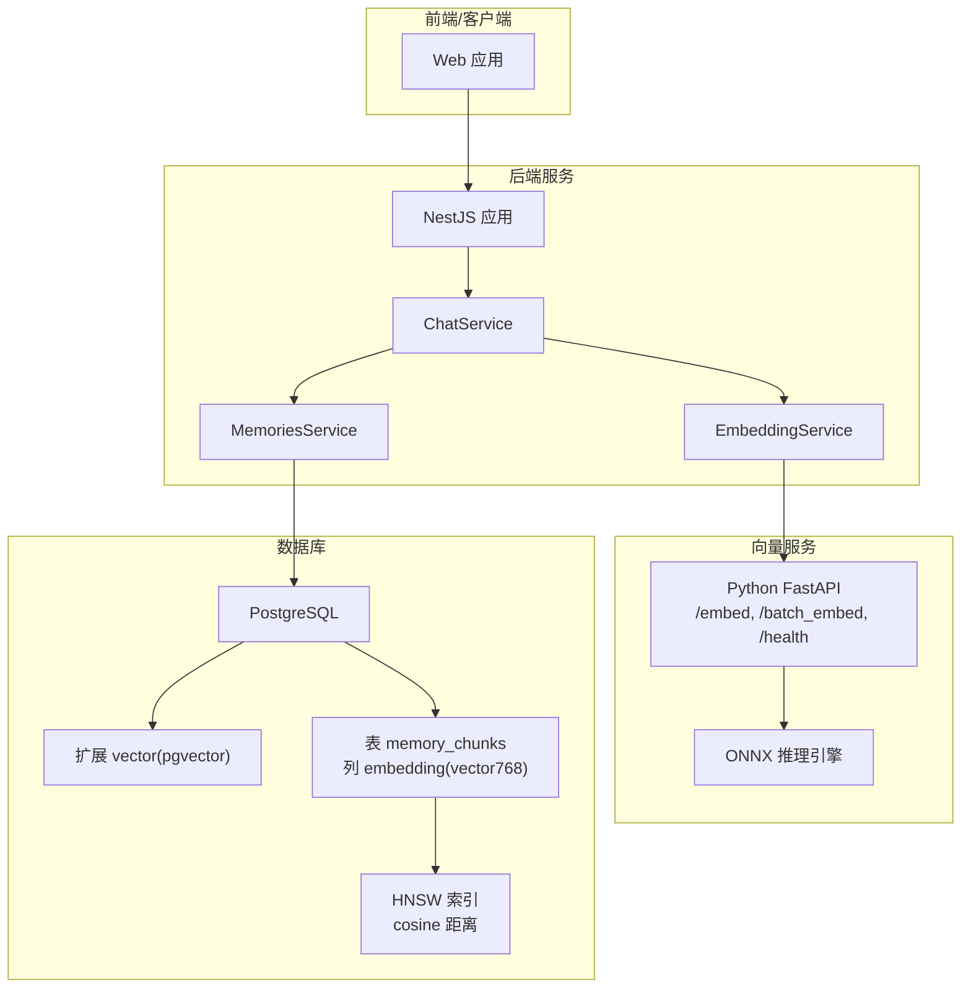
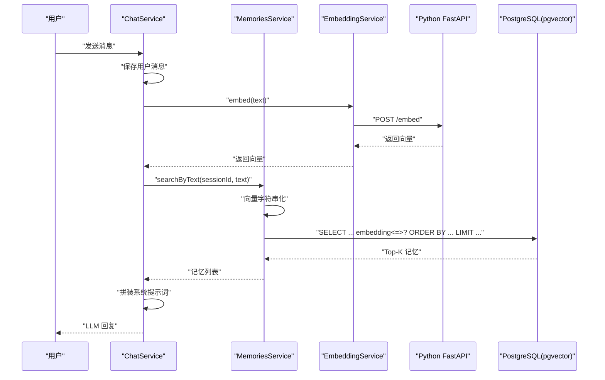
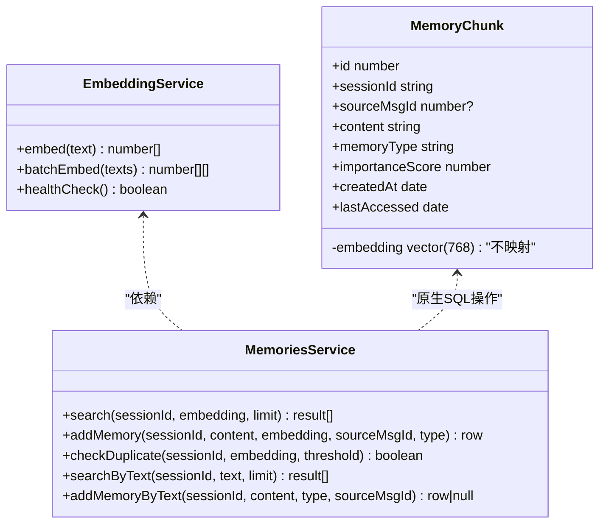
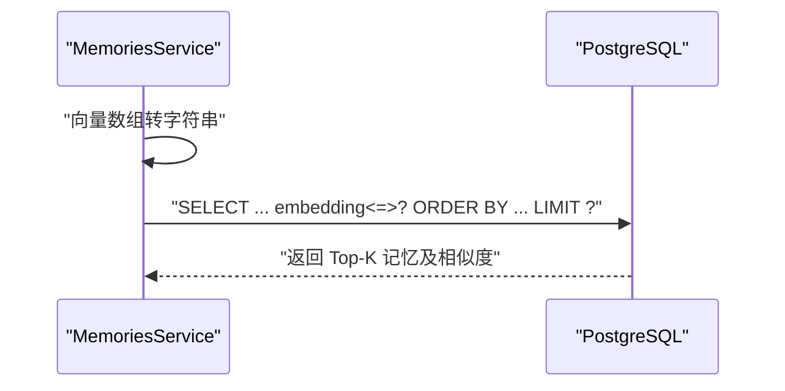
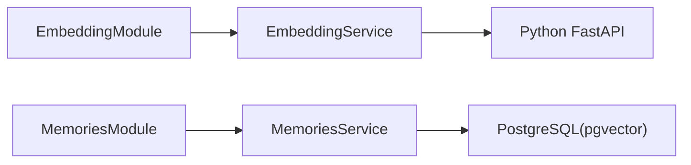

# 向量存储与检索

<cite>
**本文引用的文件**
- [embedding.service.ts](file://src/embedding/embedding.service.ts)
- [embedding.module.ts](file://src/embedding/embedding.module.ts)
- [embedder.py](file://python/embedder.py)
- [main.py](file://python/main.py)
- [memories.service.ts](file://src/memories/memories.service.ts)
- [memories.module.ts](file://src/memories/memories.module.ts)
- [memory.entity.ts](file://src/memories/entities/memory.entity.ts)
- [1710000000000-init-pgvector-schema.ts](file://src/migrations/1710000000000-init-pgvector-schema.ts)
- [chat.service.ts](file://src/chat/chat.service.ts)
- [Learning_Notes.md](file://docs/Learning_Notes.md)
- [AI_Companion_最终方案.md](file://docs/AI_Companion_最终方案.md)
</cite>

## 目录
1. [简介](#简介)
2. [项目结构](#项目结构)
3. [核心组件](#核心组件)
4. [架构总览](#架构总览)
5. [组件详解](#组件详解)
6. [依赖关系分析](#依赖关系分析)
7. [性能考量](#性能考量)
8. [故障排查指南](#故障排查指南)
9. [结论](#结论)
10. [附录](#附录)

## 简介
本技术文档聚焦于 AI Companion 的向量存储与检索体系，系统阐述如下要点：
- pgvector 扩展的使用：向量数据类型、HNSW 索引配置与相似度搜索实现
- 向量嵌入的存储策略：文本预处理、向量计算、批量插入优化
- 相似度检索算法：余弦相似度、欧几里得距离、内积的计算与选择
- 查询性能优化：索引选择、查询优化与缓存机制
- 数据维护与更新：增量更新与批量重建策略
- 实际应用场景与最佳实践

## 项目结构
围绕向量能力的关键目录与文件：
- 向量服务（Python）：FastAPI 提供单条/批量向量化接口
- 向量服务（NestJS）：EmbeddingService 调用 Python 服务，MemoriesService 使用原生 SQL 进行向量检索与写入
- 数据库迁移：创建扩展、表与 HNSW 索引
- 应用编排：ChatService 在对话流程中触发向量检索与记忆提取

图表来源
- [chat.service.ts:65-75](file://src/chat/chat.service.ts#L65-L75)
- [memories.service.ts:36-59](file://src/memories/memories.service.ts#L36-L59)
- [embedding.service.ts:33-42](file://src/embedding/embedding.service.ts#L33-L42)
- [main.py:91-112](file://python/main.py#L91-L112)
- [1710000000000-init-pgvector-schema.ts:71-92](file://src/migrations/1710000000000-init-pgvector-schema.ts#L71-L92)

章节来源
- [embedding.module.ts:1-16](file://src/embedding/embedding.module.ts#L1-L16)
- [embedding.service.ts:1-84](file://src/embedding/embedding.service.ts#L1-L84)
- [embedder.py:1-116](file://python/embedder.py#L1-L116)
- [main.py:1-123](file://python/main.py#L1-L123)
- [memories.module.ts:1-18](file://src/memories/memories.module.ts#L1-L18)
- [memories.service.ts:1-138](file://src/memories/memories.service.ts#L1-L138)
- [memory.entity.ts:1-44](file://src/memories/entities/memory.entity.ts#L1-L44)
- [1710000000000-init-pgvector-schema.ts:1-107](file://src/migrations/1710000000000-init-pgvector-schema.ts#L1-L107)
- [chat.service.ts:1-547](file://src/chat/chat.service.ts#L1-L547)

## 核心组件
- 向量服务（Python）
  - 提供单条与批量向量化接口，使用 ONNX Runtime 推理，支持 mock 模式
- 向量服务（NestJS）
  - EmbeddingService：封装 HTTP 调用，暴露 embed/batchEmbed/healthCheck
  - MemoriesService：原生 SQL 实现向量检索、写入与去重
- 数据库迁移
  - 创建 vector 扩展、memory_chunks 表与 HNSW 索引
- 应用编排
  - ChatService：在对话流程中进行检索与记忆提取

章节来源
- [embedding.service.ts:13-84](file://src/embedding/embedding.service.ts#L13-L84)
- [embedder.py:31-116](file://python/embedder.py#L31-L116)
- [main.py:26-123](file://python/main.py#L26-L123)
- [memories.service.ts:29-138](file://src/memories/memories.service.ts#L29-L138)
- [1710000000000-init-pgvector-schema.ts:6-93](file://src/migrations/1710000000000-init-pgvector-schema.ts#L6-L93)
- [chat.service.ts:65-75](file://src/chat/chat.service.ts#L65-L75)

## 架构总览
整体流程：前端发起对话 → ChatService 保存消息并检索相关记忆 → 通过 EmbeddingService 获取向量 → MemoriesService 使用 pgvector HNSW 索引进行相似度检索 → 返回 Top-K 结果用于系统提示词拼装。

图表来源
- [chat.service.ts:65-75](file://src/chat/chat.service.ts#L65-L75)
- [embedding.service.ts:33-42](file://src/embedding/embedding.service.ts#L33-L42)
- [memories.service.ts:115-118](file://src/memories/memories.service.ts#L115-L118)
- [main.py:91-100](file://python/main.py#L91-L100)

## 组件详解

### 向量服务（Python）
- 职责：加载 Jina v2 base zh 模型，将文本编码为 768 维向量；提供 /embed、/batch_embed、/health 接口
- 特性：支持 mock 模式，便于在模型未下载时验证流程；批量推理提升吞吐
- 环境变量：模型路径、分词器路径、最大长度、是否启用 mock

章节来源
- [embedder.py:1-116](file://python/embedder.py#L1-L116)
- [main.py:1-123](file://python/main.py#L1-L123)

### 向量服务（NestJS）
- EmbeddingService
  - 单条/批量向量化：封装 HTTP 调用，设置超时与错误处理
  - 健康检查：探测 Python 服务可用性
- MemoriesService
  - 相似度检索：使用 pgvector 的余弦距离运算符，转换为相似度
  - 写入记忆：将向量字符串写入 embedding 列
  - 去重：基于余弦相似度阈值判断重复
  - 文本直达：封装“文本→向量化→检索/写入”的便捷方法

章节来源
- [embedding.service.ts:13-84](file://src/embedding/embedding.service.ts#L13-L84)
- [memories.service.ts:29-138](file://src/memories/memories.service.ts#L29-L138)

### 数据库迁移与索引
- 创建扩展：启用 vector/pgvector
- 表结构：memory_chunks 包含 embedding(vector768)、memory_type、importance_score 等
- 索引：HNSW(cosine_ops)，并行使用 m、ef_construction 等参数控制精度与空间

章节来源
- [1710000000000-init-pgvector-schema.ts:6-93](file://src/migrations/1710000000000-init-pgvector-schema.ts#L6-L93)
- [Learning_Notes.md:1116-1129](file://docs/Learning_Notes.md#L1116-L1129)

### 应用编排与检索集成
- ChatService 在对话流程中调用 MemoriesService.searchByText，将检索到的记忆注入系统提示词
- 异步记忆提取：从对话中抽取事实/偏好/情绪，经向量化、去重后写入数据库

章节来源
- [chat.service.ts:65-75](file://src/chat/chat.service.ts#L65-L75)
- [chat.service.ts:249-315](file://src/chat/chat.service.ts#L249-L315)

### 类关系图（代码级）

图表来源
- [embedding.service.ts:13-84](file://src/embedding/embedding.service.ts#L13-L84)
- [memories.service.ts:29-138](file://src/memories/memories.service.ts#L29-L138)
- [memory.entity.ts:16-44](file://src/memories/entities/memory.entity.ts#L16-L44)

### 相似度检索序列图

图表来源
- [memories.service.ts:42-59](file://src/memories/memories.service.ts#L42-L59)

### 相似度算法与计算
- 余弦相似度：通过 1 - (embedding <-> query) 计算，范围 [0,1]
- 欧几里得距离：使用 embedding <-> query（pgvector 提供）
- 内积：可通过向量点积与范数换算得到，亦可直接使用 pgvector 的内积运算符
- 选择建议：中文场景下通常优先余弦相似度；若追求更严格的向量方向一致性，可考虑内积

章节来源
- [memories.service.ts:36-59](file://src/memories/memories.service.ts#L36-L59)
- [Learning_Notes.md:1116-1129](file://docs/Learning_Notes.md#L1116-L1129)

### 向量存储策略
- 文本预处理：在 Python 层使用分词器与最大长度截断，确保输入一致
- 向量计算：ONNX 推理，mean pooling 后归一化，输出 768 维向量
- 批量插入优化：使用 /batch_embed 接口，减少网络往返与推理开销
- 去重策略：基于余弦相似度阈值（默认 0.95）避免重复记忆

章节来源
- [embedder.py:71-116](file://python/embedder.py#L71-L116)
- [embedding.service.ts:56-65](file://src/embedding/embedding.service.ts#L56-L65)
- [memories.service.ts:93-110](file://src/memories/memories.service.ts#L93-L110)

### 数据维护与更新
- 增量更新：对话中异步提取记忆，逐条向量化、去重后写入
- 批量重建：可按需重新计算历史消息的向量并重建索引（需评估成本与停机窗口）

章节来源
- [chat.service.ts:249-315](file://src/chat/chat.service.ts#L249-L315)
- [memories.service.ts:124-136](file://src/memories/memories.service.ts#L124-L136)

## 依赖关系分析
- 模块解耦：EmbeddingModule 与 MemoriesModule 分离，避免 TypeORM 对 vector 类型的支持限制
- 外部依赖：Python FastAPI 仅承担向量化职责，检索由 PostgreSQL 完成
- 数据访问：MemoriesService 直接使用 DataSource 执行原生 SQL，避开 TypeORM 对 vector 的不兼容

图表来源
- [embedding.module.ts:1-16](file://src/embedding/embedding.module.ts#L1-L16)
- [memories.module.ts:1-18](file://src/memories/memories.module.ts#L1-L18)
- [memories.service.ts:30-34](file://src/memories/memories.service.ts#L30-L34)

章节来源
- [embedding.module.ts:1-16](file://src/embedding/embedding.module.ts#L1-L16)
- [memories.module.ts:1-18](file://src/memories/memories.module.ts#L1-L18)
- [memories.service.ts:30-34](file://src/memories/memories.service.ts#L30-L34)

## 性能考量
- 索引选择
  - HNSW(cosine_ops)：适合大规模向量检索，支持余弦相似度
  - 参数调优：m（连接数）、ef_construction（构建搜索深度），平衡精度与资源占用
- 查询优化
  - 使用余弦距离排序并限制返回数量
  - 会话维度过滤：WHERE session_id = ?
- 缓存机制
  - 可在应用层缓存近期高频查询的 Top-K 结果，降低数据库压力
- 批量处理
  - 使用 /batch_embed 提升吞吐
  - 写入时批量 INSERT 以减少事务开销（可在上层聚合后再写入）

章节来源
- [memories.service.ts:36-59](file://src/memories/memories.service.ts#L36-L59)
- [1710000000000-init-pgvector-schema.ts:90-92](file://src/migrations/1710000000000-init-pgvector-schema.ts#L90-L92)
- [Learning_Notes.md:1116-1129](file://docs/Learning_Notes.md#L1116-L1129)

## 故障排查指南
- Python 服务不可用
  - 现象：EmbeddingService.healthCheck 返回 false 或超时
  - 排查：确认 PYTHON_EMBED_URL、端口映射、容器网络与模型文件是否存在
- 向量维度不匹配
  - 现象：写入时报错或检索异常
  - 排查：确认 Python 输出维度为 768，且与数据库 embedding(vector768) 一致
- HNSW 索引缺失或失效
  - 现象：检索变慢或报错
  - 排查：确认扩展与索引存在，必要时重建索引
- 重复记忆过多
  - 现象：checkDuplicate 始终返回 true
  - 排查：调整相似度阈值或检查向量质量

章节来源
- [embedding.service.ts:70-82](file://src/embedding/embedding.service.ts#L70-L82)
- [memories.service.ts:93-110](file://src/memories/memories.service.ts#L93-L110)
- [1710000000000-init-pgvector-schema.ts:6-93](file://src/migrations/1710000000000-init-pgvector-schema.ts#L6-L93)

## 结论
本方案采用“Python 向量服务 + PostgreSQL pgvector + NestJS 编排”的组合，既满足中文场景下的高精度检索需求，又保持了前后端职责清晰、部署与维护简单。通过 HNSW 索引与批量处理，系统在吞吐与延迟之间取得良好平衡；结合去重与异步记忆提取，持续优化记忆质量与用户体验。

## 附录
- 实际应用场景
  - 对话上下文增强：将检索到的记忆注入系统提示词
  - 用户画像与偏好学习：从对话中抽取并沉淀偏好/情绪记忆
  - 滚动摘要：结合检索记忆与近期对话生成摘要，降低上下文长度
- 最佳实践
  - 严格区分“关系字段”与“向量字段”，后者使用原生 SQL
  - 使用 /batch_embed 提升吞吐，合理设置阈值避免重复
  - 定期评估索引参数与数据规模，按需重建或扩容

章节来源
- [chat.service.ts:424-497](file://src/chat/chat.service.ts#L424-L497)
- [AI_Companion_最终方案.md:252-313](file://docs/AI_Companion_最终方案.md#L252-L313)