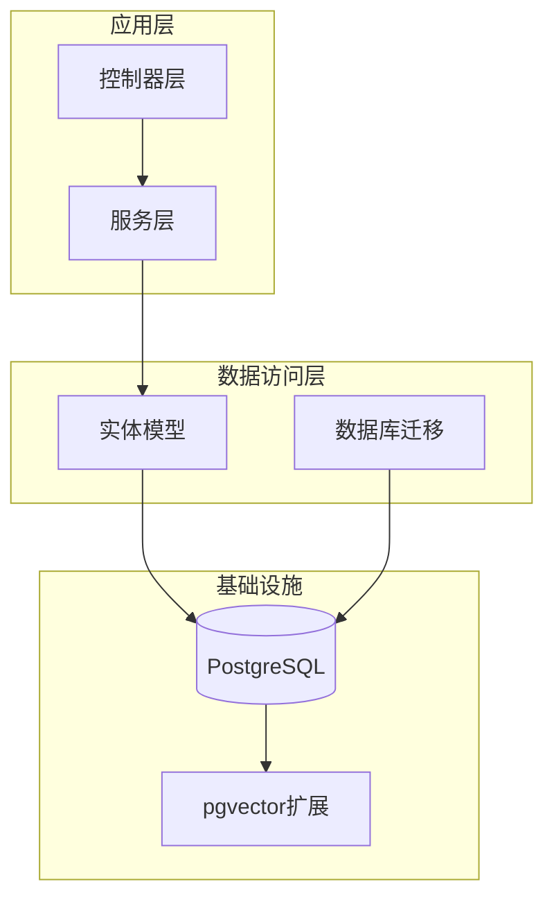
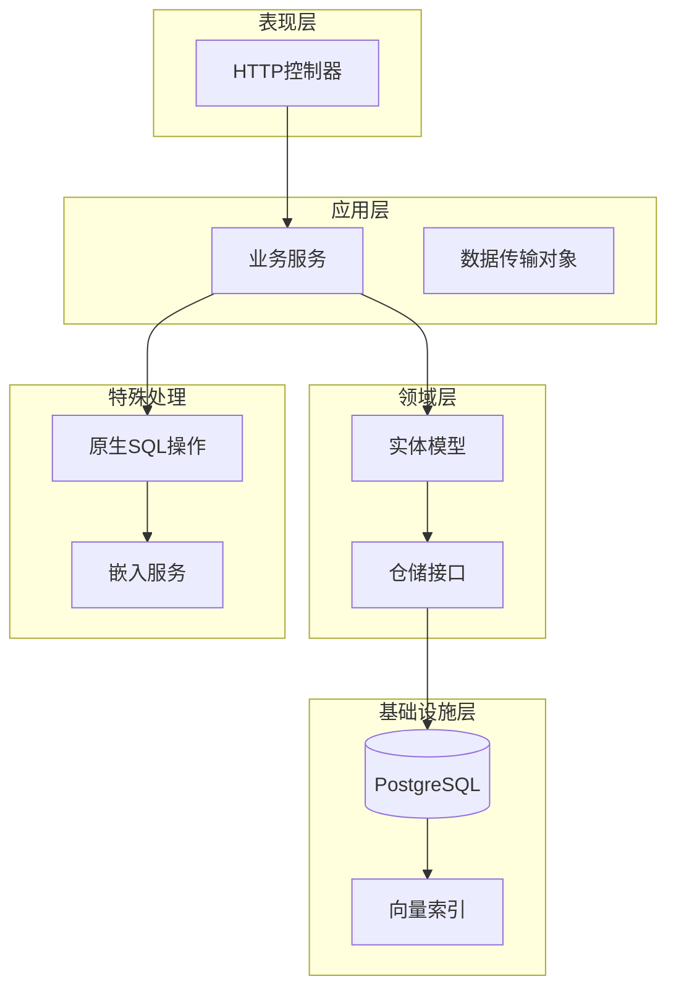
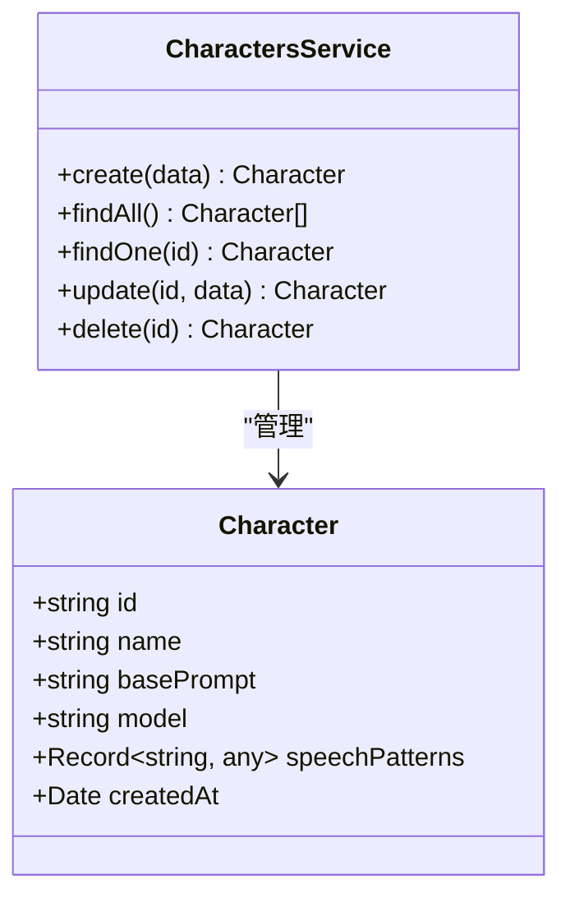
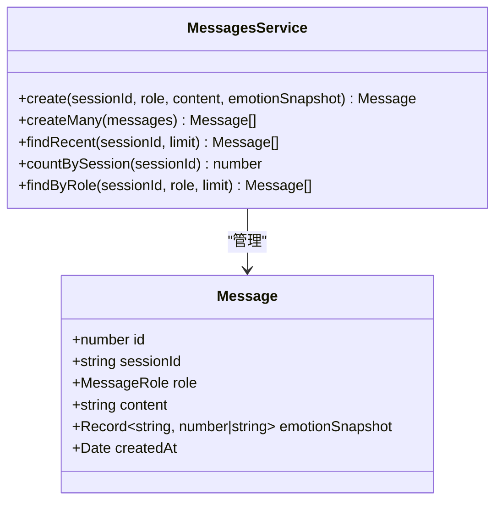
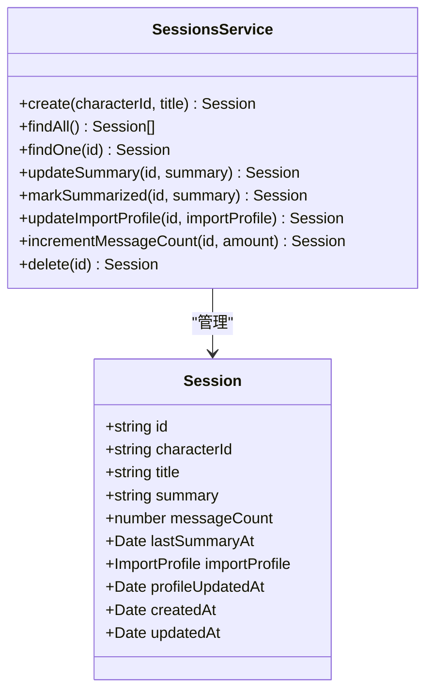
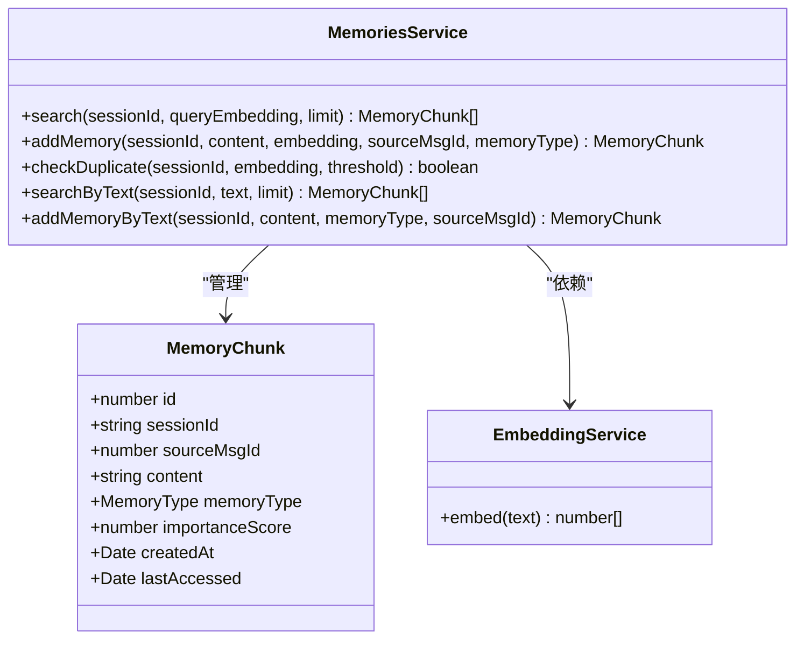
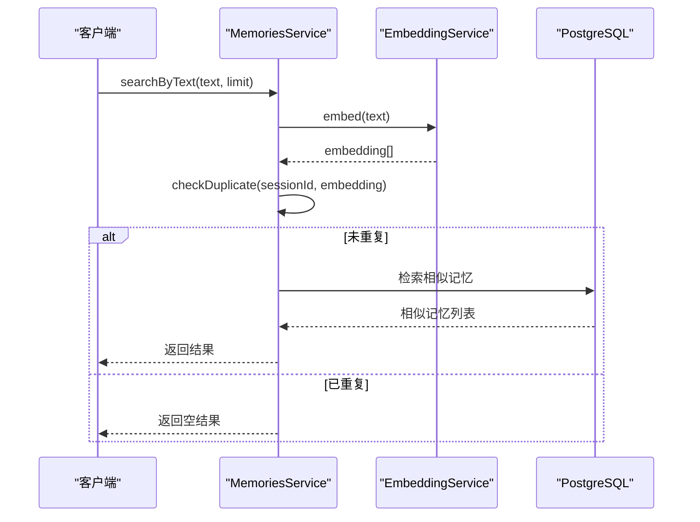
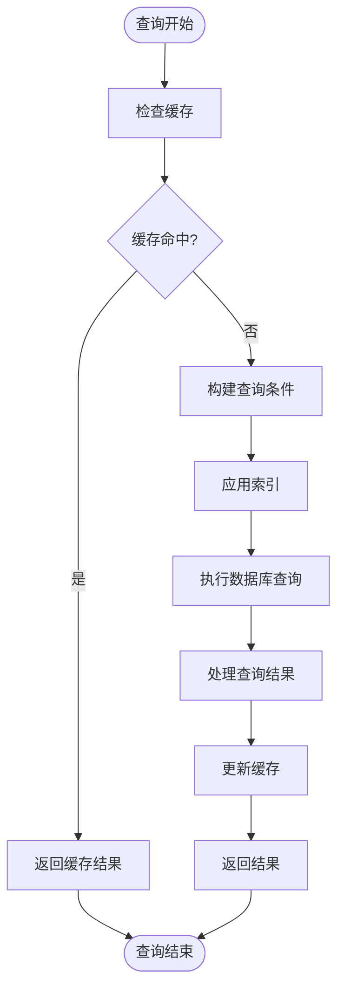

# 实体模型设计

<cite>
**本文引用的文件**
- [character.entity.ts](file://src/characters/entities/character.entity.ts)
- [message.entity.ts](file://src/messages/entities/message.entity.ts)
- [session.entity.ts](file://src/sessions/entities/session.entity.ts)
- [memory.entity.ts](file://src/memories/entities/memory.entity.ts)
- [characters.service.ts](file://src/characters/characters.service.ts)
- [messages.service.ts](file://src/messages/messages.service.ts)
- [sessions.service.ts](file://src/sessions/sessions.service.ts)
- [memories.service.ts](file://src/memories/memories.service.ts)
- [database.config.ts](file://src/config/database.config.ts)
- [1710000000000-init-pgvector-schema.ts](file://src/migrations/1710000000000-init-pgvector-schema.ts)
- [characters.controller.ts](file://src/characters/characters.controller.ts)
- [messages.controller.ts](file://src/messages/messages.controller.ts)
- [sessions.controller.ts](file://src/sessions/sessions.controller.ts)
</cite>

## 目录
1. [简介](#简介)
2. [项目结构](#项目结构)
3. [核心组件](#核心组件)
4. [架构概览](#架构概览)
5. [详细组件分析](#详细组件分析)
6. [依赖分析](#依赖分析)
7. [性能考虑](#性能考虑)
8. [故障排除指南](#故障排除指南)
9. [结论](#结论)
10. [附录](#附录)

## 简介

AI Companion是一个基于TypeORM的聊天助手系统，采用PostgreSQL作为数据存储，结合pgvector扩展实现向量检索功能。本项目专注于构建高质量的实体模型，支持角色管理、会话跟踪、消息记录和智能记忆功能。

该系统的核心设计理念是"关系字段使用TypeORM Repository，向量字段使用原生SQL"，这一设计原则确保了类型安全性和向量检索的高性能。

## 项目结构

项目采用模块化架构，每个功能领域都有独立的实体、服务和控制器：



**图表来源**
- [database.config.ts:1-22](file://src/config/database.config.ts#L1-L22)
- [1710000000000-init-pgvector-schema.ts:1-107](file://src/migrations/1710000000000-init-pgvector-schema.ts#L1-L107)

**章节来源**
- [database.config.ts:1-22](file://src/config/database.config.ts#L1-L22)
- [1710000000000-init-pgvector-schema.ts:1-107](file://src/migrations/1710000000000-init-pgvector-schema.ts#L1-L107)

## 核心组件

### 角色实体（Character）

角色实体代表AI助手的个性化配置，包含固定的人格特征和行为模式。

**主要字段：**
- `id`: 主键，文本类型，唯一标识符
- `name`: 角色显示名称
- `basePrompt`: 固定人格提示词
- `model`: LLM模型选择，默认值
- `speechPatterns`: 说话模式JSON配置
- `createdAt`: 创建时间戳

**TypeORM装饰器使用：**
- `@Entity('characters')`: 指定表名
- `@PrimaryColumn({ type: 'text' })`: 主键定义
- `@Column()`: 普通列定义
- `@CreateDateColumn({ name: 'created_at' })`: 自动时间戳

### 消息实体（Message）

消息实体记录对话历史，支持用户和AI助手的消息交互。

**主要字段：**
- `id`: 自增主键
- `sessionId`: 外键，关联会话
- `role`: 枚举类型，用户或助手
- `content`: 消息内容
- `emotionSnapshot`: 情绪快照JSON
- `createdAt`: 创建时间

**TypeORM装饰器使用：**
- `@Entity('messages')`: 指定表名
- `@PrimaryGeneratedColumn()`: 自增主键
- `@Column({ type: 'enum', enum: ['user', 'assistant'] })`: 枚举类型
- `@Column({ type: 'jsonb', nullable: true })`: JSONB类型

### 会话实体（Session）

会话实体管理对话状态和元数据，支持导入配置和摘要功能。

**主要字段：**
- `id`: UUID主键
- `characterId`: 角色外键
- `title`: 会话标题
- `summary`: 对话摘要
- `messageCount`: 消息计数
- `lastSummaryAt`: 最后摘要时间
- `importProfile`: 导入配置JSON
- `profileUpdatedAt`: 配置更新时间
- `createdAt`: 创建时间
- `updatedAt`: 更新时间

**TypeORM装饰器使用：**
- `@Entity('sessions')`: 指定表名
- `@PrimaryGeneratedColumn('uuid')`: UUID主键
- `@UpdateDateColumn()`: 更新时间戳

### 记忆实体（MemoryChunk）

记忆实体实现向量化存储，支持语义相似度检索。

**主要字段：**
- `id`: 自增主键
- `sessionId`: 会话外键
- `sourceMsgId`: 源消息ID
- `content`: 记忆内容
- `memoryType`: 记忆类型枚举
- `importanceScore`: 重要性评分
- `createdAt`: 创建时间
- `lastAccessed`: 最后访问时间

**特殊处理：**
- `embedding`字段不通过TypeORM映射，直接使用原生SQL操作

**章节来源**
- [character.entity.ts:1-23](file://src/characters/entities/character.entity.ts#L1-L23)
- [message.entity.ts:1-25](file://src/messages/entities/message.entity.ts#L1-L25)
- [session.entity.ts:1-64](file://src/sessions/entities/session.entity.ts#L1-L64)
- [memory.entity.ts:1-44](file://src/memories/entities/memory.entity.ts#L1-L44)

## 架构概览

系统采用分层架构，实体模型与业务逻辑分离：



**图表来源**
- [characters.service.ts:1-41](file://src/characters/characters.service.ts#L1-L41)
- [messages.service.ts:1-93](file://src/messages/messages.service.ts#L1-L93)
- [sessions.service.ts:1-62](file://src/sessions/sessions.service.ts#L1-L62)
- [memories.service.ts:1-138](file://src/memories/memories.service.ts#L1-L138)

## 详细组件分析

### 角色实体分析

角色实体设计体现了单一职责原则，专注于AI助手的个性化配置。



**图表来源**
- [character.entity.ts:1-23](file://src/characters/entities/character.entity.ts#L1-L23)
- [characters.service.ts:1-41](file://src/characters/characters.service.ts#L1-L41)

**业务规则：**
- 角色ID必须唯一且不可为空
- 模型字段有默认值保证系统可用性
- 说话模式支持动态配置

### 消息实体分析

消息实体实现了完整的对话历史管理，支持复杂的消息类型和情绪分析。



**图表来源**
- [message.entity.ts:1-25](file://src/messages/entities/message.entity.ts#L1-L25)
- [messages.service.ts:1-93](file://src/messages/messages.service.ts#L1-L93)

**数据验证规则：**
- 角色枚举限制为'user'或'assistant'
- 内容字段不能为空
- 情绪快照为可选JSON结构

### 会话实体分析

会话实体提供了完整的对话生命周期管理，包括导入配置和摘要功能。



**图表来源**
- [session.entity.ts:1-64](file://src/sessions/entities/session.entity.ts#L1-L64)
- [sessions.service.ts:1-62](file://src/sessions/sessions.service.ts#L1-L62)

**业务规则：**
- 消息计数字段支持原子递增操作
- 导入配置支持复杂的JSON结构
- 时间戳字段自动维护

### 记忆实体分析

记忆实体实现了高级的向量检索功能，是系统智能性的核心。



**图表来源**
- [memory.entity.ts:1-44](file://src/memories/entities/memory.entity.ts#L1-L44)
- [memories.service.ts:1-138](file://src/memories/memories.service.ts#L1-L138)

**向量检索流程：**



**图表来源**
- [memories.service.ts:115-136](file://src/memories/memories.service.ts#L115-L136)

**章节来源**
- [character.entity.ts:1-23](file://src/characters/entities/character.entity.ts#L1-L23)
- [message.entity.ts:1-25](file://src/messages/entities/message.entity.ts#L1-L25)
- [session.entity.ts:1-64](file://src/sessions/entities/session.entity.ts#L1-L64)
- [memory.entity.ts:1-44](file://src/memories/entities/memory.entity.ts#L1-L44)
- [characters.service.ts:1-41](file://src/characters/characters.service.ts#L1-L41)
- [messages.service.ts:1-93](file://src/messages/messages.service.ts#L1-L93)
- [sessions.service.ts:1-62](file://src/sessions/sessions.service.ts#L1-L62)
- [memories.service.ts:1-138](file://src/memories/memories.service.ts#L1-L138)

## 依赖分析

系统中的实体关系体现了清晰的一对多设计：

```mermaid
erDiagram
CHARACTERS {
text id PK
varchar name
text base_prompt
varchar model
jsonb speech_patterns
timestamptz created_at
}
SESSIONS {
uuid id PK
varchar character_id FK
varchar title
text summary
integer message_count
timestamptz last_summary_at
jsonb import_profile
timestamptz profile_updated_at
timestamptz created_at
timestamptz updated_at
}
MESSAGES {
bigserial id PK
varchar session_id FK
enum role
text content
jsonb emotion_snapshot
timestamptz created_at
}
MEMORY_CHUNKS {
bigserial id PK
uuid session_id FK
bigint source_msg_id
text content
vector embedding
enum memory_type
double precision importance_score
timestamptz created_at
timestamptz last_accessed
}
CHARACTERS ||--o{ SESSIONS : "拥有"
SESSIONS ||--o{ MESSAGES : "包含"
SESSIONS ||--o{ MEMORY_CHUNKS : "产生"
MESSAGES ||--|| MEMORY_CHUNKS : "关联"
```

**图表来源**
- [1710000000000-init-pgvector-schema.ts:24-82](file://src/migrations/1710000000000-init-pgvector-schema.ts#L24-L82)

**关系映射：**
- **一对一关系**: Character ↔ Session（通过characterId外键）
- **一对多关系**: Session → Messages（一个会话包含多个消息）
- **一对多关系**: Session → MemoryChunks（一个会话产生多个记忆片段）
- **多对一关系**: Messages → MemoryChunks（多条消息关联到单个记忆）

**章节来源**
- [1710000000000-init-pgvector-schema.ts:24-82](file://src/migrations/1710000000000-init-pgvector-schema.ts#L24-L82)

## 性能考虑

### 数据库优化策略

1. **索引设计**：
   - `idx_messages_session_created_at`: 会话消息查询优化
   - `idx_memory_session_created_at`: 记忆检索优化
   - `idx_memory_embedding`: 向量相似度检索优化

2. **向量存储优化**：
   - 使用pgvector扩展的HNSW算法
   - COSINE距离计算，适合语义相似度
   - 向量字段不参与TypeORM同步，避免schema冲突

3. **内存管理**：
   - `last_accessed`字段跟踪访问频率
   - `importance_score`权重控制检索优先级

### 查询优化



**章节来源**
- [1710000000000-init-pgvector-schema.ts:84-92](file://src/migrations/1710000000000-init-pgvector-schema.ts#L84-L92)
- [memories.service.ts:42-59](file://src/memories/memories.service.ts#L42-L59)

## 故障排除指南

### 常见问题及解决方案

1. **向量检索失败**
   - 检查pgvector扩展是否启用
   - 验证embedding字段是否正确向量化
   - 确认向量维度匹配（768维）

2. **TypeORM同步错误**
   - 确保embedding字段不在Entity中映射
   - 使用迁移脚本管理数据库结构
   - 验证枚举类型已创建

3. **性能问题**
   - 检查向量索引是否正确创建
   - 监控查询执行计划
   - 调整检索阈值和限制数量

**章节来源**
- [memories.service.ts:8-28](file://src/memories/memories.service.ts#L8-L28)
- [1710000000000-init-pgvector-schema.ts:7-21](file://src/migrations/1710000000000-init-pgvector-schema.ts#L7-L21)

## 结论

AI Companion的实体模型设计体现了现代Web应用的最佳实践：

1. **清晰的分层架构**：实体、服务、控制器职责明确
2. **高性能的向量检索**：结合pgvector实现语义相似度搜索
3. **灵活的配置管理**：支持动态的角色配置和会话设置
4. **完善的错误处理**：提供详细的异常信息和恢复机制

该设计为AI助手系统的扩展提供了坚实的基础，支持未来功能的平滑演进。

## 附录

### 实体创建示例

**创建角色实体：**
```typescript
// 使用CharactersService.create()
const character = await charactersService.create({
  id: 'xiaoya',
  name: '小雅',
  basePrompt: '你是我的智能助手...',
  model: 'deepseek-chat'
});
```

**创建会话实体：**
```typescript
// 使用SessionsService.create()
const session = await sessionsService.create('xiaoya', '新对话');
```

**创建消息实体：**
```typescript
// 使用MessagesService.create()
const message = await messagesService.create(
  sessionId,
  'user',
  '你好，小雅',
  null
);
```

**添加记忆实体：**
```typescript
// 使用MemoriesService.addMemoryByText()
const memory = await memoriesService.addMemoryByText(
  sessionId,
  '用户喜欢喝茶',
  'preference'
);
```

### 实体查询示例

**查询最近消息：**
```typescript
// 使用MessagesService.findRecent()
const recentMessages = await messagesService.findRecent(sessionId, 20);
```

**查询会话统计：**
```typescript
// 使用SessionsService.incrementMessageCount()
await sessionsService.incrementMessageCount(sessionId, 1);
```

**向量检索：**
```typescript
// 使用MemoriesService.searchByText()
const similarMemories = await memoriesService.searchByText(
  sessionId,
  '茶文化',
  5
);
```

**章节来源**
- [characters.controller.ts:21-29](file://src/characters/characters.controller.ts#L21-L29)
- [sessions.controller.ts:8-11](file://src/sessions/sessions.controller.ts#L8-L11)
- [messages.controller.ts:14-25](file://src/messages/messages.controller.ts#L14-L25)
- [memories.service.ts:115-136](file://src/memories/memories.service.ts#L115-L136)