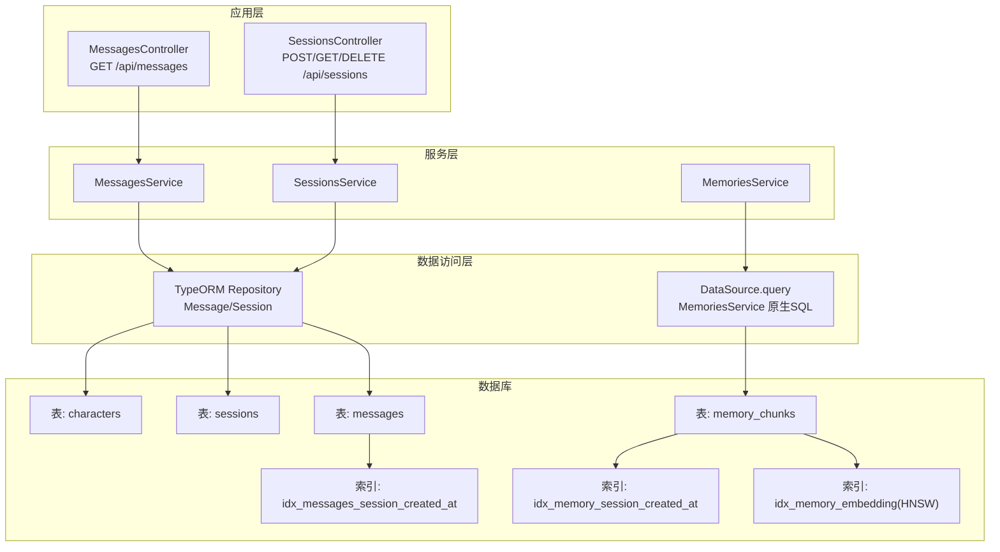
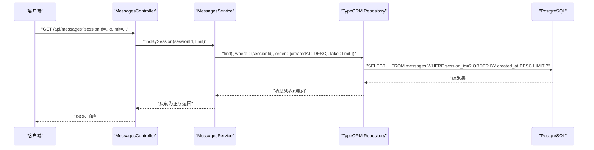
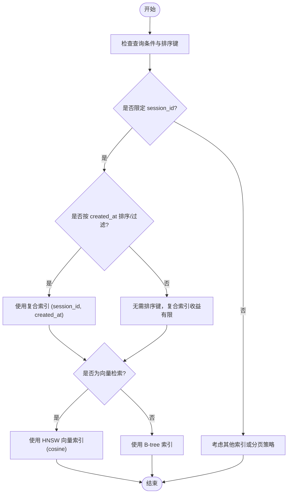
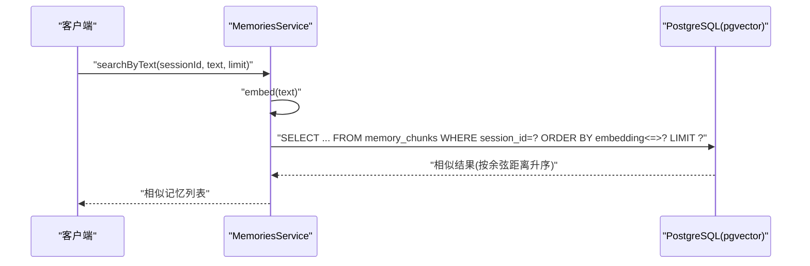
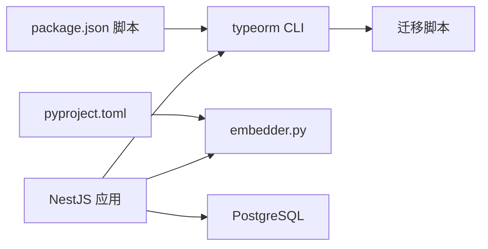

# 性能优化与索引设计

<cite>
**本文引用的文件**
- [database.config.ts](file://src/config/database.config.ts)
- [1710000000000-init-pgvector-schema.ts](file://src/migrations/1710000000000-init-pgvector-schema.ts)
- [memory.entity.ts](file://src/memories/entities/memory.entity.ts)
- [memories.service.ts](file://src/memories/memories.service.ts)
- [messages.service.ts](file://src/messages/messages.service.ts)
- [messages.controller.ts](file://src/messages/messages.controller.ts)
- [sessions.service.ts](file://src/sessions/sessions.service.ts)
- [sessions.controller.ts](file://src/sessions/sessions.controller.ts)
- [embedder.py](file://python/embedder.py)
- [pyproject.toml](file://python/pyproject.toml)
- [package.json](file://package.json)
</cite>

## 目录
1. [简介](#简介)
2. [项目结构](#项目结构)
3. [核心组件](#核心组件)
4. [架构总览](#架构总览)
5. [详细组件分析](#详细组件分析)
6. [依赖分析](#依赖分析)
7. [性能考虑](#性能考虑)
8. [故障排查指南](#故障排查指南)
9. [结论](#结论)
10. [附录](#附录)

## 简介
本文件面向“AI Companion”数据库性能优化，聚焦以下主题：
- 索引设计策略：B-tree 复合索引、HNSW 向量索引与复合索引的使用场景与权衡
- 查询优化技术：执行计划分析、查询重写与索引使用建议
- 数据库性能监控：慢查询日志、性能指标采集与瓶颈识别
- 连接池配置优化：最大连接数、超时设置与资源管理
- 数据分区与分片策略：按时间与业务维度的分区方案
- 性能测试与基准：测试方法与结果分析
- 生产环境调优经验与最佳实践

本项目采用 PostgreSQL + pgvector 实现向量检索，并通过 TypeORM 管理关系型数据；同时在向量相关能力上采用原生 SQL 以绕过 TypeORM 对向量类型的支持限制。

## 项目结构
后端基于 NestJS，数据库通过 TypeORM 配置；迁移脚本初始化表结构与索引，其中包含：
- 角色、会话、消息、记忆碎片等表
- 消息与记忆碎片的复合索引
- 记忆碎片向量列的 HNSW 索引

图表来源
- [messages.controller.ts:10-26](file://src/messages/messages.controller.ts#L10-L26)
- [sessions.controller.ts:4-27](file://src/sessions/sessions.controller.ts#L4-L27)
- [messages.service.ts:23-92](file://src/messages/messages.service.ts#L23-L92)
- [sessions.service.ts:7-61](file://src/sessions/sessions.service.ts#L7-L61)
- [memories.service.ts:30-137](file://src/memories/memories.service.ts#L30-L137)
- [1710000000000-init-pgvector-schema.ts:60-92](file://src/migrations/1710000000000-init-pgvector-schema.ts#L60-L92)

章节来源
- [database.config.ts:8-20](file://src/config/database.config.ts#L8-L20)
- [1710000000000-init-pgvector-schema.ts:6-92](file://src/migrations/1710000000000-init-pgvector-schema.ts#L6-L92)

## 核心组件
- 数据源配置：定义 PostgreSQL 连接参数、实体扫描、迁移与日志开关
- 迁移脚本：创建扩展、枚举类型、表结构与索引
- 服务层：
  - MessagesService：基于 TypeORM Repository 的消息 CRUD 与最近消息查询
  - SessionsService：会话管理与统计
  - MemoriesService：原生 SQL 实现向量插入、相似度检索与去重
- 控制器层：对外暴露 REST API，驱动服务层执行业务操作

章节来源
- [database.config.ts:8-20](file://src/config/database.config.ts#L8-L20)
- [1710000000000-init-pgvector-schema.ts:6-92](file://src/migrations/1710000000000-init-pgvector-schema.ts#L6-L92)
- [messages.service.ts:23-92](file://src/messages/messages.service.ts#L23-L92)
- [sessions.service.ts:7-61](file://src/sessions/sessions.service.ts#L7-L61)
- [memories.service.ts:30-137](file://src/memories/memories.service.ts#L30-L137)
- [messages.controller.ts:10-26](file://src/messages/messages.controller.ts#L10-L26)
- [sessions.controller.ts:4-27](file://src/sessions/sessions.controller.ts#L4-L27)

## 架构总览
系统围绕“关系型数据 + 向量检索”的混合存储展开：
- 关系型数据（角色、会话、消息）由 TypeORM 管理，具备良好的 ORM 能力与迁移支持
- 向量数据（记忆碎片）通过原生 SQL 管理，利用 HNSW 索引实现高效相似度检索
- 控制器层统一对外提供 API，服务层协调数据访问与业务逻辑

图表来源
- [messages.controller.ts:14-25](file://src/messages/messages.controller.ts#L14-L25)
- [messages.service.ts:67-74](file://src/messages/messages.service.ts#L67-L74)

## 详细组件分析

### 数据库索引设计策略
- B-tree 复合索引
  - 消息表：(session_id, created_at) 复合索引，支撑“按会话取最近 N 条消息”的高效查询
  - 记忆碎片表：(session_id, created_at) 复合索引，支撑按会话与时间范围检索
- HNSW 向量索引
  - 记忆碎片表 embedding 列使用 HNSW，结合余弦距离运算符实现近似最近邻检索
- 复合索引使用场景与权衡
  - 当查询条件包含 session_id 且排序或过滤依赖 created_at 时，复合索引可避免额外排序与全表扫描
  - 向量检索优先使用 HNSW，避免对大向量列进行 B-tree 排序

图表来源
- [1710000000000-init-pgvector-schema.ts:84-92](file://src/migrations/1710000000000-init-pgvector-schema.ts#L84-L92)
- [memories.service.ts:42-59](file://src/memories/memories.service.ts#L42-L59)

章节来源
- [1710000000000-init-pgvector-schema.ts:84-92](file://src/migrations/1710000000000-init-pgvector-schema.ts#L84-L92)
- [memories.service.ts:42-59](file://src/memories/memories.service.ts#L42-L59)

### 查询优化技术
- 执行计划分析
  - 使用 EXPLAIN/EXPLAIN ANALYZE 分析关键查询（如按会话取最近消息、向量相似度检索）
  - 关注是否命中复合索引、是否存在排序、是否发生全表扫描
- 查询重写与索引使用建议
  - 最近消息查询：确保 WHERE 条件与 ORDER BY 键匹配复合索引顺序，避免额外排序
  - 向量检索：使用余弦距离运算符与 HNSW 索引，合理设置 LIMIT 与阈值
  - 去重策略：先用阈值过滤，再进行相似度计算，减少不必要的比较
- 服务层实现要点
  - 消息服务：通过 TypeORM 的 find + take + order 实现高效分页
  - 记忆服务：原生 SQL 直接使用向量索引，避免 ORM 层开销

图表来源
- [memories.service.ts:115-118](file://src/memories/memories.service.ts#L115-L118)
- [memories.service.ts:42-59](file://src/memories/memories.service.ts#L42-L59)

章节来源
- [messages.service.ts:67-74](file://src/messages/messages.service.ts#L67-L74)
- [memories.service.ts:115-118](file://src/memories/memories.service.ts#L115-L118)
- [memories.service.ts:42-59](file://src/memories/memories.service.ts#L42-L59)

### 数据库性能监控
- 慢查询日志
  - 在数据库层面启用慢查询日志，记录超过阈值的 SQL 语句与耗时
  - 结合应用侧日志（TypeORM logging）定位热点接口与查询
- 性能指标采集
  - 收集 QPS、P95/P99 延迟、连接数、锁等待、缓冲区命中率等
  - 针对向量检索设置独立指标，观察 HNSW 索引命中与相似度计算耗时
- 瓶颈识别
  - 通过执行计划与指标对比，识别是否因缺少索引、排序不当或锁竞争导致性能问题

[本节为通用指导，不直接分析具体文件]

### 连接池配置优化
- 最大连接数
  - 根据并发请求量与数据库承载能力设定上限，避免连接过多导致上下文切换与内存压力
- 超时设置
  - 查询超时、连接超时与空闲回收策略需协同配置，防止长事务占用连接
- 资源管理
  - 合理关闭连接、避免连接泄漏；对向量检索等高成本操作单独限流

[本节为通用指导，不直接分析具体文件]

### 数据分区与分片策略
- 按时间分区
  - 消息与记忆碎片可按 created_at 进行分区，便于归档与清理历史数据
- 按业务维度分片
  - 以会话 ID 或角色 ID 进行分片，降低跨分片 JOIN 成本
- 注意事项
  - 分区键选择需与常见查询模式一致，避免跨分区扫描
  - 分片键变更需谨慎，避免大规模重分布

[本节为通用指导，不直接分析具体文件]

### 性能测试与基准
- 测试方法
  - 基准测试：固定负载下测量不同索引策略下的吞吐与延迟
  - 压力测试：逐步提升并发与数据规模，观察系统拐点
  - 场景化测试：模拟“最近消息查询”“向量相似度检索”“去重插入”等关键路径
- 结果分析
  - 对比复合索引与 HNSW 的检索延迟、准确率与资源占用
  - 分析不同 LIMIT 与阈值对性能的影响

[本节为通用指导，不直接分析具体文件]

### 生产环境调优经验与最佳实践
- 索引维护
  - 定期重建或重组织索引，保持统计信息新鲜
- 查询规范
  - 明确 WHERE/ORDER/LIMIT 的使用，避免隐式转换与函数包裹索引列
- 资源隔离
  - 将高成本向量检索与常规查询分离到不同实例或只读副本
- 监控告警
  - 建立数据库与应用双层监控，设置延迟与错误率阈值告警

[本节为通用指导，不直接分析具体文件]

## 依赖分析
- 应用依赖
  - NestJS + TypeORM：关系型数据管理与迁移
  - PostgreSQL：关系型与向量存储
  - Python ONNX Runtime：文本向量化
- 运行脚本
  - TypeORM CLI：迁移生成与执行
  - 包管理脚本：构建、测试与迁移命令

图表来源
- [package.json:24-27](file://package.json#L24-L27)
- [pyproject.toml:6-16](file://python/pyproject.toml#L6-L16)

章节来源
- [package.json:24-27](file://package.json#L24-L27)
- [pyproject.toml:6-16](file://python/pyproject.toml#L6-L16)

## 性能考虑
- 向量检索路径
  - 使用 HNSW 与余弦距离，避免对大向量列进行排序
  - 合理设置 LIMIT 与相似度阈值，减少结果集大小
- 关系查询路径
  - 利用复合索引 (session_id, created_at)，避免额外排序
  - 通过 take 限制返回数量，控制内存与网络开销
- 日志与诊断
  - 开发阶段开启 TypeORM 日志，定位慢查询
  - 生产环境结合数据库慢查询日志与应用埋点，持续观测

章节来源
- [database.config.ts:19-19](file://src/config/database.config.ts#L19-L19)
- [1710000000000-init-pgvector-schema.ts:84-92](file://src/migrations/1710000000000-init-pgvector-schema.ts#L84-L92)
- [messages.service.ts:67-74](file://src/messages/messages.service.ts#L67-L74)
- [memories.service.ts:42-59](file://src/memories/memories.service.ts#L42-L59)

## 故障排查指南
- 向量检索异常
  - 确认 pgvector 扩展已安装、HNSW 索引存在
  - 检查 embedding 列类型与向量维度是否匹配
- 查询性能下降
  - 使用 EXPLAIN 分析执行计划，确认索引被使用
  - 检查 WHERE 条件与 ORDER BY 是否与索引键一致
- 连接问题
  - 核对数据库连接参数与网络连通性
  - 检查连接池配置与超时设置

章节来源
- [1710000000000-init-pgvector-schema.ts:6-14](file://src/migrations/1710000000000-init-pgvector-schema.ts#L6-L14)
- [database.config.ts:8-20](file://src/config/database.config.ts#L8-L20)

## 结论
本项目在关系型数据与向量检索之间实现了清晰的职责分离：TypeORM 负责结构化数据管理，原生 SQL 与 HNSW 索引保障向量检索效率。通过合理的索引设计与查询优化，配合完善的监控与测试体系，可有效支撑高并发与低延迟的对话体验。

## 附录
- 向量模型与推理
  - 使用 ONNX Runtime 加载 Jina v2 中文模型，提供 768 维向量输出
  - 支持批处理推理，降低单次调用开销

章节来源
- [embedder.py:31-116](file://python/embedder.py#L31-L116)
- [pyproject.toml:6-16](file://python/pyproject.toml#L6-L16)